# 第一节 简单句的核心构成

#### 概述

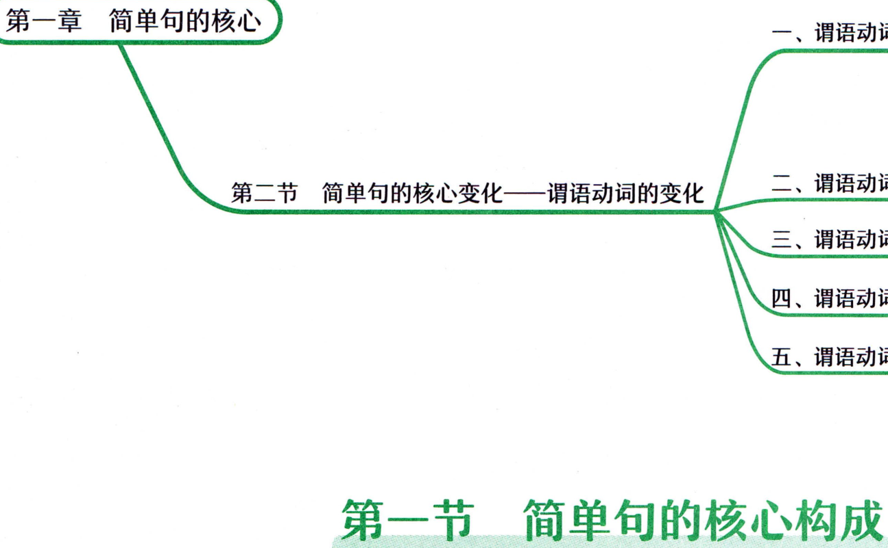

```text
第一章简单句的核心
第二节简单句的核心变化一—谓语动词的变化
第一节简单句的核心构成
```

## Uu)hatis简单句？简单句的核心构成?

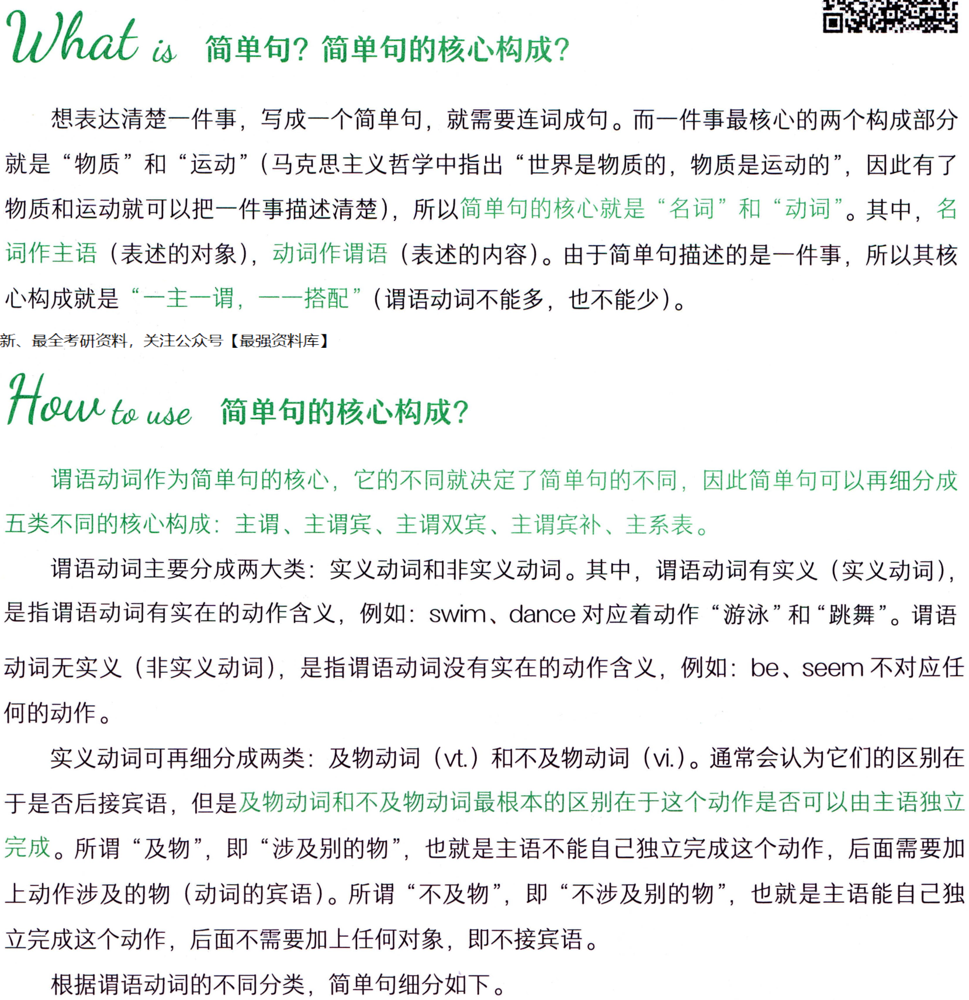

```text
Uu)hatis简单句？简单句的核心构成?
想表达清楚一件事，写成一个简单句，就需要连词成句。而一件事最核心的两个构成部分
就是“物质”和“运动”（马克思主义哲学中指出“世界是物质的，物质是运动的”，因此有了
物质和运动就可以把一件事描述清楚)，所以简单句的核心就是“名词”和“动词”。其中，名
词作主语（表述的对象)，动词作谓语(表述的内容)。由于简单句描述的是一件事，所以其核
心构成就是“一主一谓，一一搭配”（谓语动词不能多，也不能少）。
谓语动词作为简单句的核心，它的不同就决定了简单句的不同，因此简单句可以再细分成
五类不同的核心构成：主谓、主谓宾、主谓双宾、主谓宾补、主系表。
谓语动词主要分成两大类：实义动词和非实义动词。其中，谓语动词有实义（实义动词），
是指谓语动词有实在的动作含义，例如：swim、dance对应着动作“游泳”和“跳舞”。谓语
动词无实义（非实义动词），是指谓语动词没有实在的动作含义，例如：be、Seem 不对应任
何的动作。
实义动词可再细分成两类：及物动词（vt）和不及物动词（vi）。通常会认为它们的区别在
于是否后接宾语，但是及物动词和不及物动词最根本的区别在于这个动作是否可以由主语独立
完成。所谓“及物”，即“涉及别的物”，也就是主语不能自己独立完成这个动作，后面需要加
上动作涉及的物（动词的宾语）。所谓“不及物”，即“不涉及别的物”，也就是主语能自己独
立完成这个动作，后面不需要加上任何对象，即不接宾语。
根据谓语动词的不同分类，简单句细分如下。
```

#### 1.主谓=主语+不及物动词（vi.)

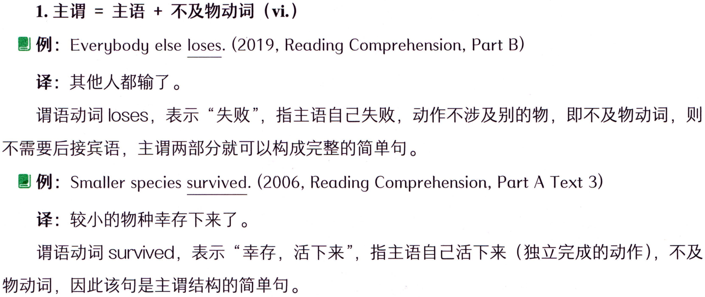

```text
1.主谓=主语+不及物动词（vi.)
例: Everybody else loses. (2019, Reading Comprehension, Part B)
译：其他人都输了。
谓语动词loseS，表示“失败”，指主语自己失败，动作不涉及别的物，即不及物动词，则
不需要后接宾语，主谓两部分就可以构成完整的简单句。
例： Smaller species survived. (2006, Reading Comprehension, Part A Text 3)
译：较小的物种幸存下来了。
谓语动词 survived，表示“幸存，活下来”，指主语自己活下来（独立完成的动作），不及
物动词，因此该句是主谓结构的简单句。
```

#### 2.主谓宾=主语+及物动词（vt.）+宾语

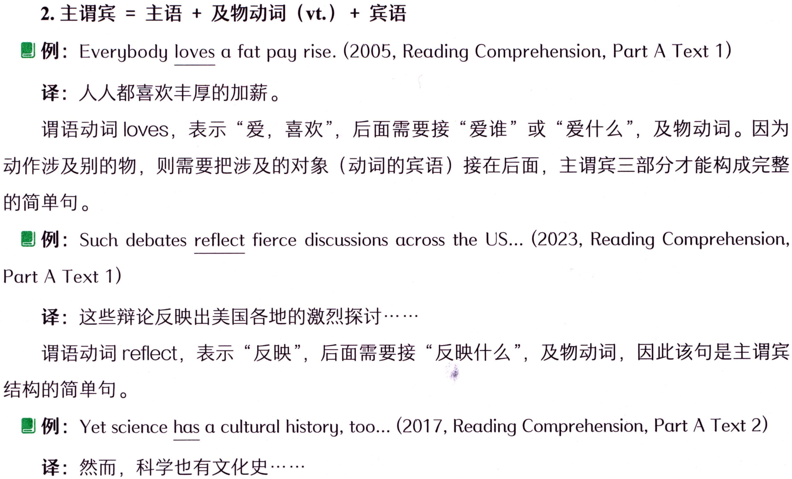

```text
2.主谓宾=主语+及物动词（vt.）+宾语
例: Everybody loves α fat pay rise. (2005, Reading Comprehension, Part A Text 1)
译：人人都喜欢丰厚的加薪。
谓语动词loveS，表示“爱，喜欢”，后面需要接“爱谁”或“爱什么”，及物动词。因为
动作涉及别的物，则需要把涉及的对象（动词的宾语）接在后面，主谓宾三部分才能构成完整
的简单句。
例: Such debates reflect fierce discussions across the US...(2023, Reading Comprehension,
Part A Text 1)
译：这些辩论反映出美国各地的激烈探讨·…·
谓语动词reflect，表示“反映”，后面需要接“反映什么”，及物动词，因此该句是主谓宾
结构的简单句。
例: Yet science has a cultural history, too... (2017, Reading Comprehension, Part A Text 2)
译：然而，科学也有文化史…···
```

#### 词汇表

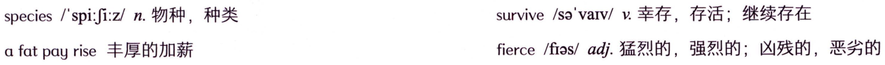

```text
species/spi:Ji:z/n.物种，种类
survive/sa'varv/v.幸存，存活；继续存在
fierce/fias/adj.猛烈的，强烈的；凶残的，恶劣的
a fat pay rise 丰厚的加薪
```

#### 概述

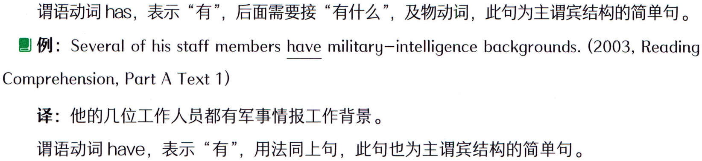

```text
谓语动词haS，表示“有”，后面需要接“有什么”，及物动词，此句为主谓宾结构的简单句。
例: Several of his staff members have military-intelligence backgrounds. (2003, Reading
Comprehension, Part A Text 1)
译：他的几位工作人员都有军事情报工作背景。
谓语动词have，表示“有”，用法同上句，此句也为主谓宾结构的简单句。
```

### 【补充】对比上面两个例句，可以发现：从表面上来看，句子的内容、长度和难度大不相

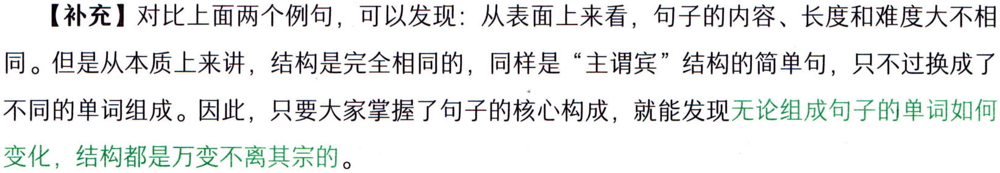

```text
【补充】对比上面两个例句，可以发现：从表面上来看，句子的内容、长度和难度大不相
同。但是从本质上来讲，结构是完全相同的，同样是“主谓宾”结构的简单句，只不过换成了
不同的单词组成。因此，只要大家掌握了句子的核心构成，就能发现无论组成句子的单词如何
变化，结构都是万变不离其宗的。
```

#### 3.主谓双宾=主语+及物动词（vt.）+两个宾语（人+物）

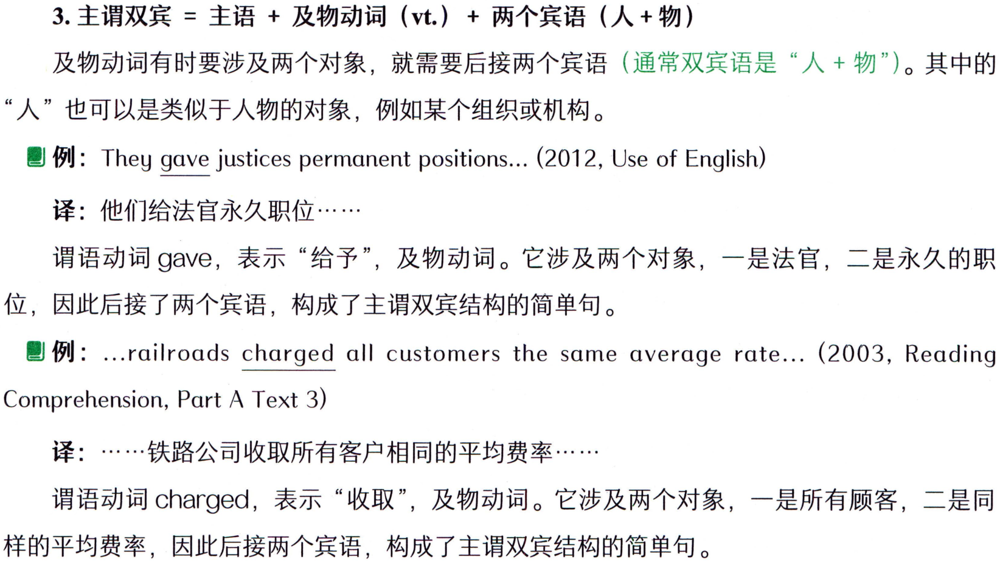

```text
3.主谓双宾=主语+及物动词（vt.）+两个宾语（人+物）
及物动词有时要涉及两个对象，就需要后接两个宾语（通常双宾语是“人+物"）。其中的
“人”也可以是类似于人物的对象，例如某个组织或机构。
 例: They gave justices permanent positions... (2012, Use of English)
译：他们给法官永久职位.··
谓语动词gave，表示“给予”，及物动词。它涉及两个对象，一是法官，二是永久的职
位，因此后接了两个宾语，构成了主谓双宾结构的简单句。
例: ...railroads charged all customers the same average rate... (2003, Reading
Comprehension, Part A Text 3)
译：…·铁路公司收取所有客户相同的平均费率.…
谓语动词charged，表示“收取”，及物动词。它涉及两个对象，一是所有顾客，二是同
样的平均费率，因此后接两个宾语，构成了主谓双宾结构的简单句。
```

### 【补充】主谓双宾结构中，由于有两个宾语（人+物），且这两个宾语的前后顺序是可以调

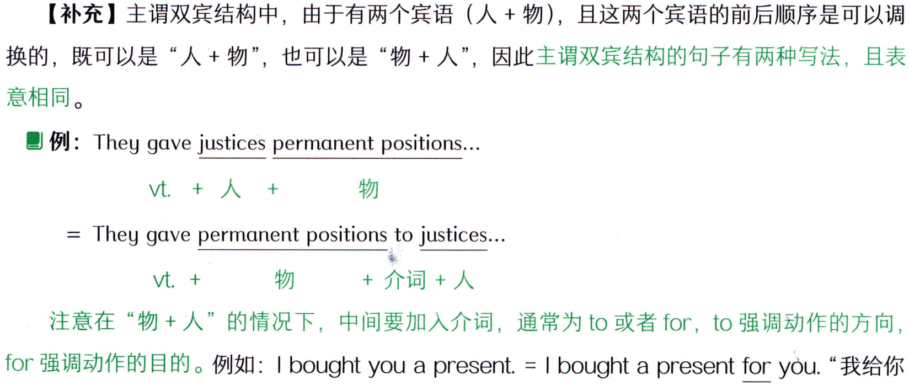

```text
【补充】主谓双宾结构中，由于有两个宾语（人+物），且这两个宾语的前后顺序是可以调
换的，既可以是“人+物”，也可以是“物+人”，因此主谓双宾结构的句子有两种写法，且表
意相同。
 例: They gave justices permanent positions...
vt.+人+
物
 They gave permanent positions to justices...
vt.+
+介词+人
物
注意在“物+人”的情况下，中间要加入介词，通常为to 或者for，to 强调动作的方向,
for 强调动作的目的。例如：I bought you a present. = I bought a present for you.“我给你
```

#### 词汇表

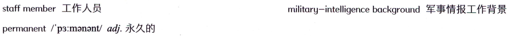

```text
staff member工作人员
military-intelligencebackground军事情报工作背景
permanent/p3:manant/adj.永久的
```

#### 概述


```text
买了一个礼物。”其中“给你”表示的是买礼物的目的，因此用介词for。
```

### 【补充】主谓双宾结构中，无论两个宾语“人+物”哪个位于前面，“物”永远是直接宾语，

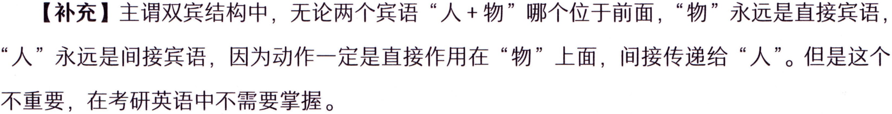

```text
【补充】主谓双宾结构中，无论两个宾语“人+物”哪个位于前面，“物”永远是直接宾语，
“人”永远是间接宾语，因为动作一定是直接作用在“物”上面，间接传递给“人”。但是这个
不重要，在考研英语中不需要掌握。
```

#### 4.主谓宾补=主语+及物动词（vt.）+宾语+宾语的补足语（简称宾补)

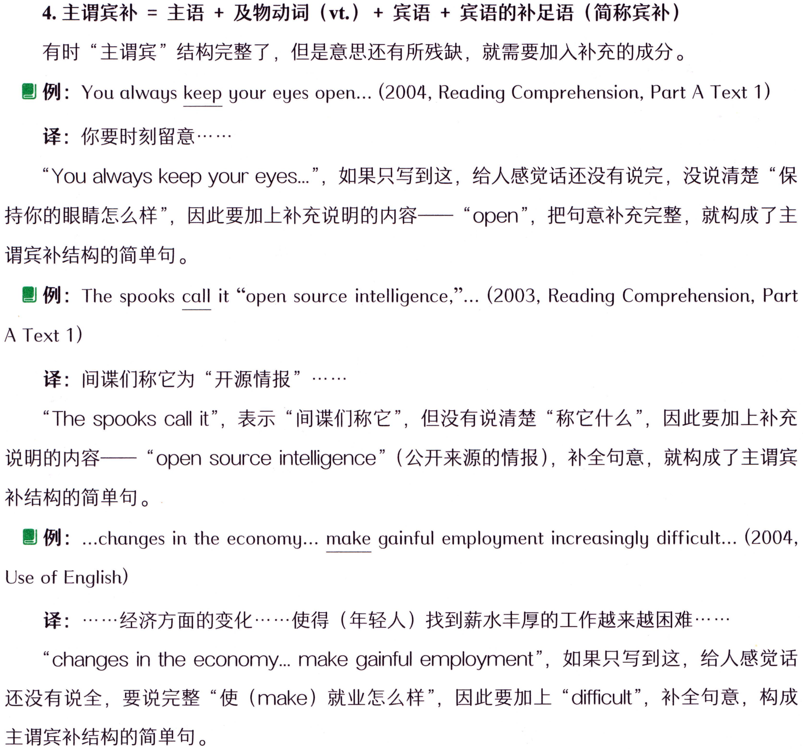

```text
4.主谓宾补=主语+及物动词（vt.）+宾语+宾语的补足语（简称宾补)
有时“主谓宾”结构完整了，但是意思还有所残缺，就需要加入补充的成分。
例:You always keep your eyes open... (2004, Reading Comprehension, Part A Text 1)
译：你要时刻留意·
“You always keep your eyes."，如果只写到这，给人感觉话还没有说完，没说清楚“保
持你的眼睛怎么样”，因此要加上补充说明的内容一一“open”，把句意补充完整，就构成了主
谓宾补结构的简单句。
例: The spooks call it “open source intelligence,"... (2003, Reading Comprehension, Part
A Text 1)
译：间谍们称它为“开源情报”……
说明的内容—“open source intelligence”（公开来源的情报），补全句意，就构成了主谓宾
补结构的简单句。
I例: ..changes in the economy... make gainful employment increasingly difficult.. (2004,
Use of English)
译：…·经济方面的变化……使得（年轻人）找到薪水丰厚的工作越来越困难·
“changes in the economy... make gainful employment"，如果只写到这，给人感觉话
还没有说全，要说完整“使（make）就业怎么样”，因此要加上“difficult”，补全句意，构成
主谓宾补结构的简单句。
```

### 【补充】宾补是用来补充说明宾语的，因此它与宾语有逻辑上的主谓关系，简单来说就

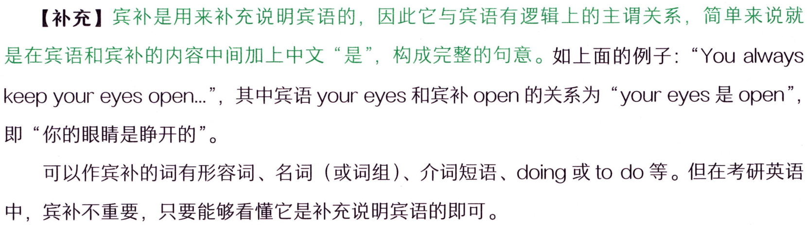

```text
【补充】宾补是用来补充说明宾语的，因此它与宾语有逻辑上的主谓关系，简单来说就
是在宾语和宾补的内容中间加上中文“是”，构成完整的句意。如上面的例子：“You always
keep your eyes open."，其中宾语 your eyes 和宾补 open 的关系为“your eyes 是 open",
即“你的眼睛是睁开的”。
可以作宾补的词有形容词、名词（或词组）、介词短语、doing 或to do等。但在考研英语
中，宾补不重要，只要能够看懂它是补充说明宾语的即可。
```

#### 词汇表

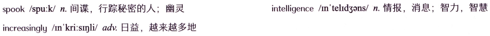

```text
spook/spu:k/n.间谍，行踪秘密的人；幽灵
intelligence/mn'telid3ns/n.情报，消息；智力，智慧
increasingly/In'kri:sinli/adv.日益，越来越多地
```

#### 5.主系表=主语+ 系动词+表语

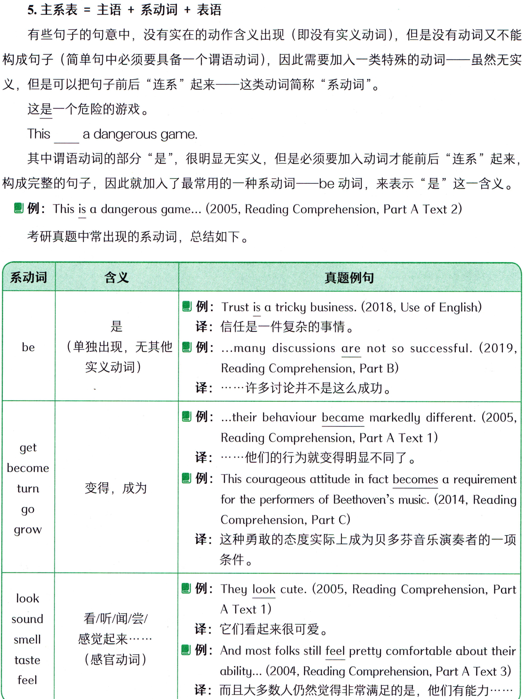

```text
5.主系表=主语+ 系动词+表语
有些句子的句意中，没有实在的动作含义出现（即没有实义动词)，但是没有动词又不能
构成句子(简单句中必须要具备一个谓语动词)，因此需要加入一类特殊的动词一—虽然无实
义，但是可以把句子前后“连系”起来一这类动词简称“系动词”。
这是一个危险的游戏。
This
a dangerous game.
其中谓语动词的部分“是”，很明显无实义，但是必须要加入动词才能前后“连系”起来，
构成完整的句子，因此就加入了最常用的一种系动词—be 动词，来表示“是”这一含义。
例: This is a dangerous game... (2005, Reading Comprehension, Part A Text 2)
考研真题中常出现的系动词，总结如下。
含义
系动词
真题例句
例: Trust is a tricky business. (2018, Use of English)
是
译：信任是一件复杂的事情。
（单独出现，无其他
例: ...many discussions are not so successful. (2019,
be
实义动词)
Reading Comprehension, Part B)
译：…·许多讨论并不是这么成功。
例: ...their behaviour became markedly different. (2005,
Reading Comprehension, Part A Text 1)
get
译：·…·他们的行为就变得明显不同了。
become
例: This courageous attitude in fact becomes a requirement
变得，成为
turn
for the performers of Beethoven's music. (2014, Reading
ob
Comprehension, Part C)
grow
译：这种勇敢的态度实际上成为贝多芬音乐演奏者的一项
条件。
例: They look cute. (2005, Reading Comprehension, Part
look
A Text 1)
看/听/闻/尝/
sound
译：它们看起来很可爱。
感觉起来··
smell
例: And most folks still feel pretty comfortable about their
(感官动词)
taste
ability... (2004, Reading Comprehension, Part A Text 3)
feel
译：而且大多数人仍然觉得非常满足的是，他们有能力.…·
```

#### 词汇表

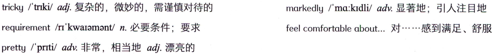

```text
tricky/'triki/adj.复杂的，微妙的，需谨慎对待的
markedly/ma:kidli/adv.显著地；引人注目地
requirement/r'kwaiamant/n.必要条件；要求
feelcomfortableabout...对....感到满足、舒服
pretty/prti/adv.非常，相当地adj.漂亮的
```

#### 概述

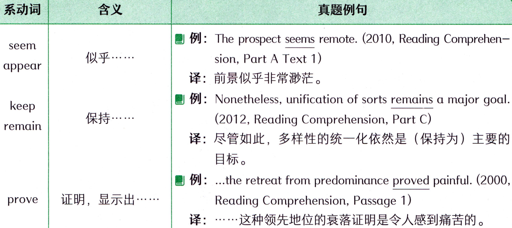

```text
含义
系动词
真题例句
例: The prospect seems remote. (2010, Reading Comprehen-
seem
似乎.….
sion, Part A Text 1)
appear
译：前景似乎非常渺茫。
例: Nonetheless, unification of sorts remains a major goal.
keep
保持.….
(2012, Reading Comprehension, Part C)
remain
译：尽管如此，多样性的统一化依然是（保持为）主要的
目标。
例: ..the retreat from predominance proved painful. (2000,
证明，显示出……….
prove
Reading Comprehension, Passage 1)
译：·……这种领先地位的衰落证明是令人感到痛苦的。
```

### 【补充】以上表格中四类动词出现时，不一定是系动词。必须在表示相应的含义时才是系动词。

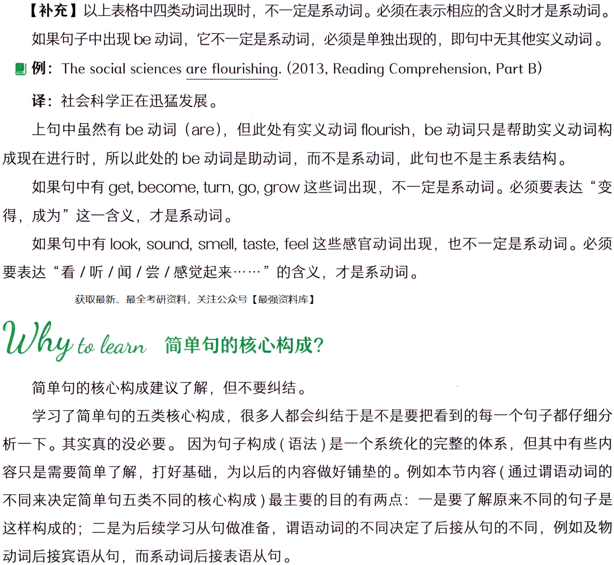

```text
【补充】以上表格中四类动词出现时，不一定是系动词。必须在表示相应的含义时才是系动词。
如果句子中出现be动词，它不一定是系动词，必须是单独出现的，即句中无其他实义动词。
 例: The social sciences are flourishing. (2013, Reading Comprehension, Part B)
译：社会科学正在迅猛发展。
上句中虽然有be动词（are），但此处有实义动词 flourish，be 动词只是帮助实义动词构
成现在进行时，所以此处的be动词是助动词，而不是系动词，此句也不是主系表结构。
如果句中有 get,become,turn,go,grow这些词出现，不一定是系动词。必须要表达“变
得，成为”这一含义，才是系动词。
如果句中有look,sound,smell,taste，feel这些感官动词出现，也不一定是系动词。必须
要表达“看／听／闻／尝／感觉起来·……”的含义，才是系动词。
简单句的核心构成建议了解，但不要纠结。
学习了简单句的五类核心构成，很多人都会纠结于是不是要把看到的每一个句子都仔细分
析一下。其实真的没必要。因为句子构成（语法）是一个系统化的完整的体系，但其中有些内
容只是需要简单了解，打好基础，为以后的内容做好铺垫的。例如本节内容（通过谓语动词的
不同来决定简单句五类不同的核心构成）最主要的目的有两点：一是要了解原来不同的句子是
这样构成的；二是为后续学习从句做准备，谓语动词的不同决定了后接从句的不同，例如及物
动词后接宾语从句，而系动词后接表语从句。
```

#### 词汇表

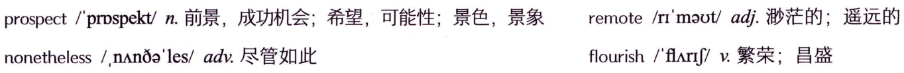

```text
prospect/prospekt/n.前景，成功机会；希望，可能性；景色，景象
remote/rr'maot/adj.渺茫的；遥远的
flourish/farj/v.繁荣；昌盛
nonetheless/,nAnoa'les/adv.尽管如此
```

#### 概述

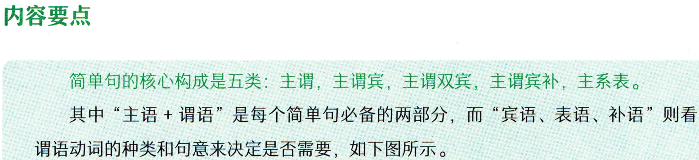

```text
内容要点
简单句的核心构成是五类：主谓，主谓宾，主谓双宾，主谓宾补，主系表。
其中“主语+谓语”是每个简单句必备的两部分，而“宾语、表语、补语”则看
谓语动词的种类和句意来决定是否需要，如下图所示。
```

#### 1. 主谓

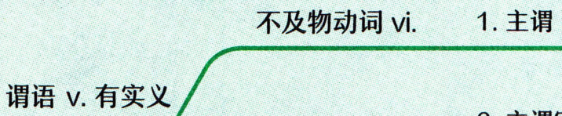

```text
1. 主谓
不及物动词vi.
谓语v. 有实义
```

#### 2. 主谓宾

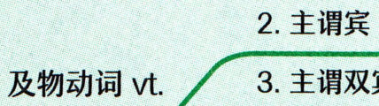

```text
2. 主谓宾
及物动词 vt.
```

#### 3.主谓双宾

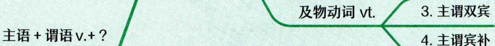

```text
3.主谓双宾
主语+谓语v.+?
```

#### 4. 主谓宾补

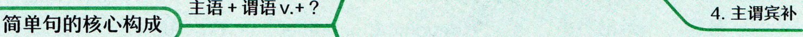

```text
4. 主谓宾补
简单句的核心构成
```

#### 5.主系表

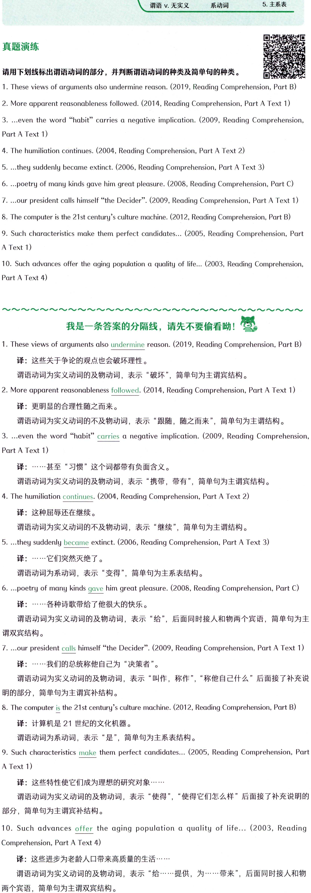

```text
5.主系表
系动词
谓语v. 无实义
真题演练
请用下划线标出谓语动词的部分，并判断谓语动词的种类及简单句的种类。
1. These views of arguments also undermine reason. (2019, Reading Comprehension, Part B)
2. More apparent reasonableness followed. (2014, Reading Comprehension, Part A Text 1)
3. ...even the word "habit" carries a negative implication. (2009, Reading Comprehension,
Part A Text 1)
4. The humiliation continues. (2004, Reading Comprehension, Part A Text 2)
5. ...they suddenly became extinct. (2006, Reading Comprehension, Part A Text 3)
6. ...poetry of many kinds gave him great pleasure. (2008, Reading Comprehension, Part C)
7. ...our president calls himself “the Decider". (2009, Reading Comprehension, Part A Text 1)
8. The computer is the 21st century's culture machine. (2012, Reading Comprehension, Part B)
9. Such characteristics make them perfect candidates... (2005, Reading Comprehension, Part
A Text 1)
10. Such advances offer the aging population a quality of life.. (2003, Reading Comprehension,
Part A Text 4)
我是一条答案的分隔线，请先不要偷看呦！
1. These views of arguments also undermine reason. (2019, Reading Comprehension, Part B)
译：这些关于争论的观点也会破坏理性。
谓语动词为实义动词的及物动词，表示“破坏”，简单句为主谓宾结构。
2. More apparent reasonableness followed. (2014, Reading Comprehension, Part A Text 1)
译：更明显的合理性随之而来。
谓语动词为实义动词的不及物动词，表示“跟随，随之而来”，简单句为主谓结构。
3....even the word “habit"
carries a negative implication. (2009, Reading Comprehension,
Part A Text 1)
译：……·甚至“习惯”这个词都带有负面含义。
谓语动词为实义动词的及物动词，表示“携带，带有”，简单句为主谓宾结构。
4. The humiliation continues. (2004, Reading Comprehension, Part A Text 2)
译：这种屈辱还在继续。
谓语动词为实义动词的不及物动词，表示“继续”，简单句为主谓结构。
5. ...they suddenly became extinct. (2006, Reading Comprehension, Part A Text 3)
译：…….…它们突然灭绝了。
谓语动词为系动词，表示“变得”，简单句为主系表结构。
6. ...poetry of many kinds gave him great pleasure. (2008, Reading Comprehension, Part C)
译：….…·各种诗歌带给了他很大的快乐。
谓语动词为实义动词的及物动词，表示“给”，后面同时接人和物两个宾语，简单句为主
谓双宾结构。
7. ..our president calls himself “the Decider". (2009, Reading Comprehension, Part A Text 1)
译：…..·我们的总统称他自己为“决策者”。
谓语动词为实义动词的及物动词，表示“叫作，称作”，“称他自己什么”后面接了补充说
明的部分，简单句为主谓宾补结构。
8. The computer is the 21st century's culture machine. (2012, Reading Comprehension, Part B)
译：计算机是21世纪的文化机器。
谓语动词为系动词，表示“是”，简单句为主系表结构。
9. Such characteristics make them perfect candidates... (2005, Reading Comprehension, Part
A Text 1)
译：这些特性使它们成为理想的研究对象·…·…
谓语动词为实义动词的及物动词，表示“使得”，“使得它们怎么样”后面接了补充说明的
部分，简单句为主谓宾补结构。
10. Such advances offer the aging population a quality of life... (2003, Reading
Comprehension, Part A Text 4)
译：这些进步为老龄人口带来高质量的生活·…·
谓语动词为实义动词的及物动词，表示“给………提供，为……..…·带来”，后面同时接人和物
两个宾语，简单句为主谓双宾结构。
```
