# 第二节 简单句的核心变化—谓语动词的变化

#### 概述

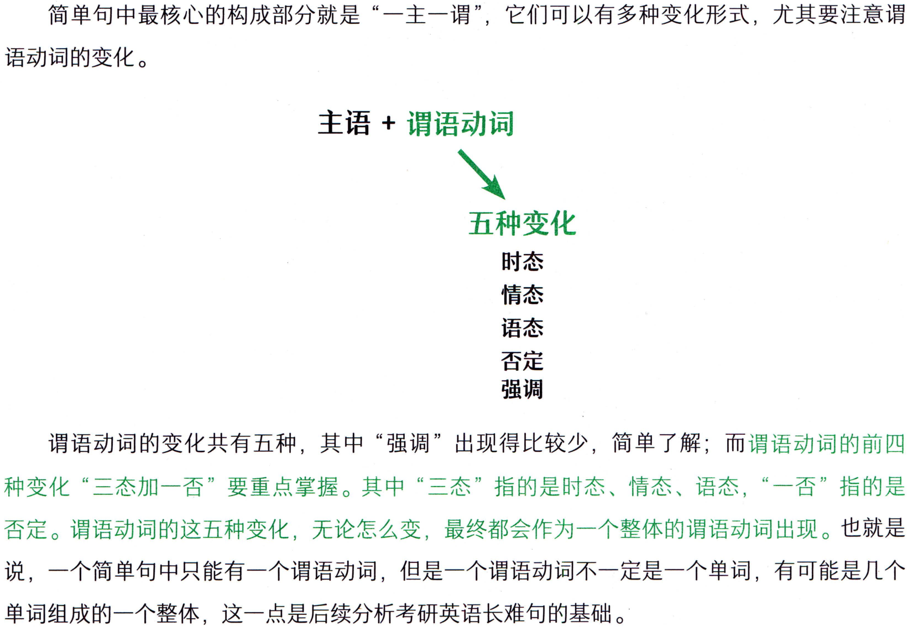

```text
简单句中最核心的构成部分就是“一主一谓”，它们可以有多种变化形式，尤其要注意谓
语动词的变化。
主语+谓语动词
五种变化
时态
情态
语态
否定
强调
谓语动词的变化共有五种，其中“强调”出现得比较少，简单了解；而谓语动词的前四
种变化“三态加一否”要重点掌握。其中“三态”指的是时态、情态、语态，“一否”指的是
否定。谓语动词的这五种变化，无论怎么变，最终都会作为一个整体的谓语动词出现。也就是
说，一个简单句中只能有一个谓语动词，但是一个谓语动词不一定是一个单词，有可能是几个
单词组成的一个整体，这一点是后续分析考研英语长难句的基础。
```

## 一、谓语动词的时态


```text
一、谓语动词的时态
```

## Uuhatis谓语动词的时态？

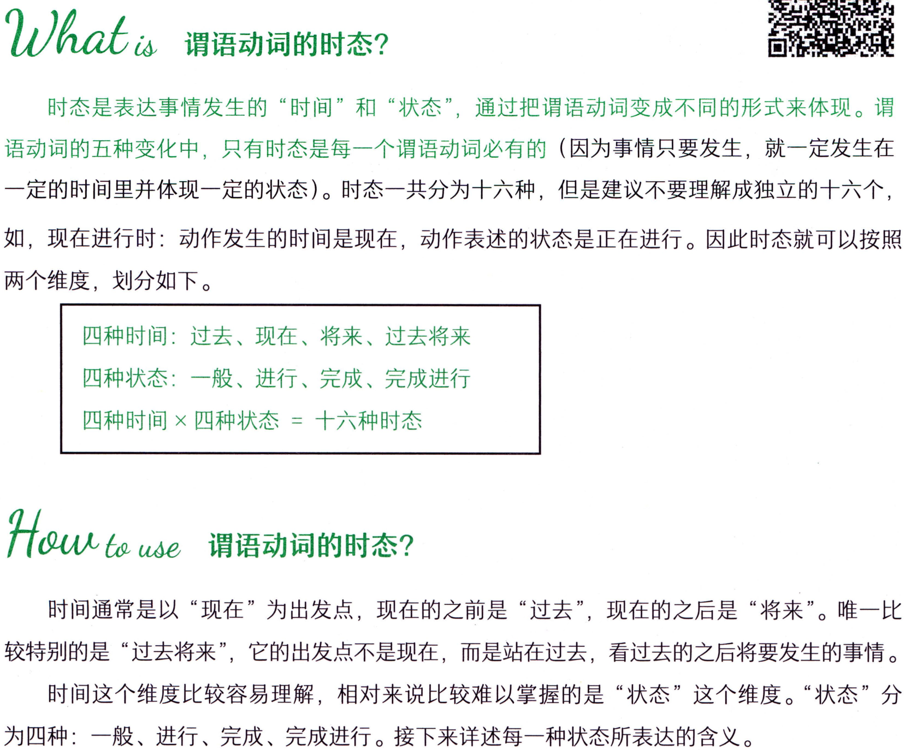

```text
Uuhatis谓语动词的时态？
时态是表达事情发生的“时间”和“状态”，通过把谓语动词变成不同的形式来体现。谓
语动词的五种变化中，只有时态是每一个谓语动词必有的（因为事情只要发生，就一定发生在
一定的时间里并体现一定的状态)。时态一共分为十六种，但是建议不要理解成独立的十六个，
如，现在进行时：动作发生的时间是现在，动作表述的状态是正在进行。因此时态就可以按照
两个维度，划分如下。
四种时间：过去、现在、将来、过去将来
四种状态：一般、进行、完成、完成进行
四种时间×四种状态=十六种时态
时间通常是以“现在”为出发点，现在的之前是“过去”，现在的之后是“将来”。唯一比
较特别的是“过去将来”，它的出发点不是现在，而是站在过去，看过去的之后将要发生的事情。
时间这个维度比较容易理解，相对来说比较难以掌握的是“状态”这个维度。“状态”分
为四种：一般、进行、完成、完成进行。接下来详述每一种状态所表达的含义。
```

### （一）“一般”时态

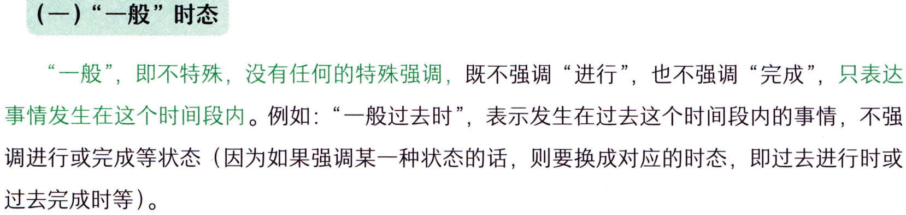

```text
（一）“一般”时态
“一般”，即不特殊，没有任何的特殊强调，既不强调“进行”，也不强调“完成”，只表达
事情发生在这个时间段内。例如：“一般过去时”，表示发生在过去这个时间段内的事情，不强
调进行或完成等状态（因为如果强调某一种状态的话，则要换成对应的时态，即过去进行时或
过去完成时等）。
```

### 【补充】“一般”时态是四种时态中最常用的一种，也是唯一一个没有统一的谓语动词公式

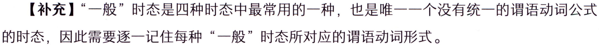

```text
【补充】“一般”时态是四种时态中最常用的一种，也是唯一一个没有统一的谓语动词公式
的时态，因此需要逐一记住每种“一般”时态所对应的谓语动词形式。
```

#### 1.一般过去时：谓语动词=did

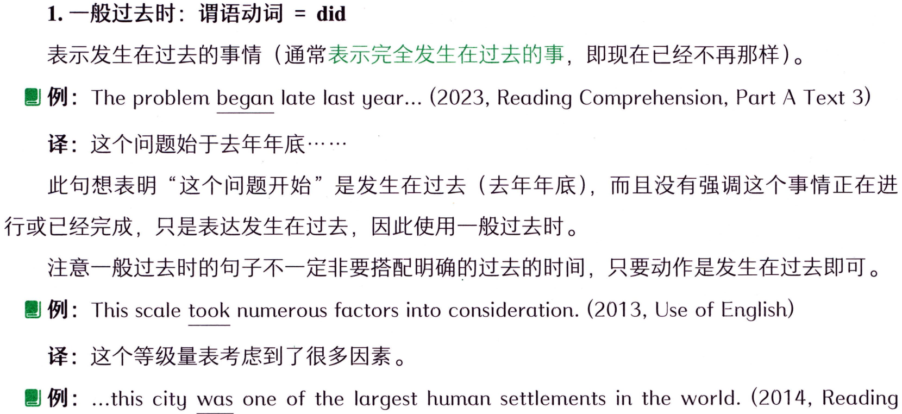

```text
1.一般过去时：谓语动词=did
表示发生在过去的事情（通常表示完全发生在过去的事，即现在已经不再那样）。
例:The problem began late last year...(2023,Reading Comprehension,Part A Text 3)
译：这个问题始于去年年底···
此句想表明“这个问题开始”是发生在过去（去年年底），而且没有强调这个事情正在进
行或已经完成，只是表达发生在过去，因此使用一般过去时。
注意一般过去时的句子不一定非要搭配明确的过去的时间，只要动作是发生在过去即可。
例:This scale took numerous factors into consideration.(2013, Use of English)
译：这个等级量表考虑到了很多因素。
例:...this city was one of the largest human settlements in the world.(2014,Reading
```

#### 词汇表

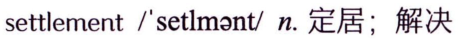

```text
settlement/setlmant/n.定居；解决
```

#### 概述

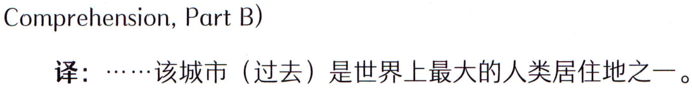

```text
Comprehension, Part B)
译：…·该城市（过去）是世界上最大的人类居住地之一。
```

#### 2.一般现在时：谓语动词=do/does

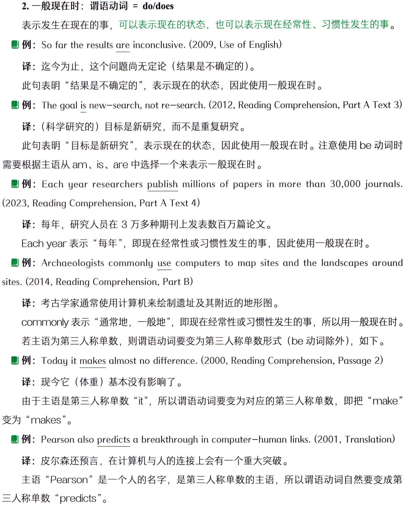

```text
2.一般现在时：谓语动词=do/does
表示发生在现在的事，可以表示现在的状态，也可以表示现在经常性、习惯性发生的事。
例: So far the results are inconclusive. (2009, Use of English)
译：迄今为止，这个问题尚无定论(结果是不确定的）。
此句表明“结果是不确定的”，表示现在的状态，因此使用一般现在时。
例: The goal is new-search, not re-search. (2012, Reading Comprehension, Part A Text 3)
译：（科学研究的）目标是新研究，而不是重复研究。
此句表明“目标是新研究”，表示现在的状态，因此使用一般现在时。注意使用be 动词时
需要根据主语从 am、is、are 中选择一个来表示一般现在时。
例: Each year researchers publish millions of papers in more than 30,000 journals.
(2023, Reading Comprehension, Part A Text 4)
译：每年，研究人员在3万多种期刊上发表数百万篇论文。
Each year 表示“每年”，即现在经常性或习惯性发生的事，因此使用一般现在时。
例: Archaeologists commonly use computers to map sites and the landscapes around
sites. (2014, Reading Comprehension, Part B)
译：考古学家通常使用计算机来绘制遗址及其附近的地形图。
commonly表示“通常地，一般地”，即现在经常性或习惯性发生的事，所以用一般现在时。
若主语为第三人称单数，则谓语动词要变为第三人称单数形式（be 动词除外），如下。
例: Today it makes almost no difference. (2000, Reading Comprehension, Passage 2)
译：现今它（体重）基本没有影响了。
由于主语是第三人称单数“it”，所以谓语动词要变为对应的第三人称单数，即把“make”
变为“makes”。
 例: Pearson also predicts α breakthrough in computer-human links. (2001, Translation)
译：皮尔森还预言，在计算机与人的连接上会有一个重大突破。
主语“Pearson”是一个人的名字，是第三人称单数的主语，所以谓语动词自然要变成第
三人称单数“predicts”。
```

### 【补充】一般现在时中，谓语动词变为第三人称单数，是为了对应第三人称单数的主语。但


```text
【补充】一般现在时中，谓语动词变为第三人称单数，是为了对应第三人称单数的主语。但
第三人称单数的主语除he、she、it之外，还有不定代词（如 everyone、something、nobody
```

#### 词汇表

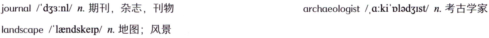

```text
journal /d33:nl/n.期刊，杂志，刊物
archaeologist/a:ki'plad3ist/n.考古学家
landscape/laendskerp/n.地图；风景
```

#### 概述

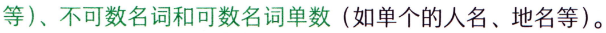

```text
等）、不可数名词和可数名词单数（如单个的人名、地名等)。
```

#### 3.一般将来时：谓语动词=will+do或am/is/aregoing to+do

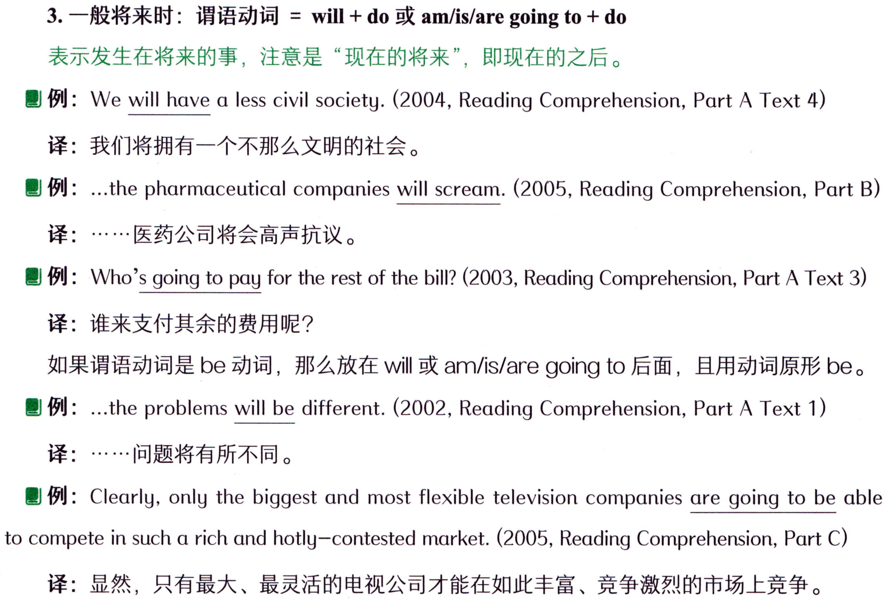

```text
3.一般将来时：谓语动词=will+do或am/is/aregoing to+do
表示发生在将来的事，注意是“现在的将来”，即现在的之后。
例: We will have a less civil society. (2004, Reading Comprehension, Part A Text 4)
译：我们将拥有一个不那么文明的社会。
例: ...the pharmaceutical companies will scream. (2005, Reading Comprehension, Part B)
译：·….·医药公司将会高声抗议。
 例: Who's going to pay for the rest of the bill? (2003, Reading Comprehension, Part A Text 3)
译：谁来支付其余的费用呢？
如果谓语动词是 be 动词，那么放在 will或 am/is/are going to 后面，且用动词原形be。
例: ..the problems will be different. (2002, Reading Comprehension, Part A Text 1)
译：…···问题将有所不同。
例: Clearly, only the biggest and most flexible television companies are going to be able
to compete in such a rich and hotly-contested market. (2005, Reading Comprehension, Part C)
译：显然，只有最大、最灵活的电视公司才能在如此丰富、竞争激烈的市场上竞争。
```

### 【补充】will和am/is/are going to都可以后接动词原形，表示（现在的）将来发生的事,

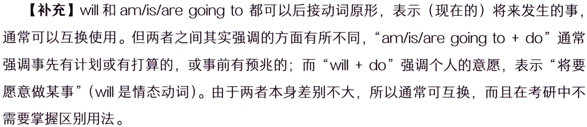

```text
【补充】will和am/is/are going to都可以后接动词原形，表示（现在的）将来发生的事,
通常可以互换使用。但两者之间其实强调的方面有所不同，“am/is/are going to+do”通常
强调事先有计划或有打算的，或事前有预兆的；而“will+do”强调个人的意愿，表示“将要
愿意做某事”（will是情态动词）。由于两者本身差别不大，所以通常可互换，而且在考研中不
需要掌握区别用法。
```

#### 4.（一般）过去将来时：谓语动词=would+do或was/weregoingto+do

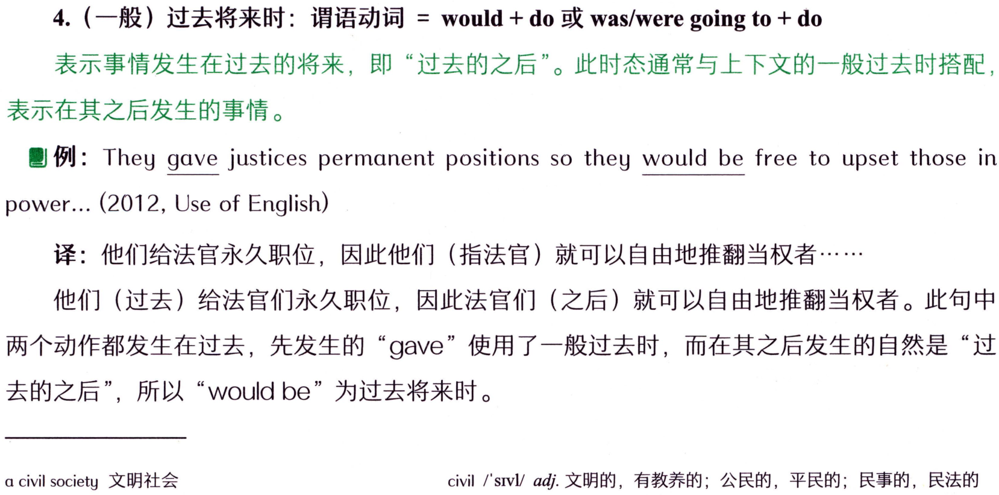

```text
4.（一般）过去将来时：谓语动词=would+do或was/weregoingto+do
表示事情发生在过去的将来，即“过去的之后”。此时态通常与上下文的一般过去时搭配，
表示在其之后发生的事情。
power... (2012, Use of English)
译：他们给法官永久职位，因此他们（指法官）就可以自由地推翻当权者·….
他们（过去）给法官们永久职位，因此法官们（之后）就可以自由地推翻当权者。此句中
去的之后”，所以“wouldbe”为过去将来时。
a civil society文明社会
civil/'srvladji.文明的，有教养的；公民的，平民的；民事的，民法的
```

#### 词汇表

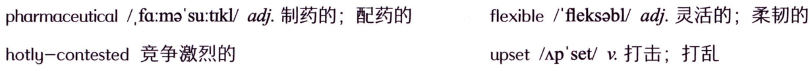

```text
pharmaceutical/.fa:ma'su:tikl/adj.制药的；配药的
flexible/fleksabl/adj.灵活的；柔韧的
upset/Ap'set/v.打击；打乱
hotly-contested竞争激烈的
```

#### 概述

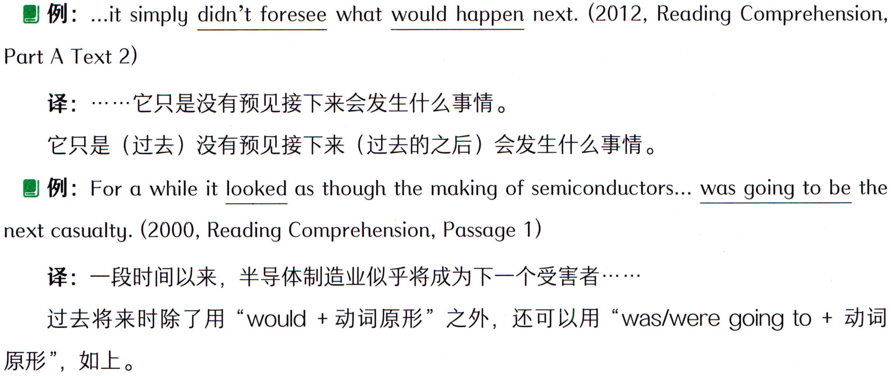

```text
 例: .it simply didn't foresee what would happen next. (2012, Reading Comprehension,
Part A Text 2)
译：·……它只是没有预见接下来会发生什么事情。
它只是（过去）没有预见接下来（过去的之后）会发生什么事情。
 例: For a while it looked as though the making of semiconductors... was going to be the
next casualty. (2000, Reading Comprehension, Passage 1)
译：一段时间以来，半导体制造业似乎将成为下一个受害者.
过去将来时除了用“would+动词原形”之外，还可以用“was/weregoing to+动词
原形”，如上。
```

### 【补充】一般将来时和过去将来时，同样表示将来（之后的事情)，差别在于出发点不同，

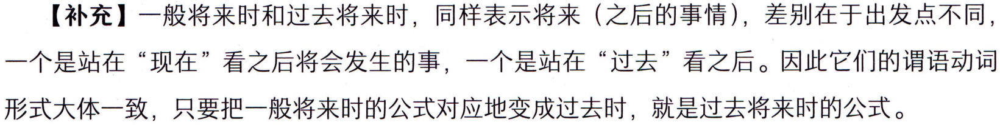

```text
【补充】一般将来时和过去将来时，同样表示将来（之后的事情)，差别在于出发点不同，
一个是站在“现在”看之后将会发生的事，一个是站在“过去”看之后。因此它们的谓语动词
形式大体一致，只要把一般将来时的公式对应地变成过去时，就是过去将来时的公式。
```

### （二）“进行”时态

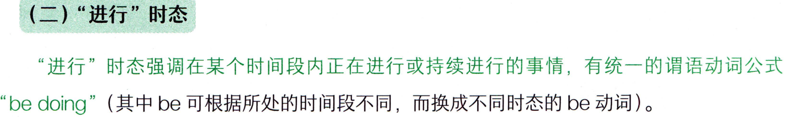

```text
（二）“进行”时态
“进行”时态强调在某个时间段内正在进行或持续进行的事情，有统一的谓语动词公式
"be doing”（其中 be 可根据所处的时间段不同，而换成不同时态的be 动词）。
```

#### 1.过去进行时：谓语动词=was/were+doing

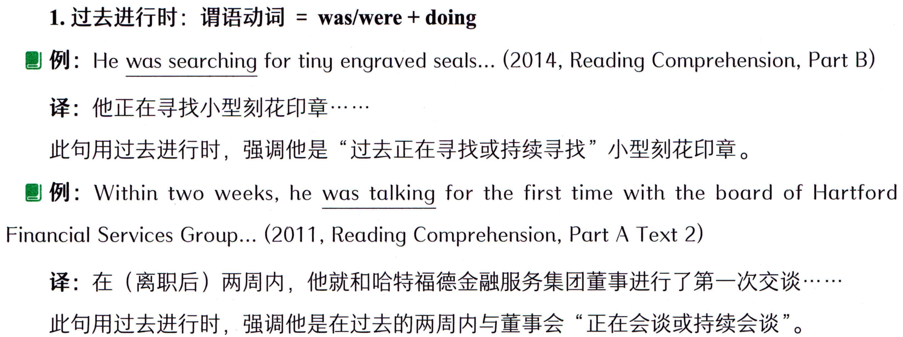

```text
1.过去进行时：谓语动词=was/were+doing
 例: He was searching for tiny engraved seals... (2014, Reading Comprehension, Part B)
译：他正在寻找小型刻花印章.···
此句用过去进行时，强调他是“过去正在寻找或持续寻找”小型刻花印章。
例: Within two weeks, he was talking for the first time with the board of Hartford
Financial Services Group... (2011, Reading Comprehension, Part A Text 2)
译：在（离职后）两周内，他就和哈特福德金融服务集团董事进行了第一次交谈…
此句用过去进行时，强调他是在过去的两周内与董事会“正在会谈或持续会谈”。
```

#### 2.现在进行时：谓语动词=am/is/are+ doing

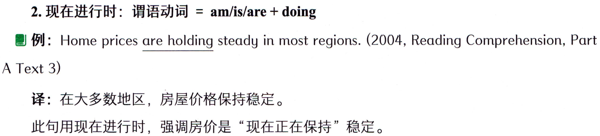

```text
2.现在进行时：谓语动词=am/is/are+ doing
 例: Home prices are holding steady in most regions. (2004, Reading Comprehension, Part
A Text 3)
译：在大多数地区，房屋价格保持稳定。
此句用现在进行时，强调房价是“现在正在保持”稳定。
```

#### 词汇表

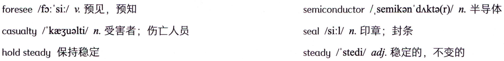

```text
semiconductor /.semikan'dAkta(r)/n.半导体
foresee/fo:'si:/v.预见，预知
casualty/kae3ualtin.受害者；伤亡人员
seal /si:l/n.印章；封条
holdsteady保持稳定
steady/'stedi/adj.稳定的，不变的
```

#### 概述

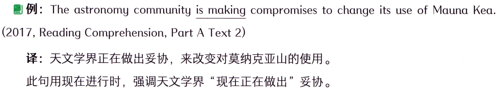

```text
 例: The astronomy community is making compromises to change its use of Mauna Kea.
(2017, Reading Comprehension, Part A Text 2)
译：天文学界正在做出妥协，来改变对莫纳克亚山的使用。
此句用现在进行时，强调天文学界“现在正在做出”妥协。
```

#### 3.将来进行时：谓语动词=willbe+doing（其中be动词永远用原形be）

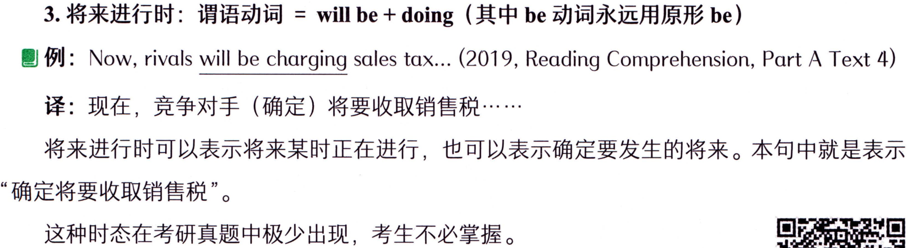

```text
3.将来进行时：谓语动词=willbe+doing（其中be动词永远用原形be）
 例: Now, rivals will be charging sales tax.. (2019, Reading Comprehension, Part A Text 4)
译：现在，竞争对手（确定）将要收取销售税
将来进行时可以表示将来某时正在进行，也可以表示确定要发生的将来。本句中就是表示
“确定将要收取销售税”。
这种时态在考研真题中极少出现，考生不必掌握。
```

### （三）“完成”时态

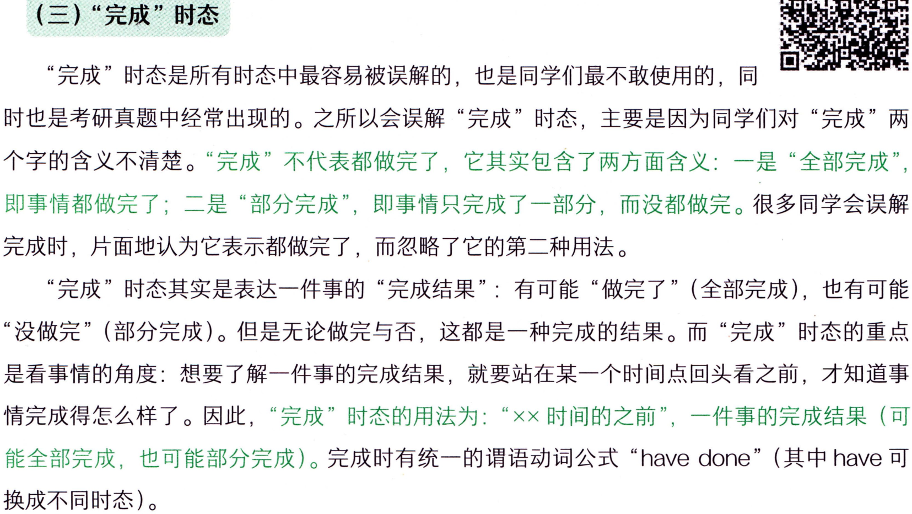

```text
（三）“完成”时态
“完成”时态是所有时态中最容易被误解的，也是同学们最不敢使用的，同
时也是考研真题中经常出现的。之所以会误解“完成”时态，主要是因为同学们对“完成”两
个字的含义不清楚。“完成”不代表都做完了，它其实包含了两方面含义：一是“全部完成”，
即事情都做完了；二是“部分完成”，即事情只完成了一部分，而没都做完。很多同学会误解
完成时，片面地认为它表示都做完了，而忽略了它的第二种用法。
“完成”时态其实是表达一件事的“完成结果”：有可能“做完了”（全部完成），也有可能
“没做完”（部分完成）。但是无论做完与否，这都是一种完成的结果。而“完成”时态的重点
是看事情的角度：想要了解一件事的完成结果，就要站在某一个时间点回头看之前，才知道事
情完成得怎么样了。因此，“完成”时态的用法为：“××时间的之前”，一件事的完成结果（可
能全部完成，也可能部分完成）。完成时有统一的谓语动词公式“havedone”（其中have可
换成不同时态)。
```

#### 1.过去完成时：谓语动词=had+done

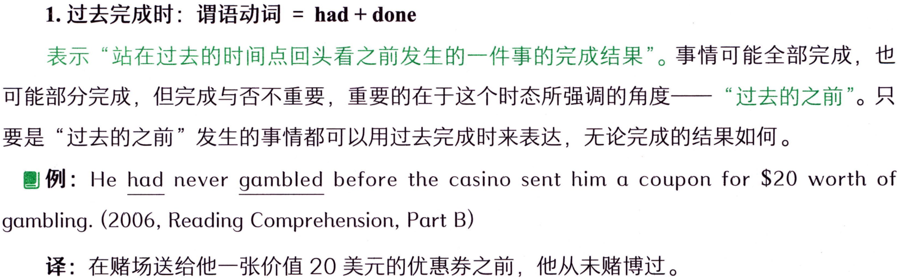

```text
1.过去完成时：谓语动词=had+done
表示“站在过去的时间点回头看之前发生的一件事的完成结果”。事情可能全部完成，也
可能部分完成，但完成与否不重要，重要的在于这个时态所强调的角度一一“过去的之前”。只
要是“过去的之前”发生的事情都可以用过去完成时来表达，无论完成的结果如何。
例:He had never gambled before the casino sent him a coupon for $20 worth of
gambling. (2006, Reading Comprehension, Part B)
译：在赌场送给他一张价值20美元的优惠券之前，他从未赌博过。
```

#### 词汇表

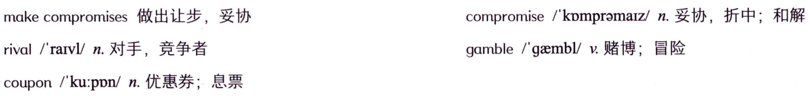

```text
compromise /kompramaiz/n.妥协，折中；和解
makecompromises做出让步，妥协
gamble/gembl/v.赌博；冒险
rival/rarvl/n.对手，竞争者
coupon/ku:ppn/n.优惠券；息票
```

#### 概述

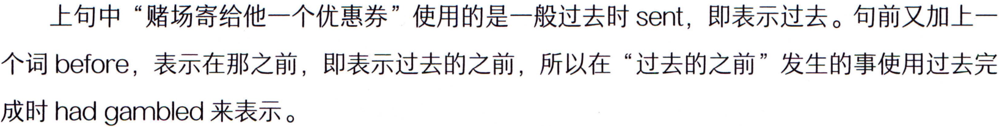

```text
上句中“赌场寄给他一个优惠券”使用的是一般过去时 Sent，即表示过去。句前又加上一
个词before，表示在那之前，即表示过去的之前，所以在“过去的之前”发生的事使用过去完
成时hadgambled来表示。
```

### 【补充】使用过去完成时，要满足两大要素一“过去”和“之前”。但并非所有的“过去”

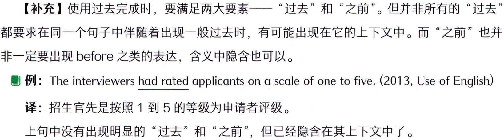

```text
【补充】使用过去完成时，要满足两大要素一“过去”和“之前”。但并非所有的“过去”
都要求在同一个句子中伴随着出现一般过去时，有可能出现在它的上下文中。而“之前”也并
非一定要出现before之类的表达，含义中隐含也可以。
 例: The interviewers had rated applicants on a scale of one to five. (2013, Use of English)
译：招生官先是按照1到5的等级为申请者评级。
中，，中
```

### 【补充】很多同学认为，一般过去时与过去完成时都表达“过去”的事情，差别就在于一

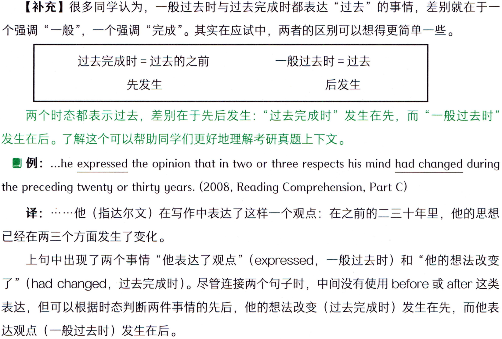

```text
【补充】很多同学认为，一般过去时与过去完成时都表达“过去”的事情，差别就在于一
个强调“一般”，一个强调“完成”。其实在应试中，两者的区别可以想得更简单一些。
一般过去时=过去
过去完成时=过去的之前
先发生
后发生
两个时态都表示过去，差别在于先后发生：“过去完成时”发生在先，而“一般过去时”
发生在后。了解这个可以帮助同学们更好地理解考研真题上下文。
 例: ...he expressed the opinion that in two or three respects his mind had changed during
the preceding twenty or thirty years. (2008, Reading Comprehension, Part C)
译：·……·他（指达尔文）在写作中表达了这样一个观点：在之前的二三十年里，他的思想
已经在两三个方面发生了变化。
，），
了”（had changed，过去完成时）。尽管连接两个句子时，中间没有使用before 或after 这类
表达，但可以根据时态判断两件事情的先后，他的想法改变（过去完成时）发生在先，而他表
达观点（一般过去时）发生在后。
```

### 【补充】过去完成时表达“过去的之前”，即站在过去回头看之前发生的事，所以涉及了两

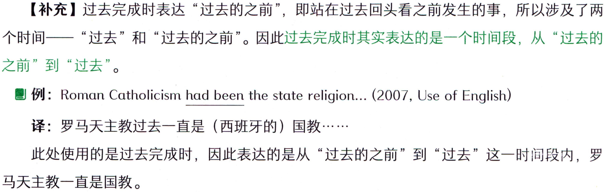

```text
【补充】过去完成时表达“过去的之前”，即站在过去回头看之前发生的事，所以涉及了两
个时间一“过去”和“过去的之前”。因此过去完成时其实表达的是一个时间段，从“过去的
之前”到“过去”。
例: Roman Catholicism had been the state religion... (2007, Use of English)
译：罗马天主教过去一直是（西班牙的）国教……
此处使用的是过去完成时，因此表达的是从“过去的之前”到“过去”这一时间段内，罗
马天主教一直是国教。
```

#### 词汇表

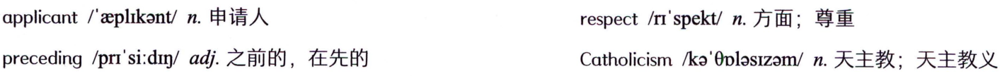

```text
respect/rr'spekt/n.方面；尊重
applicant/aeplikant/n.申请人
preceding/pr'si:din/adj.之前的，在先的
Catholicism/ka'OplosIzam/n.天主教；天主教义
```

#### 2.现在完成时：谓语动词=have/has+done

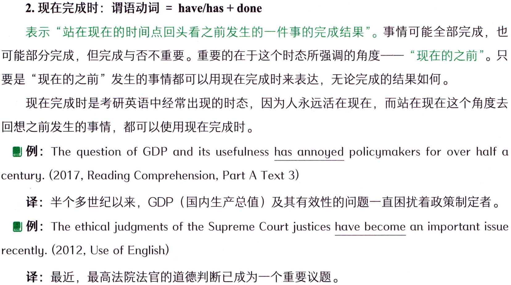

```text
2.现在完成时：谓语动词=have/has+done
表示“站在现在的时间点回头看之前发生的一件事的完成结果”。事情可能全部完成，也
可能部分完成，但完成与否不重要。重要的在于这个时态所强调的角度一一“现在的之前”。只
要是“现在的之前”发生的事情都可以用现在完成时来表达，无论完成的结果如何。
现在完成时是考研英语中经常出现的时态，因为人永远活在现在，而站在现在这个角度去
回想之前发生的事情，都可以使用现在完成时。
例: The question of GDP and its usefulness has annoyed policymakers for over half a
century. (2017, Reading Comprehension, Part A Text 3)
译：半个多世纪以来，GDP（国内生产总值）及其有效性的问题一直困扰着政策制定者。
例: The ethical judgments of the Supreme Court justices have become an important issue
recently. (2012, Use of English)
译：最近，最高法院法官的道德判断已成为一个重要议题。
```

### 【补充】现在完成时表达“现在的之前”，即站在现在回头看之前发生的事，所以涉及两个

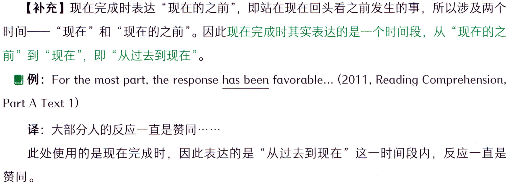

```text
【补充】现在完成时表达“现在的之前”，即站在现在回头看之前发生的事，所以涉及两个
时间一“现在”和“现在的之前”。因此现在完成时其实表达的是一个时间段，从“现在的之
前”到“现在”，即“从过去到现在”。
例: For the most part, the response has been favorable... (2011, Reading Comprehension,
Part A Text 1)
译：大部分人的反应一直是赞同..··
此处使用的是现在完成时，因此表达的是“从过去到现在”这一时间段内，反应一直是
赞同。
```

### 【补充】现在完成时表达“现在的之前”这一含义，所以在“have/has”和“done”中

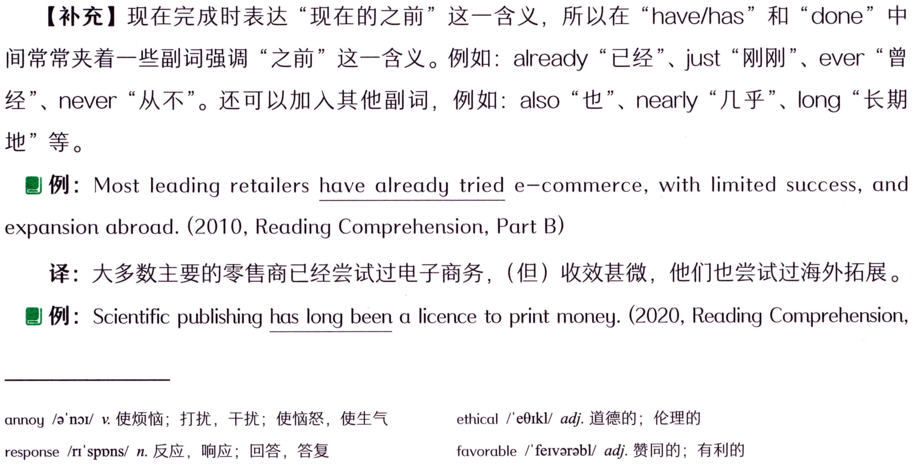

```text
【补充】现在完成时表达“现在的之前”这一含义，所以在“have/has”和“done”中
间常常夹着一些副词强调“之前”这一含义。例如：already“已经”、just“刚刚”、ever“曾
经”、never“从不”。还可以加入其他副词，例如：also“也”、nearly“几乎”、long“长期
地”等。
例: Most leading retailers have already tried e-commerce, with limited success, and
expansion abroad. (2010, Reading Comprehension, Part B)
译：大多数主要的零售商已经尝试过电子商务，（但）收效甚微，他们也尝试过海外拓展。
例: Scientific publishing has long been a licence to print money. (2020, Reading Comprehension,
ethical/e0ikl/adj.道德的；伦理的
annoy/a'noi/v.使烦恼；打扰，干扰；使恼怒，使生气
response /rr'sppns/ n.反应，响应；回答，答复
favorable/feivarabl/adj.赞同的；有利的
```

#### 词汇表

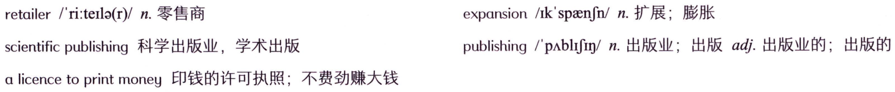

```text
expansion/ik'spaenfn/n.扩展；膨胀
retailer/ri:teila(r)/n.零售商
publishing/pablijfin/n.出版业；出版adj.出版业的；出版的
scientificpublishing科学出版业，学术出版
a licence to print money印钱的许可执照；不费劲赚大钱
```

#### 概述

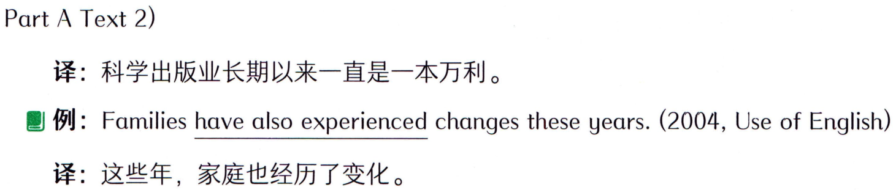

```text
Part A Text 2)
译：科学出版业长期以来一直是一本万利。
 例: Families have also experienced changes these years. (2004, Use of English)
译：这些年，家庭也经历了变化。
```

### 【补充】现在完成时与一般过去时的区别。

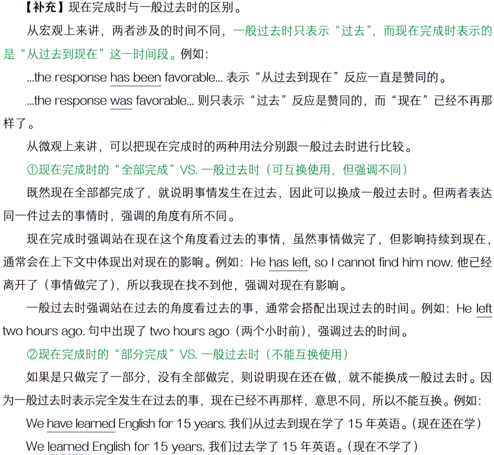

```text
【补充】现在完成时与一般过去时的区别。
从宏观上来讲，两者涉及的时间不同，一般过去时只表示“过去”，而现在完成时表示的
是“从过去到现在”这一时间段。例如：
..theresponsehasbeen favorable...表示“从过去到现在”反应一直是赞同的。
，，
样了。
从微观上来讲，可以把现在完成时的两种用法分别跟一般过去时进行比较。
①现在完成时的“全部完成”VS.一般过去时（可互换使用，但强调不同）
既然现在全部都完成了，就说明事情发生在过去，因此可以换成一般过去时。但两者表达
同一件过去的事情时，强调的角度有所不同。
现在完成时强调站在现在这个角度看过去的事情，虽然事情做完了，但影响持续到现在，
通常会在上下文中体现出对现在的影响。例如：He has left,so丨 cannot find him now.他已经
离开了（事情做完了），所以我现在找不到他，强调对现在有影响。
一般过去时强调站在过去的角度看过去的事，通常会搭配出现过去的时间。例如：Heleft
twohours ago.句中出现了twohours ago（两个小时前），强调过去的时间。
②现在完成时的“部分完成”VS.一般过去时（不能互换使用）
如果是只做完了一部分，没有全部做完，则说明现在还在做，就不能换成一般过去时。因
为一般过去时表示完全发生在过去的事，现在已经不再那样，意思不同，所以不能互换。例如：
We have learned English for 15 years.我们从过去到现在学了 15 年英语。（现在还在学)
We learnedEnglish for15years.我们过去学了15 年英语。（现在不学了）
```

#### 3.将来完成时：谓语动词=willhave+done

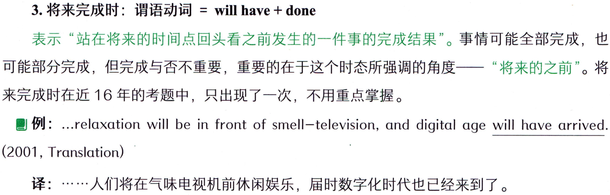

```text
3.将来完成时：谓语动词=willhave+done
表示“站在将来的时间点回头看之前发生的一件事的完成结果”。事情可能全部完成，也
可能部分完成，但完成与否不重要，重要的在于这个时态所强调的角度一一“将来的之前”。将
来完成时在近16年的考题中，只出现了一次，不用重点掌握。
例: ...relaxation will be in front of smell-television, and digital age will have arrived.
(2001,Translation)
译：……人们将在气味电视机前休闲娱乐，届时数字化时代也已经来到了。
```

#### 词汇表

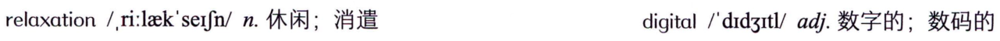

```text
relaxation /ri:laek'serjn/n.休闲；消遣
digital/did3itl/adj.数字的；数码的
```

#### 概述


```text
后半句中用将来完成时willhave arrived，表达“截止到将来那个时候的之前，数字化时
代已经来临了”。
```

### 【补充】三种“完成”时态可以理解为“阶段性总结”，站在某个时间点回头看之前，总结

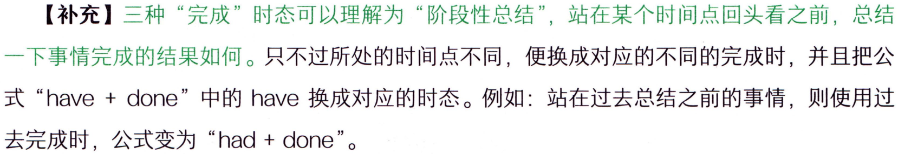

```text
【补充】三种“完成”时态可以理解为“阶段性总结”，站在某个时间点回头看之前，总结
一下事情完成的结果如何。只不过所处的时间点不同，便换成对应的不同的完成时，并且把公
式“have+done”中的 have 换成对应的时态。例如：站在过去总结之前的事情，则使用过
去完成时，公式变为“had+done”。
```

### （四）“完成进行”时态

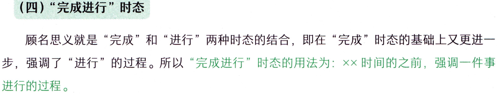

```text
（四）“完成进行”时态
顾名思义就是“完成”和“进行”两种时态的结合，即在“完成”时态的基础上又更进一
步，强调了“进行”的过程。所以“完成进行”时态的用法为：××时间的之前，强调一件事
进行的过程。
```

### 【补充】“进行”的过程又分为三种：还在进行（事情没有全部做完)、持续进行（不间断地

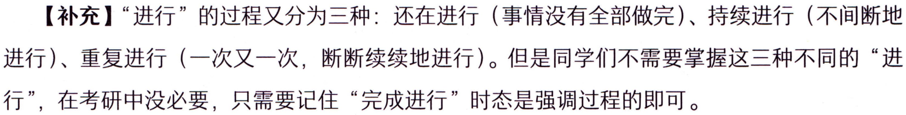

```text
【补充】“进行”的过程又分为三种：还在进行（事情没有全部做完)、持续进行（不间断地
进行）、重复进行（一次又一次，断断续续地进行）。但是同学们不需要掌握这三种不同的“进
行”，在考研中没必要，只需要记住“完成进行”时态是强调过程的即可。
```

#### 1.现在完成进行时：谓语动词=have/hasbeen+doing

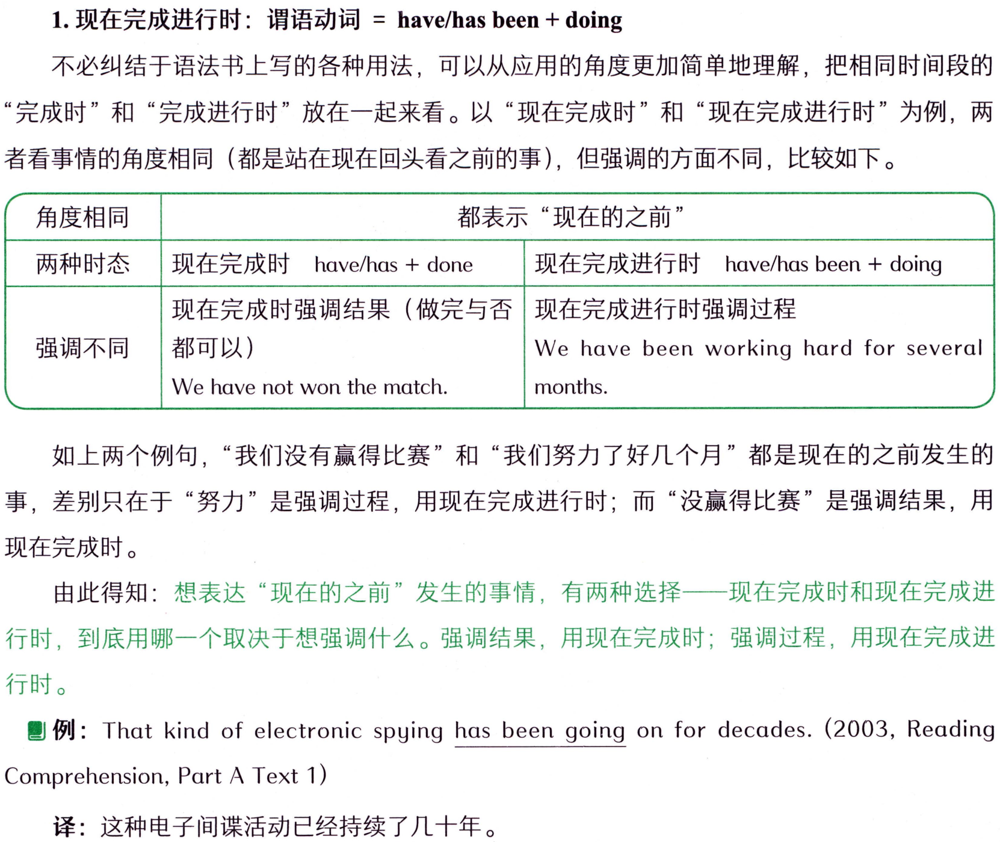

```text
1.现在完成进行时：谓语动词=have/hasbeen+doing
不必纠结于语法书上写的各种用法，可以从应用的角度更加简单地理解，把相同时间段的
“完成时”和“完成进行时”放在一起来看。以“现在完成时”和“现在完成进行时”为例，两
者看事情的角度相同(都是站在现在回头看之前的事)，但强调的方面不同，比较如下。
角度相同
都表示“现在的之前”
两种时态
现在完成时have/has + done
现在完成进行时have/has been+doing
现在完成进行时强调过程
现在完成时强调结果（做完与否
都可以)
强调不同
Wehavebeenworking hardforseveral
We have not won the match.
months.
如上两个例句，“我们没有赢得比赛”和“我们努力了好几个月”都是现在的之前发生的
事，差别只在于“努力”是强调过程，用现在完成进行时；而“没赢得比赛”是强调结果，用
现在完成时。
由此得知：想表达“现在的之前”发生的事情，有两种选择一—现在完成时和现在完成进
行时，到底用哪一个取决于想强调什么。强调结果，用现在完成时；强调过程，用现在完成进
行时。
例: That kind of electronic spying has been going on for decades. (2003, Reading
Comprehension, Part A Text 1)
译：这种电子间谍活动已经持续了几十年。
```

#### 词汇表

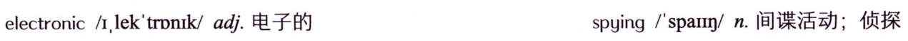

```text
spying / sparn/ n.间谍活动；侦探
electronic/1.lek'tronik/adj.电子的
```

#### 概述

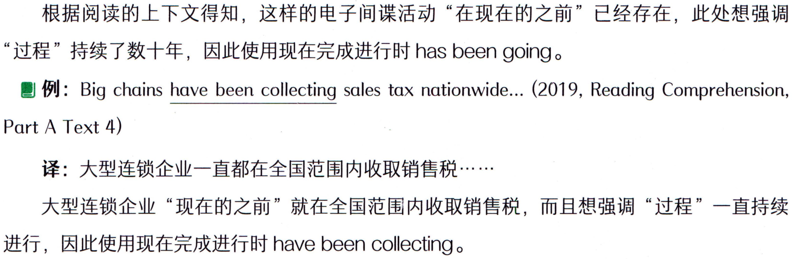

```text
根据阅读的上下文得知，这样的电子间谍活动“在现在的之前”已经存在，此处想强调
“过程”持续了数十年，因此使用现在完成进行时has been going。
例: Big chains have been collecting sales tax nationwide... (2019, Reading Comprehension,
Part A Text 4)
译：大型连锁企业一直都在全国范围内收取销售税·.·.
大型连锁企业“现在的之前”就在全国范围内收取销售税，而且想强调“过程”一直持续
进行，因此使用现在完成进行时 have been collecting。
```

#### 2.过去完成进行时：谓语动词=had been + doing

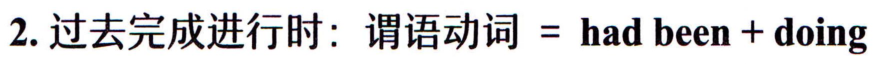

```text
2.过去完成进行时：谓语动词=had been + doing
```

#### 3.将来完成进行时：谓语动词=will have been+ doing

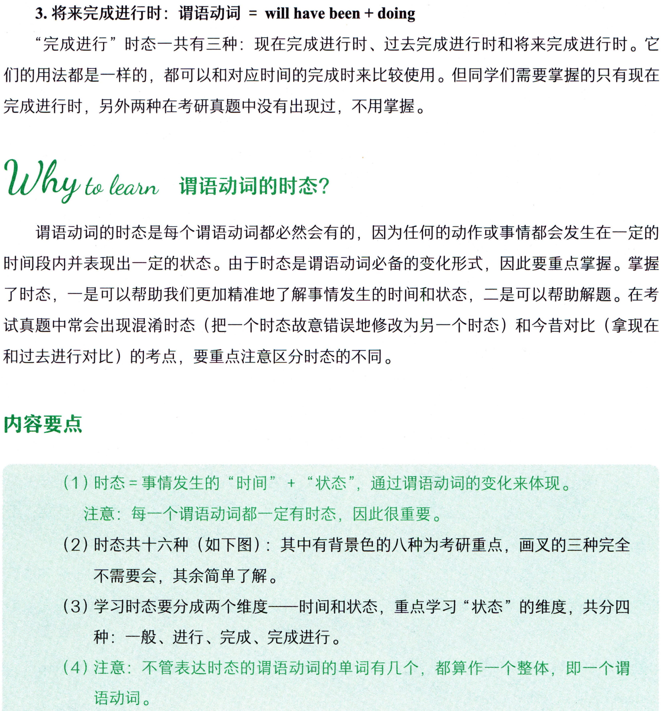

```text
3.将来完成进行时：谓语动词=will have been+ doing
“完成进行”时态一共有三种：现在完成进行时、过去完成进行时和将来完成进行时。它
们的用法都是一样的，都可以和对应时间的完成时来比较使用。但同学们需要掌握的只有现在
完成进行时，另外两种在考研真题中没有出现过，不用掌握。
谓语动词的时态是每个谓语动词都必然会有的，因为任何的动作或事情都会发生在一定的
时间段内并表现出一定的状态。由于时态是谓语动词必备的变化形式，因此要重点掌握。掌握
了时态，一是可以帮助我们更加精准地了解事情发生的时间和状态，二是可以帮助解题。在考
试真题中常会出现混淆时态（把一个时态故意错误地修改为另一个时态）和今昔对比（拿现在
和过去进行对比）的考点，要重点注意区分时态的不同。
内容要点
（1）时态=事情发生的“时间”+“状态”，通过谓语动词的变化来体现。
注意：每一个谓语动词都一定有时态，因此很重要。
（2）时态共十六种（如下图）：其中有背景色的八种为考研重点，画叉的三种完全
不需要会，其余简单了解。
（3）学习时态要分成两个维度一一时间和状态，重点学习“状态”的维度，共分四
种：一般、进行、完成、完成进行。
（4）注意：不管表达时态的谓语动词的单词有几个，都算作一个整体，即一个谓
语动词。
```

#### 词汇表

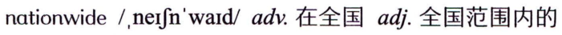

```text
nationwide/.nerjn'waid/adv.在全国adj.全国范围内的
```

#### 概述


```text
时态的公式
时间
过去
将来
过去将来
现在
状态
般过去将来时
一般将来时
一般过去时
一般现在时
一般
would + do
will + do
p!p
was/were going
am/is/are going to + do
to + do
进行
过去进行时
现在进行时
将来进行时
will be + doing
be + doing
was/were+ doingam/is/are+ doing
完成
过去完成时
现在完成时
将来完成时
have + done
had + done
have/has + done
will have+done
完成进行
现在完成进行时
将来完成进行时
过去完成进行时
have +
have/has been +
had been + doing
will have been + doing
buiop
been+doing
真题演练
请用下划线标出谓语动词的部分，并判断谓语动词的时态及时态表达的含义。
1. The use of this little-known practice has accelerated in recent years... (2019, Reading
Comprehension,Part A Text 2)
2. The human nose is an underrated tool. (2005, Use of English)
3. Readers are migrating away from print anyway. (2016, Reading Comprehension, Part A
Text 4)
4. Amazon.com received one for its “one-click” online payment system. (2010, Reading
Comprehension,Part AText2)
5. But what will be the nature of that difference? (2011, Reading Comprehension, Part A Text 1)
6.Dr. Yehuda notes another difference between the sexes. (2008, Reading Comprehension,
Part A Text 1)
7. ...his explanation was surprisingly straight up. (2011, Reading Comprehension, Part A Text 2)
8. We will become a second-rate country. (2004, Reading Comprehension, Part A Text 4)
9. And a significant number of the homeless have serious mental disorders. (2006, Use of
English)
10. ...lots of working folks had already seen signs of the slowdown themselves. (2004, Reading
Comprehension, Part A Text 3)
11. My wife and I lectured about this looming danger twenty years ago. (2001, Reading
Comprehension, Passage 2)
12. Americans’ life expectancy has nearly doubled over the past century. (2003, Reading
Comprehension, Part A Text 4)
13. A team of researchers... would submit the results of their research to a journal. (2008,
Reading Comprehension, Part A Text 2)
14. Foreign-made cars and textiles were sweeping into the domestic market. (2000, Reading
Comprehension, Passage 1)
15. In recent years, railroads have been combining with each other... (2003, Reading
Comprehension, Part A Text 3)
(2007, Use of English)
17. A good innovational thinker is always exploring the many other possibilities. (2009,
Reading Comprehension, Part A Text 1)
18. This tendency in the natural sciences has long been evident in the social sciences too.
(2012, Reading Comprehension, Part C)
我是一条答案的分隔线，请先不要偷看呦！
1. The use of this little-known practice has accelerated in recent years... (2019, Reading
Comprehension, Part A Text 2)
译：近年来，这种少有人知的做法已被加快推行…·.
时态为现在完成时，表示现在的之前（从过去到现在）已经发生的动作。
2. The human nose is an underrated tool. (2005, Use of English)
译：人类的鼻子是一个被低估的工具。
时态为一般现在时，表示现在的客观状态。
3. Readers are migrating away from print anyway. (2016, Reading Comprehension, Part A
Text 4)
译：无论如何，读者正在远离纸质版(报纸)。
时态为现在进行时，表示现在正在进行的动作。
4. Amazon.com received one for its “one-click" online payment system. (2010, Reading
Comprehension, Part A Text 2)
译：亚马逊公司的“一键式”在线支付系统获得了一项（专利）。
时态为一般过去时，表示过去的动作。
5. But what will be the nature of that difference? (2011, Reading Comprehension, Part A Text 1)
译：但是那种不同的本质会是什么呢？
时态为一般将来时，表示将来的状态。
6. Dr. Yehuda notes another difference between the sexes. (2008, Reading Comprehension,
Part A Text 1)
译：耶胡达博士注意到了两性之间的另一个差异。
时态为一般现在时，表示现在的动作。
7. ...his explanation was surprisingly straight up. (2011, Reading Comprehension, Part A Text 2)
译：.…·他的解释出乎意料地直率坦白。
时态为一般过去时，表示过去的状态。
8. We will become a second-rate country. (2004, Reading Comprehension, Part A Text 4)
译：我们将变成一个二流国家。
时态为一般将来时，表示将来的状态。
9. And a significant number of the homeless have serious mental disorders. (2006, Use of
English)
译：并且相当数量的无家可归者患有严重的精神疾病。
时态为一般现在时，表示现在的状态。
10. ...lots of working folks had already seen signs of the slowdown themselves. (2004, Reading
Comprehension, Part A Text 3)
译：·…·许多上班族自己就已经看到了（经济）减速的迹象。
时态为过去完成时，表示过去的之前已经发生的事情。
11. My wife and I lectured about this looming danger twenty years ago. (2001, Reading
Comprehension, Passage 2)
译：我和妻子曾在20年前，就这一正在逼近的危险发表过演讲。
时态为一般过去时，表示过去的动作。
12. Americans’ life expectancy has nearly doubled over the past century. (2003, Reading
Comprehension, Part A Text 4)
译：在过去的一个世纪里，美国人的预期寿命几乎延长了一倍。
时态为现在完成时，表示现在的之前（从过去到现在）已经发生的动作。
13. A team of researchers... would submit the results of their research to a journal. (2008,
Reading Comprehension, Part A Text 2)
译：一组研究人员·……·将会把他们研究的结果递交给一家期刊。
时态为过去将来时，表示过去某个时间点之后将要发生的动作。
14. Foreign-made cars and textiles were sweeping into the domestic market. (2000, Reading
Comprehension, Passage 1)
译：外国制造的汽车和纺织品正涌入（美国）国内市场。
时态为过去进行时，表示过去正在进行或持续进行的动作。
15. In recent years, railroads have been combining with each other... (2003, Reading
Comprehension, Part A Text 3)
译：近年来，铁路公司一直在相互联合……···
时态为现在完成进行时，表示现在的之前（从过去到现在）已经发生的事情，并且强调过
程的持续。
16. By 1830 the former Spanish and Portuguese colonies had become independent nations.
(2007, Use of English)
译：截止到1830 年，西班牙和葡萄牙的前殖民地已经成为独立的国家。
时态为过去完成时，表示过去的之前已经发生的事情。
17. A good innovational thinker is always exploring the many other possibilities. (2009,
Reading Comprehension, Part A Text 1)
译：一个优秀的、创新型的思考者总是在探索许多其他的可能性。
时态为现在进行时，表示现在正在进行或持续进行的动作。
18. This tendency in the natural sciences has long been evident in the social sciences too.
(2012, Reading Comprehension, Part C)
译：自然科学领域的这一趋势长期以来在社会科学领域也很明显。
时态为现在完成时，表示现在的之前（从过去到现在）一直持续的状态。
考场攻略
谓语动词的时态建议重点掌握，不仅帮助准确理解句意，还可以帮助解题。
时态是每个句子中每个谓语动词必然会有的形式，所以一定要重点掌握，才能准
确地看懂每件事所发生的时间和状态。例如：
I love you.
I loved you.
同样表示“我爱你”，但是由于时态不同，意思完全不一样。“1 loveyou.”是一般
现在时，表示“我现在爱你”。而“1lovedyou.”是一般过去时，表示“我过去爱你
（现在不爱了）”。如上可见，理解时态对于准确理解句意是多么重要。
在考研阅读中，会出现专门针对时态设置的“混淆时间/混淆时态”的错误选项，例
如2008年阅读Text3第34题中，原文中表述的是“hasnotchanged"，现在完成时，
表示“现在的之前没有改变”；而错误选项中故意写成了“willremainunchanged",
一般将来时，表示“将来保持着不会改变”，虽然都是“不改变”，但选项与原文在时
态上明显不符，这就是错误选项的出题套路一故意“混淆时间／混淆时态”。
当然，以下这个选项中不只出现了时态这一处错误，还有“偷换概念”的另一处
错误，原文中说的是“the length of military uniforms （军装的长度)”，而错误选项
中故意写成了“thedesignofmilitaryuniforms（军装的样式）”。注意观察以下真题
讲解的截图，左侧是选项，右侧是原文和详解，中英文双语讲解，有利于提高大家对
于英语的理解，帮助大家避免过于陷入中文的意思中而忽略英语。并且，选项与原文
对应的正确内容加了颜色，与原文不符的错误内容加了下划线，这样有利于大家明确
每一个选项的正确和错误的点（由于本书不是多色印刷，所以不能使用不同颜色呈现，
因此使用了下划线）。
以下截图出自“田静讲真题”的真题书课包，这套真题书课包专门采用多色印刷，
每个选项中正确和错误的内容都会通过红蓝两色比对（红色代表选项与原文对应的正
确内容，蓝色代表选项与原文不符的错误内容），并且橙色标注题干定位信息，黄色背
景色标注主要的正误原因，这样更加一目了然，帮助同学们化繁为简。快来跟住静姐
Welearn from thelast paragraph that in the near future
从最后一段我们可以知道在不久的将来
```

### 【段5】 ③...unlike those for basketball, the length of military

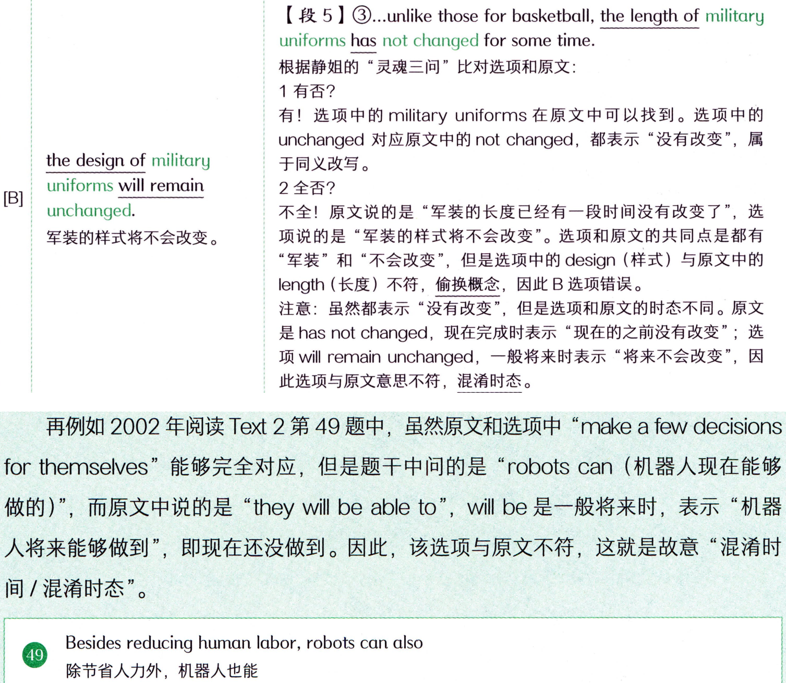

```text
【段5】 ③...unlike those for basketball, the length of military
uniforms has not changed for some time.
根据静姐的“灵魂三问”比对选项和原文：
1有否？
有！选项中的militaryuniforms在原文中可以找到。选项中的
unchanged对应原文中的not changed，都表示“没有改变”，属
the design of military
于同义改写。
uniforms will remain
2全否？
[B]
unchanged.
不全！原文说的是“军装的长度已经有一段时间没有改变了”，选
军装的样式将不会改变。
项说的是“军装的样式将不会改变”。选项和原文的共同点是都有
“军装”和“不会改变”，但是选项中的design（样式）与原文中的
length（长度）不符，偷换概念，因此B选项错误。
注意：虽然都表示“没有改变”，但是选项和原文的时态不同。原文
是has not changed，现在完成时表示“现在的之前没有改变”；选
项willremainunchanged，一般将来时表示“将来不会改变”，因
此选项与原文意思不符，混淆时态。
再例如 2002 年阅读 Text 2 第 49 题中， 虽然原文和选项中“make a few decisions
for themselves”能够完全对应，但是题干中问的是“robots can（机器人现在能够
做的)"，而原文中说的是“they will be able to"，will be 是一般将来时， 表示“机器
人将来能够做到”，即现在还没做到。因此，该选项与原文不符，这就是故意“混淆时
间/混淆时态”。
Besides reducing human labor, robots can also
除节省人力外，机器人也能
```

### 【段3】 ①But if robots are to reach the next stage of

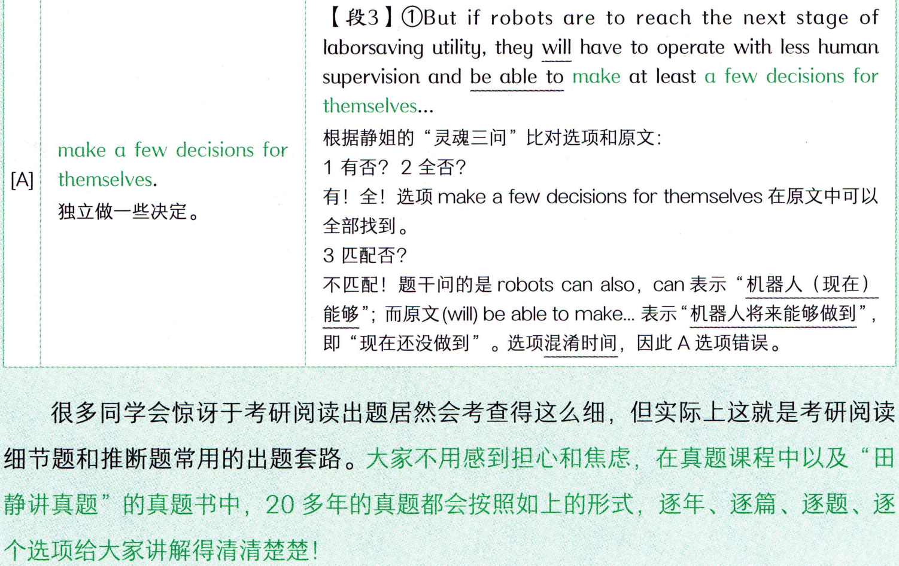

```text
【段3】 ①But if robots are to reach the next stage of
laborsaving utility, they will have to operate with less human
supervision and be able to make at least a few decisions for
themselves...
根据静姐的“灵魂三问”比对选项和原文：
make a few decisions for
1有否？2全否？
themselves.
[A]
有！全！选项make a few decisions for themselves 在原文中可以
独立做一些决定。
全部找到。
3匹配否？
不匹配！题干问的是robots can also，can表示“机器人（现在）
能够”；而原文(will)be able tomake...表示“机器人将来能够做到”，
即“现在还没做到”。选项混淆时间，因此A选项错误。
很多同学会惊讶于考研阅读出题居然会考查得这么细，但实际上这就是考研阅读
细节题和推断题常用的出题套路。大家不用感到担心和焦虑，在真题课程中以及“田
静讲真题”的真题书中，20多年的真题都会按照如上的形式，逐年、逐篇、逐题、逐
个选项给大家讲解得清清楚楚！
```

## 二、谓语动词的情态


```text
二、谓语动词的情态
```

## Uhatis谓语动词的情态?


```text
Uhatis谓语动词的情态?
情态，顾名思义就是表示“情绪和态度”。针对不同的事情要表达不同的情绪和态度，需
要在谓语动词前加上不同的情态动词。不同于时态和语态的变化（把谓语动词的形式进行改
变)，情态的变化是保持谓语动词不变（用动词原形)，在它前面加上一个情态动词。
考研中常出现的情态动词如下。
现在时
过去时
could
can
will
would
shall （考研真题中不常出现）
should
hpw
might
情态动词的使用，有如下特点。
一是情态动词后要接动词原形。若谓语动词是be 动词，就用“情态动词+be”。
二是情态动词一般只有现在和过去两种时态，可以成对地来记，例如 can 是现在时，而
could是它对应的过去时。上表中只有must没有过去时。但要注意，could/would/should/
might这四个词有两种用法，除表示相应的过去时之外，还可以表示现在的一种更委婉和客气
的语气。例如:
Can you help me now?
Could you help me now?
同样表示“你可以帮我吗”，同样表示现在，只不过could 比can在语气上更委婉客气。
三是情态动词没有人称的变化，也就是说无论主语是谁，情态动词永远用原形，即没有第
三人称单数形式。
四是情态动词变否定，直接在情态动词后加not；变疑问，直接把情态动词提到主语前。
```

#### 1.情态动词表示“情态”

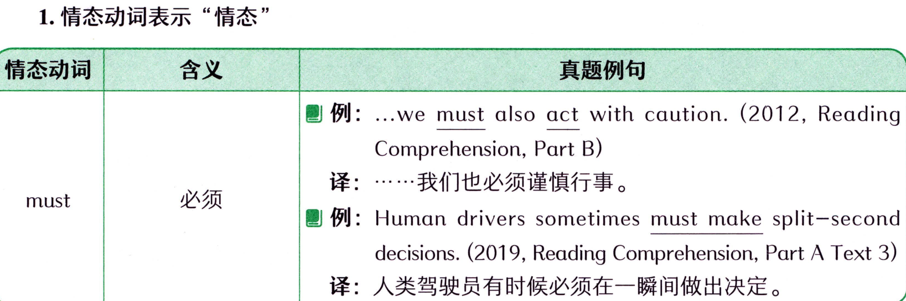

```text
1.情态动词表示“情态”
含义
情态动词
真题例句
例:...we must also act with caution. (2012, Reading
Comprehension, Part B)
译：·…我们也必须谨慎行事。
必须
must
例:Human drivers sometimes must make split-second
decisions. (2019, Reading Comprehension, Part A Text 3)
译：人类驾驶员有时候必须在一瞬间做出决定。
```

#### 词汇表


```text
split-second一瞬间做出的
```

#### 概述

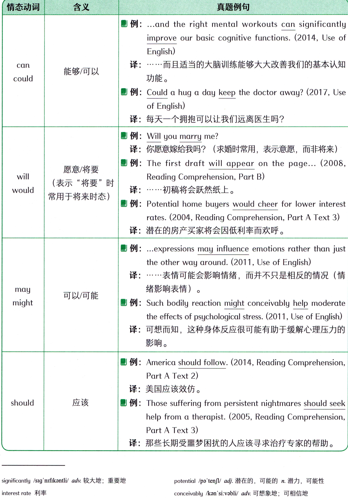

```text
含义
真题例句
情态动词
例: ...and the right mental workouts can significantly
improve our basic cognitive functions. (2014, Use of
English)
译：..…·而且适当的大脑训练能够大大改善我们的基本认知
can
能够/可以
功能。
could
例: Could a hug a day keep the doctor away? (2017, Use
of English)
译：每天一个拥抱可以让我们远离医生吗？
例: Will you marry me?
译：你愿意嫁给我吗？(求婚时常用，表示意愿，而非将来)
例: The first draft will appear on the page... (2008,
愿意/将要
will
Reading Comprehension,Part B)
（表示“将要”时
would
译：·初稿将会跃然纸上。
常用于将来时态)
例: Potential home buyers would cheer for lower interest
rates. (2004, Reading Comprehension, Part A Text 3)
译：潜在的房产买家将会因低利率而欢呼。
例: ...expressions may influence emotions rather than just
the other way around. (2011, Use of English)
译：·……表情可能会影响情绪，而并不只是相反的情况（情
绪影响表情）。
hpw
可以/可能
例: Such bodily reaction might conceivably help moderate
might
the effects of psychological stress. (2011, Use of English)
译：可想而知，这种身体反应很可能有助于缓解心理压力的
影响。
例： America should follow. (2014, Reading Comprehension,
Part A Text 2)
译：美国应该效仿。
应该
例: Those suffering from persistent nightmares should seek
should
help from a therapist. (2005, Reading Comprehension,
Part A Text 3)
译：那些长期受噩梦困扰的人应该寻求治疗专家的帮助。
significantly/sig'nifikantli/adv.较大地；重要地
potential/pa'tenJl/adj.潜在的，可能的n.潜力，可能性
interest rate利率
conceivably/kan'si:vabli/adv.可想象地；可相信地
```

#### 词汇表

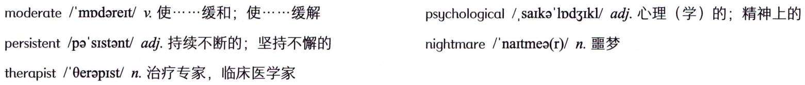

```text
moderatempdarert/v.使...缓和；使....缓解
psychological /,saika'lpd3ikl/adj.心理（学）的；精神上的
persistent/pa'sistont/adj.持续不断的；坚持不懈的
nightmare /nartmea(r)/n.噩梦
therapist/Oerapist/n.治疗专家，临床医学家
```

#### 2.情态动词表示“推测”

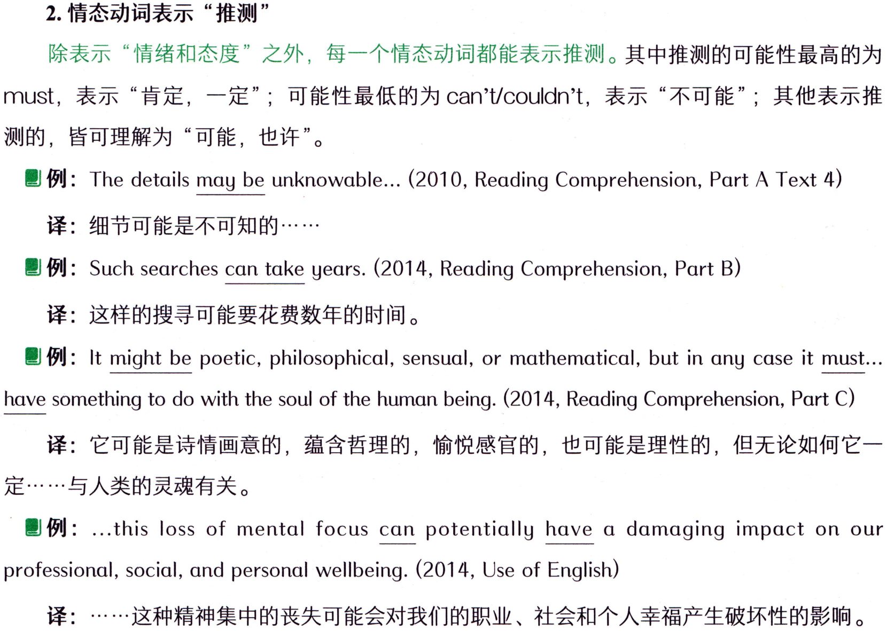

```text
2.情态动词表示“推测”
除表示“情绪和态度”之外，每一个情态动词都能表示推测。其中推测的可能性最高的为
must，表示“肯定，一定”；可能性最低的为 can't/couldn't，表示“不可能”；其他表示推
测的，皆可理解为“可能，也许”。
例: The details may be unknowable... (2010, Reading Comprehension, Part A Text 4)
译：细节可能是不可知的……···
例: Such searches can take years. (2014, Reading Comprehension, Part B)
译：这样的搜寻可能要花费数年的时间。
川例: It might be poetic, philosophical, sensual, or mathematical, but in any case it must...
have something to do with the soul of the human being. (2014, Reading Comprehension, Part C)
译：它可能是诗情画意的，蕴含哲理的，愉悦感官的，也可能是理性的，但无论如何它一
定.…·..与人类的灵魂有关。
例: ...this loss of mental focus can potentially have a damaging impact on our
professional, social, and personal wellbeing. (2014, Use of English)
译：...·这种精神集中的丧失可能会对我们的职业、社会和个人幸福产生破坏性的影响。
```

### 【补充】除“情态动词+do”之外，还有一些变体的结构，如下:

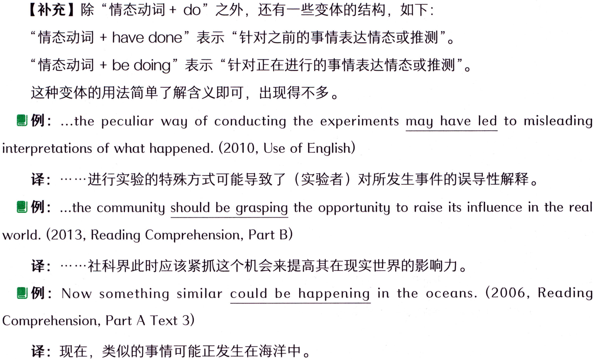

```text
【补充】除“情态动词+do”之外，还有一些变体的结构，如下:
“情态动词+have done”表示“针对之前的事情表达情态或推测”。
“情态动词+bedoing”表示“针对正在进行的事情表达情态或推测”。
这种变体的用法简单了解含义即可，出现得不多。
例: ...the peculiar way of conducting the experiments may have led to misleading
interpretations of what happened. (2010, Use of English)
译：·……·进行实验的特殊方式可能导致了（实验者）对所发生事件的误导性解释。
例: ..the community should be grasping the opportunity to raise its influence in the real
world. (2013, Reading Comprehension, Part B)
译：...··社科界此时应该紧抓这个机会来提高其在现实世界的影响力。
例: Now something similar could be happening in the oceans. (2006, Reading
Comprehension, Part A Text 3)
译：现在，类似的事情可能正发生在海洋中。
```

### 【补充】除以上的情态动词之外，还有一些常用的情态动词词组，能够辨认并了解含义即

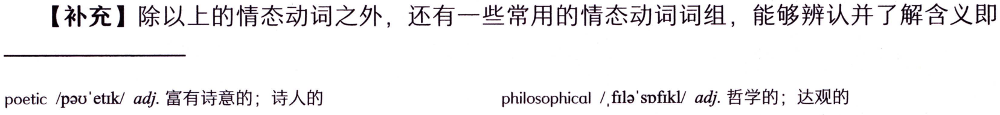

```text
【补充】除以上的情态动词之外，还有一些常用的情态动词词组，能够辨认并了解含义即
philosophical /.fila'spfikl/ adj.哲学的；达观的
poetic/pau'etik/adji.富有诗意的；诗人的
```

#### 词汇表

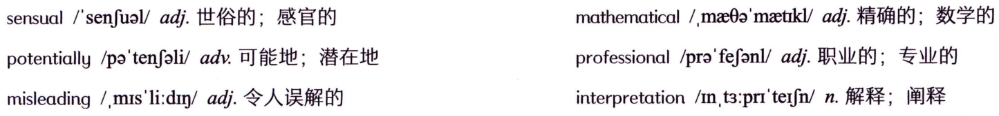

```text
mathematical/,ma0a'maetikl/adj.精确的；数学的
sensual /'senJualadj.世俗的；感官的
potentially/pa'tenfoli/adv.可能地；潜在地
professional/pra'fefonl/adj.职业的；专业的
interpretation/n,t3:prr'terjn/n.解释；闸释
misleading/,mis'lidin/adj.令人误解的
```

#### 概述

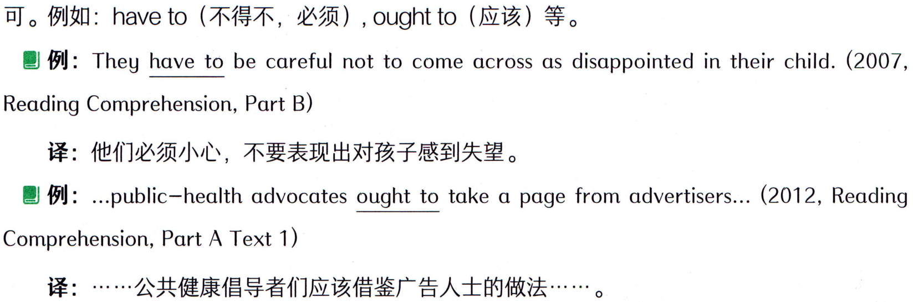

```text
可。例如：have to（不得不，必须），oughtto（应该）等。
例: They have to be careful not to come across as disappointed in their child. (2007,
Reading Comprehension, Part B)
译：他们必须小心，不要表现出对孩子感到失望。
例: ...public-health advocates ought to take a page from advertisers... (2012, Reading
Comprehension, Part A Text 1)
译：·……·公共健康倡导者们应该借鉴广告人士的做法……·…·
```

### 【补充】情态动词还可以用于虚拟，稍后会在第二部分第三章第一节中详细展开讲解。


```text
【补充】情态动词还可以用于虚拟，稍后会在第二部分第三章第一节中详细展开讲解。
```

## Why te lean 谓语动词的情态?

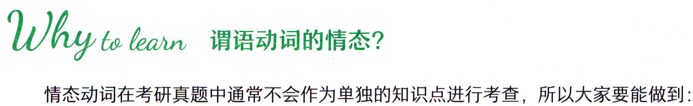

```text
Why te lean 谓语动词的情态?
情态动词在考研真题中通常不会作为单独的知识点进行考查，所以大家要能做到：
```

## 一、结合上下文，看懂情态动词在句中表达的“情态”或“推测”的含义即可。

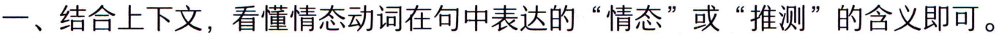

```text
一、结合上下文，看懂情态动词在句中表达的“情态”或“推测”的含义即可。
```

## 二、情态还会结合时态、被动语态和否定，构成一个整体的谓语动词。能够准确找到这个

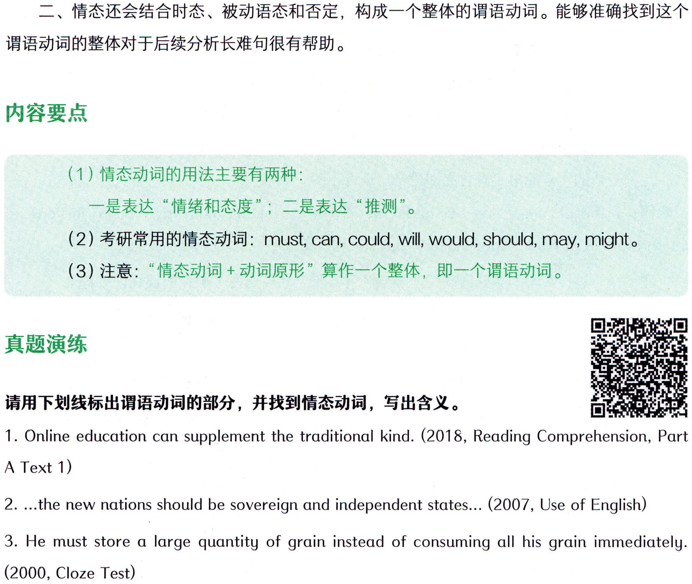

```text
二、情态还会结合时态、被动语态和否定，构成一个整体的谓语动词。能够准确找到这个
谓语动词的整体对于后续分析长难句很有帮助。
内容要点
（1）情态动词的用法主要有两种：
一是表达“情绪和态度”；二是表达“推测”。
(2) 考研常用的情态动词: must, can, could, will would, should, may, might。
（3）注意：“情态动词+动词原形”算作一个整体，即一个谓语动词。
真题演练
请用下划线标出谓语动词的部分，并找到情态动词，写出含义。
1. Online education can supplement the traditional kind. (2018, Reading Comprehension, Part
A Text 1)
2. ...the new nations should be sovereign and independent states... (2007, Use of English)
3. He must store a large quantity of grain instead of consuming all his grain immediately.
(2000, Cloze Test)
```

#### 词汇表

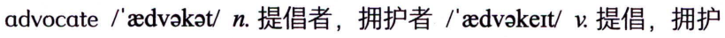

```text
advocate/aedvakat/n.提倡者，拥护者/aedvakert/v提倡，拥护
```

#### 概述

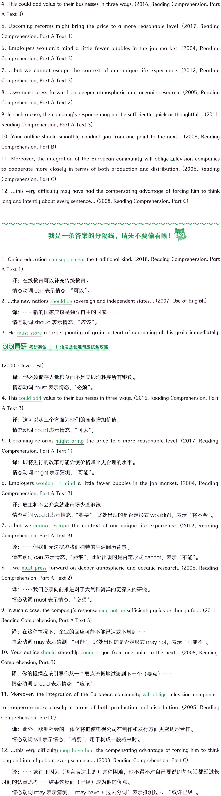

```text
4. This could add value to their businesses in three ways. (2016, Reading Comprehension, Part
A Text 3)
5. Upcoming reforms might bring the price to a more reasonable level. (2017, Reading
Comprehension, Part A Text 1)
6. Employers wouldn't mind a little fewer bubbles in the job market. (2004, Reading
Comprehension, Part A Text 3)
7. ...but we cannot escape the context of our unique life experience. (2012, Reading
Comprehension, Part A Text 3)
8. ...we must press forward on deeper atmospheric and oceanic research. (2005, Reading
Comprehension, Part A Text 2)
9. In such a case, the company's response may not be sufficiently quick or thoughtful... (2011,
Reading Comprehension, Part A Text 3)
10. Your outline should smoothly conduct you from one point to the next... (2008, Reading
Comprehension, Part B)
11. Moreover, the integration of the European community will oblige television companies
to cooperate more closely in terms of both production and distribution. (2005, Reading
Comprehension, Part C)
12. ...this very difficulty may have had the compensating advantage of forcing him to think
long and intently about every sentence... (2008, Reading Comprehension, Part C)
我是一条答案的分隔线，请先不要偷看呦！
1. Online education can supplement the traditional kind. (2018, Reading Comprehension, Part
A Text 1)
译：在线教育可以补充传统教育。
情态动词can表示情态，“可以”。
2. ...the new nations should be sovereign and independent states... (2007, Use of English)
译：…·新的国家应该是独立自主的国家………
情态动词should表示情态，“应该”。
3. He must store a large quantity of grain instead of consuming all his grain immediately.
句句真研 考研英语（一）语法及长难句应试全攻略
(2000, Cloze Test)
译：他必须储存大量粮食而不是立即消耗完所有粮食。
情态动词must表示情态，“必须”。
4. This could add value to their businesses in three ways. (2016, Reading Comprehension, Part
A Text 3)
译：这可以从三个方面为他们的商业增加价值。
情态动词could 表示情态，“可以”。
5. Upcoming reforms might bring the price to a more reasonable level. (2017, Reading
Comprehension, Part A Text 1)
译：即将进行的改革可能会使价格降至更合理的水平。
情态动词might表示猜测，“可能”。
6. Employers wouldn’ t mind a little fewer bubbles in the job market. (2004, Reading
Comprehension, Part A Text 3)
译：雇主将不会介意就业市场少些泡沫。
情态动词would表示情态，“将要”，此处出现的是否定形式wouldn't，表示“将不会”。
7. ...but we cannot escape the context of our unique life experience. (2012, Reading
Comprehension, Part A Text 3)
译：….…·但我们无法摆脱我们独特的生活阅历背景。
情态动词can 表示情态，“能够”，此处出现的是否定形式cannot，表示“不能”。
8. ...we must press forward on deeper atmospheric and oceanic research. (2005, Reading
Comprehension, Part A Text 2)
译：……·我们必须向前推进对于大气和海洋的更深入的研究。
情态动词must表示情态，“必须”。
9. In such a case, the company's response may not be sufficiently quick or thoughtful.. (2011,
Reading Comprehension, Part A Text 3)
译：在这种情况下，企业的回应可能不够迅速或不周到·…
情态动词 may表示猜测，“可能”，此处出现的是否定形式may not，表示“可能不”。
10. Your outline should smoothly conduct you from one point to the next... (2008, Reading
Comprehension, Part B)
译：你的提纲应该引导你从一个要点流畅地过渡到下一个（要点）…·
情态动词 should表示情态，“应该”。
11. Moreover, the integration of the European community will oblige television companies
to cooperate more closely in terms of both production and distribution. (2005, Reading
Comprehension, Part C)
译：此外，欧洲社会的一体化将迫使电视公司在制作和发行方面更密切地合作。
情态动词wil表示情态，“将要”，用于构成一般将来时。
12. ...this very difficulty may have had the compensating advantage of forcing him to think
long and intently about every sentence... (2008, Reading Comprehension, Part C)
译：·….·或许正因为（语言表达上的）这种困难，他不得不对自己要说的每句话都经过长
时间的认真思考·…..…·结果这反而（已经）成为他的优点。
情态动词 may表示猜测，“may have+过去分词”表示推测过去，“或许已经”。
```

## 三、谓语动词的语态


```text
三、谓语动词的语态
```

## Uhatis 谓语动词的语态?

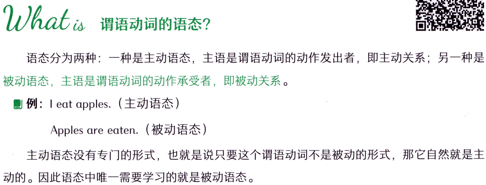

```text
Uhatis 谓语动词的语态?
语态分为两种：一种是主动语态，主语是谓语动词的动作发出者，即主动关系；另一种是
被动语态，主语是谓语动词的动作承受者，即被动关系。
例：丨eat apples.（主动语态）
Apples are eaten．（被动语态）
主动语态没有专门的形式，也就是说只要这个谓语动词不是被动的形式，那它自然就是主
动的。因此语态中唯一需要学习的就是被动语态。
```

#### 1.被动语态的构成：be+done

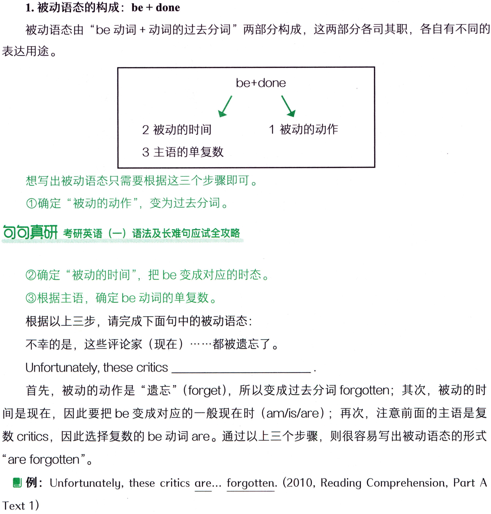

```text
1.被动语态的构成：be+done
被动语态由“be动词+动词的过去分词”两部分构成，这两部分各司其职，各自有不同的
表达用途。
be+done
1被动的动作
2 被动的时间
3主语的单复数
想写出被动语态只需要根据这三个步骤即可。
①确定“被动的动作”，变为过去分词。
句句真研 考研英语（一）语法及长难句应试全攻略
②确定“被动的时间”，把be变成对应的时态。
③根据主语，确定be动词的单复数。
根据以上三步，请完成下面句中的被动语态：
不幸的是，这些评论家（现在）…..…都被遗忘了。
Unfortunately, these critics
首先，被动的动作是“遗忘”（forget)，所以变成过去分词forgotten；其次，被动的时
间是现在，因此要把be变成对应的一般现在时（am/is/are）；再次，注意前面的主语是复
数 critics，因此选择复数的 be 动词 are。通过以上三个步骤，则很容易写出被动语态的形式
"are forgotten"。
 例: Unfortunately, these critics are... forgotten. (2010, Reading Comprehension, Part A
Text 1)
```

### 【补充】如果强调被动的动作发出者，即强调“被谁做”，可以在被动后加上“by+动作的

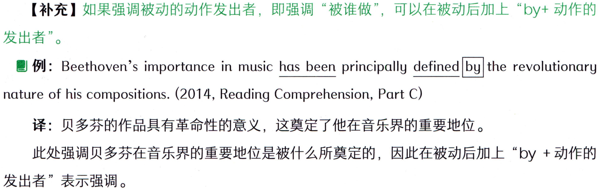

```text
【补充】如果强调被动的动作发出者，即强调“被谁做”，可以在被动后加上“by+动作的
发出者”。
例: Beethoven's importance in music has been principally defined|by the revolutionary
nature of his compositions. (2014, Reading Comprehension, Part C)
译：贝多芬的作品具有革命性的意义，这奠定了他在音乐界的重要地位。
此处强调贝多芬在音乐界的重要地位是被什么所奠定的，因此在被动后加上“by+动作的
发出者”表示强调。
```

### 【补充】由于英语和中文语言特点的不同，为了在中文的语境下便于理解，英语中的被动

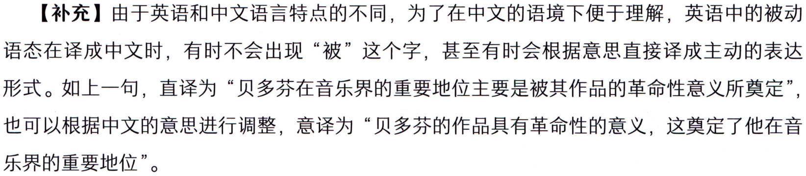

```text
【补充】由于英语和中文语言特点的不同，为了在中文的语境下便于理解，英语中的被动
语态在译成中文时，有时不会出现“被”这个字，甚至有时会根据意思直接译成主动的表达
形式。如上一句，直译为“贝多芬在音乐界的重要地位主要是被其作品的革命性意义所奠定”,
也可以根据中文的意思进行调整，意译为“贝多芬的作品具有革命性的意义，这奠定了他在音
乐界的重要地位”。
```

#### 2.被动语态与时态的结合

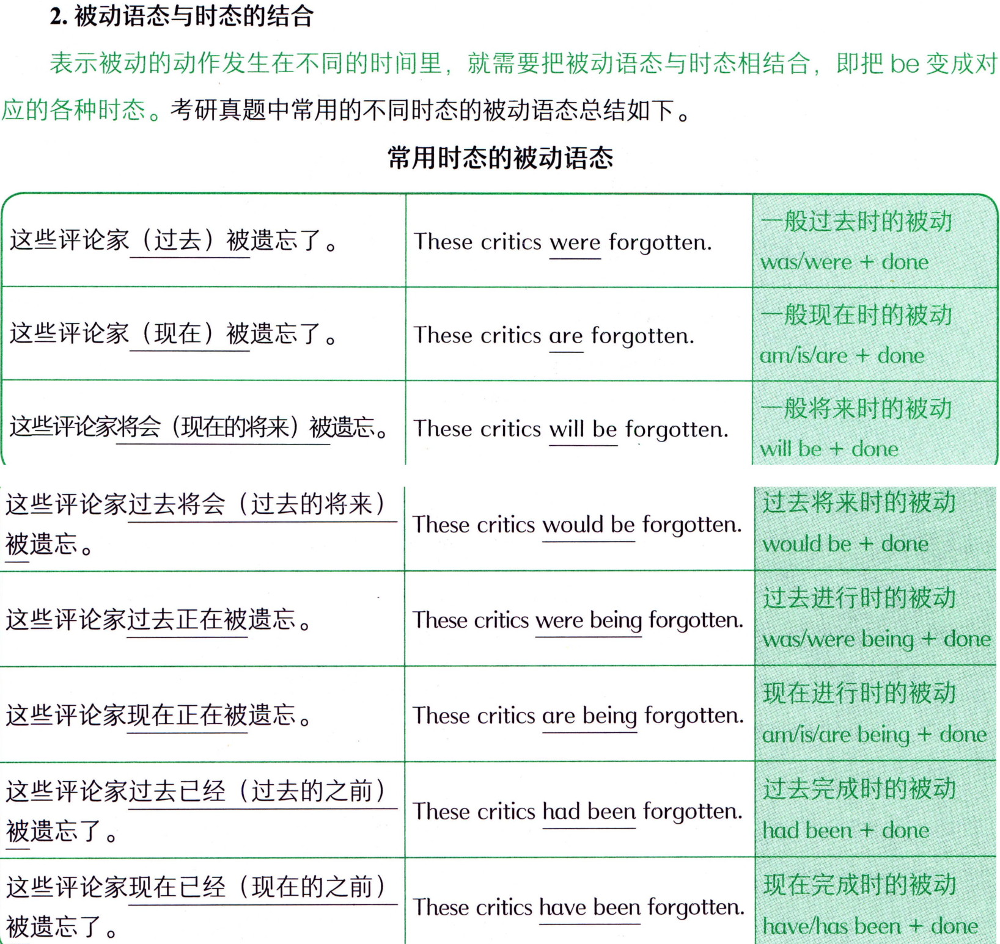

```text
2.被动语态与时态的结合
表示被动的动作发生在不同的时间里，就需要把被动语态与时态相结合，即把be变成对
应的各种时态。考研真题中常用的不同时态的被动语态总结如下。
常用时态的被动语态
一般过去时的被动
这些评论家（过去）被遗忘了。
These critics were forgotten.
was/were + done
般现在时的被动
这些评论家（现在）被遗忘了。
These critics are forgotten.
am/is/are + done
般将来时的被动
这些评论家将会（现在的将来）被遗忘。
These critics will be forgotten.
will be + done
过去将来时的被动
这些评论家过去将会 (过去的将来)
These critics would be forgotten.
被遗忘。
would be + done
过去进行时的被动
这些评论家过去正在被遗忘。
These critics were being forgotten.
was/were being + done
现在进行时的被动
这些评论家现在正在被遗忘。
These critics are being forgotten.
amis/are being + done
过去完成时的被动
这些评论家过去已经 (过去的之前）
These critics had been forgotten.
had been + done
被遗忘了。
现在完成时的被动
这些评论家现在已经 (现在的之前)
These critics have been forgotten.
have/has been + done
被遗忘了。
```

### 【补充】主动和被动的句子中，表现时态的用词不同。在主动语态的句子中，要把“谓语

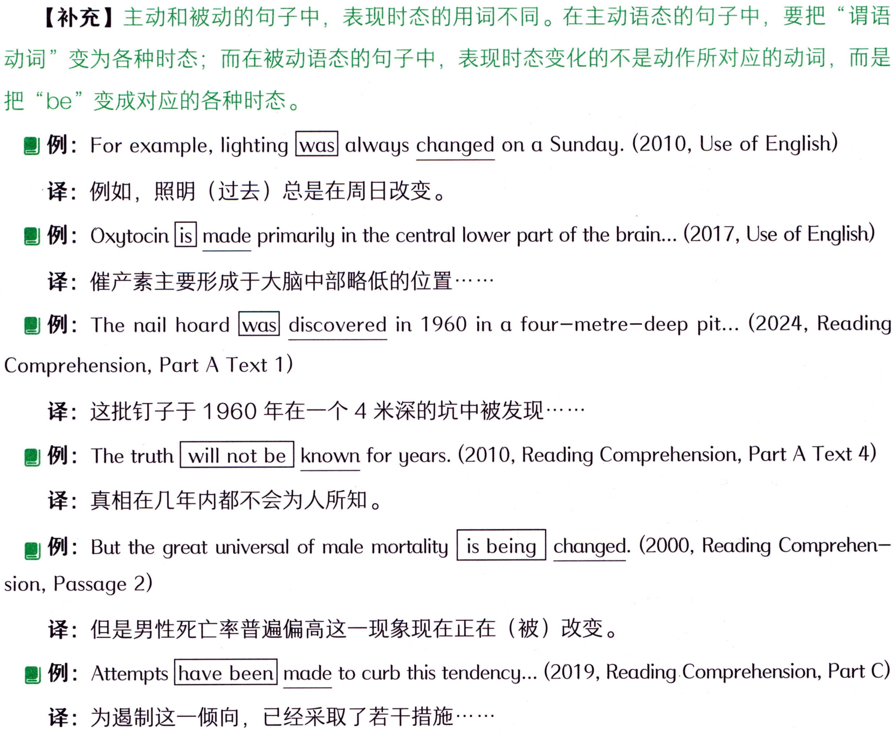

```text
【补充】主动和被动的句子中，表现时态的用词不同。在主动语态的句子中，要把“谓语
动词”变为各种时态；而在被动语态的句子中，表现时态变化的不是动作所对应的动词，而是
把“be”变成对应的各种时态。
 例: For example, lighting was always changed on a Sunday. (2010, Use of English)
译：例如，照明（过去）总是在周日改变。
 例: Oxytocin [is made primarily in the central lower part of the brain... (2017, Use of English)
译：催产素主要形成于大脑中部略低的位置·…·
例:The nail hoard wasdiscovered in 1960 in a four-metre-deep pit...(2024,Reading
Comprehension, Part A Text 1)
译：这批钉子于1960年在一个4米深的坑中被发现·.··
例: The truth will not beknown for years. (2010, Reading Comprehension, Part A Text 4)
译：真相在几年内都不会为人所知。
例：But the great universal of male mortality
changed.(2000, Reading Comprehen-
is being
sion, Passage 2)
译：但是男性死亡率普遍偏高这一现象现在正在（被）改变。
 例: Attempts have been made to curb this tendency... (2019, Reading.Comprehension, Part C)
译：为遏制这一倾向，已经采取了若干措施·….…·
```

#### 3.被动语态与情态的结合

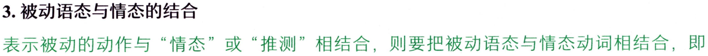

```text
3.被动语态与情态的结合
表示被动的动作与“情态”或“推测”相结合，则要把被动语态与情态动词相结合，即
```

#### 词汇表

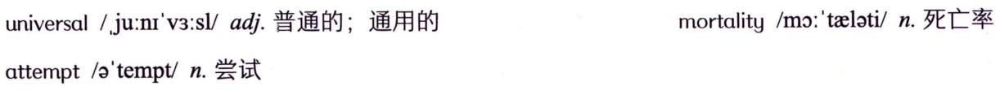

```text
mortality/mo:taelati/n.死亡率
universal/ju:nr'v3:sl/adj.普通的；通用的
attempt/a`tempt/n.尝试
```

#### 概述

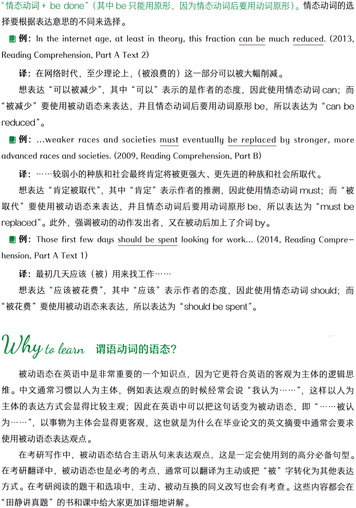

```text
“情态动词+be done”（其中 be 只能用原形，因为情态动词后要用动词原形）。情态动词的选
择要根据表达意思的不同来选择。
例: In the internet age, at least in theory, this fraction can be much reduced. (2013,
Reading Comprehension, Part A Text 2)
译：在网络时代，至少理论上，（被浪费的）这一部分可以被大幅削减。
想表达“可以被减少”，其中“可以”表示的是作者的态度，因此使用情态动词can；而
“被减少”要使用被动语态来表达，并且情态动词后要用动词原形be，所以表达为“canbe
reduced"。
例: ...weaker races and societies must eventually be replaced by stronger, more
advanced races and societies. (2009, Reading Comprehension, Part B)
译：·…···较弱小的种族和社会最终肯定将被更强大、更先进的种族和社会所取代。
想表达“肯定被取代”，其中“肯定”表示作者的推测，因此使用情态动词must；而“被
取代”要使用被动语态来表达，并且情态动词后要用动词原形be，所以表达为“mustbe
replaced”。此外，强调被动的动作发出者，又在被动后加上了介词by。
 例: Those first few days should be spent looking for work... (2014, Reading Compre-
hension,Part A Text 1)
译：最初几天应该（被）用来找工作·…·
想表达“应该被花费”，其中“应该”表示作者的态度，因此使用情态动词 should；而
“被花费”要使用被动语态来表达，所以表达为“should be spent"。
被动语态在英语中是非常重要的一个知识点，因为它更符合英语的客观为主体的逻辑思
维。中文通常习惯以人为主体，例如表达观点的时候经常会说“我认为……”，这样以人为
主体的表达方式会显得比较主观；因此在英语中可以把这句话变为被动语态，即“....-被认
为…….”，以事物为主体会显得更客观，这也就是为什么在毕业论文的英文摘要中通常会要求
使用被动语态表达观点。
在考研写作中，被动语态结合主语从句来表达观点，这是一定会使用到的高分必备句型。
在考研翻译中，被动语态也是必考的考点，通常可以翻译为主动或把“被”字转化为其他表达
方式。在考研阅读的题干和选项中，主动、被动互换的同义改写也会有考查。这些内容都会在
“田静讲真题”的书和课中给大家更加详细地讲解。
```

#### 词汇表

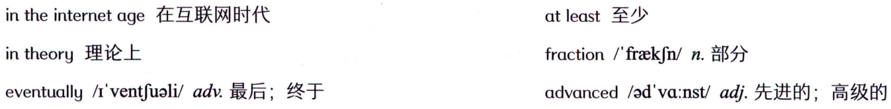

```text
intheinternetage在互联网时代
at least至少
intheory理论上
fraction/fraekfn/n.部分
eventually/I'ventfuoli/adv.最后；终于
advanced/ad'va:nst/adj.先进的；高级的
```

#### 概述

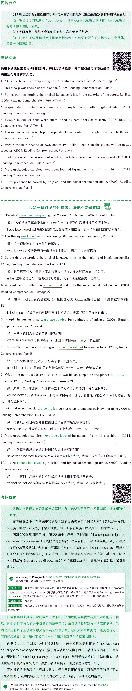

```text
内容要点
（1）被动语态表示主语和谓语动词之间是被动的关系（主语是谓语动词的动作承受者）。
（2）被动语态的构成为“be+done”，其中done表达被动的动作，be表达被动
的时间和主语的单复数。
（3）考研真题中经常考查被动语态与时态和情态的结合。
（4）注意：不管是和时态还是情态相结合，被动语态跟它们永远作为一个整体，
即算一个谓语动词。
真题演练
请用下划线标出谓语动词的部分，并找到被动语态，分辨被动是与时态还是情
态相结合并理解其含义。
1. “Benefits” have been weighed against “harmful” outcomes. (2002, Use of English)
2. This theory was known as diffusionism. (2009, Reading Comprehension, Part B)
3. By the third generation, the original language is lost in the majority of immigrant families.
(2006, Reading Comprehension, Part A Text 1)
4. A great deal of attention is being paid today to the so-called digital divide... (2001,
Reading Comprehension, Passage 2)
5.People in earlier eras were surrounded by reminders of misery.(2006,Reading
Comprehension, Part A Text 4)
6. The sentences within each paragraph should be related to a single topic. (2008, Reading
Comprehension, Part B)
7. Within the next decade or two, one to two billion people on the planet will be netted
together. (2001,Reading Comprehension,Passage 2)
8. Paid and owned media are controlled by marketers promoting their own products. (2011,
Reading Comprehension,Part A Text 3)
9. Most archaeological sites have been located by means of careful searching... (2014,
Reading Comprehension, Part B)
10. ...they cannot be solved by physical and biological technology alone. (2002, Reading
Comprehension, Part B)
我是一条答案的分隔线，请先不要偷看呦！
1. “Benefits” have been weighed against “harmful" outcomes. (2002, Use of English)
译：（人们把通信革命带来的）“益处”与“有害的”后果进行了权衡比较。
have been weighed 是被动语态与现在完成时相结合，表示“现在的之前被权衡”。
2. This theory was known as diffusionism. (2009, Reading Comprehension, Part B)
译：这一理论被称为（文化）传播论。
was known 是被动语态与一般过去时相结合，表示“过去被称为”。
3. By the third generation, the original language is lost in the majority of immigrant families.
(2006, Reading Comprehension, Part A Text 1)
译：到了第三代人，母语（原来的语言）就在大多数移民家庭中消失了。
is lost是被动语态与一般现在时相结合，表示“现在被丢失、丧失”。
4. A great deal of attention is being paid today to the so-called digital divide... (2001,
Reading Comprehension, Passage 2)
译：如今，人们正在高度重视（大量的注意力现在正在被付出给）所谓的数字鸿沟问
题
is being paid是被动语态与现在进行时相结合，表示“现在正在被付出”。
5. People in earlier eras were surrounded by reminders of misery. (2006, Reading
Comprehension, Part A Text 4)
译：早期时代的人们被痛苦的回忆所包围。
were surrounded是被动语态与一般过去时相结合，表示“被包围”。
6. The sentences within each paragraph should be related to a single topic. (2008, Reading
Comprehension, Part B)
译：每个段落中的句子都应该与某个单一主题相关。
should be related 是被动语态与情态动词相结合，表示“应该被关联”。
7. Within the next decade or two, one to two billion people on the planet will be netted
together. (2001, Reading Comprehension, Passage 2)
译：未来一二十年之内，全球有一二十亿人将涉足互联网（将会被联网）。
willbenetted是被动语态与一般将来时相结合，也可以看作是与情态动词wil相结合，表
示“将会被联网”。
8. Paid and owned media are controlled by marketers promoting their own products. (2011,
Reading Comprehension, Part A Text 3)
译：付费媒介和自有媒介由推销自己产品的市场营销商控制。
arecontrolled是被动语态与一般现在时相结合，表示“被.…...·控制”。
9. Most archaeological sites have been located by means of careful searching... (2014,
Reading Comprehension, Part B)
译：大多数考古遗址是通过仔细的搜寻才确定位置的.….
havebeenlocated是被动语态与现在完成时相结合，表示“现在的之前被确定位置”。
10. ...they cannot be solved by physical and biological technology alone. (2002, Reading
Comprehension, Part B)
译：·.…它们（这些问题）不能仅通过物理和生物技术来解决。
cannotbesolved是被动语态与情态动词相结合，表示“不能被解决”。
考场攻略
谓语动词的被动语态建议重点掌握，五大题型都有考查，尤其阅读、翻译和写作
中必考。
在考研阅读中，有些题干和选项会对原文内容进行“同义改写”（意思是一样的，
但是换一种说法来改写）来增加难度，而“主被动互换”就是其中一种考查方式。
例如2020年阅读Text1第22题中，题干中所提问的“theproposal mightbe
regardedbysomeas（这项提议可能会被一些人看作）”，被动语态的形式，在原文
中没有办法直接找到；但原文中有出现“Somemightseetheproposalas（有些人
可能会把这个提议看作）”，主动的形式。题干就是对原文的同义改写，其中有“同义
词组的改写（regardas和seeas）”和“主被动互换”，都是为了增加题干定位的
难度。
According toParagraph 2,the proposal might be regarded by some as
根据第二段，这项提议可能会被一些人看作
题干定位
题干中包含明确的段落信息；题干中的关键词theproposal在原文可以找到，theproposal
might beregarded by some as（这项提议可能会被一些人看作）对应原文中的 Some might see the
proposal as（有些人可能会把这个提议看作），属于主被动的同义改写，由此可以定位到段2。
题目类型
观点题
解题方法
观点题首先要明确是考查“谁”对“什么事情”的观点；然后定位到原文，通过原文的细节
内容来判断。
注意观察如上真题讲解的截图，题干中加了颜色的内容代表与原文对应的定位信
息，同时题目下方会有关于每道题的题干定位、题目类型和解题方法的高度概括，当
然之后还有每个选项对应原文的中英文双语讲解，这样大家可以把每一道真题的方方
面面彻底掌握。如上和如下截图均出自“田静讲真题”的真题书课包。
再例如 2005 年阅读 Text 1 第 24 题中， 题干和选项表述的是“monkeys can
be taught to exchange things(猴子可以被教会交换东西)"，被动语态的形式；而原
文中表述的是“teaching monkeys to exchange（教猴子去交换）”，主动的形式。选
项就是对于原文的同义改写，虽然主被动互换了，但是表达的意思一样。
不过虽然这个选项的内容对应原文，但并不是正确答案，因为题干问的是“研究
的最终发现”，选项内容只是“研究的过程”，答非所问，因此该选项错误。
Dr. Brosnan and Dr. de Waal have eventually found in their study that the monkeys
布鲁斯南博士和德·瓦尔博士最终在他们的研究中发现猴子
```

### 【 段3】 ②The researchers spent two years teaching their monkeys

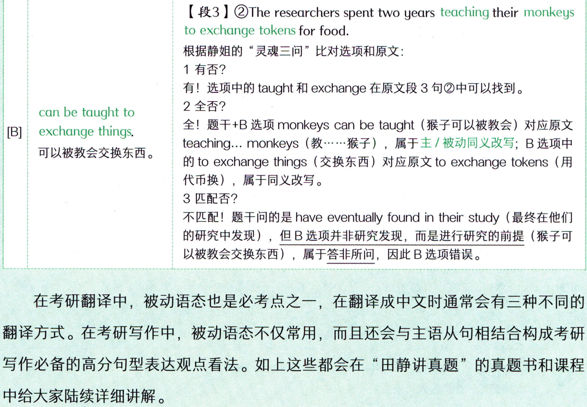

```text
【 段3】 ②The researchers spent two years teaching their monkeys
to exchange tokens for food.
根据静姐的“灵魂三问”比对选项和原文：
1有否？
有！选项中的 taught和exchange 在原文段3句②中可以找到。
2全否？
can be taught to
全！题干+B选项monkeyscan be taught（猴子可以被教会）对应原文
exchange things.
[B]
teaching...monkeys（教.……·猴子），属于主／被动同义改写；B选项中
可以被教会交换东西。
的to exchange things（交换东西）对应原文toexchange tokens（用
代币换），属于同义改写。
3匹配否？
不匹配！题干问的是have eventually found in their study（最终在他们
的研究中发现），但B选项并非研究发现，而是进行研究的前提（猴子可
以被教会交换东西），属于答非所问，因此B选项错误。
在考研翻译中，被动语态也是必考点之一，在翻译成中文时通常会有三种不同的
翻译方式。在考研写作中，被动语态不仅常用，而且还会与主语从句相结合构成考研
写作必备的高分句型表达观点看法。如上这些都会在“田静讲真题”的真题书和课程
中给大家陆续详细讲解。
```

## 四、谓语动词的否定

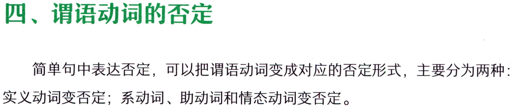

```text
四、谓语动词的否定
简单句中表达否定，可以把谓语动词变成对应的否定形式，主要分为两种：
实义动词变否定；系动词、助动词和情态动词变否定。
```

#### 1.前加助动词和 not 变否定

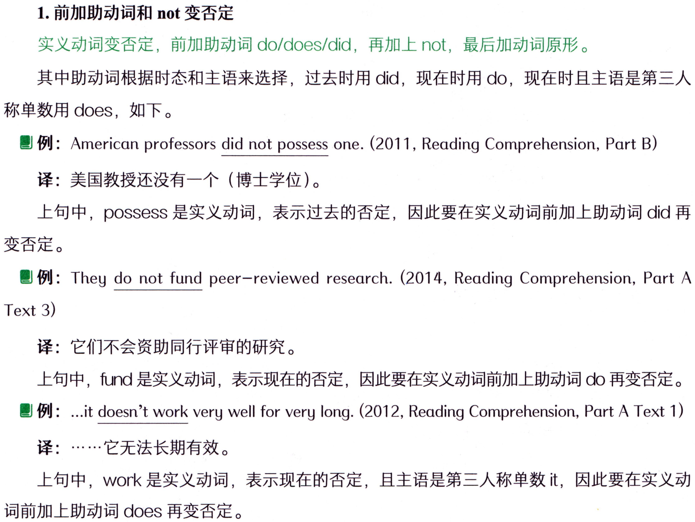

```text
1.前加助动词和 not 变否定
实义动词变否定，前加助动词do/does/did，再加上not，最后加动词原形。
其中助动词根据时态和主语来选择，过去时用did，现在时用do，现在时且主语是第三人
称单数用does，如下。
例: American professors did not possess one. (2011, Reading Comprehension, Part B)
译：美国教授还没有一个（博士学位)。
上句中，posSeSs 是实义动词，表示过去的否定，因此要在实义动词前加上助动词did 再
变否定。
  s  to) s  p   e  y
Text 3)
译：它们不会资助同行评审的研究。
上句中，fund是实义动词，表示现在的否定，因此要在实义动词前加上助动词do 再变否定。
例: ..it doesn't work very well for very long. (2012, Reading Comprehension, Part A Text 1)
译：……..…·它无法长期有效。
上句中，work是实义动词，表示现在的否定，且主语是第三人称单数it，因此要在实义动
词前加上助动词does再变否定。
```

#### 2.直接后加not变否定

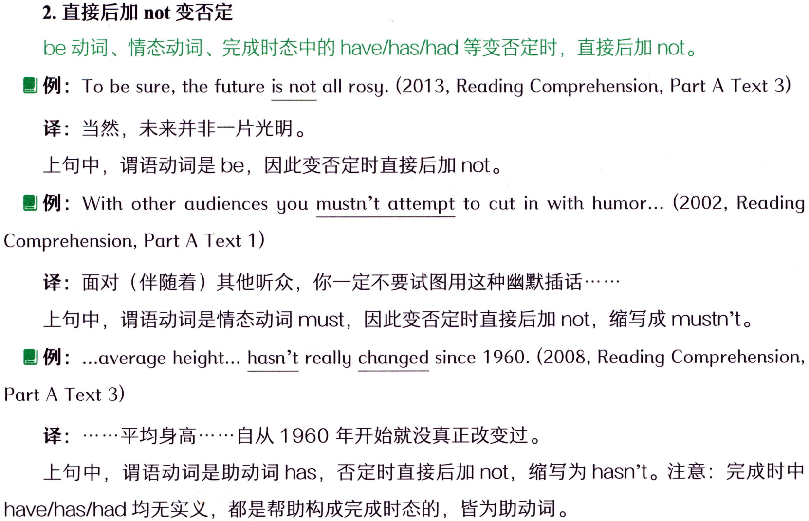

```text
2.直接后加not变否定
be 动词、情态动词、完成时态中的have/has/had等变否定时，直接后加 not。
例: To be sure, the future is not all rosy. (2013, Reading Comprehension, Part A Text 3)
译：当然，未来并非一片光明。
上句中，谓语动词是be，因此变否定时直接后加not。
例: With other audiences you mustn't attempt to cut in with humor... (2002, Reading
Comprehension, Part A Text 1)
译：面对（伴随着）其他听众，你一定不要试图用这种幽默插话·…·
上句中，谓语动词是情态动词must，因此变否定时直接后加 not，缩写成mustn't。
例: ..average height... hasn't really changed since 1960. (2008, Reading Comprehension,
Part A Text 3)
译：·….….平均身高.….·自从1960年开始就没真正改变过。
上句中，谓语动词是助动词has，否定时直接后加not，缩写为hasn't。注意：完成时中
have/has/had均无实义，都是帮助构成完成时态的，皆为助动词。
```

#### 词汇表

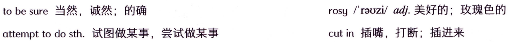

```text
rosy/rauzi/adj.美好的；玫瑰色的
tobe sure当然，诚然；的确
cut in插嘴，打断；插进来
attempttodo sth.试图做某事，尝试做某事
```

#### 概述

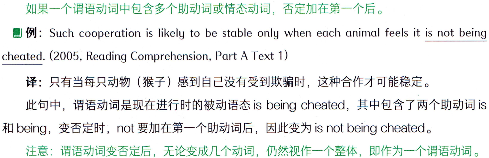

```text
如果一个谓语动词中包含多个助动词或情态动词，否定加在第一个后。
例: Such cooperation is likely to be stable only when each animal feels it is not being
cheated. (2005, Reading Comprehension, Part A Text 1)
译：只有当每只动物（猴子）感到自己没有受到欺骗时，这种合作才可能稳定。
此句中，谓语动词是现在进行时的被动语态is being cheated，其中包含了两个助动词 is
和 being，变否定时，not 要加在第一个助动词后，因此变为 is not being cheated。
注意：谓语动词变否定后，无论变成几个动词，仍然视作一个整体，即作为一个谓语动词。
```

## 五、谓语动词的强调

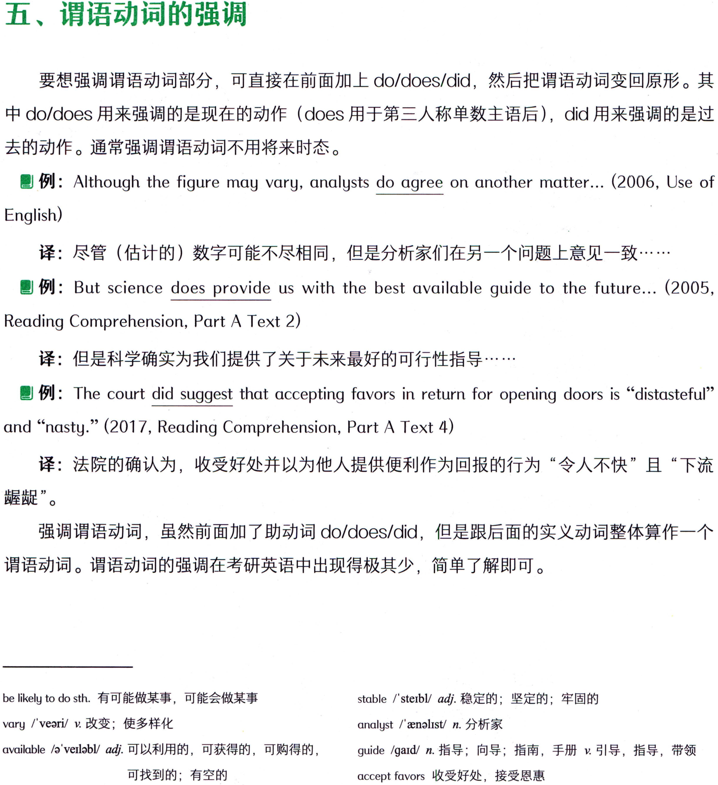

```text
五、谓语动词的强调
要想强调谓语动词部分，可直接在前面加上do/does/did，然后把谓语动词变回原形。其
中 do/does 用来强调的是现在的动作（does用于第三人称单数主语后），did用来强调的是过
去的动作。通常强调谓语动词不用将来时态。
例: Although the figure may vary, analysts do agree on another matter.. (2006, Use of
English)
译：尽管（估计的）数字可能不尽相同，但是分析家们在另一个问题上意见一致·…·
例: But science does provide us with the best available guide to the future... (2005,
Reading Comprehension, Part A Text 2)
译：但是科学确实为我们提供了关于未来最好的可行性指导….
 例: The court did suggest that accepting favors in return for opening doors is “distasteful"
and “nasty." (2017, Reading Comprehension, Part A Text 4)
译：法院的确认为，收受好处并以为他人提供便利作为回报的行为“令人不快”且“下流
”。
强调谓语动词，虽然前面加了助动词do/does/did，但是跟后面的实义动词整体算作一个
谓语动词。谓语动词的强调在考研英语中出现得极其少，简单了解即可。
belikelytodosth.有可能做某事，可能会做某事
stable/'sterbl/adj.稳定的；坚定的；牢固的
vary/veari/v.改变；使多样化
analyst/enalist/n.分析家
available/a'veilabladji.可以利用的，可获得的，可购得的，
guide/gard/n.指导；向导；指南，手册v.引导，指导，带领
可找到的；有空的
```

#### 词汇表

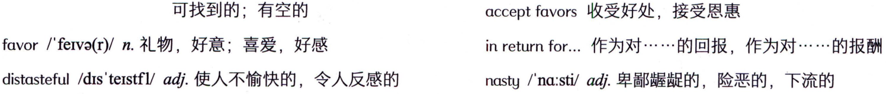

```text
acceptfavors收受好处，接受恩惠
favor/ferva(r)/n.礼物，好意；喜爱，好感
inreturnfor...作为对.....的回报，作为对....的报酬
distasteful/dis'teistfladj.使人不愉快的，令人反感的
nasty/'na:sti/adji.卑鄙龈的，险恶的，下流的
```

#### 概述

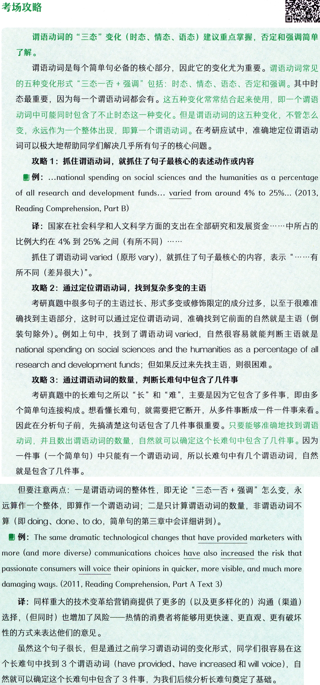

```text
考场攻略
谓语动词的“三态”变化（时态、情态、语态）建议重点掌握，否定和强调简单
了解。
谓语动词是每个简单句必备的核心部分，因此它的变化尤为重要。谓语动词常见
的五种变化形式“三态一否+强调”包括：时态、情态、语态、否定和强调。其中时
态最重要，因为每一个谓语动词都会有。这五种变化常常结合起来使用，即一个谓语
动词中可能同时包含了不止时态这一种变化。但是谓语动词的这五种变化，不管怎么
变，永远作为一个整体出现，即算一个谓语动词。在考研应试中，准确地定位谓语动
词可以极大地帮助同学们解决几乎所有句子的核心问题。
攻略1：抓住谓语动词，就抓住了句子最核心的表述动作或内容
 例: ...national spending on social sciences and the humanities as a percentage
of all research and development funds... varied from around 4% to 25%... (2013,
Reading Comprehension, Part B)
译：国家在社会科学和人文科学方面的支出在全部研究和发展资金…中所占的
比例大约在4%到25%之间（有所不同）
抓住了谓语动词varied（原形vary），就抓住了句子最核心的内容，表示“.….…·有
所不同（差异很大）”。
攻略2：通过定位谓语动词，找到复杂多变的主语
考研真题中很多句子的主语过长、形式多变或修饰限定的成分过多，以至于很难准
确找到主语部分，这时可以通过定位谓语动词，准确找到它前面的自然就是主语（倒
装句除外）。例如上句中，找到了谓语动词varied，自然很容易就能判断主语就是
national spending on social sciences and the humanities as a percentage of all
researchanddevelopmentfunds；但如果反过来先找主语，则很困难。
攻略3：通过谓语动词的数量，判断长难句中包含了几件事
考研真题中的长难句之所以“长”和“难”，主要是因为它包含了多件事，即由多
个简单句连接构成。想看懂长难句，就需要把它断开，从多件事断成一件一件事来看。
因此在分析句子前，先搞清楚这句话包含了几件事很重要。只要能够准确地找到谓语
动词，并且数出谓语动词的数量，自然就可以确定这个长难句中包含了几件事。因为
一件事（一个简单句）中只能有一个谓语动词，所以长难句中有几个谓语动词，自然
就是包含了几件事。
但要注意两点：一是谓语动词的整体性，即无论“三态一否+强调”怎么变，永
远算作一个整体，即算作一个谓语动词；二是只计算谓语动词的数量，非谓语动词不
算(即 doing、done、to do，简单句的第三章中会详细讲到)。
 例: The same dramatic technological changes that have provided marketers with
more (and more diverse) communications choices have also increased the risk that
passionate consumers will voice their opinions in quicker, more visible, and much more
damaging ways. (2011, Reading Comprehension, Part A Text 3)
译：同样重大的技术变革给营销商提供了更多的（以及更多样化的）沟通（渠道）
选择，（但同时）也增加了风险
一一热情的消费者将能够用更快速、更直观、更有破坏
性的方式来表达他们的意见。
虽然这个句子很长，但是通过之前学习谓语动词的变化形式，同学们很容易在这
个长难句中找到 3 个谓语动词 (have provided、have increased 和 wil voice)， 自
然就可以确定这个长难句中包含了3件事，为我们后续分析长难句奠定了基础。
```

#### 词汇表

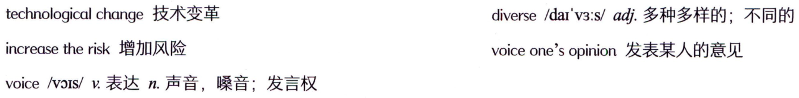

```text
technological change技术变革
diverse/dar'v3:s/adj.多种多样的；不同的
increasetherisk增加风险
voice one'sopinion发表某人的意见
voice/voIs/v.表达n.声音，嗓音；发言权
```

#### 概述


```text
第二章
简单句的扩展
```
