# 第一节 非谓语动词作主语、宾语、表语（核心成分）

#### 概述

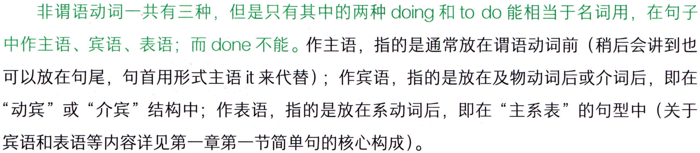

```text
非谓语动词一共有三种，但是只有其中的两种 doing 和to do 能相当于名词用，在句子
中作主语、宾语、表语；而done不能。作主语，指的是通常放在谓语动词前（稍后会讲到也
可以放在句尾，句首用形式主语it来代替）；作宾语，指的是放在及物动词后或介词后，即在
“动宾”或“介宾”结构中；作表语，指的是放在系动词后，即在“主系表”的句型中（关于
宾语和表语等内容详见第一章第一节简单句的核心构成)。
```

### （一）非谓语动词doing/to do 作主语

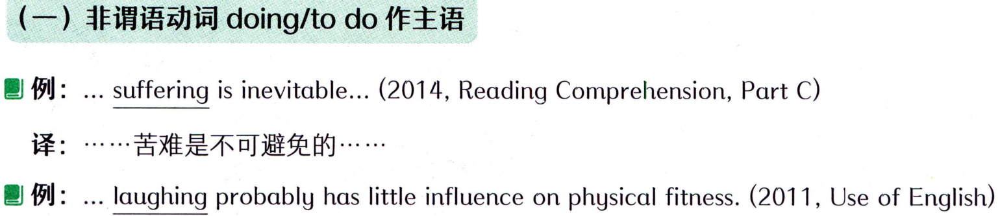

```text
（一）非谓语动词doing/to do 作主语
例: .. suffering is inevitable... (2014, Reading Comprehension, Part C)
译：…….·苦难是不可避免的……···
 例: ... laughing probably has little influence on physical fitness. (2011, Use of English)
```

#### 词汇表


```text
physical fitness身体健康
inevitable/m'evitabl/adj.不可避免的
```

#### 概述


```text
译：……..…·笑对身体健康的影响可能很小。
动词 suffer和laugh 不能直接作主语，因此要把它们变成相当于名词形式的非谓语动词
suffering 和 laughing 才能作主语。
```

### 【补充】doing 作主语，表达的是一件事，所以谓语动词用单数（例如以上两句）。如果有


```text
【补充】doing 作主语，表达的是一件事，所以谓语动词用单数（例如以上两句）。如果有
多个doing 并列作主语，表达多件事，谓语动词才用复数。
```

### 【补充】doing 作成分时不一定只有一个词，如果是及物动词的话，要后接宾语，因此词组


```text
【补充】doing 作成分时不一定只有一个词，如果是及物动词的话，要后接宾语，因此词组
“doing sth./sb.”会作为一个整体出现，来作主语、宾语、表语等成分；经常还会有其他修饰
限定的成分伴随doing，例如形容词、副词、介词短语等。
例: Making friends is extremely important to teenagers... (2003, Use of English)
译：交朋友对青少年来说是极为重要的.·
make 是及物动词，后接宾语friends，变为 doing 词组 Making friends，作为一个整体来
充当主语。
 例: Broadcasting his ambition was “very much my decision,” .. (2011, Reading Comprehension,
Part A Text 2)
译：（麦基说）公开说出他的雄心壮志“完全是自己的决定”…·
broadcast是及物动词，要后接宾语his ambition，变为 doing 词组 Broadcasting his
ambition，作为一个整体来充当主语。
例: On the other hand, putting your faith in the wrong place often carries a high price.
(2018, Use of English)
译：另一方面，将你的信任放错地方通常会带来高昂的代价。
非谓语动词doing 的词组putting your faith in thewrong place作为一个整体，来充当该
句的主语。其中put为及物动词，所以后接了宾语your faith，并且在其后加了介词短语in the
wrongplace补充说明位置。
to do 作成分时跟doing一样，如果是及物动词的话，要后接宾语，因此词组“to do sth./
sb.”会作为一个整体出现；经常还会再加入形容词、副词、介词短语等伴随to do，就变为一
个较长的todo的词组作成分。
例:... to anticipate every imaginable driving situation is a difficult programming problem.
(2019, Reading Comprehension, Part A Text 3)
译：…·预见每种可能的驾驶情况是个困难的编程问题。
来充当该句的主语。其中anticipate是及物动词，后接宾语situation，situation前又加入了修
```

#### 词汇表

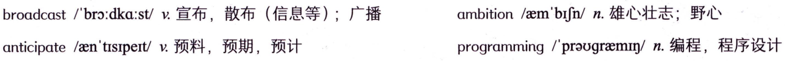

```text
ambition/em'brjn/n.雄心壮志；野心
broadcast/"bro:dka:st/v.宣布，散布（信息等）；广播
programming/praugremin/n.编程，程序设计
anticipate/aen'tisipert/v.预料，预期，预计
```

#### 概述


```text
饰限定的词 every imaginable driving 。
```

### 【补充】to do 作主语，跟doing 作主语一样，表达的都是一件事，所以谓语动词用单数


```text
【补充】to do 作主语，跟doing 作主语一样，表达的都是一件事，所以谓语动词用单数
（例如上句）。如果有多个todo并列作主语，表达多件事，谓语动词才用复数。
```

### 【补充】to do和doing 作主语时，意思差别不大，可以互换。但要注意位置有两种：如果


```text
【补充】to do和doing 作主语时，意思差别不大，可以互换。但要注意位置有两种：如果
较短（单词数量较少）则都可以直接放在句首；反之，较长（单词数量较多）的话可以挪到句
尾，句首用形式主语it来占位置。虽然to do 和 doing 作主语位于句首、句尾都可以，并且意
思一样，但其实在考研真题中最常出现的是doing作主语位于句首，而todo作主语最常位于
句尾（句首用形式主语it），尤其是后者最常考查、最重要。
例: It is important to do so. (2002, Use of English)
译：做到这一点（指正确看待它）很重要。
原句应为 To do so is important. 其中主语为 to do so，但 to do 作主语常常后置，因此
前面就用形式主语it来代替。
例: It is painful to read these roundabout accounts today. (2010, Reading Comprehension,
Part C)
译：现在要去理解这些拐弯抹角的解释是令人痛苦的。
此句中前面用了形式主语it来代替；而真正的主语是非谓语动词todo的词组toread
theseroundaboutaccounts today，其中read为及物动词，后接宾语theseroundabout
accounts，副词today表示时间。
例: ...it took Beaumont decades to perfect her craf... (2013, Reading Comprehension,
Part A Text 1)
译：··…·博蒙特用了几十年来完善她的手艺……···
此句中真正的主语toperfecther craft后置，前面用了形式主语it来代替。
长时间做某事”。其中谓语动词takes可以根据具体的时间调整为相应的时态。
例: So it seems paradoxical to talk about habits in the same context as creativity and
innovation. (2009, Reading Comprehension, Part A Text 1)
译：因此，将习惯同创造力和创新放在同一语境下谈论似乎是自相矛盾的。
此句中前面用了形式主语it来代替；真正的主语是非谓语动词todo的词组totalkabout
habits in the same context as creativity and innovation，这个 to do主语比较长是因为其中
roundabout/raundabaut/adj.拐弯抹角的
Ittakes（sb.)+时间+todo sth.花费（某人）多长时间做某事
```

#### 词汇表

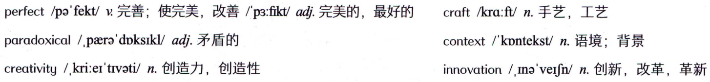

```text
perfect/pa'fekt/v完善；使完美，改善/p3:fikt/adi.完美的，最好的
craft/kra:ft/n.手艺，工艺
paradoxical/paers'dpksikl/adj.矛盾的
context/"kpntekst/n.语境；背景
innovation/,Ina'verfn/n.创新，改革，革新
creativity/.kri:er'tivati/n.创造力，创造性
```

#### 概述


```text
包含三个介词about、in、as引l出的介词短语作补充信息。
```

### （二）非谓语动词doing/to do作宾语

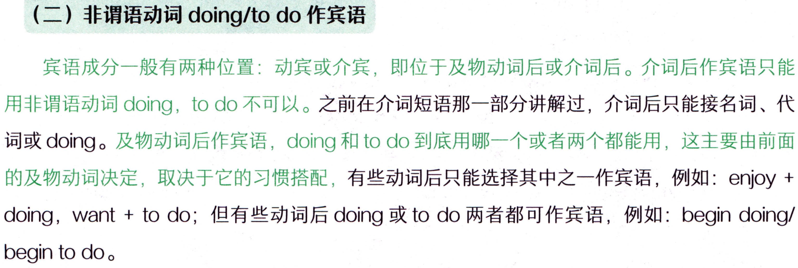

```text
（二）非谓语动词doing/to do作宾语
宾语成分一般有两种位置：动宾或介宾，即位于及物动词后或介词后。介词后作宾语只能
用非谓语动词doing，to do 不可以。之前在介词短语那一部分讲解过，介词后只能接名词、代
词或doing。及物动词后作宾语，doing 和to do到底用哪一个或者两个都能用，这主要由前面
的及物动词决定，取决于它的习惯搭配，有些动词后只能选择其中之一作宾语，例如：enjoy+
doing，want + to do；但有些动词后 doing 或to do 两者都可作宾语，例如：begin doing/
begin to do。
```

#### 1.及物动词后，非谓语动词doing/todo作宾语

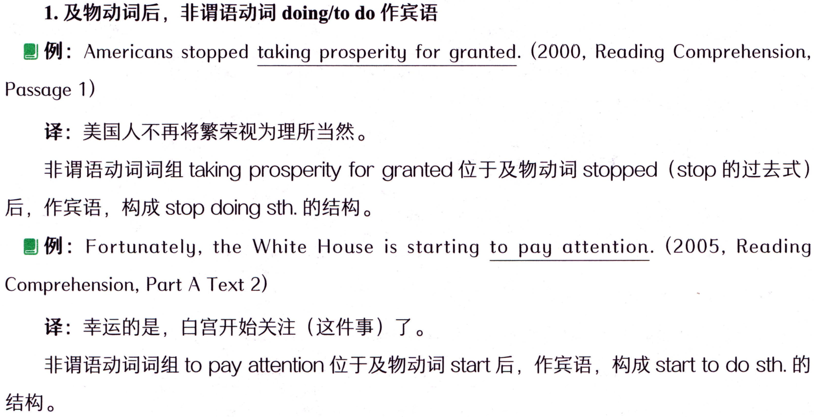

```text
1.及物动词后，非谓语动词doing/todo作宾语
例: Americans stopped taking prosperity for granted. (2000, Reading Comprehension,
Passage 1)
译：美国人不再将繁荣视为理所当然。
非谓语动词词组 taking prosperity for granted 位于及物动词 stopped（stop 的过去式)
后，作宾语，构成 stop doing sth.的结构。
例: Fortunately, the White House is starting to pay attention. (2005, Reading
Comprehension, Part A Text 2)
译：幸运的是，白宫开始关注（这件事）了。
非谓语动词词组 to pay attention 位于及物动词 start后，作宾语，构成 start to do sth.的
结构。
```

### 【补充】todo作宾语还可以后置，用it作形式宾语来占位置。但后置的条件除真正的宾语

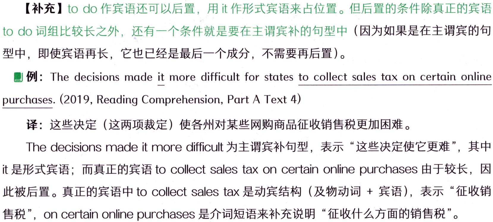

```text
【补充】todo作宾语还可以后置，用it作形式宾语来占位置。但后置的条件除真正的宾语
to do词组比较长之外，还有一个条件就是要在主谓宾补的句型中（因为如果是在主谓宾的句
型中，即使宾语再长，它也已经是最后一个成分，不需要再后置）。
例:The decisions made it more difficult for states to collect salestax on certain online
purchases. (2019, Reading Comprehension, Part A Text 4)
译：这些决定（这两项裁定）使各州对某些网购商品征收销售税更加困难。
Thedecisions made it moredifficult为主谓宾补句型，表示“这些决定使它更难”，其中
it是形式宾语；而真正的宾语tocollectsales taxoncertainonlinepurchases由于较长，因
此被后置。真正的宾语中tocollectsales tax是动宾结构（及物动词+宾语），表示“征收销
售税”，oncertainonlinepurchases是介词短语来补充说明“征收什么方面的销售税”。
```

#### 词汇表

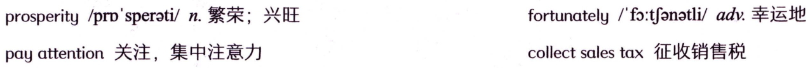

```text
prosperity/pro'sperati/n.繁荣；兴旺
fortunately/fo:tfonatli/adv.幸运地
pay attention 关注，集中注意力
collectsalestax征收销售税
```

#### 2.介词后，非谓语动词 doing 作宾语

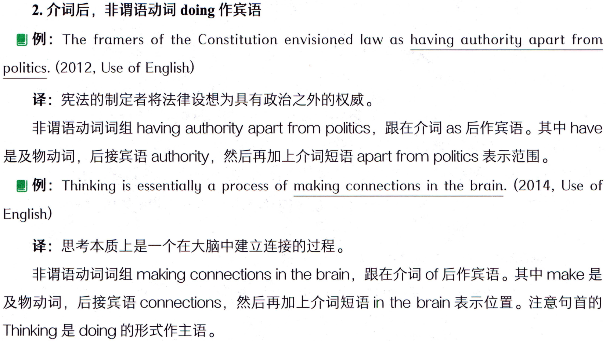

```text
2.介词后，非谓语动词 doing 作宾语
例: The framers of the Constitution envisioned law as having authority apart from
politics. (2012, Use of English)
译：宪法的制定者将法律设想为具有政治之外的权威。
非谓语动词词组 having authority apart from politics，跟在介词 as 后作宾语。其中 have
是及物动词，后接宾语authority，然后再加上介词短语apart from politics 表示范围。
例: Thinking is essentially a process of making connections in the brain. (2014, Use of
English)
译：思考本质上是一个在大脑中建立连接的过程。
非谓语动词词组 making connections in the brain，跟在介词 of 后作宾语。其中 make 是
及物动词，后接宾语 connections，然后再加上介词短语in the brain 表示位置。注意句首的
Thinking是doing的形式作主语。
```

### （三）非谓语动词doing/todo作表语

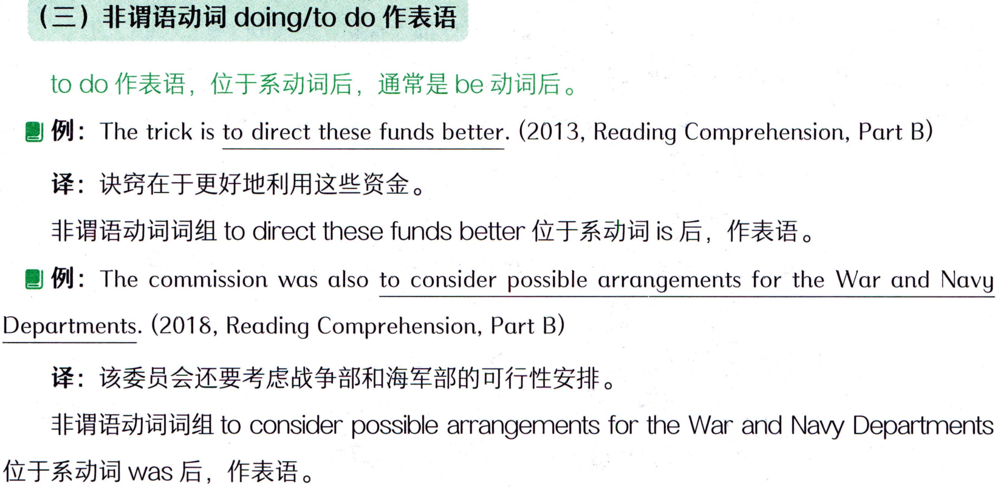

```text
（三）非谓语动词doing/todo作表语
to do 作表语，位于系动词后，通常是be 动词后。
 例: The trick is to direct these funds better. (2013, Reading Comprehension, Part B)
译：诀窍在于更好地利用这些资金。
非谓语动词词组todirect thesefunds better位于系动词is后，作表语。
例: The commission was also to consider possible arrangements for the War and Navy
Departments. (2018, Reading Comprehension, Part B)
译：该委员会还要考虑战争部和海军部的可行性安排。
非谓语动词词组 to consider possible arrangements for the War and Navy Departments
位于系动词was后，作表语。
```

### 【补充】非谓语动词doing 也可以作表语，跟在系动词后，但在考研英语中几乎不太出现，


```text
【补充】非谓语动词doing 也可以作表语，跟在系动词后，但在考研英语中几乎不太出现，
不用掌握。
```

### 【补充】主系表结构中，主语和表语都可以用非谓语动词doing或to do。但如果前后同时


```text
【补充】主系表结构中，主语和表语都可以用非谓语动词doing或to do。但如果前后同时
使用时，请注意前后保持一致，即主语和表语同时都用 doing，或同时都用 to do。如下:
Seeing is believing. 
To see is to believe.
framer/frerma/n.制定者
envision/m'vr3n/v.设想，想象
```

#### 词汇表

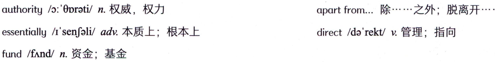

```text
apartfrom...除...之·外；脱离开.
authority/o:0prati/n.权威，权力
direct/da'rekt/v.管理；指向
essentially/I'senJali/adv.本质上；根本上
fund/fand/n.资金；基金
```

#### 概述

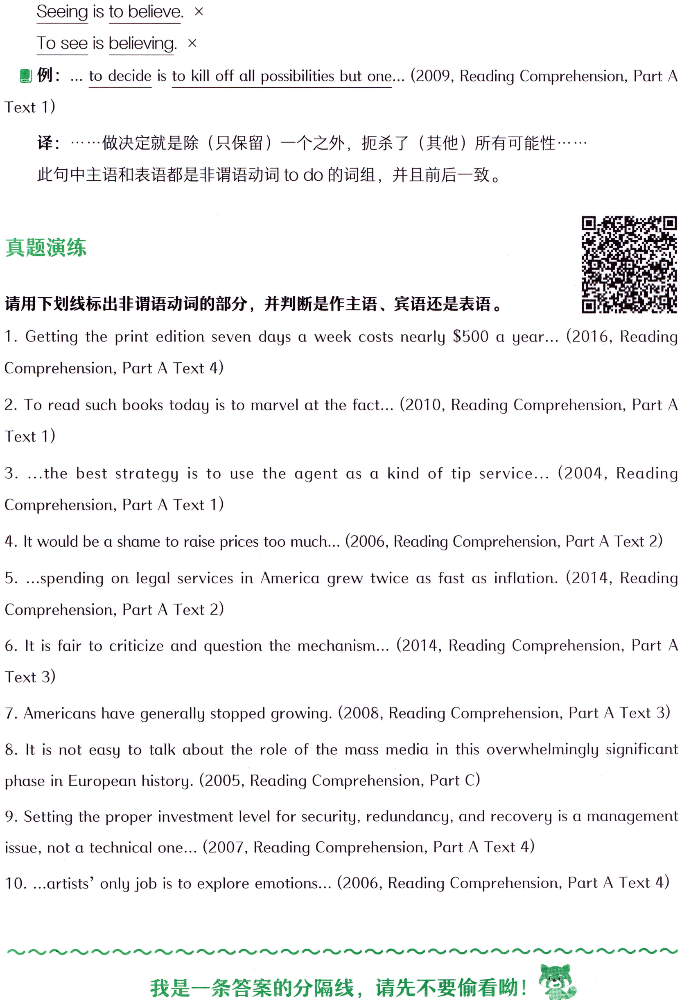

```text
Seeing is to believe. x
To see is believing. x
 例: ... to decide is to kill off all possibilities but one... (2009, Reading Comprehension, Part A
Text 1)
译：·…·做决定就是除（只保留）一个之外，扼杀了（其他）所有可能性·…·
此句中主语和表语都是非谓语动词to do的词组，并且前后一致。
真题演练
请用下划线标出非谓语动词的部分，并判断是作主语、宾语还是表语。
1. Getting the print edition seven days a week costs nearly $500 a year... (2016, Reading
Comprehension, Part A Text 4)
2. To read such books today is to marvel at the fact... (2010, Reading Comprehension, Part A
Text 1)
3. ...the best strategy is to use the agent as a kind of tip service... (2004, Reading
Comprehension, Part A Text 1)
4. It would be a shame to raise prices too much... (2006, Reading Comprehension, Part A Text 2)
5. ...spending on legal services in America grew twice as fast as inflation. (2014, Reading
Comprehension, Part A Text 2)
6. It is fair to criticize and question the mechanism... (2014, Reading Comprehension, Part A
Text 3)
7. Americans have generally stopped growing. (2008, Reading Comprehension, Part A Text 3)
8. It is not easy to talk about the role of the mass media in this overwhelmingly significant
phase in European history. (2005, Reading Comprehension, Part C)
9. Setting the proper investment level for security, redundancy, and recovery is a management
issue, not a technical one... (2007, Reading Comprehension, Part A Text 4)
10. ...artists’ only job is to explore emotions... (2006, Reading Comprehension, Part A Text 4)
我是一条答案的分隔线，请先不要偷看呦！
```

#### 词汇表

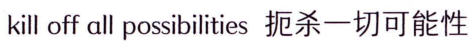

```text
kill off all possibilities扼杀一切可能性
```

#### 概述

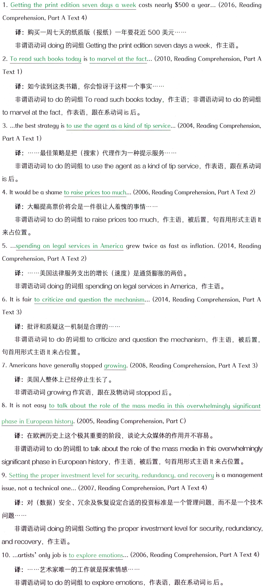

```text
1. Getting the print edition seven days a week costs nearly $500 a year... (2016, Reading
Comprehension, Part A Text 4)
译：购买一周七天的纸质版（报纸）一年要花近500美元…··
非谓语动词doing的词组Getting theprint edition seven days aweek，作主语。
2. To read such books today is to marvel at the fact... (2010, Reading Comprehension, Part A
Text 1)
译：如今读到这类书籍，你会惊讶于这样一个事实··
非谓语动词 to do 的词组To read such books today，作主语；非谓语动词 to do的词组
tomarvelatthefact，作表语，跟在系动词is后。
3. ..the best strategy is to use the agent as a kind of tip service... (2004, Reading Comprehension,
Part A Text 1)
译：·……最佳策略是把（搜索）代理作为一种提示服务……·
非谓语动词 to do 的词组 to use the agent as a kind of tip service，作表语，跟在系动词
is后。
4. It would be a shame to raise prices too much... (2006, Reading Comprehension, Part A Text 2)
译：大幅提高票价将会是一件很让人羞愧的事情.···
非谓语动词 to do 的词组 to raise prices too much，作主语，被后置，句首用形式主语lt
来占位置。
5. ...spending on legal services in America grew twice as fast as inflation. (2014, Reading
Comprehension, Part A Text 2)
译：..…美国法律服务支出的增长（速度）是通货膨胀的两倍。
非谓语动词 doing 的词组 spending on legal services in America，作主语。
6. It is fair to criticize and question the mechanism.. (2014, Reading Comprehension, Part A
Text 3)
译：批评和质疑这一机制是合理的.···
非谓语动词 to do 的词组 to criticize and question the mechanism，作主语，被后置,
句首用形式主语t来占位置。
7. Americans have generally stopped growing. (2008, Reading Comprehension, Part A Text 3)
译：美国人整体上已经停止生长了。
非谓语动词growing 作宾语，跟在及物动词stopped后。
8. It is not easy to talk about the role of the mass media in this overwhelmingly significant
phase in European history. (2005, Reading Comprehension, Part C)
译：在欧洲历史上这个极其重要的阶段，谈论大众媒体的作用并不容易。
非谓语动词 to do 的词组 to talk about the role of the mass media in this overwhelmingly
significant phase in European history，作主语，被后置，句首用形式主语It来占位置。
9. Setting the proper investment level for security, redundancy, and recovery is a management
issue, not a technical one... (2007, Reading Comprehension, Part A Text 4)
译：对（数据）安全、冗余及恢复设定合适的投资标准是一个管理问题，而不是一个技术
问题·…
非谓语动词 doing 的词组 Setting the proper investment level for security, redundancy,
and recovery，作主语。
10. ..artists? only job is to explore emotions... (2006, Reading Comprehension, Part A Text 4)
译：·…··艺术家唯一的工作就是探索情感…·…
非谓语动词 to do 的词组 to explore emotions，作表语，跟在系动词 is 后。
```
