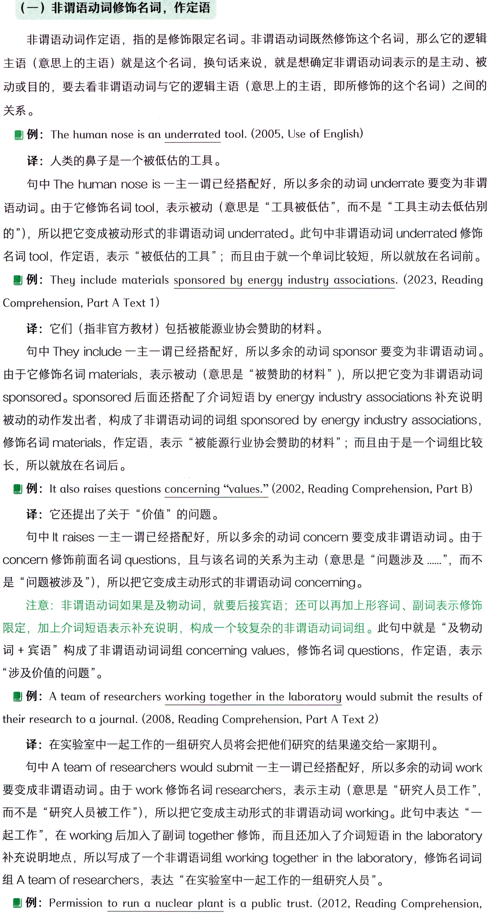
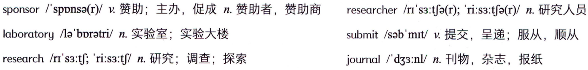
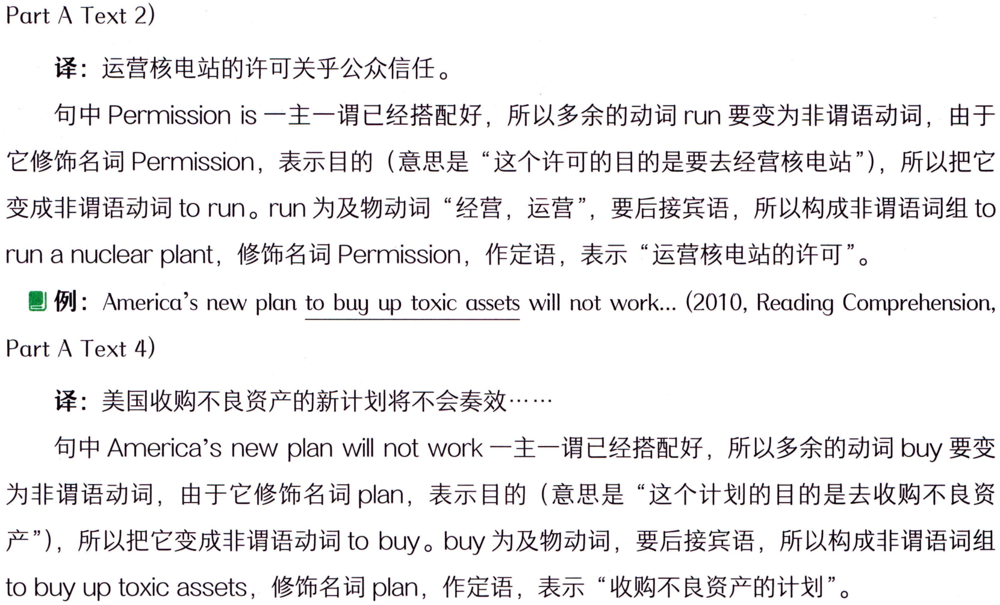
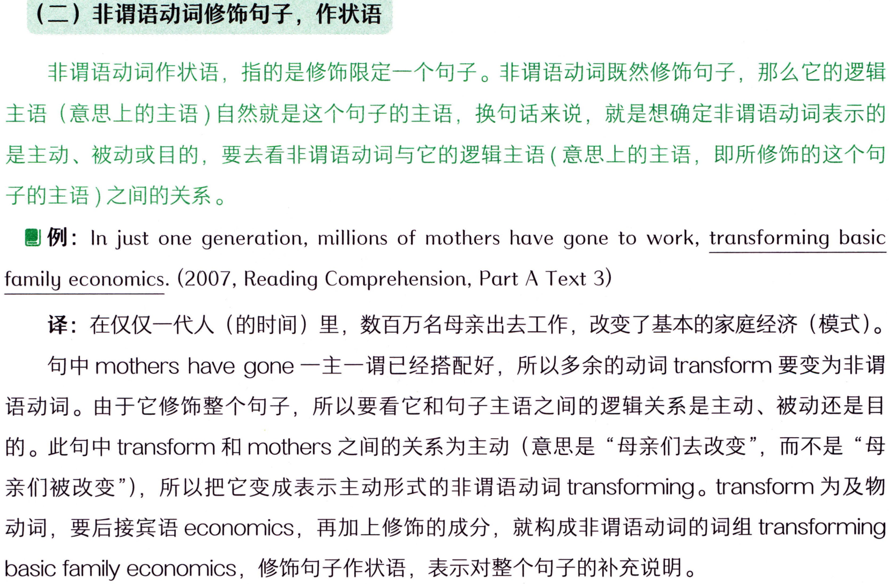
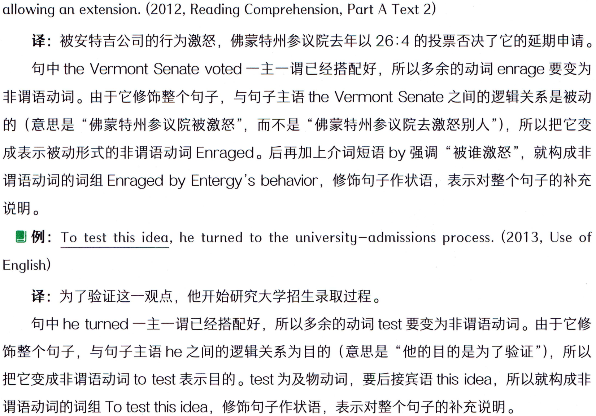
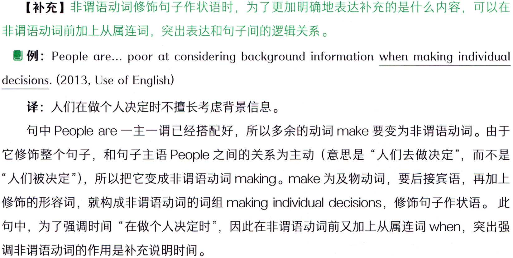
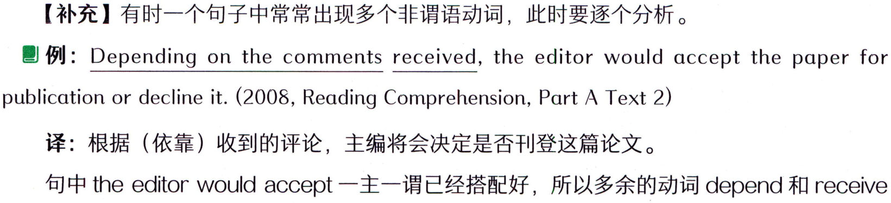
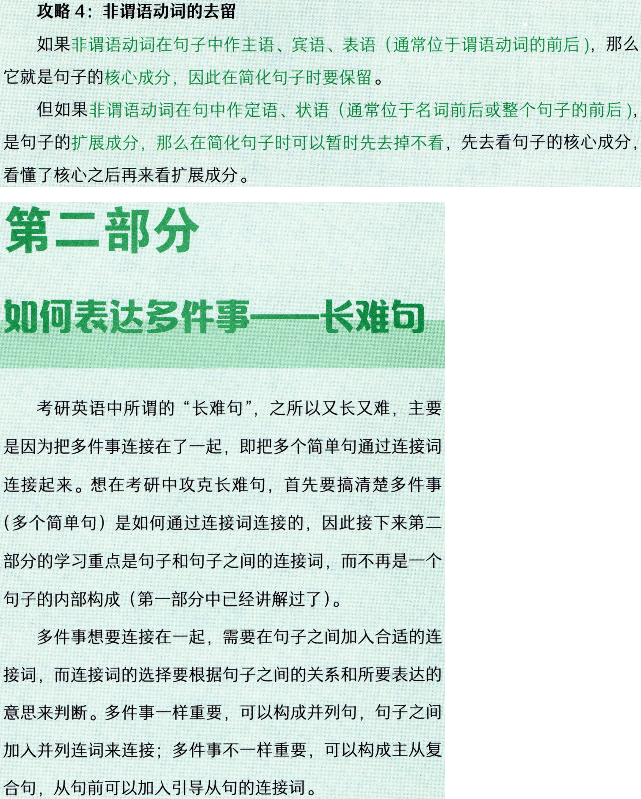

# 第二节 非谓语动词作定语、状语（扩展成分）

#### 概述


```text
非谓语动词在句子中既可以修饰名词作定语，也可以修饰句子作状语。但三种非谓语动词
在修饰时表达的意思不同：doing 表示主动；done 表示被动；to do 表示目的。
```

### （一）非谓语动词修饰名词，作定语



```text
（一）非谓语动词修饰名词，作定语
非谓语动词作定语，指的是修饰限定名词。非谓语动词既然修饰这个名词，那么它的逻辑
主语（意思上的主语）就是这个名词，换句话来说，就是想确定非谓语动词表示的是主动、被
动或目的，要去看非谓语动词与它的逻辑主语（意思上的主语，即所修饰的这个名词）之间的
关系。
例: The human nose is an underrated tool. (2005, Use of English)
译：人类的鼻子是一个被低估的工具。
句中Thehumannoseis一主一谓已经搭配好，所以多余的动词underrate要变为非谓
语动词。由于它修饰名词tool，表示被动（意思是“工具被低估”，而不是“工具主动去低估别
的"），所以把它变成被动形式的非谓语动词underrated。此句中非谓语动词underrated 修饰
名词tool，作定语，表示“被低估的工具”；而且由于就一个单词比较短，所以就放在名词前。
 例: They include materials sponsored by energy industry associations. (2023, Reading
Comprehension, Part A Text 1)
译：它们（指非官方教材）包括被能源业协会赞助的材料。
句中 They include一主一谓已经搭配好，所以多余的动词 sponsor 要变为非谓语动词。
由于它修饰名词materials，表示被动（意思是“被赞助的材料”），所以把它变为非谓语动词
sponsored。sponsored 后面还搭配了介词短语 by energy industry associations 补充说明
被动的动作发出者，构成了非谓语动词的词组 sponsored by energy industry associations,
修饰名词materials，作定语，表示“被能源行业协会赞助的材料”；而且由于是一个词组比较
长，所以就放在名词后。
 例: It also raises questions concerning “values." (2002, Reading Comprehension, Part B)
译：它还提出了关于“价值”的问题。
句中It raises一主一谓已经搭配好，所以多余的动词concern 要变成非谓语动词。由于
是“问题被涉及"），所以把它变成主动形式的非谓语动词concerning。
注意：非谓语动词如果是及物动词，就要后接宾语；还可以再加上形容词、副词表示修饰
限定，加上介词短语表示补充说明，构成一个较复杂的非谓语动词词组。此句中就是“及物动
词+宾语”构成了非谓语动词词组 concerning values，修饰名词 questions，作定语，表示
“涉及价值的问题”。
例: A team of researchers working together in the laboratory would submit the results of
their research to a journal. (2008, Reading Comprehension, Part A Text 2)
译：在实验室中一起工作的一组研究人员将会把他们研究的结果递交给一家期刊。
句中Ateamofresearcherswouldsubmit一主一谓已经搭配好，所以多余的动词work
要变成非谓语动词。由于work修饰名词researchers，表示主动（意思是“研究人员工作”，
而不是“研究人员被工作”），所以把它变成主动形式的非谓语动词working。此句中表达“一
起工作”，在 working 后加入了副词 together 修饰，而且还加入了介词短语 in the laboratory
补充说明地点，所以写成了一个非谓语词组working together in thelaboratory，修饰名词词
组Ateam ofresearchers，表达“在实验室中一起工作的一组研究人员”。
例: Permission to run a nuclear plant is a public trust. (2012, Reading Comprehension,
```

#### 词汇表



```text
sponsor/'sppnsa(r)/v.赞助；主办，促成n.赞助者，赞助商
researcher/r's3:tfa(r);'ri:s3:to(r)/n.研究人员
laboratory/la'bpratri/n.实验室；实验大楼
submit/sab'mrt/v.提交，呈递；服从，顺从
research/r's3:tf;'ri:s3:tf/n.研究；调查；探索
journal/d33:nl/n.刊物，杂志，报纸
```

#### 概述



```text
Part A Text 2)
译：运营核电站的许可关乎公众信任。
句中 Permission is一主一谓已经搭配好，所以多余的动词run要变为非谓语动词，由于
它修饰名词Permission，表示目的（意思是“这个许可的目的是要去经营核电站"），所以把它
变成非谓语动词torun。run为及物动词“经营，运营”，要后接宾语，所以构成非谓语词组to
run a nuclear plant，修饰名词Permission，作定语，表示“运营核电站的许可”。
Part A Text 4)
译：美国收购不良资产的新计划将不会奏效·…
句中 America's new plan will not work一主一谓已经搭配好，所以多余的动词 buy 要变
为非谓语动词，由于它修饰名词plan，表示目的（意思是“这个计划的目的是去收购不良资
产")，所以把它变成非谓语动词to buy。buy 为及物动词，要后接宾语，所以构成非谓语词组
to buyup toxic assets，修饰名词 plan，作定语，表示“收购不良资产的计划”。
```

### 【补充】非谓语动词修饰名词，作定语，通常翻译到名词前，译成“..…·的………"，如上这


```text
【补充】非谓语动词修饰名词，作定语，通常翻译到名词前，译成“..…·的………"，如上这
几个例子都是。
```

### （二）非谓语动词修饰句子，作状语



```text
（二）非谓语动词修饰句子，作状语
非谓语动词作状语，指的是修饰限定一个句子。非谓语动词既然修饰句子，那么它的逻辑
主语（意思上的主语）自然就是这个句子的主语，换句话来说，就是想确定非谓语动词表示的
是主动、被动或目的，要去看非谓语动词与它的逻辑主语（意思上的主语，即所修饰的这个句
子的主语）之间的关系。
例: In just one generation, millions of mothers have gone to work, transforming basic
family economics. (2007, Reading Comprehension, Part A Text 3)
译：在仅仅一代人（的时间）里，数百万名母亲出去工作，改变了基本的家庭经济（模式）。
句中mothershavegone一主一谓已经搭配好，所以多余的动词transform要变为非谓
语动词。由于它修饰整个句子，所以要看它和句子主语之间的逻辑关系是主动、被动还是目
的。此句中transform和mothers之间的关系为主动（意思是“母亲们去改变”，而不是“母
亲们被改变"），所以把它变成表示主动形式的非谓语动词transforming。transform为及物
动词，要后接宾语economics，再加上修饰的成分，就构成非谓语动词的词组transforming
basicfamilyeconomics，修饰句子作状语，表示对整个句子的补充说明。
```

### 【补充】非谓语动词修饰句子作状语时，通常可以翻译成独立的一句，如上。


```text
【补充】非谓语动词修饰句子作状语时，通常可以翻译成独立的一句，如上。
例:Enraged by Entergy's behavior,theVermont Senate voted 26 to 4 last year against
```

#### 词汇表


```text
enrage/m'rerd3/v.激怒，使暴怒
```

#### 概述



```text
allowing an extension. (2012, Reading Comprehension, Part A Text 2)
译：被安特吉公司的行为激怒，佛蒙特州参议院去年以26：4的投票否决了它的延期申请。
句中 theVermont Senatevoted一主一谓已经搭配好，所以多余的动词enrage 要变为
非谓语动词。由于它修饰整个句子，与句子主语theVermontSenate之间的逻辑关系是被动
的（意思是“佛蒙特州参议院被激怒”，而不是“佛蒙特州参议院去激怒别人”），所以把它变
成表示被动形式的非谓语动词Enraged。后再加上介词短语by强调“被谁激怒”，就构成非
谓语动词的词组 Enraged byEntergy's behavior，修饰句子作状语，表示对整个句子的补充
说明。
例: To test this idea, he turned to the university-admissions process. (2013, Use of
English)
译：为了验证这一观点，他开始研究大学招生录取过程。
句中he turned一主一谓已经搭配好，所以多余的动词test要变为非谓语动词。由于它修
饰整个句子，与句子主语he之间的逻辑关系为目的（意思是“他的目的是为了验证”），所以
把它变成非谓语动词totest表示目的。test为及物动词，要后接宾语thisidea，所以就构成非
谓语动词的词组Totestthisidea，修饰句子作状语，表示对整个句子的补充说明。
```

### 【补充】非谓语动词修饰句子作状语时，为了更加明确地表达补充的是什么内容，可以在



```text
【补充】非谓语动词修饰句子作状语时，为了更加明确地表达补充的是什么内容，可以在
非谓语动词前加上从属连词，突出表达和句子间的逻辑关系。
 例: People are... poor at considering background information when making individual
decisions. (2013, Use of English)
译：人们在做个人决定时不擅长考虑背景信息。
句中 People are一主一谓已经搭配好，所以多余的动词 make 要变为非谓语动词。由于
它修饰整个句子，和句子主语People之间的关系为主动（意思是“人们去做决定”，而不是
“人们被决定"），所以把它变成非谓语动词making。make 为及物动词，要后接宾语，再加上
修饰的形容词，就构成非谓语动词的词组 making individual decisions，修饰句子作状语。此
句中，为了强调时间“在做个人决定时”，因此在非谓语动词前又加上从属连词when，突出强
调非谓语动词的作用是补充说明时间。
```

### 【补充】有时一个句子中常常出现多个非谓语动词，此时要逐个分析。



```text
【补充】有时一个句子中常常出现多个非谓语动词，此时要逐个分析。
例: Depending on the comments received, the editor would accept the paper for
publication or decline it. (2008, Reading Comprehension, Part A Text 2)
译：根据（依靠）收到的评论，主编将会决定是否刊登这篇论文。
句中 the editor would accept一主一谓已经搭配好，所以多余的动词 depend 和receive
```

#### 词汇表


```text
comment/kpmentn.意见，评论v发表意见，发表评论
publication/.pabli'kerjn/ n.发表，出版；出版物
decline/dr'klam/v.拒绝；下降，减少，衰退
```

#### 概述


```text
都要变为非谓语动词。received 修饰前面的名词comments 作定语，表示被动，“收到的评
论（被接收到的评论）”；而 depending 修饰整个句子作状语，它的逻辑主语就是句子的主语
editor，表示主动，“编者（主动）依靠收到的评论，来决定·…..
```

## Why tolearn 非谓语动词?


```text
Why tolearn 非谓语动词?
非谓语动词是难点，因为对于同学们来说，在中文里没有与之对应的用法，很难理解，所
以先理解它是什么至关重要，然后再去掌握它的用法。非谓语动词也是考研英语的重点，在五
大题型中都有出现，一定要熟练掌握。
非谓语动词是英语中比较特殊的存在，它既能作句子的核心成分(主语、宾语、表语),
又能作非核心成分（定语、状语)，用法非常灵活多样。在考研真题中，找到非谓语动词
(doing/done/todo）并不难，难点在于得找到完整的非谓语动词的词组（动词有可能后接宾
语，再加上修饰限定的形容词、副词和介词短语)，并且能判断非谓语动词在句中的用途，才
能准确地看懂意思。
内容要点
（1）非谓语动词，还是动词，但是不作谓语了。当简单句中“一主一谓”已经搭
配好时，多余的动词一律变为非谓语动词。
（2）非谓语动词一共有三种：doing / done/ todo。
（3）非谓语动词的用法：
作主语
跟在及物动词后
doing
作宾语
跟在介词后
相当于名词用，
作主语、宾语、表语
作表语（很少用）
（句子的核心成分）
作主语（通常位于句尾，句首用形式主语It）
to do
作宾语，跟在及物动词后（不能用于介词后）
作表语，跟在系动词后
非谓语动词的用法
修饰名词作定语/
doing表示主动
修饰句子作状语
（句子的扩展成分）
done表示被动
todo表示目的
（4）注意非谓语动词词组的完整性：如果是及物动词，要后接宾语；还可以再加
入解释说明、修饰限定的形容词、副词和介词短语，构成一个较长的非谓语动词词组。
真题演练
请用下划线标出非谓语动词的部分，判断它所修饰的成分以及它的作用，并理
解其含义。
1. Sixty toddlers were each introduced to an adult tester holding a plastic container. (2018,
Use of English)
2. Passengers must pay $85 every five years to process their background checks. (2017,
Reading Comprehension, Part A Text 1)
3. ...researchers seeking knowledge of the results would have to subscribe to the journal.
(2008, Reading Comprehension, Part A Text 2)
4. But a comparative study of linguistic traits published online today supplies a reality check.
(2012, Reading Comprehension, Part C)
5. ...it would use a particular case to conduct a broad review of business-method patents.
(2010, Reading Comprehension, Part A Text 2)
6. The first thing needed for innovation is a fascination with wonder... (2009, Reading
Comprehension,Part A Text 1)
7. The ideals of the early leaders of independence were often egalitarian, valuing equality of
everything. (2007, Use of English)
8. Paid and owned media are controlled by marketers promoting their own products. (2011,
Reading Comprehension, Part A Text 3)
我是一条答案的分隔线，请先不要偷看呦！
1. Sixty toddlers were each introduced to an adult tester holding a plastic container. (2018,
Use of English)
译：60名学步期的幼童分别被介绍给一个拿着塑料容器的成人测试员。
非谓语动词词组 holding a plastic container表示主动，修饰名词词组 an adult tester 作
定语，意思是“一个（主动）拿着塑料容器的成人测试员”。
2. Passengers must pay $85 every five years to process their background checks. (2017,
Reading Comprehension, Part A Text 1)
译：乘客必须每五年支付85美元来进行背景调查。
非谓语动词词组 toprocess theirbackground checks表示目的，修饰整个句子作状语,
意思是“（目的是）去进行背景调查”。
3....researchersseekingknowledgeoftheresultswouldhavetosubscribetothejournal.
(2008, Reading Comprehension, Part A Text 2)
译：·….·想要了解研究结果的研究人员将不得不订阅该期刊。
非谓语动词词组 seeking knowledge of the results 表示主动，修饰名词 researchers 作
定语，意思是“（主动）寻求对该研究结果的了解的研究人员”。
4. But a comparative study of linguistic traits published online today supplies a reality check.
(2012, Reading Comprehension, Part C)
译：然而，今天发布在网络上的一项语言特征对比研究提供了一个（对这个想法进行）现
实检验（的机会)。
非谓语动词词组 published online today 表示被动，修饰名词词组 a comparative study
of linguistic traits 作定语，意思是“今天被发布在网络上的一项语言特征对比研究”。
5. ...it would use a particular case to conduct a broad review of business-method patents.
(2010, Reading Comprehension, Part A Text 2)
译：·.…它将利用一个特定案件对商业方法专利进行广泛审查。
非谓语动词词组toconductabroadreviewofbusiness-methodpatents表示目的，修
饰整个句子作状语，意思是“（目的是）对商业方法专利展开广泛的审查”。
6. The first thing needed for innovation is a fascination with wonder.. (2009, Reading
Comprehension, Part A Text 1)
译：创新需要的第一样东西就是拥有强烈的好奇心.
非谓语动词词组neededforinnovation表示被动，修饰名词词组Thefirst thing作定语，
意思是“创新首先需要的（针对创新被需要的第一个）东西”。
7. The ideals of the early leaders of independence were often egalitarian, valuing equality of
everything. (2007, Use of English)
译：独立（运动）早期领导人的理想通常是平等主义，（即）崇尚一切平等。
非谓语动词词组valuing equality of everything 表示主动，修饰整个句子作状语，意思是
“（主动）重视一切平等”。
8. Paid and owned media are controlled by marketers promoting their own products. (2011,
Reading Comprehension,Part A Text 3)
译：付费媒介和自有媒介由推销自己产品的市场营销商控制。
非谓语动词Paid和owned表示被动，通过and并列在一起修饰名词media作定语，意
思是“被付费的和被自己拥有的媒介”。非谓语动词词组promoting theirownproducts表示
主动，修饰名词marketers作定语，意思是“推销他们自己产品的市场营销商”。
考场攻略
非谓语动词建议重点掌握，考研英语五大题型中必考。
在考研真题的长难句中，非谓语动词是非常重要的成分。所以在处理非谓语动词
时，要准确地找到非谓语动词的完整结构，同时还要准确地判断出它的作用，才能帮
助大家进一步分析句子。
攻略1：非谓语动词词组的完整性
非谓语动词出现时，不一定只有doing、done、todo。如果是及物动词的话，那
么就要后接宾语，而且还可以再加上形容词、副词、介词短语等表示进一步的修饰限
定和解释说明，这样就构成了一个较长的非谓语动词词组。因此在分析句子时，遇到
了非谓语动词，就一定要找到完整的非谓语动词词组，才能理清句意。
 例: The networked computer offers the first chance in 50 years to reverse the
flow, to encourage thoughtful downloading and... meaningful uploading. (2012,
Reading Comprehension, Part B)
译：联网计算机提供了50年来第一次扭转这种趋势的机会，它鼓励深思熟虑后的
下载和……….有意义的上传。
此句中 The computer offers 一主一谓已经搭配好，所以其余的 3 个动词都要变
为非谓语动词，如下：
1）networked是单个的非谓语动词。
2）to reverse the flow 是非谓语动词的词组，因为 reverse 是及物动词，所以要
后接宾语。
3) to encourage thoughtful downloading and.. meaningful uploading 这个非
谓语动词词组尤其要注意，因为 encourage是及物动词，所以要后接宾语，此句中
是接了两个并列的宾语 downloading and uploading，而且还在前面分别加了形容词
thoughtful 和meaningful 进行修饰，所以才使得这个非谓语动词词组较为复杂。
攻略2：准确找到非谓语动词所修饰的对象
非谓语动词作定语或状语，相同点是都表示修饰，不同点就在于修饰的对象不同，
作定语修饰一个名词（逻辑主语为此名词），而作状语是修饰一个句子（逻辑主语为此
句子主语)。
其实分清楚非谓语动词是作定语还是作状语这一点并不重要，重要的是同学们在
考研真题中能够判断清楚它是修饰什么的，这样才能看懂句意。要想准确找到非谓语
动词所修饰的对象，可以根据三种方法来判断：
一是非谓语动词的位置；
二是与句子间是否有逗号隔开；
三是代人法，把前后的名词或句子主语分别代人到非谓语动词，看意思是否合适。
也就是说，在判断非谓语动词doing和done修饰什么时，有个秘诀就是观察它
的位置和逗号。如果前后直接挨着名词，则修饰名词作定语；如果前后不直接挨着名
词，或有逗号把非谓语跟句子隔开，则修饰句子作状语。例如：
I saw a passing plane.
Passing the cafe, I saw a friend.
如上第一句中，passing 直接挨着名词 plane，所以修饰名词作定语，表示“我看
见了一架经过的飞机”。
如上第二句中，Passing没有挨着名词cafe（中间有the隔开），且有逗号把非谓
语动词跟句子隔开，那么非谓语就修饰句子作状语，表示“经过那个咖啡馆时，我看
见了一个朋友”。
在判断非谓语动词todo修饰什么时，要注意：todo位于句首时，通常修饰整
句话，有逗号隔开；但是todo位于句子中间或后面时，不管是修饰一个词还是整句，
都没有逗号隔开，此时就需要采用代入法，看看todo的逻辑主语（意思上的主语）是
前面的名词合适还是句子主语更合适，通过代人法判断意思，进而确定非谓语动词to
do修饰什么。
 例: Archaeologists commonly use computers to map sites and the landscapes
around sites. (2014, Reading Comprehension, Part B)
译：考古学家通常使用计算机来绘制遗址及其附近的地形图。
此句中非谓语动词的词组 to map sites and the landscapes around sites， 位于
句尾，且前面没有逗号隔开，所以不清楚它究竟是修饰整个句子，还是修饰前面的一
个名词。因此，采用代人法来判断它的意思，到底是Archaeologists to map sites（考
古学家使用计算机的目的是去绘制遗址地图）还是computerstomapsites（计算机
的目的是去绘制遗址地图）呢？很明显，不是“计算机的目的”，而是“考古学家使用
计算机的目的”更适合，所以根据意思可以确定tomap的逻辑主语是Archaeologists
（即句子主语），然后根据逻辑主语可以判断出这个非谓语动词修饰句子作状语。
攻略3：准确找到非谓语动词作主语、宾语、表语
考研真题中有些句子很难看懂，其中一个主要原因就是同学们很难找到句子所描
述的对象一一主语、宾语、表语，尤其是当非谓语动词doing或todo作主语、宾语、
表语时。怎么解决这个问题？
首先，要准确地定位谓语动词；其次，通过谓语动词的位置，就可以找到谓语动词前
面的主语、谓语动词后面的宾语或表语，并且看懂是什么成分来充当的。尤其是当非谓语
动词doing或todo作主语、宾语、表语时，一定要把doing或todo完整的词组找到。
 例: In adulthood, looking at someone else in a pleasant way can be a complimentary
sign of paying attention. (2020, Reading Comprehension, Part B)
译：成年后，以一种令人愉快的方式看着别人可能是一种给予关注的赞赏性信号。
如上句中，先找到谓语动词can be（情态动词+动词原形，是一个整体的谓语动
词), 那么谓语动词之前的 looking at someone else in a pleasant way 自然就是主语,
是非谓语动词doing的词组作主语。这个主语复杂的原因在于它不仅仅有looking，其后
还包含了两个介词短语 at someone else和 in a pleasant way 表示补充说明。
谓语动词中的 be 是系动词， 那么其后的 a complimentary sign of paying attention
则是表语。表语还可以再细分， 其中介词 of 后的 paying attention 是非谓语动词
doing的词组作介词的宾语。
所以此句中有两个非谓语动词doing的词组，分别作主语和（表语中的）介词后
的宾语。在此要特别提醒，不要纠结于句子成分到底是宾语、表语还是介词宾语等，
这些不重要；重要的是能够把句子里面的“单词”聚合成“词组、意思群”来看，这
样能够帮助大家看懂句子即可。
例: The main purpose of this “clawback" rule is to hold bankers accountable for
harmful risk-taking and to restore public trust in financial institutions. (2019, Reading
Comprehension, Part A Text 1)
译：这项“收回”规定的主要目的是让银行家为有害的冒险负责，并且恢复公众
对金融机构的信任。
如上句中，先找到谓语动词 is， 那么之前的 The main purpose of this“clawback"
rule自然就是主语，是一个名词词组作主语。
谓语动词 is 是系动词， 那么其后的 to hold bankers accountable for harmful risk-
taking and to restore public trust in financial institutions 则是表语。表语部分比较复
杂，是由两个非谓语动词to do的词组通过 and并列在一起。大家掌握了主宾表语的
变化之后，就可以把复杂的句子迅速简化，例如本句就可以直接简化为“主语istodo
1 andtodo2”，这样更容易迅速看懂并准确理解句意。
```

#### 词汇表


```text
complimentary/.kompli'mentri/adj.赞赏的
clawback/klo:baek/n.收回（已给出的钱），回收款；弥补性收入
accountablefor...对....负责
restorepublictrust恢复、重建公众信任
financialinstitution金融机构
```

#### 概述



```text
攻略4：非谓语动词的去留
如果非谓语动词在句子中作主语、宾语、表语（通常位于谓语动词的前后），那么
它就是句子的核心成分，因此在简化句子时要保留。
但如果非谓语动词在句中作定语、状语（通常位于名词前后或整个句子的前后），
是句子的扩展成分，那么在简化句子时可以暂时先去掉不看，先去看句子的核心成分，
看懂了核心之后再来看扩展成分。
第二部分
如何表达多件事一长难句
考研英语中所谓的“长难句”，之所以又长又难，主要
是因为把多件事连接在了一起，即把多个简单句通过连接词
连接起来。想在考研中攻克长难句，首先要搞清楚多件事
（多个简单句）是如何通过连接词连接的，因此接下来第二
部分的学习重点是句子和句子之间的连接词，而不再是一个
句子的内部构成（第一部分中已经讲解过了）。
多件事想要连接在一起，需要在句子之间加入合适的连
接词，而连接词的选择要根据句子之间的关系和所要表达的
意思来判断。多件事一样重要，可以构成并列句，句子之间
加人并列连词来连接；多件事不一样重要，可以构成主从复
合句，从句前可以加入引导从句的连接词。
```
