# 第一节 词性角度的扩展

#### 概述

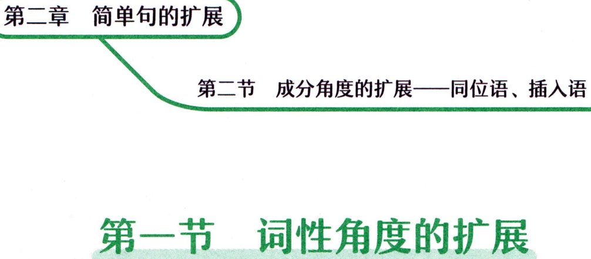

```text
第二章简单句的扩展
第二节成分角度的扩展一同位语、插入语
第一节词性角度的扩展
```

## 一、限定词

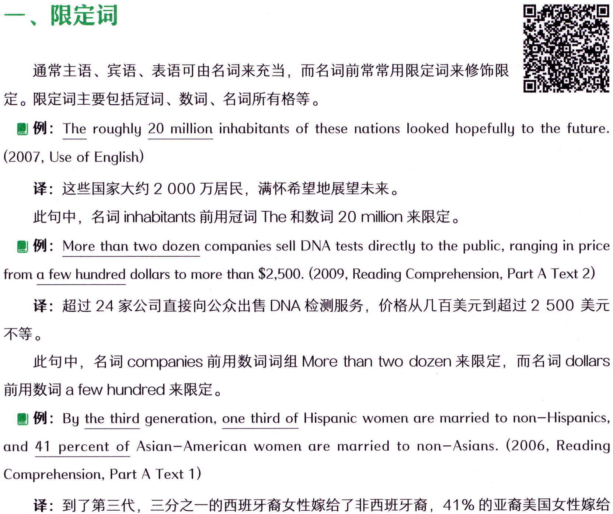

```text
一、限定词
通常主语、宾语、表语可由名词来充当，而名词前常常用限定词来修饰限
定。限定词主要包括冠词、数词、名词所有格等。
例: The roughly 20 million inhabitants of these nations looked hopefully to the future.
(2007, Use of English)
译：这些国家大约2000万居民，满怀希望地展望未来。
此句中，名词inhabitants前用冠词The和数词20million来限定。
例: More than two dozen companies sell DNA tests directly to the public, ranging in price
from a few hundred dollars to more than $2,500. (2009, Reading Comprehension, Part A Text 2)
译：超过24家公司直接向公众出售DNA检测服务，价格从几百美元到超过2500美元
不等。
此句中，名词companies 前用数词词组 More thantwodozen来限定，而名词dollars
前用数词afewhundred来限定。
例：By the third generation,one third of Hispanic women are married to non-Hispanics,
and 41 percent of Asian-American women are married to non-Asians. (2006, Reading
Comprehension, Part A Text 1)
译：到了第三代，三分之一的西班牙裔女性嫁给了非西班牙裔，41%的亚裔美国女性嫁给
```

#### 词汇表

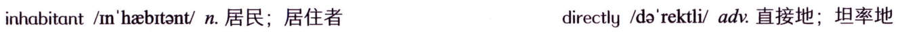

```text
directly/do'rektli/adv.直接地；坦率地
inhabitant/m'haebitant/n.居民；居住者
```

#### 概述

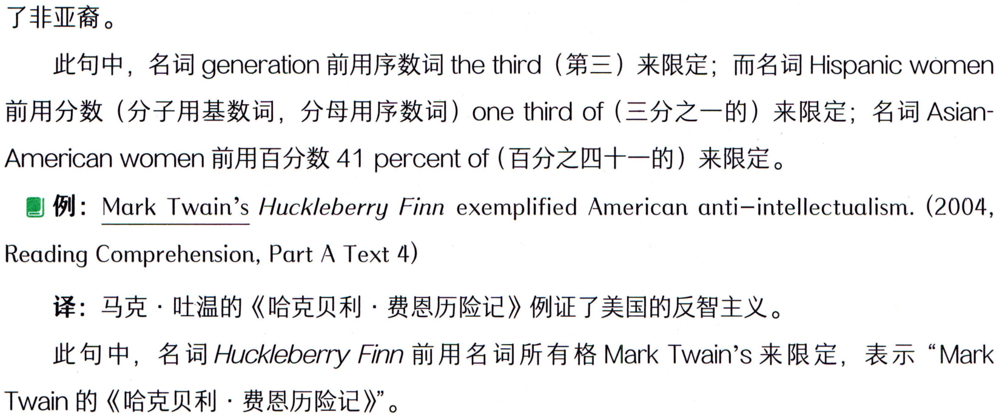

```text
了非亚裔。
此句中，名词 generation 前用序数词 the third（第三）来限定；而名词Hispanic women
前用分数（分子用基数词，分母用序数词）one thirdof（三分之一的）来限定；名词Asian-
American women 前用百分数 41percent of（百分之四十一的）来限定。
例: Mark Twain's Huckleberry Finn exemplified American anti-intellectualism. (2004,
Reading Comprehension, Part A Text 4)
译：马克·吐温的《哈克贝利·费恩历险记》例证了美国的反智主义。
此句中，名词Huckleberry Finn 前用名词所有格 MarkTwain's 来限定，表示“Mark
Twain的《哈克贝利·费恩历险记》”。
```

### 【补充】通常，这些限定词可以同时出现多个，放在名词前。除此之外，名词也可以修饰

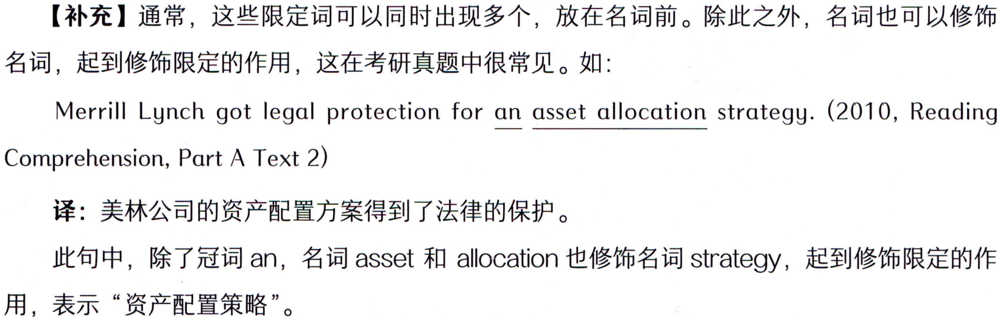

```text
【补充】通常，这些限定词可以同时出现多个，放在名词前。除此之外，名词也可以修饰
名词，起到修饰限定的作用，这在考研真题中很常见。如：
Merrill Lynch got legal protection for an asset allocation strategy. (2010, Reading
Comprehension, Part A Text 2)
译：美林公司的资产配置方案得到了法律的保护。
此句中，除了冠词 an，名词 asset 和 allocation 也修饰名词 strategy，起到修饰限定的作
用，表示“资产配置策略”。
```

## 二、形容词、副词


```text
二、形容词、副词
```

## UWhatis形容词、副词?

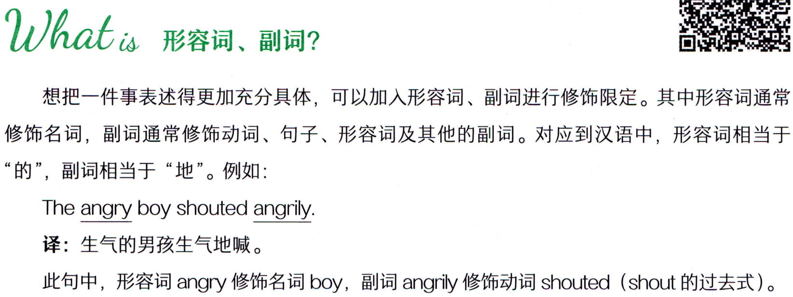

```text
UWhatis形容词、副词?
想把一件事表述得更加充分具体，可以加入形容词、副词进行修饰限定。其中形容词通常
修饰名词，副词通常修饰动词、句子、形容词及其他的副词。对应到汉语中，形容词相当于
“的”，副词相当于“地”。例如：
The angry boy shouted angrily.
译：生气的男孩生气地喊。
此句中，形容词 angry 修饰名词 boy，副词 angrily 修饰动词 shouted（shout 的过去式）。
```

#### 词汇表


```text
exemplify/ig'zemplifail/v例证，举例证明，是..…的范例
allocation/.aela'kerfn/n.配置，分配
```

### （一）形容词、副词作修饰成分

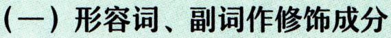

```text
（一）形容词、副词作修饰成分
```

#### 1.形容词修饰名词

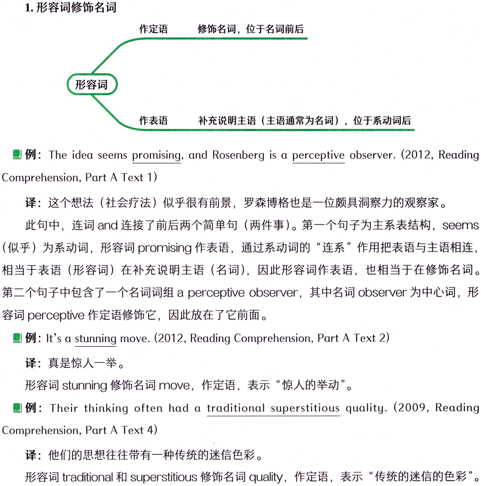

```text
1.形容词修饰名词
作定语
修饰名词，位于名词前后
形容词
作表语
补充说明主语（主语通常为名词），位于系动词后
例: The idea seems promising, and Rosenberg is a perceptive observer. (2012, Reading
Comprehension, Part A Text 1)
译：这个想法（社会疗法）似乎很有前景，罗森博格也是一位颇具洞察力的观察家。
此句中，连词 and连接了前后两个简单句（两件事）。第一个句子为主系表结构，seems
（似乎）为系动词，形容词 promising 作表语，通过系动词的“连系”作用把表语与主语相连，
相当于表语（形容词）在补充说明主语（名词），因此形容词作表语，也相当于在修饰名词。
第二个句子中包含了一个名词词组 a perceptive observer，其中名词 observer 为中心词，形
容词perceptive作定语修饰它，因此放在了它前面。
例: It's α stunning move. (2012, Reading Comprehension, Part A Text 2)
译：真是惊人一举。
形容词 stunning修饰名词move，作定语，表示“惊人的举动”。
例:Their thinking often had a traditional superstitious quality.(2009,Reading
Comprehension, Part A Text 4)
译：他们的思想往往带有一种传统的迷信色彩。
形容词 traditional和 superstitious 修饰名词 quality，作定语，表示“传统的迷信的色彩”。
```

#### 2.副词修饰动词、句子、形容词或其他的副词

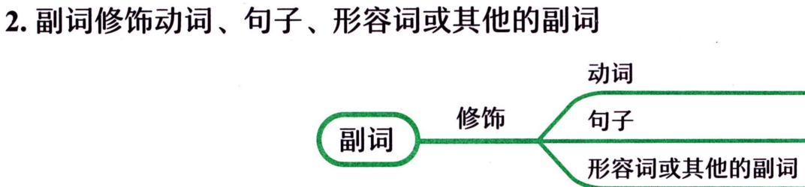

```text
2.副词修饰动词、句子、形容词或其他的副词
动词
修饰
句子
副词
形容词或其他的副词
```

#### 词汇表

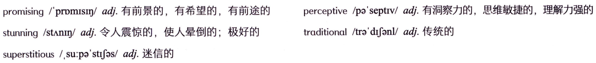

```text
perceptive/pa'septrv/adj.有洞察力的，思维敏捷的，理解力强的
promising/prpmisin/adj.有前景的，有希望的，有前途的
stunning/stanin/adj.令人震惊的，使人晕倒的；极好的
traditional/tra'dijfonl/adj.传统的
superstitious/.su:pa'stujas/adj.迷信的
```

#### 概述

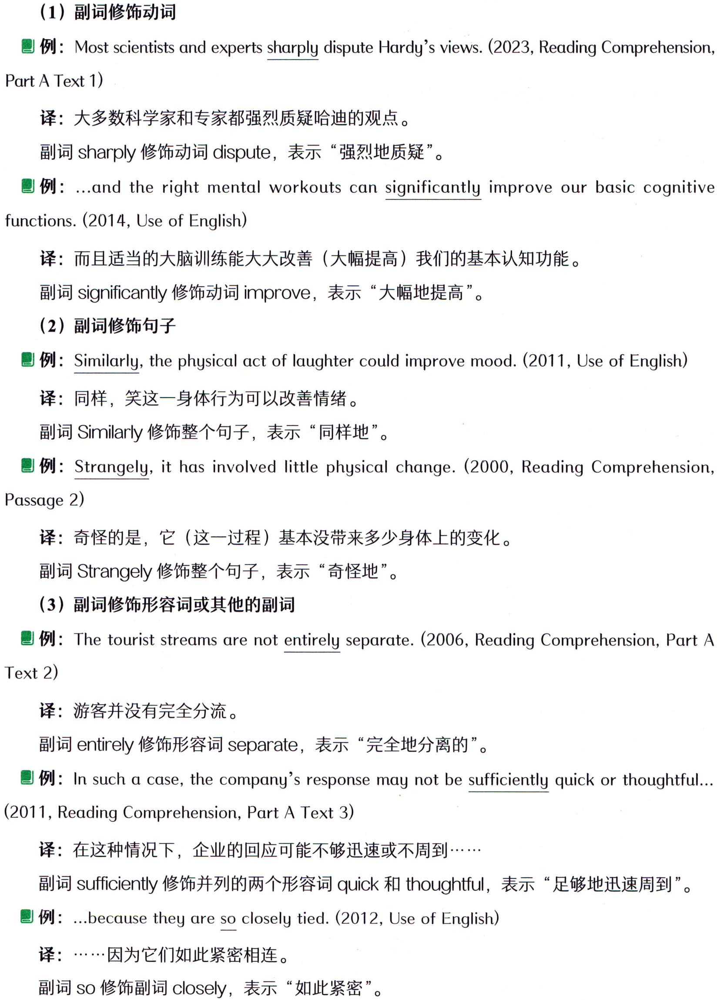

```text
（1）副词修饰动词
 例: Most scientists and experts sharply dispute Hardy's views. (2023, Reading Comprehension,
Part A Text 1)
译：大多数科学家和专家都强烈质疑哈迪的观点。
副词 sharply 修饰动词 dispute，表示“强烈地质疑”。
例: ...and the right mental workouts can significantly improve our basic cognitive
functions. (2014, Use of English)
译：而且适当的大脑训练能大大改善（大幅提高）我们的基本认知功能。
副词 significantly 修饰动词 improve，表示“大幅地提高”。
（2）副词修饰句子
例: Similarly, the physical act of laughter could improve mood. (2011, Use of English)
译：同样，笑这一身体行为可以改善情绪。
副词Similarly修饰整个句子，表示“同样地”。
例: Strangely, it has involved little physical change. (2000, Reading Comprehension,
Passage 2)
译：奇怪的是，它（这一过程）基本没带来多少身体上的变化。
副词 Strangely 修饰整个句子，表示“奇怪地”。
(3）副词修饰形容词或其他的副词
例: The tourist streams are not entirely separate. (2006, Reading Comprehension, Part A
Text 2)
译：游客并没有完全分流。
副词entirely 修饰形容词 separate，表示“完全地分离的”。
例: In such a case, the company's response may not be sufficiently quick or thoughtful...
(2011, Reading Comprehension, Part A Text 3)
译：在这种情况下，企业的回应可能不够迅速或不周到·…
副词 sufficiently 修饰并列的两个形容词 quick和 thoughtful，表示“足够地迅速周到”。
例: ...because they are so closely tied. (2012, Use of English)
译：….….因为它们如此紧密相连。
副词 so 修饰副词closely，表示“如此紧密”。
```

#### 词汇表

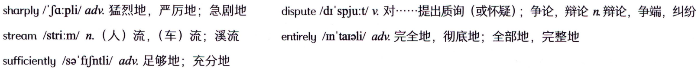

```text
sharply/fa:pliadv.猛烈地，严厉地；急剧地
dispute/dr'spju:t/v.对.提出质询（或怀疑）；争论，辩论n辩论，争端，纠纷
stream/stri:m/n.（人）流，（车）流；溪流
entirely/m'taroli/adv.完全地，彻底地；全部地，完整地
sufficiently/sa'fijfntli/adv.足够地；充分地
```

### （二）形容词、副词的三种比较级别

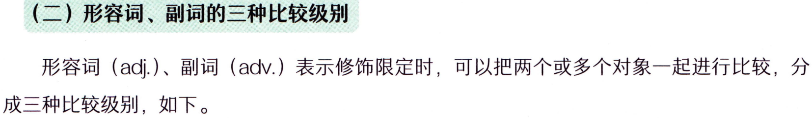

```text
（二）形容词、副词的三种比较级别
形容词（adj.）、副词（adv.）表示修饰限定时，可以把两个或多个对象一起进行比较，分
成三种比较级别，如下。
```

#### 1.原级比较

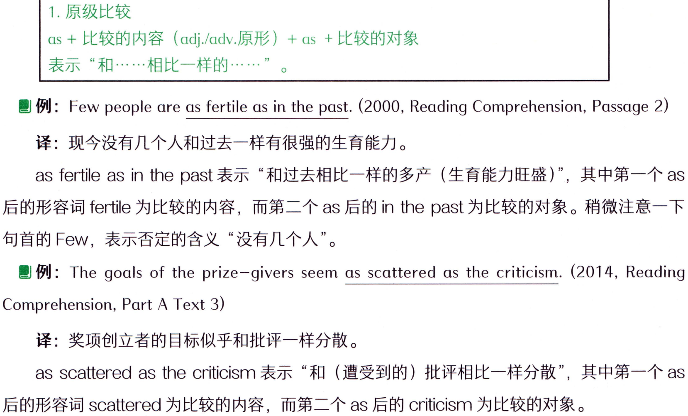

```text
1.原级比较
αs +比较的内容（adj./adv.原形）+ αs +比较的对象
表示“和…·····相比一样的··
例: Few people are as fertile as in the past. (2000, Reading Comprehension, Passage 2)
译：现今没有几个人和过去一样有很强的生育能力。
as fertile as in the past表示“和过去相比一样的多产（生育能力旺盛）”，其中第一个 as
后的形容词fertile 为比较的内容，而第二个 as 后的in the past为比较的对象。稍微注意一下
句首的Few，表示否定的含义“没有几个人”。
例: The goals of the prize-givers seem as scattered as the criticism. (2014, Reading
Comprehension, Part A Text 3)
译：奖项创立者的目标似乎和批评一样分散。
aS SCattered as the criticism 表示“和（遭受到的）批评相比一样分散”，其中第一个as
后的形容词 scattered 为比较的内容，而第二个 as 后的 criticism 为比较的对象。
```

#### 2.比较级

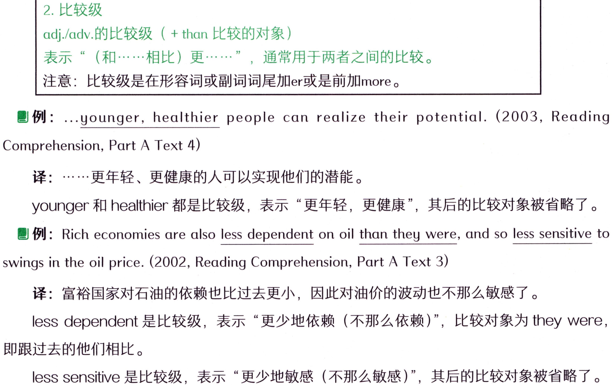

```text
2.比较级
adj./adv.的比较级（+than 比较的对象）
表示“（和……相比）更·……”，通常用于两者之间的比较。
注意：比较级是在形容词或副词词尾加er或是前加more。
例: ...younger, healthier people can realize their potential. (2003, Reading
Comprehension, Part A Text 4)
译：·……·更年轻、更健康的人可以实现他们的潜能。
younger 和healthier 都是比较级，表示“更年轻，更健康”，其后的比较对象被省略了。
例: Rich economies are also less dependent on oil than they were, and so less sensitive to
swings in the oil price. (2002, Reading Comprehension, Part A Text 3)
译：富裕国家对石油的依赖也比过去更小，因此对油价的波动也不那么敏感了。
less dependent是比较级，表示“更少地依赖（不那么依赖）”，比较对象为 they were,
即跟过去的他们相比。
lesSSensitive是比较级，表示“更少地敏感（不那么敏感）”，其后的比较对象被省略了。
```

#### 词汇表

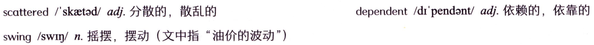

```text
dependent/dr'pendontadj.依赖的，依靠的
scattered/'skaetad/adj.分散的，散乱的
swing/swin/n.摇摆，摆动（文中指“油价的波动")
```

#### 3.最高级

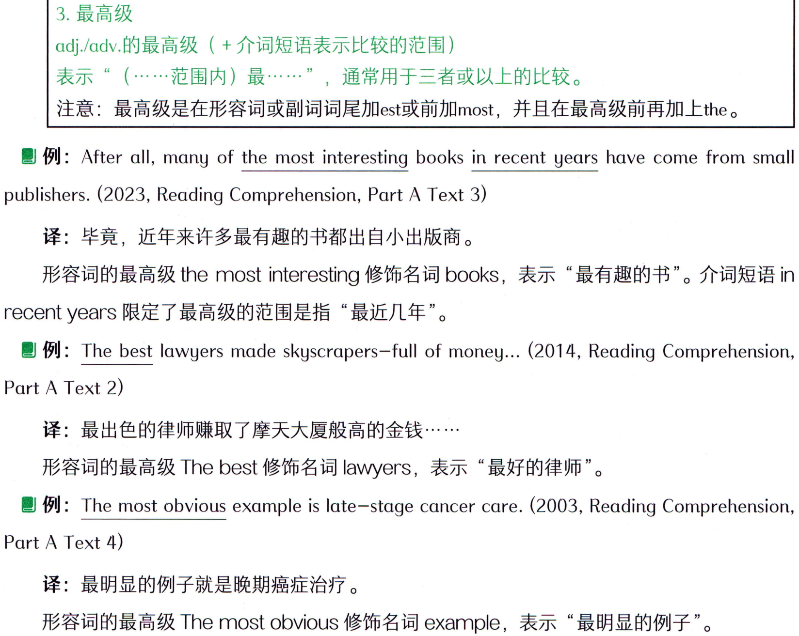

```text
3.最高级
adj./adv.的最高级（+介词短语表示比较的范围）
表示“（…….·范围内）最………”，通常用于三者或以上的比较。
注意：最高级是在形容词或副词词尾加est或前加most，并且在最高级前再加上the。
例: After all, many of the most interesting books in recent years have come from small
publishers. (2023, Reading Comprehension, Part A Text 3)
译：毕竟，近年来许多最有趣的书都出自小出版商。
形容词的最高级 the most interesting 修饰名词 books，表示“最有趣的书”。介词短语in
recent years 限定了最高级的范围是指“最近几年”。
例: The best lawyers made skyscrapers-full of money... (2014, Reading Comprehension,
Part A Text 2)
译：最出色的律师赚取了摩天大厦般高的金钱.··
形容词的最高级The best修饰名词lawyers，表示“最好的律师”。
 例: The most obvious example is late-stage cancer care. (2003, Reading Comprehension,
Part A Text 4)
译：最明显的例子就是晚期癌症治疗。
形容词的最高级 The most obvious 修饰名词 example，表示“最明显的例子”。
```

### 【补充】三种比较的级别只针对形容词和副词，其他词性没有。


```text
【补充】三种比较的级别只针对形容词和副词，其他词性没有。
```

### 【补充】三种比较级别中，一般原级比较的比较对象都会加上，但是比较级和最高级的比

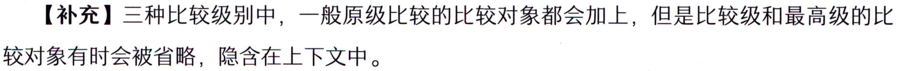

```text
【补充】三种比较级别中，一般原级比较的比较对象都会加上，但是比较级和最高级的比
较对象有时会被省略，隐含在上下文中。
```

## Why te lean 形容词、副词?

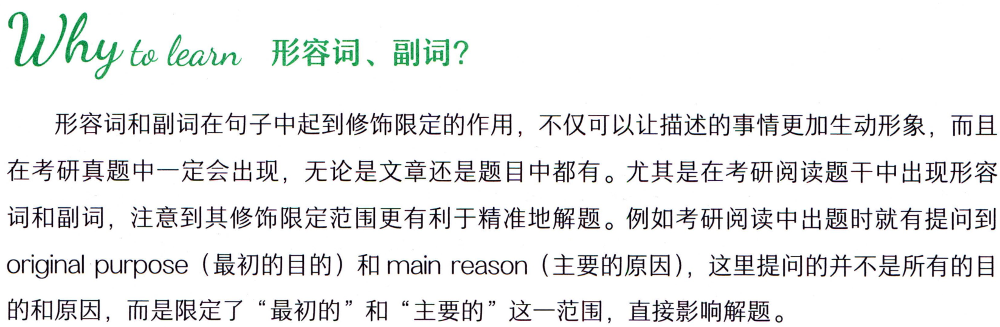

```text
Why te lean 形容词、副词?
在考研真题中一定会出现，无论是文章还是题目中都有。尤其是在考研阅读题干中出现形容
词和副词，注意到其修饰限定范围更有利于精准地解题。例如考研阅读中出题时就有提问到
original purpose（最初的目的）和mainreason（主要的原因），这里提问的并不是所有的目
的和原因，而是限定了“最初的”和“主要的”这一范围，直接影响解题。
```

#### 词汇表


```text
skyscraper /'skaiskrerpa(r)/n.摩天大楼
```

#### 概述

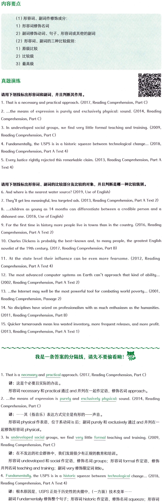

```text
内容要点
（1）形容词、副词作修饰成分：
1）形容词修饰名词
2）副词修饰动词、句子、形容词或其他的副词
（2）形容词、副词的三种比较级别：
1）原级比较
2）比较级
3）最高级
真题演练
请用下划线标出形容词和副词，并且判断其作用。
1. That is a necessary and practical approach. (2017, Reading Comprehension, Part C)
2. ...the means of expression is purely and exclusively physical: sound. (2014, Reading
Comprehension, Part C)
3. In undeveloped social groups, we find very little formal teaching and training. (2009,
Reading Comprehension, Part C)
4. Fundamentally, the USPS is in a historic squeeze between technological change... (2018,
Reading Comprehension, Part A Text 4)
5. Every Justice rightly rejected this remarkable claim. (2013, Reading Comprehension, Part A
Text 4)
请用下划线标出形容词、副词的比较部分及比较的对象，并且判断是哪一种比较级别。
6.And where is the nearest water source? (2019, Use of English)
7. They'll get less meaningful, less targeted ads. (2013, Reading Comprehension, Part A Text 2)
8....children as young as 14 months can differentiate between a credible person and a
dishonest one. (2018,Use of English)
9. For the first time in history more people live in towns than in the country. (2016, Reading
Comprehension, Part A Text 2)
10. Charles Dickens is probably the best-known and, to many people, the greatest English
novelist of the 19th century. (2017, Reading Comprehension, Part B)
11. At the state level their influence can be even more fearsome. (2012, Reading
Comprehension, Part A Text 4)
12. The most advanced computer systems on Earth can't approach that kind of ability...
(2002, Reading Comprehension, Part A Text 2)
13. ...the Internet may well be the most powerful tool for combating world poverty... (2001,
Reading Comprehension, Passage 2)
14. No disciplines have seized on professionalism with as much enthusiasm as the humanities.
(2011, Reading Comprehension, Part B)
15. Quicker turnarounds mean less wasted inventory, more frequent releases, and more profit.
(2013, Reading Comprehension, Part A Text 1)
我是一条答案的分隔线，请先不要偷看呦！
1. That is a necessary and practical approach. (2017, Reading Comprehension, Part C)
译：这是个必要且实际的办法。
形容词 necessary 和 practical 通过 and 并列在一起作定语，修饰名词 approach。
2. ...the means of expression is purely and exclusively physical: sound. (2014, Reading
Comprehension, Part C)
译：……·其（指音乐）表达方式完全是有形的一声音。
形容词 physical 作表语，位于系动词 is 后；副词 purely 和 exclusively 通过 and 并列在一
起修饰形容词 physical。
3. In undeveloped social groups, we find very little formal teaching and training. (2009,
Reading Comprehension, Part C)
译：在不发达的社会群体中，我们发现很少有正规的教育和培训。
形容词undeveloped 和 social 作定语，修饰名词 groups；形容词 formal作定语，修饰
并列名词 teaching and training；副词 very 修饰限定词 little。
4. Fundamentally, the USPS is in a historic squeeze between technological change... (2018,
Reading Comprehension, Part A Text 4)
译：根本原因是，USPS正处于历史性的夹缝中，（一方面）技术变革…
副词Fundamentally 修饰整个句子；形容词historic 作定语，修饰名词 squeeze；形容词
```

#### 词汇表

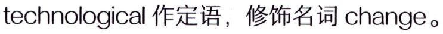

```text
technological作定语，修饰名词change。
```

#### 概述

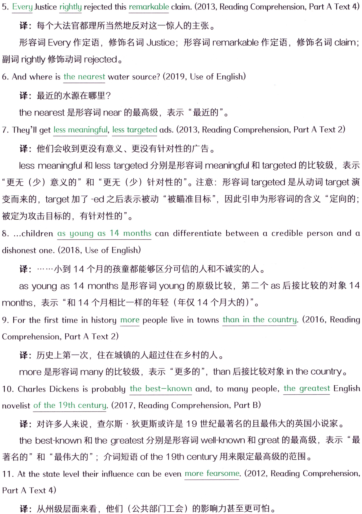

```text
5. Every Justice rightly rejected this remarkable claim. (2013, Reading Comprehension, Part A Text 4)
译：每个大法官都理所当然地反对这一惊人的主张。
形容词Every 作定语，修饰名词 Justice；形容词remarkable 作定语，修饰名词claim;
副词rightly修饰动词rejected。
6. And where is the nearest water source? (2019, Use of English)
译：最近的水源在哪里？
the nearest是形容词near 的最高级，表示“最近的”。
7. They'll get less meaningful, less targeted ads. (2013, Reading Comprehension, Part A Text 2)
译：他们会收到更没有意义、更没有针对性的广告。
less meaningful 和 less targeted 分别是形容词 meaningful 和 targeted 的比较级，表示
“更无（少）意义的”和“更无（少）针对性的”。注意：形容词targeted是从动词target演
变而来的，target加了-ed之后表示被动“被瞄准目标”，因此引申为形容词的含义“定向的;
被定为攻击目标的，有针对性的”。
8. ...children as young as 14 months can differentiate between a credible person and a
dishonest one.(2018, Use of English)
译：…·小到14个月的孩童都能够区分可信的人和不诚实的人。
as young as 14 months是形容词young 的原级比较，第二个 as 后接比较的对象 14
months，表示“和14个月相比一样的年轻（年仅14个月大的）”。
9. For the first time in history more people live in towns than in the country. (2016, Reading
Comprehension, Part A Text 2)
译：历史上第一次，住在城镇的人超过住在乡村的人。
more是形容词 many 的比较级，表示“更多的”，than 后接比较对象 in the country。
10. Charles Dickens is probably the best-known and, to many people, the greatest English
novelist of the 19th century. (2017, Reading Comprehension, Part B)
译：对许多人来说，查尔斯·狄更斯或许是19世纪最著名的且最伟大的英国小说家。
thebest-known和 thegreatest分别是形容词well-known和great的最高级，表示“最
著名的”和“最伟大的”；介词短语ofthe19thcentury用来限定最高级的范围。
11.At the state level their influence can be even more fearsome.(2012, Reading Comprehension,
PartA Text 4)
译：从州级层面来看，他们（公共部门工会）的影响力甚至更可怕。
```

#### 词汇表

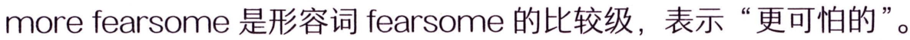

```text
morefearsome是形容词fearsome的比较级，表示“更可怕的”。
```

#### 概述

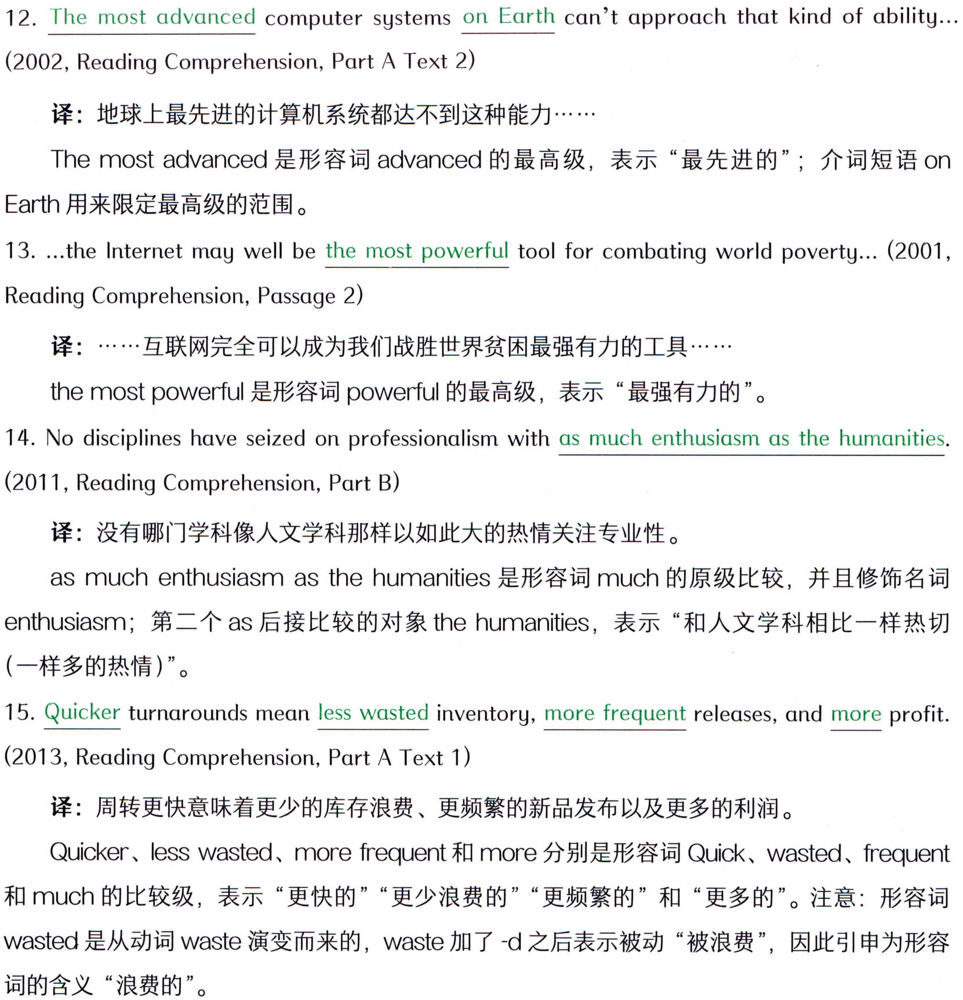

```text
12. The most advanced computer systems on Earth can't approach that kind of ability...
(2002, Reading Comprehension, Part A Text 2)
译：地球上最先进的计算机系统都达不到这种能力·…·..
The most advanced是形容词 advanced 的最高级，表示“最先进的”；介词短语on
Earth用来限定最高级的范围。
13. ...the Internet may well be the most powerful tool for combating world poverty... (2001,
Reading Comprehension, Passage 2)
译：·….·互联网完全可以成为我们战胜世界贫困最强有力的工具.……
the most powerful是形容词powerful的最高级，表示“最强有力的”。
14. No disciplines have seized on professionalism with as much enthusiasm as the humanities.
(2011, Reading Comprehension, Part B)
译：没有哪门学科像人文学科那样以如此大的热情关注专业性。
asmuchenthusiasmasthehumanities是形容词much的原级比较，并且修饰名词
enthusiasm；第二个as 后接比较的对象 the humanities，表示“和人文学科相比一样热切
（一样多的热情）”。
15. Quicker turnarounds mean less wasted inventory, more frequent releases, and more profit.
(2013, Reading Comprehension, Part A Text 1)
译：周转更快意味着更少的库存浪费、更频繁的新品发布以及更多的利润。
Quicker、less wasted、more frequent 和 more 分别是形容词 Quick、wasted、frequent
wasted是从动词waste演变而来的，waste 加了-d之后表示被动“被浪费”，因此引申为形容
词的含义“浪费的”。
```

## 三、介词短语


```text
三、介词短语
```

## Uuhatis 介词短语?

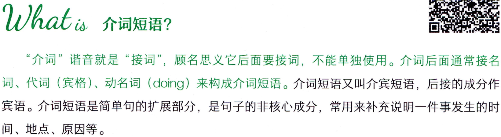

```text
Uuhatis 介词短语?
“介词”谐音就是“接词”，顾名思义它后面要接词，不能单独使用。介词后面通常接名
词、代词（宾格）、动名词（doing）来构成介词短语。介词短语又叫介宾短语，后接的成分作
宾语。介词短语是简单句的扩展部分，是句子的非核心成分，常用来补充说明一件事发生的时
间、地点、原因等。
```

## How to use 介词短语?


```text
How to use 介词短语?
考研真题中经常考查的介词如下。
```

#### 1.表示时间的介词

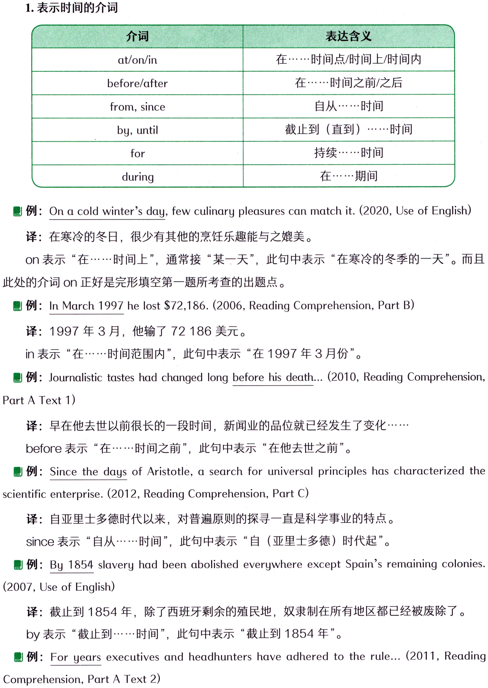

```text
1.表示时间的介词
介词
表达含义
at/on/in
在··.··时间点/时间上/时间内
在.…··时间之前/之后
before/after
自从………·时间
from, since
截止到（直到）·…··时间
by, until
for
持续·时间
during
在.……期间
例: On a cold winter's day, few culinary pleasures can match it. (2020, Use of English)
译：在寒冷的冬日，很少有其他的烹饪乐趣能与之媲美。
on表示“在·….…·时间上”，通常接“某一天”，此句中表示“在寒冷的冬季的一天”。而且
此处的介词on正好是完形填空第一题所考查的出题点。
例: In March 1997 he lost $72,186. (2006, Reading Comprehension, Part B)
译：1997年3月，他输了72186美元。
in表示“在……..…·时间范围内”，此句中表示“在1997年3月份”。
例: Journalistic tastes had changed long before his death.. (2010, Reading Comprehension,
Part A Text 1)
译：早在他去世以前很长的一段时间，新闻业的品位就已经发生了变化·…·.
before表示“在·….…·时间之前”，此句中表示“在他去世之前”。
例: Since the days of Aristotle, a search for universal principles has characterized the
scientific enterprise. (2012, Reading Comprehension, Part C)
译：自亚里士多德时代以来，对普遍原则的探寻一直是科学事业的特点。
since表示“自从…….…·时间”，此句中表示“自（亚里士多德）时代起”。
例: By 1854 slavery had been abolished everywhere except Spain's remaining colonies.
(2007, Use of English)
译：截止到1854年，除了西班牙剩余的殖民地，奴隶制在所有地区都已经被废除了。
by 表示“截止到·……·时间”，此句中表示“截止到1854年”。
例: For years executives and headhunters have adhered to the rule... (2011, Reading
Comprehension, Part A Text 2)
```

#### 词汇表

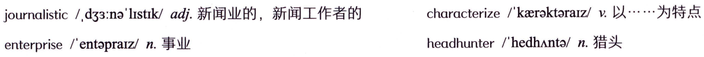

```text
journalistic/.d33:na'listlk/adj.新闻业的，新闻工作者的
characterize/"karaktaraiz/v.以....为特点
headhunter/hedhAnta/n.猎头
enterprise /'entapraiz/ n.事业
```

#### 概述

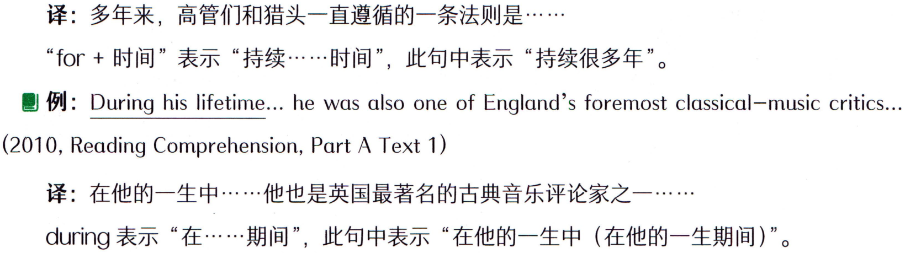

```text
译：多年来，高管们和猎头一直遵循的一条法则是·…
“for+时间”表示“持续·……·时间”，此句中表示“持续很多年”。
例: During his lifetime... he was also one of England's foremost classical-music critics..
(2010, Reading Comprehension, Part A Text 1)
译：在他的一生中.…·他也是英国最著名的古典音乐评论家之
during表示“在……-期间”，此句中表示“在他的一生中（在他的一生期间）”。
```

#### 2.表示地点或范围的介词

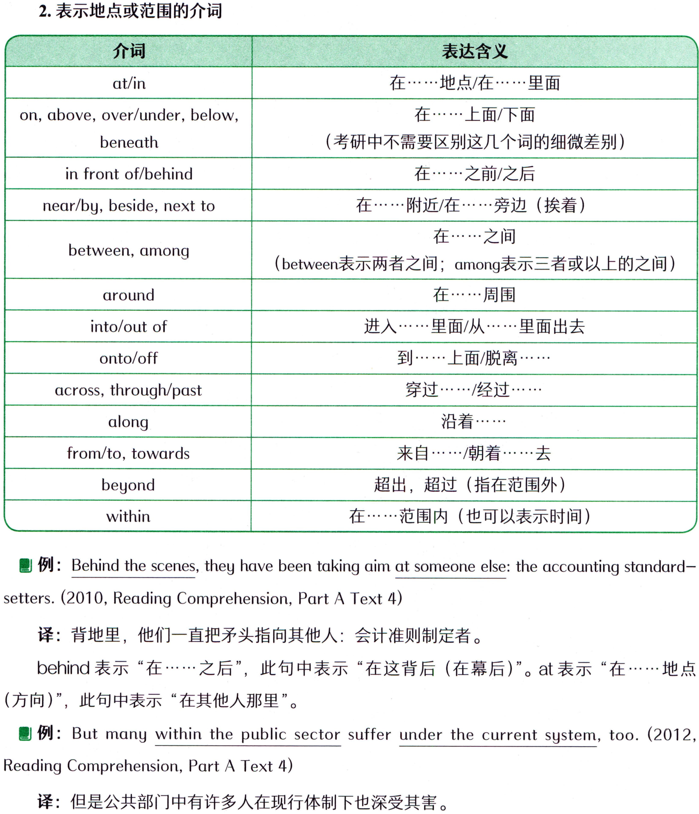

```text
2.表示地点或范围的介词
介词
表达含义
在.….·地点在.….·.里面
at/in
在·上面下面
on, above, over/under,below,
beneath
(考研中不需要区别这几个词的细微差别)
在···之前/之后
in front of/behind
在.····附近/在.···旁边（挨着)
near/by, beside, next to
在.…·之间
between,among
(between表示两者之间；among表示三者或以上的之间)
在…周围
around
into/out of
进入……··.里面从·里面出去
到..….上面/脱离.··
onto/off
穿过…·经过·.
across, through/past
沿着·….
along.
from/to, towards
来自.··.朝着·…····去
beyond
超出，超过 (指在范围外)
within
在.…·…·范围内（也可以表示时间）
 例: Behind the scenes, they have been taking aim at someone else: the accounting standard-
setters. (2010, Reading Comprehension, Part A Text 4)
译：背地里，他们一直把矛头指向其他人：会计准则制定者。
behind表示“在……..…·之后”，此句中表示“在这背后（在幕后)”。at表示“在…….·地点
（方向）”，此句中表示“在其他人那里”。
例: But many within the public sector suffer under the current system,too.(2012,
Reading Comprehension, Part A Text 4)
译：但是公共部门中有许多人在现行体制下也深受其害。
```

#### 词汇表

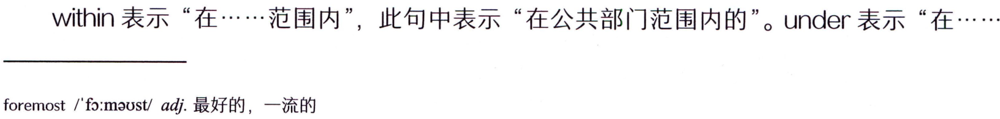

```text
within表示“在……..…·范围内”，此句中表示“在公共部门范围内的”。under表示“在…….
foremost/fo:maust/adj.最好的，一流的
```

#### 概述

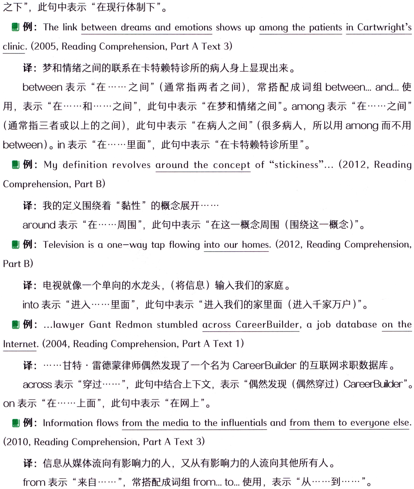

```text
之下”，此句中表示“在现行体制下”。
例: The link between dreams and emotions shows up among the patients in Cartwright's
clinic. (2005, Reading Comprehension, Part A Text 3)
译：梦和情绪之间的联系在卡特赖特诊所的病人身上显现出来。
between表示“在.....·之间”（通常指两者之间），常搭配成词组between...and..使
用，表示“在……..…·和………之间”，此句中表示“在梦和情绪之间”。among表示“在……·之间”
（通常指三者或以上的之间），此句中表示“在病人之间”（很多病人，所以用among而不用
between）。in表示“在….…·里面”，此句中表示“在卡特赖特诊所里”。
例: My definition revolves around the concept of “stickiness"... (2012, Reading
Comprehension, Part B)
译：我的定义围绕着“黏性”的概念展开……
around表示“在·….…周围”，此句中表示“在这一概念周围（围绕这一概念）”。
例: Television is a one-way tap flowing into our homes. (2012, Reading Comprehension,
Part B)
译：电视就像一个单向的水龙头，（将信息）输入我们的家庭。
into表示“进入………·里面”，此句中表示“进入我们的家里面（进入千家万户）”。
例:...lawyer Gant Redmon stumbled across CareerBuilder,a job database on the
Internet. (2004, Reading Comprehension, Part A Text 1)
译：...…·甘特·雷德蒙律师偶然发现了一个名为CareerBuilder的互联网求职数据库。
across表示“穿过.…..”，此句中结合上下文，表示“偶然发现（偶然穿过）CareerBuilder”
on表示“在…….…·上面”，此句中表示“在网上”。
例：Information flows from the media to theinfluentialsand from themto everyone else.
(2010, Reading Comprehension, Part A Text 3)
译：信息从媒体流向有影响力的人，又从有影响力的人流向其他所有人。
from表示“来自.....”，常搭配成词组from...to...使用，表示“从....到.....
```

#### 3.其他用法的介词

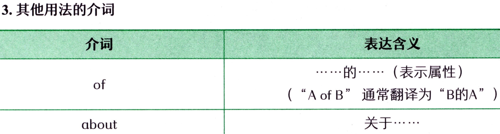

```text
3.其他用法的介词
介词
表达含义
·.…·的……（表示属性）
of
（“AofB”通常翻译为“B的A”）
about
```

#### 词汇表

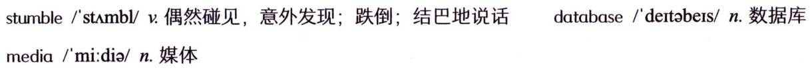

```text
stumble/'stAmbl/v偶然碰见，意外发现；跌倒；结巴地说话
database/dertabers/n.数据库
media/mi:dia/n.媒体
```

#### 概述

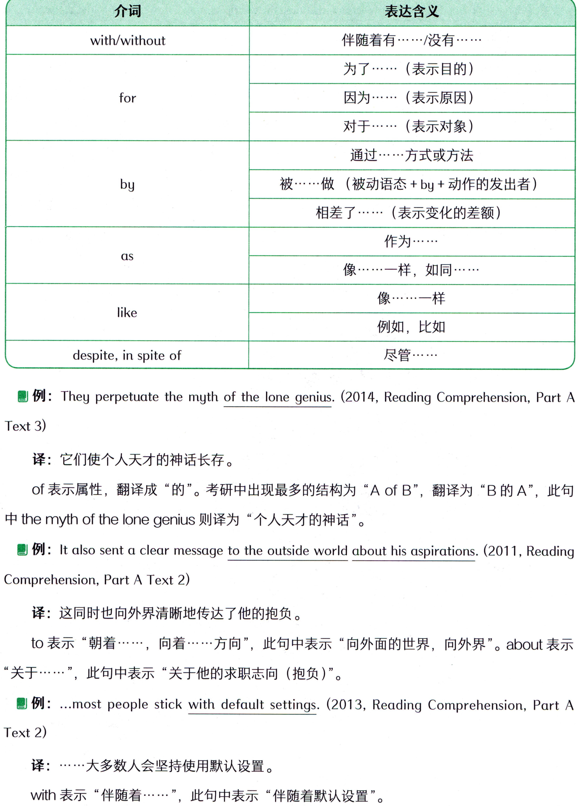

```text
介词
表达含义
with/without
伴随着有··没有·
为了…….…·（表示目的）
for
因为·……（表示原因）
对于…（表示对象）
通过··方式或方法
被………做（被动语态+by+动作的发出者)
by
相差了………·（表示变化的差额）
作为……….
SD
像……·…一样，如同.….··
像··…一样
like
例如，比如
尽管…….
despite, in spite of
例: They perpetuate the myth of the lone genius. (2014, Reading Comprehension, Part A
Text 3)
译：它们使个人天才的神话长存。
of表示属性，翻译成“的”。考研中出现最多的结构为“Aof B”，翻译为“B的A"，此句
中 the myth of the lone genius 则译为“个人天才的神话”。
例: It also sent a clear message to the outside world about his aspirations. (2011, Reading
Comprehension, Part A Text 2)
译：这同时也向外界清晰地传达了他的抱负。
to表示“朝着…….….，向着……..…·方向”，此句中表示“向外面的世界，向外界”。about表示
“关于…”，此句中表示“关于他的求职志向（抱负）”。
例: ..most people stick with default settings. (2013, Reading Comprehension, Part A
Text 2)
译：.…….大多数人会坚持使用默认设置。
°“Y，笔中回‘“，笔M
```

#### 词汇表

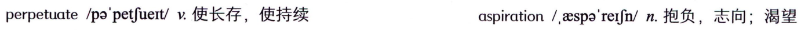

```text
perpetuate/pa'petfuert/v.使长存，使持续
aspiration/aespa'rerfn/n.抱负，志向；渴望
```

#### 概述

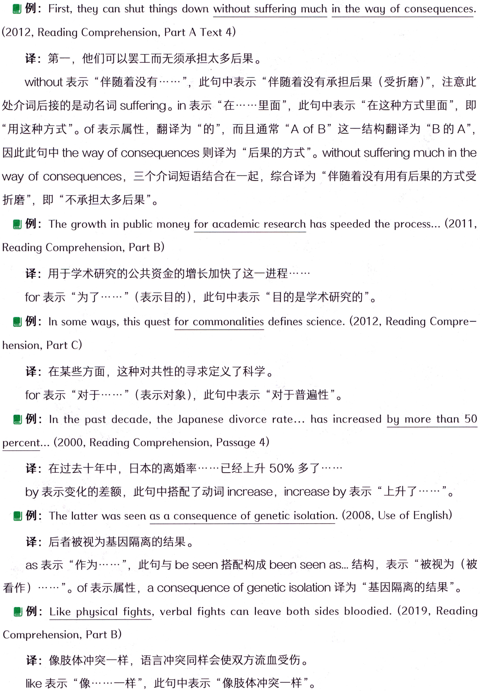

```text
 例: First, they can shut things down without suffering much in the way of consequences.
(2012, Reading Comprehension, Part A Text 4)
译：第一，他们可以罢工而无须承担太多后果。
without表示“伴随着没有…….”，此句中表示“伴随着没有承担后果（受折磨)”，注意此
处介词后接的是动名词suffering。in表示“在…………里面”，此句中表示“在这种方式里面”，即
“用这种方式”。Of表示属性，翻译为“的”，而且通常“AofB”这一结构翻译为“B的A”，
因此此句中 the way of consequences 则译为“后果的方式"。without suffering much in the
折磨”，即“不承担太多后果”。
 例: The growth in public money for academic research has speeded the process.. (2011,
Reading Comprehension, Part B)
译：用于学术研究的公共资金的增长加快了这一进程·…··
，（），
例: In some ways, this quest for commonalities defines science. (2012, Reading Compre-
hension, Part C)
译：在某些方面，这种对共性的寻求定义了科学。
for表示“对于………”（表示对象），此句中表示“对于普遍性”。
例: In the past decade,the Japanese divorce rate...has increased by more than 50
percent... (2000, Reading Comprehension, Passage 4)
译：在过去十年中，日本的离婚率….…·已经上升50%多了·…·
by 表示变化的差额，此句中搭配了动词 increase，increase by 表示“上升了…..
(   )    t   s   r  s
译：后者被视为基因隔离的结果。
as 表示“作为.…."，此句与 be seen 搭配构成 been seen as..结构，表示“被视为（被
看作）..…”。of 表示属性，a consequence of genetic isolation 译为“基因隔离的结果”。
例: Like physical fights, verbal fights can leave both sides bloodied. (2019, Reading
Comprehension, Part B)
译：像肢体冲突一样，语言冲突同样会使双方流血受伤。
like表示“像……一样”，此句中表示“像肢体冲突一样”。
```

#### 词汇表

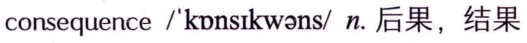

```text
consequence/konsikwans/n.后果，结果
```

#### 概述

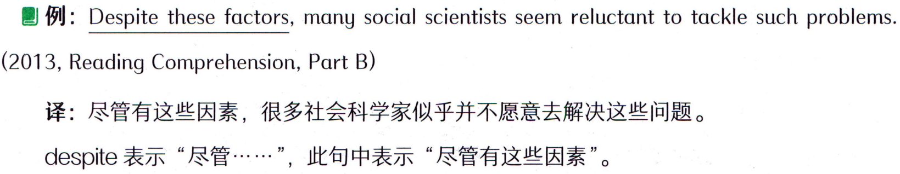

```text
 例: Despite these factors, many social scientists seem reluctant to tackle such problems.
(2013, Reading Comprehension, Part B)
译：尽管有这些因素，很多社会科学家似乎并不愿意去解决这些问题。
despite表示“尽管….…”，此句中表示“尽管有这些因素”。
```

## Why tolearn介词短语?

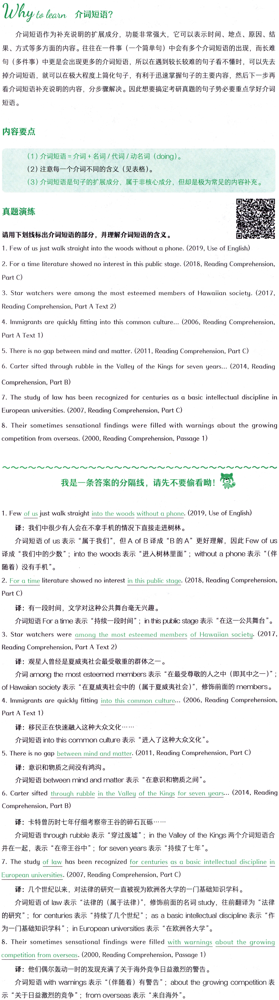

```text
Why tolearn介词短语?
介词短语作为补充说明的扩展成分，功能非常强大，它可以表示时间、地点、原因、结
句（多件事）中更是会出现更多的介词短语，所以在遇到较长较难的句子看不懂时，可以先去
掉介词短语，就可以在极大程度上简化句子，有利于迅速掌握句子的主要内容，然后下一步再
看介词短语补充说明的内容，分步骤解决。因此想要搞定考研真题的句子势必要重点学好介词
短语。
内容要点
（1）介词短语=介词+名词/代词／动名词（doing）。
(2）注意每一个介词不同的含义（见表格）。
（3）介词短语是句子的扩展成分，属于非核心成分，但却是极为常见的内容补充。
真题演练
请用下划线标出介词短语的部分，并理解介词短语的含义。
1. Few of us just walk straight into the woods without a phone. (2019, Use of English)
2. For a time literature showed no interest in this public stage. (2018, Reading Comprehension,
Part C)
3. Star watchers were among the most esteemed members of Hawaiian society. (2017,
Reading Comprehension, Part A Text 2)
4. Immigrants are quickly fitting into this common culture... (2006, Reading Comprehension,
Part A Text 1)
5. There is no gap between mind and matter. (2011, Reading Comprehension, Part C)
6. Carter sifted through rubble in the Valley of the Kings for seven years... (2014, Reading
Comprehension, Part B)
7. The study of law has been recognized for centuries as a basic intellectual discipline in
European universities. (2007, Reading Comprehension, Part C)
8. Their sometimes sensational findings were filled with warnings about the growing
competition from overseas. (2000, Reading Comprehension, Passage 1)
我是一条答案的分隔线，请先不要偷看呦！
1. Few of us just walk straight into the woods without a phone. (2019, Use of English)
译：我们中很少有人会在不拿手机的情况下直接走进树林。
介词短语of us表示“属于我们”，但AofB译成“B的A”更好理解，因此Fewof uS
译成“我们中的少数”；into the woods表示“进入树林里面”；without a phone 表示“（伴
随着）没有手机”。
2. For a time literature showed no interest in this public stage. (2018, Reading Comprehension,
Part C)
译：有一段时间，文学对这种公共舞台毫无兴趣。
介词短语For a time 表示“持续一段时间”；in this public stage 表示“在这一公共舞台”。
3. Star watchers were among the most esteemed members of Hawaian society. (2017,
Reading Comprehension,Part A Text 2)
译：观星人曾经是夏威夷社会最受敬重的群体之一。
介词 among the most esteemed members 表示“在最受尊敬的人之中（即其中之一）”;
ofHawaian society表示“在夏威夷社会中的（属于夏威夷社会）”，修饰前面的memberS。
4. Immigrants are quickly fitting into this common culture... (2006, Reading Comprehension,
Part A Text 1)
译：移民正在快速融入这种大众文化·…·
介词短语into thiscommonculture表示“进入了这种大众文化”。
5. There is no gap between mind and matter. (2011, Reading Comprehension, Part C)
译：意识和物质之间没有鸿沟。
介词短语betweenmindandmatter表示“在意识和物质之间”。
6. Carter sifted through rubble in the Valley of the Kings for seven years... (2014, Reading
Comprehension, Part B)
译：卡特曾历时七年仔细考察帝王谷的碎石瓦砾·…
介词短语 through rubble 表示“穿过废墟”；in theValley of theKings 两个介词短语合
并在一起，表示“在帝王谷中”；for seven years 表示“持续了七年”。
7. The study of law has been recognized for centuries as a basic intellectual discipline in
European universities. (2007, Reading Comprehension, Part C)
译：几个世纪以来，对法律的研究一直被视为欧洲各大学的一门基础知识学科。
）
的研究”；for centuries 表示“持续了几个世纪”；as a basic intellectual discipline 表示“作
为一门基础知识学科”；inEuropean universities 表示“在欧洲各大学”。
8. Their sometimes sensational findings were filled with warnings about the growing
competition from overseas. (2000, Reading Comprehension, Passage 1)
译：他们偶尔轰动一时的发现充满了关于海外竞争日益激烈的警告。
介词短语 with warnings 表示“(伴随着）有警告”；about the growing competition 表
示“关于日益激烈的竞争”；from overseas表示“来自海外”。
```
