# 第二节 成分角度的扩展—同位语、插入语

### (一)同位语

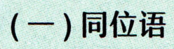

```text
(一)同位语
```

## Whatis同位语？

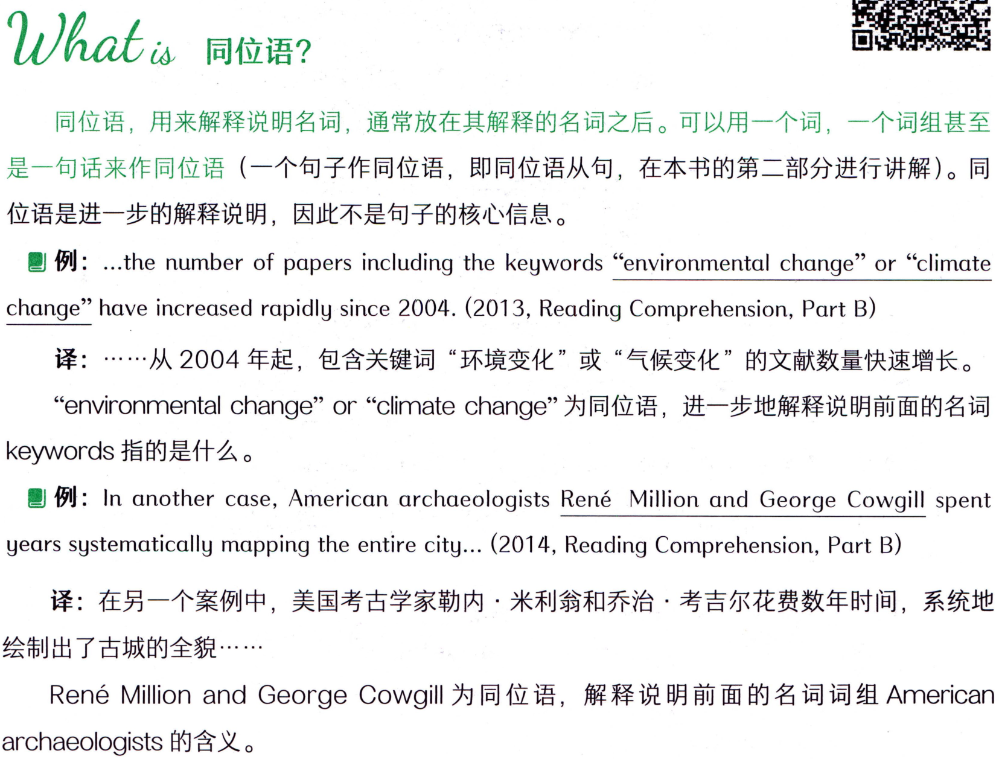

```text
Whatis同位语？
同位语，用来解释说明名词，通常放在其解释的名词之后。可以用一个词，一个词组甚至
是一句话来作同位语（一个句子作同位语，即同位语从句，在本书的第二部分进行讲解）。同
位语是进一步的解释说明，因此不是句子的核心信息。
 例: .the number of papers including the keywords “environmental change” or “climate
change”have increased rapidly since 2004. (2013, Reading Comprehension, Part B)
译：……从2004年起，包含关键词“环境变化”或“气候变化”的文献数量快速增长。
“environmentalchange”or“climatechange”为同位语，进一步地解释说明前面的名词
keywords指的是什么。
例: In another case, American archaeologists René Million and George Cowgill spent
years systematically mapping the entire city... (2014, Reading Comprehension, Part B)
译：在另一个案例中，美国考古学家勒内·米利翁和乔治·考吉尔花费数年时间，系统地
绘制出了古城的全貌…···
RenéMillionandGeorgeCowgill为同位语，解释说明前面的名词词组American
archaeologists 的含义。
```

## How to use 同位语?

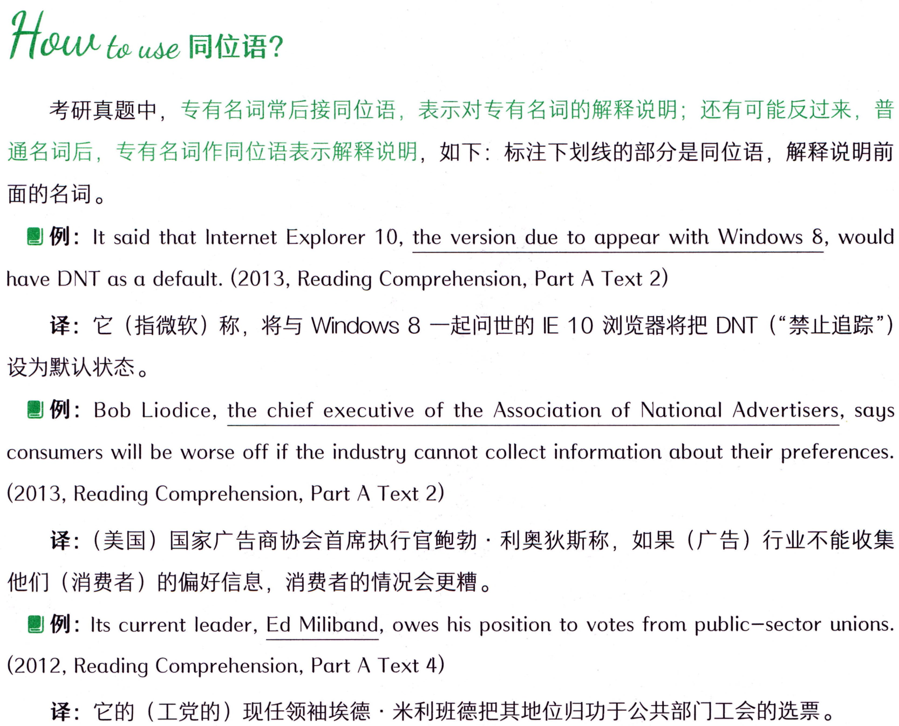

```text
How to use 同位语?
考研真题中，专有名词常后接同位语，表示对专有名词的解释说明；还有可能反过来，普
通名词后，专有名词作同位语表示解释说明，如下：标注下划线的部分是同位语，解释说明前
面的名词。
例: It said that Internet Explorer 10, the version due to appear with Windows 8, would
have DNT as a default. (2013, Reading Comprehension, Part A Text 2)
译：它（指微软）称，将与Windows 8一起问世的IE10浏览器将把DNT（“禁止追踪")
设为默认状态。
例: Bob Liodice, the chief executive of the Association of National Advertisers, says
consumers will be worse off if the industry cannot collect information about their preferences.
(2013, Reading Comprehension, Part A Text 2)
译：（美国）国家广告商协会首席执行官鲍勃·利奥狄斯称，如果（广告）行业不能收集
他们（消费者）的偏好信息，消费者的情况会更糟。
例: Its current leader,Ed Miliband, owes his position to votes from public-sector unions.
(2012, Reading Comprehension, Part A Text 4)
译：它的（工党的）现任领袖埃德·米利班德把其地位归功于公共部门工会的选票。
```

### 【补充】同位语表示进一步的解释说明，常伴随着一些标志性的标点符号，如：逗号，破

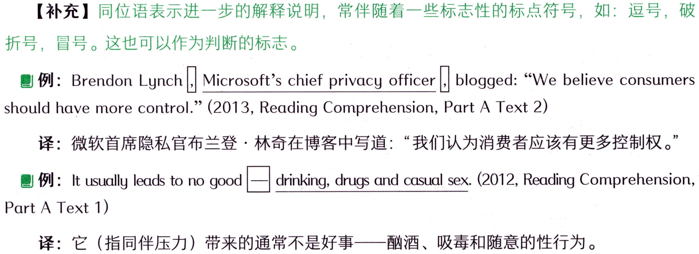

```text
【补充】同位语表示进一步的解释说明，常伴随着一些标志性的标点符号，如：逗号，破
折号，冒号。这也可以作为判断的标志。
例: Brendon Lynch|, Microsoft's chief privacy officer
blogged:“Webelieve consumers
should have more control." (2013, Reading Comprehension, Part A Text 2)
译：微软首席隐私官布兰登·林奇在博客中写道：“我们认为消费者应该有更多控制权。”
drinking, drugs and casual sex. (2012, Reading Comprehension,
例：It usually leads to no good
Part A Text 1)
译：它（指同伴压力）带来的通常不是好事一酗酒、吸毒和随意的性行为。
```

#### 词汇表

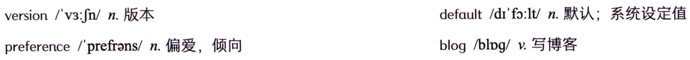

```text
default/dr'fo:lt/n.默认；系统设定值
version/v3:fn/n.版本
preference /prefrans/n.偏爱，倾向
blog/blpg/v.写博客
```

#### 概述

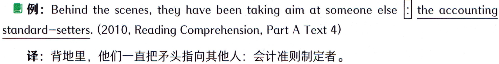

```text
 例: Behind the scenes, they have been taking aim at someone else
the accounting
standard-setters. (2010, Reading Comprehension, Part A Text 4)
译：背地里，他们一直把矛头指向其他人：会计准则制定者。
```

### (二） 插入语

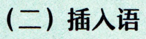

```text
(二） 插入语
```

## Whatis 插入语?

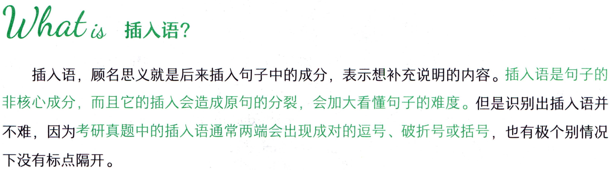

```text
Whatis 插入语?
插入语，顾名思义就是后来插入句子中的成分，表示想补充说明的内容。插入语是句子的
非核心成分，而且它的插入会造成原句的分裂，会加大看懂句子的难度。但是识别出插入语并
不难，因为考研真题中的插入语通常两端会出现成对的逗号、破折号或括号，也有极个别情况
下没有标点隔开。
```

## How to use 插入语?

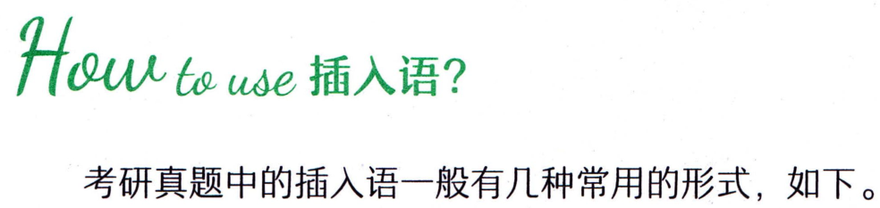

```text
How to use 插入语?
考研真题中的插入语一般有几种常用的形式，如下。
```

#### 1.主谓结构作插入语，表示“某人说，某人认为.…

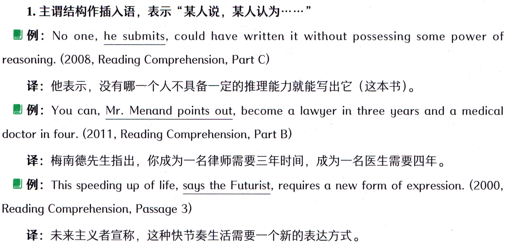

```text
1.主谓结构作插入语，表示“某人说，某人认为.…
例: No one, he submits, could have written it without possessing some power of
reasoning. (2008, Reading Comprehension, Part C)
译：他表示，没有哪一个人不具备一定的推理能力就能写出它(这本书)。
例: You can, Mr. Menand points out, become a lawyer in three years and a medical
doctor in four. (2011, Reading Comprehension, Part B)
译：梅南德先生指出，你成为一名律师需要三年时间，成为一名医生需要四年。
 例: This speeding up of life, says the Futurist, requires a new form of expression. (2000,
Reading Comprehension, Passage 3)
译：未来主义者宣称，这种快节奏生活需要一个新的表达方式。
```

#### 2.副词作插入语

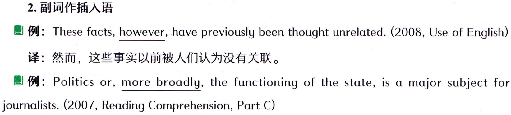

```text
2.副词作插入语
例: These facts, however, have previously been thought unrelated. (2008, Use of English)
译：然而，这些事实以前被人们认为没有关联。
例: Politics or, more broadly, the functioning of the state, is a major subject for
journalists. (2007, Reading Comprehension, Part C)
```

#### 词汇表

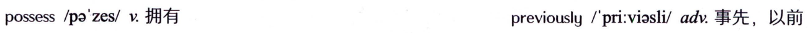

```text
possess /pazes/v.拥有
previously/pri:viasli/adv.事先，以前
```

#### 概述

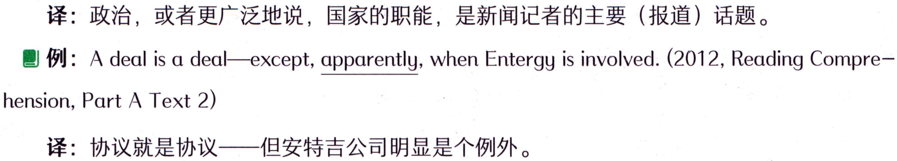

```text
译：政治，或者更广泛地说，国家的职能，是新闻记者的主要（报道）话题。
 例: A deal is a deal—-except, apparently, when Entergy is involved. (2012, Reading Compre--
hension,Part A Text 2)
译：协议就是协议一但安特吉公司明显是个例外。
```

#### 3.介词短语作插入语

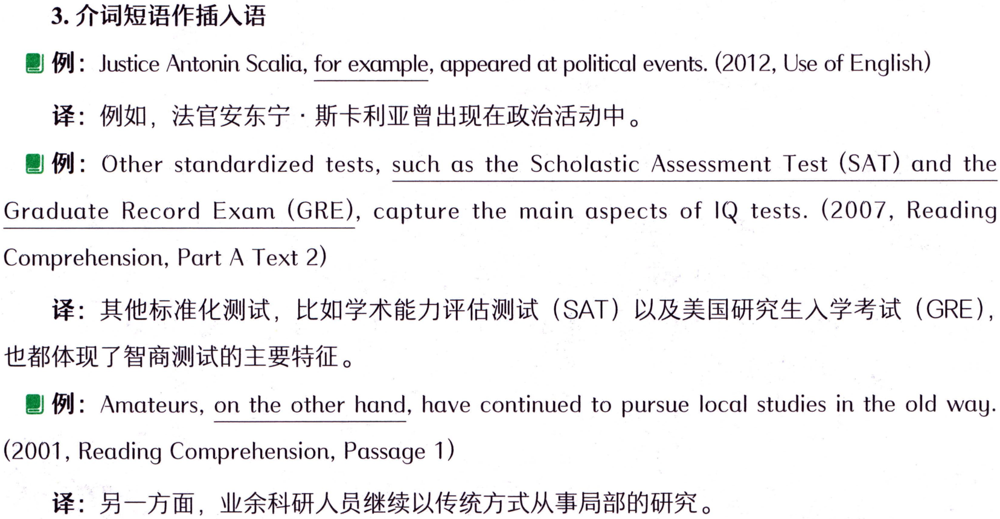

```text
3.介词短语作插入语
 例: Justice Antonin Scalia, for example, appeared at political events. (2012, Use of English)
译：例如，法官安东宁·斯卡利亚曾出现在政治活动中。
例:Other standardized tests,such as the Scholastic Assessment Test(SAT） and the
Graduate Record Exam (GRE), capture the main aspects of IQ tests.(2007, Reading
Comprehension, Part A Text 2)
译：其他标准化测试，比如学术能力评估测试（SAT）以及美国研究生入学考试（GRE),
也都体现了智商测试的主要特征。
例: Amateurs,on the other hand, have continued to pursue local studies in the old way.
(2001,Reading Comprehension,Passage 1)
译：另一方面，业余科研人员继续以传统方式从事局部的研究。
```

### 【补充】有的时候，一个内容可能既是同位语，又是插入语。因为同位语和插入语其实是

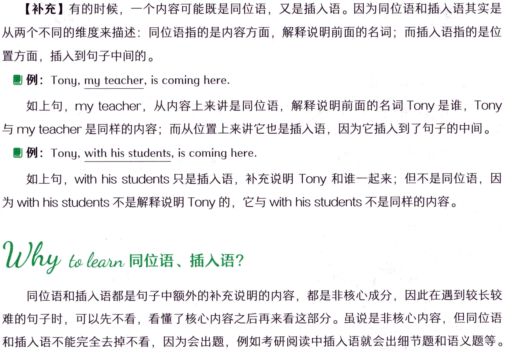

```text
【补充】有的时候，一个内容可能既是同位语，又是插入语。因为同位语和插入语其实是
从两个不同的维度来描述：同位语指的是内容方面，解释说明前面的名词；而插入语指的是位
置方面，插入到句子中间的。
例: Tony, my teacher, is coming here.
如上句，my teacher，从内容上来讲是同位语，解释说明前面的名词Tony是谁，Tony
与myteacher是同样的内容；而从位置上来讲它也是插入语，因为它插入到了句子的中间。
例:Tony,with his students, is coming here.
如上句，with his students 只是插入语，补充说明Tony和谁一起来；但不是同位语，因
为withhis students不是解释说明Tony的，它与with his students不是同样的内容。
同位语和插入语都是句子中额外的补充说明的内容，都是非核心成分，因此在遇到较长较
难的句子时，可以先不看，看懂了核心内容之后再来看这部分。虽说是非核心内容，但同位语
和插入语不能完全去掉不看，因为会出题，例如考研阅读中插入语就会出细节题和语义题等。
```

#### 词汇表

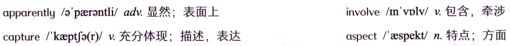

```text
involve/n'volv/v包含，牵涉
apparently/a'paerantli/adv.显然；表面上
aspect/espekt/n.特点；方面
capture /kaeptfa(r)/v.充分体现；描述，表达
```

#### 概述

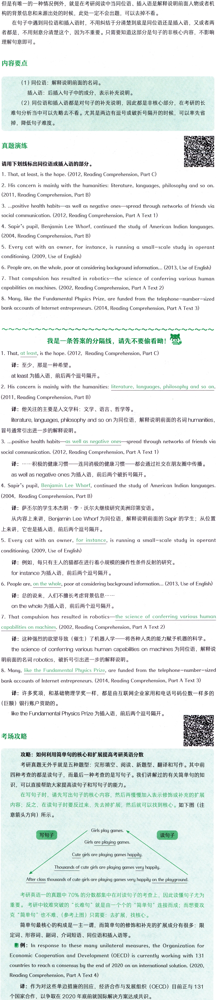

```text
但是有唯一的一种情况例外，就是在考研阅读中当同位语、插入语是解释说明前面人物或者机
构的背景信息和来源出处的时候，此处一定不会出题，可以去掉不看。
在句子中遇到同位语和插入语时，不用纠结于分清楚到底是同位语还是插入语，又或者两
者都是，不用刻意分清楚这个，因为不重要。只需要知道这部分是句子的非核心内容，不影响
理解句意即可。
内容要点
（1）同位语：解释说明前面的名词。
插入语：后插入句子中的成分，表示补充说明。
（2）同位语和插入语都是对句子的补充说明，因此都是非核心部分，在考研的长
难句分析当中可以先略去不看。尤其是两边有逗号或破折号隔开的时候，可以率先省
掉，降低句子难度。
真题演练
请用下划线标出同位语或插入语的部分。
1. That, at least, is the hope. (2012, Reading Comprehension, Part C)
2. His concern is mainly with the humanities: literature, languages, philosophy and so on.
(2011, Reading Comprehension, Part B)
3. ...positive health habits--as well as negative ones- spread through networks of friends via
social communication. (2012, Reading Comprehension, Part A Text 1)
4. Sapir's pupil, Benjamin Lee Whorf, continued the study of American Indian languages.
(2004, Reading Comprehension, Part B)
5. Every cat with an owner, for instance, is running a small-scale study in operant
conditioning. (2009, Use of English)
6. People are, on the whole, poor at considering background information.. (2013, Use of English)
7.Thatcompulsionhasresulted inrobotics-thescience ofconferringvarioushuman
capabilities on machines. (2002, Reading Comprehension, Part A Text 2)
8. Many, like the Fundamental Physics Prize, are funded from the telephone-number-sized
bank accounts of Internet entrepreneurs. (2014, Reading Comprehension, Part A Text 3)
我是一条答案的分隔线，请先不要偷看呦！
1. That, at least, is the hope. (2012, Reading Comprehension, Part C)
译：至少，那是一种希望。
atleast为插入语，前后两个逗号隔开。
2. His concern is mainly with the humanities: literature, languages, philosophy and so on.
(2011, Reading Comprehension, Part B)
译：他关注的主要是人文学科：文学、语言、哲学等。
literature, languages, philosophy and so on 为同位语，解释说明前面的名词 humanities,
冒号通常引出进一步的解释说明。
3. ...positive health habits—as well as negative ones—spread through networks of friends via
social communication. (2012, Reading Comprehension, Part A Text 1)
译：·.…积极的健康习惯一—连同消极的健康习惯—都会通过社交在朋友圈中传播。
as wellasnegativeones为插入语，前后两个破折号隔开。
4. Sapir's pupil, Benjamin Lee Whorf, continued the study of American Indian languages.
(2004, Reading Comprehension, Part B)
译：萨不尔的学生本杰明·李·沃尔夫继续研究美洲印第安语。
上来讲，它也是插入语，前后两个逗号隔开。
5. Every cat with an owner,for instance,is running a small-scale study in operant
conditioning. (2009, Use of English)
译：例如，每只有主人的猫都在进行着小规模的操作性条件反射的研究。
forinstance为插入语，前后两个逗号隔开。
6. People are, on the whole, poor at considering background information... (2013, Use of English)
译：总的说来，人们不擅长考虑背景信息.…·.
onthewhole为插入语，前后两个逗号隔开。
7. That compulsion has resulted in robotics—the science of conferring various human
capabilities on machines. (2002, Reading Comprehension, Part A Text 2)
译：这种强烈的欲望导致（催生）了机器人学一将各种人类的能力赋予机器的科学。
the science of conferring various human capabilities on machines 为同位语，解释说
明前面的名词robotics，破折号引引出进一步的解释说明。
8. Many, like the Fundamental Physics Prize, are funded from the telephone-number-sized
bank accounts of Internet entrepreneurs. (2014, Reading Comprehension, Part A Text 3)
译：许多奖项，和基础物理学奖一样，都是由互联网企业家用和电话号码位数一样多的
（巨额）银行账户资助的。
like the Fundamental Physics Prize为插入语，前后两个逗号隔开。
考场攻略
攻略：如何利用简单句的核心和扩展提高考研英语分数
考研真题无外乎就是五种题型：完形填空、阅读、新题型、翻译和写作。其中前
四种考查的都是读句子，而最后一种考查的是写句子。我们讲解过的有关简单句的知
识，可以直接帮助大家提高读句子和写句子的能力。
在写句子时，请先写出句子的核心内容，然后再慢慢加入表示修饰或补充的扩展
内容；反之，在读句子时要反过来，先去掉扩展，然后就可以找到核心。如下图（注
意箭头方向）所示。
Girls play games.
写句子
读句子
Girls are playing games.
Cute girls are playing games happily.
Thousands of cute girls are playing games very happily.
After class thousands of cute girls are playing games very happily on the playground.
考研英语一的真题中70%的分数都集中在对读句子的考查上，因此读懂句子尤为
重要。考研中较难突破的“长难句”就是由一个个的“简单句”连接而成；而想要攻
克“简单句”也不难，（参考上图）只需要：去扩展，找核心。
简单句最核心的构成是一主一谓，而简单句的修饰和补充的扩展成分有很多：限
定词、形容词、副词、介词短语、同位语和插入语等。
例: In response to these many unilateral measures, the Organization for
Economic Cooperation and Development (OECD) is currently working with 131
countries to reach a consensus by the end of 2020 on an international solution. (2020,
Reading Comprehension, Part A Text 4)
译：作为对这些单边措施的回应，经济合作与发展组织（OECD）目前正与131
个国家合作，以争取在2020年底前就国际解决方案达成共识。
```

#### 词汇表

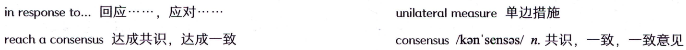

```text
inresponse t...回应....，应对....
unilateralmeasure单边措施
consensus/kan'sensas/n.共识，一致，一致意见
reachaconsensus达成共识，达成一致
```

#### 概述

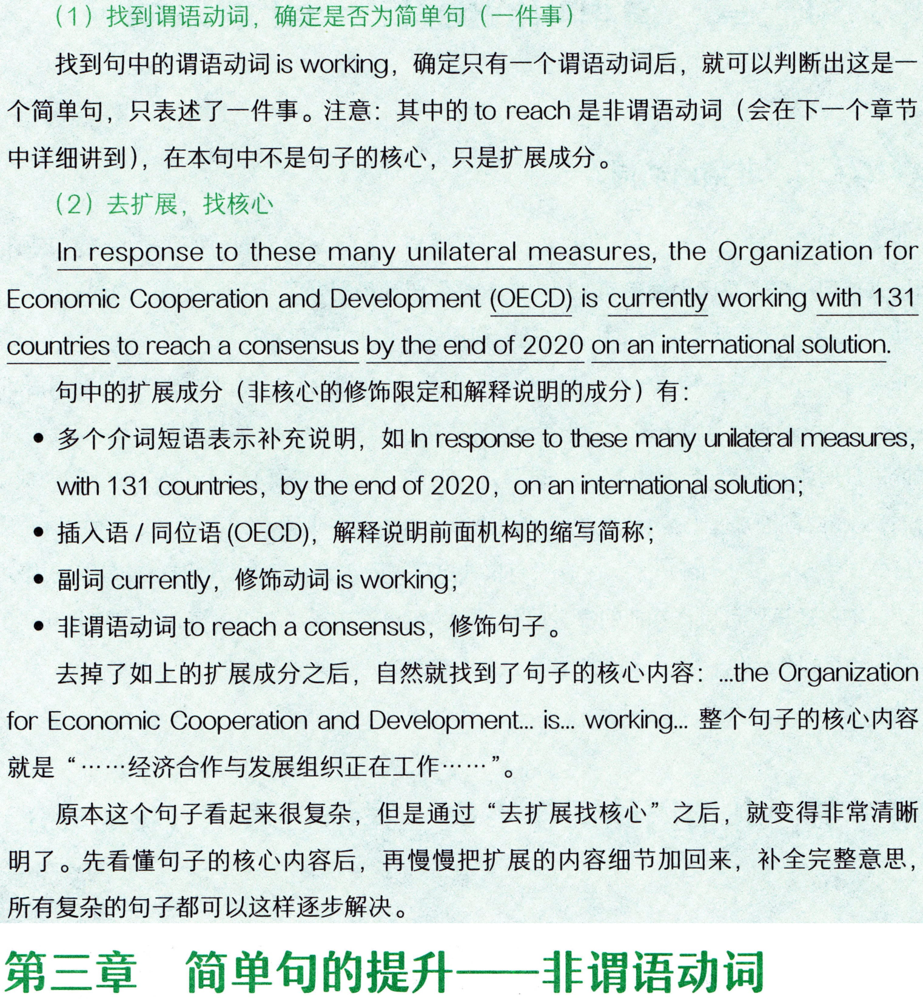

```text
（1）找到谓语动词，确定是否为简单句（一件事）
找到句中的谓语动词isworking，确定只有一个谓语动词后，就可以判断出这是一
个简单句，只表述了一件事。注意：其中的toreach是非谓语动词（会在下一个章节
中详细讲到），在本句中不是句子的核心，只是扩展成分。
（2）去扩展，找核心
In response to these many unilateral measures, the Organization for
Economic Cooperation and Development (OECD) is currently working with 131
countries to reach a consensus by the end of 2020 on an international solution.
句中的扩展成分（非核心的修饰限定和解释说明的成分）有：
·多个介词短语表示补充说明，如 In response to these many unilateral measures,
with 131 countries, by the end of 2020, on an international solution;
·插入语/同位语（OECD），解释说明前面机构的缩写简称；
·副词 currently， 修饰动词 is working;
·非谓语动词toreacha consensus，修饰句子。
去掉了如上的扩展成分之后，自然就找到了句子的核心内容：..theOrganization
for Economic Cooperation  and  Development.. i.. working.. 整个句子的核心内容
就是“……·经济合作与发展组织正在工作……”。
原本这个句子看起来很复杂，但是通过“去扩展找核心”之后，就变得非常清晰
明了。先看懂句子的核心内容后，再慢慢把扩展的内容细节加回来，补全完整意思，
所有复杂的句子都可以这样逐步解决。
第三章简单句的提升一非谓语动词
```

## Whatis非谓语动词？

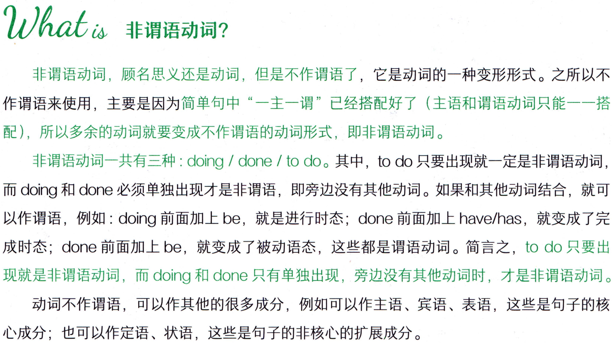

```text
Whatis非谓语动词？
非谓语动词，顾名思义还是动词，但是不作谓语了，它是动词的一种变形形式。之所以不
作谓语来使用，主要是因为简单句中“一主一谓”已经搭配好了（主语和谓语动词只能一一搭
配），所以多余的动词就要变成不作谓语的动词形式，即非谓语动词。
非谓语动词一共有三种：doing ／ done／ to do。其中，to do只要出现就一定是非谓语动词,
而 doing 和done 必须单独出现才是非谓语，即旁边没有其他动词。如果和其他动词结合，就可
以作谓语，例如：doing 前面加上be，就是进行时态；done 前面加上have/has，就变成了完
成时态；done 前面加上be，就变成了被动语态，这些都是谓语动词。简言之，to do 只要出
现就是非谓语动词，而 doing 和 done 只有单独出现，旁边没有其他动词时，才是非谓语动词。
动词不作谓语，可以作其他的很多成分，例如可以作主语、宾语、表语，这些是句子的核
心成分；也可以作定语、状语，这些是句子的非核心的扩展成分。
```
