# 第三节 平行结构

## Whatis 平行结构?

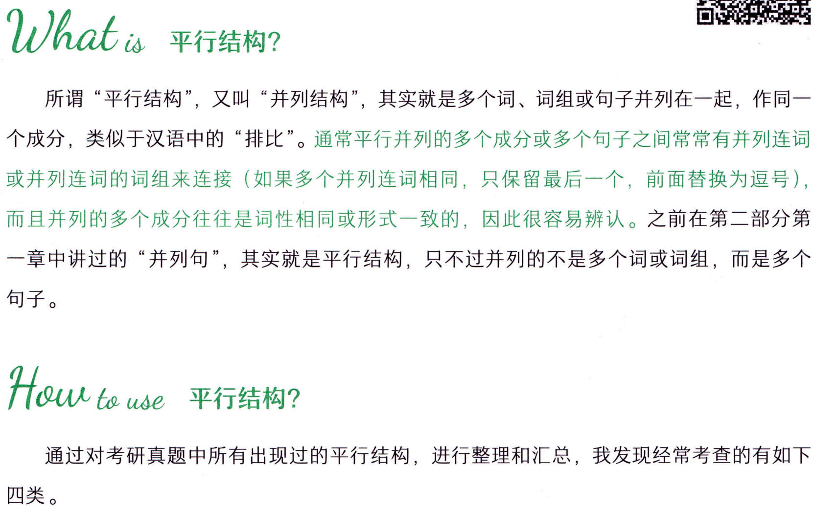

```text
Whatis 平行结构?
所谓“平行结构”，又叫“并列结构”，其实就是多个词、词组或句子并列在一起，作同一
个成分，类似于汉语中的“排比”。通常平行并列的多个成分或多个句子之间常常有并列连词
或并列连词的词组来连接（如果多个并列连词相同，只保留最后一个，前面替换为逗号），
而且并列的多个成分往往是词性相同或形式一致的，因此很容易辨认。之前在第二部分第
一章中讲过的“并列句”，其实就是平行结构，只不过并列的不是多个词或词组，而是多个
句子。
通过对考研真题中所有出现过的平行结构，进行整理和汇总，我发现经常考查的有如下
四类。
```

### （一）名词（词组）的平行并列

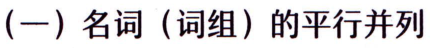

```text
（一）名词（词组）的平行并列
```

### （二）动词（谓语动词、非谓语动词）的平行并列


```text
（二）动词（谓语动词、非谓语动词）的平行并列
平行结构（并列结构）
```

### （三）介词短语的平行并列

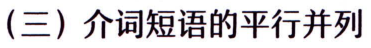

```text
（三）介词短语的平行并列
```

### （四）句子的平行并列


```text
（四）句子的平行并列
```

### （一）名词（词组）的平行并列

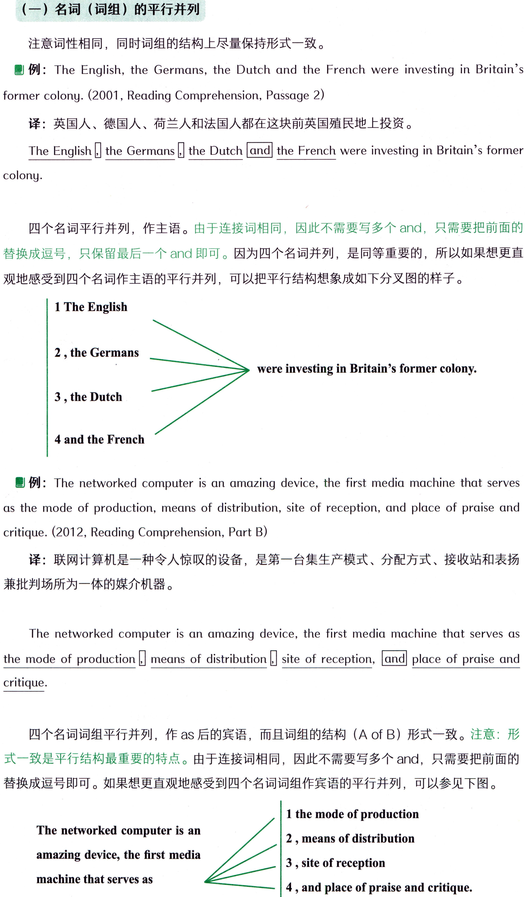

```text
（一）名词（词组）的平行并列
注意词性相同，同时词组的结构上尽量保持形式一致。
例: The English, the Germans, the Dutch and the French were investing in Britain's
former colony. (2001, Reading Comprehension, Passage 2)
译：英国人、德国人、荷兰人和法国人都在这块前英国殖民地上投资。
The Englishthe Germansthe Dutch and the French were investing in Britain's former
colony.
四个名词平行并列，作主语。由于连接词相同，因此不需要写多个and，只需要把前面的
替换成逗号，只保留最后一个and即可。因为四个名词并列，是同等重要的，所以如果想更直
观地感受到四个名词作主语的平行并列，可以把平行结构想象成如下分叉图的样子。
1 The English
2 ,the Germans
were investing in Britain's former colony.
3,the Dutch
4 and the French
例: The networked computer is an amazing device, the first media machine that serves
as the mode of production, means of distribution, site of reception, and place of praise and
critique. (2012, Reading Comprehension, Part B)
译：联网计算机是一种令人惊叹的设备，是第一台集生产模式、分配方式、接收站和表扬
兼批判场所为一体的媒介机器。
The networked computer is an amazing device, the first media machine that serves as
the mode of production  means of distribution  site of reception, and place of praise and
critique.
四个名词词组平行并列，作aS 后的宾语，而且词组的结构（A of B）形式一致。注意：形
式一致是平行结构最重要的特点。由于连接词相同，因此不需要写多个and，只需要把前面的
替换成逗号即可。如果想更直观地感受到四个名词词组作宾语的平行并列，可以参见下图。
1 the mode of production
The networked computer is an
2 ,means of distribution
amazing device, the first media
3 , site of reception
machine that serves as
4 , and place of praise and critique.
```

### （二）动词（谓语动词、非谓语动词）的平行并列

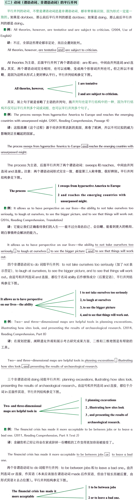

```text
（二）动词（谓语动词、非谓语动词）的平行并列
平行并列的动词，不管是谓语动词还是非谓语动词，都非常容易识别，因为形式一定是一
致的。如果是do/does，那么前后平行并列的都是do/does；如果是doing，那么前后平行并
列的都是doing。
例: All theories, however, are tentative and are subject to criticism. (2004, Use of
English)
译：不过，全部这些理论都非定论，而且会遭到批判。
All theories, however, are tentative and  are subject to criticism.
Alltheories 为主语，后面平行并列了两个谓语动词：are 和 are，中间由并列连词 and连
接。其实，两个谓语动词完全相同，也可以省略，变成两个形容词并列也可。但之所以不省
略，是因为这样从形式上更好辨认平行。平行并列结构参见下图。
1 are tentative
All theories, however,
2 and are subject to criticism.
其实，如上句子就是省略了主语的并列句，而并列句也是平行结构中的一种，因为平行结
构不仅可以平行并列多个词或词组，也可以平行并列多个句子。
例: The process sweeps from hyperactive America to Europe and reaches the emerging
countries with unsurpassed might. (2001, Reading Comprehension, Passage 4)
译：这股浪潮（这个过程）源于经济异常活跃的美国，席卷了欧洲，并以不可比拟的威力
影响到正在崛起的国家。
The process sweeps from hyperactive America to Europeand reaches the emerging countries with
unsurpassed might.
The process为主语，后面平行并列了两个谓语动词：sweeps 和reaches，中间由并列
连词 and连接。注意：两个谓语动词形式完全一致，都是第三人称单数，很好辨别。平行并列
结构参见下图。
1 sweeps fromhyperactiveAmerica toEurope
The process
2 and reaches theemerging countrieswith
unsurpassed might.
例: It allows us to have perspective on our lives—the ability to not take ourselves too
seriously, to laugh at ourselves, to see the bigger picture, and to see that things will work out.
(2016,ReadingComprehension,Translation)
译：它能让我们正确看待我们的人生一能不过分高估自己、会自嘲、能看到更大的格局、
明白事情终会解决的能力。
It allows us to have perspective on our lives—the ability to not take ourselves too
seriously  to laugh at ourselves  to see the bigger picture  and to see that things will work
out.
四个非谓语动词 to do词组平行并列：to not take ourselves too seriously（加了 not表
示否定)， to laugh at ourselves, to see the bigger picture, and to see that things will work
out。由逗号和并列连词 and 连接，都位于名词 abity 后作修饰成分（后置定语），平行并列结
构参见下图。
1 to not take ourselves too seriously
It allows us to have perspective
2, to laugh at ourselves
on our lives-the ability
3, to see the bigger picture
4, and to see that things will work out.
例: Two- and three-dimensional maps are helpful tools in planning excavations,
illustrating how sites look, and presenting the results of archaeological research. (2014,
Reading Comprehension, Part B)
译：在规划挖掘、阐释遗址外观和展示考古研究成果方面，二维和三维地图是有帮助的
工具。
Two- and three-dimensional maps are helpful tools in planning excavations  illustrating
how sites look , and presenting the results of archaeological research.
三个非谓语动词 doing 词组平行并列： planning excavations, ilustrating how sites look,
presenting the results of archaeological research。由逗号和并列连词 and 连接，都位于介
词in后面作宾语，平行并列结构参见下图。
1 planning excavations
Two-and three-dimensional
2 , illustrating how sites look
maps are helpful tools in
3 , and presenting the results of
archaeological research.
例: The financial crisis has made it more acceptable to be between jobs or to leave a
bad one. (2011, Reading Comprehension, Part A Text 2)
译：金融危机已经让待业在家或辞掉一份糟糕的工作变得更加容易被接受了。
The financial crisis has made it more acceptable to be between jobs or」to leave a bad
one.
两个非谓语动词 to do 词组平行并列：to be between jobs 和 to leave a bad one。由并
列连词 or 连接，作宾语（本来应该放在谓语动词 made 后作宾语，但由于较长而被后置，由
形式宾语it去占位置)。平行并列结构参见下图。
1 to be between jobs
The financial crisis has made it
more acceptable
2 or to leave a bad one.
```

### （三）介词短语的平行并列

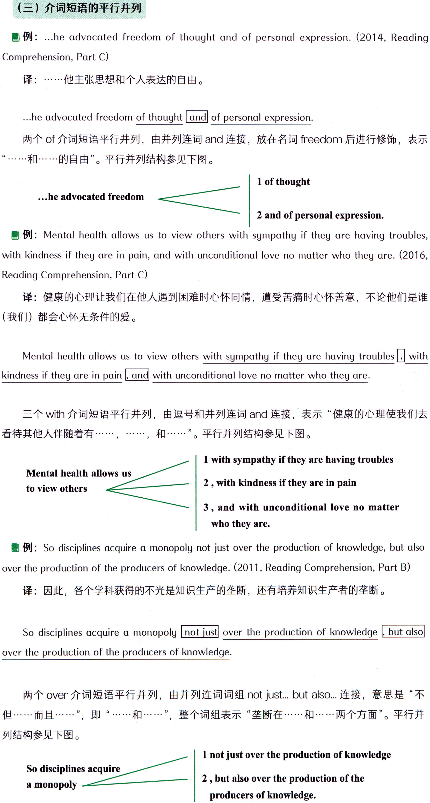

```text
（三）介词短语的平行并列
例: ...he advocated freedom of thought and of personal expression. (2014, Reading
Comprehension, Part C)
译：……·他主张思想和个人表达的自由。
...he advocated freedom of thought and of personal expression.
两个 of介词短语平行并列，由并列连词 and 连接，放在名词freedom 后进行修饰，表示
·和……···的自由”。平行并列结构参见下图。
1 of thought
...he advocated freedom
 2 and of personal expression.
例: Mental health allows us to view others with sympathy if they are having troubles,
with kindness if they are in pain, and with unconditional love no matter who they are. (2016,
Reading Comprehension, Part C)
译：健康的心理让我们在他人遇到困难时心怀同情，遭受苦痛时心怀善意，不论他们是谁
（我们）都会心怀无条件的爱。
Mental health allows us to view others with sympathy if they are having troubles  with
kindness if they are in pain, and with unconditional love no matter who they are.
三个with介词短语平行并列，由逗号和并列连词and连接，表示“健康的心理使我们去
·….，和·……”。平行并列结构参见下图。
看待其他人伴随着有···…
1 with sympathyif they arehavingtroubles
Mentalhealth allows us
2 , with kindness if they are in pain
toviewothers
3,and with unconditionallove nomatter
who they are.
例: So disciplines acquire a monopoly not just over the production of knowledge, but also
over the production of the producers of knowledge. (2011, Reading Comprehension, Part B)
译：因此，各个学科获得的不光是知识生产的垄断，还有培养知识生产者的垄断。
So disciplines acquire a monopoly not just over the production of knowledge  but also
over the production of the producers of knowledge.
两个 over 介词短语平行并列，由并列连词词组 not just...but also...连接，意思是“不
列结构参见下图。
1 not just over theproduction ofknowledge
So disciplines acquire
2,butalsoovertheproductionofthe
a monopoly
producers of knowledge.
```

### （四）句子的平行并列

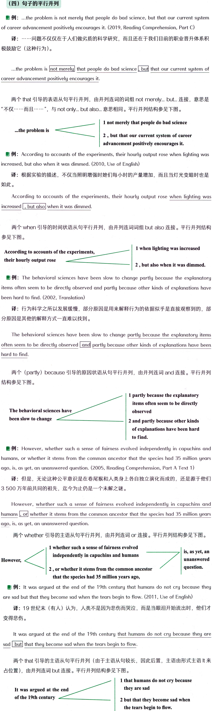

```text
（四）句子的平行并列
例: ..the problem is not merely that people do bad science, but that our current system
of career advancement positively encourages it. (2019, Reading Comprehension, Part C)
译：…·问题不仅仅在于人们做劣质的科学研究，而且还在于我们目前的职业晋升体系积
极鼓励它 （这种行为）。
...the problem is not merely that people do bad science  but that our current system of
career advancementpositively encourages it.
两个that引导的表语从句平行并列，由并列连词的词组notmerely...but..连接，意思是
“不仅....而且...."，与 not only...bout also...意思相同。平行并列结构参见下图。
1 not merely that people do bad science
...the problem is
2 , but that our current system of career
advancement positively encourages it.
例: According to accounts of the experiments, their hourly output rose when lighting was
increased, but also when it was dimmed. (2010, Use of English)
译：根据实验的描述，不仅当照明增强时她们每小时的产量增加，而且当灯光变暗时也是
如此。
According to accounts of the experiments, their hourly output rose when lighting was
increased , but alsowhen it was dimmed.
两个when引导的时间状语从句平行并列，由并列连词词组but also连接。平行并列结构
参见下图。
1 when lighting was increased
According to accounts of the experiments,
their hourly output rose
2 , but also when it was dimmed.
例：The behavioral sciences have been slow to change partly because the explanatory
items often seem to be directly observed and partly because other kinds of explanations have
been hard to find. (2002, Translation)
译：行为科学之所以发展缓慢，部分原因是用来解释行为的依据似乎是直接观察到的，部
分原因是其他的解释方式一直难以找到。
The behavioral sciences have been slow to change partly because the explanatory items
often seem to be directly observed and partly because other kinds of explanations have been
hard to find.
两个（partly）because 引导的原因状语从句平行并列，由并列连词 and 连接。平行并列
结构参见下图。
1 partly because the explanatory
itemsoftenseemtobedirectly
Thebehavioralscienceshave
observed
been slowto change
2andpartlybecauseotherkinds
of explanationshavebeenhard
to find.
例: However, whether such a sense of fairness evolved independently in capuchins and
humans,orwhether it stemsfrom the common ancestor that the specieshad 35 millionyears
ago, is, as yet, an unanswered question. (2005, Reading Comprehension, Part A Text 1)
译：但是，无论这种公平意识是在卷尾猴和人类身上各自独立演化而成的，还是源于他们
3 500万年前共同的祖先，迄今为止仍是一个未解之谜。
However,whether such a sense of fairness evolved independently in capuchins and
whetheritstemsfromthecommonancestorthatthespecieshad35millionyears
humans
or
ago,is,as yet,an unanswered question.
两个 whether引导的主语从句平行并列，由并列连词or 连接。平行并列结构参见下图。
1 whether such a sense of fairness evolved
is, as yet, an
independently in capuchins and humans
unanswered
However,
question.
2 , or whether it stems from the common ancestor
that the species had 35 million years ago,
 例: It was argued at the end of the 19th century that humans do not cry because they
are sad but that they become sad when the tears begin to flow. (2011, Use of English)
译：19世纪末（有人）认为，人类不是因为悲伤而哭泣，而是当眼泪开始流出时，他们才
变得悲伤。
It was argued at the end of the 19th century that humans do not cry because they are
but that they become sad when the tears begin to flow.
pps
两个that引导的主语从句平行并列（由于主语从句较长，因此后置，主语由形式主语lt来
占位置），由并列连词but连接。平行并列结构参见下图。
1 that humans do not cry because
they are sad
It was argued at the end
of the 19th century
2 but that they become sad when
the tears begin to flow.
```

### 【补充】有时一个句子中，会出现不止一处平行并列，如下。


```text
【补充】有时一个句子中，会出现不止一处平行并列，如下。
例: The development of the Elizabethan drama for the next twenty-five years is of
exceptional interest to students of literary history, for in this brief period we may trace the beginning
 growth  blossoming 
, and decay of many kinds of plays , and of many great careers.
(2018, Reading Comprehension, Part C)
译：文学历史研究者对此后25年间伊丽莎白时代戏剧的发展有着不寻常的兴趣，因为在
这一短暂时期内，我们可以追踪到众多戏剧和伟大事业的萌芽、成长、兴盛和衰退。
此句中出现了两处平行并列：一是逗号和 and连接的四个名词 beginning、growth、
blossoming、decay，跟在 we may trace 后 作 宾语；二 是 of many kinds of plays 和 of
many great careers 两个介词短语通过 and 连接，跟在名词 decay 后进行修饰限定。
 例: For the time  attention , and money of the art-loving public, classical instrumen-
not only with opera houses, dance troupes, theater companies, and
talists must compete
, but also with the recorded performances of the great classical musicians of the
museums
20th century. (2011, Reading Comprehension, Part A Text 1)
译：当下，为了（获得）艺术爱好者的时间、关注和金钱，古典乐器演奏家们不仅必须和
歌剧院、舞蹈团、剧团以及博物馆竞争，而且还必须和20世纪伟大的古典音乐家的演奏录制
品竞争。
此句中，出现了三处平行并列：一是介词for后面并列的三个名词（词组），由逗号和 and
连接；二是并列连词词组 not only...but also..连接的两个 with 介词短语；三是在 not only
with后面并列的四个名词词组，由逗号和and连接。也就是说在第二处“大平行”中包含了第
三处“小平行”。
```

### 【补充】并非所有的平行结构（并列结构）都有并列连词，有时没有并列连词；有时替


```text
【补充】并非所有的平行结构（并列结构）都有并列连词，有时没有并列连词；有时替
换成其他可以表示并列关系的词，但不是并列连词（例如 not、rather than、instead of 等）;
有时用分号连接句子表示并列。但是不变的特点是：平行并列的内容一定词性相同、形式
一致。
例: In 1998 immigrants were 9.8 percent of the population  in 1900, 13.6 percent.
(2006, Reading Comprehension, Part A Text 1)
译：在1998年，移民占（美国）人口的9.8%；在1900年，占13.6%。
此句中，虽然没有并列连词，但是有分号表示并列关系。同时前后的年份和百分数形式一
致，很容易判断出是平行并列。
例:You are now not wanted : you are now excluded from the work environment that
offers purpose and structure in your life. (2014, Reading Comprehension, Part A Text 1)
译：你现在不被需要；你现在被排除在为人们的生活提供目标和规划的工作环境之外。
此句中，虽然没有并列连词，但是有分号表示并列关系。同时前后两句话的形式一致，很
容易判断出是平行并列。
例: “Those first few days should be spent looking for work, not looking to sign on,” he
claimed. (2014, Reading Comprehension, Part A Text 1)
译：“最初几天应该用来找工作，而不是指望登记（申请津贴）。”他说道。
Those first few days should be spent looking for work , not looking to sign on...
此句中，虽然没有并列连词，但是有可以表示并列关系的词(虽然不是并列连词)
...not."，表示“（是）.…..…·而不是…..”。同时前后两个形式都是doing，惊人一致，很容易
判断出是平行并列。平行并列结构参见下图。
1 looking for work
Those first few days
shouldbe spent
2 , not looking to sign on...
真题演练
请在下列句子中找到平行结构，圈出并列连词或表示并列的标点，并用下划线
口座
标出平行并列的部分。
1. In addition, new digital technologies have allowed more rapid trading of equities, quicker use of
information, and thus shorter attention spans in financial markets. (2019, Reading Comprehension,
Part A Text 1)
2. The court's ruling is a step forward in the struggle against both corruption and official favoritism.
(2017, Reading Comprehension, Part A Text 4)
3. He must either sell some of his property or seek extra funds in the form of loans. (2000, Cloze Test)
4. Grammar, punctuation, and spelling can wait until you revise. (2008, Reading Comprehension, Part B)
5. But we are now knowledgeable enough to reduce many of the risks that threatened the existence
of earlier humans, and to improve the lot of those to come. (2013, Reading Comprehension, Part A
Text 3)
6. The point of a style upgrade isn't to become more vain or to spend more time fussing over what to
wear. (2016, Reading Comprehension, Part B)
7. Rather, it involves setting specific goals, obtaining immediate feedback and concentrating as much
on technique as on outcome. (2007, Reading Comprehension, Part A Text 1)
8. They began to believe that their way of doing business was failing, and that their incomes
would therefore shortly begin to fall as well. (2000, Reading Comprehension, Passage 1)
teaching them how to work. (2007, Reading Comprehension, Part B)
10. In one case, many researchers working around the ancient Maya city of Copan, Honduras,
have located hundreds of small rural villages and individual dwellings by using aerial
photographs and by making surveys on foot. (2014, Reading Comprehension, Part B)
11. It's the hardest thing to take care of a teenager, have a job, pay the rent, pay the car
payment, and pay the debt. (2008, Reading Comprehension, Part A Text 1)
12. He adds humbly that perhaps he was “superior to the common run of men in noticing
things which easily escape attention, and in observing them carefully". (2008, Reading
Comprehension, Part C)
13. As a result, the modern world is increasingly populated by intelligent gizmos whose
presence we barely notice but whose universal existence has removed much human labor.
(2002, Reading Comprehension, Part A Text 2)
14. However, there are still no forecasts for when faster-than-light travel will be available,
or when human cloning will be perfected, or when time travel will be possible. (2001, Reading
Comprehension, Part B)
15. A comparison of British geological publications over the last century and a half reveals not
simply an increasing emphasis on the primacy of research, but also a changing definition of what
constitutes an acceptable research paper. (2001, Reading Comprehension, Passage 1)
16. Music means different things to different people and sometimes even different things to the
same person at different moments of his life. (2014, Reading Comprehension, Part C)
17. Nobel Laureate and physiologist Albert Szent-Gyorgyi once described discovery as
"seeing what everybody has seen and thinking what nobody has thought". (2012, Reading
Comprehension, Part A Text 3)
18. The researchers mapped not only the city's vast and ornate ceremonial areas, but also
hundreds of simpler apartment complexes where common people lived. (2014, Reading
Comprehension, Part B)
19. Now the company is suddenly claiming that the 2002 agreement is invalid because of the
2006 legislation, and that only the federal government has regulatory power over nuclear
issues. (2012, Reading Comprehension, Part A Text 2)
20.Time was when biologists somewhat overworked the evidence that these creatures
preserve the health of game by killing the physically weak,or that they prey only on
"worthless” species. (2010, Reading Comprehension, Part C)
21. In an experiment published in 1988, social psychologist Fritz Strack of the University
ofWurzburg in Germany askedvolunteers toholdapeneitherwiththeir teeth—thereby
creating an artificial smile—-or with their lips,which would produce a disappointed expression.
(2011, Use of English)
22. The latest was a panel from the National Academy of Sciences,enlisted by the White
House, to tell us that the Earth's atmosphere is definitely warming and that the problem is
largely man-made. (2005, Reading Comprehension, Part A Text 2)
我是一条答案的分隔线，请先不要偷看呦！
1. In addition, new digital technologies have allowed more rapid trading of equities
quicker
thus shorter attention spans in financial markets. (2019, Reading
use of information , and
Comprehension, Part A Text 1)
译：此外，新的数字技术使得股票交易更迅速、信息利用更快捷，从而缩短了金融市场的
注意力持续时间。
2. The court's ruling is a step forward in the struggle against
corruption
and
official
both
favoritism. (2017, Reading Comprehension, Part A Text 4)
译：法院的判决是在反腐败和反官场偏袒斗争中取得的进步。
sell some of his property
3. He must
seek extra funds in the form of loans. (2000,
teither
lor
Cloze Test)
译：他必须出售一些自己的资产或是通过贷款的方式寻求额外的资金。
4. Grammar 
punctuation
spelling can wait until you revise. (2008, Reading
，and
Comprehension, Part B)
译：语法、标点符号和拼写可以等到你修改时（再考虑）。
5. But we are now knowledgeable enough to reduce many of the risks that threatened the
.andto improve the lot of those to come. (2013, Reading
existenceofearlierhumans
Comprehension,Part A Text 3)
译：但是我们现在已经有足够的知识去减少许多曾威胁早期人类生存的风险，并改善未来
人类的命运。
6. The point of a style upgrade isn't to become more vain ort
to spend more time fussing over
what to wear. (2016, Reading Comprehension, Part B)
译：形象升级不是为了变得更虚荣，也不是为了花更多的时间纠结穿什么。
7. Rather, it involves setting specific goals ,obtaining immediate feedback
concentrating
pup
as much on technique as on outcome. (2007, Reading Comprehension, Part A Text 1)
译：更确切地说，它包括设立明确的目标，获得即时的反馈，以及注意兼顾方法和结果。
8. They began to believe that their way of doing business was failing , and that their incomes
would therefore shortly begin to fall as well. (2000, Reading Comprehension, Passage 1)
译：他们开始相信他们的经营方式失败了，因此他们的收入也将急剧下降。
9. Teachers are responsible for teaching kids how to learn parents should be responsible for
teaching them how to work. (2007, Reading Comprehension, Part B)
译：教师负责教孩子如何学习，父母应该负责教他们如何工作。
10. In one case, many researchers working around the ancient Maya city of Copan, Honduras,
have located hundreds of small rural villages
individual dwellings by using aerial
pun
photographs and
by making surveys on foot. (2014, Reading Comprehension, Part B)
译：在一个案例中，许多研究者在洪都拉斯的科潘玛雅古城周边工作，（他们）发现了成
百上千的小村落和民宅，通过航空拍照和徒步勘察的方式。
11. It's the hardest thing to take care of a teenager
,have a job,pay the rent
pay the car
pay the debt. (2008, Reading Comprehension, Part A Text 1)
payment
pup
译：照顾一个十几岁的孩子、工作、付房租、付车款还有偿还债务，这是最艰难的事情。
12. He adds humbly that perhaps he was “superior to the common run of men in noticing
things which easily escape attention
in observing them carefully". (2008, Reading
,and
Comprehension, Part C)
译：他又自谦地说，或许自己“在注意到容易被忽略的事物，并对其加以仔细观察方面优
于常人”。
13. As a result, the modern world is increasingly populated by intelligent gizmos whose
presence we barely notice
whoseuniversal existencehasremovedmuchhuman labor.
but
(2002, Reading Comprehension, Part A Text 2)
译：结果，现代世界充斥着越来越多的智能装置，（尽管）我们几乎没有注意到它们的存
在，但它们的普遍存在已经解放了大量人类劳动力。
14.However,there arestill noforecastsfor whenfaster-than-light travel willbe available
when time travel will be possible.(2001,
when human cloning will be perfected |,or
，or
Translation)
译：然而，对于何时能够进行超光速旅行，何时人类克隆技术能够得以完善，何时可以进
行时间旅行，却依然没有预见。
15. A comparison of British geological publications over the last century and a half reveals
1ou
a changing definitionof
an increasing emphasis on the primacy of research
simply
,but also
what constitutes an acceptable.research paper. (2001, Reading Comprehension, Passage 1)
译：把英国最近一个半世纪的地质学刊物做比较，（人们）不仅揭示了研究的重要性越来
越受到重视，而且揭示了学术论文的出版标准也不断地发生变化。
pun
16. Music means different things to different people
sometimesevendifferentthingsto
the same person at different moments of his life. (2014, Reading Comprehension, Part C)
译：音乐对不同的人意味着不同的东西，有时甚至对同一个人而言，（音乐）在其生命的
不同时刻，意义也不尽相同。
17. Nobel Laureate and physiologist Albert Szent-Gyorgyi once described discovery as
"seeing what everybody has seen
thinking what nobody has thought.” (2012, Reading
and
Comprehension, Part A Text 3)
译：诺贝尔奖得主、生理学家阿尔伯特·森特-哲尔吉曾经将发现描述为“观察人人都看到
的，思考没人曾想到的”。
18. The researchers mapped |not only| the city's vast and ornate ceremonial areas,
but also
hundreds of simpler apartment complexes where common people lived. (2014, Reading
Comprehension, Part B)
译：研究者不仅测绘了整个城市广华丽的仪式区域，还测绘了数百处较为简朴的住宅
群，普通人在此居住。
19. Now the company is suddenly claiming that the 2002 agreement is invalid because of the
2006legislation
, and| that only the federal government has regulatory power over nuclear
issues. (2012, Reading Comprehension, Part A Text 2)
译：现在该公司突然声称，由于2006年的立法，2002年的协议是无效的，且只有联邦政府
对核问题有监管权。
20. Time was when biologists somewhat overworked the evidence that these creatures
preserve the health of game by killing the physically weak
，or
thattheypreyonlyon
"worthless” species. (2010, Reading Comprehension, Part C)
译：曾经有段时间，生物学家或多或少滥用了一种证据，即这些生物通过杀死体弱者来保
持种群的健康，或者说它们仅仅捕食“没有价值的”物种。
21. In an experiment published in 1988, social psychologist Fritz Strack of the University of
Wurzburg in Germany asked volunteers to hold a pen 
r with their teeth—thereby creating
either
an artificial smile——orv
with their lips, which would produce a disappointed expression. (2011,
Use of English)
译：在一项1988年发表的实验中，德国维尔茨堡大学的社会心理学家弗里茨·斯特拉克
让志愿者或用牙齿咬住笔来制造一种假笑，或是用嘴唇抿住笔来产生一种失望的表情。
22. The latest was a panel from the National Academy of Sciences, enlisted by the White
House, to tell us that the Earth's atmosphere is definitely warming
that the problem is
pup
largely man-made. (2005, Reading Comprehension, Part A Text 2)
组，（他们）想告诉我们，地球气候毫无疑问正在变暖，而且这个问题主要是人为造成的。
考场攻略
分裂、嵌套和平行三大特殊结构的长难句都在考研真题中经常考查，因此建议
重点掌握，但要注意不同的特殊结构的长难句有不同的解决之道。
攻略1：解决分裂结构的关键是还原成连贯
解决分裂结构的关键就是先要把分裂的部分找到，然后把句子还原成原本连贯的
形式，再进行长难句分析。一般情况下，分裂结构的前后常常会出现成对的逗号、破
折号或括号，可以在极大程度上帮助同学们找到分裂结构。
 例: Bob Liodice, the chief executive of the Association of National Advertisers,
says consumers will be worse off if the industry cannot collect information about their
preferences. (2013, Reading Comprehension, Part A Text 2)
译：（美国）国家广告商协会首席执行官鲍勃·利奥狄斯称，如果（广告）行业不
能收集他们（消费者）的偏好信息，消费者的情况会更糟。
 例: Yet these creatures are members of the biotic community and, if its stability
depends on its integrity, they are entitled to continuance. (2010, Translation)
译：然而，这些生物都是生物群落中的成员，而且如果该群落的稳定性取决于其
完整性，那么它们（群落里的生物）就有权生存下去。
如上两句中，下划线的部分是造成分裂结构的同位语或状语从句，可以先不看，
先把余下的句子前后连贯起来看懂后，然后再看造成分裂的这部分。
攻略2：解决嵌套结构的关键是分层次
嵌套结构，无非就是大句子套小句子，所以想看懂一定要分层次。首先，正常断
开长难句；然后按照层次由外向内（或由内向外），逐层看懂句意。
 例: If we are serious about ensuring that our science is both meaningful and
reproducible, we must ensure that our institutions incentivise that kind of science.
(2019, Reading Comprehension, Part C)
译：如果我们真想保证我们的科研既有意义又可复制，就必须确保我们的体制能
激励这样的科研。
先通过连接词和分析主谓断开句子，然后再从最外圈的主句开始，一层层向内，
逐层看懂每个从句。（详解见P224）
If we are serious about ensuringthat our science is..we must ensure that our institutions incentivise...
宾语从句
主句
宾语从句
条件状语从句
攻略3：解决平行结构的关键是理清多个并列
平行结构，就是多个词、词组或句子并列在一起，共同作一个成分。平行结构最
大的特点是：平行并列的各个成分间词性相同且形式一致，并且通常有并列连词（和
逗号）连接。因此，根据其特点，我们可以通过三步搞定平行结构。
1）先找到并列连词;
2）“往后看”，确定平行并列的成分是什么词性或什么形式；
3）“往前找”，找到与之相同的词性或一致的形式，则找到平行并列的各个成分。
例: Simply arranging a meeting, making a phone call, or hosting an event is not 
an “official act." (2017, Reading Comprehension, Part A Text 4)
译：仅仅安排一次见面、打一个电话或举办一个活动都不算“公务行为”。
按照三步法分析，第一步先找到并列连词or；然后第二步往后看，找到平行
的成分应该是hosting（doing）这种形式的；最后再往前找相同的成分，就找到了
arranging 和 making，所以此句中就是三个 doing 平行并列作主语，通过逗号和并列
连词 or 连接在一起。平行结构可以整理为下图。
 1 Simply arranging a meeting
2, making a phone call
is not an “official act."
3, or hosting an event
攻略4：考研真题逢长难句处必出题
考研真题中，逢长难句处必出题，尤其是在阅读和翻译中。例如2005年阅读
Text4第38题中，B、C、D三个选项都是针对同一个长难句设置的，只不过每个选
项针对的是句子的不同部分。之所以针对这个长难句出题，是因为它不仅仅包含普通
的主句和从句，还有出现长难句的特殊结构一一分裂结构，而且还出现了插入式和后
移式两种分裂结构，这种特殊结构的长难句就加大了理解句子的难度，自然就很值得
出题来考查。咱们先来看一下原文中的这个长难句。
例: 【段 4】 ③ As a linguist, he acknowledges that all varieties of human language,
including non-standard ones like Black English, can be powerfully expressive-—there
exists no language or dialect in the world that cannot convey complex ideas. (2005,
Reading Comprehension, Part A Text 4)
译：作为语言学家，他承认各种各样的人类语言，包括像黑人英语这样的非标准
语言，都具有强大的表达力一一世界上没有表达不了复杂思想的语言或方言。
分析：如上句子中，根据标点破折号可以先把句子断开为前后两部分，破折号后
引出的是对前面内容的进一步解释说明。句中的第一个逗号，前面隔开的是词组而不
是句子，所以不能用来断开。第二个和第三个逗号，中间隔开的是插入语，造成了句
子的分裂，这是本句中的第一个分裂结构（插入式）。破折号之前的句子，可以通过连
接词 that 断开，前一半是主句，that 开始是宾语从句，跟在及物动词 acknowledges
后。破折号之后的句子，可以通过连接词that断开，that引出的是定语从句，但它并
没有就近修饰前面的名词，而是修饰了名词词组 no language or dialect，由于名词词
组后有介词短语intheworld和that定语从句同时修饰，所以较长的定语从句往后放，
就与它所修饰的名词词组分裂开了，这是本句中的第二个分裂结构（后移式）。
图解如下：
[句 1】 As a linguist, he acknowledges
```

### 【句 2】 that all varieties of human language, including non-standard ones like

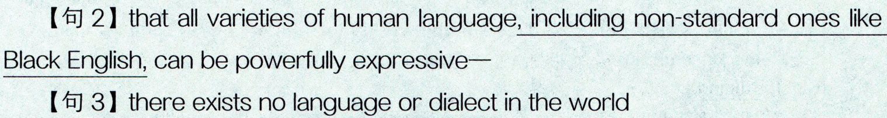

```text
【句 2】 that all varieties of human language, including non-standard ones like
Black English, can be powerfully expressive—
[句 3】 there exists no language or dialect in the world
```

### 【句 4】 that cannot convey complex ideas.

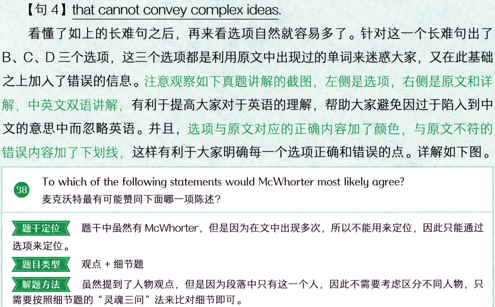

```text
【句 4】 that cannot convey complex ideas.
看懂了如上的长难句之后，再来看选项自然就容易多了。针对这一个长难句出了
B、C、D三个选项，这三个选项都是利用原文中出现过的单词来迷惑大家，又在此基础
之上加入了错误的信息。注意观察如下真题讲解的截图，左侧是选项，右侧是原文和详
解，中英文双语讲解，有利于提高大家对于英语的理解，帮助大家避免因过于陷入到中
文的意思中而忽略英语。并且，选项与原文对应的正确内容加了颜色，与原文不符的
错误内容加了下划线，这样有利于大家明确每一个选项正确和错误的点。详解如下图。
To which of the following statements would McWhorter most likely agree?
麦克沃特最有可能赞同下面哪一项陈述？
题干中虽然有McWhorter，但是因为在文中出现多次，所以不能用来定位，因此只能通过
题干定位
选项来定位。
题目类型
观点+细节题
解题方法
虽然提到了人物观点，但是因为段落中只有这一个人，因此不需要考虑区分不同人物，只
需要按照细节题的“灵魂三问”法来比对细节即可。
```

### 【段4】 ④He is not arguing... that we can no longer think

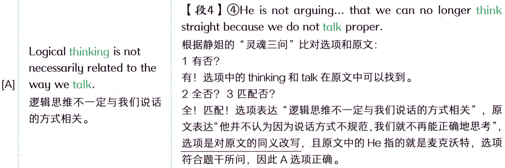

```text
【段4】 ④He is not arguing... that we can no longer think
straightbecause we do not talk proper.
根据静姐的“灵魂三问”比对选项和原文：
Logical thinking is not
1有否？
necessarily related tothe
有！选项中的 thinking和talk在原文中可以找到。
[A]
way we talk.
2全否？3匹配否？
逻辑思维不一定与我们说话
全！匹配！选项表达“逻辑思维不一定与我们说话的方式相关”，原
的方式相关。
文表达“他并不认为因为说话方式不规范，我们就不再能正确地思考”，
选项是对原文的同义改写，且原文中的He指的就是麦克沃特，选项
符合题干所问，因此A选项正确。
```

### 【段4】 ③As a linguist, he acknowledges that all varieties

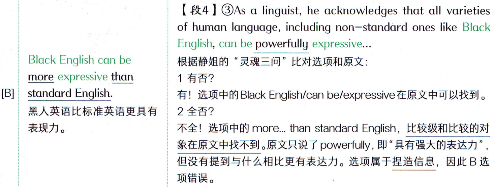

```text
【段4】 ③As a linguist, he acknowledges that all varieties
of human language, including non-standard ones like Black
English, can be powerfully expressive...
Black English can be
根据静姐的“灵魂三问”比对选项和原文：
more expressive than
1有否?
standard English.
有！选项中的BlackEnglish/can be/expressive在原文中可以找到。
[B]
黑人英语比标准英语更具有
2全否？
表现力。
不全！选项中的 more...than standard English，比较级和比较的对
象在原文中找不到。原文只说了powerfully，即“具有强大的表达力”，
但没有提到与什么相比更有表达力。选项属于捏造信息，因此B选
项错误。
```

### 【段4】 ③As a linguist, he acknowledges that all varieties

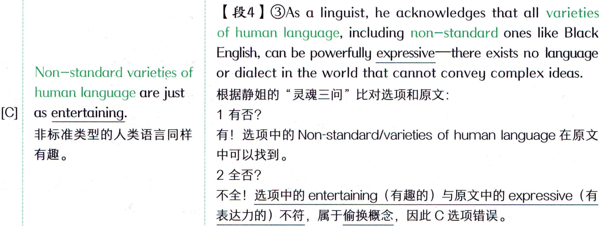

```text
【段4】 ③As a linguist, he acknowledges that all varieties
of human language, including non-standard ones like Black
English, can be powerfully expressive—there exists no language
Non-standard varieties of
or dialect in the world that cannot convey complex ideas.
human language are just
根据静姐的“灵魂三问”比对选项和原文：
as entertaining.
1有否？
[C]
有！选项中的Non-standard/varieties of humanlanguage在原文
非标准类型的人类语言同样
有趣。
中可以找到。
2全否？
不全！选项中的entertaining（有趣的）与原文中的expressive（有
表达力的）不符，属于偷换概念，因此C选项错误。
```

### 【段4】 ③As a linguist, he acknowledges that all varieties

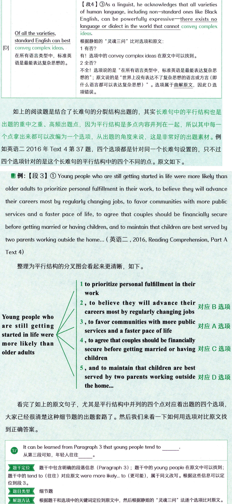

```text
【段4】 ③As a linguist, he acknowledges that all varieties
of human language, including non-standard ones like Black
English, can be powerfully expressive—there exists no
language or dialect in the world that cannot convey complex
Of all the varieties,
ideas.
standard English can best
根据静姐的“灵魂三问”比对选项和原文：
convey complex ideas.
1有否？
[D]
在所有语言类型中，标准英
有！选项中的 convey complex ideas 在原文中可以找到。
2全否?
语是最能表达复杂思想的。
不全！选项说的是“在所有语言类型中，标准英语是最能表达复杂思
想的”；原文说的是“世界上没有表达不了复杂思想的语言或方言（即
什么语言都可以表达复杂思想）”。选项属于曲解原文，因此D选
项错误。
如上的阅读题是结合了长难句的分裂结构出题的，其实长难句中的平行结构也是
出题的重中之重、高频出题点，因为平行结构是多点内容并列在一起，所以其中每一
个点拿出来都可以改编为一个选项，从出题的角度来说，这是非常好的出题素材。例
如英语二2016 年Text 4 第 37 题，四个选项都是针对同一个长难句设置的，只不过
四个选项针对的是这个长难句的平行结构中的四个不同的点。原文如下。
 例: 【段 3】 ① Young people who are still getting started in life were more likely than
older adults to prioritize personal fulfillment in their work, to believe they will advance
their careers most by regularly changing jobs, to favor communities with more public
services and a faster pace of life, to agree that couples should be financially secure
before getting married or having children, and to maintain that children are best served by
two parents working outside the home... ( 英语二 , 2016, Reading Comprehension, Part A
Text 4)
整理为平行结构的分叉图会看起来更清晰，如下。
1 to prioritize personal fulfillment in their
work
2, to believe they will advance their
对应B选项
careers most by regularly changing jobs
Young people who
3,to favor communities with more public
are still getting
对应A选项
services and a faster pace of life
started in life were
4 , to agree that couples should be financially
more likely than
secure before getting married or having 对应 C 选项
older adults
children
5,and to maintain that children are best
served by two parents working outside 对应 D选项
the home...
看完了如上的原文句子，尤其是平行结构中并列的四个点对应着出题的四个选项，
大家已经很清楚这种细节题的出题套路了。然后我们来看一下如何用选项对比原文找
到正确答案。
ItcanbelearnedfromParagraph3thatyoungpeopletendto
从第三段可知，年轻人往往
题干定位
题干中包含明确的段落信息（Paragraph3）；题干中的youngpeople在原文中可以找到;
题干中的tend to（往往）对应原文were more likely...to（更可能），属于同义改写。根据这些信息可以定
位到段3。
题目类型
细节题
解题方法
根据题干和选项中的关键词定位到原文中，然后根据静姐的“灵魂三问”法逐个选项比对原文。
```

### 【 段3 】  ①Young people... were more likely.. to believe they

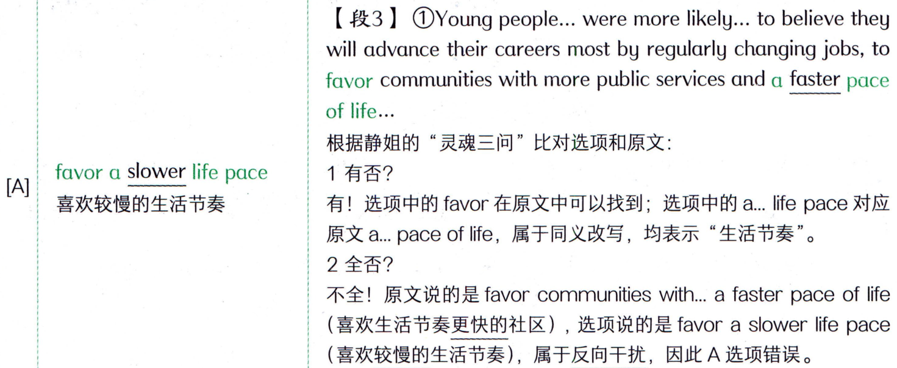

```text
【 段3 】  ①Young people... were more likely.. to believe they
will advance their careers most by regularly changing jobs,to
favor communities with more public services and a faster pace
of life...
根据静姐的“灵魂三问”比对选项和原文：
favor a slower life pace
1有否？
[A]
有！选项中的 favor在原文中可以找到；选项中的 a...life pace 对应
喜欢较慢的生活节奏
原文a...pace of life，属于同义改写，均表示“生活节奏”。
2全否？
不全！原文说的是favorcommunitieswith.a fasterpaceof life
（喜欢生活节奏更快的社区），选项说的是favora slower lifepace
（喜欢较慢的生活节奏），属于反向干扰，因此A选项错误。
```

### 【 段3 】 ①Young people... were more likely.. to believe they

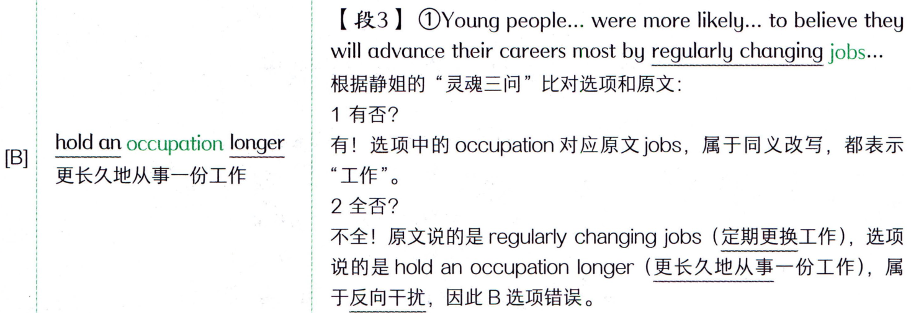

```text
【 段3 】 ①Young people... were more likely.. to believe they
will advance their careers most by regularly changing jobs...
根据静姐的“灵魂三问”比对选项和原文：
1有否？
hold an occupation longer
有！选项中的 occupation 对应原文jobs，属于同义改写，都表示
[B]
“工作”。
更长久地从事一份工作
2全否？
不全！原文说的是regularly changing jobs（定期更换工作），选项
说的是hold an occupation longer（更长久地从事一份工作），属
于反向干扰，因此B选项错误。
```

### 【段3 】①Young people... were more likely... to agree that


```text
【段3 】①Young people... were more likely... to agree that
couples should be financially secure before getting married or
having children...
根据静姐的“灵魂三问”比对选项和原文：
1有否？
有！选项中的pre-marital对应原文中的before getting married,
attach importanceto
finance 对应原文中的financially，属于同义改写。
pre-marital finance
[C]
2全否？3匹配否？
重视婚前财务状况
全！匹配！原文句①指出Young people... were more likely... to
agree that couples should be financially secure before getting
married（年轻人....更可能...赞成夫妻在结婚前应该有经济保
障)，即 young people tend to attach importance to pre-marital
finance（年轻人往往重视婚前财务状况），题干+选项是对原文
句①的同义改写，因此C选项正确。
```

### 【段3】①Young people who are still getting started in


```text
【段3】①Young people who are still getting started in
life were more likely than older adults to prioritize personal
fulfillment in their work... and to maintain that children are
best served by two parents working outside the home,the
survey found.
根据静姐的“灵魂三问”比对选项和原文：
givepriority to childcare
1有否？
outside thehome
[D]
有！选项中的outsidethehome在原文中可以找到；选项中的
优先考虑在外面托管孩子
priority（优先级）对应原文中的prioritize（优先考虑），属于同
义改写。
2全否？
不全！原文中prioritize（优先考虑）的对象是“在工作中的个人成
就感”，而不是选项中的“在外面托管孩子”；且原文outsidethe
home修饰的是“工作的父母”，并没有提到选项中的childcare
（照顾孩子)。选项属于拼凑原文+捏造信息，因此D选项错误。
难点
注意长难句：阅读的长难句最易出题，尤其像本题对应的原文中的平行结构，是细节题最常见的出题点。
根据如上的这道题，不难发现：看懂了长难句，再结合阅读中要讲解的解题方法
“灵魂三问”，就可以轻松地看懂文章、做对题啦！
并且，上图出自“田静讲真题”的真题书课包，这套真题书课包专门采用多色印
刷，每个选项中正确和错误的内容都会通过红蓝两色比对（红色代表选项与原文对应
的正确内容，蓝色代表选项与原文不符的错误内容），并且橙色标注题干定位信息，黄
色背景色标注主要的正误原因，这样更加一目了然，化繁为简。快来跟住静姐学习
“田静讲真题”，做到“零笔记”轻松学习！
最强
到此，《句句真研》所有的讲解内容就都结束了，但是别忘了后面还有长难句的每
日一句，记得要每天练习，巩固提升哦！关于长难句每日一句的讲解，同学们可以关注
和答疑互动陪伴大家。
大家一路跟着我学完了《句句真研》考研语法和长难句的全部内容，辛苦了！远程
给大家一个抱抱！接下来大家还有个重要的任务要完成，才能一战成硕、高分上岸，那
就是要跟住静姐接着学真题、学阅读·.…·
“田静讲真题”系列书课包：中英文双语讲解的真题书，不同颜色标记定位信息和
正误原因，让你可以轻松地实现“零笔记”学习，所有的课前预习、课中学习和课
后复习的内容我都帮你准备好了，考研英语真题“一站式”解决方案。
《田静讲阅读》：所有阅读题型和解题方法帮你全部梳理清楚，最关键的是我会站
在出题的角度上给大家讲解题目设置，尤其是正确选项和错误选项的出题“套路”，
了解了套路之后才能“反套路”，阅读提分更精准高效。
还等什么，赶紧跟住静姐吧！
我会陪伴大家的考研全程，直到上岸！一起加油！
微信扫码
静姐长难句每日一句等你打卡
```
