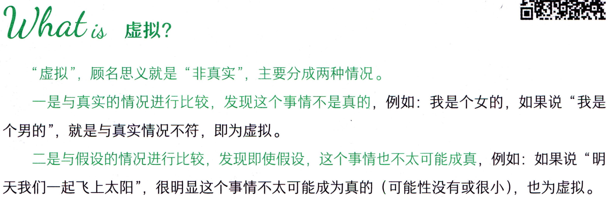
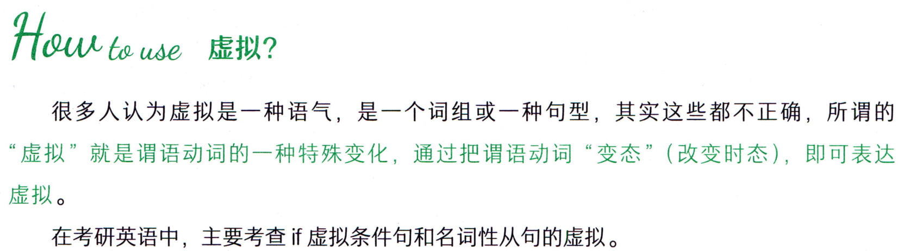
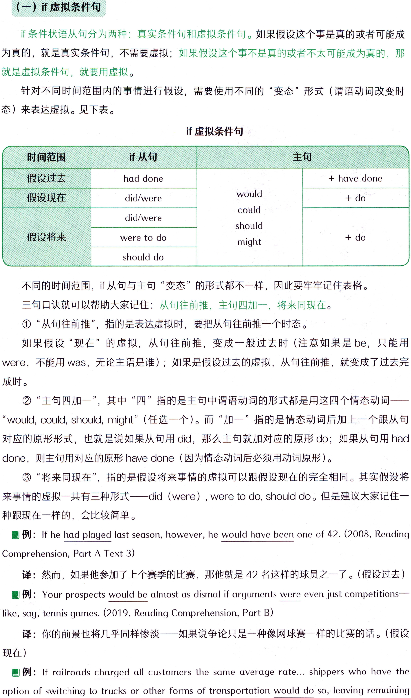
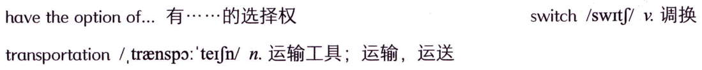
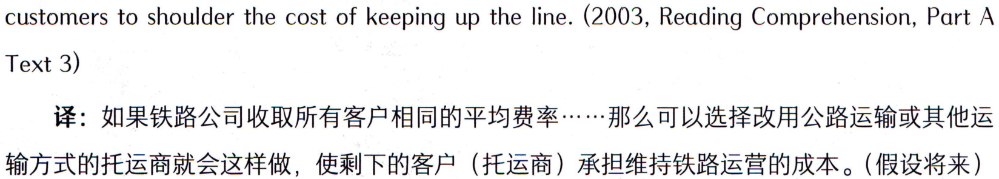
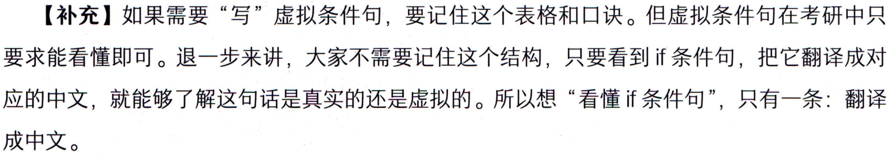
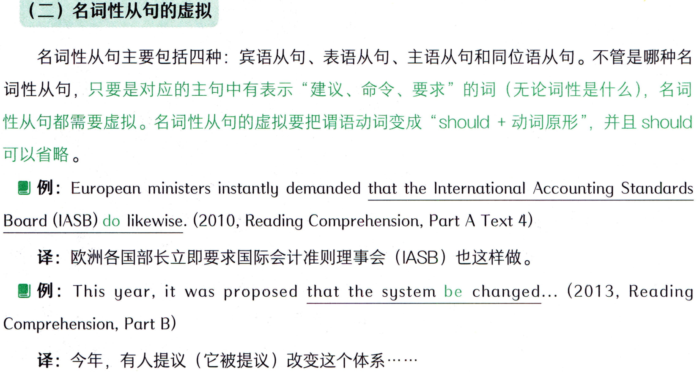

# 第一节 虚拟

## Whatis 虚拟?



```text
Whatis 虚拟?
“虚拟”，顾名思义就是“非真实”，主要分成两种情况。
一是与真实的情况进行比较，发现这个事情不是真的，例如：我是个女的，如果说“我是
个男的”，就是与真实情况不符，即为虚拟。
二是与假设的情况进行比较，发现即使假设，这个事情也不太可能成真，例如：如果说“明
天我们一起飞上太阳”，很明显这个事情不太可能成为真的（可能性没有或很小)，也为虚拟。
```

## Hou to use 虚拟?



```text
Hou to use 虚拟?
很多人认为虚拟是一种语气，是一个词组或一种句型，其实这些都不正确，所谓的
“虚拟”就是谓语动词的一种特殊变化，通过把谓语动词“变态”（改变时态），即可表达
虚拟。
在考研英语中，主要考查if虚拟条件句和名词性从句的虚拟。
```

### （一）if虚拟条件句



```text
（一）if虚拟条件句
if条件状语从句分为两种：真实条件句和虚拟条件句。如果假设这个事是真的或者可能成
为真的，就是真实条件句，不需要虚拟；如果假设这个事不是真的或者不太可能成为真的，那
就是虚拟条件句，就要用虚拟。
针对不同时间范围内的事情进行假设，需要使用不同的“变态”形式（谓语动词改变时
态）来表达虚拟。见下表。
if虚拟条件句
主句
if从句
时间范围
假设过去
+ have done
had done
would
+ do
did/were
假设现在
could
did/were
should
假设将来
were to do
+ do
might
should do
不同的时间范围，if从句与主句“变态”的形式都不一样，因此要牢牢记住表格。
三句口诀就可以帮助大家记住：从句往前推，主句四加一，将来同现在。
①“从句往前推”，指的是表达虚拟时，要把从句往前推一个时态。
如果假设“现在”的虚拟，从句往前推，变成一般过去时（注意如果是be，只能用
were，不能用was，无论主语是谁）；如果是假设过去的虚拟，从句往前推，就变成了过去完
成时。
②“主句四加一”，其中“四”指的是主句中谓语动词的形式都是用这四个情态动词
“would,could,should,might”（任选一个）。而“加一”指的是情态动词后加上一个跟从句
对应的原形形式，也就是说如果从句用did，那么主句就加对应的原形do；如果从句用had
done，则主句用对应的原形have done（因为情态动词后必须用动词原形）。
③“将来同现在”，指的是假设将来事情的虚拟可以跟假设现在的完全相同。其实假设将
来事情的虚拟一共有三种形式——did（were），were to do,should do。但是建议大家记住一
种跟现在一样的，会比较简单。
例: If he had played last season, however, he would have been one of 42. (2008, Reading
Comprehension,Part A Text 3)
译：然而，如果他参加了上个赛季的比赛，那他就是42名这样的球员之一了。（假设过去)
例: Your prospects would be almost as dismal if arguments were even just competitions
like, say, tennis games. (2019, Reading Comprehension, Part B)
译：你的前景也将几乎同样惨淡一—如果说争论只是一种像网球赛一样的比赛的话。（假设
现在)
例:If railroads charged all customers the same average rate...shippers who have the
option of switching to trucks or other forms of transportation would do so, leaving remaining
```

#### 词汇表



```text
have the option of...有.....的选择权
switch/switf/v.调换
transportation/.traenspo:'terjn/n.运输工具；运输，运送
```

#### 概述



```text
customers to shoulder the cost of keeping up the line. (2003, Reading Comprehension, Part A
Text 3)
译：如果铁路公司收取所有客户相同的平均费率·…那么可以选择改用公路运输或其他运
输方式的托运商就会这样做，使剩下的客户（托运商）承担维持铁路运营的成本。（假设将来)
```

### 【补充】如果需要“写”虚拟条件句，要记住这个表格和口诀。但虚拟条件句在考研中只



```text
【补充】如果需要“写”虚拟条件句，要记住这个表格和口诀。但虚拟条件句在考研中只
要求能看懂即可。退一步来讲，大家不需要记住这个结构，只要看到if条件句，把它翻译成对
应的中文，就能够了解这句话是真实的还是虚拟的。所以想“看懂if条件句”，只有一条：翻译
成中文。
```

### （二）名词性从句的虚拟



```text
（二）名词性从句的虚拟
名词性从句主要包括四种：宾语从句、表语从句、主语从句和同位语从句。不管是哪种名
词性从句，只要是对应的主句中有表示“建议、命令、要求”的词（无论词性是什么），名词
性从句都需要虚拟。名词性从句的虚拟要把谓语动词变成“should+动词原形”，并且should
可以省略。
例: European ministers instantly demanded that the International Accounting Standards
Board (IASB) do likewise. (2010, Reading Comprehension, Part A Text 4)
译：欧洲各国部长立即要求国际会计准则理事会（IASB）也这样做。
例: This year, it was proposed that the system be changed... (2013, Reading
Comprehension, Part B)
译：今年，有人提议（它被提议）改变这个体系·……
```
