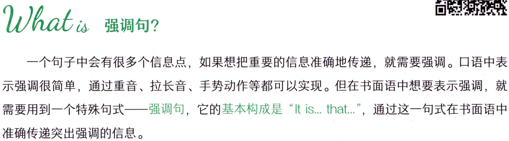
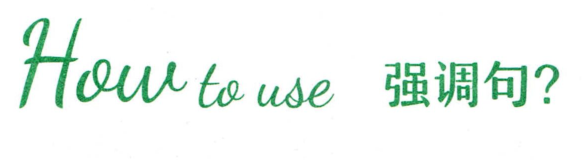
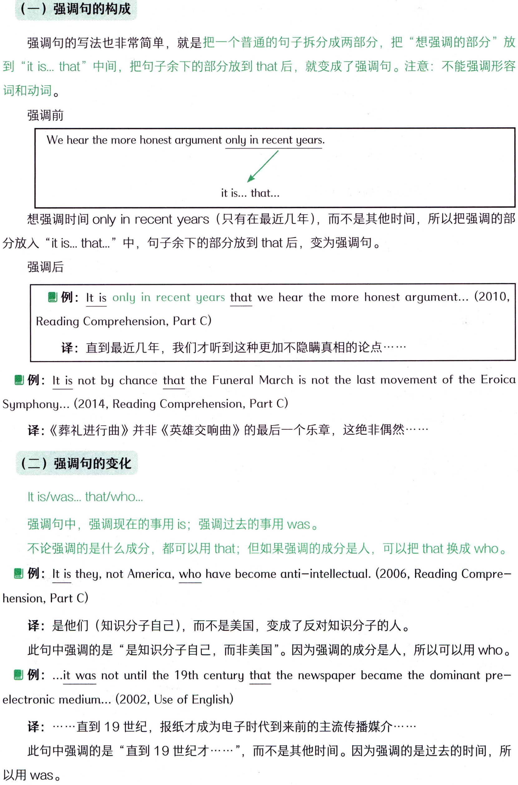
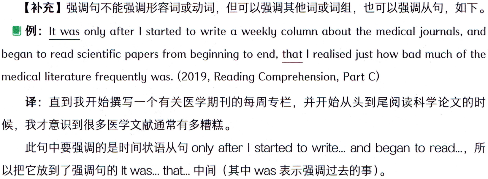
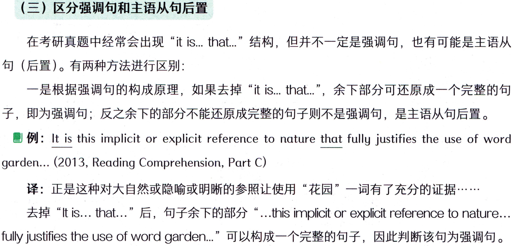
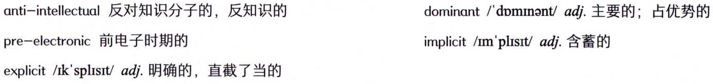
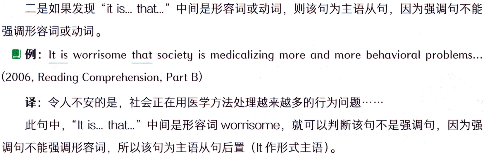
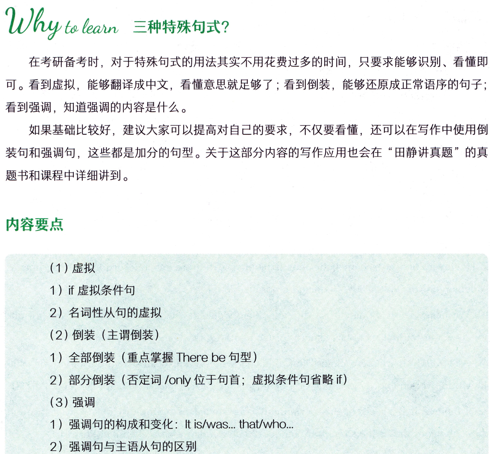
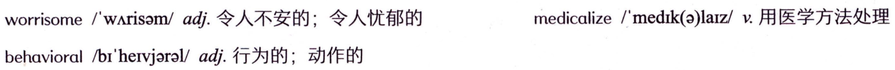
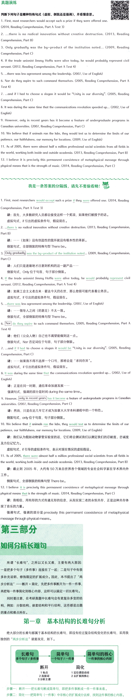

# 第三节 强调

## Whatis 强调句?



```text
Whatis 强调句?
一个句子中会有很多个信息点，如果想把重要的信息准确地传递，就需要强调。口语中表
示强调很简单，通过重音、拉长音、手势动作等都可以实现。但在书面语中想要表示强调，就
需要用到一个特殊句式——强调句，它的基本构成是“ltis.that..”，通过这一句式在书面语中
准确传递突出强调的信息。
```

## Houto use 强调句?



```text
Houto use 强调句?
```

### （一）强调句的构成



```text
（一）强调句的构成
强调句的写法也非常简单，就是把一个普通的句子拆分成两部分，把“想强调的部分”放
到“itis...that”中间，把句子余下的部分放到that后，就变成了强调句。注意：不能强调形容
词和动词。
强调前
We hear the more honest argument only in recent years.
it is... that...
想强调时间only inrecent years（只有在最近几年），而不是其他时间，所以把强调的部
分放入“it is..that..”中，句子余下的部分放到 that后，变为强调句。
强调后
例: It is only in recent years that we hear the more honest argument... (2010,
Reading Comprehension, Part C)
译：直到最近几年，我们才听到这种更加不隐瞒真相的论点.
例: It is not by chance that the Funeral March is not the last movement of the Eroica
Symphony... (2014, Reading Comprehension,Part C)
译：《葬礼进行曲》并非《英雄交响曲》的最后一个乐章，这绝非偶然·
强调句的变化
It is/was... that/who...
强调句中，强调现在的事用is；强调过去的事用waS。
不论强调的是什么成分，都可以用 that；但如果强调的成分是人，可以把 that换成 who。
例: It is they, not America, who have become anti-intellectual. (2006, Reading Compre-
hension, Part C)
译：是他们（知识分子自己)，而不是美国，变成了反对知识分子的人。
此句中强调的是“是知识分子自己，而非美国”。因为强调的成分是人，所以可以用who。
例: ..it was not until the 19th century that the newspaper became the dominant pre-
electronic medium... (2002, Use of English)
译：.…·直到19世纪，报纸才成为电子时代到来前的主流传播媒介……
此句中强调的是“直到19世纪才….”，而不是其他时间。因为强调的是过去的时间，所
以用was。
```

### 【补充】强调句不能强调形容词或动词，但可以强调其他词或词组，也可以强调从句，如下。



```text
【补充】强调句不能强调形容词或动词，但可以强调其他词或词组，也可以强调从句，如下。
例: It was only after I started to write a weekly column about the medical journals, and
began to read scientific papers from beginning to end, that I realised just how bad much of the
medical literature frequently was. (2019, Reading Comprehension, Part C)
译：直到我开始撰写一个有关医学期刊的每周专栏，并开始从头到尾阅读科学论文的时
候，我才意识到很多医学文献通常有多糟糕。
此句中要强调的是时间状语从句 only after | started to write..： and began to read..，所
以把它放到了强调句的Itwas...that...中间（其中was表示强调过去的事）。
```

### （三）区分强调句和主语从句后置



```text
（三）区分强调句和主语从句后置
在考研真题中经常会出现“itis...that..”结构，但并不一定是强调句，也有可能是主语从
句（后置）。有两种方法进行区别：
一是根据强调句的构成原理，如果去掉“itis...that...”，余下部分可还原成一个完整的句
子，即为强调句；反之余下的部分不能还原成完整的句子则不是强调句，是主语从句后置。
例: It is this implicit or explicit reference to nature that fully justifies the use of word
garden... (2013, Reading Comprehension, Part C)
译：正是这种对大自然或隐喻或明晰的参照让使用“花园”一词有了充分的证据·…·.…
去掉“It is... that...”后，句子余下的部分“...this implicit or explicit reference to nature...
fully justifies the useofwordgarden.”可以构成一个完整的句子，因此判断该句为强调句。
```

#### 词汇表



```text
anti-intellectual反对知识分子的，反知识的
dominant/dpmimant/adj.主要的；占优势的
pre-electronic 前电子时期的
implicit/m'plisit/adj.含蓄的
explicit/ik'splist/adj.明确的，直截了当的
```

#### 概述



```text
二是如果发现“it is..that..”中间是形容词或动词，则该句为主语从句，因为强调句不能
强调形容词或动词。
 例: It is worrisome that society is medicalizing more and more behavioral problems...
(2006, Reading Comprehension, Part B)
译：令人不安的是，社会正在用医学方法处理越来越多的行为问题·…·
此句中，“Itis...that..”中间是形容词worrisome，就可以判断该句不是强调句，因为强
调句不能强调形容词，所以该句为主语从句后置（It作形式主语）。
```

## Why telain 三种特殊句式?



```text
Why telain 三种特殊句式?
在考研备考时，对于特殊句式的用法其实不用花费过多的时间，只要求能够识别、看懂即
可。看到虚拟，能够翻译成中文，看懂意思就足够了；看到倒装，能够还原成正常语序的句子;
看到强调，知道强调的内容是什么。
如果基础比较好，建议大家可以提高对自己的要求，不仅要看懂，还可以在写作中使用倒
装句和强调句，这些都是加分的句型。关于这部分内容的写作应用也会在“田静讲真题”的真
题书和课程中详细讲到。
内容要点
(1) 虚拟
1）if虚拟条件句
2）名词性从句的虚拟
（2）倒装（主谓倒装）
1）全部倒装（重点掌握Therebe句型）
2）部分倒装（否定词/only位于句首；虚拟条件句省略if）
(3）强调
1）强调句的构成和变化：Itis/was...that/who...
2）强调句与主语从句的区别
```

#### 词汇表



```text
medicalize/medik(a)laiz/v.用医学方法处理
worrisome/wArisam/adj.令人不安的；令人忧郁的
behavioral/br'hervjaral/adj.行为的；动作的
```

#### 概述



```text
真题演练
判断下列句子是哪种特殊句式（虚拟、倒装还是强调），并看懂意思。
1. First, most researchers would accept such a prize if they were offered one.
(2014, Reading Comprehension, Part A Text 3)
2. ...there is no radical innovation without creative destruction. (2013, Reading
Comprehension, Part B)
3. Only gradually was the by-product of the institution noted... (2009, Reading
Comprehension, Part C)
4. If the trade unionist Jimmy Hoffa were alive today, he would probably represent civil
servant. (2012, Reading Comprehension, Part A Text 4)
5. ...there was less agreement among the leadership. (2007, Use of English)
6. Nor do they aspire to such command themselves. (2005, Reading Comprehension, Part A
Text 4)
7. ...and if I had to choose α slogan it would be “Unity in our diversity". (2005, Reading
Comprehension, Part C)
8. It was during the same time that the communications revolution speeded up... (2002, Use of
English)
9. However, only in recent years has it become a feature of undergraduate programs in
Canadian universities. (2007, Reading Comprehension, Part C)
10. We believe that if animals ran the labs, they would test us to determine the limits of our
patience, our faithfulness, our memory for locations. (2009, Use of English)
11. As of 2005, there were almost half a million professional social scientists from all fields in
the world, working both inside and outside academia. (2013, Reading Comprehension, Part B)
12. I believe it is precisely this permanent coexistence of metaphysical message through
physical means that is the strength of music. (2014, Reading Comprehension, Part C)
我是一条答案的分隔线，请先不要偷看呦！
1. First, most researchers would accept such a prize if they were offered one. (2014, Reading
Comprehension, Part A Text 3)
译：首先，大多数研究人员都会接受这样一个奖项，如果他们被授予的话。
虚拟句式，if引出的虚拟条件句，假设现在。
2. ..there is no radical innovation without creative destruction. (2013, Reading Comprehension,
Part B)
译：…（如果）没有创造性的毁坏就没有根本性的革新。
倒装句式，全部倒装的特殊句型 There be。
Only gradually
was the by-product of the institution noted.. (2009, Reading Comprehension,
Part C)
译：人们只是逐渐地才注意到机构的这一副产品·.
倒装句式，Only 位于句首，句子部分倒装。
4. lf the trade unionist Jimmy Hoffa were alive today, he would probably represent civil
servant. (2012, Reading Comprehension, Part A Text 4)
译：如果工会主义者吉米·霍法今天仍在世，那么他很可能代表着公务员。
虚拟句式，f引出的虚拟条件句，假设现在。
5. ...there was less agreement among the leadership. (2007, Use of English)
译：……·领导人之间（的意见）不太一致。
倒装句式，全部倒装的特殊句型 There be。
Nor
do they aspire to such command themselves. (2005, Reading Comprehension, Part A
Text 4)
译：他们（公众人物）自己也不渴望能做到这一点。
倒装句式，Nor否定词位于句首，句子部分倒装。
7. ...and if I had to choose a slogan it would be "Unity in our diversity". (2005, Reading
Comprehension, Part C)
译：……·如果我不得不选择一个口号，那将会是“求同存异”。
虚拟句式，if引出的虚拟条件句，假设现在。
8. It was during the same time that the communications revolution speeded up... (2002, Use of
English)
译：正是在同一时期，通信革命加速发展·…··
强调句式，强调的部分是时间during the same time。
9. However, only in recent years
has it become a feature of undergraduate programs in Canadian
universities. (2007, Reading Comprehension, Part C)
译：然而，只是在近几年它才成为加拿大大学本科课程中的一个特色。
倒装句式，Only位于句首，句子部分倒装。
10. We believe that if animals ran the labs, they would test us to determine the limits of our
patience, our faithfulness, our memory for locations. (2009, Use of English)
译：我们认为假如动物掌管实验室的话，它们将会测试我们以测定我们的忍耐度、忠诚度
及方位记忆力。
虚拟句式，if引导的虚拟条件句，表示对现在情况的虚拟假设。
11. As of 2005, there were almost half a million professional social scientists from all fields in
the world, working both inside and outside academia. (2013, Reading Comprehension, Part B)
译：截止到2005年，大约有50万来自世界各个领域的专业社会科学家在学术界内外
工作。
倒装句式，全部倒装的特殊句型Therebe。
12. I believe it is precisely this permanent coexistence of metaphysical message through
physical means that is the strength of music. (2014, Reading Comprehension, Part C)
译：我相信，用有形的方式传递无形的信息，从而实现二者的永恒共存，正是这种共存体
现了音乐的力量。
强调句式，强调的部分是precisely this permanent coexistence of metaphysical
message through physical means 。
第三部分
如何分析长难句
所谓“长难句”，之所以又长又难，主要有两大原因：
一是把多个句子（多件事）连接在了一起；二是句子中有很
多补充说明、修饰限定的扩展成分。因此，本书提出了“两
步分析法”——断开+简化，先把多件事断开为一件一件事，
再把每一件事简化到核心内容，这样可以搞定一切长难句。
同时要注意，在考研真题中长难句会有更复杂多变的结
构，例如：分裂结构、嵌套结构和平行结构，这些都是出题
的重点和难点所在。
第一章
基本结构的长难句分析
绝大部分的长难句都属于基本结构的长难句，即没有经过复杂结构变化的长难句，采用我
独创的“两步分析法”就能攻克，如下。
长难句
简单句
简单句的核心
个句子/一件事
多个句子/多件事
一件事的核心内容
简化
断开
1标点
1定位谓语动词
2连接词
2去扩展找核心
3分析主谓
步骤一：断开一—把长难句断成简单句，即把多件事断成一件一件事来看。
步骤二：简化一把简单句（一件事）中非核心的扩展成分去掉，找到这件事的核心内容。
```
