# 第二节 倒装

## Whatis 倒装句?

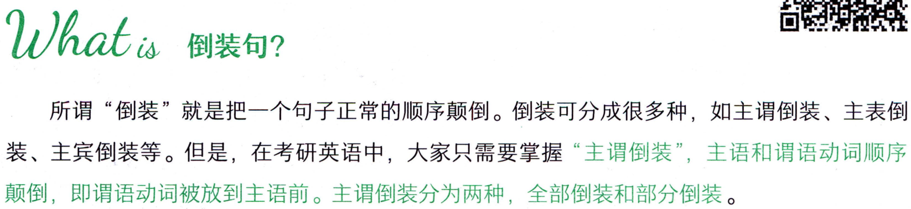

```text
Whatis 倒装句?
所谓“倒装”就是把一个句子正常的顺序颠倒。倒装可分成很多种，如主谓倒装、主表倒
装、主宾倒装等。但是，在考研英语中，大家只需要掌握“主谓倒装”，主语和谓语动词顺序
颠倒，即谓语动词被放到主语前。主谓倒装分为两种，全部倒装和部分倒装。
```

#### 词汇表

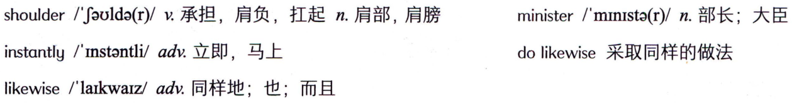

```text
minister/minista(r)/n.部长；大臣
shoulder/Jaulda(r)/v.承担，肩负，扛起n.肩部，肩膀
instantly/Instantli/adv.立即，马上
dolikewise采取同样的做法
likewise/laikwaIz/adv.同样地；也；而且
```

## Houto use 倒装句?


```text
Houto use 倒装句?
```

### （一）全部倒装

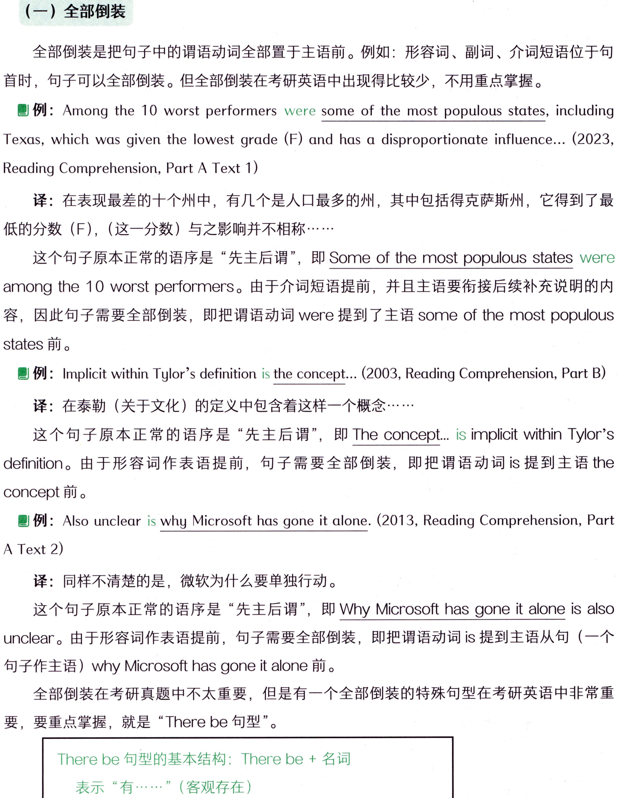

```text
（一）全部倒装
全部倒装是把句子中的谓语动词全部置于主语前。例如：形容词、副词、介词短语位于句
首时，句子可以全部倒装。但全部倒装在考研英语中出现得比较少，不用重点掌握。
例: Among the 10 worst performers were some of the most populous states, including
Texas, which was given the lowest grade (F) and has a disproportionate influence... (2023,
Reading Comprehension, Part A Text 1)
译：在表现最差的十个州中，有几个是人口最多的州，其中包括得克萨斯州，它得到了最
低的分数（F），（这一分数）与之影响并不相称·……
这个句子原本正常的语序是“先主后谓”，即Some of the most populous stateswere
among the10worstperformers。由于介词短语提前，并且主语要衔接后续补充说明的内
容，因此句子需要全部倒装，即把谓语动词were 提到了主语 some of the most populous
states 前。
例: Implicit within Tylor's definition is the concept... (2003, Reading Comprehension, Part B)
译：在泰勒（关于文化）的定义中包含着这样一个概念·……
这个句子原本正常的语序是“先主后谓”，即TheConcept.is implicit withinTylor's
definition。由于形容词作表语提前，句子需要全部倒装，即把谓语动词is提到主语the
concept前。
例: Also unclear is why Microsoft has gone it alone. (2013, Reading Comprehension, Part
A Text 2)
译：同样不清楚的是，微软为什么要单独行动。
这个句子原本正常的语序是“先主后谓”，即WhyMicrosofthasgoneit alone is also
unclear。由于形容词作表语提前，句子需要全部倒装，即把谓语动词is提到主语从句（一个
句子作主语）whyMicrosofthasgoneitalone前。
全部倒装在考研真题中不太重要，但是有一个全部倒装的特殊句型在考研英语中非常重
要，要重点掌握，就是“Therebe句型”。
There be 句型的基本结构：There be+名词
表示“有·….”（客观存在）
```

#### 词汇表

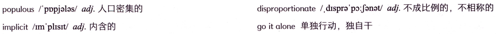

```text
disproportionate/.dispra'po:Jonat/adj.不成比例的，不相称的
populous/pppjalas/adj.人口密集的
goit alone单独行动，独自干
implicit/m'plist/adj.内含的
```

#### 概述

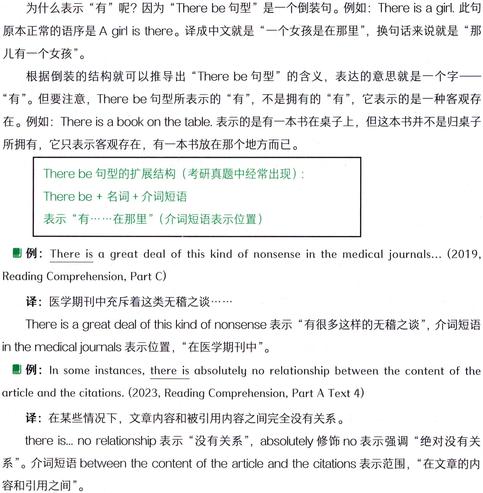

```text
为什么表示“有”呢？因为“There be 句型”是一个倒装句。例如：There is a girl. 此句
原本正常的语序是A girl is there。译成中文就是“一个女孩是在那里”，换句话来说就是“那
儿有一个女孩”。
根据倒装的结构就可以推导出“Therebe句型”的含义，表达的意思就是一个字一
“有”。但要注意，There be 句型所表示的“有”，不是拥有的“有”，它表示的是一种客观存
在。例如：There is a book on the table.表示的是有一本书在桌子上，但这本书并不是归桌子
所拥有，它只表示客观存在，有一本书放在那个地方而已。
Therebe句型的扩展结构（考研真题中经常出现）：
Therebe+名词+介词短语
表示“有·…·.…在那里”（介词短语表示位置）
例: There is a great deal of this kind of nonsense in the medical journals...(2019,
Reading Comprehension, Part C)
译：医学期刊中充斥着这类无稽之谈…··…·
There is a great deal of this kind of nonsense 表示“有很多这样的无稽之谈”，介词短语
in the medical journals表示位置，“在医学期刊中”。
例: In some instances, there is absolutely no relationship between the content of the
article and the citations. (2023, Reading Comprehension, Part A Text 4)
译：在某些情况下，文章内容和被引用内容之间完全没有关系。
there is...norelationship 表示“没有关系”，absolutely 修饰 no 表示强调“绝对没有关
系”。介词短语between the content of the article and the citations 表示范围，“在文章的内
容和引用之间”。
```

### 【补充】There be句型还可以把be变成不同的时态，来表示不同时间的“有”。be还可

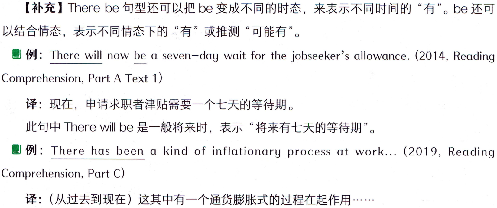

```text
【补充】There be句型还可以把be变成不同的时态，来表示不同时间的“有”。be还可
以结合情态，表示不同情态下的“有”或推测“可能有”。
例: There will now be a seven-day wait for the jobseeker's allowance. (2014, Reading
Comprehension, Part A Text 1)
译：现在，申请求职者津贴需要一个七天的等待期。
此句中Therewillbe是一般将来时，表示“将来有七天的等待期”。
例: There has been a kind of inflationary process at work... (2019, Reading
Comprehension,Part C)
译：（从过去到现在）这其中有一个通货膨胀式的过程在起作用.·
```

#### 词汇表

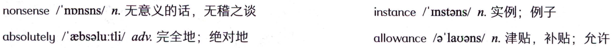

```text
nonsense/'npnsns/n.无意义的话，无稽之谈
instance/Instons/n.实例；例子
absolutely/ebsolu:tli/adv.完全地；绝对地
allowance/e'lauans/n.津贴，补贴；允许
```

#### 概述

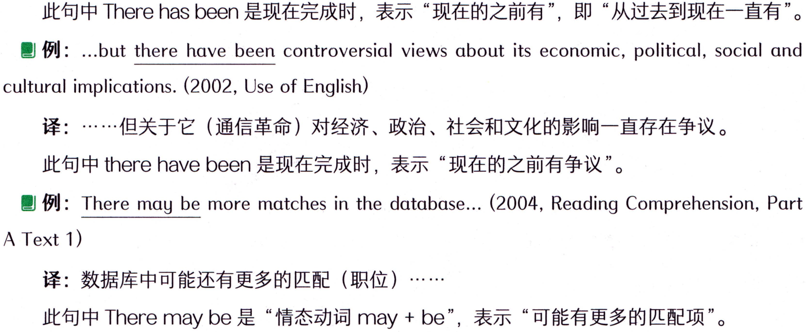

```text
此句中Therehasbeen是现在完成时，表示“现在的之前有”，即“从过去到现在一直有”。
例: ...but there have been controversial views about its economic, political, social and
cultural implications. (2002, Use of English)
译：·……-但关于它（通信革命）对经济、政治、社会和文化的影响一直存在争议。
此句中 there have been是现在完成时，表示“现在的之前有争议”。
 例: There may be more matches in the database... (2004, Reading Comprehension, Part
A Text 1)
译：数据库中可能还有更多的匹配（职位）
此句中There may be 是“情态动词 may+be”，表示“可能有更多的匹配项”。
```

### （二）部分倒装

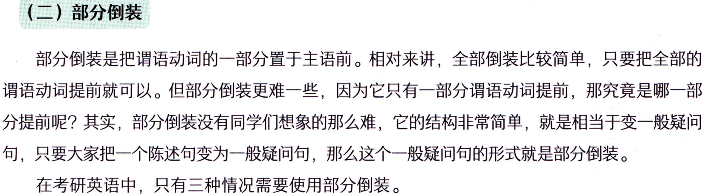

```text
（二）部分倒装
部分倒装是把谓语动词的一部分置于主语前。相对来讲，全部倒装比较简单，只要把全部的
谓语动词提前就可以。但部分倒装更难一些，因为它只有一部分谓语动词提前，那究竟是哪一部
分提前呢？其实，部分倒装没有同学们想象的那么难，它的结构非常简单，就是相当于变一般疑问
句，只要大家把一个陈述句变为一般疑问句，那么这个一般疑问句的形式就是部分倒装。
在考研英语中，只有三种情况需要使用部分倒装。
```

#### 1.否定副词或词组位于句首

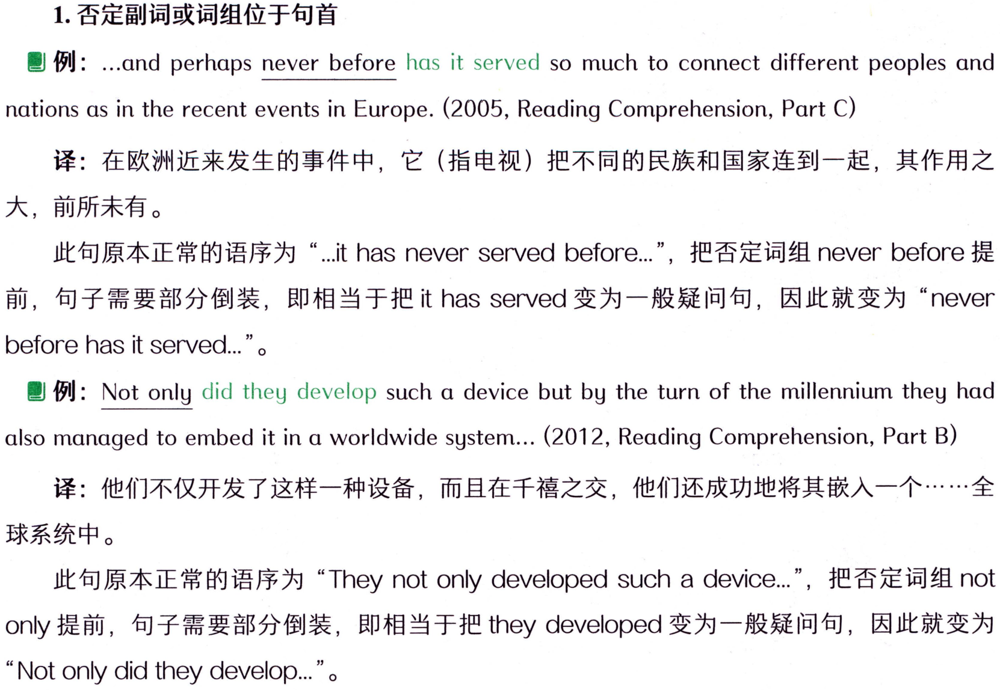

```text
1.否定副词或词组位于句首
例: ..and perhaps never before has it served so much to connect different peoples and
nations as in the recent events in Europe. (2005, Reading Comprehension, Part C)
译：在欧洲近来发生的事件中，它（指电视）把不同的民族和国家连到一起，其作用之
大，前所未有。
前，句子需要部分倒装，即相当于把ithas Served变为一般疑问句，因此就变为“never
before has it served.." 
例: Not only did they develop such a device but by the turn of the millennium they had
also managed to embed it in a worldwide system... (2012, Reading Comprehension, Part B)
球系统中。
此句原本正常的语序为“They not only developed such a device.."，把否定词组 not
only提前，句子需要部分倒装，即相当于把theydeveloped变为一般疑问句，因此就变为
'Not only did they develop.." 
```

#### 词汇表

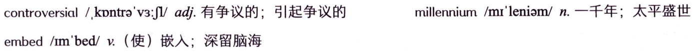

```text
controversial/kontra'v3:J/adj.有争议的；引起争议的
millennium/mr'leniam/n.一千年；太平盛世
embed/im'bed/v.（使）嵌入；深留脑海
```

#### 2.only位于句首

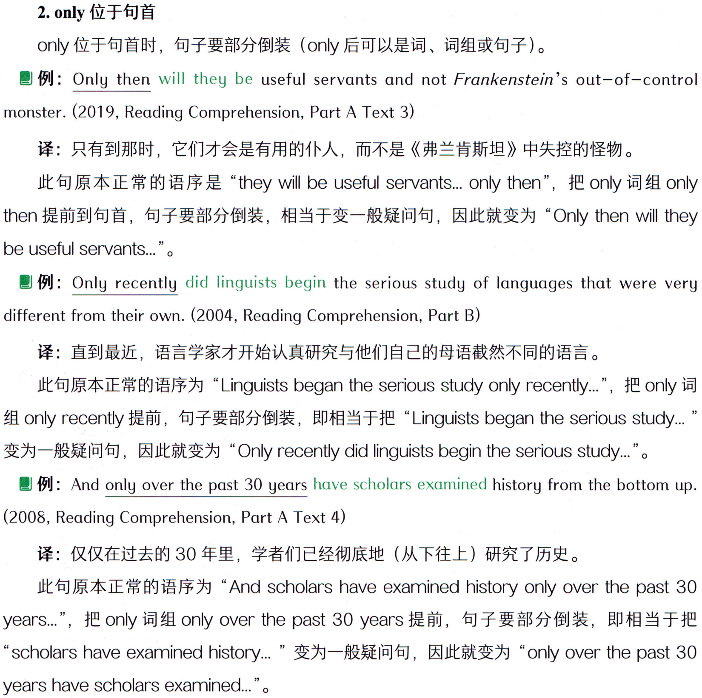

```text
2.only位于句首
only位于句首时，句子要部分倒装（only 后可以是词、词组或句子）。
例: Only then will they be useful servants and not Frankenstein's out-of-control
monster. (2019, Reading Comprehension, Part A Text 3)
译：只有到那时，它们才会是有用的仆人，而不是《弗兰肯斯坦》中失控的怪物。
此句原本正常的语序是“they will be useful servants...only then"，把 only 词组 only
then 提前到句首，句子要部分倒装，相当于变一般疑问句，因此就变为“Only then wil they
be useful servants.." .
例: Only recently did linguists begin the serious study of languages that were very
different from their own. (2004, Reading Comprehension, Part B)
译：直到最近，语言学家才开始认真研究与他们自己的母语截然不同的语言。
此句原本正常的语序为“Linguists began the serious study only recently.."， 把 only 词
组 only recently 提前，句子要部分倒装，即相当于把“Linguists began the serious study.…."
变为一般疑问句，因此就变为“Only recently did linguists begin the serious study.."
 例: And only over the past 30 years have scholars examined history from the bottom up.
(2008, Reading Comprehension, Part A Text 4)
译：仅仅在过去的30年里，学者们已经彻底地（从下往上）研究了历史。
此句原本正常的语序为“And scholars have examined history only over the past 30
years.."，把 only 词组 only over the past 30 years 提前，句子要部分倒装，即相当于把
"scholars have examined history..：”变为一般疑问句，因此就变为“only over the past 30
years have scholars examined..."' .
```

#### 3.虚拟条件句省略if

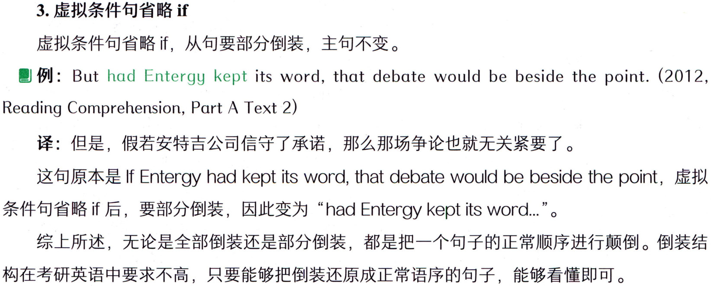

```text
3.虚拟条件句省略if
虚拟条件句省略if，从句要部分倒装，主句不变。
例: But had Entergy kept its word, that debate would be beside the point. (2012,
Reading Comprehension, Part A Text 2)
译：但是，假若安特吉公司信守了承诺，那么那场争论也就无关紧要了。
这句原本是If Entergy had kept its word, that debate would be beside the point，虚拟
条件句省略 if 后，要部分倒装，因此变为“had Entergy kept its word..”。
综上所述，无论是全部倒装还是部分倒装，都是把一个句子的正常顺序进行颠倒。倒装结
构在考研英语中要求不高，只要能够把倒装还原成正常语序的句子，能够看懂即可。
```

#### 词汇表

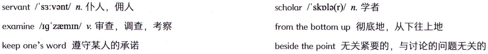

```text
servant/s3:vant/n.仆人，佣人
scholar/'skple(r)/n.学者
examine/ig`zaemin/v.审查，调查，考察
from thebottom up 彻底地，从下往上地
keep one's word遵守某人的承诺
besidethepoint无关紧要的，与讨论的问题无关的
```
