# 第一节 名词性从句

#### 概述

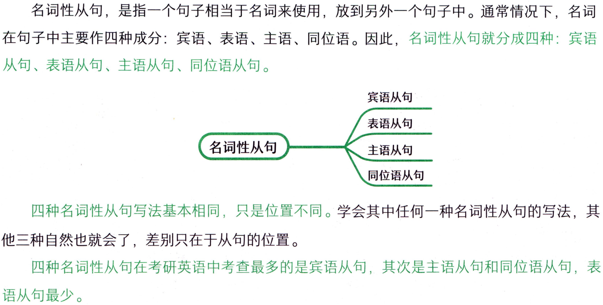

```text
名词性从句，是指一个句子相当于名词来使用，放到另外一个句子中。通常情况下，名词
在句子中主要作四种成分：宾语、表语、主语、同位语。因此，名词性从句就分成四种：宾语
从句、表语从句、主语从句、同位语从句。
宾语从句
表语从句
名词性从句
主语从句
同位语从句
四种名词性从句写法基本相同，只是位置不同。学会其中任何一种名词性从句的写法，其
他三种自然也就会了，差别只在于从句的位置。
四种名词性从句在考研英语中考查最多的是宾语从句，其次是主语从句和同位语从句，表
语从句最少。
```

## 一、宾语从句


```text
一、宾语从句
```

## Uhat is 宾语从句?

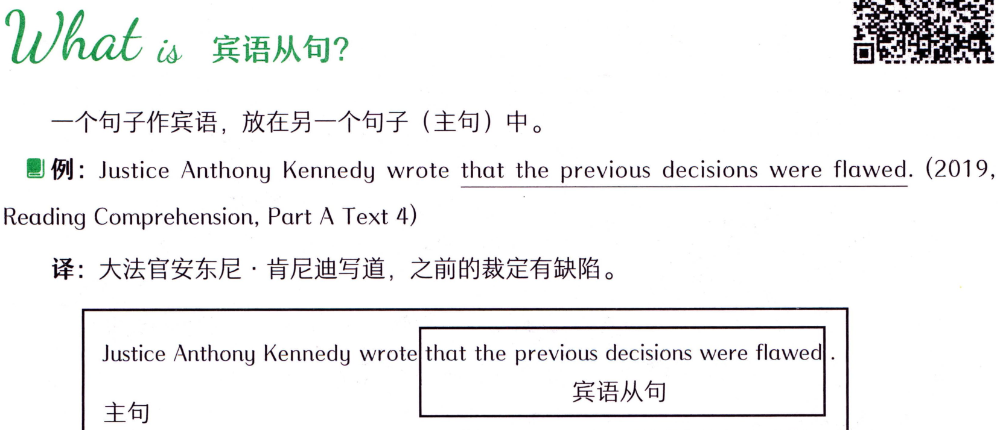

```text
Uhat is 宾语从句?
一个句子作宾语，放在另一个句子（主句）中。
例: Justice Anthony Kennedy wrote that the previous decisions were flawed. (2019,
Reading Comprehension, Part A Text 4)
译：大法官安东尼·肯尼迪写道，之前的裁定有缺陷。
Justice AnthonyKennedywrote that the previous decisionswere flawed
宾语从句
主句
```

### （一）宾语从句的写法

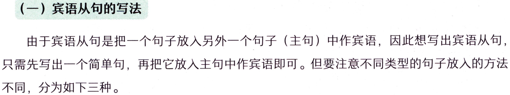

```text
（一）宾语从句的写法
由于宾语从句是把一个句子放入另外一个句子（主句）中作宾语，因此想写出宾语从句，
只需先写出一个简单句，再把它放入主句中作宾语即可。但要注意不同类型的句子放入的方法
不同，分为如下三种。
```

#### 1.陈述句变宾语从句

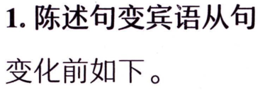

```text
1.陈述句变宾语从句
变化前如下。
```

#### 词汇表

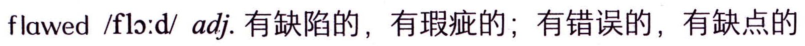

```text
flawed/flo:d/adj.有缺陷的，有瑕症的；有错误的，有缺点的
```

#### 概述

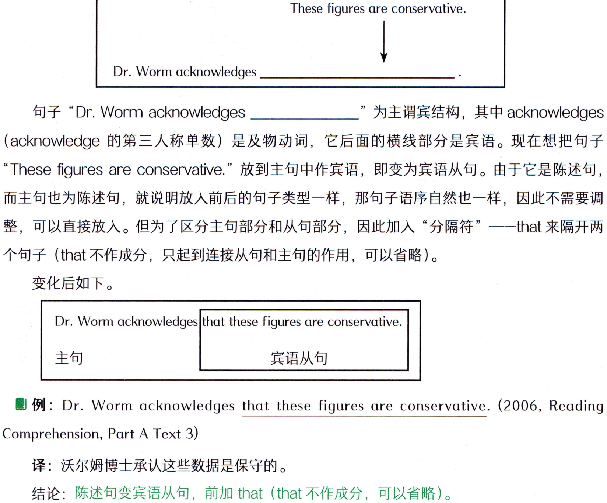

```text
These figures are conservative.
Dr. Worm acknowledges
”为主谓宾结构，其中 acknowledges
句子 “Dr. Worm acknowledges
(acknowledge的第三人称单数）是及物动词，它后面的横线部分是宾语。现在想把句子
“These figures are conservative.”放到主句中作宾语，即变为宾语从句。由于它是陈述句,
而主句也为陈述句，就说明放入前后的句子类型一样，那句子语序自然也一样，因此不需要调
整，可以直接放入。但为了区分主句部分和从句部分，因此加入“分隔符”一一that来隔开两
个句子（that不作成分，只起到连接从句和主句的作用，可以省略）。
变化后如下。
Dr. Worm acknowledges that these figures are conservative.
主句
宾语从句
例: Dr. Worm acknowledges that these figures are conservative. (2006, Reading
Comprehension, Part A Text 3)
译：沃尔姆博士承认这些数据是保守的。
结论：陈述句变宾语从句，前加 that（that不作成分，可以省略）。
```

### 【补充】宾语从句里的 that 可以省略，但是建议写的时候不要省。一是把 that加上，更有

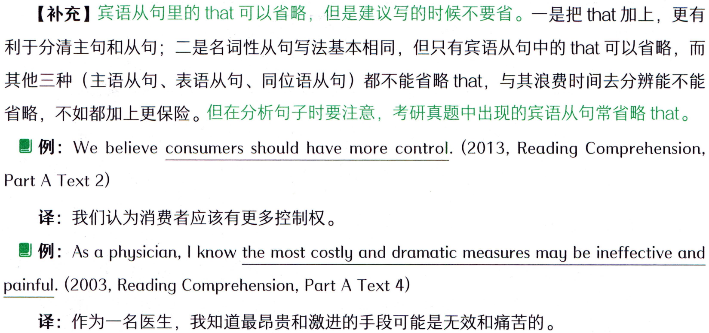

```text
【补充】宾语从句里的 that 可以省略，但是建议写的时候不要省。一是把 that加上，更有
利于分清主句和从句；二是名词性从句写法基本相同，但只有宾语从句中的that可以省略，而
其他三种（主语从句、表语从句、同位语从句）都不能省略that，与其浪费时间去分辨能不能
省略，不如都加上更保险。但在分析句子时要注意，考研真题中出现的宾语从句常省略that。
例: We believe consumers should have more control. (2013, Reading Comprehension,
Part A Text 2)
译：我们认为消费者应该有更多控制权。
 例: As a physician, I know the most costly and dramatic measures may be ineffective and
painful. (2003, Reading Comprehension, Part A Text 4)
译：作为一名医生，我知道最昂贵和激进的手段可能是无效和痛苦的。
```

#### 2.特殊疑问句变宾语从句

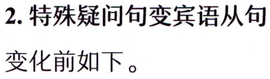

```text
2.特殊疑问句变宾语从句
变化前如下。
```

#### 词汇表

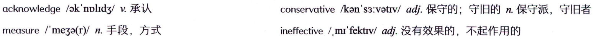

```text
acknowledge/ak'nolid3/v.承认
conservative/kan's3:vativ/adj.保守的；守l旧的n.保守派，守l旧者
measure/me3a(r)/n.手段，方式
ineffective/.mr'fektiv/adji.没有效果的，不起作用的
```

#### 概述

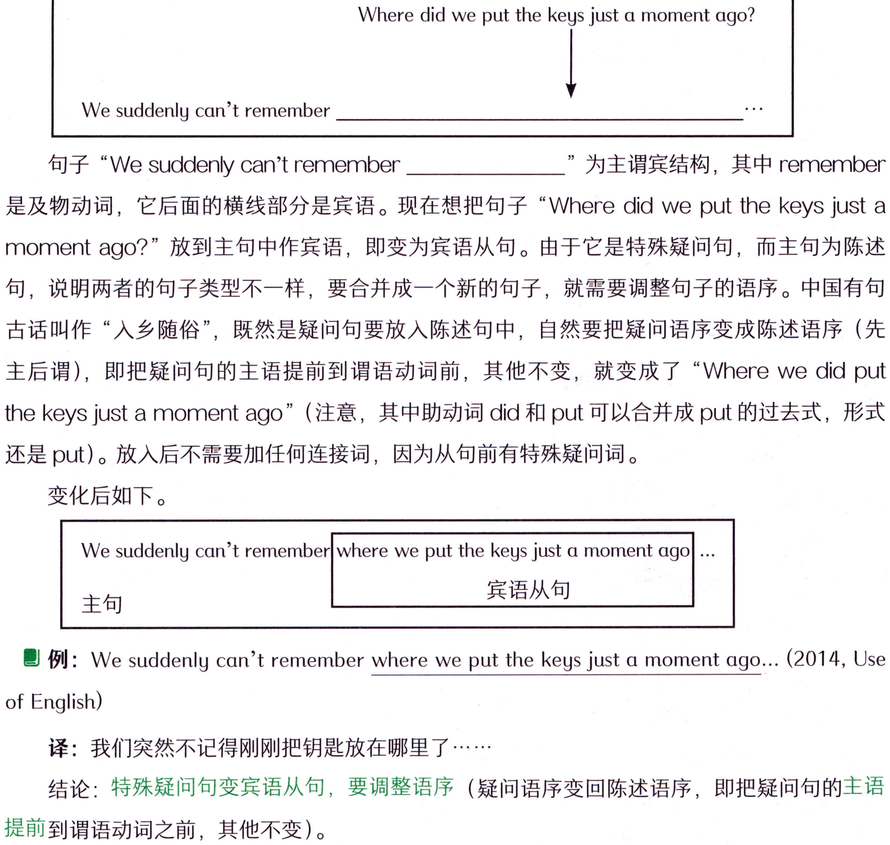

```text
Where did we put the keys just a moment ago?
Wesuddenly can'tremember
”为主谓宾结构，其中 remember
句子“We suddenly can't remember
是及物动词，它后面的横线部分是宾语。现在想把句子“Where did we put the keys just a
moment ago？”放到主句中作宾语，即变为宾语从句。由于它是特殊疑问句，而主句为陈述
句，说明两者的句子类型不一样，要合并成一个新的句子，就需要调整句子的语序。中国有句
古话叫作“入乡随俗”，既然是疑问句要放入陈述句中，自然要把疑问语序变成陈述语序（先
主后谓)，即把疑问句的主语提前到谓语动词前，其他不变，就变成了“Where we did put
thekeys just a moment ago”（注意，其中助动词 did 和 put 可以合并成 put 的过去式，形式
还是put)。放入后不需要加任何连接词，因为从句前有特殊疑问词。
变化后如下。
We suddenly can't rememberwhere we put the keys just a moment ago
宾语从句
主句
例:We suddenly can't remember where we put the keys just a moment ago... (2014, Use
of English)
译：我们突然不记得刚刚把钥匙放在哪里了·
结论：特殊疑问句变宾语从句，要调整语序（疑问语序变回陈述语序，即把疑问句的主语
提前到谓语动词之前，其他不变)。
```

#### 3.一般疑问句变宾语从句

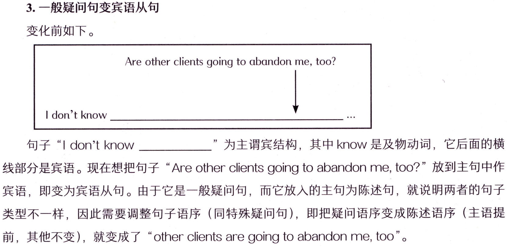

```text
3.一般疑问句变宾语从句
变化前如下。
Are other clients going to abandon me, too?
I don't know
”为主谓宾结构，其中know是及物动词，它后面的横
句子“Idon'tknow
线部分是宾语。现在想把句子“Are other clients going to abandon me,too?”放到主句中作
宾语，即变为宾语从句。由于它是一般疑问句，而它放入的主句为陈述句，就说明两者的句子
类型不一样，因此需要调整句子语序（同特殊疑问句），即把疑问语序变成陈述语序（主语提
前，其他不变），就变成了“other clients are going to abandon me, too"。
```

#### 词汇表

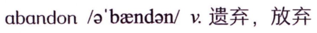

```text
abandon/a'baendan/v.遗弃，放弃
```

#### 概述

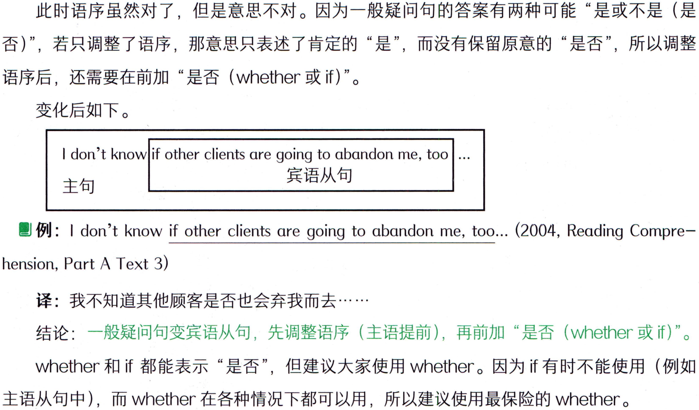

```text
此时语序虽然对了，但是意思不对。因为一般疑问句的答案有两种可能“是或不是（是
否)”，若只调整了语序，那意思只表述了肯定的“是”，而没有保留原意的“是否”，所以调整
语序后，还需要在前加“是否（whether或if）”。
变化后如下。
I don't knowlif other clients are going to abandon me, too
宾语从句
主句
例: I don't know if other clients are going to abandon me, too... (2004, Reading Compre-
hension, Part A Text 3)
译：我不知道其他顾客是否也会弃我而去……
结论：一般疑问句变宾语从句，先调整语序（主语提前），再前加“是否（whether 或if)”。
whether和if都能表示“是否”，但建议大家使用whether。因为if有时不能使用（例如
主语从句中），而whether在各种情况下都可以用，所以建议使用最保险的whether。
```

### 【补充】上面的例子都是主句为陈述句，因此从句要调整成陈述语序再放入到主句中。若

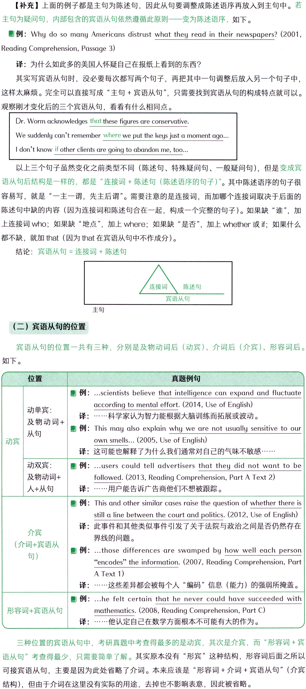

```text
【补充】上面的例子都是主句为陈述句，因此从句要调整成陈述语序再放入到主句中。若
主句为疑问句，内部包含的宾语从句依然遵循此原则一变为陈述语序，如下。
例: Why do so many Americans distrust what they read in their newspapers? (2001,
Reading Comprehension, Passage 3)
译：为什么如此多的美国人怀疑自己在报纸上看到的东西?
其实写宾语从句时，没必要每次都写两个句子，再把其中一句调整后放入另一个句子中，
这样太麻烦。完全可以直接写成“主句+宾语从句”，只需要找到宾语从句的构成特点就可以。
观察刚才变化后的三个宾语从句，看看有什么相同点。
Dr. Worm acknowledges that these figures are conservative.
We suddenly can't remember where we put the keys just a moment ago...
I don't know if other clients are going to abandon me, too...
以上三个句子虽然变化之前类型不同（陈述句、特殊疑问句、一般疑问句)，但是变成宾
语从句后结构是一样的，都是“连接词+陈述句（陈述语序的句子）”。其中陈述语序的句子很
容易写，就是“一主一谓，先主后谓”。需要注意的是连接词，而加哪个连接词取决于后面的
陈述句中缺的内容（因为连接词和陈述句合在一起，构成一个完整的句子）。如果缺“谁”，加
上连接词who；如果缺“地点”，加上where；如果缺“是否”，加上whether或if；如果什么
都不缺，就加that（因为that在宾语从句中不作成分）。
结论：宾语从句=连接词+陈述句
连接词
陈述句
宾语从句
主句
宾语从句的位置
宾语从句的位置一共有三种，分别是及物动词后（动宾)、介词后（介宾）、形容词后。
如下。
位置
真题例句
according to mental effort. (2014, Use of English)
动单宾:
译：..…·科学家认为智力能根据大脑训练而拓展或波动。
及物动词+
例: This may also explain why we are not usually sensitive to our
从句
own smells... (2005, Use of English)
动宾
译：这可能也解释了为什么我们通常对自己的气味不敏感·.·
例: ...users could tell advertisers that they did not want to be
动双宾：
及物动词+
followed. (2013, Reading Comprehension, Part A Text 2)
译：..…·用户能告诉广告商他们不想被跟踪。
人+从句
例： This and other similar cases raise the question of whether there is
still a line between the court and politics. (2012, Use of English)
译：此事件和其他类似事件引发了关于法院与政治之间是否仍然存在
介宾
界线的问题。
(介词+宾语从
例: ...those differences are swamped by how well each person
句）
"encodes" the information. (2007, Reading Comprehension, Part
A Text 1)
译：·……·这些差异都会被每个人“编码”信息（能力）的强弱所掩盖。
例：...he felt certain that he never could have succeeded with
mathematics. (2008, Reading Comprehension, Part C)
形容词+宾语从句
译：·….·他认定自己在数学方面根本不可能有大的作为。
三种位置的宾语从句中，考研真题中考查得最多的是动宾，其次是介宾，而“形容词+宾
语从句”考查得最少，只需要简单了解。其实原本没有“形宾”这种结构，形容词后面之所以
可接宾语从句，主要是因为此处省略了介词。本来应该是“形容词+介词+宾语从句”（介宾
结构)，但由于介词在这里没有实际的用途，去掉也不影响表意，因此被省略。
```

### 【补充】除作为谓语的及物动词后可接宾语从句之外，非谓语动词后也可以接宾语从句，

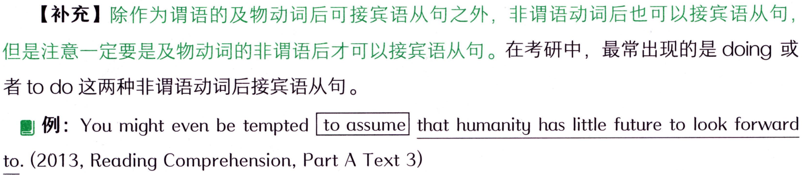

```text
【补充】除作为谓语的及物动词后可接宾语从句之外，非谓语动词后也可以接宾语从句，
但是注意一定要是及物动词的非谓语后才可以接宾语从句。在考研中，最常出现的是doing 或
者todo这两种非谓语动词后接宾语从句。
that humanityhaslittlefuturetolookforward
例：You might even be temptedto assume
to. (2013, Reading Comprehension, Part A Text 3)
```

#### 词汇表

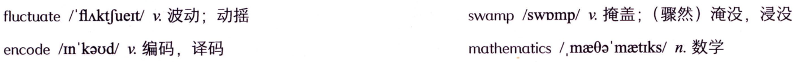

```text
swamp/swpmp/v.掩盖；（骤然）淹没，浸没
fluctuate/flaktfuert/v.波动；动摇
mathematics /.ma0e'matiks/ n.数学
encode/n'kaud/v编码，译码
```

#### 概述

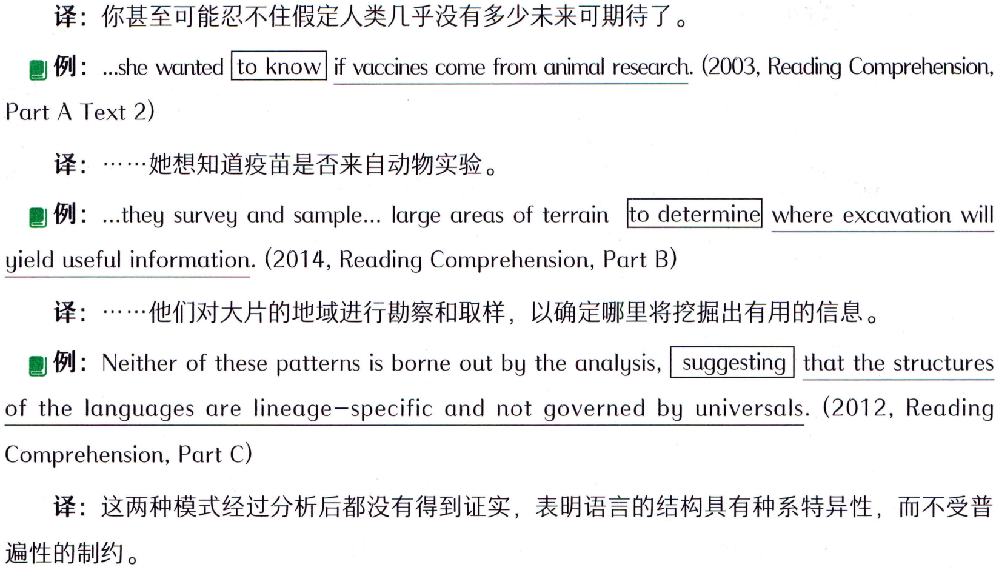

```text
译：你甚至可能忍不住假定人类几乎没有多少未来可期待了。
例: ..she wanted |to know| if vaccines come from animal research. (2003, Reading Comprehension,
Part A Text 2)
译：·……她想知道疫苗是否来自动物实验。
例: ...they survey and sample... large areas of terrain
todeterminelwhereexcavationwill
yield useful information. (2014, Reading Comprehension, Part B)
译：·…..·他们对大片的地域进行勘察和取样，以确定哪里将挖掘出有用的信息。
例: Neither of these patterns is borne out by the analysis,suggesting」that the structures
of the languages are lineage-specific and not governed by universals. (2012, Reading
Comprehension, Part C)
译：这两种模式经过分析后都没有得到证实，表明语言的结构具有种系特异性，而不受普
遍性的制约。
```

### 【补充】一个长难句中，有时会包含多个宾语从句，这属于难度较大的句子，看懂即可。

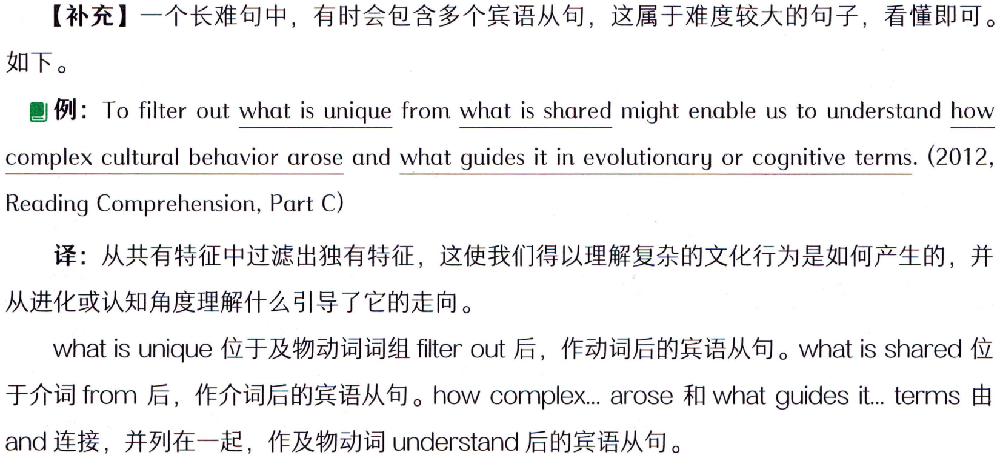

```text
【补充】一个长难句中，有时会包含多个宾语从句，这属于难度较大的句子，看懂即可。
如下。
例: To filter out what is unique from what is shared might enable us to understand how
complex cultural behavior arose and what guides it in evolutionary or cognitive terms. (2012,
Reading Comprehension, Part C)
译：从共有特征中过滤出独有特征，这使我们得以理解复杂的文化行为是如何产生的，并
从进化或认知角度理解什么引导了它的走向。
whatisunique位于及物动词词组filter out后，作动词后的宾语从句。whatis shared位
于介词from 后，作介词后的宾语从句。how complex..arose 和 what guides it.terms 由
and连接，并列在一起，作及物动词understand后的宾语从句。
```

### 【补充】如果宾语从句过长，且在主谓宾补的句型中，则宾语从句后置，用形式宾语it来

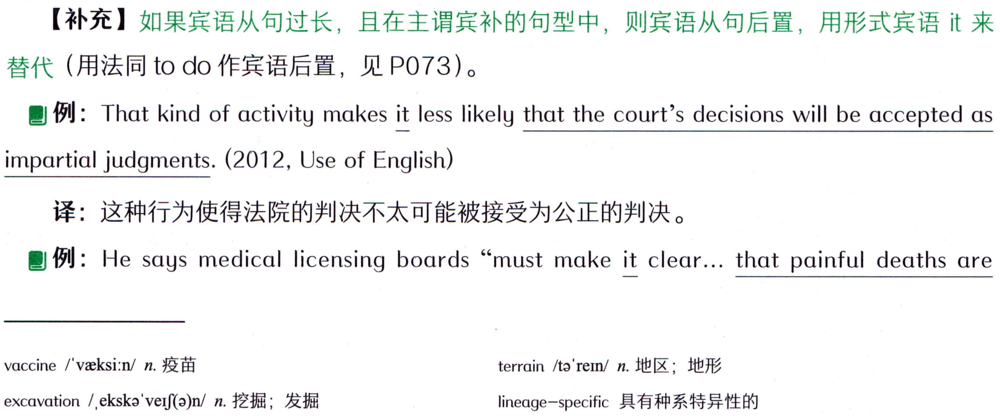

```text
【补充】如果宾语从句过长，且在主谓宾补的句型中，则宾语从句后置，用形式宾语it来
替代（用法同to do 作宾语后置，见P073)。
例: That kind of activity makes it less likely that the court's decisions will be accepted as
impartial judgments. (2012, Use of English)
译：这种行为使得法院的判决不太可能被接受为公正的判决。
例:He says medical licensing boards “must make it clear... that painful deaths are
vaccine/'vaeksi:n/n.疫苗
terrain/ta'rein/n.地区；地形
excavation /.ekska'verf(e)n/ n.挖掘；发掘
lineage-specific具有种系特异性的
```

#### 词汇表

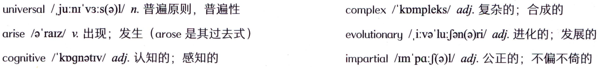

```text
universal/ju:nr'v3:s(e)/n.普遍原则，普遍性
complex/kpmpleks/adj.复杂的；合成的
arise /a'raiz/v.出现；发生（arose是其过去式）
evolutionary/i:va'lu:fon(o)ri/adj.进化的；发展的
cognitive/kpgnativ/adj.认知的；感知的
impartial /Im'pa:f(e)l/adj.公正的；不偏不倚的
```

#### 概述

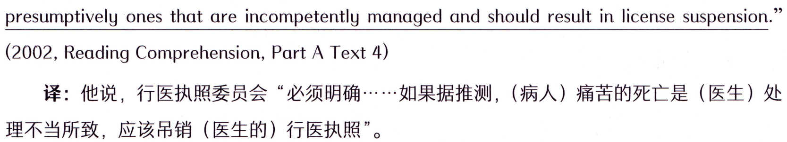

```text
presumptively ones that are incompetently managed and should result in license suspension."
(2002, Reading Comprehension, Part A Text 4)
译：他说，行医执照委员会“必须明确·…如果据推测，（病人）痛苦的死亡是（医生）处
理不当所致，应该吊销（医生的）行医执照”。
```

## 二、表语从句


```text
二、表语从句
```

## Whatis表语从句?

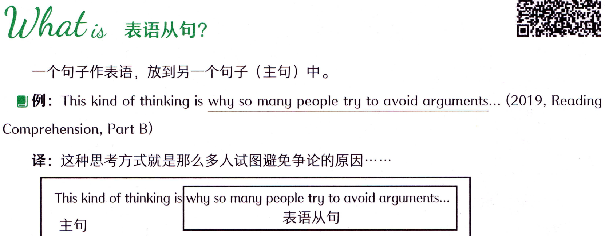

```text
Whatis表语从句?
一个句子作表语，放到另一个句子（主句）中。
例: This kind of thinking is why so many people try to avoid arguments... (2019, Reading
Comprehension, Part B)
译：这种思考方式就是那么多人试图避免争论的原因·….…·
This kind of thinking islwhy so many people try to avoid arguments..
表语从句
主句
```

### （一）表语从句的写法

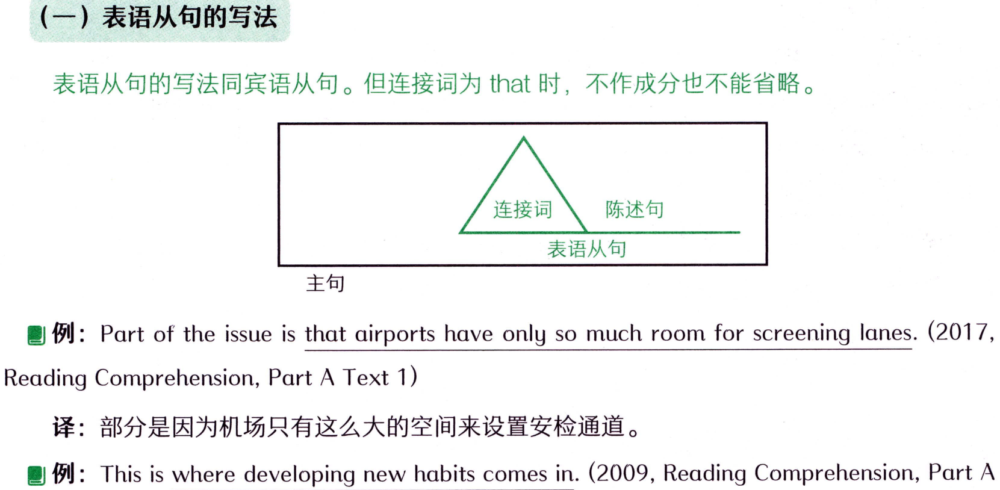

```text
（一）表语从句的写法
表语从句的写法同宾语从句。但连接词为 that时，不作成分也不能省略。
连接词
陈述句
表语从句
主句
例: Part of the issue is that airports have only so much room for screening lanes. (2017,
Reading Comprehension, Part A Text 1)
译：部分是因为机场只有这么大的空间来设置安检通道。
例： This is where developing new habits comes in. (2009, Reading Comprehension, Part A
```

#### 词汇表

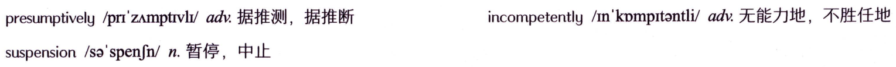

```text
incompetently/m'kpmpitontli/adv.无能力地，不胜任地
presumptively/pr'zAmptivl/adv.据推测，据推断
suspension /sa'spenjn/n.暂停，中止
```

#### 概述

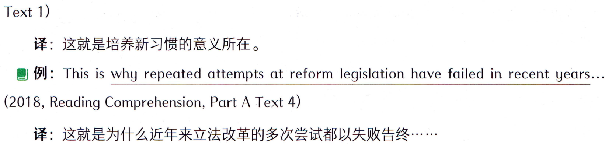

```text
Text 1)
译：这就是培养新习惯的意义所在。
 例: This is why repeated attempts at reform legislation have failed in recent years...
(2018, Reading Comprehension, Part A Text 4)
译：这就是为什么近年来立法改革的多次尝试都以失败告终.…·
```

### （二）表语从句的位置

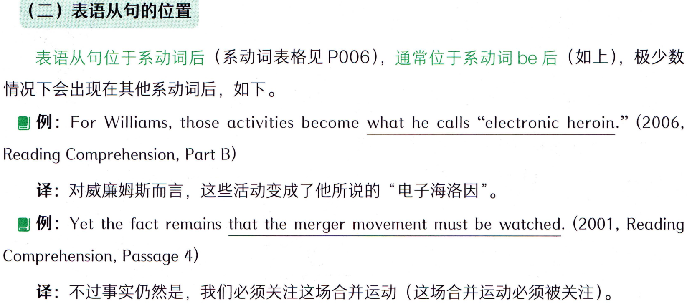

```text
（二）表语从句的位置
表语从句位于系动词后（系动词表格见P006），通常位于系动词be后（如上），极少数
情况下会出现在其他系动词后，如下。
例: For Williams,those activities become what he calls “electronic heroin.”(2006,
Reading Comprehension, Part B)
译：对威廉姆斯而言，这些活动变成了他所说的“电子海洛因”。
 例: Yet the fact remains that the merger movement must be watched. (2001, Reading
Comprehension, Passage 4)
译：不过事实仍然是，我们必须关注这场合并运动(这场合并运动必须被关注）。
```

### 【补充】除作为谓语使用的系动词后可接表语从句之外，作为非谓语动词的系动词后也可

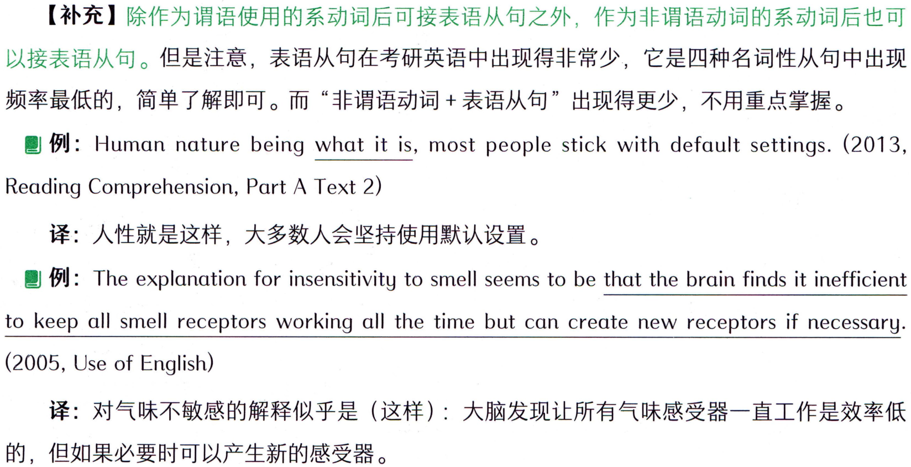

```text
【补充】除作为谓语使用的系动词后可接表语从句之外，作为非谓语动词的系动词后也可
以接表语从句。但是注意，表语从句在考研英语中出现得非常少，它是四种名词性从句中出现
频率最低的，简单了解即可。而“非谓语动词+表语从句”出现得更少，不用重点掌握。
例: Human nature being what it is, most people stick with default settings. (2013,
Reading Comprehension, Part A Text 2)
译：人性就是这样，大多数人会坚持使用默认设置。
 例: The explanation for insensitivity to smell seems to be that the brain finds it inefficient
to keep all smell receptors working all the time but can create new receptors if necessary.
(2005, Use of English)
译：对气味不敏感的解释似乎是（这样）：大脑发现让所有气味感受器一直工作是效率低
的，但如果必要时可以产生新的感受器。
```

#### 词汇表

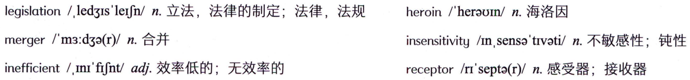

```text
legislation/.led3is'lerjn/n.立法，法律的制定；法律，法规
heroin/herauin/n.海洛因
merger /m3:d3a(r)/n.合并
insensitivity/m,sensa'tivati/n.不敏感性；钝性
inefficient/.Imr'fijfnt/adj.效率低的；无效率的
receptor/r'septa(r)/n.感受器；接收器
```

## 三、主语从句

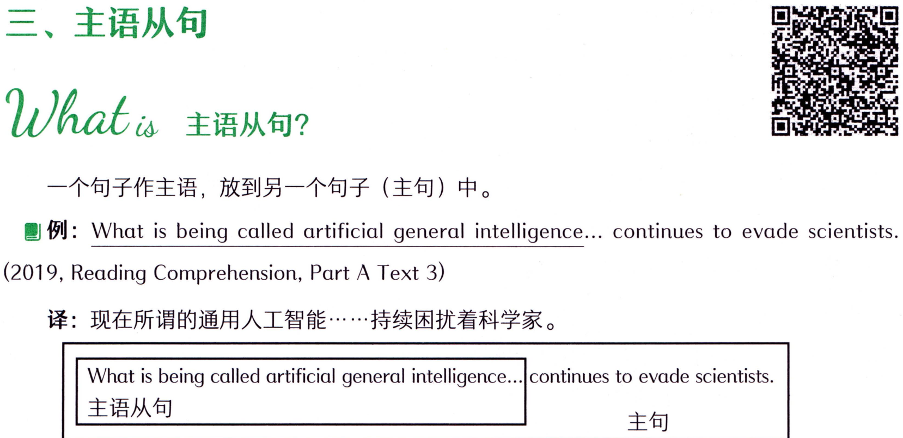

```text
三、主语从句
W)hatis 主语从句?
一个句子作主语，放到另一个句子（主句）中。
例: What is being called artificial general intelligence... continues to evade scientists.
(2019, Reading Comprehension, Part A Text 3)
译：现在所谓的通用人工智能·…···持续困扰着科学家。
What is being called artificial general intelligence...|continues to evade scientists.
主语从句
主句
```

## How to use 主语从句?


```text
How to use 主语从句?
```

### （一）主语从句的写法

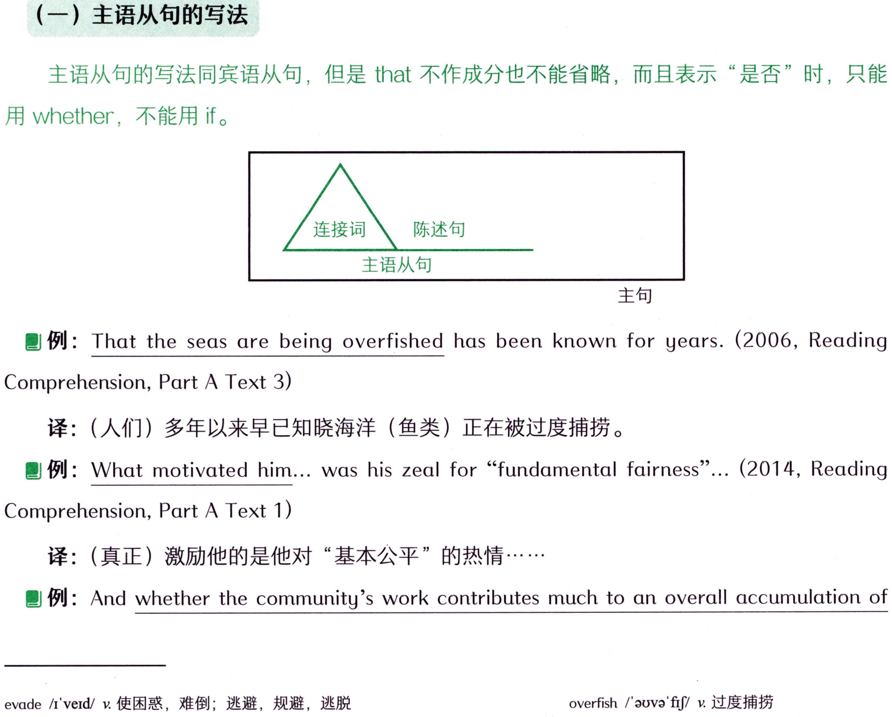

```text
（一）主语从句的写法
主语从句的写法同宾语从句，但是that不作成分也不能省略，而且表示“是否”时，只能
用whether，不能用if。
陈述句
连接词
主语从句
主句
例: That the seas are being overfished has been known for years. (2006, Reading
Comprehension, Part A Text 3)
译：（人们）多年以来早已知晓海洋（鱼类）正在被过度捕捞。
例: What motivated him... was his zeal for “fundamental fairness"... (2014, Reading
Comprehension, Part A Text 1)
译：（真正）激励他的是他对“基本公平”的热情·…
例：Andwhether the community'swork contributesmuch to an overall accumulation of
evade/r'verd/v.使困惑，难倒；逃避，规避，逃脱
overfish/auva'fif/v过度捕捞
```

#### 词汇表

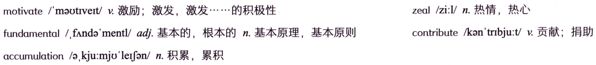

```text
zeal /zi:l/n.热情，热心
motivate/mautivert/v.激励；激发，激发...…的积极性
contribute/kan'tribju:t/v.贡献；捐助
fundamental/.fAnda'mentl/adj.基本的，根本的n.基本原理，基本原则
accumulation/o.kju:mjo'lerjfon/n.积累，累积
```

#### 概述

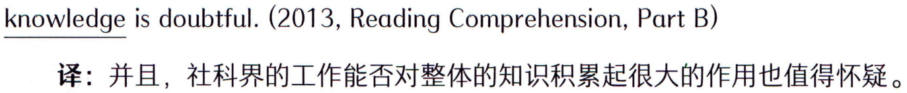

```text
knowledge is doubtful. (2013, Reading Comprehension, Part B)
译：并且，社科界的工作能否对整体的知识积累起很大的作用也值得怀疑。
```

### （二）主语从句的位置

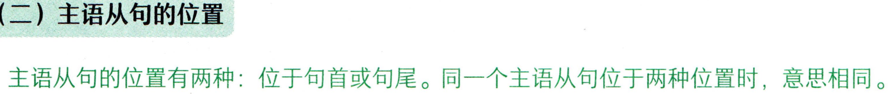

```text
（二）主语从句的位置
主语从句的位置有两种：位于句首或句尾。同一个主语从句位于两种位置时，意思相同。
```

#### 1.位于句首

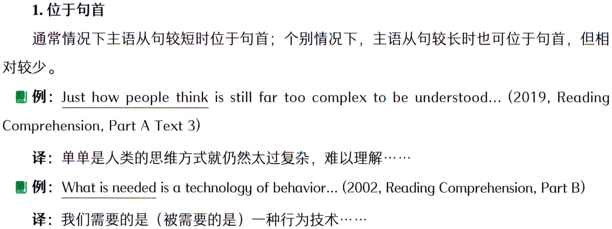

```text
1.位于句首
通常情况下主语从句较短时位于句首；个别情况下，主语从句较长时也可位于句首，但相
对较少。
例: Just how people think is still far too complex to be understood... (2019, Reading
Comprehension, Part A Text 3)
译：单单是人类的思维方式就仍然太过复杂，难以理解·…·.
 例: What is needed is a technology of behavior... (2002, Reading Comprehension, Part B)
译：我们需要的是（被需要的是）一种行为技术·……·
```

#### 2.位于句尾

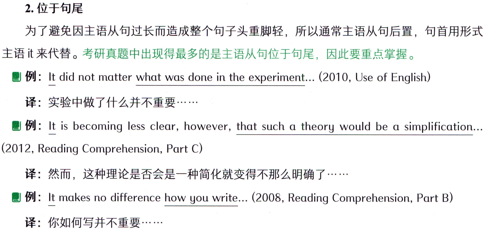

```text
2.位于句尾
为了避免因主语从句过长而造成整个句子头重脚轻，所以通常主语从句后置，句首用形式
主语it来代替。考研真题中出现得最多的是主语从句位于句尾，因此要重点掌握。
 例: It did not matter what was done in the experiment... (2010, Use of English)
译：实验中做了什么并不重要.·
例: It is becoming less clear, however, that such a theory would be a simplification..
(2012, Reading Comprehension, Part C)
译：然而，这种理论是否会是一种简化就变得不那么明确了..·.
例: It makes no difference how you write... (2008, Reading Comprehension, Part B)
译：你如何写并不重要.··
```

## 四、同位语从句


```text
四、同位语从句
```

## Uhatis 同位语从句?


```text
Uhatis 同位语从句?
一个句子作同位语，放到另一个句子（主句）中。同位语从句的作用是解释说明一个抽象
名词。
```

#### 词汇表

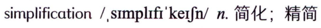

```text
simplification/ simplifi'kerjn/n.简化；精简
```

#### 概述

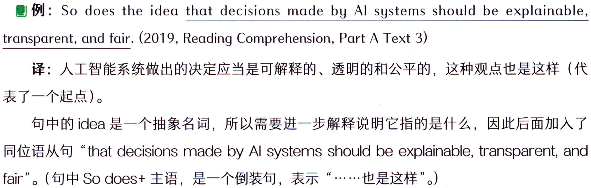

```text
例: So does the idea that decisions made by Al systems should be explainable,
transparent, and fair. (2019, Reading Comprehension, Part A Text 3)
译：人工智能系统做出的决定应当是可解释的、透明的和公平的，这种观点也是这样（代
表了一个起点)。
句中的idea是一个抽象名词，所以需要进一步解释说明它指的是什么，因此后面加入了
同位语从句 “that decisions made by Al systems should be explainable, transparent, and
fair”。（句中So does+主语，是一个倒装句，表示“...·也是这样”。)
```

### （一）同位语从句的写法

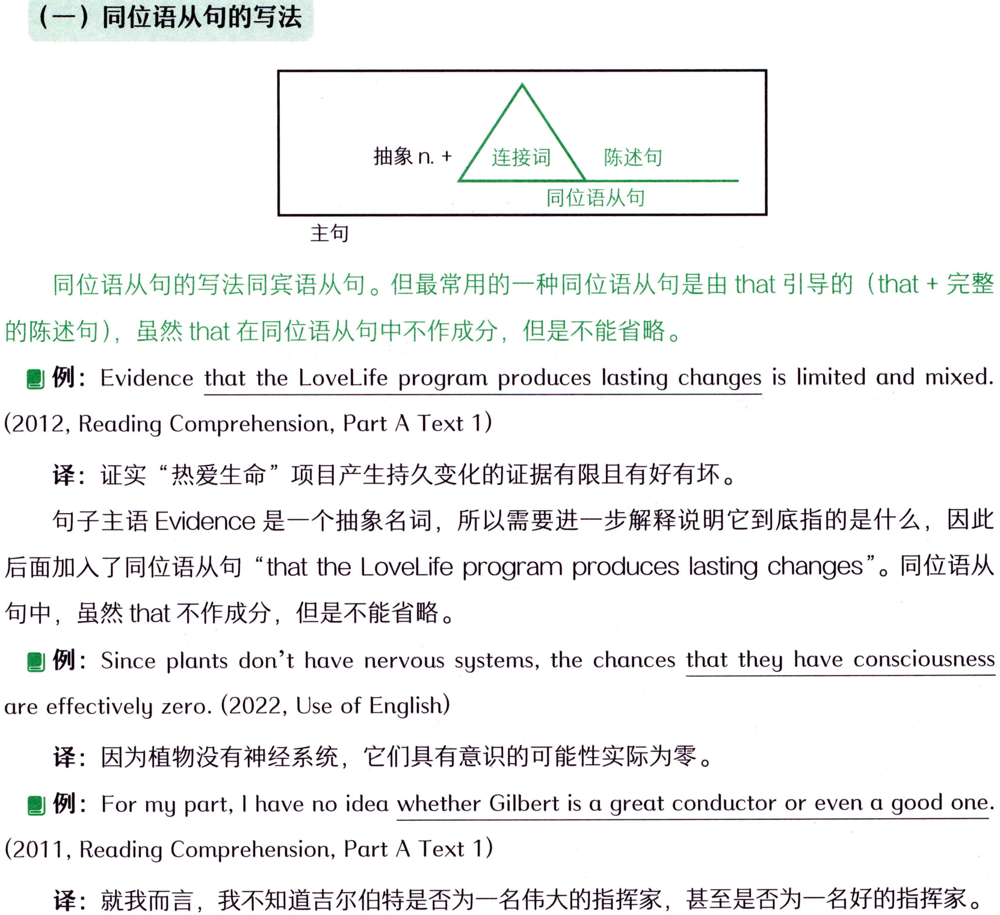

```text
（一）同位语从句的写法
抽象n.+
连接词
陈述句
同位语从句
主句
同位语从句的写法同宾语从句。但最常用的一种同位语从句是由that引导的（that+完整
的陈述句），虽然that在同位语从句中不作成分，但是不能省略。
 例: Evidence that the LoveLife program produces lasting changes is limited and mixed.
(2012, Reading Comprehension, Part A Text 1)
译：证实“热爱生命”项目产生持久变化的证据有限且有好有坏。
句子主语Evidence是一个抽象名词，所以需要进一步解释说明它到底指的是什么，因此
后面加入了同位语从句“that the LoveLife program produces lasting changes”。同位语从
句中，虽然that不作成分，但是不能省略。
例:Since plants don't have nervous systems,the chances that they have consciousness
are effectively zero. (2022, Use of English)
译：因为植物没有神经系统，它们具有意识的可能性实际为零。
例: For my part, I have no idea whether Gilbert is a great conductor or even a good one.
(2011, Reading Comprehension, Part A Text 1)
译：就我而言，我不知道吉尔伯特是否为一名伟大的指挥家，甚至是否为一名好的指挥家。
```

#### 词汇表


```text
transparent/traens'parant/adj.透明的，显而易见的
```

#### 概述

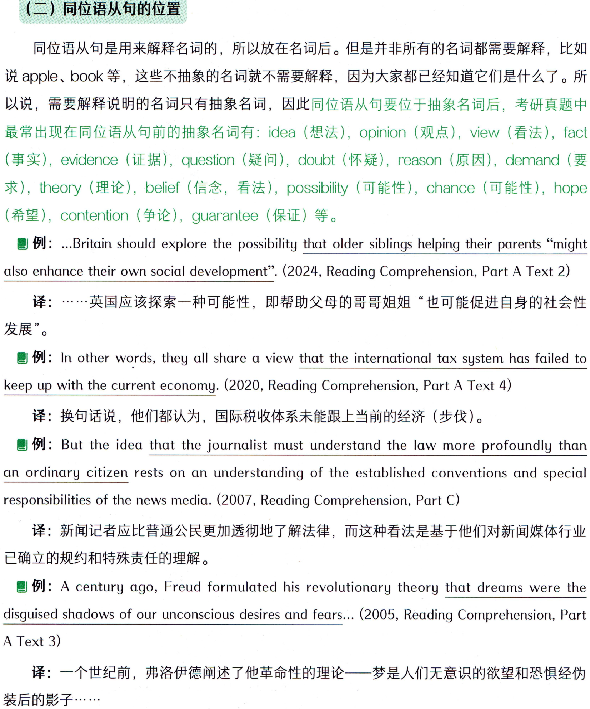

```text
同位语从句的位置
同位语从句是用来解释名词的，所以放在名词后。但是并非所有的名词都需要解释，比如
说 apple、book等，这些不抽象的名词就不需要解释，因为大家都已经知道它们是什么了。所
以说，需要解释说明的名词只有抽象名词，因此同位语从句要位于抽象名词后，考研真题中
最常出现在同位语从句前的抽象名词有：idea（想法），opinion（观点），view（看法），fact
(事实），evidence（证据），question（疑问），doubt（怀疑），reason（原因），demand（要
求），theory（理论），belief（信念，看法），possibility（可能性），chance（可能性），hope
（希望），contention（争论），guarantee（保证）等。
 例: ..Britain should explore the possibility that older siblings helping their parents “might
also enhance their own social development". (2024, Reading Comprehension, Part A Text 2)
译：·…英国应该探索一种可能性，即帮助父母的哥哥姐姐“也可能促进自身的社会性
发展”。
例: In other words, they all share a view that the international tax system has failed to
keep up with the current economy. (2020, Reading Comprehension, Part A Text 4)
译：换句话说，他们都认为，国际税收体系未能跟上当前的经济（步伐)。
例: But the idea that the journalist must understand the law more profoundly than
an ordinary citizen rests on an understanding of the established conventions and special
responsibilities of the news media. (2007, Reading Comprehension, Part C)
译：新闻记者应比普通公民更加透彻地了解法律，而这种看法是基于他们对新闻媒体行业
已确立的规约和特殊责任的理解。
例: A century ago, Freud formulated his revolutionary theory that dreams were the
disguised shadows of our unconscious desires and fears... (2005, Reading Comprehension, Part
A Text 3)
译：一个世纪前，弗洛伊德阐述了他革命性的理论一—梦是人们无意识的欲望和恐惧经伪
装后的影子····
```

### 【补充】有时一个长难句中不只包含一个名词性从句，此时可以根据连接词来找从句，并

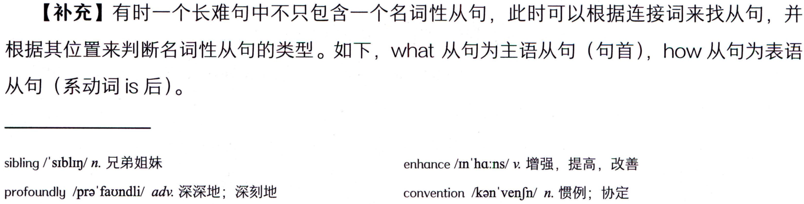

```text
【补充】有时一个长难句中不只包含一个名词性从句，此时可以根据连接词来找从句，并
根据其位置来判断名词性从句的类型。如下，what从句为主语从句（句首），how从句为表语
从句（系动词is后）。
sibling/siblin/n.兄弟姐妹
enhance/m'ha:ns/v.增强，提高，改善
profoundly/pra'faundli/adv.深深地；深刻地
convention/kan'venJn/n.惯例；协定
```

#### 词汇表

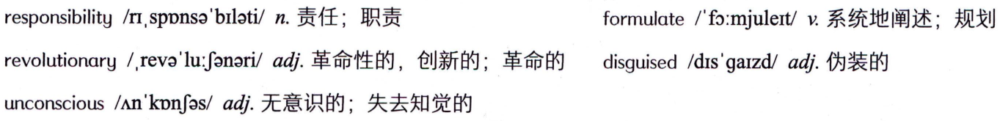

```text
responsibility/ri,sppnsa'bilati/n.责任；职责
formulate/fo:mjulert/v系统地阐述；规划
revolutionary/,reva'lu:Jonari/adj.革命性的，创新的；革命的
disguised/ds'gaizd/adj.伪装的
unconscious/an'kpnfas/adj.无意识的；失去知觉的
```

#### 概述

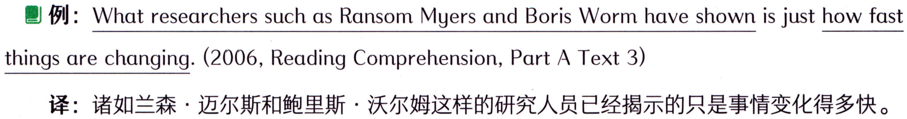

```text
例: What researchers such as Ransom Myers and Boris Worm have shown is just how fast
things are changing. (2006, Reading Comprehension, Part A Text 3)
译：诸如兰森·迈尔斯和鲍里斯·沃尔姆这样的研究人员已经揭示的只是事情变化得多快。
```

## Why telan 名词性从句?


```text
Why telan 名词性从句?
在考研真题中，当想详细说明某一个对象、概念或事情时，经常会使用到四种名词性从
句一宾语从句、表语从句、主语从句和同位语从句。例如：主语是句子中主要描述的对象，
通常是名词或代词来充当，但为了详细说明这个对象，随着表达信息的增多，就从“词一词
组一—句子”逐渐扩展，最后变成一个句子作主语，就出现了主语从句。其他名词性从句亦然。
因此，在考研写作中，想详细说明某一个对象、概念或事情时，一定会使用到名词性从
句，在稍后的考场攻略中会给大家讲解几种重要的名词性从句的写作模板。在阅读、翻译等题
型中也必然会考查到名词性从句，尤其是在长难句中，因此找到并看懂名词性从句至关重要。
内容要点
（1）名词性从句分为四类：宾语从句、表语从句、主语从句、同位语从句。
（2）名词性从句的写法基本相同：名词性从句=连接词+陈述句。
（后面的从句缺什么成分，则加上相应的连接词；如果从句不缺成分，则加that，
that在宾语从句中可以省略。）
陈述句
连接词
（3）名词性从句的位置不同
动单宾：及物动词+从句
动宾
动双宾：及物动词+人+从句
介宾
宾语从句
三种位置
形容词+宾语从句
表语从句
一种位置
系动词后（最常用的是be动词后）
名词性从句
句首
两种位置
主语从句
句尾（句首用形式主语it）
同位语从句一种位置
抽象名词后
真题演练
请用下划线标出句中的名词性从句，并根据位置判断是哪一种名词性从句。
1. In its latest survey of CEO pay, The Wall Street Journal finds that “a substantial part” of
executive pay is now tied to performance. (2019, Reading Comprehension, Part A Text 1)
2. Part of the issue is that the government did not anticipate the steep increase in airline
travel... (2017, Reading Comprehension, Part A Text 1)
3. The idea that "housing crisis” equals “concreted meadows" is pure lobby talk. (2016,
Reading Comprehension, Part A Text 2)
4. What was less visible then, however, were the new, positive forces... (2001, Reading
Comprehension, Passage 2)
5. There's no doubt that our peer groups exert enormous influence on our behavior. (2012,
Reading Comprehension, Part A Text 1)
6. Part of the problem is that many homeless adults are addicted to alcohol or drugs. (2006,
Use of English)
7. There's no question that the big are getting bigger and more powerful. (2001, Reading
Comprehension, Passage 4)
8. Ask anyone newly unemployed what they want and the answer is always: a job. (2014,
Reading Comprehension, Part A Text 1)
9. ...it is crucial that those new plants be environmentally sound. (2005, Reading
Comprehension, Part A Text 2)
10. It signals a change in what has, until now, been a key element of scientific endeavor.
(2008, Reading Comprehension, Part A Text 2)
11. The sobering aspect of Allen's book is that we have no one else to blame for our present
condition except ourselves. (2011, Reading Comprehension, Part C)
12. However, it has been found that even people insensitive to a certain smell at first can
suddenly become sensitive to it... (2005,Use of English)
13. One of the federal government's studies predicts that the number of the homeless will
reach nearly 19 million by the end of this decade. (2006, Use of English)
14. Is it true that the American intellectual is rejected and considered of no account in his
society? (2006, Reading Comprehension, Part C)
15.One basicweakness ina conservation systembasedwhollyon economic-motives
is that most members of the land community have no economic value. (2010, Reading
Comprehension, Part C)
16. But what we forget... is that happiness is more than pleasure without pain. (2006, Reading
Comprehension, Part A Text 4)
17. Spencer argued that all worldly phenomena, including human societies, changed over
time, advancing toward perfection. (2009, Reading Comprehension, Part B)
18. Even before Alan Greenspan's admission that America's red-hot economy is cooling,
lots of working folks had already seen signs of the slowdown themselves. (2004, Reading
Comprehension, Part A Text 3)
19. Two of the three objecting Justice—Samuel Alito and Clarence Thomasagreed with
this Constitutional logic but disagreed about which Arizona rules conflicted with the federal
statute. (2013, Reading Comprehension, Part A Text 4)
20. What has happened is that people cannot confess fully to their dreams... (2000, Reading
Comprehension, Passage 5)
我是一条答案的分隔线，请先不要偷看呦！
1. In its latest survey of CEO pay, The Wall Street Journal finds that “a substantial part” of
executive pay is now tied to performance. (2019, Reading Comprehension, Part A Text 1)
译：在针对首席执行官薪酬的最新调查中，《华尔街日报》发现，高管薪酬中有“相当大
一部分”如今与业绩紧密联系。
及物动词finds后，that引l出宾语从句。
2.Part of the issue is that the government did not anticipate the steepincrease in airline
travel... (2017, Reading Comprehension, Part A Text 1)
译：（排队）问题部分是因为政府未能预料到航空旅行的剧增·…
系动词is后，that引出表语从句。
3. The idea that “housing crisis” equals “concreted meadows" is pure lobby talk.(2016,
Reading Comprehension, Part A Text 2)
抽象名词idea后，that引出同位语从句表示解释说明。
4. What was less visible then, however, were the new, positive forces... (2001, Reading
Comprehension, Passage 2)
译：然而，在当时看来并不十分明显的东西已成为·新的积极因素。
What引出主语从句，位于句首。句中however是插入语，前后两个逗号隔开。
5. There's no doubt that our peer groups exert enormous influence on our behavior. (2012,
Reading Comprehension, Part A Text 1)
译：毫无疑问，同伴群体会对我们的行为产生巨大的影响。
抽象名词doubt后，that引l出同位语从句表示解释说明。
6. Part of the problem is that many homeless adults are addicted to alcohol or drugs. (2006,
Use of English)
译：部分问题是许多无家可归的成年人都对酒精或毒品成瘾。
系动词is后，that引出表语从句。
7. There's no question that the big are getting bigger and more powerful. (2001, Reading
Comprehension, Passage 4)
译：无疑，大企业正在变得更大、更强。
抽象名词question后，that引l出同位语从句表示解释说明。
8. Ask anyone newly unemployed what they want and the answer is always: a job. (2014,
Reading Comprehension, Part A Text 1)
译：询问任何一位刚失业的人他们想要什么，回答总是：一份工作。
及物动词 Ask后，先接了人（anyone newly unemployed）作为一个宾语，然后又接了
what引出的宾语从句作为另一个宾语，双宾语结构。
9. ...it is crucial that those new plants be environmentally sound. (2005, Reading
Comprehension,Part A Text 2)
译：………·那么重要的是，那些新发电厂应该是对环境无害的。
it是形式主语，that引出主语从句后置。
10. It signals a change in what has, until now, been a key element of scientific endeavor.
(2008, Reading Comprehension, Part A Text 2)
译：它标志着目前为止科学探索中一个关键因素的改变。
介词in后，what引引出宾语从句。
11. The sobering aspect of Allen's book is that we have no one else to blame for our present
condition except ourselves. (2011, Reading Comprehension, Part C)
译：艾伦书中发人深省的一面是，对于我们目前的状况，除了我们自己，我们不能责备
他人。
系动词is后，that引出表语从句。
12. However, it has been found that even people insensitive to a certain smell at first can
suddenly become sensitive to it... (2005, Use of English)
译：然而，研究发现，甚至是最初对某种气味不敏感的人，也会突然变得对它敏感起
来·.···
it是形式主语，that引l出主语从句后置。
（注意句中 found 虽然是及物动词，但后面的 that也不是它的宾语从句，因为 found 被变
成了被动的形式，所以它的宾语被提前了，那么后面的则不是宾语了。)
13. One of the federal government's studies predicts that the number of the homeless will
reach nearly 19 million by the end of this decade. (2006, Use of English)
译：联邦政府的一项研究预测，到这个十年结束的时候，无家可归者的数量将接近
1900万。
及物动词predicts后，that引出宾语从句。
14. ls it true that the American intellectual is rejected and considered of no account in his
society? (2006, Reading Comprehension, Part C)
译：美国的知识分子在社会中受到排斥且被认为是无足轻重的，这是真的吗？
it为形式主语，that引出主语从句后置。
15.One basicweakness in a conservation systembased wholly on economic motives is
that most members of the land community have no economic value. (201o, Reading
Comprehension, Part C)
译：完全基于经济动机的生态保护系统的一个基本缺点是，陆地群落中的大多数(生物)
成员都没有经济价值。
系动词is后，that引出表语从句。
16. But what we forget... is that happiness is more than pleasure without pain. (2006, Reading
Comprehension, Part A Text 4)
译：但是我们所忘记的….··是快乐不仅仅是没有痛苦的愉快。
what引l出主语从句，位于句首；系动词is后，that引出表语从句。
17. Spencer argued that all worldly phenomena, including human societies, changed over
time, advancing toward perfection. (2009, Reading Comprehension, Part B)
译：斯宾塞认为一切世间现象，包括人类社会，都随着时间而变化，并趋向完善。
及物动词 argued后，that引l出宾语从句。
18. Even before Alan Greenspan's admission that America's red-hot economy is cooling,
lots of working folks had already seen signs of the slowdown themselves. (2004, Reading
Comprehension, Part A Text 3)
译：甚至在艾伦·格林斯潘承认美国过热的经济正在冷却之前，许多上班族自己就已经看
出（经济）减速的迹象。
抽象名词admission后，that引出同位语从句表示解释说明。
19. Two of the three objecting Justice—Samuel Alito and Clarence Thomas—agreed with
this Constitutional logic but disagreed about which Arizona rules conflicted with the federal
statute. (2013, Reading Comprehension, Part A Text 4)
译：三位投反对票的法官中的两位一塞缪尔·阿利托和克拉伦斯·托马斯一赞同这一
宪法逻辑，但在亚利桑那州（移民）法案的哪些条款与联邦法规相冲突这一问题上存在分歧。
介词about后，which引l出宾语从句。
20. What has happened is that people cannot confess fully to their dreams... (2000, Reading
Comprehension, Passage 5)
译：事实是（发生的事情是）人们不能完全承认自己的梦想.…
What引l出主语从句，位于句首；系动词is后，that引出表语从句。
考场攻略
四种名词性从句都要重点掌握，考研英语的五大题型中都有考查，尤其在阅读、
写作和翻译中是必考的重点。
攻略1：掌握重要的名词性从句的句型模板
在考研真题中，经常考查几个重要的名词性从句的句型模板，掌握了这几个模板
之后，可以帮助大家在文章中更轻松地看懂意思，在写作中提高分数。
句型模板1：tisdone+主语从句.（表达人们对一件事的观点或看法）
在表达观点或看法时，我们按照中文表达的习惯首先会想到“1thinkthat.（我
认为……….）” 或“People  say  that.（人们说 ……...）"，这些句型从语法上来讲是正确
的，但从表意上来讲不够符合英语强调客观的逻辑思维，因为以人来开头的句子会给
人一种比较主观的感觉。所以在表达观点或看法时，在英语中通常会把如上句子变为
被动语态，“It is thought that.. （ .….·被认为)” 或“It is said that... （ .…...·被说，即据
说……）”，It作形式主语，指代后面that主语从句中表达的这件事，变为被动之后就
是事情作主语，更符合英语客观式的逻辑思维。
如上句型模板很容易操作，注意以下几个要点。
形式主语It不变。
·助动词is可以换成不同的时态，如果表达“现在”的观点用is；如果表达“过去”
的观点用was；如果表达“从过去到现在一直”的观点用hasbeen；如果表达
“过去的之前”的观点还可以用hadbeen。
·动词done可以换成任意表达“发出观点”的动词，例如：Itisproposed/argued/
said/believed/noted/acknowledged..，表示“这事被提议/被认为/被说/被相
信/被注意到／被承认……”，当然也可以按照中文的习惯翻译为主动的“（人们）
提议/认为/说/相信/注意到/承认·.
“that+任意陈述句”都可以构成主语从句，表达针对任何事情的观点。当然主语
从句也可以不用that来引导，只不过that用得最多。
例: This year, it was proposed that the system be changed... (2013, Reading
Comprehension, Part B)
译：今年，有人提议改变这个体系
例: It was argued at the end of the 19th century that humans do not cry because
they are sad... (2011, Use of English)
译：19世纪末（有人）认为，人类不是因为悲伤而哭泣……
句型模板2：Itis+adj./n.+主语从句.（表达对一件事的评价）
如上模板中adj/n.表示对后面主语从句这件事的评价；而is和主语从句的用法同
句型模板1。
例: Second, it is surely a good thing that the money and attention come to
science rather than go elsewhere. (2014, Reading Comprehension, Part A Text 3)
译：其次，资金和注意力投向科学而不是其他领域，这当然是一件好事。
```

#### 词汇表

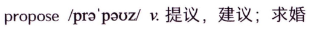

```text
propose/pra'pauz/v.提议，建议；求婚
```

#### 概述

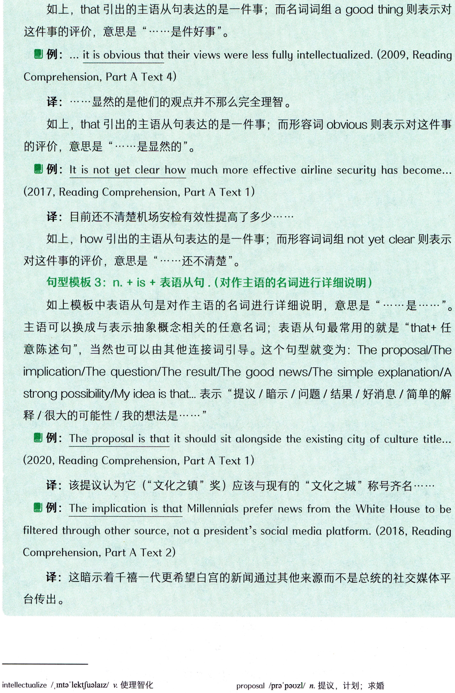

```text
如上， that 引出的主语从句表达的是一件事; 而名词词组 a good thing 则表示对
这件事的评价，意思是“………·是件好事”。
例: .. it is obvious that their views were less fully intellectualized. (2009, Reading
Comprehension, Part A Text 4)
译：…….….显然的是他们的观点并不那么完全理智。
如上，that引出的主语从句表达的是一件事；而形容词obvious则表示对这件事
的评价，意思是“.………·是显然的”。
例: It is not yet clear how much more effective airline security has become...
(2017, Reading Comprehension, Part A Text 1)
译：目前还不清楚机场安检有效性提高了多少…
如上，how引出的主语从句表达的是一件事；而形容词词组notyetclear则表示
对这件事的评价，意思是“…….还不清楚”。
句型模板3：n.+is+表语从句.（对作主语的名词进行详细说明）
如上模板中表语从句是对作主语的名词进行详细说明，意思是
“…….…是·….….
主语可以换成与表示抽象概念相关的任意名词；表语从句最常用的就是“that+任
意陈述句”，当然也可以由其他连接词引导。这个句型就变为：The proposal/The
implication/The question/The result/The good news/The simple explanation/A
strong possibility/My idea is that.表示“提议 / 暗示/ 问题 / 结果/ 好消息/简单的解
释/很大的可能性／我的想法是·….
 例: The proposal is that it should sit alongside the existing city of culture title...
(2020, Reading Comprehension, Part A Text 1)
译：该提议认为它（“文化之镇”奖）应该与现有的“文化之城”称号齐名…
 例: The implication is that Millennials prefer news from the White House to be
filtered through other source, not a president's social media platform. (2018, Reading
Comprehension, Part A Text 2)
译：这暗示着千禧一代更希望白宫的新闻通过其他来源而不是总统的社交媒体平
台传出。
intellectualize/Imtalektfualaiz/v使理智化
proposal /pra'pauzl/ n.提议，计划；求婚
```

#### 词汇表

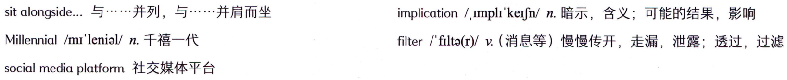

```text
sit alongside...与.....并列，与...并肩而坐
implication/.Implr'kerfn/n.暗示，含义；可能的结果，影响
Millennial/mrlenial/n.千禧一代
filter/filta(r)/v（消息等）慢慢传开，走漏，泄露；透过，过滤
social media platform 社交媒体平台
```

#### 概述

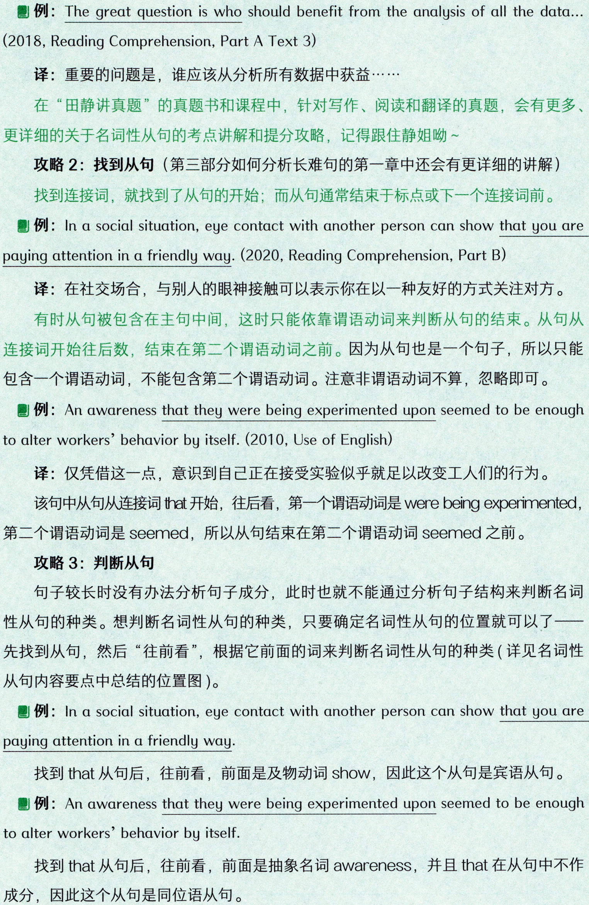

```text
 例: The great question is who should benefit from the analysis of all the data...
(2018, Reading Comprehension, Part A Text 3)
译：重要的问题是，谁应该从分析所有数据中获益…….
在“田静讲真题”的真题书和课程中，针对写作、阅读和翻译的真题，会有更多、
更详细的关于名词性从句的考点讲解和提分攻略，记得跟住静姐呦～
攻略2：找到从句（第三部分如何分析长难句的第一章中还会有更详细的讲解）
找到连接词，就找到了从句的开始；而从句通常结束于标点或下一个连接词前。
例: In a social situation, eye contact with another person can show that you are
paying attention in a friendly way. (2020, Reading Comprehension, Part B)
译：在社交场合，与别人的眼神接触可以表示你在以一种友好的方式关注对方。
有时从句被包含在主句中间，这时只能依靠谓语动词来判断从句的结束。从句从
连接词开始往后数，结束在第二个谓语动词之前。因为从句也是一个句子，所以只能
包含一个谓语动词，不能包含第二个谓语动词。注意非谓语动词不算，忽略即可。
 例: An awareness that they were being experimented upon seemed to be enough
to alter workers' behavior by itself. (2010, Use of English)
译：仅凭借这一点，意识到自己正在接受实验似乎就足以改变工人们的行为。
该句中从句从连接词that开始，往后看，第一个谓语动词是werebeingexperimented，
第二个谓语动词是seemed，所以从句结束在第二个谓语动词seemed之前。
攻略3：判断从句
句子较长时没有办法分析句子成分，此时也就不能通过分析句子结构来判断名词
性从句的种类。想判断名词性从句的种类，只要确定名词性从句的位置就可以了一
先找到从句，然后“往前看”，根据它前面的词来判断名词性从句的种类（详见名词性
从句内容要点中总结的位置图）。
例: In a social situation, eye contact with another person can show that you are
paying attention in a friendly way.
找到that从句后，往前看，前面是及物动词show，因此这个从句是宾语从句。
 例: An awareness that they were being experimented upon seemed to be enough
to alter workers' behavior by itself.
找到that从句后，往前看，前面是抽象名词awareness，并且that在从句中不作
成分，因此这个从句是同位语从句。
```

#### 词汇表


```text
benefitfrom...从...获益
the analysis of allthe data所有数据的分析
eyecontact目光接触
ina social situation在社交场合
alter/o:lta/v.改变
```
