# 第三节 状语从句

## Whatis 状语从句?

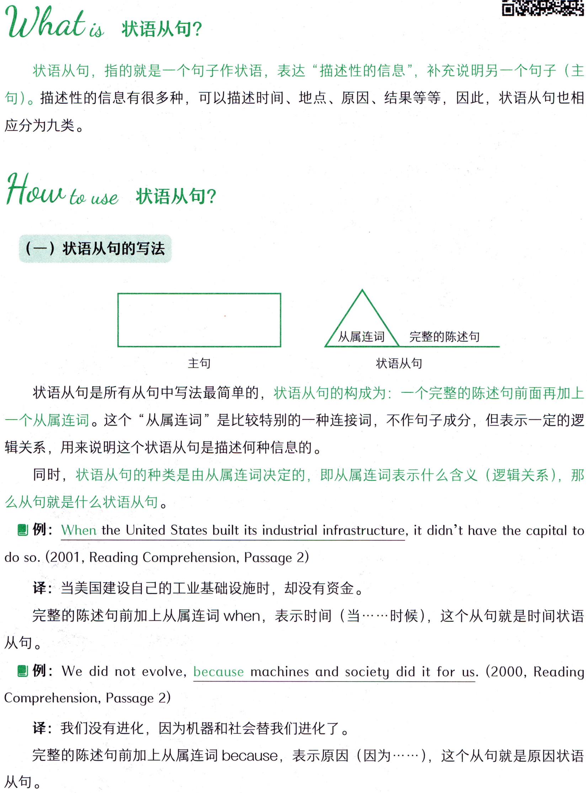

```text
Whatis 状语从句?
状语从句，指的就是一个句子作状语，表达“描述性的信息”，补充说明另一个句子（主
句）。描述性的信息有很多种，可以描述时间、地点、原因、结果等等，因此，状语从句也相
应分为九类。
）状语从句的写法
从属连词
完整的陈述句
主句
状语从句
状语从句是所有从句中写法最简单的，状语从句的构成为：一个完整的陈述句前面再加上
一个从属连词。这个“从属连词”是比较特别的一种连接词，不作句子成分，但表示一定的逻
辑关系，用来说明这个状语从句是描述何种信息的。
同时，状语从句的种类是由从属连词决定的，即从属连词表示什么含义（逻辑关系），那
么从句就是什么状语从句。
例: When the United States built its industrial infrastructure, it didn't have the capital to
do so. (2001, Reading Comprehension, Passage 2)
译：当美国建设自己的工业基础设施时，却没有资金。
完整的陈述句前加上从属连词when，表示时间（当.….·时候），这个从句就是时间状语
从句。
例: We did not evolve, because machines and society did it for us. (2000, Reading
Comprehension, Passage 2)
译：我们没有进化，因为机器和社会替我们进化了。
完整的陈述句前加上从属连词because，表示原因（因为.…..…·），这个从句就是原因状语
从句。
```

#### 词汇表

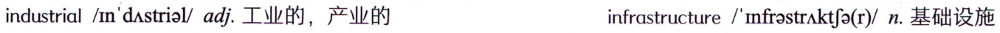

```text
industrial/n'dAstrialadj.工业的，产业的
infrastructure/'infrastraktfo(r)/n.基础设施
```

#### 概述

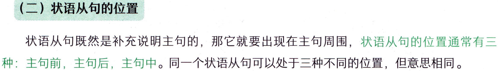

```text
）状语从句的位置
状语从句既然是补充说明主句的，那它就要出现在主句周围，状语从句的位置通常有三
种：主句前，主句后，主句中。同一个状语从句可以处于三种不同的位置，但意思相同。
```

#### 1.主句前

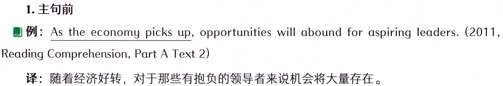

```text
1.主句前
例: As the economy picks up, opportunities will abound for aspiring leaders. (2011,
Reading Comprehension, Part A Text 2)
译：随着经济好转，对于那些有抱负的领导者来说机会将大量存在。
```

#### 2.主句后

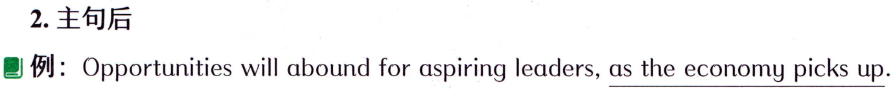

```text
2.主句后
 例: Opportunities will abound for aspiring leaders, as the economy picks up.
```

#### 3.主句中

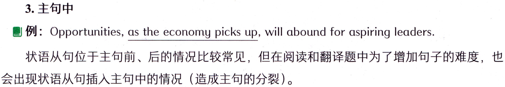

```text
3.主句中
 例: Opportunities, as the economy picks up, will abound for aspiring leaders.
状语从句位于主句前、后的情况比较常见，但在阅读和翻译题中为了增加句子的难度，也
会出现状语从句插入主句中的情况(造成主句的分裂)。
```

### 【补充】个别状语从句只能位于主句后，例如稍后会讲到的such/so..that..，Sothat..，in

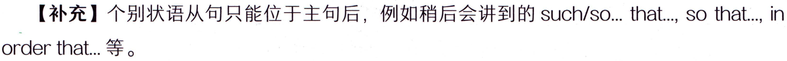

```text
【补充】个别状语从句只能位于主句后，例如稍后会讲到的such/so..that..，Sothat..，in
order that...等。
```

### （三）状语从句的分类

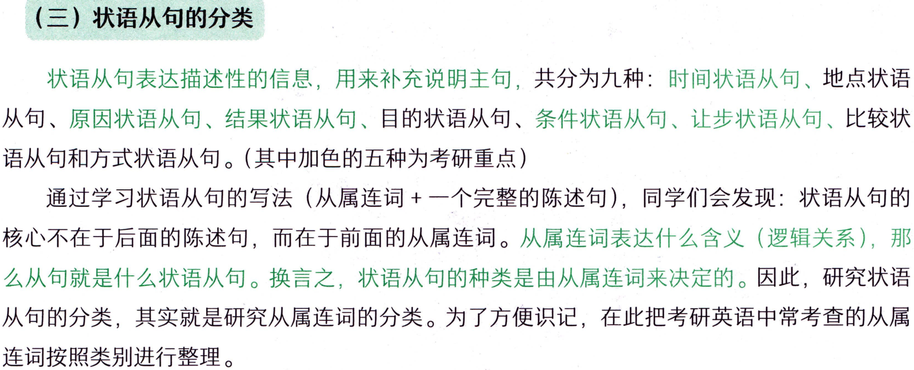

```text
（三）状语从句的分类
状语从句表达描述性的信息，用来补充说明主句，共分为九种：时间状语从句、地点状语
从句、原因状语从句、结果状语从句、目的状语从句、条件状语从句、让步状语从句、比较状
语从句和方式状语从句。(其中加色的五种为考研重点)
通过学习状语从句的写法（从属连词+一个完整的陈述句），同学们会发现：状语从句的
核心不在于后面的陈述句，而在于前面的从属连词。从属连词表达什么含义（逻辑关系），那
么从句就是什么状语从句。换言之，状语从句的种类是由从属连词来决定的。因此，研究状语
从句的分类，其实就是研究从属连词的分类。为了方便识记，在此把考研英语中常考查的从属
连词按照类别进行整理。
```

#### 1.时间状语从句

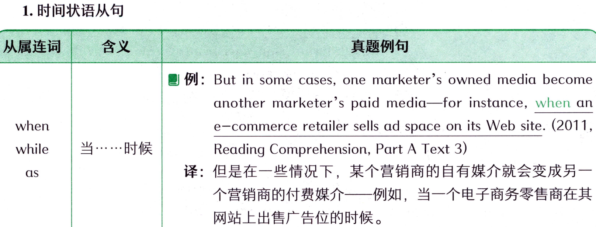

```text
1.时间状语从句
从属连词
含义
真题例句
例: But in some cases, one marketer's owned media become
another marketer'spaid media—forinstance，when an
when
e-commerce retailer sells ad space onits Web site.(2011,
当…时候
Reading Comprehension,Part A Text 3)
while
译：但是在一些情况下，某个营销商的自有媒介就会变成另一
as
个营销商的付费媒介一—例如，当一个电子商务零售商在其
网站上出售广告位的时候。
```

#### 词汇表


```text
opportunity/.ope'tju:nati/n.机会，时机
abound/a'baond/v.大量存在；充满，富于
```

#### 概述

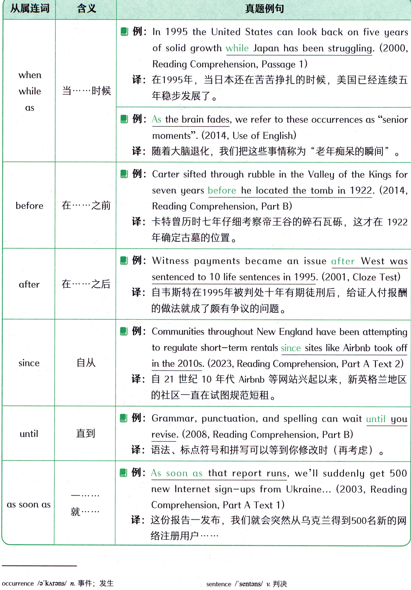

```text
含义
从属连词
真题例句
例: In 1995 the United States can look back on five years
of solid growth while Japan has been struggling. (2000,
Reading Comprehension, Passage 1)
when
译：在1995年，当日本还在苦苦挣扎的时候，美国已经连续五
当…时候
while
年稳步发展了。
SD
例: As the brain fades, we refer to these occurrences as “senior
moments". (2014, Use of English)
译：随着大脑退化，我们把这些事情称为“老年痴呆的瞬间”
例： Carter sifted through rubble in the Valley of the Kings for
seven years before he located the tomb in 1922. (2014,
在…之前
before
Reading Comprehension, Part B)
译：卡特曾历时七年仔细考察帝王谷的碎石瓦砾，这才在1922
年确定古墓的位置。
例: Witness payments became an issue after West was
sentenced to 10 life sentences in 1995. (2001, Cloze Test)
在之后
after
译：自韦斯特在1995年被判处十年有期徒刑后，给证人付报酬
的做法就成了颇有争议的问题。
例: Communities throughout New England have been attempting
to regulate short-term rentals since sites like Airbnb took off
自从
since
in the 2010s. (2023, Reading Comprehension, Part A Text 2)
译：自21世纪10年代Airbnb等网站兴起以来，新英格兰地区
的社区一直在试图规范短租。
例: Grammar, punctuation, and spelling can wait until you
直到
until
revise. (2008, Reading Comprehension, Part B)
译：语法、标点符号和拼写可以等到你修改时（再考虑）。
例: As soon as that report runs, we'll suddenly get 500
new Internet sign-ups from Ukraine... (2003, Reading
Comprehension, Part A Text 1)
SDUOOSSD
就...
译：这份报告一发布，我们就会突然从乌克兰得到500名新的网
络注册用户.·
occurrence /a'kArans/n.事件；发生
sentence /sentans/v.判决
```

#### 词汇表

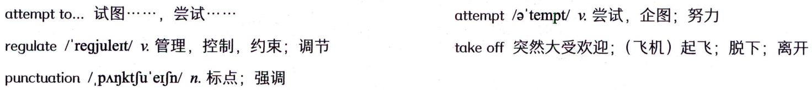

```text
attempt.t...试图....，．试..
attempt/s'tempt/v.尝试，企图；努力
regulate/regjulert/v管理，控制，约束；调节
takeoff突然大受欢迎；（飞机）起飞；脱下；离开
punctuation/.panktfu'eifn/n.标点；强调
```

#### 概述

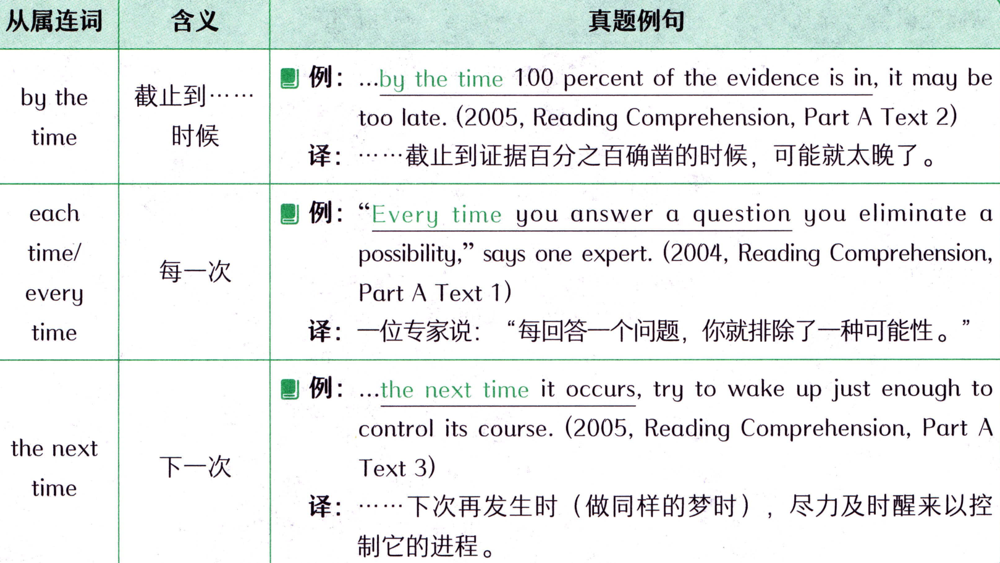

```text
含义
从属连词
真题例句
例: .by the time 100 percent of the evidence is in, it may be
截止到.
by the
too late. (2005, Reading Comprehension, Part A Text 2)
时候
time
译：·…·截止到证据百分之百确凿的时候，可能就太晚了。
例: “Every time you answer a question you eliminate a
each
possibility,”’ says one expert. (2004, Reading Comprehension,
time/
每一次
Part A Text 1)
every
译：一位专家说：“每回答一个问题，你就排除了一种可能性。”
time
例: ...the next time it occurs, try to wake up just enough to
control its course. (2005, Reading Comprehension, Part A
the next
下一次
Text 3)
time
译：……下次再发生时（做同样的梦时），尽力及时醒来以控
制它的进程。
```

#### 2.地点状语从句

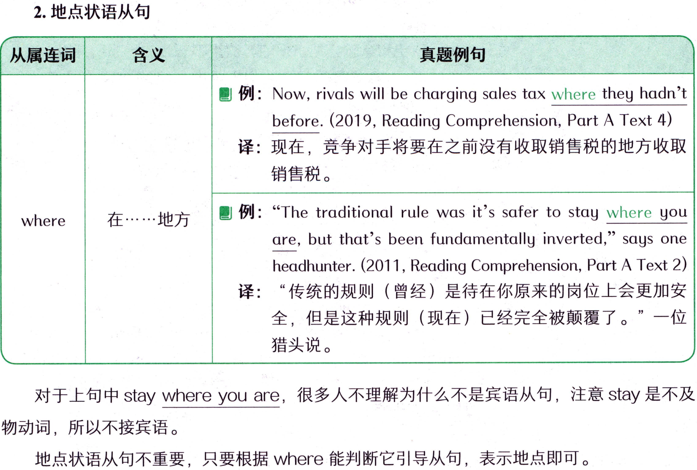

```text
2.地点状语从句
含义
真题例句
从属连词
例: Now, rivals will be charging sales tax where they hadn't
before. (2019, Reading Comprehension, Part A Text 4)
译：现在，竞争对手将要在之前没有收取销售税的地方收取
销售税。
例：“The traditional rule was it's safer to stay where you
在…·…地方
where
are, but that's been fundamentally inverted,” says one
headhunter. (2011, Reading Comprehension, Part A Text 2)
译：“传统的规则（曾经）是待在你原来的岗位上会更加安
全，但是这种规则（现在）已经完全被颠覆了。”一位
猎头说。
对于上句中 stay where you are，很多人不理解为什么不是宾语从句，注意 stay是不及
物动词，所以不接宾语。
地点状语从句不重要，只要根据where能判断它引导从句，表示地点即可。
```

#### 词汇表

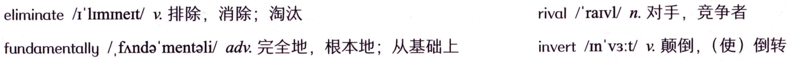

```text
eliminate/r'limimeit/v.排除，消除；淘汰
rival/rarvl/n.对手，竞争者
invert/Imn'v3:t/v颠倒，（使）倒转
fundamentally/.fAnda'mentali/adv.完全地，根本地；从基础上
```

#### 3.原因状语从句

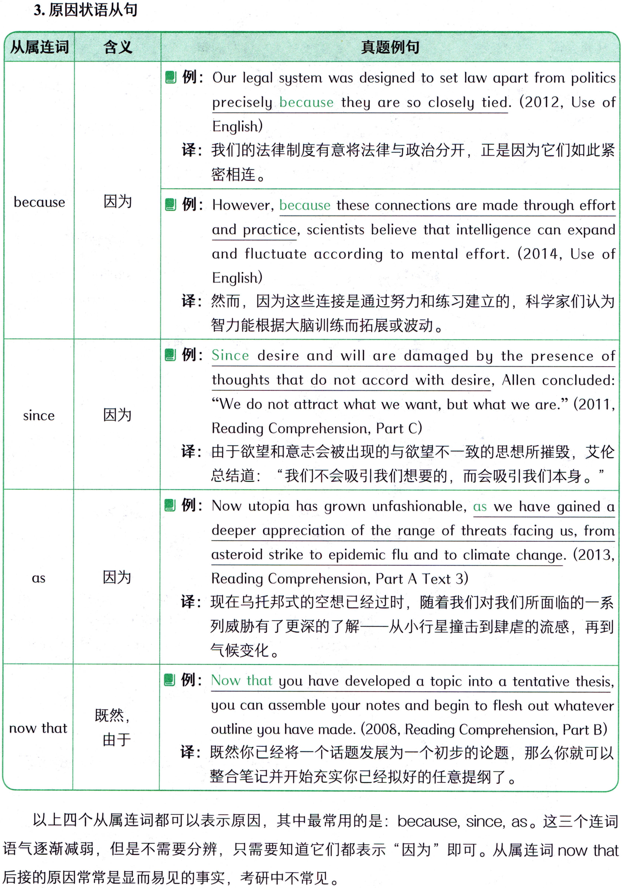

```text
3.原因状语从句
含义
从属连词
真题例句
例: Our legal system was designed to set law apart from politics
precisely because they are so closely tied. (2012, Use of
English)
译：我们的法律制度有意将法律与政治分开，正是因为它们如此紧
密相连。
因为
because
例： However, because these connections are made through effort
and practice, scientists believe that intelligence can expand
and fluctuate according to mental effort. (2014, Use of
English)
译：然而，因为这些连接是通过努力和练习建立的，科学家们认为
智力能根据大脑训练而拓展或波动。
例: Since desire and will are damaged by the presence of
thoughts that do not accord with desire, Allen concluded:
"We do not attract what we want, but what we are." (2011,
因为
since
Reading Comprehension, Part C)
译：由于欲望和意志会被出现的与欲望不一致的思想所摧毁，艾伦
总结道：“我们不会吸引我们想要的，而会吸引我们本身。”
例: Now utopia has grown unfashionable, as we have gained a
deeper appreciation of the range of threats facing us, from
asteroid strike to epidemic flu and to climate change. (2013,
因为
Reading Comprehension, Part A Text 3)
SD
译：现在乌托邦式的空想已经过时，随着我们对我们所面临的一系
列威胁有了更深的了解一—从小行星撞击到肆虐的流感，再到
气候变化。
J例: Now that you have developed a topic into a tentative thesis,
you can assemble your notes and begin to flesh out whatever
既然，
now that
outline you have made. (2008, Reading Comprehension, Part B)
由于
译：既然你已经将一个话题发展为一个初步的论题，那么你就可以
整合笔记并开始充实你已经拟好的任意提纲了。
以上四个从属连词都可以表示原因，其中最常用的是：because,since，as。这三个连词
语气逐渐减弱，但是不需要分辨，只需要知道它们都表示“因为”即可。从属连词nowthat
后接的原因常常是显而易见的事实，考研中不常见。
```

#### 词汇表

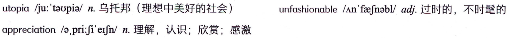

```text
utopia/ju:'taupia/n.乌托邦（理想中美好的社会）
unfashionable/An'faefnabl/adj.过时的，不时髦的
appreciation/o.pri:jfi'erfn/n.理解，认识；欣赏；感激
```

#### 4.结果状语从句

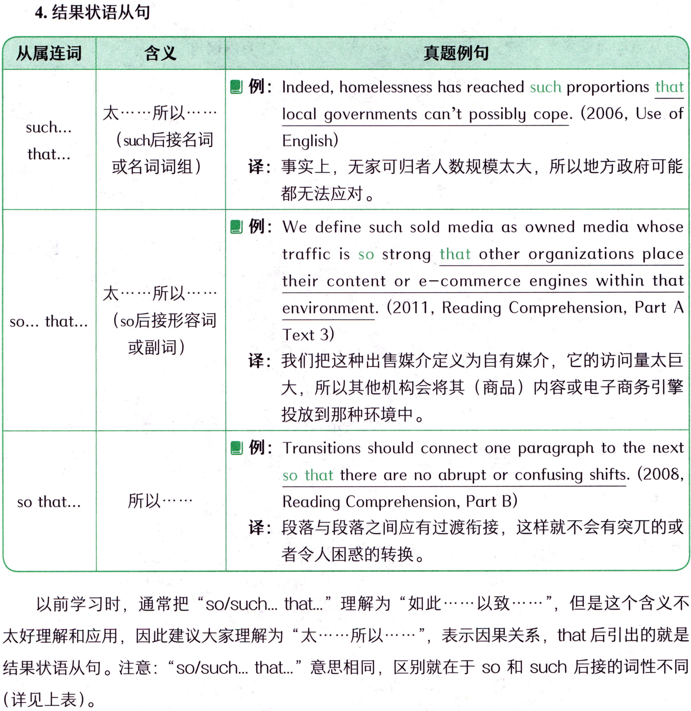

```text
4.结果状语从句
含义
从属连词
真题例句
例: Indeed, homelessness has reached such proportions that
太.…..…·所以……
local governments can't possibly cope. (2006, Use of
such...
(such后接名词
English)
that...
或名词词组)
译：事实上，无家可归者人数规模太大，所以地方政府可能
都无法应对。
例:Wedefine such sold media asowned media whose
traffic is sostrong that other organizations place
their content or e-commerce engines within that
太..·所以.
environment. (2011, Reading Comprehension, Part A
(so后接形容词
so... that...
Text 3)
或副词)
译：我们把这种出售媒介定义为自有媒介，它的访问量太巨
大，所以其他机构会将其（商品）内容或电子商务引擎
投放到那种环境中。
例：Transitions should connect one paragraph to the next
so that there are no abrupt or confusing shifts. (2008,
所以……
Reading Comprehension, Part B)
so that...
译：段落与段落之间应有过渡衔接，这样就不会有突兀的或
者令人困惑的转换。
太好理解和应用，因此建议大家理解为“太…….…·所以……..”，表示因果关系，that后引出的就是
结果状语从句。注意：“so/such...that...”意思相同，区别就在于so和such后接的词性不同
(详见上表)。
```

#### 5.目的状语从句

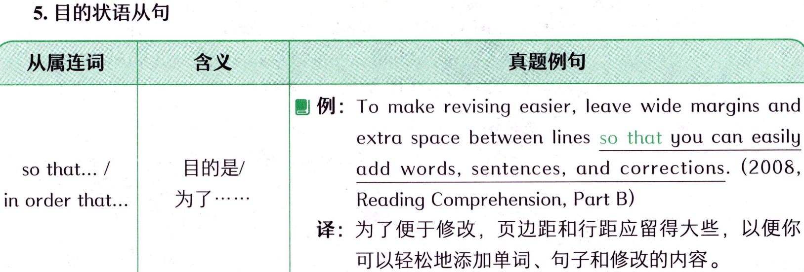

```text
5.目的状语从句
含义
真题例句
从属连词
例：To make revising easier,leave wide margins and
extra space between lines so that you can easily
目的是/
add words, sentences, and corrections. (2008,
so that... /
为了…….
Reading Comprehension, Part B)
in order that...
译：为了便于修改，页边距和行距应留得大些，以便你
可以轻松地添加单词、句子和修改的内容。
```

#### 词汇表

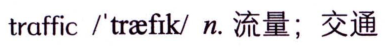

```text
traffic/'traefik/n.流量；交通
```

#### 概述

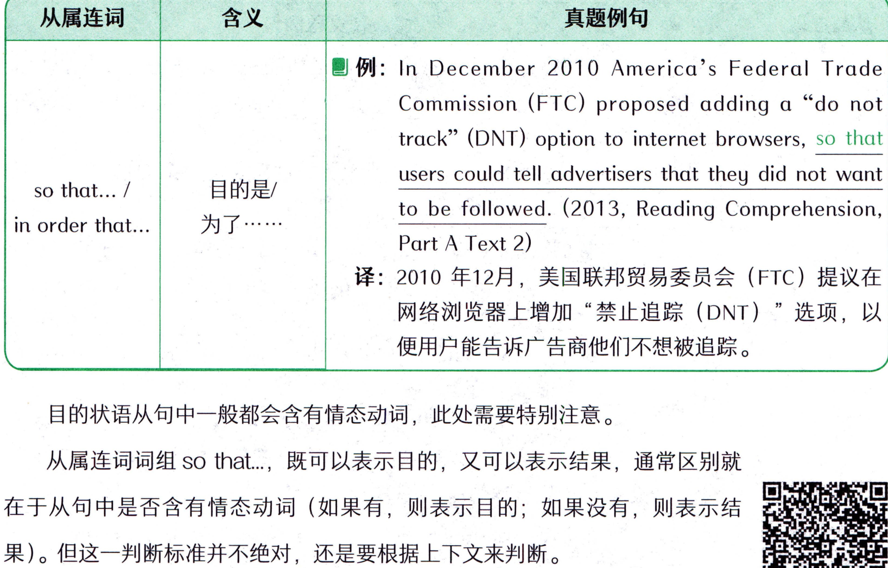

```text
含义
从属连词
真题例句
例:In December 2010 America's Federal Trade
Commission (FTC) proposed adding a “do not
track" (DNT) option to internet browsers, so that
users could tell advertisers that they did not want
so that... /
目的是/
to be followed. (2013, Reading Comprehension,
为了……
in order that...
Part A Text 2)
译：2010年12月，美国联邦贸易委员会（FTC）提议在
网络浏览器上增加“禁止追踪（DNT）”选项，以
便用户能告诉广告商他们不想被追踪。
目的状语从句中一般都会含有情态动词，此处需要特别注意。
从属连词词组sOthat.，既可以表示目的，又可以表示结果，通常区别就
在于从句中是否含有情态动词（如果有，则表示目的；如果没有，则表示结
果)。但这一判断标准并不绝对，还是要根据上下文来判断。
```

#### 6.条件状语从句

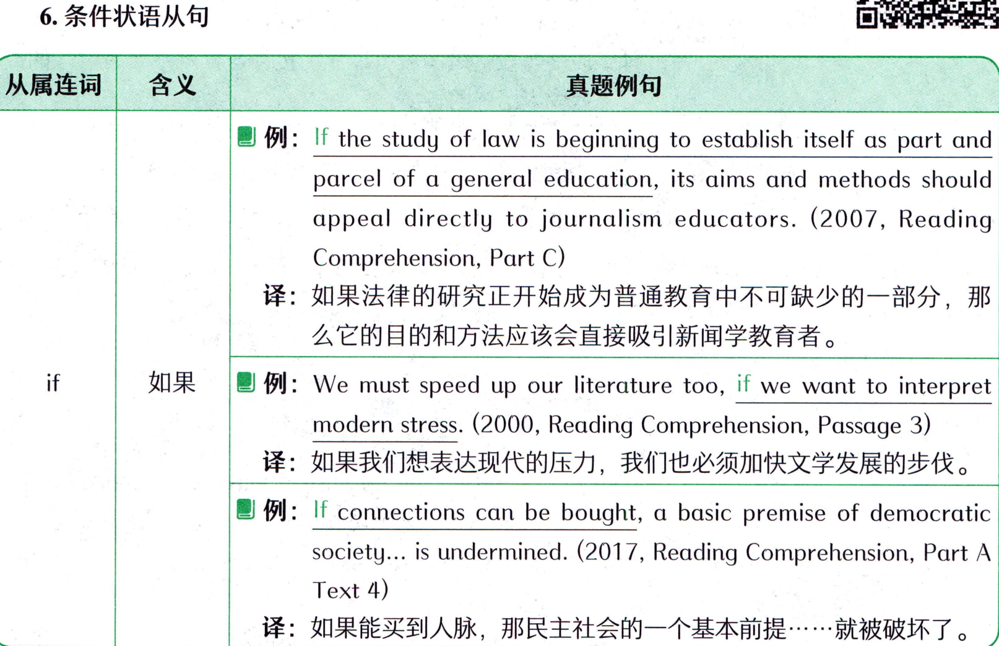

```text
6.条件状语从句
含义
从属连词
真题例句
例: If the study of law is beginning to establish itself as part and
parcel of a general education, its aims and methods should
appeal directly to journalism educators. (2007, Reading
Comprehension, Part C)
译：如果法律的研究正开始成为普通教育中不可缺少的一部分，那
么它的目的和方法应该会直接吸引新闻学教育者。
如果
例: We must speed up our literature too, if we want to interpret 
if
modern stress. (2000, Reading Comprehension, Passage 3)
译：如果我们想表达现代的压力，我们也必须加快文学发展的步伐。
例: If connections can be bought, a basic premise of democratic
society... is undermined. (2017, Reading Comprehension, Part A
Text 4)
译：如果能买到人脉，那民主社会的一个基本前提.…·.·-就被破坏了。
```

#### 词汇表

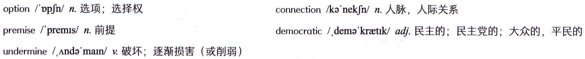

```text
option/ppfin/n.选项；选择权
connection/ka'nekfn/n.人脉，人际关系
premise/premis/n.前提
democratic/.dema'kraetik/adj.民主的；民主党的；大众的，平民的
undermine/.Anda'main/v破坏；逐渐损害（或削弱）
```

#### 概述

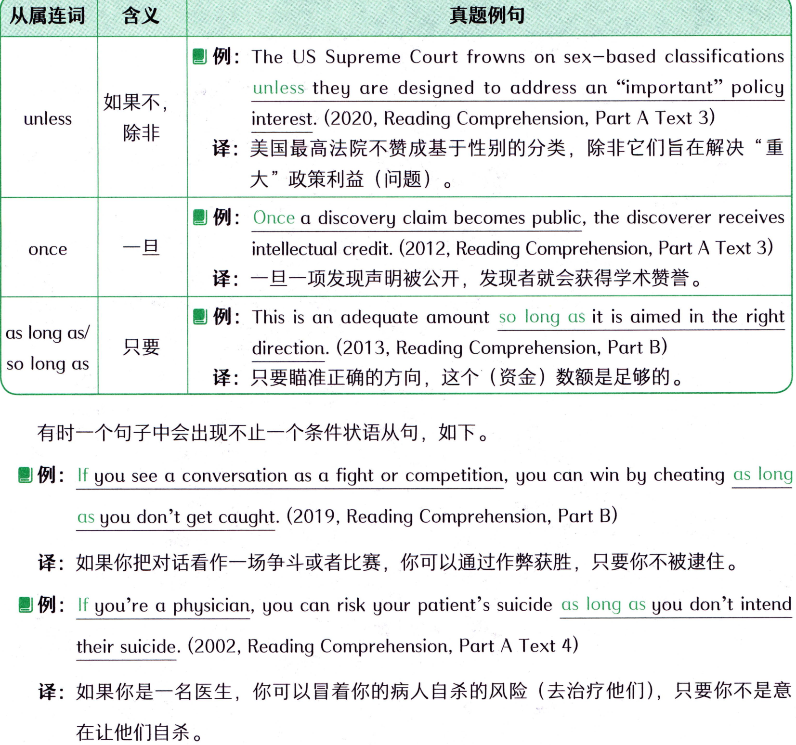

```text
含义
真题例句
从属连词
例:The US Supreme Court frowns on sex-based classifications
unless they are designed to address an “important” policy
如果不，
interest. (2020, Reading Comprehension, Part A Text 3)
unless
除非
译：美国最高法院不赞成基于性别的分类，除非它们旨在解决“重
大”政策利益（问题）。
例: Once a discovery claim becomes public, the discoverer receives
intellectual credit. (2012, Reading Comprehension, Part A Text 3)
一旦
once
译：一旦一项发现声明被公开，发现者就会获得学术赞誉。
例: This is an adequate amount so long as it is aimed in the right
as long as/
只要
direction. (2013, Reading Comprehension, Part B)
so long as
译：只要瞄准正确的方向，这个（资金）数额是足够的。
有时一个句子中会出现不止一个条件状语从句，如下。
例: lf you see a conversation as a fight or competition, you can win by cheating as long
as you don't get caught. (2019, Reading Comprehension, Part B)
译：如果你把对话看作一场争斗或者比赛，你可以通过作弊获胜，只要你不被逮住。
例: If you're a physician, you can risk your patient's suicide as long as you don't intend
their suicide. (2002, Reading Comprehension, Part A Text 4)
译：如果你是一名医生，你可以冒着你的病人自杀的风险（去治疗他们)，只要你不是意
在让他们自杀。
```

#### 7.让步状语从句

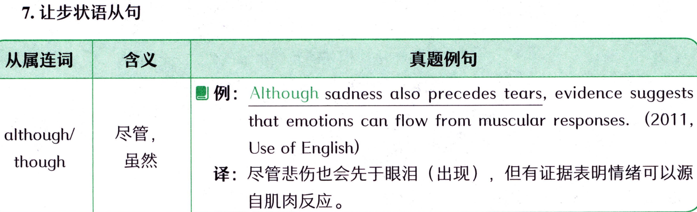

```text
7.让步状语从句
从属连词
含义
真题例句
例:Although sadness also precedes tears,evidence suggests
that emotions can flow from muscular responses. (2011,
although/
尽管，
Use of English)
虽然
though
译：尽管悲伤也会先于眼泪（出现），但有证据表明情绪可以源
自肌肉反应。
```

#### 词汇表

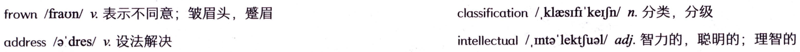

```text
classfication /.klaesifi'keijn/n.分类，分级
frown/fraun/v.表示不同意；皱眉头，眉
intellectual/,Into'lektfual/adj.智力的，聪明的；理智的
address/a'dres/v设法解决
```

#### 概述

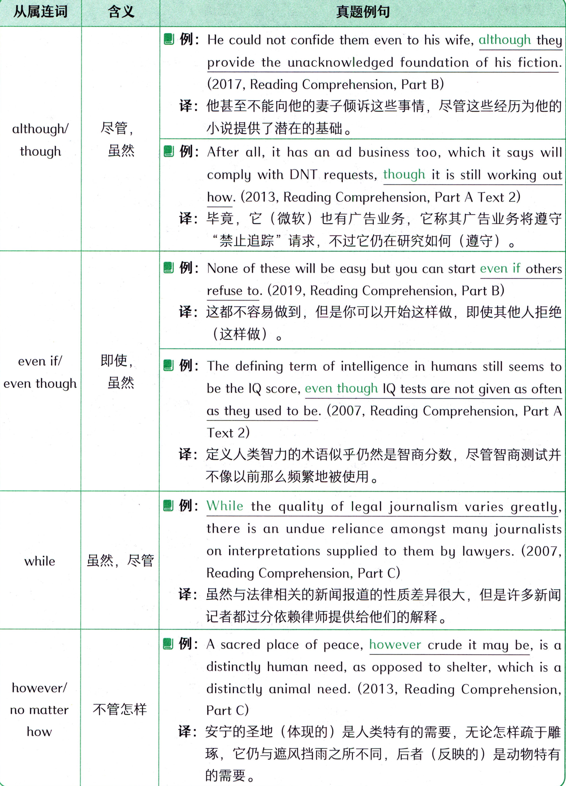

```text
含义
从属连词
真题例句
例: He could not confide them even to his wife, although they
provide the unacknowledged foundation of his fiction.
(2017, Reading Comprehension, Part B)
译：他甚至不能向他的妻子倾诉这些事情，尽管这些经历为他的
尽管，
小说提供了潜在的基础。
although/
虽然
例: After all, it has an ad business too, which it says will
though
comply with DNT requests, though it is still working out
how. (2013, Reading Comprehension, Part A Text 2)
译：毕竟，它（微软）也有广告业务，它称其广告业务将遵守
“禁止追踪”请求，不过它仍在研究如何（遵守）。
例: None of these will be easy but you can start even if others
refuse to. (2019, Reading Comprehension, Part B)
译：这都不容易做到，但是你可以开始这样做，即使其他人拒绝
（这样做）。
即使,
even if/
例： The defining term of intelligence in humans still seems to
虽然
even though
be the IQ score, even though IQ tests are not given as often
as they used to be. (2007, Reading Comprehension, Part A
Text 2)
译：定义人类智力的术语似乎仍然是智商分数，尽管智商测试并
不像以前那么频繁地被使用。
例:While the quality of legal journalism varies greatly,
there is an undue reliance amongst many journalists
oninterpretations supplied tothembylawyers.(2007,
虽然，尽管
while
Reading Comprehension, Part C)
译：虽然与法律相关的新闻报道的性质差异很大，但是许多新闻
记者都过分依赖律师提供给他们的解释。
例: A sacred place of peace, however crude it may be, is a
distinctly human need, as opposed to shelter, which is a
however/
distinctly animal need. (2013, Reading Comprehension,
不管怎样
Part C)
no matter
how
译：安宁的圣地（体现的）是人类特有的需要，无论怎样疏于雕
琢，它仍与遮风挡雨之所不同，后者（反映的）是动物特有
的需要。
```

#### 词汇表

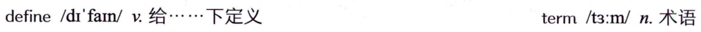

```text
define/di'fain/v.给....下定义
term/t3:m/n.术语
```

#### 概述

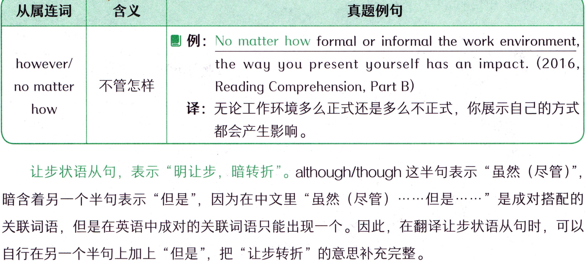

```text
从属连词
含义
真题例句
例：No matter how formal or informal the work environment,
the way you present yourself has an impact. (2016,
however/
不管怎样
Reading Comprehension, Part B)
no matter
译：无论工作环境多么正式还是多么不正式，你展示自己的方式
how
都会产生影响。
让步状语从句，表示“明让步，暗转折”。although/though 这半句表示“虽然（尽管）”,
暗含着另一个半句表示“但是”，因为在中文里“虽然（尽管）·但是……”是成对搭配的
关联词语，但是在英语中成对的关联词语只能出现一个。因此，在翻译让步状语从句时，可以
自行在另一个半句上加上“但是”，把“让步转折”的意思补充完整。
```

#### 8.比较状语从句

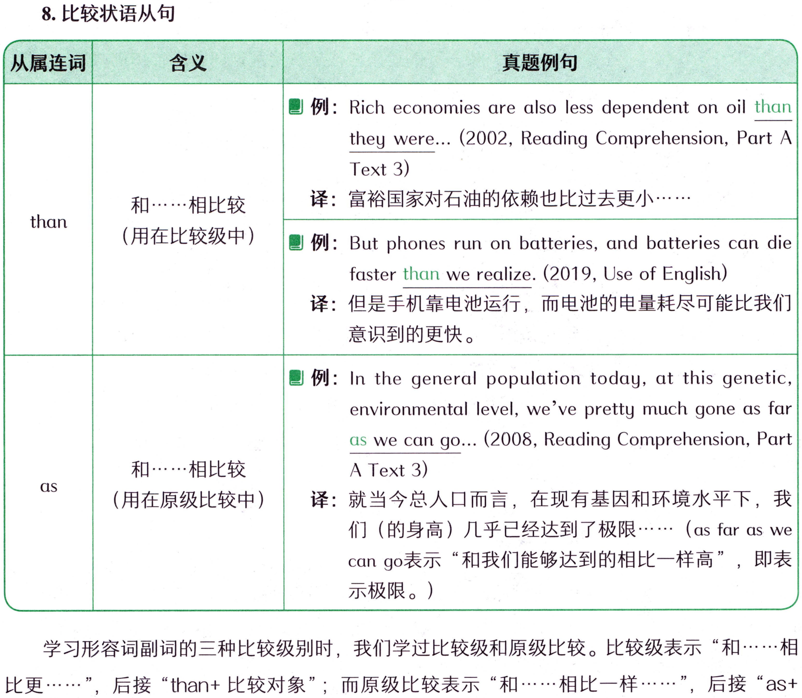

```text
8.比较状语从句
从属连词
含义
真题例句
例：Rich economies are also less dependent on oil than
they were... (2002, Reading Comprehension, Part A
Text 3)
译：富裕国家对石油的依赖也比过去更小…··
和……相比较
than
(用在比较级中)
例: But phones run on batteries, and batteries can die
faster than we realize. (2019, Use of English)
译：但是手机靠电池运行，而电池的电量耗尽可能比我们
意识到的更快。
例:In the general population today, at this genetic,
environmental level,we've pretty much gone as far
as we can go... (2008, Reading Comprehension, Part
和.….相比较
A Text 3)
SD
译：就当今总人口而言，在现有基因和环境水平下，我
（用在原级比较中）
们（的身高）几乎已经达到了极限.…..…：（asfaraswe
can go表示“和我们能够达到的相比一样高”，即表
示极限。)
学习形容词副词的三种比较级别时，我们学过比较级和原级比较。比较级表示“和………相
比更...…”，后接“than+比较对象”；而原级比较表示“和..…·相比一样.……"，后接“as+
```

#### 词汇表

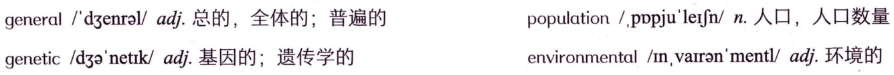

```text
general/d3enral/adj.总的，全体的；普遍的
population/pppju'lerjn/n.人口，人口数量
genetic/d3a'netk/adj.基因的；遗传学的
environmental/in,vairan'mentl/adj.环境的
```

#### 概述

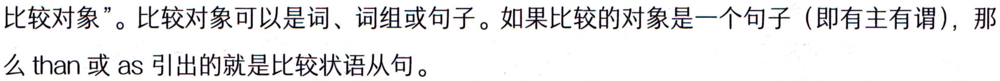

```text
比较对象”。比较对象可以是词、词组或句子。如果比较的对象是一个句子（即有主有谓)，那
么than或as引出的就是比较状语从句。
```

#### 9.方式状语从句

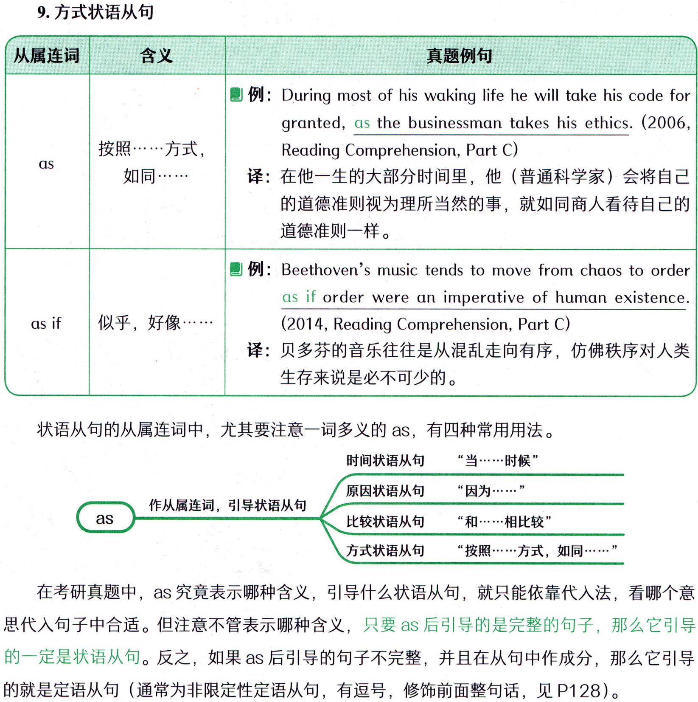

```text
9.方式状语从句
含义
真题例句
从属连词
例: During most of his waking life he will take his code for
granted, as the businessman takes his ethics. (2006,
按照…·方式，
Reading Comprehension, Part C)
as
如同………
译：在他一生的大部分时间里，他（普通科学家）会将自己
的道德准则视为理所当然的事，就如同商人看待自己的
道德准则一样。
例: Beethoven's music tends to move from chaos to order
as if order were an imperative of human existence.
似乎，好像…··.
as if
(2014, Reading Comprehension, Part C)
译：贝多芬的音乐往往是从混乱走向有序，仿佛秩序对人类
生存来说是必不可少的。
状语从句的从属连词中，尤其要注意一词多义的aS，有四种常用用法。
“当…时候”
时间状语从句
“因为……”
原因状语从句
作从属连词，引导状语从句
as
“和…相比较”
比较状语从句
“按照………·方式，如同·…”
方式状语从句
在考研真题中，aS 究竟表示哪种含义，引导什么状语从句，就只能依靠代入法，看哪个意
思代入句子中合适。但注意不管表示哪种含义，只要 aS后引导的是完整的句子，那么它引导
的一定是状语从句。反之，如果 as后引导的句子不完整，并且在从句中作成分，那么它引导
的就是定语从句（通常为非限定性定语从句，有逗号，修饰前面整句话，见P128）。
```

## Why te lean 状语从句?


```text
Why te lean 状语从句?
状语从句是对主句的补充说明，而且由于状语从句可以表示很多内容的补充，例如：时
间/地点／原因/结果/条件/让步.…：，所以在考研真题中经常会出现一个主句搭配了多个状
语从句的情况。想看懂多个状语从句表达的意思，或者说想看懂主句和状语从句之间的逻辑关
系，那么重点就是要掌握9类从属连词，因为从属连词表示什么意思，整个状语从句就表示哪
方面的内容。
在完形填空中，考查根据上下文内容，选择合适的从属连词填入空格。在阅读、翻译和新
题型中，考查根据从属连词判断上下文的逻辑关系。在写作中，表述补充说明的信息也经常使
用到各种状语从句，例如常写的时间、原因、结果和条件状语从句等。
内容要点
（1）状语从句的概述
1）状语从句的含义：一个句子作状语，表达描述性的信息。
2）状语从句的写法：从属连词+一个完整的陈述句。
3）状语从句的位置：主句前、主句后、主句中。
（2）状语从句的分类共九种，属于哪种类型，取决于从属连词的含义（重点掌握
从属连词的表格）。
真题演练
请用下划线标出状语从句的部分，并判断其种类。
1. When this practice first started decades ago, it was usually limited to
freshmen,to give them a second chance to take a class in their first year if they struggled in
their transition to college-level courses. (2019, Reading Comprehension, Part A Text 2)
2. Previous studies on CSR have had trouble differentiating these effects because consumers
can be affected by all three. (2016, Reading Comprehension, Part A Text 3)
3. Now,boy babies survive almost as well as girls do. (20oo,Reading Comprehension,
Passage 2)
4. “But we are taught instead to ‘decide', just as our president calls himself ‘the Decider'"
(2009, Reading Comprehension,Part A Text 1)
5. The history of the EEOB began long before its foundations were laid. (2018, Reading
Comprehension,Part B)
6. ..the old and infirm “have a duty to die and get out of the way”, so that younger, healthier
people can realize their potential. (2003, Reading Comprehension,Part A Text 4)
7. Furthermore,in the early days of longline fishing, a lot of fish were lost to sharks after they
had been hooked. (2006, Reading Comprehension, Part A Text 3)
8. Open-source spying does have its risks, of course, since it can be difficult to tell good
information from bad. (2003, Reading Comprehension, Part A Text 1)
9. ...they're dealing with so many more things that they become worn out from it more visibly
and sooner. (2008, Reading Comprehension, Part A Text 1)
10. If it's their vacation home anyway, and it's just empty, why can't you make money off it?
(2023, Reading Comprehension, Part A Text 2)
11. Now researchers suspect that dreams are part of the mind's emotional thermostat,
regulating moods while the brain is “off-line". (2005, Reading Comprehension, Part A Text3)
12. Although the figure may vary, analysts do agree on another matter: that the number of
the homeless is increasing. (2006, Use of English)
13. As soon as you awaken, identify what is upsetting about the dream. (2005, Reading
Comprehension, Part A Text3)
14. Moreover, IQ tests do not necessarily predict so well once populations or situations change.
(2007, Reading Comprehension, Part A Text 2)
15. More than 60,0o0 people have purchased the PTKs since they first became available
16. And home appliances will also become so smart that controlling and operating them will
result in the breakout of a new psychological disorder-—kitchen rage. (2001, Translation)
17. When the competitive environment pushed our ancestors to achieve that potential, they
could in turn afford more education. (2009, Reading Comprehension, Part A Text 3)
18. The White House argued that Arizona's laws conflicted with its enforcement priorities,
even if state laws complied with federal statutes to the letter. (2013, Reading Comprehension,
Part A Text 4)
19. Labour likewise wants to discontinue local planning where councils oppose development.
(2016, Reading Comprehension, Part A Text 2)
20. But fewer students want to study humanities subjects: English departments awarded more
bachelor's degrees in 1970-71 than they did 20 years later. (2011, Reading Comprehension,
Part B)
我是一条答案的分隔线，请先不要偷看呦！
1. When this practice first started decades ago, it was usually limited to freshmen, to give
them a second chance to take a class in their first year if they struggled in their transition to
college-level courses. (2019, Reading Comprehension, Part A Text 2)
译：这种做法在数十年前刚开始推行时，通常仅限于大一新生，如果他们在向大学水平课
程过渡的过程中很艰难，（这种做法）给他们一次在第一学年重修课程的机会。
此句中有两个状语从句：从属连词when表示“当….…时候”，引出时间状语从句；从属
连词if表示“如果”，引出条件状语从句。
2.Previous studies on CSR have had trouble differentiating these effects because consumers
can be affected by all three. (2016, Reading Comprehension, Part A Text 3)
译：以前关于企业社会责任的研究很难区分这些影响，因为消费者可能同时受到这三种
（影响）。
从属连词because 表示“因为”，引出原因状语从句。
3. Now, boy babies survive almost as well as girls do. (2000, Reading Comprehension, Passage 2)
译：现在男婴的存活率基本和女婴一样。
从属连词as表示“和·…..…·相比较”，引出比较状语从句。
4. “"But we are taught instead to ‘decide', just as our president calls himself “the Decider'."
(2009, Reading Comprehension, Part A Text 1)
译：“但是我们被教导‘去做决定’，正如我们的总统称他自己为‘决策者’一样。”
从属连词as表示“按照……..…·方式”，引出方式状语从句。
5. The history of the EEOB began long before its foundations were laid. (2018, Reading
Comprehension, Part B)
译：艾森豪威尔行政办公楼的历史在其打下地基之前就开始了。
从属连词before表示“在.…..…之前”，引l出时间状语从句。
6. ...the old and infirm “have a duty to die and get out of the way", so that younger, healthier
people can realize their potential. (2003, Reading Comprehension, Part A Text 4)
译：…·年老体弱者“有义务死去和让位”，以便让更年轻、更健康的人可以实现他们的
潜能。
，
7. Furthermore, in the early days of longline fishing, a lot of fish were lost to sharks after they
had been hooked. (2006, Reading Comprehension, Part A Text 3)
译：此外，在使用多钩长线捕鱼的初期，许多鱼在被钩住后又被鲨鱼夺走了。
从属连词after表示“在……之后”，引出时间状语从句。
8. Open-source spying does have its risks, of course, since it can be difficult to tell good
information from bad. (2003, Reading Comprehension, Part A Text 1)
译：当然，开源间谍活动确实有其风险，因为区分情报的真伪可能是困难的。
从属连词 since 表示“因为”，引出原因状语从句。
9. ...they're dealing with so many more things that they become worn out from it more visibly
and sooner. (2008, Reading Comprehension, Part A Text 1)
译：·….她们正在应对如此多的事情，以至于她们更明显且更快地变得筋疲力尽。
从属连词词组sO...that..表示“太.….…·所以……...”，引出结果状语从句。
10. If it's their vacation home anyway, and it's just empty, why can't you make money off it?
(2023, Reading Comprehension, Part A Text 2)
译：如果这是他们的度假屋，而且恰好空置，那么他们为什么不能靠它赚钱呢？
从属连词f 表示“如果”，引出条件状语从句。注意此处的If 从句中包含了两个小句子,
由and并列在一起。
11. Now researchers suspect that dreams are part of the mind's emotional thermostat,
regulating moods while the brain is “off-line”. (2005, Reading Comprehension, Part A Text 3)
译：现在，研究人员认为梦是大脑情绪自动调节系统的一部分，当大脑处于“离线”状态
时，（梦）对情绪进行调节。
从属连词while表示“当.……·时候”，引出时间状语从句。
12. Although the figure may vary, analysts do agree on another matter: that the number of
the homeless is increasing. (2006, Use of English)
译：尽管（估计的）数字可能不尽相同，但是分析家们在另一个问题上意见一致：无家可
归者的数量正在不断增加。
从属连词although表示“尽管”，引出让步状语从句。
13. As soon as you awaken, identify what is upsetting about the dream. (2005, Reading
Comprehension, Part A Text 3)
译：你一醒来就（立刻）确定梦中什么使你困扰。
从属连词词组 as sOon as 表示“一..就...”，引出时间状语从句。
14. Moreover, IQ tests do not necessarily predict so well once populations or situations change.
(2007, Reading Comprehension, Part A Text 2)
译：此外，一旦（受试）群体或环境发生变化，智商测试未必能预测得那么准确。
从属连词once 表示“一旦”，引出条件状语从句。
15. More than 60,000 people have purchased the PTKs since they first became available
without prescriptions last year.. (2009, Reading Comprehension, Part A Text 2)
译：自从去年不需要处方就可以购买以来，超过6万人已经购买了PTK·…
从属连词since表示“自从”，引出时间状语从句。
16. And home appliances will also become so smart that controlling and operating them will
result in the breakout of a new psychological disorder—-kitchen rage. (2001, Translation)
译：家用电器将会变得太智能化，所以控制和操作它们会引发一种新的心理疾病一—厨房
狂躁症。
从属连词词组so...that...表示“太.…….所以..…..”，引出结果状语从句。
17. When the competitive environment pushed our ancestors to achieve that potential, they
could in turn afford more education. (2009, Reading Comprehension, Part A Text 3)
译：当竞争的环境迫使我们的祖先去实现这种潜能时，他们反过来又能负担得起更多教育。
从属连词When表示“当.……·时候”，引出时间状语从句。
18. The White House argued that Arizona's laws conflicted with its enforcement priorities,
even if state laws complied with federal statutes to the letter. (2013, Reading Comprehension,
Part A Text 4)
译：白宫辩称，亚利桑那州的法律与其执法优先权相冲突，尽管州法律一字不差地遵守联
邦法规。
从属连词evenif表示“即使”，引出让步状语从句。
19. Labour likewise wants to discontinue local planning where councils oppose development.
(2016, Reading Comprehension, Part A Text 2)
译：工党同样希望在地方议会反对开发的地方终止地方规划。
从属连词where表示“在.…·地方”，引出地点状语从句。
20. But fewer students want to study humanities subjects: English departments awarded more
bachelor's degrees in 1970-71 than they did 20 years later. (2011, Reading Comprehension,
Part B)
译：但是，想学习人文学科的学生却越来越少了：英语系在1970一1971年之间授予的
学士学位比它们在20年之后（授予的学士学位）要更多。
从属连词than表示“和.….…相比较”，引出比较状语从句。
考场攻略
九种状语从句建议重点掌握时间、原因、结果、条件和让步状语从句。
状语从句的重点是从属连词。
攻略1：完形填空中，选择从属连词
考研的完形填空题中，有一类就是考查从属连词的选择，此时需要看懂上下文的
意思，然后根据意思判断上下文的逻辑关系，即选择合适的从属连词。
例: The court cannot maintain its legitimacy as guardian of the rule of law when
justices behave like politicians. (2012, Use of English)
译：当法官表现得像政客时，法院无法维持其作为法治卫士的合法性。
例: It did not matter what was done in the experiment; so long as something was
changed, productivity rose. (2010, Use of English)
译：实验中做了什么并不重要；只要有变化，生产力就会提高。
 例: All these conditions tend to increase the probability of a child committing a
criminal act, although a direct causal relationship has not yet been established. (2004,
Use of English)
译：所有这些情况往往会增加青少年犯罪的可能性，尽管（其中的）直接因果关
系尚未确定。
攻略2：根据从属连词，判断上下文的逻辑关系
考研真题中的句子普遍比较长，因此在考场中想节省时间，就要首先学会理清句
子间的逻辑关系，而不要纠缠于细节。遇到状语从句时，只要抓住从属连词，就能立
刻判断出句子大概描述哪方面的信息。
例: Because our conscious mind is occupied with daily life we don't always think
about the emotional significance of the day's events-until, it appears, we begin to
dream. (2005, Reading Comprehension, Part A Text 3)
译：因为我们清醒时的头脑被日常生活占据着，所以我们不会总考虑白天发生的
事情对我们情绪的重要意义一—似乎，直到我们开始做梦（才会考虑）。
一看到从属连词 because 和 until， 马上就可以判断它们分别引导的是原因状语从
句和时间状语从句，那么不用仔细看细节，就可以大概判断出这个句子的结构是这样
的：“原因十主句+时间"，即表示“因为………·（所以）主句….·直到·….…."
 例: Even if a job's starting salary seems too small to satisfy an emerging adult's
need for rapid content, the transition from school to work can be less of a setback if
the start-up adult is ready for the move. (2007, Reading Comprehension, Part B)
译：即使工作起薪看起来太低，难以满足一个即将成年的孩子对快速（得到）满
足的需求，（但是）如果准成年人做好了转变的准备，那么从校园到职场的过渡（所遭
遇的）挫折可能更少一些。
```

#### 词汇表

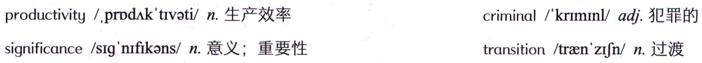

```text
productivity/.prodak'tivati/n.生产效率
criminal/kriminl/adj.犯罪的
significance/sig'nrfikans/n.意义；重要性
transition/traen'zijn/n.过渡
```

#### 概述

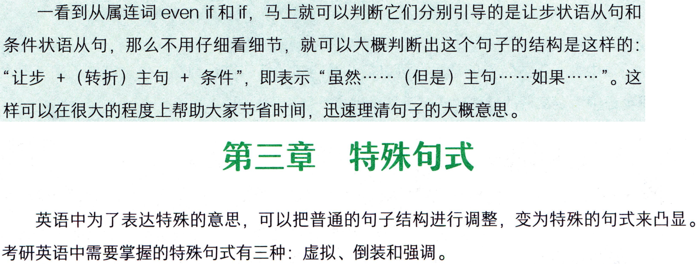

```text
一看到从属连词evenif和if，马上就可以判断它们分别引导的是让步状语从句和
条件状语从句，那么不用仔细看细节，就可以大概判断出这个句子的结构是这样的：
“让步+（转折）主句+条件”，即表示“虽然…………（但是）主句…….如果………”。这
样可以在很大的程度上帮助大家节省时间，迅速理清句子的大概意思。
第三章特殊句式
英语中为了表达特殊的意思，可以把普通的句子结构进行调整，变为特殊的句式来凸显。
考研英语中需要掌握的特殊句式有三种：虚拟、倒装和强调。
```
