# 第二节 定语从句

## Uuhatis 定语从句?

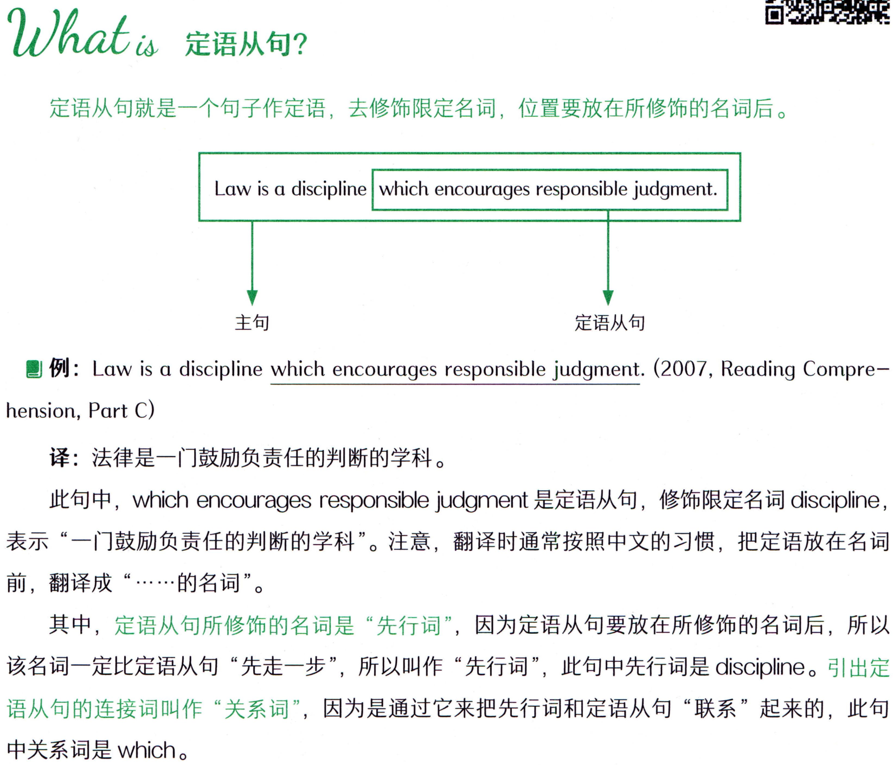

```text
Uuhatis 定语从句?
定语从句就是一个句子作定语，去修饰限定名词，位置要放在所修饰的名词后。
Law is a discipline
which encourages responsible judgment.
主句
定语从句
例: Law is a discipline which encourages responsible judgment. (2007, Reading Compre-
hension, Part C)
译：法律是一门鼓励负责任的判断的学科。
此句中，which encourages responsible judgment 是定语从句，修饰限定名词 discipline,
表示“一门鼓励负责任的判断的学科”。注意，翻译时通常按照中文的习惯，把定语放在名词
前，翻译成“.….…·的名词”。
其中，定语从句所修饰的名词是“先行词”，因为定语从句要放在所修饰的名词后，所以
该名词一定比定语从句“先走一步”，所以叫作“先行词”，此句中先行词是discipline。引出定
语从句的连接词叫作“关系词”，因为是通过它来把先行词和定语从句“联系”起来的，此句
中关系词是which。
```

### 【补充】定语从句中的关系词有两个作用：一是“引导”，引导定语从句，连接从句和先行

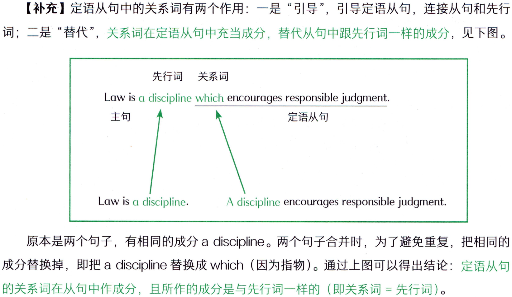

```text
【补充】定语从句中的关系词有两个作用：一是“引导”，引导定语从句，连接从句和先行
词；二是“替代”，关系词在定语从句中充当成分，替代从句中跟先行词一样的成分，见下图。
先行词关系词
Law is a discipline which encourages responsible judgment.
主句
定语从句
Law is a discipline.
A discipline encourages responsible judgment.
原本是两个句子，有相同的成分a discipline。两个句子合并时，为了避免重复，把相同的
成分替换掉，即把a discipline 替换成 which（因为指物）。通过上图可以得出结论：定语从句
的关系词在从句中作成分，且所作的成分是与先行词一样的（即关系词=先行词）。
```

## How te use 定语从句?

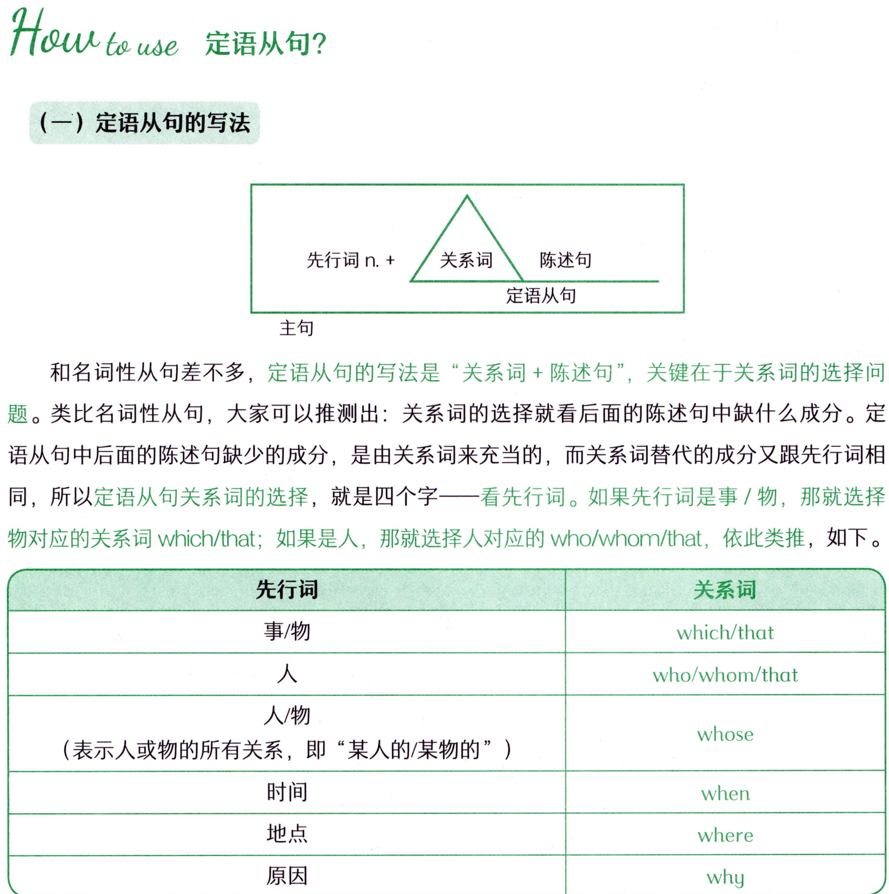

```text
How te use 定语从句?
一）定语从句的写法
先行词n.+
关系词
陈述句
定语从句
主句
和名词性从句差不多，定语从句的写法是“关系词+陈述句”，关键在于关系词的选择问
题。类比名词性从句，大家可以推测出：关系词的选择就看后面的陈述句中缺什么成分。定
语从句中后面的陈述句缺少的成分，是由关系词来充当的，而关系词替代的成分又跟先行词相
同，所以定语从句关系词的选择，就是四个字-
一一看先行词。如果先行词是事/物，那就选择
物对应的关系词which/that；如果是人，那就选择人对应的who/whom/that，依此类推，如下。
先行词
关系词
事/物
which/that
人
who/whom/that
人/物
whose
(表示人或物的所有关系，即“某人的/某物的”)
时间
when
地点
where
原因
why
```

#### 1.先行词是事／物，关系词选择which/that

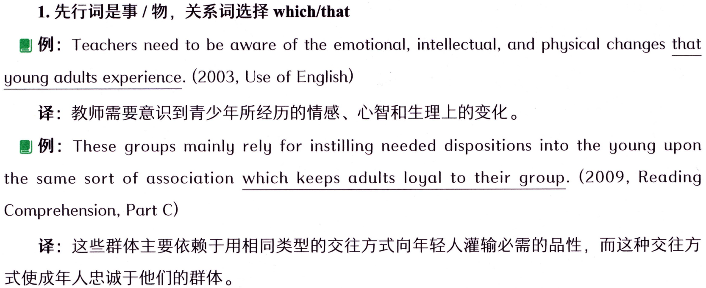

```text
1.先行词是事／物，关系词选择which/that
例：Teachers need tobe aware of the emotional,intellectual,and physical changes that
young adults experience. (2003, Use of English)
译：教师需要意识到青少年所经历的情感、心智和生理上的变化。
1例: These groups mainly rely for instilling needed dispositions into the young upon
the same sort of association which keeps adults loyal to their group.(2009,Reading
Comprehension, Part C)
译：这些群体主要依赖于用相同类型的交往方式向年轻人灌输必需的品性，而这种交往方
式使成年人忠诚于他们的群体。
```

#### 词汇表


```text
disposition/.dispa'zijfn/n.性情；倾向
instill/m'stil/v.逐渐灌输；滴注
```

#### 概述

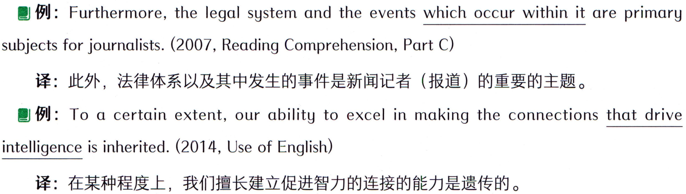

```text
例: Furthermore, the legal system and the events which occur within it are primary
subjects for journalists. (2007, Reading Comprehension, Part C)
译：此外，法律体系以及其中发生的事件是新闻记者（报道）的重要的主题。
例: To a certain extent, our ability to excel in making the connections that drive
intelligence is inherited. (2014, Use of English)
译：在某种程度上，我们擅长建立促进智力的连接的能力是遗传的。
```

#### 2.先行词是人，关系词选择who/whom/that

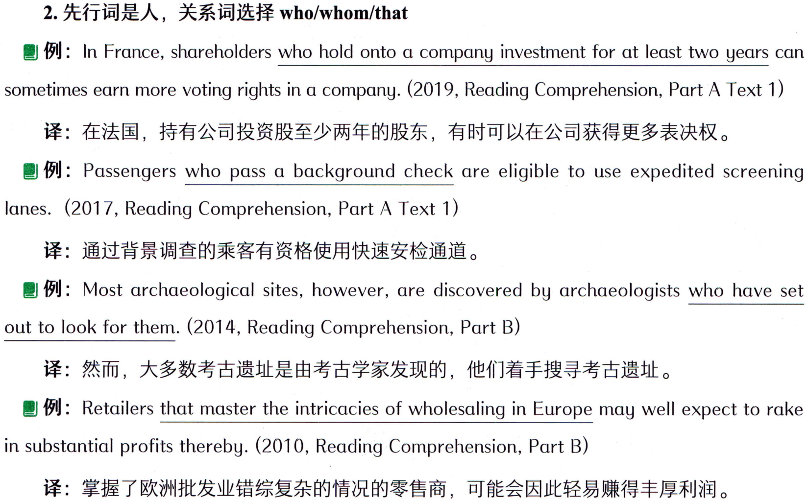

```text
2.先行词是人，关系词选择who/whom/that
例: In France, shareholders who hold onto a company investment for at least two years can
sometimes earn more voting rights in a company. (2019, Reading Comprehension, Part A Text 1)
译：在法国，持有公司投资股至少两年的股东，有时可以在公司获得更多表决权。
例: Passengers who pass a background check are eligible to use expedited screening
lanes. (2017, Reading Comprehension, Part A Text 1)
译：通过背景调查的乘客有资格使用快速安检通道。
例: Most archaeological sites, however, are discovered by archaeologists who have set
out to look for them. (2014, Reading Comprehension, Part B)
译：然而，大多数考古遗址是由考古学家发现的，他们着手搜寻考古遗址。
例: Retailers that master the intricacies of wholesaling in Europe may well expect to rake
in substantial profits thereby. (2010, Reading Comprehension, Part B)
译：掌握了欧洲批发业错综复杂的情况的零售商，可能会因此轻易赚得丰厚利润。
```

#### 3.先行词是人/物，表示人或物的所有关系，关系词选择whose

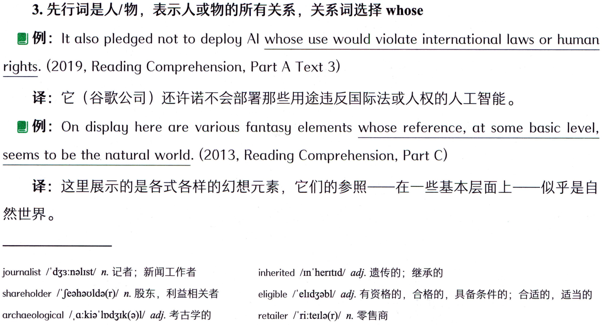

```text
3.先行词是人/物，表示人或物的所有关系，关系词选择whose
例: It also pledged not to deploy Al whose use would violate international laws or human
rights. (2019, Reading Comprehension, Part A Text 3)
译：它（谷歌公司）还许诺不会部署那些用途违反国际法或人权的人工智能。
例: On display here are various fantasy elements whose reference, at some basic level,
seems to be the. natural world. (2013, Reading Comprehension, Part C)
译：这里展示的是各式各样的幻想元素，它们的参照——在一些基本层面上一—似乎是自
然世界。
journalist/d33:nolist/n.记者；新闻工作者
inherited/n'heritid/adj.遗传的；继承的
shareholder/Jeohaulda(r)/n.股东，利益相关者
eligible/elid3abladji.有资格的，合格的，具备条件的；合适的，适当的
retailer /ri:teila(r)/n.零售商
archaeological/.a:kia'lpdzik(?)l/adj.考古学的
```

#### 词汇表

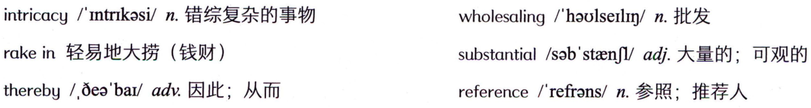

```text
intricacy/Intrkasi/n.错综复杂的事物
wholesaling/"haulseilin/n.批发
rakein轻易地大捞（钱财）
substantial/sab'stenJl/adj.大量的；可观的
thereby/.0ea'bai/adv.因此；从而
reference/refrans/n.参照；推荐人
```

#### 概述

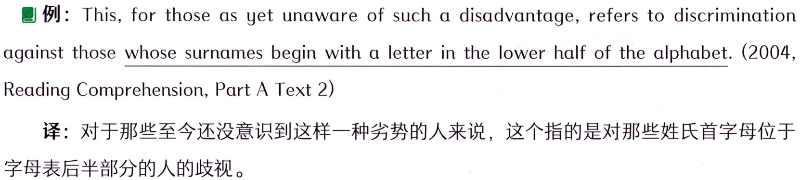

```text
例: This, for those as yet unaware of such a disadvantage, refers to discrimination
against those whose surnames begin with a letter in the lower half of the alphabet. (2004,
Reading Comprehension, Part A Text 2)
译：对于那些至今还没意识到这样一种劣势的人来说，这个指的是对那些姓氏首字母位于
字母表后半部分的人的歧视。
```

#### 4.先行词是时间，关系词选择when

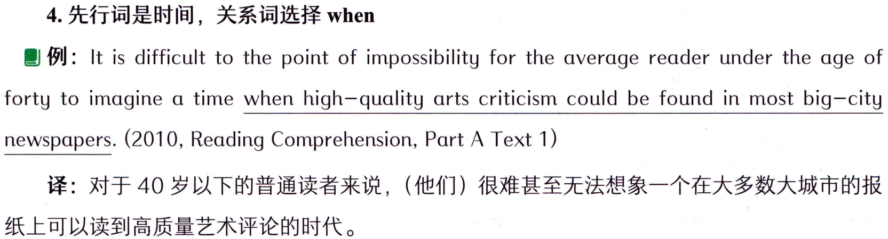

```text
4.先行词是时间，关系词选择when
例: It is difficult to the point of impossibility for the average reader under the age of
forty to imagine a time when high-quality arts criticism could be found in most big-city
newspapers. (2010, Reading Comprehension, Part A Text 1)
译：对于40岁以下的普通读者来说，（他们）很难甚至无法想象一个在大多数大城市的报
纸上可以读到高质量艺术评论的时代。
```

#### 5.先行词是地点，关系词选择where

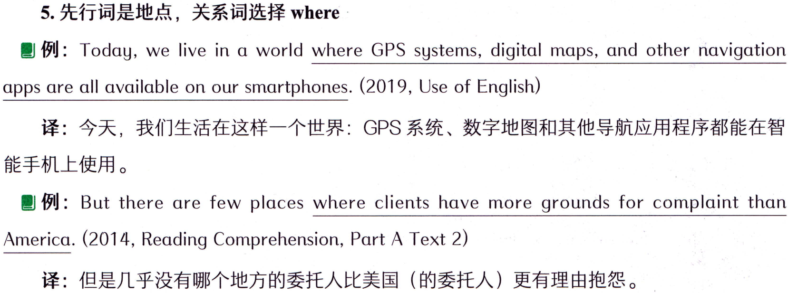

```text
5.先行词是地点，关系词选择where
例: Today, we live in a world where GPS systems, digital maps, and other navigation
apps are all available on our smartphones. (2019, Use of English)
译：今天，我们生活在这样一个世界：GPS系统、数字地图和其他导航应用程序都能在智
能手机上使用。
例:But there are few places where clients have more grounds for complaint than
America. (2014, Reading Comprehension, Part A Text 2)
译：但是几乎没有哪个地方的委托人比美国（的委托人）更有理由抱怨。
```

#### 6.先行词是原因，关系词选择why

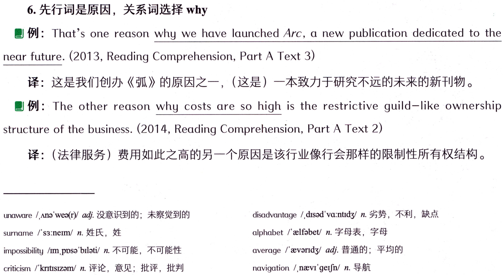

```text
6.先行词是原因，关系词选择why
例:That's one reason why we have launched Arc,a new publication dedicated to the
near future. (2013, Reading Comprehension, Part A Text 3)
译：这是我们创办《弧》的原因之一，（这是）一本致力于研究不远的未来的新刊物。
例: The other reason why costs are so high is the restrictive guild-like ownership
structure of the business. (2014, Reading Comprehension, Part A Text 2)
译：（法律服务）费用如此之高的另一个原因是该行业像行会那样的限制性所有权结构。
disadvantage/.disad'va:ntid3/n.劣势，不利，缺点
unaware/.Ana'wea(r)/adj.没意识到的；未察觉到的
alphabet/aelfabet/n.字母表，字母
surname/'s3:neim/n.姓氏，姓
average/aevarid3/adj.普通的；平均的
impossibility/m,ppssbilati/n.不可能，不可能性
criticism/krtisIzam/n.评论，意见；批评，批判
```

#### 词汇表

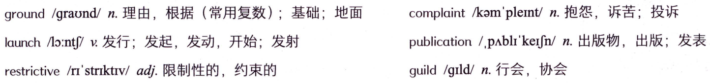

```text
ground/graund/n.理由，根据（常用复数）；基础；地面
complaint/kam'pleint/n.抱怨，诉苦；投诉
publication/.pabli'kerjn/n.出版物，出版；发表
launch/lo:ntf/v发行；发起，发动，开始；发射
guild /gild/n.行会，协会
restrictive /rr'striktiv/adj.限制性的，约束的
```

### 【补充】关于定语从句关系词须注意的几点：

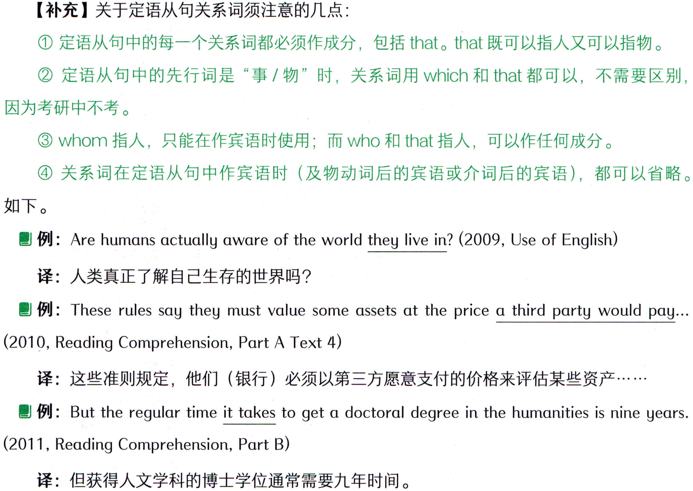

```text
【补充】关于定语从句关系词须注意的几点：
① 定语从句中的每一个关系词都必须作成分，包括 that。that既可以指人又可以指物。
②定语从句中的先行词是“事／物”时，关系词用which和that都可以，不需要区别，
因为考研中不考。
③ whom 指人，只能在作宾语时使用；而 who 和 that指人，可以作任何成分。
④关系词在定语从句中作宾语时（及物动词后的宾语或介词后的宾语），都可以省略。
如下。
 例: Are humans actually aware of the world they live in? (2009, Use of English)
译：人类真正了解自己生存的世界吗？
 例: These rules say they must value some assets at the price a third party would pay...
(2010, Reading Comprehension, Part A Text 4)
译：这些准则规定，他们（银行）必须以第三方愿意支付的价格来评估某些资产.
 例: But the regular time it takes to get a doctoral degree in the humanities is nine years.
(2011, Reading Comprehension, Part B)
译：但获得人文学科的博士学位通常需要九年时间。
```

### 【补充】定语从句还有一个特殊的关系词在考研中出现过一—whereby，表示“凭借，通

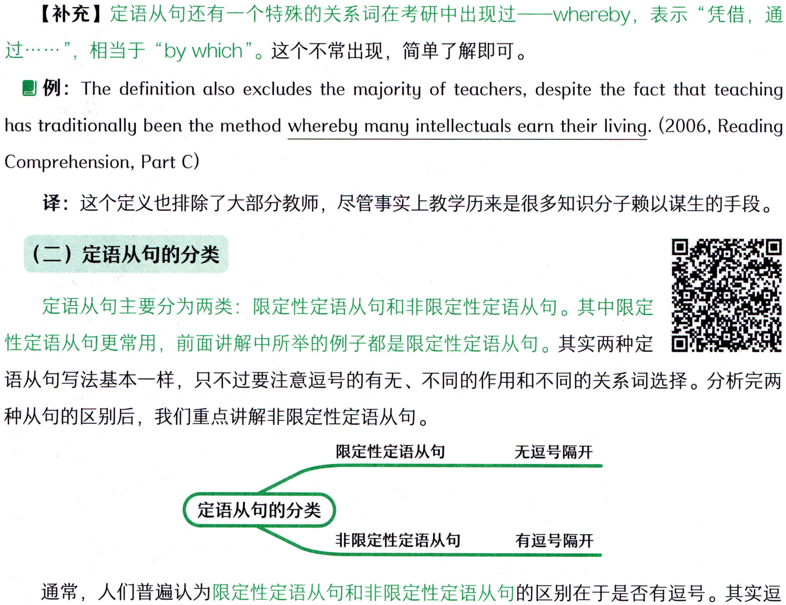

```text
【补充】定语从句还有一个特殊的关系词在考研中出现过一—whereby，表示“凭借，通
过……”，相当于“bywhich"。这个不常出现，简单了解即可。
例: The definition also excludes the majority of teachers, despite the fact that teaching
has traditionally been the method whereby many intellectuals earn their living. (2006, Reading
Comprehension, Part C)
译：这个定义也排除了大部分教师，尽管事实上教学历来是很多知识分子赖以谋生的手段。
二）定语从句的分类
定语从句主要分为两类：限定性定语从句和非限定性定语从句。其中限定
性定语从句更常用，前面讲解中所举的例子都是限定性定语从句。其实两种定
语从句写法基本一样，只不过要注意逗号的有无、不同的作用和不同的关系词选择。分析完两
种从句的区别后，我们重点讲解非限定性定语从句。
无逗号隔开
限定性定语从句
定语从句的分类
非限定性定语从句
有逗号隔开
通常，人们普遍认为限定性定语从句和非限定性定语从句的区别在于是否有逗号。其实逗
```

#### 词汇表

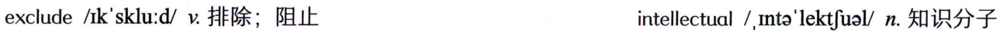

```text
exclude/ik'sklu:d/v.排除；阻止
intellectual/Imto'lektfual/n.知识分子
```

#### 概述

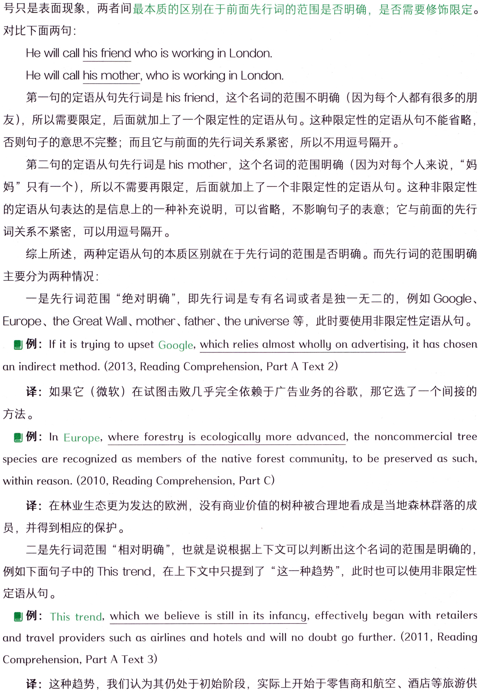

```text
号只是表面现象，两者间最本质的区别在于前面先行词的范围是否明确，是否需要修饰限定。
对比下面两句：
He will call his friend who is working in London.
He will call his mother, who is working in London.
第一句的定语从句先行词是hisfriend，这个名词的范围不明确（因为每个人都有很多的朋
友)，所以需要限定，后面就加上了一个限定性的定语从句。这种限定性的定语从句不能省略，
否则句子的意思不完整；而且它与前面的先行词关系紧密，所以不用逗号隔开。
第二句的定语从句先行词是hismother，这个名词的范围明确（因为对每个人来说，“妈
妈”只有一个），所以不需要再限定，后面就加上了一个非限定性的定语从句。这种非限定性
的定语从句表达的是信息上的一种补充说明，可以省略，不影响句子的表意；它与前面的先行
词关系不紧密，可以用逗号隔开。
综上所述，两种定语从句的本质区别就在于先行词的范围是否明确。而先行词的范围明确
主要分为两种情况：
Europe、the GreatWall、mother、father、theuniverse 等，此时要使用非限定性定语从句。
例: If it is trying to upset Google, which relies almost wholly on advertising, it has chosen
an indirect method. (2013, Reading Comprehension, Part A Text 2)
译：如果它（微软）在试图击败几乎完全依赖于广告业务的谷歌，那它选了一个间接的
方法。
例: In Europe, where forestry is ecologically more advanced, the noncommercial tree
species are recognized as members of the native forest community, to be preserved as such,
within reason. (2010, Reading Comprehension, Part C)
译：在林业生态更为发达的欧洲，没有商业价值的树种被合理地看成是当地森林群落的成
员，并得到相应的保护。
例如下面句子中的Thistrend，在上下文中只提到了“这一种趋势”，此时也可以使用非限定性
定语从句。
例: This trend, which we believe is still in its infancy, effectively began with retailers
and travel providers such as airlines and hotels and will no doubt go further. (2011, Reading
Comprehension,Part AText 3)
译：这种趋势，我们认为其仍处于初始阶段，实际上开始于零售商和航空、酒店等旅游供
```

#### 词汇表

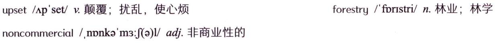

```text
upset/Ap'set/v.颠覆；扰乱，使心烦
forestry/foristri/n.林业；林学
noncommercial /,npnka'm3:f(e)l/adj.非商业性的
```

#### 概述

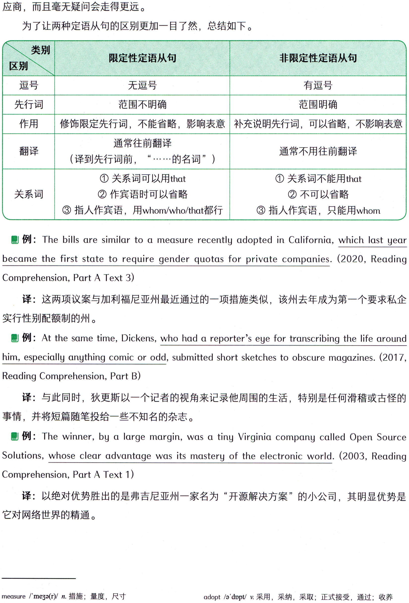

```text
应商，而且毫无疑问会走得更远。
为了让两种定语从句的区别更加一目了然，总结如下。
类别
限定性定语从句
非限定性定语从句
区别
无逗号
有逗号
逗号
先行词
范围不明确
范围明确
作用
修饰限定先行词，不能省略，影响表意
补充说明先行词，可以省略，不影响表意
通常往前翻译
翻译
通常不用往前翻译
（译到先行词前，“.….…·的名词”）
①关系词不能用that
①关系词可以用that
关系词
②不可以省略
②作宾语时可以省略
③指人作宾语，只能用whom
③指人作宾语，用whom/who/that都行
例: The bills are similar to a measure recently adopted in California, which last year
became the first state to require gender quotas for private companies. (2020, Reading
Comprehension, Part A Text 3)
译：这两项议案与加利福尼亚州最近通过的一项措施类似，该州去年成为第一个要求私企
实行性别配额制的州。
 例: At the same time, Dickens, who had a reporter's eye for transcribing the life around
him, especially anything comic or odd, submitted short sketches to obscure magazines. (2017,
Reading Comprehension, Part B)
译：与此同时，狄更斯以一个记者的视角来记录他周围的生活，特别是任何滑稽或古怪的
事情，并将短篇随笔投给一些不知名的杂志。
例: The winner, by a large margin, was a tiny Virginia company called Open Source
Solutions, whose clear advantage was its mastery of the electronic world. (2003, Reading
Comprehension, Part A Text 1)
译：以绝对优势胜出的是弗吉尼亚州一家名为“开源解决方案”的小公司，其明显优势是
它对网络世界的精通。
measure/"me3a(r)/n.措施；量度，尺寸
adopt/e'dppt/v.采用，采纳，采取；正式接受，通过；收养
```

#### 词汇表

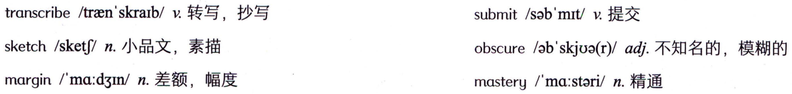

```text
transcribe/traen'skrarb/v.转写，抄写
submit/sab'mit/v.提交
sketch/sketf/n.小品文，素描
obscure/ab'skjua(r)/adj.不知名的，模糊的
margin/ma:d3in/n.差额，幅度
mastery/'ma:stari/n.精通
```

### （三）定语从句的补充

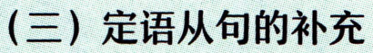

```text
（三）定语从句的补充
```

#### 1.限定性定语从句与同位语从句的区别

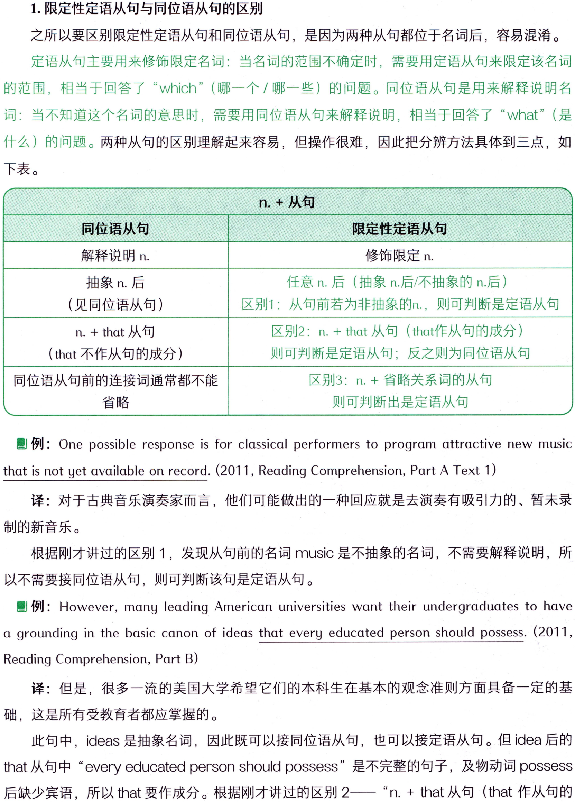

```text
1.限定性定语从句与同位语从句的区别
之所以要区别限定性定语从句和同位语从句，是因为两种从句都位于名词后，容易混淆。
定语从句主要用来修饰限定名词：当名词的范围不确定时，需要用定语从句来限定该名词
的范围，相当于回答了“which”（哪一个／哪一些）的问题。同位语从句是用来解释说明名
词：当不知道这个名词的意思时，需要用同位语从句来解释说明，相当于回答了“what”（是
什么）的问题。两种从句的区别理解起来容易，但操作很难，因此把分辨方法具体到三点，如
下表。
n.+从句
同位语从句
限定性定语从句
修饰限定 n.
解释说明n.
抽象 n.后
任意n.后 （抽象 n.后/不抽象的n.后)
区别1：从句前若为非抽象的n.，则可判断是定语从句
（见同位语从句）
n.+ that 从句
区别2：n.+that从句（that作从句的成分）
则可判断是定语从句；反之则为同位语从句
(that不作从句的成分）
区别3：n.+省略关系词的从句
同位语从句前的连接词通常都不能
省略
则可判断出是定语从句
例: One possible response is for classical performers to program attractive new music
that is not yet available on record. (2011, Reading Comprehension, Part A Text 1)
译：对于古典音乐演奏家而言，他们可能做出的一种回应就是去演奏有吸引力的、暂未录
制的新音乐。
根据刚才讲过的区别1，发现从句前的名词music是不抽象的名词，不需要解释说明，所
以不需要接同位语从句，则可判断该句是定语从句。
例:However, many leading American universities want their undergraduates to have
α grounding in the basic canon of ideas that every educated person should possess. (2011,
Reading Comprehension, Part B)
译：但是，很多一流的美国大学希望它们的本科生在基本的观念准则方面具备一定的基
础，这是所有受教育者都应掌握的。
此句中，ideas是抽象名词，因此既可以接同位语从句，也可以接定语从句。但idea后的
后缺少宾语，所以 that要作成分。根据刚才讲过的区别2—“n.+that从句（that 作从句的
```

#### 词汇表

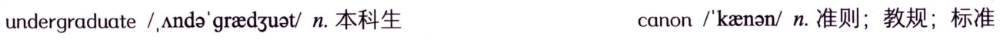

```text
canon/kenan/n.准则；教规；标准
undergraduate/,Anda'gred3uat/n.本科生
```

#### 概述

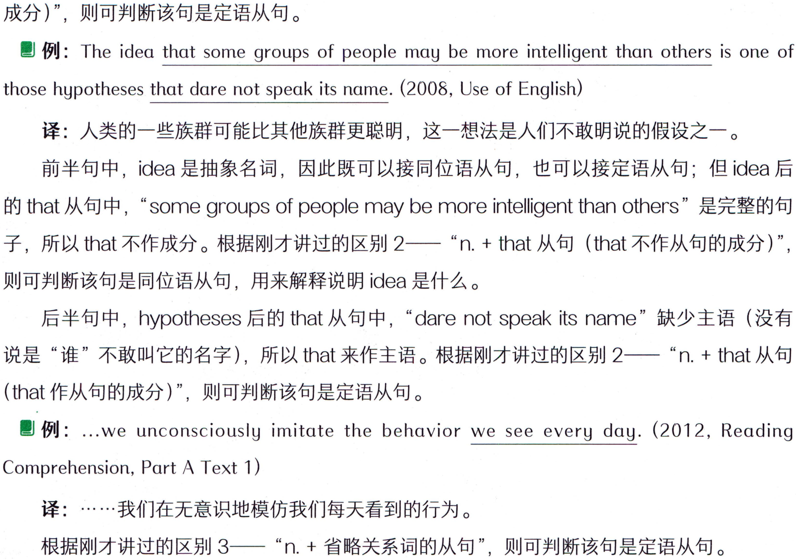

```text
成分）”，则可判断该句是定语从句。
例: The idea that some groups of people may be more intelligent than others is one of
those hypotheses that dare not speak its name. (2008, Use of English)
译：人类的一些族群可能比其他族群更聪明，这一想法是人们不敢明说的假设之一。
前半句中，idea 是抽象名词，因此既可以接同位语从句，也可以接定语从句；但idea后
子，所以 that不作成分。根据刚才讲过的区别 2——“n.+that 从句（that不作从句的成分）”,
则可判断该句是同位语从句，用来解释说明idea 是什么。
后半句中，hypotheses 后的 that从句中，“dare not speak its name”缺少主语（没有
说是“谁”不敢叫它的名字），所以that来作主语。根据刚才讲过的区别2—“n.+that从句
(that作从句的成分）”，则可判断该句是定语从句。
例: ...we unconsciously imitate the behavior we see every day. (2012, Reading
Comprehension, Part A Text 1)
译：.…我们在无意识地模仿我们每天看到的行为。
根据刚才讲过的区别3—“n.+省略关系词的从句”，则可判断该句是定语从句。
```

#### 2.特殊的非限定性定语从句，补充说明整句话

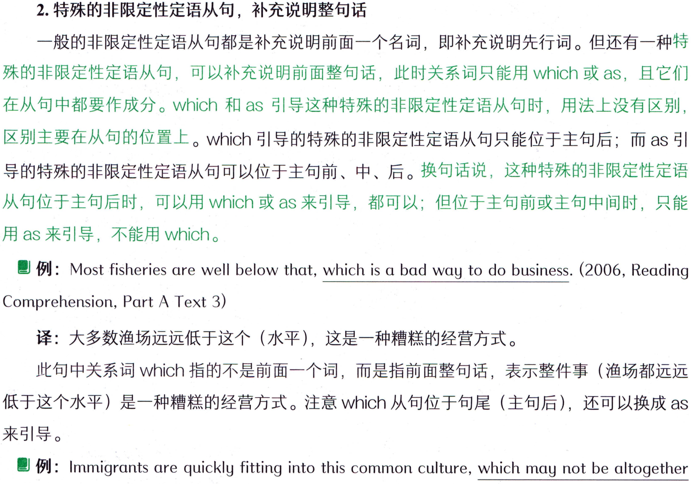

```text
2.特殊的非限定性定语从句，补充说明整句话
一般的非限定性定语从句都是补充说明前面一个名词，即补充说明先行词。但还有一种特
殊的非限定性定语从句，可以补充说明前面整句话，此时关系词只能用which或aS，且它们
在从句中都要作成分。which 和 as 引导这种特殊的非限定性定语从句时，用法上没有区别,
区别主要在从句的位置上。which 引导的特殊的非限定性定语从句只能位于主句后；而 as 引
导的特殊的非限定性定语从句可以位于主句前、中、后。换句话说，这种特殊的非限定性定语
从句位于主句后时，可以用which或as来引l导，都可以；但位于主句前或主句中间时，只能
用as来引导，不能用which。
 例: Most fisheries are well below that, which is a bad way to do business. (2006, Reading
Comprehension, Part A Text 3)
译：大多数渔场远远低于这个（水平），这是一种糟糕的经营方式。
此句中关系词which指的不是前面一个词，而是指前面整句话，表示整件事（渔场都远远
低于这个水平）是一种糟糕的经营方式。注意which从句位于句尾（主句后），还可以换成aS
来引导。
 例: Immigrants are quickly fitting into this common culture, which may not be altogether
```

#### 词汇表

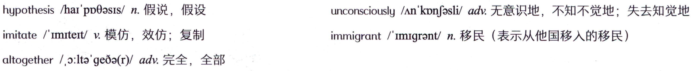

```text
hypothesis/har'pp0asis/n.假说，假设
unconsciously/An'konJasli/adv.无意识地，不知不觉地；失去知觉地
imitate/imiteit/v模仿，效仿；复制
immigrant/imigrant/n.移民（表示从他国移入的移民）
altogether/.o:lte'gedo(r)/adv.完全，全部
```

#### 概述

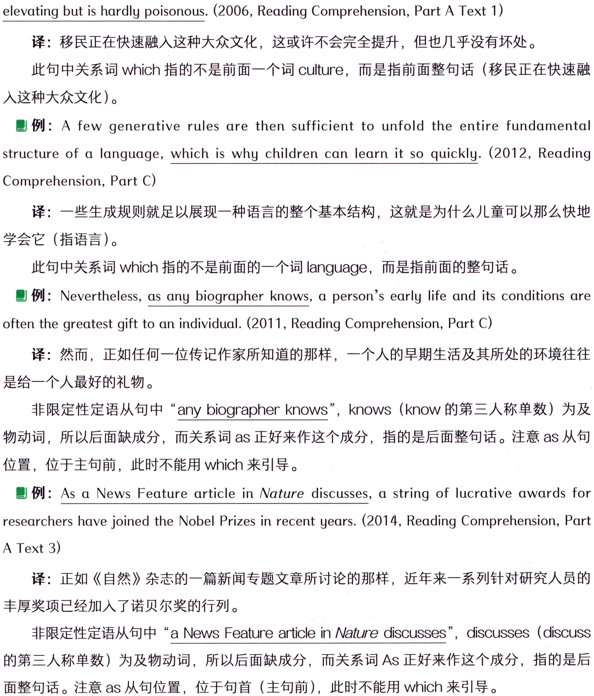

```text
elevating but is hardly poisonous. (2006, Reading Comprehension, Part A Text 1)
译：移民正在快速融入这种大众文化，这或许不会完全提升，但也几乎没有坏处。
此句中关系词which指的不是前面一个词culture，而是指前面整句话（移民正在快速融
入这种大众文化)。
例:A few generative rules are then sufficient to unfold the entire fundamental
structure of a language, which is why children can learn it so quickly. (2012, Reading
Comprehension, Part C)
译：一些生成规则就足以展现一种语言的整个基本结构，这就是为什么儿童可以那么快地
学会它（指语言)。
此句中关系词which指的不是前面的一个词language，而是指前面的整句话。
例: Nevertheless, as any biographer knows, a person's early life and its conditions are
often the greatest gift to an individual. (2011, Reading Comprehension, Part C)
译：然而，正如任何一位传记作家所知道的那样，一个人的早期生活及其所处的环境往往
是给一个人最好的礼物。
非限定性定语从句中“any biographer knows"，knows（know 的第三人称单数）为及
物动词，所以后面缺成分，而关系词as正好来作这个成分，指的是后面整句话。注意aS从句
位置，位于主句前，此时不能用which来引导。
例: As a News Feature article in Nature discusses, a string of lucrative awards for
researchers have joined the Nobel Prizes in recent years.(2014, Reading Comprehension, Part
A Text 3)
译：正如《自然》杂志的一篇新闻专题文章所讨论的那样，近年来一系列针对研究人员的
丰厚奖项已经加入了诺贝尔奖的行列。
非限定性定语从句中“aNewsFeaturearticleinNaturediscusses”，discusses（discusS
的第三人称单数）为及物动词，所以后面缺成分，而关系词As正好来作这个成分，指的是后
面整句话。注意as从句位置，位于句首（主句前），此时不能用which来引l导。
```

#### 3.介词提前的定语从句

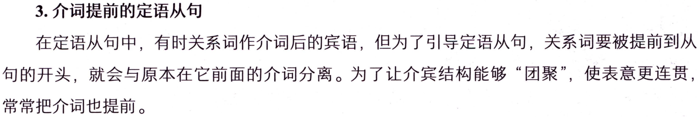

```text
3.介词提前的定语从句
在定语从句中，有时关系词作介词后的宾语，但为了引导定语从句，关系词要被提前到从
句的开头，就会与原本在它前面的介词分离。为了让介宾结构能够“团聚”，使表意更连贯，
常常把介词也提前。
```

#### 词汇表

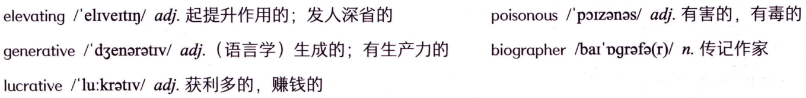

```text
elevating/eliveitin/adj.起提升作用的；发人深省的
poisonous/poizanas/adj.有害的，有毒的
generative/dzenarativ/adj.（语言学）生成的；有生产力的
biographer/bal'pgrafa(r)/n.传记作家
lucrative/lu:krativ/adj.获利多的，赚钱的
```

#### 概述

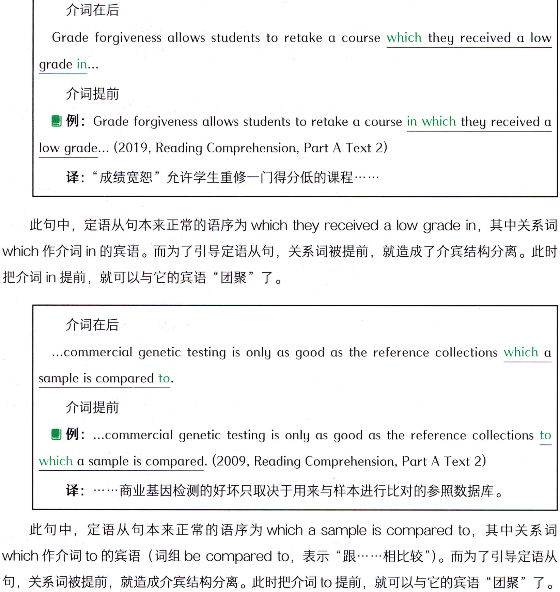

```text
介词在后
Grade forgiveness allows students to retake a course which they received a low
grade in...
介词提前
例: Grade forgiveness allows students to retake a course in which they received a
low grade... (2019, Reading Comprehension, Part A Text 2)
译：“成绩宽恕”允许学生重修一门得分低的课程·…··
此句中，定语从句本来正常的语序为 which they received a low grade in，其中关系词
which作介词in的宾语。而为了引导定语从句，关系词被提前，就造成了介宾结构分离。此时
把介词in提前，就可以与它的宾语“团聚”了。
介词在后
...commercial genetic testing is only as good as the reference collections which a
sample is compared to.
介词提前
例: ..commercial genetic testing is only as good as the reference collections to
which a sample is compared. (2009, Reading Comprehension, Part A Text 2)
译：·…···商业基因检测的好坏只取决于用来与样本进行比对的参照数据库。
此句中，定语从句本来正常的语序为 which a sample is compared to，其中关系词
which作介词to的宾语（词组becompared to，表示“跟...…-相比较"）。而为了引l导定语从
句，关系词被提前，就造成介宾结构分离。此时把介词to提前，就可以与它的宾语“团聚”了。
```

### 【补充】定语从句中，与关系词搭配的介词可以提前，也可以不提前。介词提前与否，表

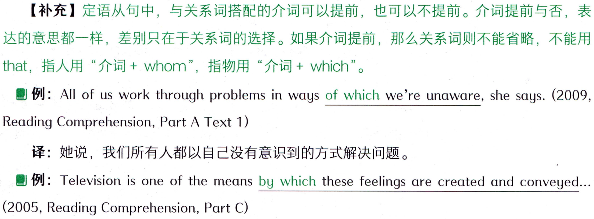

```text
【补充】定语从句中，与关系词搭配的介词可以提前，也可以不提前。介词提前与否，表
达的意思都一样，差别只在于关系词的选择。如果介词提前，那么关系词则不能省略，不能用
that，指人用“介词+whom”，指物用“介词+which”。
例: All of us work through problems in ways of which we're unaware, she says. (2009,
Reading Comprehension, Part A Text 1)
译：她说，我们所有人都以自己没有意识到的方式解决问题。
例: Television is one of the means by which these feelings are created and conveyed...
(2005, Reading Comprehension, Part C)
```

#### 词汇表


```text
commercial/ka'm3:J/adj.商业的n.商业广告
convey/kan'ver/v传达；表达；转移
```

#### 概述

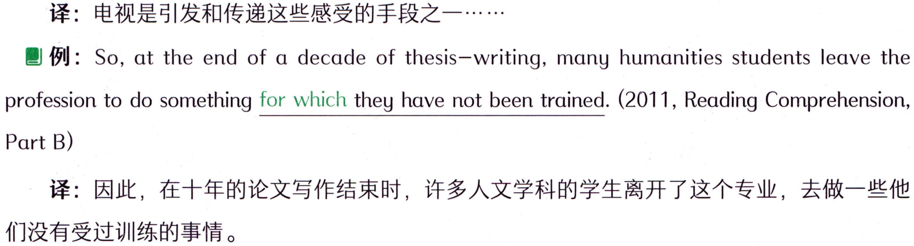

```text
译：电视是引发和传递这些感受的手段之
例: So, at the end of a decade of thesis-writing, many humanities students leave the
profession to do something for which they have not been trained. (2011, Reading Comprehension,
Part B)
译：因此，在十年的论文写作结束时，许多人文学科的学生离开了这个专业，去做一些他
们没有受过训练的事情。
```

### 【补充】除了限定性定语从句之外，非限定性定语从句也可以把介词提前。

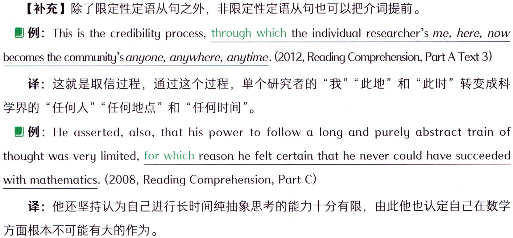

```text
【补充】除了限定性定语从句之外，非限定性定语从句也可以把介词提前。
例: This is the credibility process, through which the individual researcher's me, here, now
becomes the community's anyone, anywhere, anytime. (2012, Reading Comprehension, Part A Text 3)
译：这就是取信过程，通过这个过程，单个研究者的“我”“此地”和“此时”转变成科
学界的“任何人”“任何地点”和“任何时间”。
例: He asserted, also, that his power to follow a long and purely abstract train of
thought was very limited, for which reason he felt certain that he never could have succeeded
with mathematics. (2008, Reading Comprehension, Part C)
译：他还坚持认为自己进行长时间纯抽象思考的能力十分有限，由此他也认定自己在数学
方面根本不可能有大的作为。
```

## Whytelearn 定语从句?

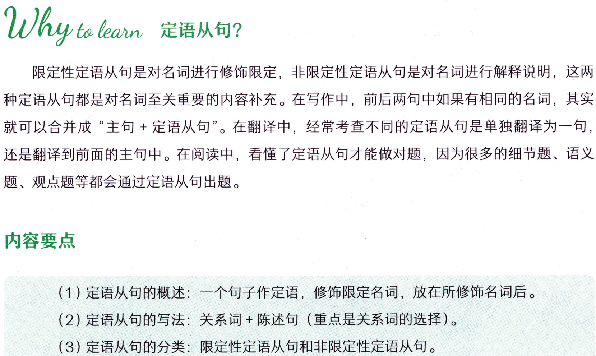

```text
Whytelearn 定语从句?
限定性定语从句是对名词进行修饰限定，非限定性定语从句是对名词进行解释说明，这两
种定语从句都是对名词至关重要的内容补充。在写作中，前后两句中如果有相同的名词，其实
就可以合并成“主句+定语从句”。在翻译中，经常考查不同的定语从句是单独翻译为一句，
还是翻译到前面的主句中。在阅读中，看懂了定语从句才能做对题，因为很多的细节题、语义
题、观点题等都会通过定语从句出题。
内容要点
（1）定语从句的概述：一个句子作定语，修饰限定名词，放在所修饰名词后。
（2）定语从句的写法：关系词+陈述句（重点是关系词的选择）。
（3）定语从句的分类：限定性定语从句和非限定性定语从句。
```

#### 词汇表

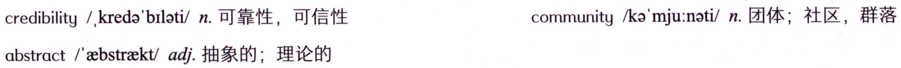

```text
community/ka'mju:nati/n.团体；社区，群落
credibility/.kreda'bilati/n.可靠性，可信性
abstract/aebstraekt/adj.抽象的；理论的
```

#### 概述


```text
（4）定语从句的补充：
1）限定性定语从句与同位语从句的区别。
2）特殊的非限定性定语从句（补充说明整句话）。
3）介词提前的定语从句。
真题演练
请用下划线标出句中的定语从句，判断是哪种定语从句（限定性或非限定性），
并且找出定语从句的关系词和所修饰的先行词。
1. ...the most recent grade or the highest grade is the only one that counts in calculating a
student's overall GPA. (2019, Reading Comprehension, Part A Text 2)
2. Each of these social sciences has a subfield or specialization which lies particularly close to
anthropology. (2003, Reading Comprehension, Part B)
3. In this as in much else, those who wish to influence the future must prepare for it. (2017,
Reading Comprehension, Part C)
4. Ground surveys allow archaeologists to pinpoint the places where digs will be successful.
(2014, Reading Comprehension, Part B)
5. Aimlessness has hardly been typical of the postwar Japan whose productivity and social
harmony are the envy of the United States and Europe. (2ooo, Reading Comprehension,
Passage 4)
6. Anyway, the act of laughing probably does produce other types of physical feedback that
improve an individual's emotional state. (2011, Use of English)
7. “"Schools have always been in a society where practical is more important than intellectual,"
says education writer Diane Ravitch. (2004, Reading Comprehension, Part A Text 4)
8. Today's vessels can find their prey using satellites and sonar, which were not available 50
years ago. (2006, Reading Comprehension, Part A Text 3)
9. Even those who aren't hunting for jobs may find search agents worthwhile. (2004, Reading
Comprehension, Part A Text 1)
10. Most journalists learn to see the world through a set of standard templates (patterns) into
which they plug each day's events. (2001, Reading Comprehension, Passage 3)
11. Social scientists who complain about a lack of funding should not expect more in today's
economic climate. (2013, Reading Comprehension, Part B)
12. The brain finds it best to keep smell receptors available for unfamiliar and emergency
signals such as the smell of smoke, which might indicate the danger of fire. (2005, Use of
English)
13. Bob Herz, the FASB's chairman, cried out against those who question our motives. (2010,
Reading Comprehension,Part A Text 4)
14.But we are now knowledgeable enough to reduce many of the risks that threatened the
existence of earlier humans... (2013, Reading Comprehension, Part A Text 3)
15. The people who've been hurt the worst are those who've stayed too long. (2011, Reading
Comprehension, Part A Text 2)
16. As Nature has pointed out before, there are some legitimate concerns about how science
prizes—both new and old—are distributed. (2014, Reading Comprehension, Part A Text 3)
17. The ability to guard customer data is the key to market value, which the board is
responsible for on behalf of shareholders. (2007, Reading Comprehension, Part A Text 4)
18. Furthermore,humans have the ability to modify the environment in which they live...
(2003, Reading Comprehension, Part B)
19. A tailor named John Dane, who emigrated in the late 1630s, left an account of his reasons
for leaving England that is filled with signs. (2009, Reading Comprehension, Part A Text 4)
20. Straitford's briefs don't sound like the usual Washington back-and-forthing, whereby
agencies avoid dramatic declarations on the chance they might be wrong. (2003, Reading
Comprehension, Part A Text 1)
我是一条答案的分隔线，请先不要偷看呦！
1. ...the most recent grade or the highest grade is the only one that counts in calculating a
student's overall GPA. (2019, Reading Comprehension,Part A Text 2)
译：·…..…只采用最近的分数或者最高的分数来计算学生的总平均绩点。
关系词 that引出限定性定语从句，修饰先行词 the only one。
2. Each of these social sciences has a subfield or specialization which lies particularly close to
anthropology. (2003,Reading Comprehension, Part B)
译：社会科学的每个（学科）都包含一门与人类学密切相关的分支或专业。
关系词 which 引l出限定性定语从句，修饰先行词 a subfield or specialization 。
3. In this as in much else, those who wish to influence the future must prepare for it. (2017,
Reading Comprehension, Part C)
译：不仅是在这一方面，在其他方面也一样，那些想要影响未来的人必须做好准备。
关系词 who引出限定性定语从句，修饰先行词 those。
4. Ground surveys allow archaeologists to pinpoint the places where digs will be successful.
(2014, Reading Comprehension, Part B)
译：地面勘察使考古学家可以精确地找到挖掘将会成功的地方。
关系词 where引l出限定性定语从句，修饰先行词 the placeS。
5. Aimlessness has hardly been typical of the postwar Japan whose productivity and social
harmony are the envy of the United States and Europe. (2000, Reading Comprehension,
Passage 4)
译：漫无目的不是战后日本的特征，战后日本的生产力和社会的和谐是美国和欧洲国家所
羡慕的。
关系词whose引出限定性定语从句，修饰先行词 thepostwar Japan。
6. Anyway, the act of laughing probably does produce other types of physical feedback that
improve an individual's emotional state. (2011, Use of English)
译：无论如何，笑的行为可能确实会产生其他类型的身体反馈，（从而）改善个人的情绪
状态。
7. “Schools have always been in a society where practical is more important than intellectual,"
says education writer Diane Ravitch. (2004, Reading Comprehension, Part A Text 4)
关系词 where 引出限定性定语从句，修饰先行词 a society。
8. Today's vessels can find their prey using satellites and sonar, which were not available 50
years ago. (2006, Reading Comprehension, Part A Text 3)
译：如今的轮船能够使用卫星和声呐来寻找猎物，而这些在50年前是没有的。
关系词which引l出非限定性定语从句，补充说明名词词组 satelites and sonar。
9. Even those who aren't hunting for jobs may find search agents worthwhile. (2004, Reading
Comprehension, Part A Text 1)
译：即使是那些不找工作的人可能也会发觉搜索代理有用。
关系词who引出限定性定语从句，修饰先行词those。
10. Most journalists learn to see the world through a set of standard templates (patterns) into
which they plug each day’s events. (2001, Reading Comprehension, Passage 3)
译：多数新闻记者学会了用一套标准的模式去看待世界，并把每天发生的事件套入这一
模式。
关系词 which引出限定性定语从句，并且从句中的介词into 被提前，修饰先行词a Set of
standard templates (patterns) 。
11. Social scientists who complain about a lack of funding should not expect more in today's
economic climate. (2013, Reading Comprehension, Part B)
译：那些抱怨资金不足的社会科学家们不应该在现今的经济形势下期待更多。
关系词who引出限定性定语从句，修饰先行词Social scientists。
12. The brain finds it best to keep smell receptors available for unfamiliar and emergency
signals such as the smell of smoke, which might indicate the danger of fire. (2005, Use of
English)
译：大脑发现最好让气味感受器可随时用于（接受）不熟悉的、危急的信号，例如可能意
味着有火灾危险的烟味。
关系词which引出非限定性定语从句，补充说明先行词the Smellof smoke。
13. Bob Herz, the FASB's chairman, cried out against those who question our motives. (2010,
Reading Comprehension, Part A Text 4)
译：美国财务会计准则委员会主席鲍伯·赫茨强烈反对那些“质疑我们动机”的人。
关系词 who 引出限定性定语从句，修饰先行词 those。
14. But we are now knowledgeable enough to reduce many of the risks that threatened the
existence of earlier humans... (2013, Reading Comprehension, Part A Text 3)
译：但是我们现在已经有足够的知识去减少许多曾威胁早期人类生存的风险·..
关系词that引l出限定性定语从句，修饰先行词many of the risks。
15. The people who've been hurt the worst are those who've stayed too long. (2011, Reading
Comprehension, Part A Text 2)
译：受害最深的正是那些（在一个岗位上）待得太久的人。
此句中有两个限定性定语从句都是关系词who引出的，但修饰的先行词不同，第一个修饰
的先行词是people，而第二个修饰的先行词是those。
16. As Nature has pointed out before, there are some legitimate concerns about how science
prizes—both new and old—are distributed. (2014, Reading Comprehension,Part A Text 3)
译：就正如《自然》杂志之前指出的那样，人们对科学奖一—新奖项和旧奖项一—是如何
分配的存在一些合理的担忧。
关系词As引出非限定性定语从句，补充说明后面整句话。
17. The ability to guard customer data is the key to market value, which the board is
responsible for on behalf of shareholders. (2007, Reading Comprehension, Part A Text 4)
译：保护客户数据的能力是（保证）市场价值的关键，董事会应当代表股东对此负责。
关系词which引l出非限定性定语从句，补充说明前面整句话。
18. Furthermore, humans have the ability to modify the environment in which they live..
(2003, Reading Comprehension, Part B)
译：而且，人类还有能力改变自己的生存环境·…··
关系词which引l出限定性定语从句，并且从句中的介词in被提前，修饰先行词the
environment。
19. A tailor named John Dane, who emigrated in the late 1630s, left an account of his reasons
for leaving England that is filled with signs. (2009, Reading Comprehension, Part A Text 4)
译：一位名为约翰·戴恩的裁缝于17世纪30年代末移民了，他留下的关于离开英格兰
的理由的叙述中充满了各种神迹。
关系词who引出非限定性定语从句，补充说明先行词A tailor named John Dane。关系
词 that引l出限定性定语从句，修饰先行词 an account of his reasons，注意定语从句和所修饰
的先行词之间分裂开了，因为先行词后有介词短语forleaving England 修饰。
20. Straitford's briefs don't sound like the usual Washington back-and-forthing, whereby
agencies avoid dramatic declarations on the chance they might be wrong. (2003, Reading
Comprehension, Part A Text 1)
译：斯特雷福特公司的简报听起来不像华盛顿一贯的那样闪烁其词，政府机构通过这个
（闪烁其词）来避免发布引人注目的言论，以防他们可能是错的。
关系词whereby引出非限定性定语从句，补充说明先行词the usual Washington back-
and-forthing。
考场攻略
定语从句的写法建议重点掌握（尤其是先行词和关系词），同时在读句子时要能准
确找到定语从句所修饰的先行词，看懂句意；其他的定语从句用法了解即可。
攻略1：不纠结于定语从句和同位语从句的区别，不重要
为了保证知识体系的完整性，之前本书讲解了限定性定语从句和同位语从句的区
别。但是这部分内容了解即可，在考研真题中遇到时不要纠结，不要浪费时间去特意
分辨。因为这两种从句说到底都是对于先行词（名词）的一种修饰和补充，所以只要
能够找到从句，并且能判断它是修饰和补充哪个名词即可。
攻略2：找到定语从句的先行词，更准确看懂句意
在考研真题中，首先要通过关系词找到定语从句；然后“往前看”再去找到它所
修饰的先行词，通常定语从句都是就近修饰前面挨着的名词，例如之前讲解中的例句
都是，但要特别注意真题中有时也会出现先行词和定语从句被分开的情况（中间夹杂
了其他的补充修饰成分）。如下所示。
例：Thiswasalsofoundinhigh-functioning men withsomeautisticspectrum
symptoms, who may tend to avoid eye contact. (2020, Reading Comprehension, Part B)
译：在一些可能倾向于避免眼神接触的高功能自闭症患者中也发现了这一特点。
此句中， 根据关系词 who 就可以迅速地找到定语从句 who may tend to avoid eye
contact。然后“往前看”找先行词，马上就看到了紧挨着who的名词symptoms，但
是很明显这个词并不是先行词。因为 who 修饰的先行词一定得是人，而 symptoms
（症状，征兆）显然不符合。
再继续往前看，发现了名词men，再代入到从句中，变为men may tend to
avoideyecontact（人们可能倾向于避免眼神接触），意思合适，则可以确定先行词为
men。
例: ...there exists no language or dialect in the world that cannot convey
complex ideas. (2005, Reading Comprehension, Part A Text4)
译：…世界上没有表达不了复杂思想的语言或方言。
此句中，根据关系词 that 就可以迅速地找到定语从句 that cannot convey
complexideas。然后“往前看”找先行词，马上就看到了紧挨着that的名词world,
但是很明显这个词并不是先行词。因为“先行词=关系词”，所以把先行词world代人
从句中替换关系词 that，变为 world cannot convey complex ideas（世界不能表达
复杂思想），意思不合适，所以要继续寻找先行词。
再继续往前看，发现了名词dialect，但注意它不是一个词，而是一个并列的词组
"no language or dialect”（作为整体），再代入从句中，变为nolanguageor dialect
cannotconveycomplexideas（没有语言或方言是不能表达复杂思想的），意思合适，
则可以确定先行词为nolanguageordialect。
综上所述，不难发现，必须要准确地找到定语从句的先行词，才能正确理解句子
意思，尤其注意这种先行词和定语从句被分开的情况。其实，想找到先行词也不难，
就是“往前看”找名词，再“代人从句”判断意思是否合适。
```

#### 词汇表


```text
dialect/darolekt/n.方言
```
