# 附录A 每日一句长难句

#### 概述


```text
每日一句长难句
```

### 【2002年Text1】本句中有几处平行结构？分别是什么与什么平行

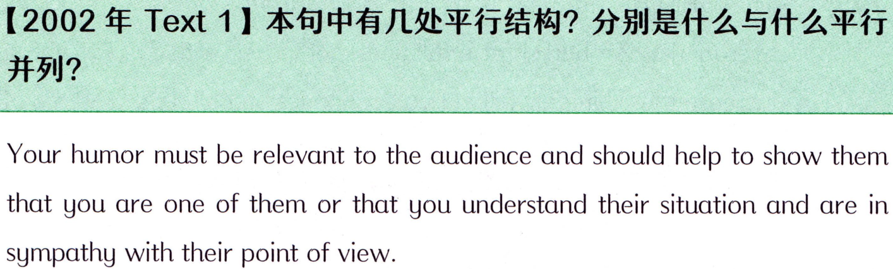

```text
【2002年Text1】本句中有几处平行结构？分别是什么与什么平行
并列？
Your humor must be relevant to the audience and should help to show them
that you are one of them or that you understand their situation and are in
sympathy with their point of view.
```

### 【2002年Text1】本句断开为几件事？如何断开？

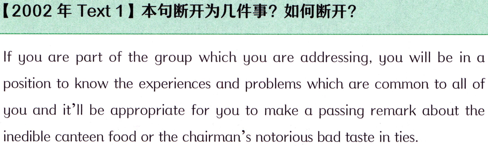

```text
【2002年Text1】本句断开为几件事？如何断开？
If you are part of the group which you are addressing, you will be in a
position to know the experiences and problems which are common to all of
you and it'll be appropriate for you to make a passing remark about the
inedible canteen food or the chairman's notorious bad taste in ties.
```

### 【2002年Text2】本句中有几个从句？分别是什么从句？

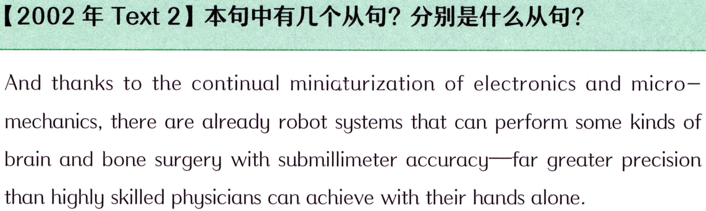

```text
【2002年Text2】本句中有几个从句？分别是什么从句？
And thanks to the continual miniaturization of electronics and micro-
mechanics, there are already robot systems that can perform some kinds of
brain and bone surgery with submillimeter accuracy—far greater precision
than highly skilled physicians can achieve with their hands alone.
```

### 【2002年Text2】主句的核心内容是什么？

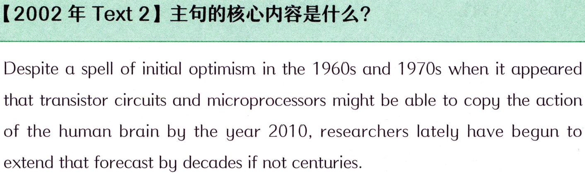

```text
【2002年Text2】主句的核心内容是什么？
Despite a spell of initial optimism in the 1960s and 1970s when it appeared
that transistor circuits and microprocessors might be able to copy the action
of the human brain by the year 2010, researchers lately have begun to
extend thatforecast by decades if not centuries.
```

### 【2002年Text2】简化后，主句和从句的核心内容是什么？

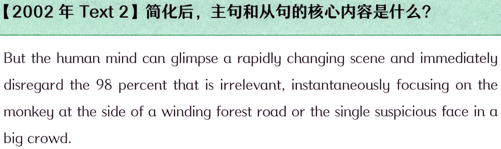

```text
【2002年Text2】简化后，主句和从句的核心内容是什么？
But the human mind can glimpse a rapidly changing scene and immediately
disregard the 98 percent that is irrelevant, instantaneously focusing on the
monkey at the side of a winding forest road or the single suspicious face in a
big crowd.
```

### 【2002年Text3】本句中有几个从句？分别是什么从句？

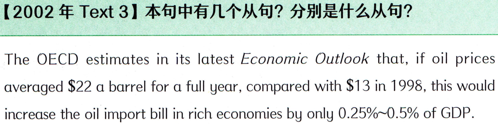

```text
【2002年Text3】本句中有几个从句？分别是什么从句？
The OECD estimates in its latest Economic Outlook that, if oil prices
averaged $22 a barrel for a full year, compared with $13 in 1998, this would
increase the oil import bill in rich economies by only 0.25%~0.5% of GDP.
```

### 【2002年Text4】本句断开为几件事？如何断开？

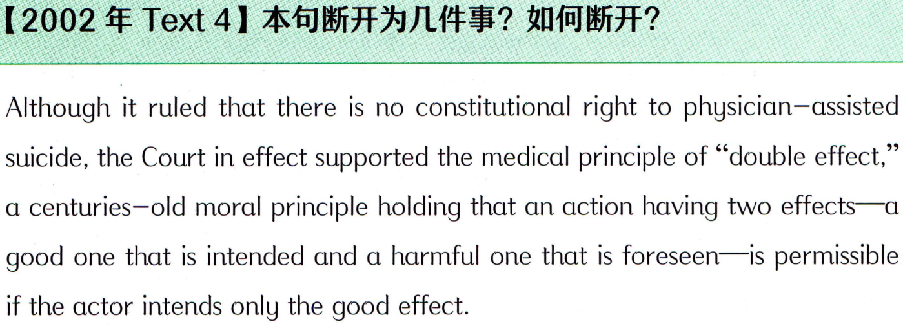

```text
【2002年Text4】本句断开为几件事？如何断开？
Although it ruled that there is no constitutional right to physician-assisted
suicide, the Court in effect supported the medical principle of “double effect,"
a centuries-old moral principle holding that an action having two effects—a
good one that is intended and a harmful one that is foreseen——is permissible
if the actor intends only the good effect.
```

### 【2002年Text4】本句中有几处分裂结构？分别是什么造成的

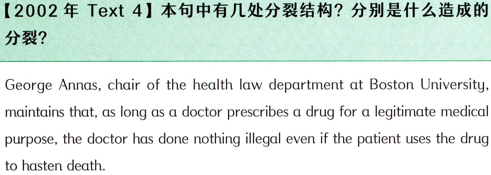

```text
【2002年Text4】本句中有几处分裂结构？分别是什么造成的
分裂？
maintains that, as long as a doctor prescribes a drug for a legitimate medical
purpose, the doctor has done nothing illegal even if the patient uses the drug
to hasten death.
```

### 【2002年Text4】本句中有出现平行结构，分别是什么和什么平行

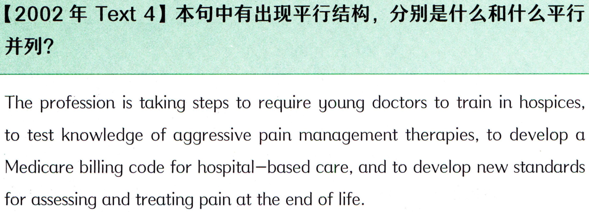

```text
【2002年Text4】本句中有出现平行结构，分别是什么和什么平行
并列？
The profession is taking steps to require young doctors to train in hospices,
to test knowledge of aggressive pain management therapies, to develop a
Medicare billing code for hospital-based care, and to develop new standards
for assessing and treating pain at the end of life.
```

### 【2003年Text1】whereby表示什么意思？引导什么从句？

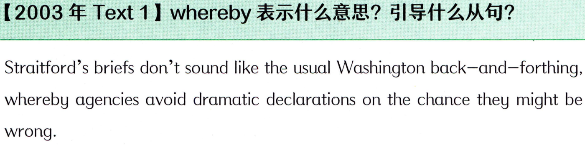

```text
【2003年Text1】whereby表示什么意思？引导什么从句？
Straitford's briefs don't sound like the usual Washington back-and-forthing,
whereby agencies avoid dramatic declarations on the chance they might be
wrong.
```

### 【2003年Text2】本句如何断开？主句的主语是哪部分？

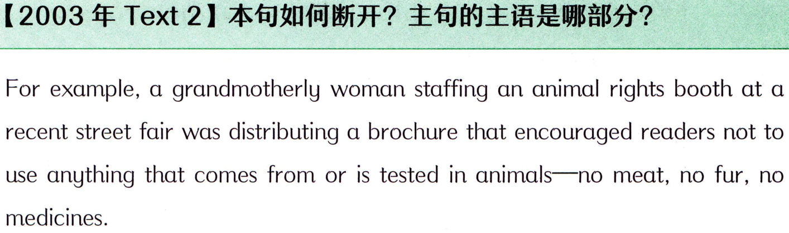

```text
【2003年Text2】本句如何断开？主句的主语是哪部分？
For example, a grandmotherly woman staffing an animal rights booth at a
use anything that comes from or is tested in animals—no meat, no fur, no
medicines.
```

### 【2003年Text2】本句中有出现平行结构和嵌套结构，你找到

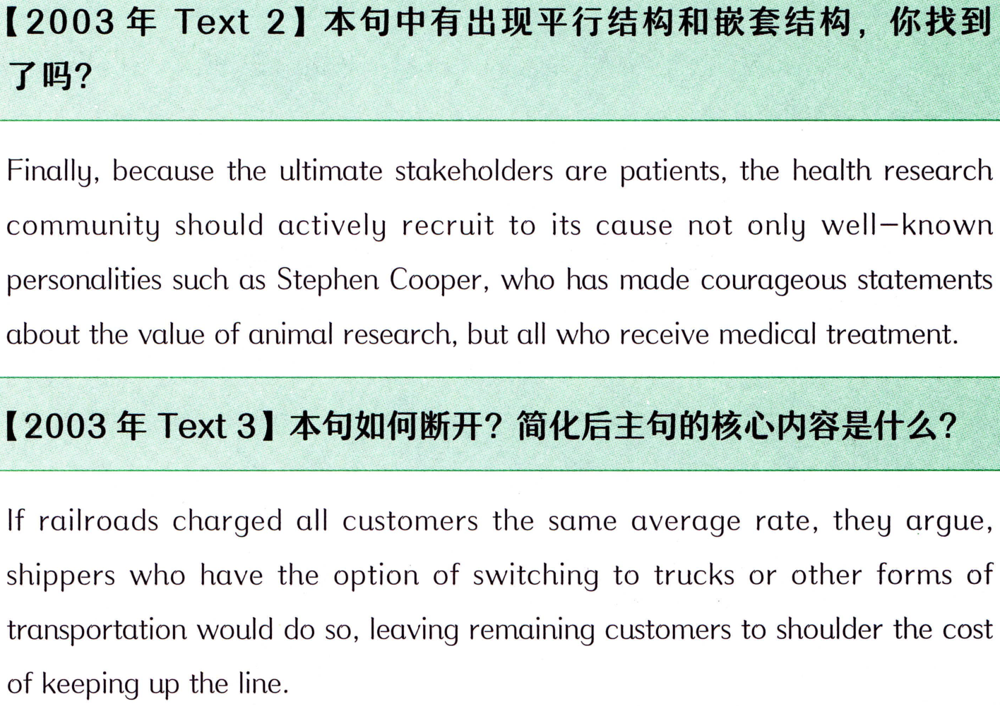

```text
【2003年Text2】本句中有出现平行结构和嵌套结构，你找到
了吗？
Finally, because the ultimate stakeholders are patients, the health research
community should actively recruit to its cause not only well-known
personalities such as Stephen Cooper, who has made courageous statements
about the value of animal research,but all who receive medical treatment.
If railroads charged all customers the same average rate, they argue,
shippers who have the option of switching to trucks or other forms of
transportation would do so, leaving remaining customers to shoulder the cost
of keeping up the line.
```

### 【2003年Text3】本句可以断开为几个句子？分别作什么成分？

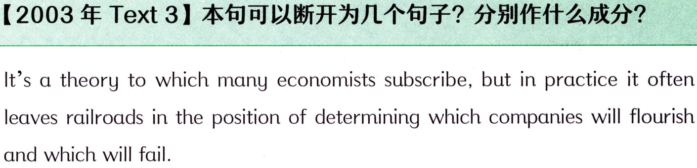

```text
【2003年Text3】本句可以断开为几个句子？分别作什么成分？
It's a theory to which many economists subscribe, but in practice it often
leaves railroads in the position of determining which companies will flourish
and which will fail.
```

### 【2003年Text4】本句的插人语中，是什么与什么平行并列？分别

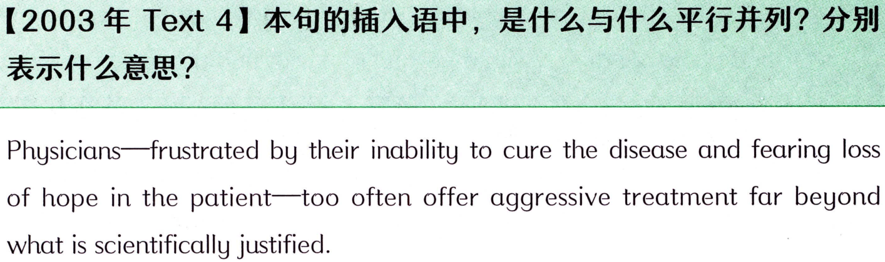

```text
【2003年Text4】本句的插人语中，是什么与什么平行并列？分别
表示什么意思？
Physicians—frustrated by their inability to cure the disease and fearing loss
of hope in the patient—too often offer aggressive treatment far beyond
what is scientifically justified.
```

### 【2003年Text4】本句中的三个that从句一样吗？分别是什么从

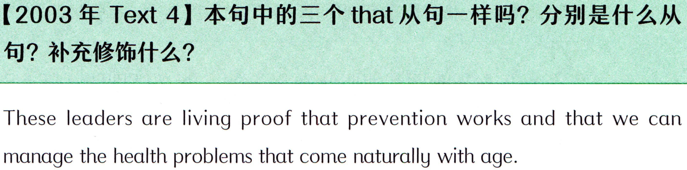

```text
【2003年Text4】本句中的三个that从句一样吗？分别是什么从
句？补充修饰什么？
These leaders are living proof that prevention works and that we can
manage the health problems that come naturally with age.
```

### 【2004年Text1】本句中有几个从句？分别是什么从句？

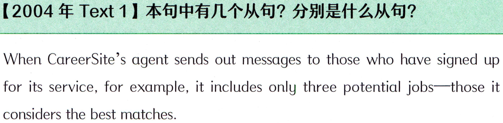

```text
【2004年Text1】本句中有几个从句？分别是什么从句？
When CareerSite's agent sends out messages to those who have signed up
for its service, for example, it includes only three potential jobs——those it
considers the best matches.
```

### 【2004年Text2】本句中的多个介词短语分别表示什么意思？

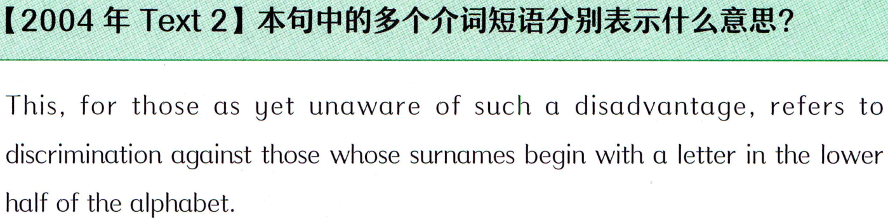

```text
【2004年Text2】本句中的多个介词短语分别表示什么意思？
This, for those as yet unaware of such a disadvantage, refers to
discrimination against those whose surnames begin with a letter in the lower
half of the alphabet.
```

### 【2004年Text3】本句如何断开?

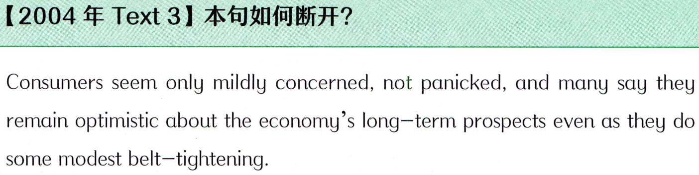

```text
【2004年Text3】本句如何断开?
Consumers seem only mildly concerned, not panicked, and many say they
remain optimistic about the economy's long-term prospects even as they do
some modest belt-tightening.
```

### 【2004年Text4】本句如何断开并简化?

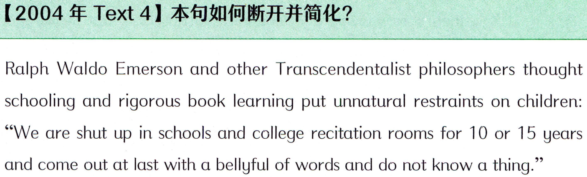

```text
【2004年Text4】本句如何断开并简化?
Ralph Waldo Emerson and other Transcendentalist philosophers thought
schooling and rigorous book learning put unnatural restraints on children:
*"We are shut up in schools and college recitation rooms for 10 or 15 years
and come out at last with a bellyful of words and do not know a thing."
```

### 【2004年Text4】本句如何断开？

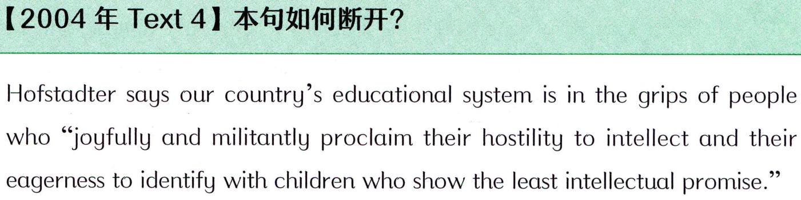

```text
【2004年Text4】本句如何断开？
doad jo sdiu au u si shs pouonpa shunoo no shos pso
who “joyfully and militantly proclaim their hostility to intellect and their
eagerness to identify with children who show the least intellectual promise."
```

### 【2005年Text1】本句中的平行结构，分别是什么与什么平行

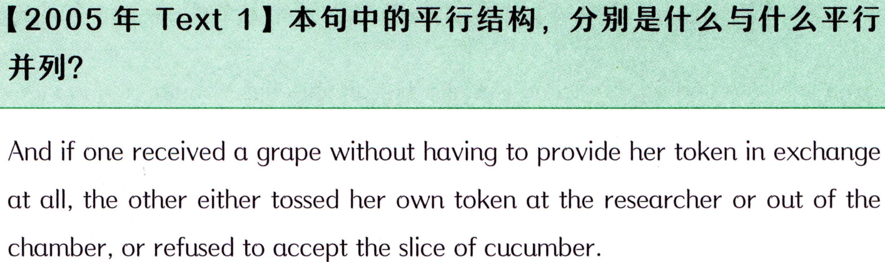

```text
【2005年Text1】本句中的平行结构，分别是什么与什么平行
并列？
And if one received a grape without having to provide her token in exchange
at all,the other either tossed her own token atthe researcher oroutof the
chamber,orrefused to acceptthe slice of cucumber.
```

### 【2005年Text1】主句的主语是哪部分？

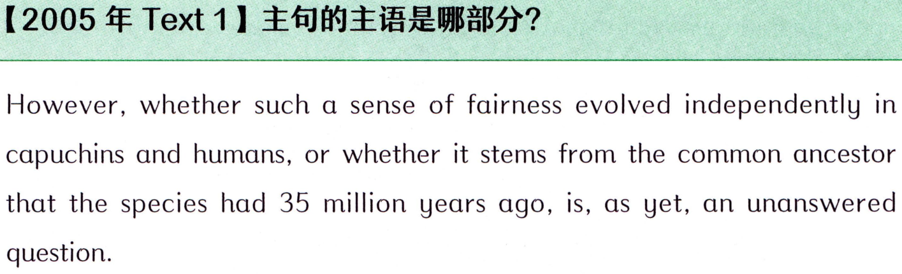

```text
【2005年Text1】主句的主语是哪部分？
However, whether such a sense of fairness evolved independently in
capuchins and humans, or whether it stems from the common ancestor
that the species had 35 million years ago, is, as yet, an unanswered
question.
```

### 【2005年Text2】本句中的平行结构，分别是什么与什么平行

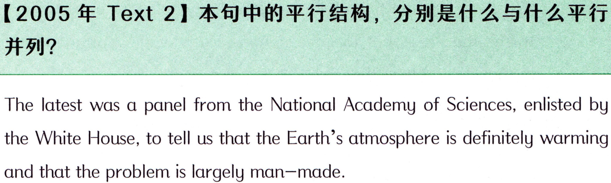

```text
【2005年Text2】本句中的平行结构，分别是什么与什么平行
并列？
The latest was a panel from the National Academy of Sciences, enlisted by
the White House, to tell us that the Earth's atmosphere is definitely warming
and that theproblem is largely man-made.
```

### 【2005年Text2】本句中的两个that从句分别是什么从句？

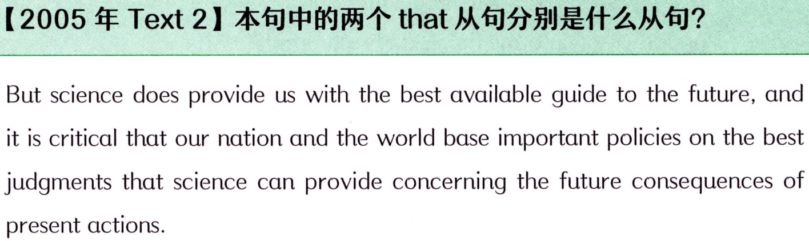

```text
【2005年Text2】本句中的两个that从句分别是什么从句？
But science does provide us with the best available guide to the future, and
it is critical that our nation and the world base important policies on the best
judgments that science can provide concerning the future consequences of
present actions.
```

### 【2005年Text3】本句中包含了几方不同的观点？分别是谁发出的

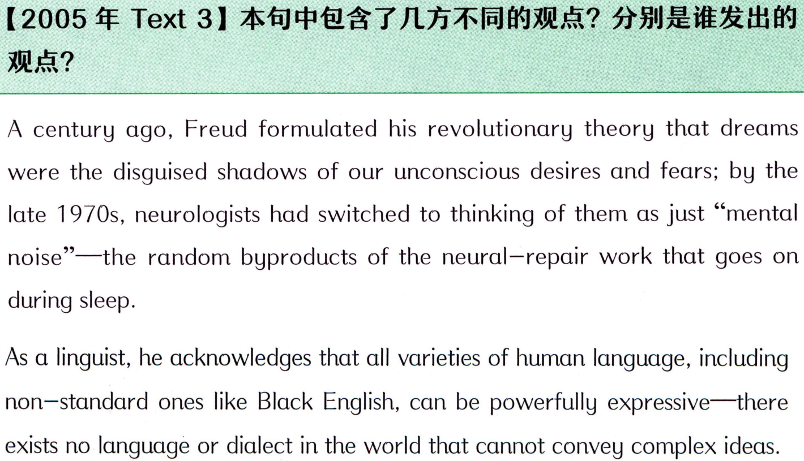

```text
【2005年Text3】本句中包含了几方不同的观点？分别是谁发出的
观点？
A century ago, Freud formulated his revolutionary theory that dreams
were the disguised shadows of our unconscious desires and fears; by the
late 1970s, neurologists had switched to thinking of them as just “mental
noise"—the random byproducts of the neural-repair work that goes on
during sleep.
As α linguist, he acknowledges that all varieties of human language, including
non-standard ones like Black English, can be powerfully expressive—there
exists no language or dialect in the world that cannot convey complex ideas.
```

### 【2006年Text1】本句如何断开和简化？

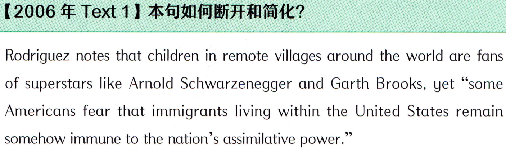

```text
【2006年Text1】本句如何断开和简化？
Rodriguez notes that children in remote villages around the world are fans
of superstars like Arnold Schwarzenegger and Garth Brooks, yet “some
Americans fear that immigrants living within the United States remain
somehow immune to the nation's assimilative power."
```

### 【2006年Text2】本句中的平行结构是什么和什么平行并列？

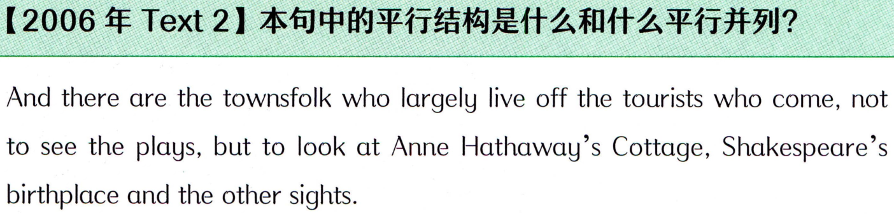

```text
【2006年Text2】本句中的平行结构是什么和什么平行并列？
And there are the townsfolk who largely live off the tourists who come, not
to see the plays, but to look at Anne Hathaway's Cottage, Shakespeare's
birthplace and the other sights.
```

### 【2006年Text2】本句中出现了哪种特殊句式？

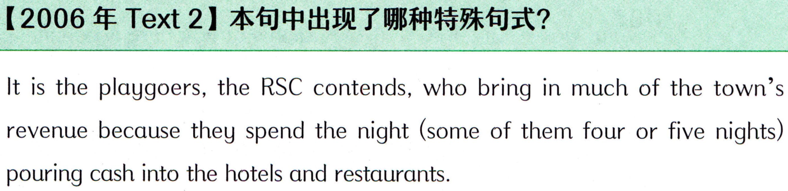

```text
【2006年Text2】本句中出现了哪种特殊句式？
It is the playgoers, the RSC contends, who bring in much of the town's
pouring cash into the hotels and restaurants.
```

### 【2006年Text2】本句如何切分意思群？

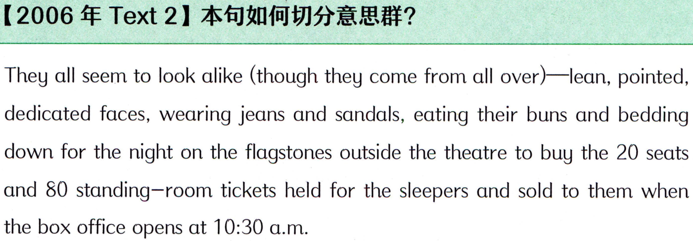

```text
【2006年Text2】本句如何切分意思群？
They all seem to look alike (though they come from all over)——lean, pointed,
dedicated faces, wearing jeans and sandals, eating their buns and bedding
down for the night on the flagstones outside the theatre to buy the 20 seats
and 80 standing-room tickets held for the sleepers and sold to them when
the box office opens at 10:30 a.m.
```

### 【2006年Text3】本句中有几个介词短语？分别表示什么意思？

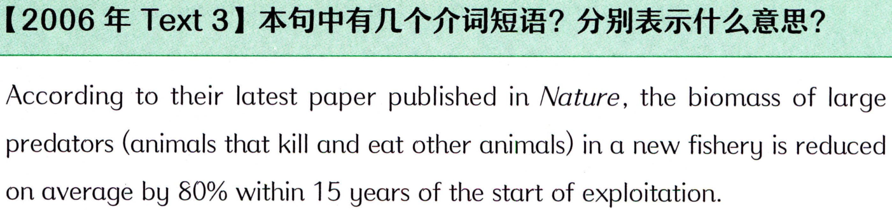

```text
【2006年Text3】本句中有几个介词短语？分别表示什么意思？
According to their latest paper published in Nature, the biomass of large
predators (animals that kill and eat other animals) in a new fishery is reduced
on average by 80% within 15 years of the start of exploitation.
```

### 【2006年Text3】本句中包含了几件事？如何断开？

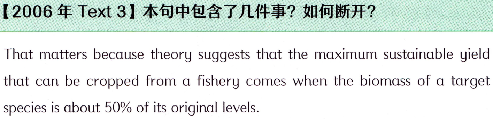

```text
【2006年Text3】本句中包含了几件事？如何断开？
That matters because theory suggests that the maximum sustainable yield
that can be cropped from a fishery comes when the biomass of a target
species is about 50% of its original levels.
```

### 【2006年Text4】本句中有出现嵌套结构和平行结构，你找到

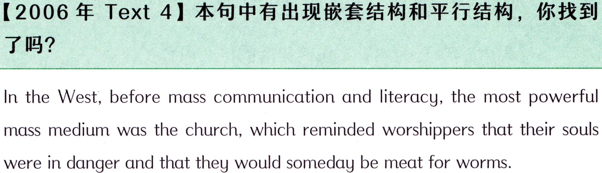

```text
【2006年Text4】本句中有出现嵌套结构和平行结构，你找到
了吗？
In the West, before mass communication and literacy, the most powerful
mass medium was the church, which reminded worshippers that their souls
were in danger and that they would someday be meat for worms.
```

### 【2006年Text4】本句中出现了几处平行结构？分别是什么？

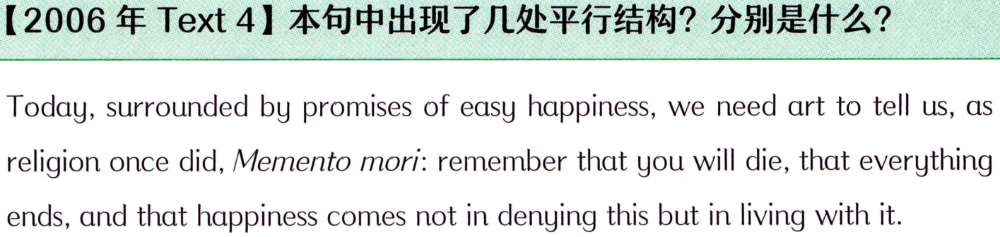

```text
【2006年Text4】本句中出现了几处平行结构？分别是什么？
Today, surrounded by promises of easy happiness, we need art to tell us, as
religion once did, Memento mori: remember that you will die, that everything
ends, and that happiness comes not in denying this but in living with it.
```

### 【2007年Text1】本句中的分裂结构和嵌套结构，你找到了吗？

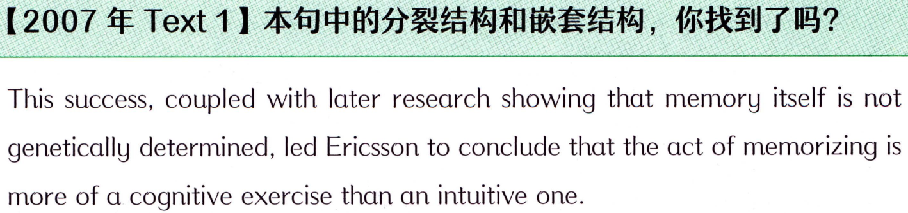

```text
【2007年Text1】本句中的分裂结构和嵌套结构，你找到了吗？
This success, coupled with later research showing that memory itself is not
genetically determined, led Ericsson to conclude that the act of memorizing is
more of a cognitive exercise than an intuitive one.
```

### 【2007年Text2】本句中出现了几处平行结构？分别是什么和什么

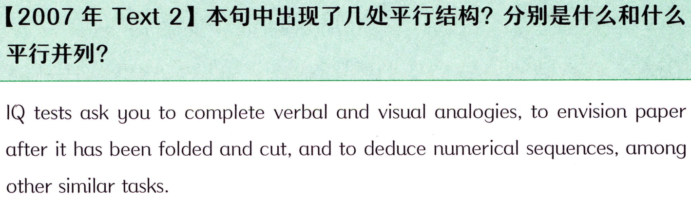

```text
【2007年Text2】本句中出现了几处平行结构？分别是什么和什么
平行并列？
IQ tests ask you to complete verbal and visual analogies, to envision paper
after it has been folded and cut, and to deduce numerical sequences, among
other similar tasks.
```

### 【2007年Text2】本句简化后的核心内容是什么？

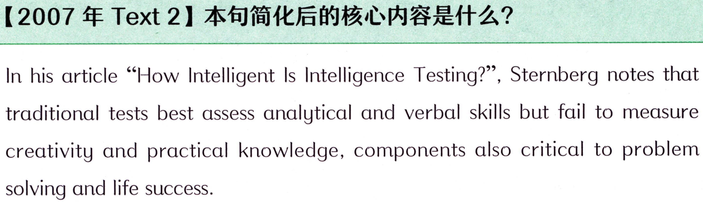

```text
【2007年Text2】本句简化后的核心内容是什么？
In his article “How Intelligent Is Intelligence Testing?", Sternberg notes that
traditional tests best assess analytical and verbal skills but fail to measure
creativity and practical knowledge, components also critical to problem
solving and life success.
```

### 【2007年Text3】本句中的平行结构是什么和什么平行并列？

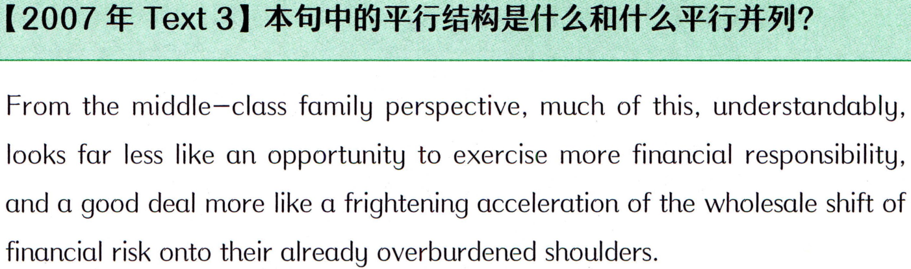

```text
【2007年Text3】本句中的平行结构是什么和什么平行并列？
From the middle-class family perspective, much of this, understandably,
looks far less like an opportunity to exercise more financial responsibility,
and a good deal more like a frightening acceleration of the wholesale shift of
financial risk onto their already overburdened shoulders.
```

### 【2007年Text3】本句简化后的核心内容是什么？

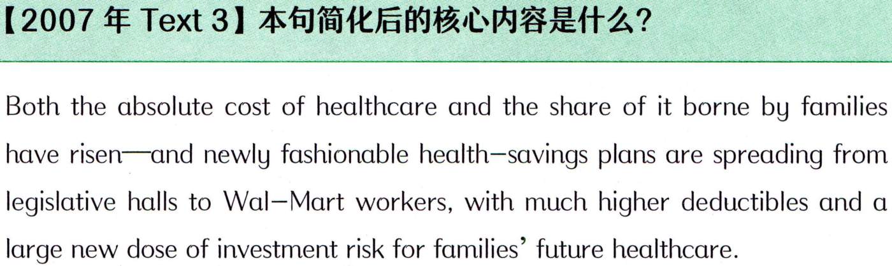

```text
【2007年Text3】本句简化后的核心内容是什么？
Both the absolute cost of healthcare and the share of it borne by families
legislative halls to Wal-Mart workers, with much higher deductibles and a
large new dose of investment risk for families’ future healthcare.
```

### 【2007年Text4】本句如何断开？

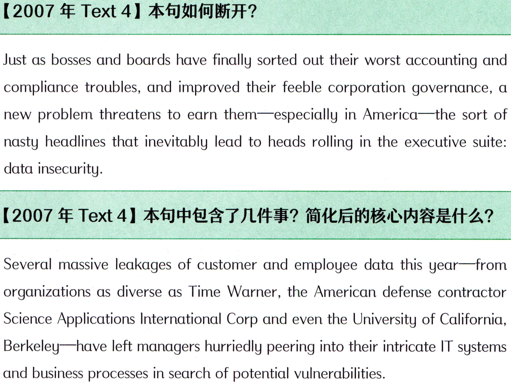

```text
【2007年Text4】本句如何断开？
Just as bosses and boards have finally sorted out their worst accounting and
new problem threatens to earn them—especially in America—the sort of
nasty headlines that inevitably lead to heads rolling in the executive suite:
data insecurity.
Several massive leakages of customer and employee data this year—from
organizations as diverse as Time Warner, the American defense contractor
Science Applications International Corp and even the University of California,
Berkeley—have left managers hurriedly peering into their intricate IT systems
and business processes in search of potential vulnerabilities.
```

### 【2007年Text4】本句中的分裂结构和平行结构，你找到了吗？

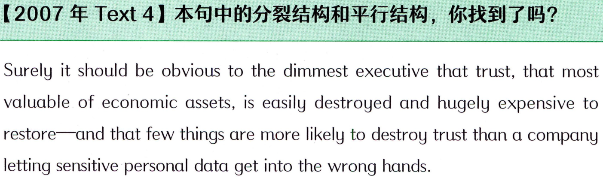

```text
【2007年Text4】本句中的分裂结构和平行结构，你找到了吗？
Surely it should be obvious to the dimmest executive that trust, that most
valuable of economic assets, is easily destroyed and hugely expensive to
restore—-and that few things are more likely to destroy trust than a company
letting sensitive personal data get into the wrong hands.
```

### 【2007年Text4】本句中有几个从句？主句的核心内容是什么？

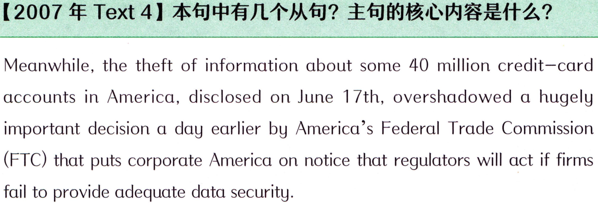

```text
【2007年Text4】本句中有几个从句？主句的核心内容是什么？
Meanwhile, the theft of information about some 40 million credit-card
accounts in America, disclosed on June 17th, overshadowed a hugely
important decision a day earlier by America's Federal Trade Commission
(FTC) that puts corporate America on notice that regulators will act if firms
fail to provide adequate data security.
```

### 【2008年Text1】本句中的两个that从句分别是什么从句？

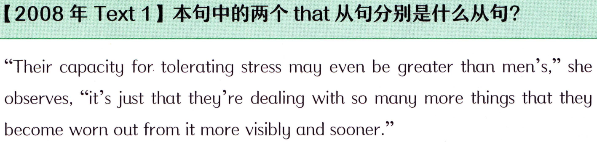

```text
【2008年Text1】本句中的两个that从句分别是什么从句？
"Their capacity for tolerating stress may even be greater than men's,” she
observes, “it's just that they're dealing with so many more things that they
become worn out from it more visibly and sooner."
```

### 【2008年Text1】本句如何断开？

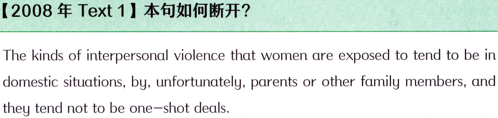

```text
【2008年Text1】本句如何断开？
The kinds of interpersonal violence that women are exposed to tend to be in
domestic situations, by, unfortunately, parents or other family members, and
they tend not to be one-shot deals.
```

### 【2008年Text2】本句中的分裂结构和嵌套结构，你找到了吗？

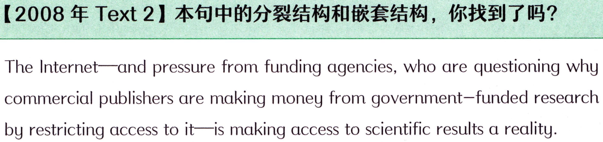

```text
【2008年Text2】本句中的分裂结构和嵌套结构，你找到了吗？
The Internet—and pressure from funding agencies, who are questioning why
commercial publishers are making money from government-funded research
by restricting access to it——is making access to scientific results a reality.
```

### 【2008年Text2】每个从句分别是什么从句？修饰或补充什么内容？

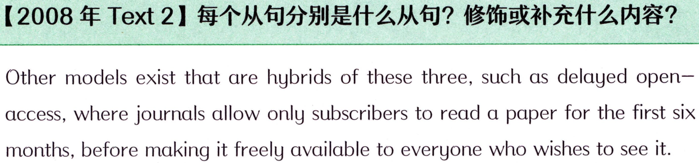

```text
【2008年Text2】每个从句分别是什么从句？修饰或补充什么内容？
Other models exist that are hybrids of these three, such as delayed open-
access, where journals allow only subscribers to read a paper for the first six
months, before making it freely available to everyone who wishes to see it.
```

### 【2008年Text3】主句简化后的核心内容是什么？

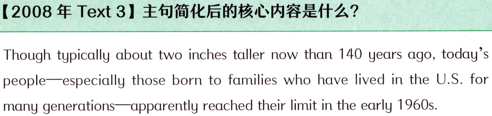

```text
【2008年Text3】主句简化后的核心内容是什么？
Though typically about two inches taller now than 140 years ago, today's
people—-especially those born to families who have lived in the U.S. for
many generations—apparently reached their limit in the early 1960s.
```

### 【2008年Text4】本句包含了几件事？如何断开？

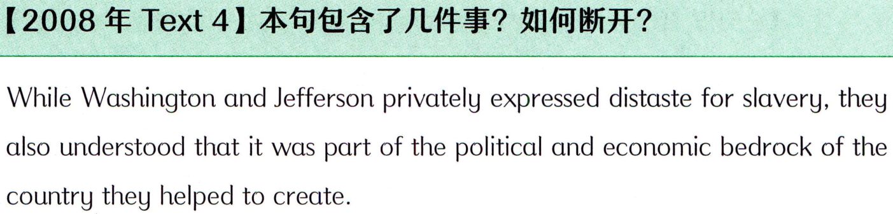

```text
【2008年Text4】本句包含了几件事？如何断开？
While Washington and Jefferson privately expressed distaste for slavery, they
also understood that it was part of the political and economic bedrock of the
country they helped to create.
```

### 【2008年Text4】本句如何断开和简化?

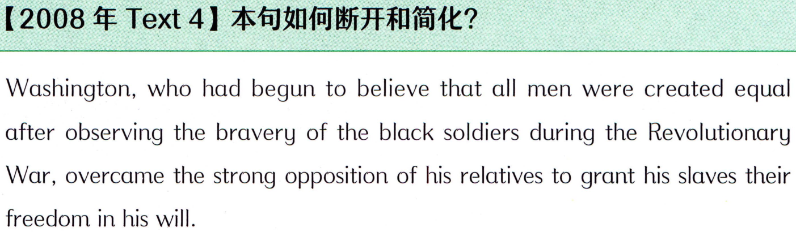

```text
【2008年Text4】本句如何断开和简化?
Washington, who had begun to believe that all men were created equal
after observing the bravery of the black soldiers during the Revolutionary
War, overcame the strong opposition of his relatives to grant his slaves their
freedom in his will.
```

### 【2009年Text1】本句如何断开？什么从句嵌套了什么从句？

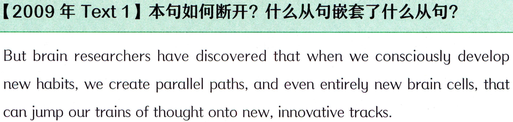

```text
【2009年Text1】本句如何断开？什么从句嵌套了什么从句？
But brain researchers have discovered that when we consciously develop
new habits, we create parallel paths, and even entirely new brain cells, that
can jump our trains of thought onto new, innovative tracks.
```

### 【2009年Text1】本句中的几个比较级表达什么意思？

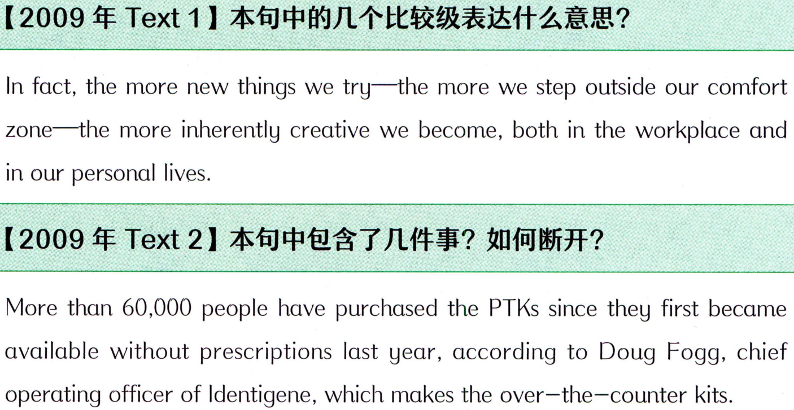

```text
【2009年Text1】本句中的几个比较级表达什么意思？
In fact, the more new things we try—the more we step outside our comfort
zone—the more inherently creative we become, both in the workplace and
in our personal lives.
More than 60,000 people have purchased the PTKs since they first became
available without prescriptions last year, according to Doug Fogg, chief
operating officer of Identigene, which makes the over-the-counter kits.
```

### 【2009年Text3】本句断开为几部分？每部分的核心内容是什么？

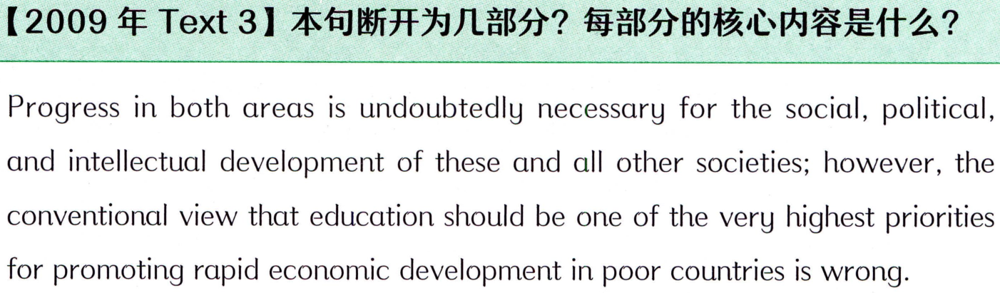

```text
【2009年Text3】本句断开为几部分？每部分的核心内容是什么？
Progress in both areas is undoubtedly necessary for the social, political,
and intellectual development of these and all other societies; however, the
conventional view that education should be one of the very highest priorities
for promoting rapid economic development in poor countries is wrong.
```

### 【2009年Text3】because从句中主语和谓语动词分别是哪部分？

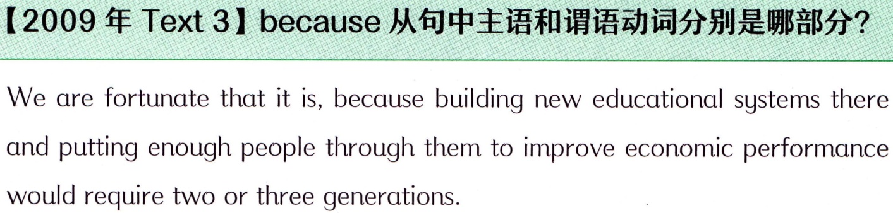

```text
【2009年Text3】because从句中主语和谓语动词分别是哪部分？
We are fortunate that it is, because building new educational systems there
would require two or three generations.
```

### 【2009年Text3】本句如何断开？简化后的核心内容是什么？

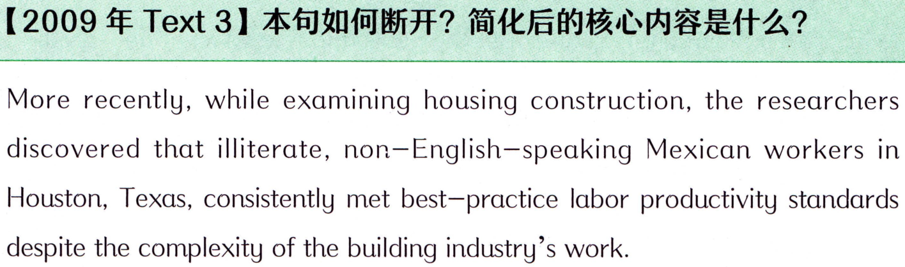

```text
【2009年Text3】本句如何断开？简化后的核心内容是什么？
More recently, while examining housing construction, the researchers
discovered that illiterate, non-English-speaking Mexican workers in
Houston, Texas, consistently met best-practice labor productivity standards
despite the complexity of the building industry's work.
```

### 【2009年Text3】本句中表达了几件事？简化后的核心内容是

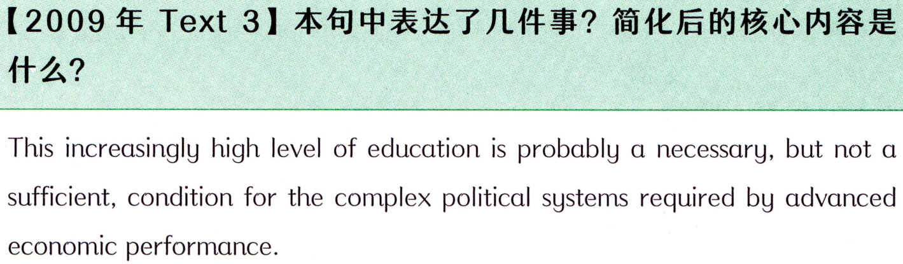

```text
【2009年Text3】本句中表达了几件事？简化后的核心内容是
什么？
This increasingly high level of education is probably a necessary, but not α
sufficient, condition for the complex political systems required by advanced
economic performance.
```

### 【2009年Text4】本句中的主语和宾语分别是哪部分？什么来充当

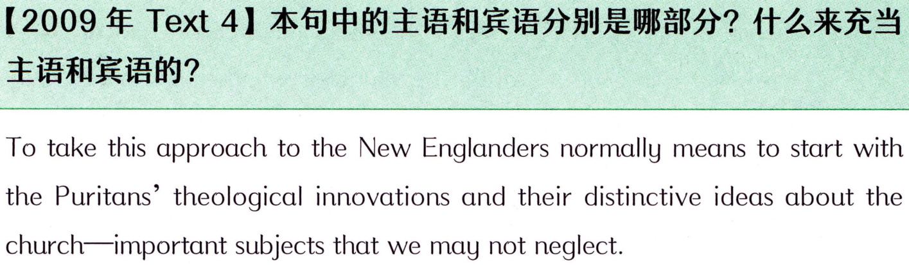

```text
【2009年Text4】本句中的主语和宾语分别是哪部分？什么来充当
主语和宾语的？
To take this approach to the New Englanders normally means to start with
the Puritans’theological innovations and their distinctive ideas about the
church--important subjects that we may not neglect.
```

### 【2010年英语一Text1】句子的主语是哪部分？

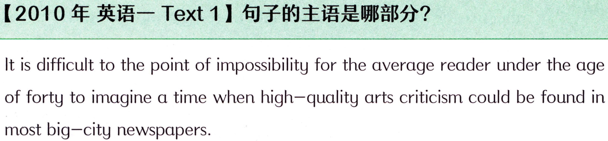

```text
【2010年英语一Text1】句子的主语是哪部分？
It is difficult to the point of impossibility for the average reader under the age
of forty to imagine a time when high-quality arts criticism could be found in
most big-city newspapers.
```

### 【2010年英语一Text1】句子的核心内容是什么？

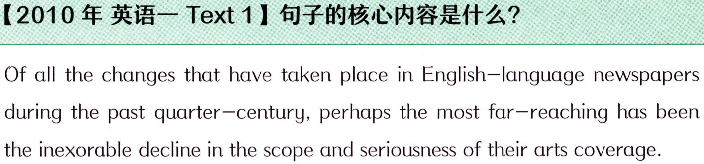

```text
【2010年英语一Text1】句子的核心内容是什么？
Of all the changes that have taken place in English-language newspapers
during the past quarter-century, perhaps the most far-reaching has been
the inexorable decline in the scope and seriousness of their arts coverage.
```

### 【2010年英语一Text1】你能找到两个定语从句吗？其修饰的先行

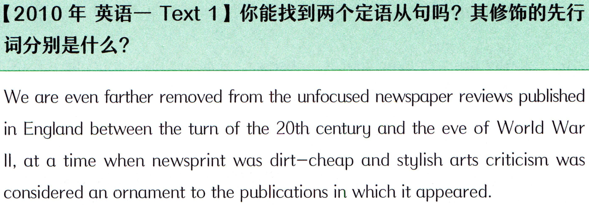

```text
【2010年英语一Text1】你能找到两个定语从句吗？其修饰的先行
词分别是什么？
in England between the turn of the 2Oth century and the eve of World War
Il, at a time when newsprint was dirt-cheap and stylish arts criticism was
considered an ornament to the publications in which it appeared.
```

### 【2010年英语一Text2】你能找到句子中的强调句吗？强调句强调

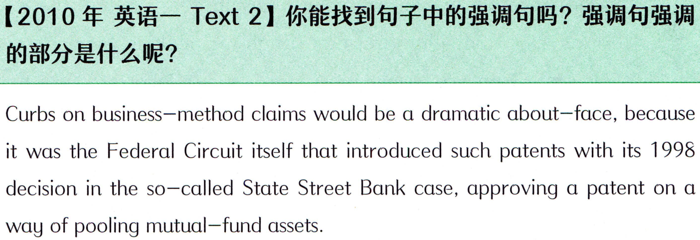

```text
【2010年英语一Text2】你能找到句子中的强调句吗？强调句强调
的部分是什么呢？
Curbs on business-method claims would be a dramatic about-face, because
it was the Federal Circuit itself that introduced such patents with its 1998
way of pooling mutual-fund assets.
```

### 【2010年英语一Text2】你能找到句子中的平行结构、嵌套结构和

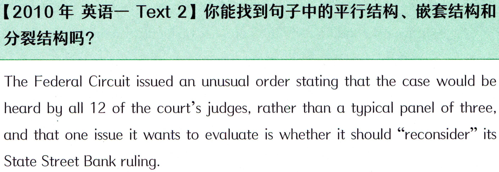

```text
【2010年英语一Text2】你能找到句子中的平行结构、嵌套结构和
分裂结构吗？
The Federal Circuit issued an unusual order stating that the case would be
heard by all 12 of the court's judges, rather than a typical panel of three,
State Street Bank ruling.
```

### 【2010年英语一Text3】how从句到哪里结束?

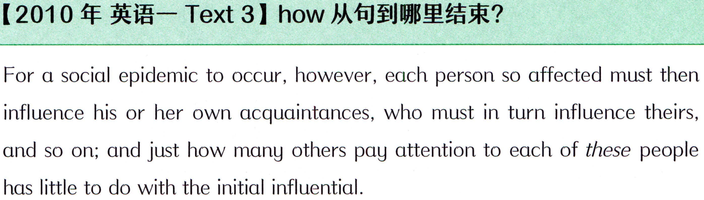

```text
【2010年英语一Text3】how从句到哪里结束?
For a social epidemic to occur, however, each person so affected must then
influence his or her own acquaintances, who must in turn influence theirs,
and so on; and just how many others pay attention to each of these people
has little to do with the initial influential.
```

### 【2010年英语一Text3】我给大家总结的特殊长难句的三种结构

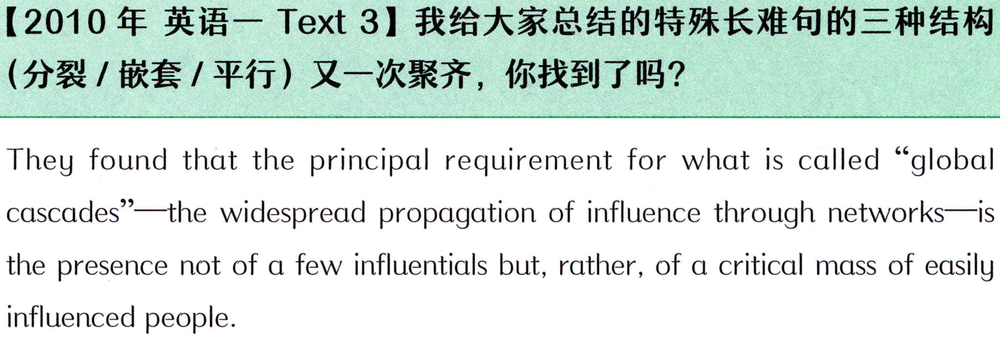

```text
【2010年英语一Text3】我给大家总结的特殊长难句的三种结构
（分裂／嵌套／平行）又一次聚齐，你找到了吗？
cascades"—the widespread propagation of influence through networks——is
the presence not of a few influentials but, rather, of a critical mass of easily
influenced people.
```

### 【2010年英语一Text4】你能找到两个从句吗（不是并列句哦）？

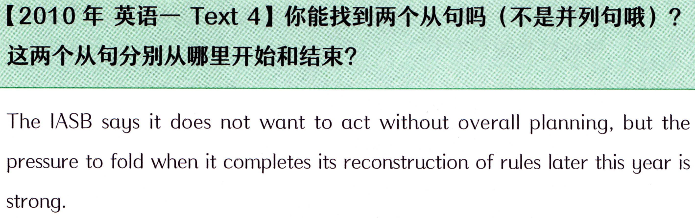

```text
【2010年英语一Text4】你能找到两个从句吗（不是并列句哦）？
这两个从句分别从哪里开始和结束？
The IASB says it does not want to act without overall planning, but the
pressure to fold when it completes its reconstruction of rules later this year is
strong.
```

### 【2010年英语二Text1】你能找到句子的核心内容吗？

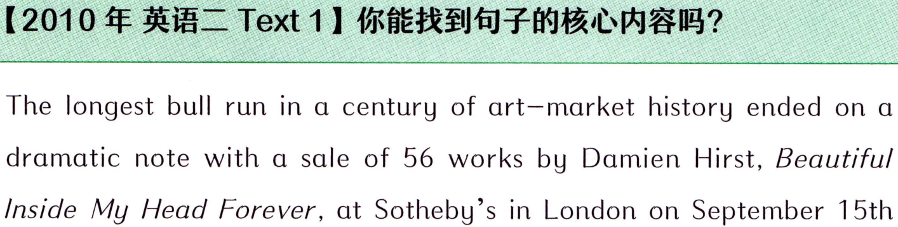

```text
【2010年英语二Text1】你能找到句子的核心内容吗？
The longest bull run in a century of art-market history ended on a
dramatic note with a sale of 56 works by Damien Hirst, Beautiful
Inside My Head Forever, at Sotheby's in London on September 15th
```

### 【2010年英语二Text1】你能找到平行结构吗？

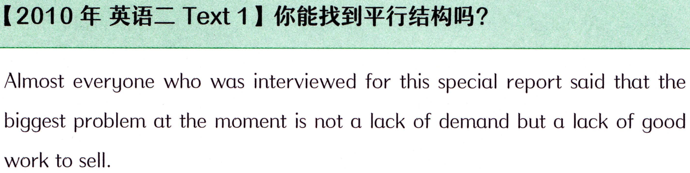

```text
【2010年英语二Text1】你能找到平行结构吗？
Almost everyone who was interviewed for this special report said that the
biggest problem at the moment is not a lack of demand but a lack of good
work to sell.
```

### 【2010年英语二Text2】你能找到主句的核心内容吗？

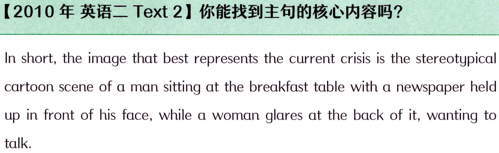

```text
【2010年英语二Text2】你能找到主句的核心内容吗？
In short, the image that best represents the current crisis is the stereotypical
            s g
up in front of his face, while a woman glares at the back of it, wanting to
talk.
```

### 【2010年英语二Text3】两个that从句分别修饰什么？

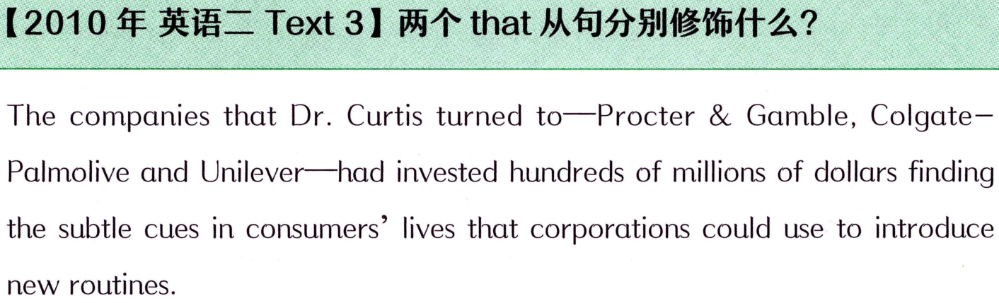

```text
【2010年英语二Text3】两个that从句分别修饰什么？
The companies that Dr. Curtis turned to—Procter & Gamble, Colgate-
Palmolive and Unilever—had invested hundreds of millions of dollars finding
the subtle cues in consumers’ lives that corporations could use to introduce
new routines.
```

### 【2010年英语二Text4】这句话为什么写这么长？包含了什么特殊

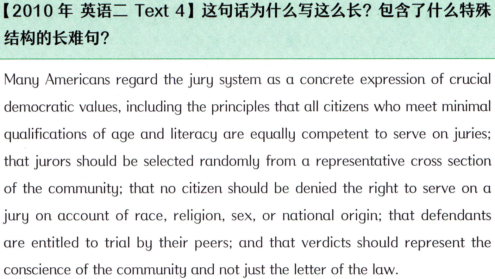

```text
【2010年英语二Text4】这句话为什么写这么长？包含了什么特殊
结构的长难句？
Many Americans regard the jury system as a concrete expression of crucial
democratic values, including the principles that all citizens who meet minimal
qualifications of age and literacy are equally competent to serve on juries;
that jurors should be selected randomly from a representative cross section
of the community; that no citizen should be denied the right to serve on a
jury on account of race, religion, sex, or national origin; that defendants
are entitled to trial by their peers; and that verdicts should represent the
conscience of the community and not just the letter of the law.
```

### 【2010年英语二Text 4】简化长难句之后，这个句子的核心内容是

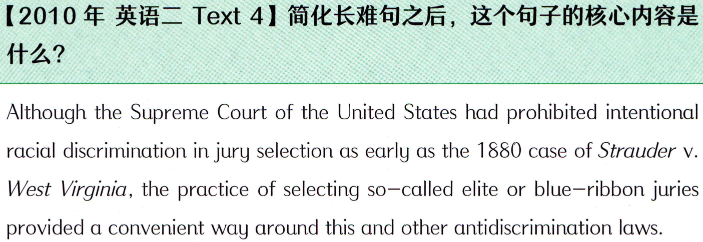

```text
【2010年英语二Text 4】简化长难句之后，这个句子的核心内容是
什么？
Although the Supreme Court of the United States had prohibited intentional
racial discrimination in jury selection as early as the 1880 case of Strauder v.
West Virginia, the practice of selecting so-called elite or blue-ribbon juries
provided a convenient way around this and other antidiscrimination laws.
```

### 【2011年英语一Text1】你能找到几处平行结构呢？

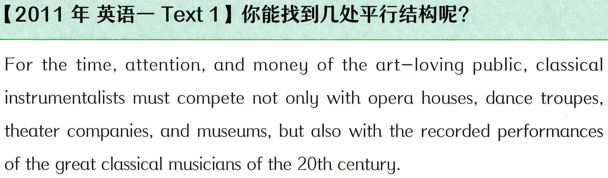

```text
【2011年英语一Text1】你能找到几处平行结构呢？
For the time, attention, and money of the art-loving public, classical
instrumentalists must compete not only with opera houses, dance troupes,
theater companies, and museums, but also with the recorded performances
of the great classical musicians of the 2Oth century.
```

### 【2011年英语一Text2】你能找到句子中的宾语是哪部分吗？

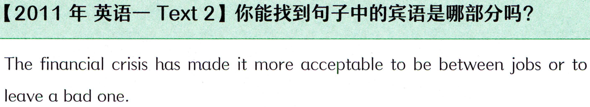

```text
【2011年英语一Text2】你能找到句子中的宾语是哪部分吗？
The financial crisis has made it more acceptable to be between jobs or to
leave a bad one.
```

### 【2011年英语一Text3】你能找到句子中的嵌套结构吗？什么从句

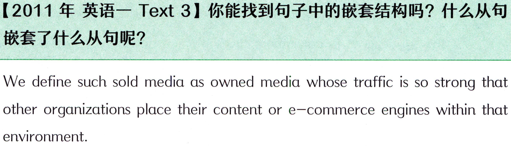

```text
【2011年英语一Text3】你能找到句子中的嵌套结构吗？什么从句
嵌套了什么从句呢？
We define such sold media as owned media whose traffic is so strong that
environment.
```

### 【2011年英语一Text3】你能找到主句的核心内容吗？

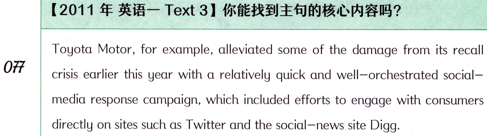

```text
【2011年英语一Text3】你能找到主句的核心内容吗？
Toyota Motor, for example, alleviated some of the damage from its recall
OFT
crisis earlier this year with a relatively quick and well-orchestrated social-
media response campaign, which included efforts to engage with consumers
directly on sites such as Twitter and the social-news site Digg.
```

### 【2011年英语一Text4】你能找到句子中的嵌套结构吗？什么从句

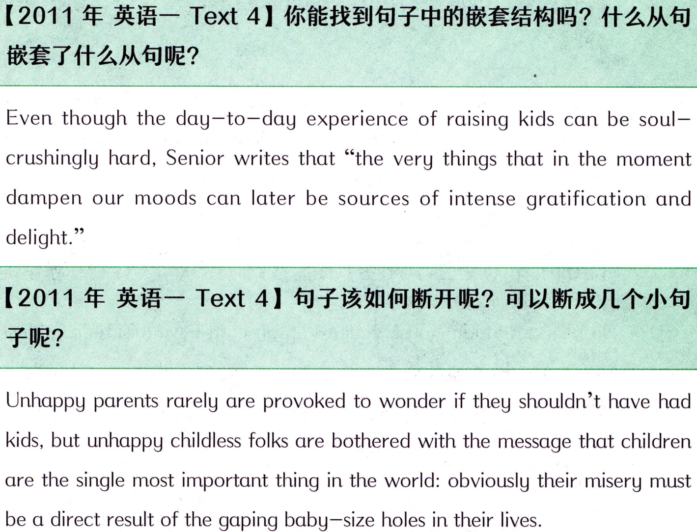

```text
【2011年英语一Text4】你能找到句子中的嵌套结构吗？什么从句
嵌套了什么从句呢？
Even though the day-to-day experience of raising kids can be soul-
crushingly hard, Senior writes that “the very things that in the moment
dampen our moods can later be sources of intense gratification and
delight."
子呢？
Unhappy parents rarely are provoked to wonder if they shouldn't have had
kids, but unhappy childless folks are bothered with the message that children
are the single most important thing in the world: obviously their misery must
be a direct result of the gaping baby-size holes in their lives.
```

### 【2011年英语二Text1】句子能断开为几个小句子？讲了几件事？

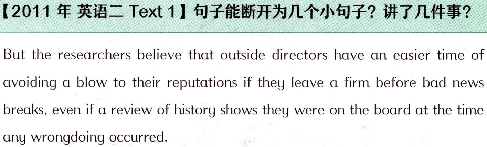

```text
【2011年英语二Text1】句子能断开为几个小句子？讲了几件事？
But the researchers believe that outside directors have an easier time of
avoiding a blow to their reputations if they leave a firm before bad news
breaks, even if a review of history shows they were on the board at the time
any wrongdoing occurred.
```

### 【2011年英语二Text2】句子中的两个从句分别结束于哪里？

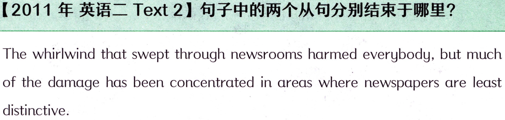

```text
【2011年英语二Text2】句子中的两个从句分别结束于哪里？
The whirlwind that swept through newsrooms harmed everybody, but much
of the damage has been concentrated in areas where newspapers are least
distinctive.
```

### 【2011年英语二Text3】你能找到句子的核心内容吗？

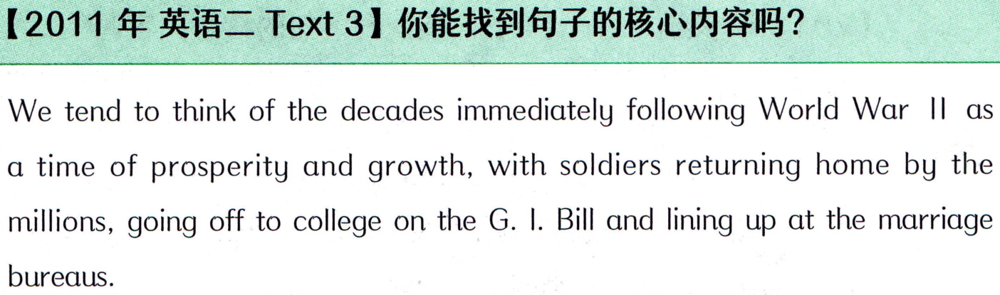

```text
【2011年英语二Text3】你能找到句子的核心内容吗？
We tend to think of the decades immediately following World War ll as
a time of prosperity and growth, with soldiers returning home by the
millions, going off to college on the G. I. Bill and lining up at the marriage
bureaus.
```

### 【2011年英语二Text3】who引导的从句中，谓语动词是哪部

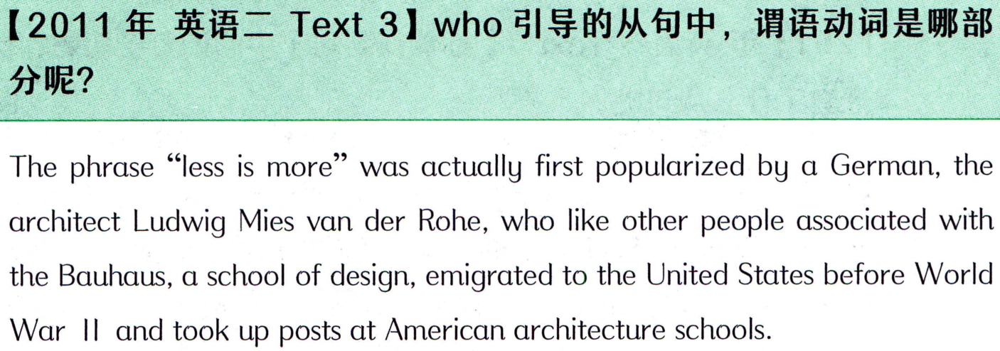

```text
【2011年英语二Text3】who引导的从句中，谓语动词是哪部
分呢？
The phrase “less is more” was actually first popularized by a German, the
architect Ludwig Mies van der Rohe, who like other people associated with
the Bauhaus, a school of design, emigrated to the United States before World
War ll and took up posts at American architecture schools.
```

### 【2011年英语二Text3】你能找到几个从句？分别在哪里呢？

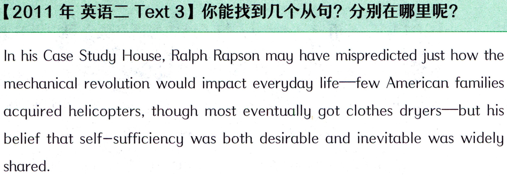

```text
【2011年英语二Text3】你能找到几个从句？分别在哪里呢？
In his Case Study House, Ralph Rapson may have mispredicted just how the
mechanical revolution would impact everyday life—few American families
acquired helicopters, though most eventually got clothes dryers—but his
belief that self-sufficiency was both desirable and inevitable was widely
shared.
```

### 【2011年英语二Text4】你知道which引l导的从句修饰的是哪部

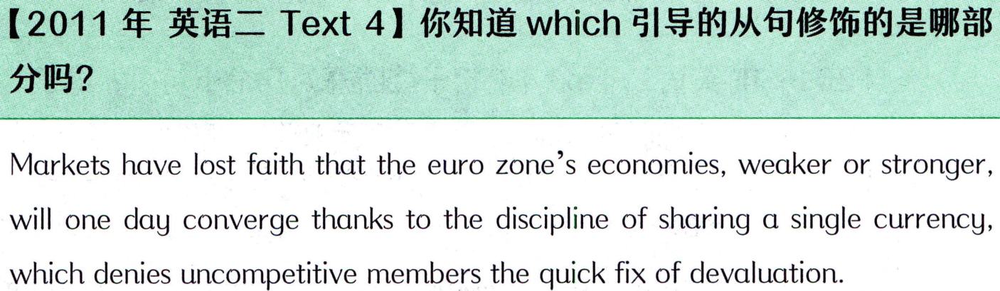

```text
【2011年英语二Text4】你知道which引l导的从句修饰的是哪部
分吗？
Markets have lost faith that the euro zone's economies, weaker or stronger,
will one day converge thanks to the discipline of sharing a single currency,
which denies uncompetitive members the quick fix of devaluation.
```

### 【2011年英语二Text4】定语从句是哪部分？它修饰的是什么？

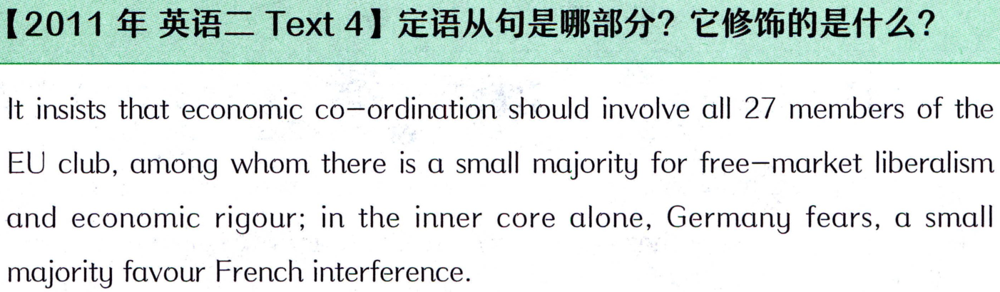

```text
【2011年英语二Text4】定语从句是哪部分？它修饰的是什么？
It insists that economic co-ordination should involve all 27 members of the
EU club, among whom there is a small majority for free-market liberalism
and economic rigour; in the inner core alone, Germany fears, a small
majority favour French interference.
```

### 【2012年英语一Text1】句子中有几个从句？分别是什么从句呢？

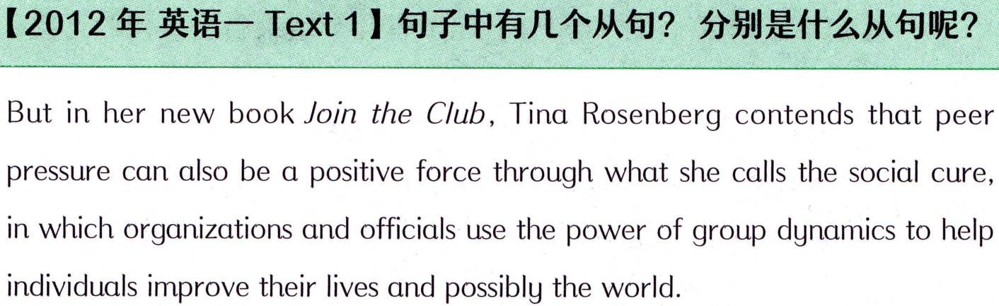

```text
【2012年英语一Text1】句子中有几个从句？分别是什么从句呢？
But in her new book Join the Club, Tina Rosenberg contends that peer
pressure can also be a positive force through what she calls the social cure,
in which organizations and officials use the power of group dynamics to help
individuals improve their lives and possibly the world.
```

### 【2012年英语一Text2】此句简化后，句子的核心内容是什么？

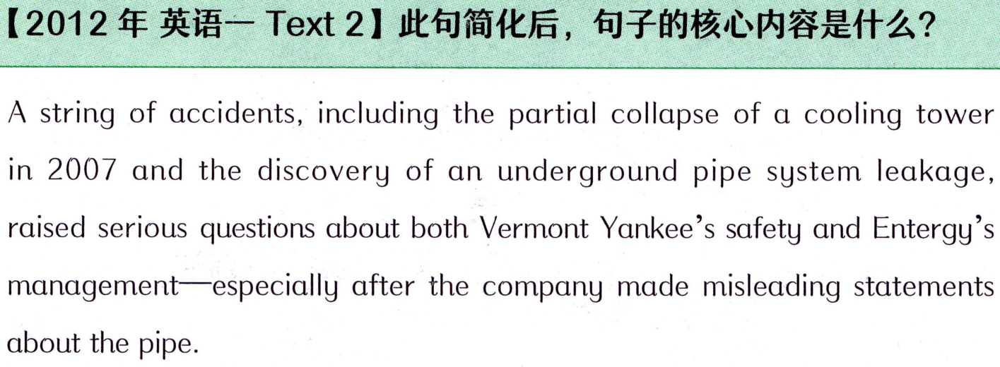

```text
【2012年英语一Text2】此句简化后，句子的核心内容是什么？
A string of accidents, including the partial collapse of a cooling tower
in 2007 and the discovery of an underground pipe system leakage,
raised serious questions about both Vermont Yankee's safety and Entergy's
management-especially after the company made misleading statements
about the pipe.
```

### 【2012年英语一Text2】此句中包含了几件事？可以断成几段？

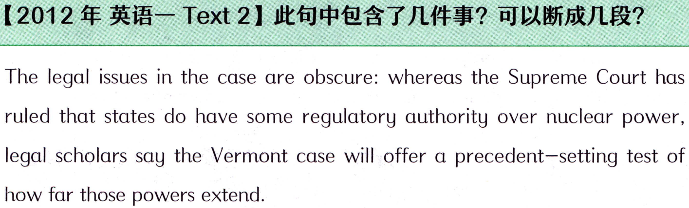

```text
【2012年英语一Text2】此句中包含了几件事？可以断成几段？
The legal issues in the case are obscure: whereas the Supreme Court has
ruled that states do have some regulatory authority over nuclear power,
legal scholars say the Vermont case will offer a precedent-setting test of
how far those powers extend.
```

### 【2012年英语一Text3】句子的核心内容是什么？

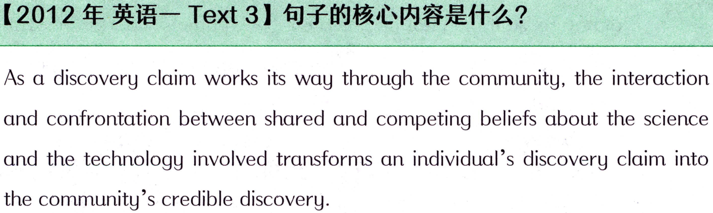

```text
【2012年英语一Text3】句子的核心内容是什么？
As a discovery claim works its way through the community, the interaction
and confrontation between shared and competing beliefs about the science
and the technology involved transforms an individual's discovery claim into
the community's credible discovery.
```

### 【2012年英语一Text4】此句中的嵌套结构和平行结构，你找到

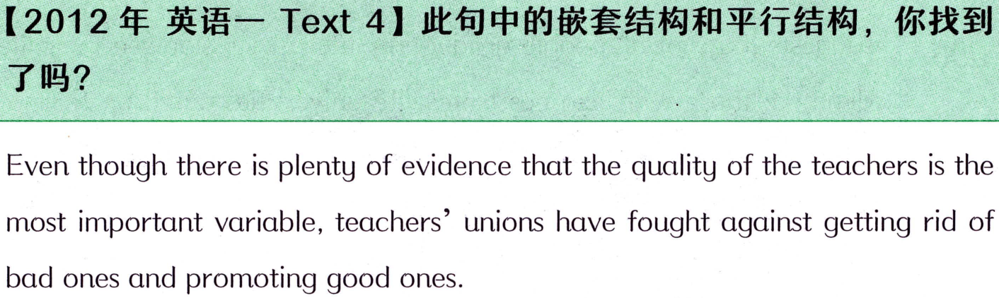

```text
【2012年英语一Text4】此句中的嵌套结构和平行结构，你找到
了吗？
Even though there is plenty of evidence that the quality of the teachers is the
most important variable, teachers’ unions have fought against getting rid of
bad ones and promoting good ones.
```

### 【2012年英语二Text1】句中有几个用来引出从句的连接词？

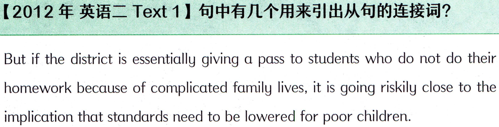

```text
【2012年英语二Text1】句中有几个用来引出从句的连接词？
But if the district is essentially giving a pass to students who do not do their
homework because of complicated family lives, it is going riskily close to the
implication that standards need to be lowered for poor children.
```

### 【2012年英语二Text2】句中的4个代词it分别指什么？

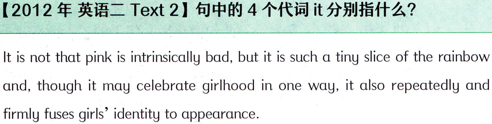

```text
【2012年英语二Text2】句中的4个代词it分别指什么？
It is not that pink is intrinsically bad, but it is such a tiny slice of the rainbow
and, though it may celebrate girlhood in one way, it also repeatedly and
firmly fuses girls' identity to appearance.
```

### 【2012年英语二Text2】句中的强调句你找到了吗？强调的是什么？

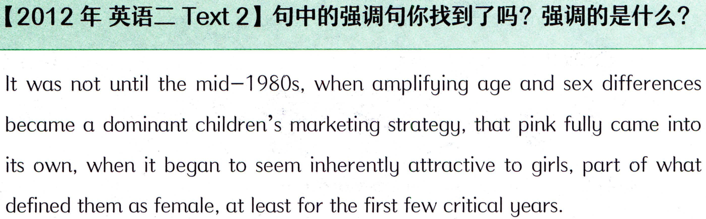

```text
【2012年英语二Text2】句中的强调句你找到了吗？强调的是什么？
It was not until the mid-1980s, when amplifying age and sex differences
became a dominant children's marketing strategy, that pink fully came into
its own, when it began to seem inherently attractive to girls, part of what
defined them as female, at least for the first few critical years.
```

### 【2012年英语二Text3】句中的哪些标点可以帮助断开长难句？

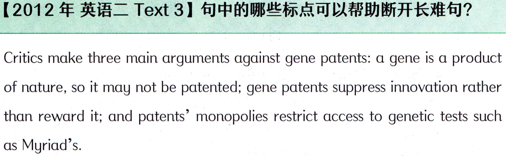

```text
【2012年英语二Text3】句中的哪些标点可以帮助断开长难句？
Critics make three main arguments against gene patents: a gene is a product
of nature, so it may not be patented; gene patents suppress innovation rather
than reward it; and patents’ monopolies restrict access to genetic tests such
as Myriad's.
```

### 【2012 年英语二Text4】此句中的强调和虚拟，你找到了吗?

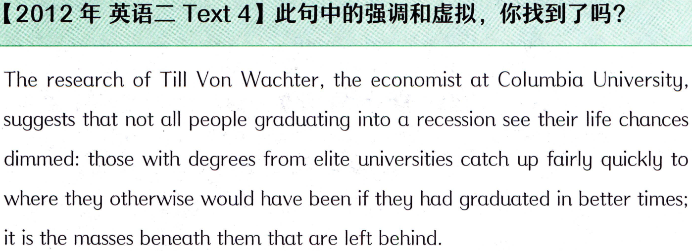

```text
【2012 年英语二Text4】此句中的强调和虚拟，你找到了吗?
The research of Till Von Wachter, the economist at Columbia University,
suggests that not all people graduating into a recession see their life chances
dimmed: those with degrees from elite universities catch up fairly quickly to
where they otherwise would have been if they had graduated in better times;
it is the masses beneath them that are left behind.
```

### 【2013年英语一Text1】句中一共包含几件事？其中第2件事的核

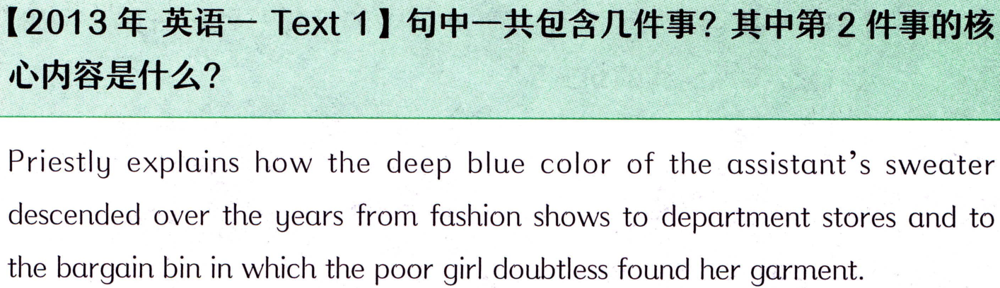

```text
【2013年英语一Text1】句中一共包含几件事？其中第2件事的核
心内容是什么？
Priestly explains how the deep blue color of the assistant's sweater
descended over the years from fashion shows to department stores and to
the bargain bin in which the poor girl doubtless found her garment.
```

### 【2013年英语一Text1】两个破折号之外的todo是什么关系？它

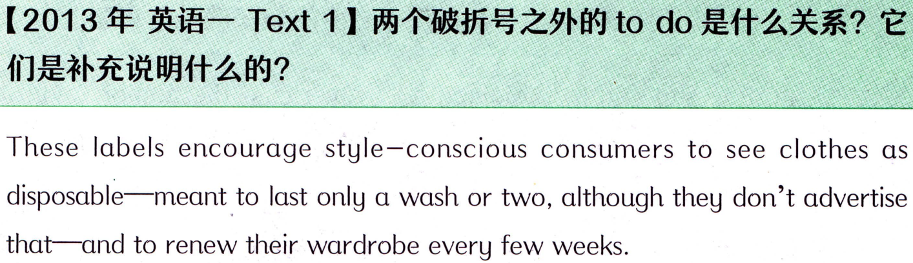

```text
【2013年英语一Text1】两个破折号之外的todo是什么关系？它
们是补充说明什么的？
These labels encourage style-conscious consumers to see clothes as
disposable—meant to last only a wash or two, although they don't advertise
that—and to renew their wardrobe every few weeks.
```

### 【2013年英语一Text2】it指代什么？其后的that引l导什么从句？

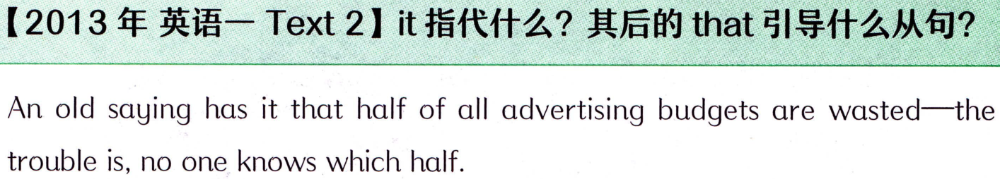

```text
【2013年英语一Text2】it指代什么？其后的that引l导什么从句？
An old saying has it that half of all advertising budgets are wasted—the
trouble is, no one knows which half.
```

### 【2013年英语一Text2】sothat引l导的是什么从句？其后怎么

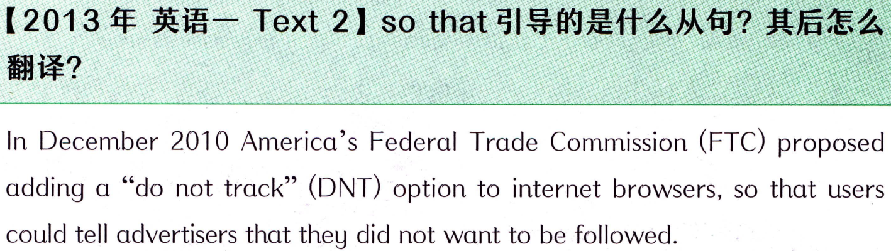

```text
【2013年英语一Text2】sothat引l导的是什么从句？其后怎么
翻译？
In December 2010 America's Federal Trade Commission (FTC) proposed
adding a “do not track" (DNT) option to internet browsers, so that users
could tell advertisers that they did not want to be followed.
```

### 【2013年英语一Text3】and it's perhaps中的it指代的是什么？

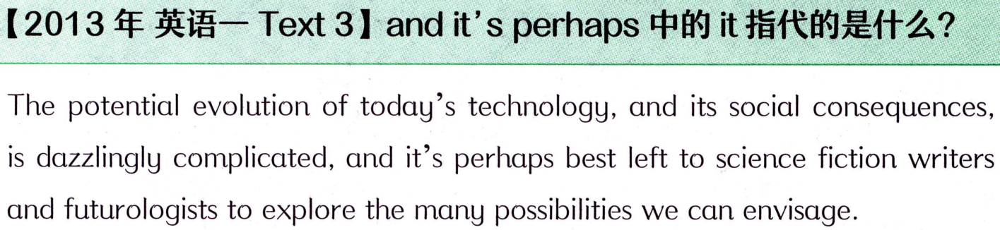

```text
【2013年英语一Text3】and it's perhaps中的it指代的是什么？
The potential evolution of today's technology, and its social consequences,
is dazzlingly complicated, and it's perhaps best left to science fiction writers
and futurologists to explore the many possibilities we can envisage.
```

### 【2013年英语一Text3】两个非谓语动词词组shaping...和to

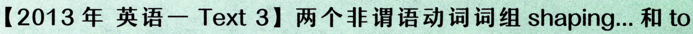

```text
【2013年英语一Text3】两个非谓语动词词组shaping...和to
```

## make..分别修饰什么？

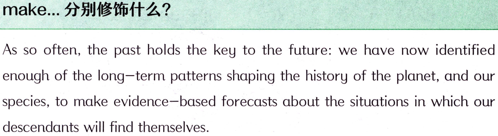

```text
make..分别修饰什么？
As so often, the past holds the key to the future: we have now identified
enough of the long-term patterns shaping the history of the planet, and our
species, to make evidence-based forecasts about the situations in which our
descendantswill findthemselves.
```

### 【2013年英语一Text4】本句中的从句从哪里开始、到哪里结束？

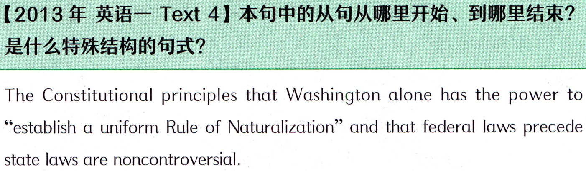

```text
【2013年英语一Text4】本句中的从句从哪里开始、到哪里结束？
是什么特殊结构的句式？
The Constitutional principles that Washington alone has the power to
"establish a uniform Rule of Naturalization" and that federal laws precede
state laws are noncontroversial.
```

### 【2013年英语二Text1】冒号之前的句子的核心内容是什么？

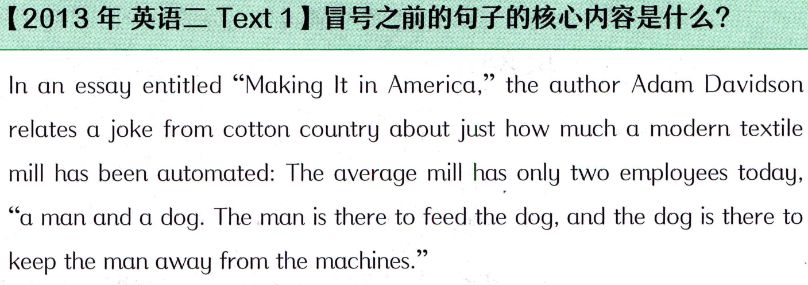

```text
【2013年英语二Text1】冒号之前的句子的核心内容是什么？
relates a joke from cotton country about just how much a modern textile
mill has been automated: The average mill has only two employees today,
"a man and a dog. The man is there to feed the dog, and the dog is there to
keep the man away from the machines."
```

### 【2013年英语二Text1】本句一共表达了几件事？

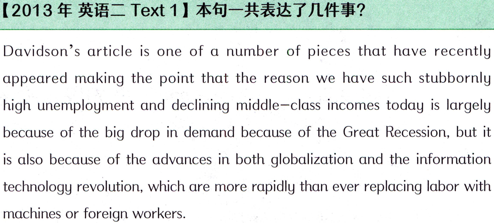

```text
【2013年英语二Text1】本句一共表达了几件事？
Davidson's article is one of a number of pieces that have recently
appeared making the point that the reason we have such stubbornly
high unemployment and declining middle-class incomes today is largely
because of the big drop in demand because of the Great Recession, but it
is also because of the advances in both globalization and the information
machines or foreign workers.
```

### 【2013年英语二Text1】本句中有几个从句？分别是什么从句？

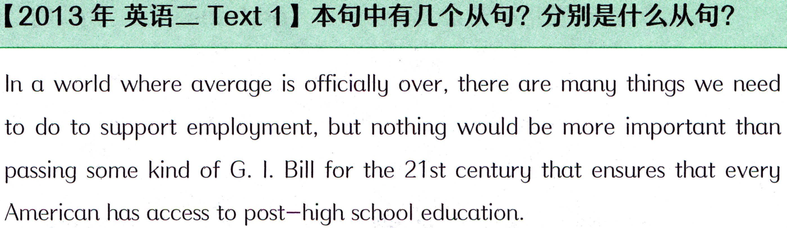

```text
【2013年英语二Text1】本句中有几个从句？分别是什么从句？
In a world where average is officially over, there are many things we need
to do to support employment, but nothing would be more important than
passing some kind of G. 1. Bill for the 21st century that ensures that every
American has access to post-high school education.
```

### 【2013年英语二Text2】本句的主语是什么？

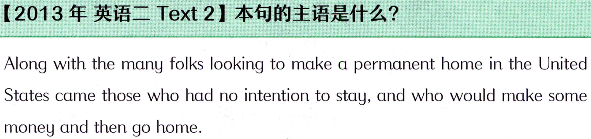

```text
【2013年英语二Text2】本句的主语是什么？
Along with the many folks looking to make a permanent home in the United
States came those who had no intention to stay, and who would make some
money and then go home.
```

### 【2013年英语二Text2】本句的主句主语是什么？两个that引l导的

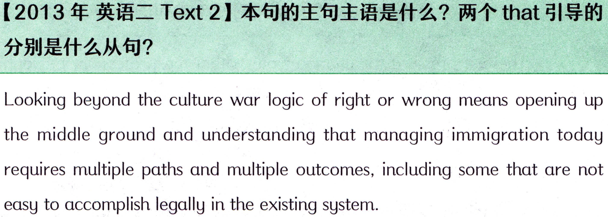

```text
【2013年英语二Text2】本句的主句主语是什么？两个that引l导的
分别是什么从句？
Looking beyond the culture war logic of right or wrong means opening up
the middle ground and understanding that managing immigration today
requires multiple paths and multiple outcomes, including some that are not
easy to accomplish legally in the existing system.
```

### 【2013年英语二Text3】你找到嵌套结构了吗？什么从句嵌套了什

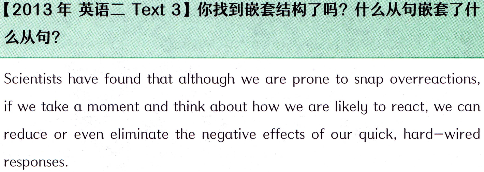

```text
【2013年英语二Text3】你找到嵌套结构了吗？什么从句嵌套了什
么从句？
Scientists have found that although we are prone to snap overreactions,
if we take a moment and think about how we are likely to react, we can
reduce or even eliminate the negative effects of our quick, hard-wired
responses.
```

### 【2013年英语二Text4】本句一共包含了几件事？几件事之间的逻

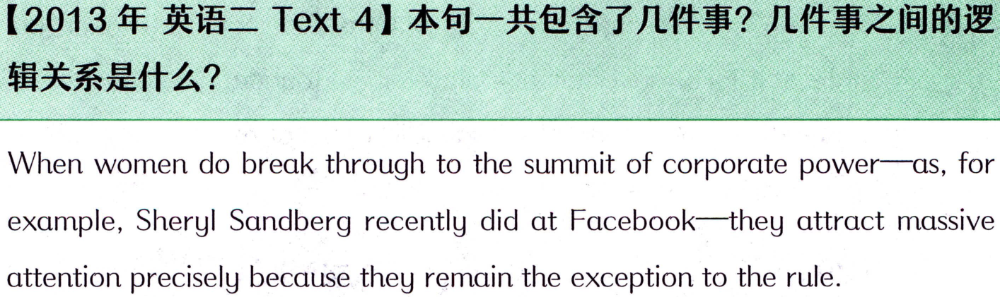

```text
【2013年英语二Text4】本句一共包含了几件事？几件事之间的逻
辑关系是什么？
When women do break through to the summit of corporate power—-as, for
example, Sheryl Sandberg recently did at Facebook—they attract massive
attention precisely because they remain the exception to the rule.
```

### 【2014年英语一Text1】破折号前的主句是哪部分？有没有觉得读

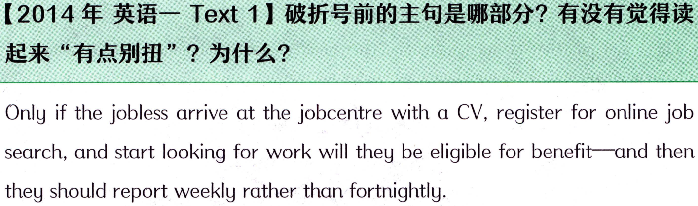

```text
【2014年英语一Text1】破折号前的主句是哪部分？有没有觉得读
起来“有点别扭”？为什么？
Only if the jobless arrive at the jobcentre with a CV, register for online job
search, and start looking for work will they be eligible for benefit—-and then
they should report weekly rather than fortnightly.
```

### 【2014年英语一Text1】主句的核心内容是什么？

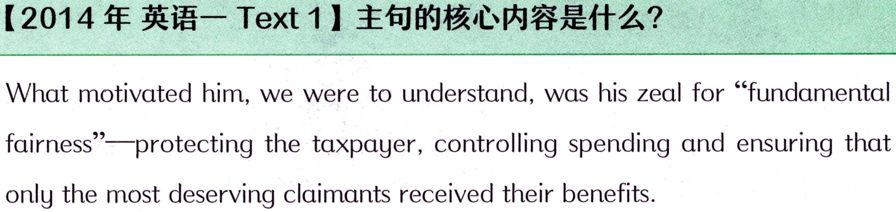

```text
【2014年英语一Text1】主句的核心内容是什么？
What motivated him, we were to understand,was his zeal for “fundamental
fairness"—protecting the taxpayer, controlling spending and ensuring that
only the most deserving claimants received their benefits.
```

### 【2014年英语一Text2】并列的两个主句的核心内容是什么？

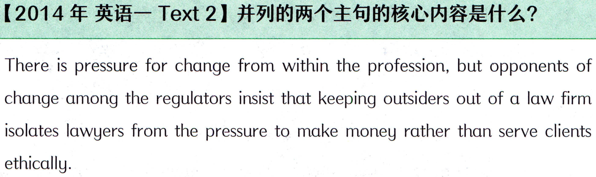

```text
【2014年英语一Text2】并列的两个主句的核心内容是什么？
There is pressure for change from within the profession, but opponents of
change among the regulators insist that keeping outsiders out of a law firm
isolates lawyers from the pressure to make money rather than serve clients
ethically.
```

### 【2014年英语一Text3】本句中有几个定语从句？分别在哪里？

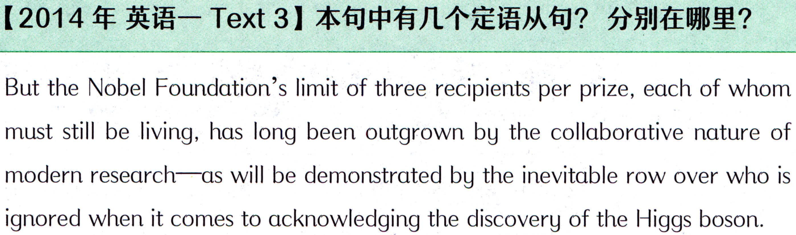

```text
【2014年英语一Text3】本句中有几个定语从句？分别在哪里？
But the Nobel Foundation's limit of three recipients per prize, each of whom
must still be living, has long been outgrown by the collaborative nature of
modern research—-as will be demonstrated by the inevitable row over who is
ignored when it comes to acknowledging the discovery of the Higgs boson.
```

### 【2014年英语一Text4】你找到本句中的多个平行结构了吗？

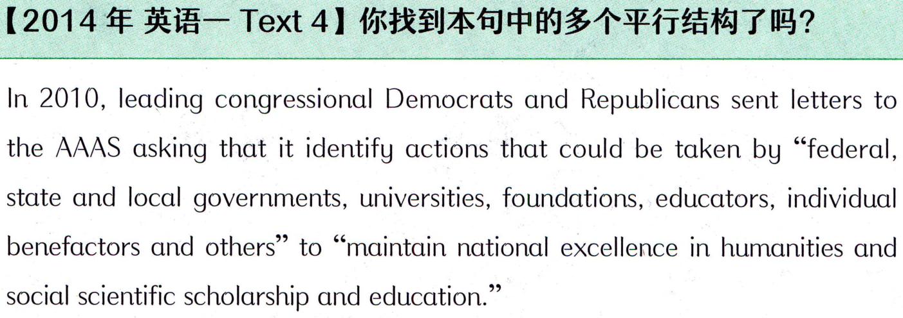

```text
【2014年英语一Text4】你找到本句中的多个平行结构了吗？
In 2010, leading congressional Democrats and Republicans sent letters to
the AAAS asking that it identify actions that could be taken by “federal,
state and local governments, universities, foundations, educators, individual
benefactors and others" to “maintain national excellence in humanities and
social scientific scholarship and education."
```

### 【2014年英语一Text4】你找到本句中的多个平行结构了吗？

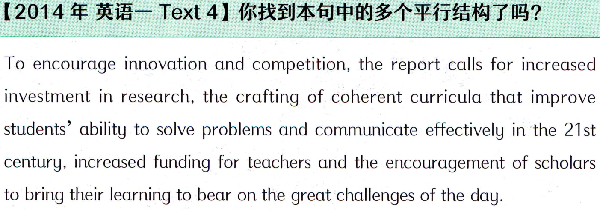

```text
【2014年英语一Text4】你找到本句中的多个平行结构了吗？
To encourage innovation and competition, the report calls for increased
investment in research, the crafting of coherent curricula that improve
students’ ability to solve problems and communicate effectively in the 21st
to bring their learning to bear on the great challenges of the day.
```

### 【2014年英语二Text1】本句中前半句的主语是哪部分？比较级的

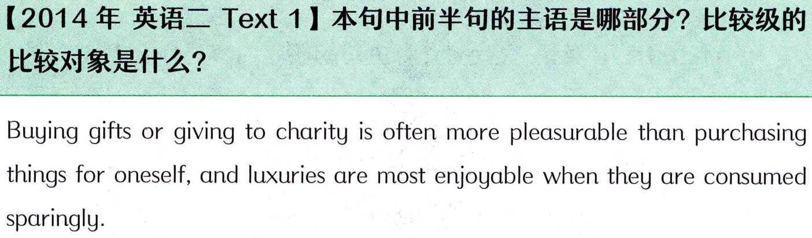

```text
【2014年英语二Text1】本句中前半句的主语是哪部分？比较级的
比较对象是什么？
Buying gifts or giving to charity is often more pleasurable than purchasing
things for oneself, and luxuries are most enjoyable when they are consumed
sparingly.
```

### 【2014年英语二Text2】这个句子中有几处平行结构？

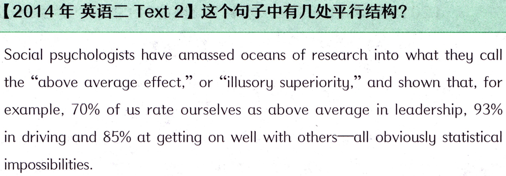

```text
【2014年英语二Text2】这个句子中有几处平行结构？
Social psychologists have amassed oceans of research into what they call
the “above average effect,” or "illusory superiority,” and shown that, for
example, 70% of us rate ourselves as above average in leadership, 93%
in driving and 85% at getting on well with others—all obviously statistical
impossibilities.
```

### 【2014年英语二Text3】在写作中，当你想表达“在…..方面大为

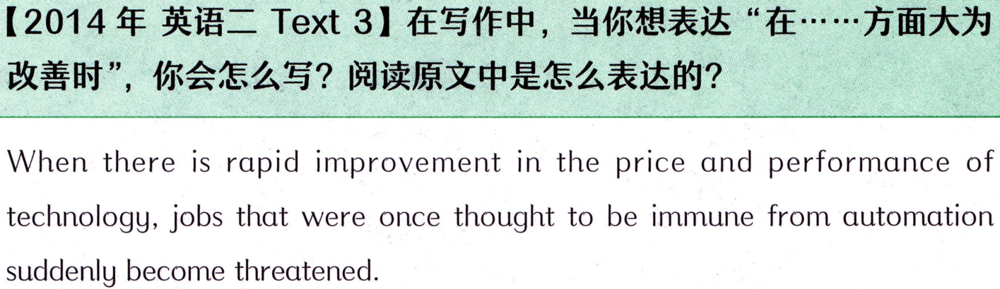

```text
【2014年英语二Text3】在写作中，当你想表达“在…..方面大为
改善时”，你会怎么写？阅读原文中是怎么表达的？
When there is rapid improvement in the price and performance of
technology, jobs that were once thought to be immune from automation
suddenly become threatened.
```

### 【2014年英语二Text4】请找出定语从句，并判断其修饰的是什么？

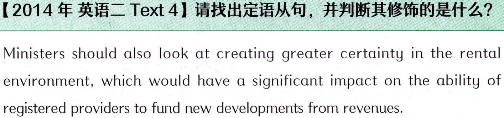

```text
【2014年英语二Text4】请找出定语从句，并判断其修饰的是什么？
Ministers should also look at creating greater certainty in the rental
environment, which would have a significant impact on the ability of
registered providers to fund new developments from revenues.
```

### 【2015年英语一Text1】请问itisbizarrethat..是强调句还是主

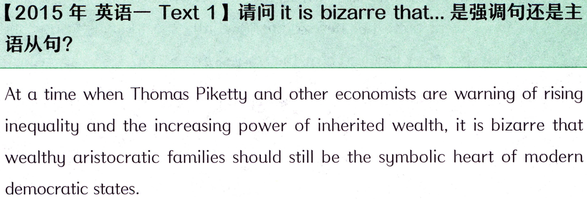

```text
【2015年英语一Text1】请问itisbizarrethat..是强调句还是主
语从句？
At a time when Thomas Piketty and other economists are warning of rising
inequality and the increasing power of inherited wealth, it is bizarre that
wealthy aristocratic families should still be the symbolic heart of modern
democratic states.
```

### 【2015年英语一Text2】两个that从句种类一样吗？其中that都

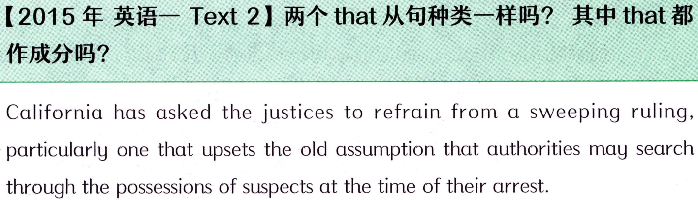

```text
【2015年英语一Text2】两个that从句种类一样吗？其中that都
作成分吗？
California has asked the justices to refrain from a sweeping ruling,
particularly one that upsets the old assumption that authorities may search
through the possessions of suspects at the time of their arrest.
```

### 【2015年英语一Text2】冒号之前的句子的核心内容是什么？余下

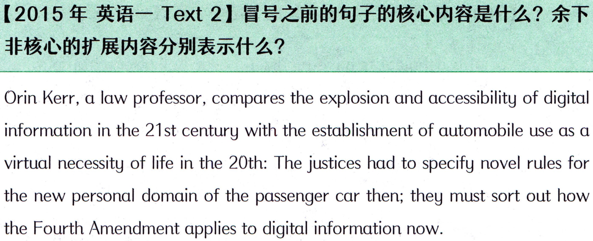

```text
【2015年英语一Text2】冒号之前的句子的核心内容是什么？余下
非核心的扩展内容分别表示什么？
Orin Kerr, a law professor, compares the explosion and accessibility of digital
information in the 21st century with the establishment of automobile use as a
virtual necessity of life in the 2Oth: The justices had to specify novel rules for
the new personal domain of the passenger car then; they must sort out how
the Fourth Amendment applies to digital information now.
```

### 【2015年英语一Text3】你能找到几个从句呢？引号中两个and

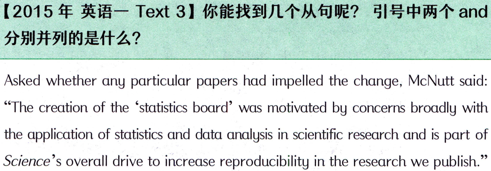

```text
【2015年英语一Text3】你能找到几个从句呢？引号中两个and
分别并列的是什么？
Asked whether any particular papers had impelled the change, McNutt said:
"The creation of the ‘statistics board’ was motivated by concerns broadly with
the application of statistics and data analysis in scientific research and is part of
Science's overall drive to increase reproducibility in the research we publish."
```

### 【2015年英语一Text4】请找出本句中的平行结构，并判断什么跟

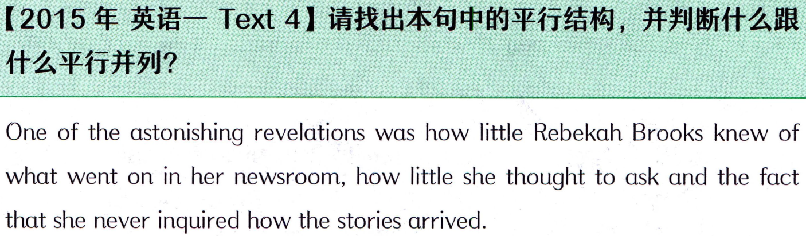

```text
【2015年英语一Text4】请找出本句中的平行结构，并判断什么跟
什么平行并列？
One of the astonishing revelations was how little Rebekah Brooks knew of
what went on in her newsroom, how little she thought to ask and the fact
that she never inquired how the stories arrived.
```

### 【2015年英语二Text1】本句中有几个从句？分别是什么从句？

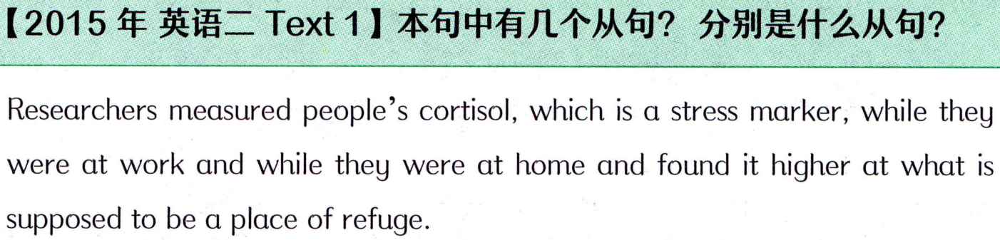

```text
【2015年英语二Text1】本句中有几个从句？分别是什么从句？
Researchers measured people's cortisol, which is a stress marker, while they
were at work and while they were at home and found it higher at what is
supposed to be a place of refuge.
```

### 【2015年英语二Text2】本句一共包含了几件事？几件事怎么断开？

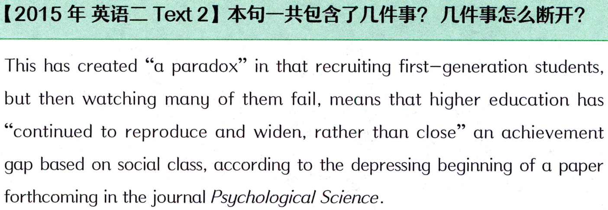

```text
【2015年英语二Text2】本句一共包含了几件事？几件事怎么断开？
This has created “a paradox" in that recruiting first-generation students,
but then watching many of them fail, means that higher education has
"continued to reproduce and widen, rather than close” an achievement
forthcoming in the journal Psychological Science.
```

### 【2015年英语二Text2】suggesting后面that引导的从句的核心

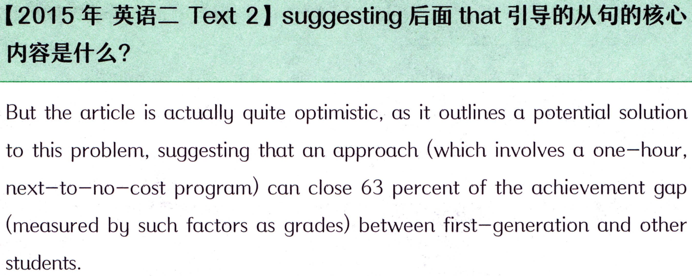

```text
【2015年英语二Text2】suggesting后面that引导的从句的核心
内容是什么？
But the article is actually quite optimistic, as it outlines a potential solution
to this problem, suggesting that an approach (which involves a one-hour,
next-to-no-cost program) can close 63 percent of the achievement gap
(measured by such factors as grades) between first-generation and other
students.
```

### 【2015年英语二Text2】本句中同时出现了三大特殊结构的长难

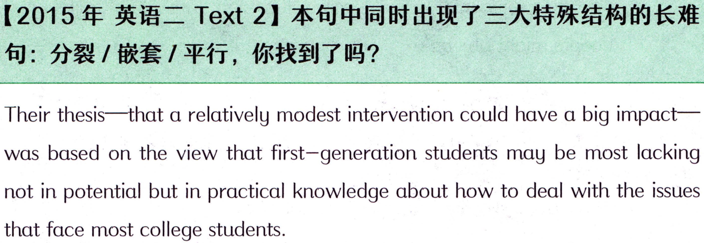

```text
【2015年英语二Text2】本句中同时出现了三大特殊结构的长难
句：分裂/嵌套／平行，你找到了吗？
Their thesis—that a relatively modest intervention could have a big impact—
was based on the view that first-generation students may be most lacking
not in potential but in practical knowledge about how to deal with the issues
that face most college students.
```

### 【2015年英语二Text3】本句中有平行和嵌套结构，你找到了吗？

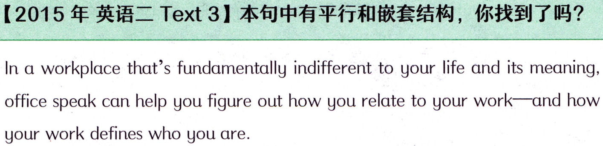

```text
【2015年英语二Text3】本句中有平行和嵌套结构，你找到了吗？
In a workplace that's fundamentally indifferent to your life and its meaning,
office speak can help you figure out how you relate to your work—and how
your work defines who you are.
```

### 【2015年英语二Text4】主句的核心内容是什么？“去扩展（修饰）

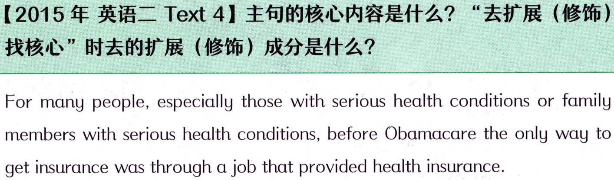

```text
【2015年英语二Text4】主句的核心内容是什么？“去扩展（修饰）
找核心”时去的扩展（修饰）成分是什么？
For many people, especially those with serious health conditions or family
members with serious health conditions, before Obamacare the only way to
get insurance was through a job that provided health insurance.
```

### 【2016年英语一Text1】“名词+主谓”这一结构在考研阅读中特

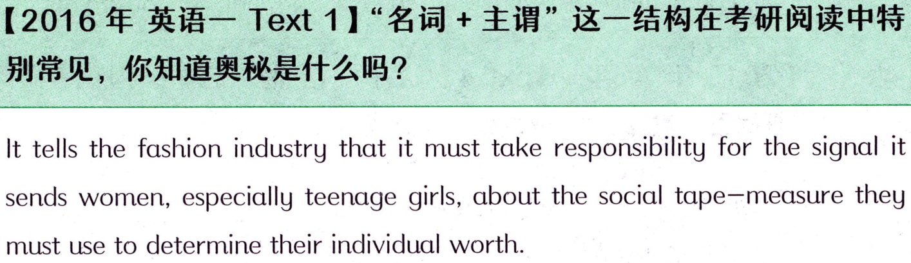

```text
【2016年英语一Text1】“名词+主谓”这一结构在考研阅读中特
别常见，你知道奥秘是什么吗？
It tells the fashion industry that it must take responsibility for the signal it
sends women, especially teenage girls,about the social tape-measure they
must use to determine their individual worth.
```

### 【2016年英语一Text2】本句中一共包含了几件事？如何断开？

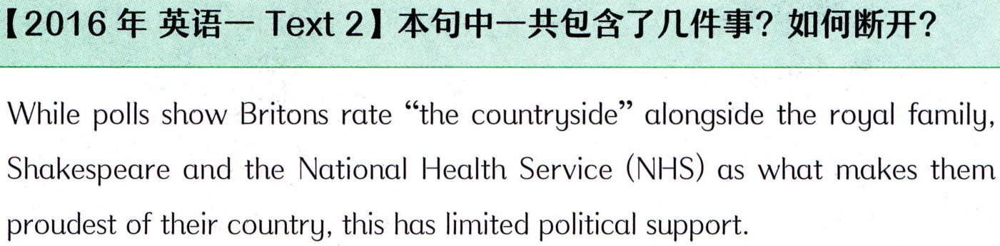

```text
【2016年英语一Text2】本句中一共包含了几件事？如何断开？
While polls show Britons rate “the countryside” alongside the royal family,
Shakespeare and the National Health Service (NHS) as what makes them
proudest of their country, this has limited political support.
```

### 【2016年英语一Text2】主句的核心内容是什么？

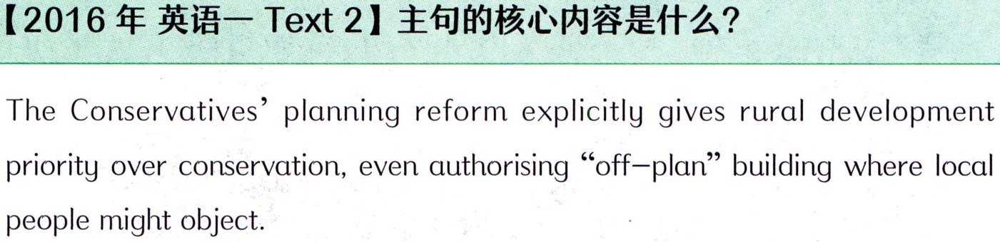

```text
【2016年英语一Text2】主句的核心内容是什么？
The Conservatives’ planning reform explicitly gives rural development
priority over conservation, even authorising “off-plan” building where local
people might object.
```

### 【2016年英语一Text3】本句中 3个that引导的分别是什么从句 /

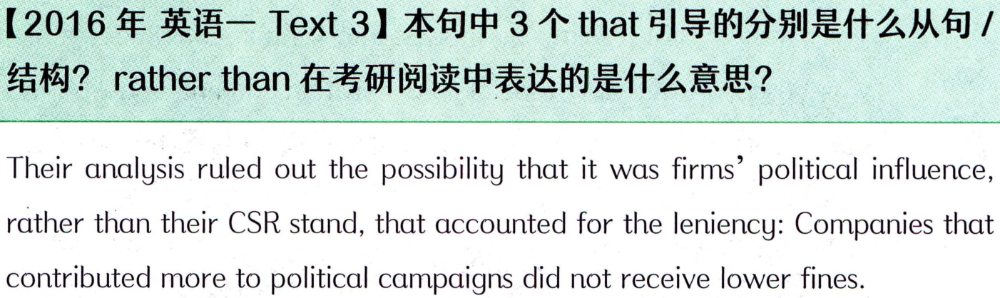

```text
【2016年英语一Text3】本句中 3个that引导的分别是什么从句 /
结构？ratherthan在考研阅读中表达的是什么意思？
Their analysis ruled out the possibility that it was firms’ political influence,
rather than their CSR stand, that accounted for the leniency: Companies that
contributed more to political campaigns did not receive lower fines.
```

### 【2016年英语一Text3】estimate后的that从句中主语是什么？

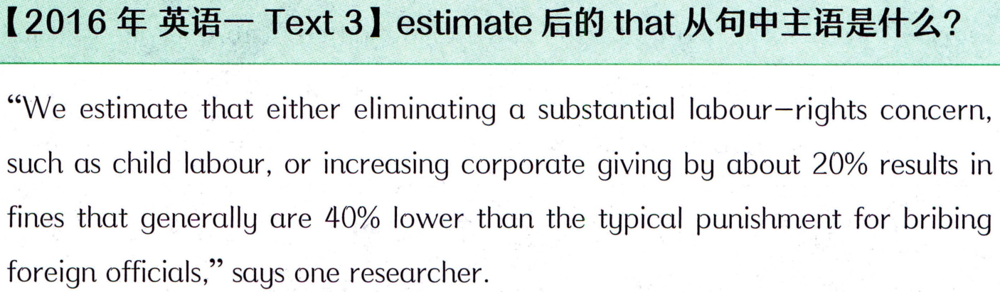

```text
【2016年英语一Text3】estimate后的that从句中主语是什么？
"We estimate that either eliminating a substantial labour-rights concern,
such as child labour, or increasing corporate giving by about 20% results in
a og asnd pi u uu l t a h  s
foreign officials,” says one researcher.
```

### 【2016年英语一Text4】本句中不同的标点符号分别起什么作用？

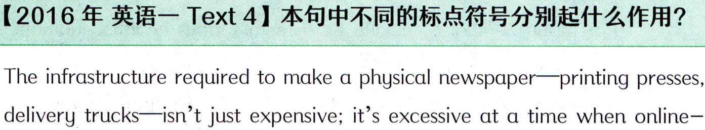

```text
【2016年英语一Text4】本句中不同的标点符号分别起什么作用？
delivery trucks——isn't just expensive; it's excessive at a time when online-
```

### 【2016年英语一Text4】“名词+主谓”这一结构在考研阅读中特

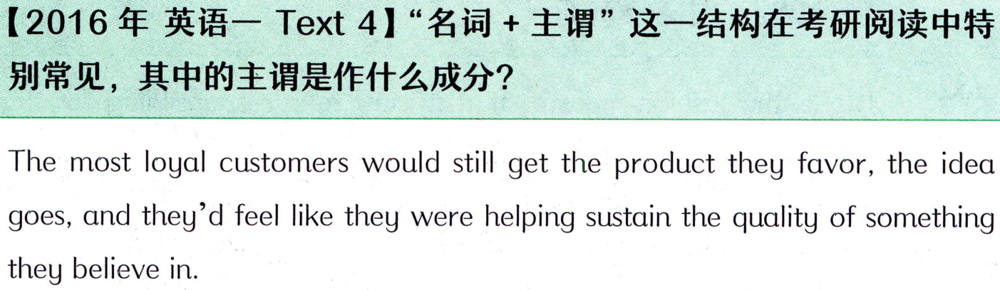

```text
【2016年英语一Text4】“名词+主谓”这一结构在考研阅读中特
别常见，其中的主谓是作什么成分？
The most loyal customers would still get the product they favor, the idea
goes, and they'd feel like they were helping sustain the quality of something
they believe in.
```

### 【2016年英语一Text4】本句中包含了几件事？如何断开？如何

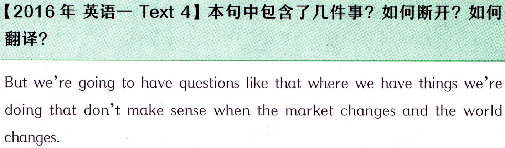

```text
【2016年英语一Text4】本句中包含了几件事？如何断开？如何
翻译？
But we're going to have questions like that where we have things we're
doing that don't make sense when the market changes and the world
changes.
```

### 【2016年英语二Text1】通过哪些连接词可以断开长难句？

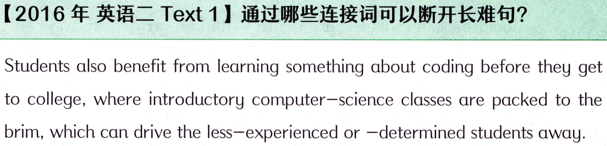

```text
【2016年英语二Text1】通过哪些连接词可以断开长难句？
  q o o s a  a o ss
to college, where introductory computer-science classes are packed to the
brim, which can drive the less-experienced or -determined students away.
```

### 【2016年英语二Text2】本句如何断开？包含了几个从句？分别是

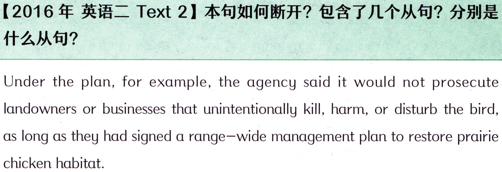

```text
【2016年英语二Text2】本句如何断开？包含了几个从句？分别是
什么从句？
Under the plan, for example, the agency said it would not prosecute
landowners or businesses that unintentionally kill, harm, or disturb the bird,
as long as they had signed a range-wide management plan to restore prairie
chicken habitat.
```

### 【2016年英语二Text3】断开长难句后，从句从哪里开始？分别是

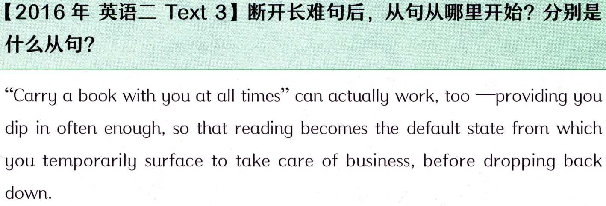

```text
【2016年英语二Text3】断开长难句后，从句从哪里开始？分别是
什么从句？
"Carry a book with you at all times"” can actually work, too —providing you
dip in often enough, so that reading becomes the default state from which
you temporarily surface to take care of business, before dropping back
down.
```

### 【2016年英语二Text3】本句中一共包含了几件事？句子之间的连

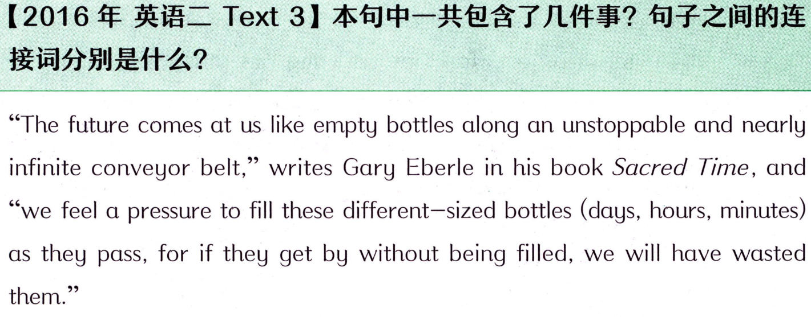

```text
【2016年英语二Text3】本句中一共包含了几件事？句子之间的连
接词分别是什么？
"The future comes at us like empty bottles along an unstoppable and nearly
infinite conveyor belt,” writes Gary Eberle in his book Sacred Time, and
"we feel a pressure to fill these different-sized bottles (days, hours, minutes)
as they pass, for if they get by without being filled, we will have wasted
them."
```

### 【2016年英语二Text4】本句中的平行结构，是什么与什么平行

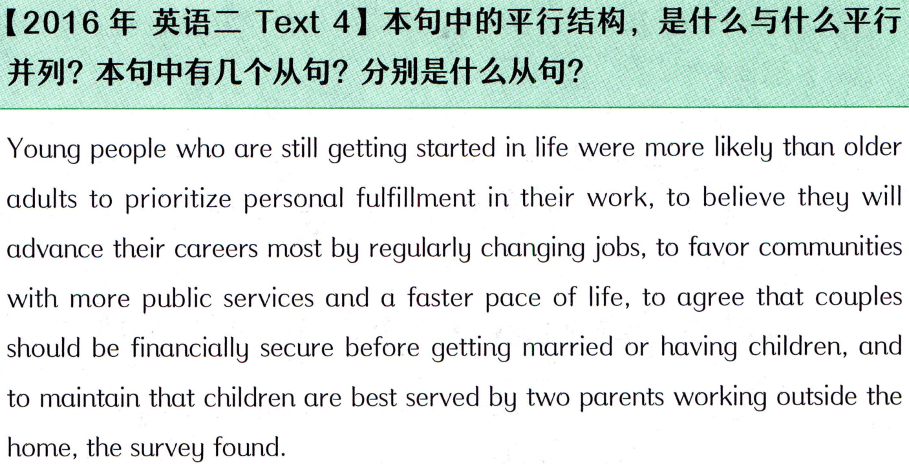

```text
【2016年英语二Text4】本句中的平行结构，是什么与什么平行
并列？本句中有几个从句？分别是什么从句？
Young people who are still getting started in life were more likely than older
adults to prioritize personal fulfillment in their work, to believe they will
advance their careers most by regularly changing jobs, to favor communities
with more public services and a faster pace of life, to agree that couples
should be financially secure before getting married or having children, and
to maintain that children are best served by two parents working outside the
home, the survey found.
```

### 【2016年英语二Text4】本句中的主句和从句在去修饰找核心之

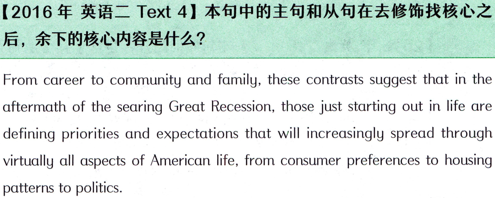

```text
【2016年英语二Text4】本句中的主句和从句在去修饰找核心之
后，余下的核心内容是什么？
From career to community and family,these contrasts suggest that in the
aftermath of the searing Great Recession, those just starting out in life are
defining priorities and expectations that will increasingly spread through
virtually all aspects of American life, from consumer preferences to housing
patterns to politics.
```

### 【2016年英语二Text4】本句中一共包含了几件事？从哪里断开？

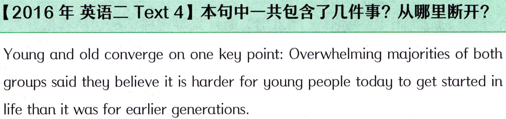

```text
【2016年英语二Text4】本句中一共包含了几件事？从哪里断开？
Young and old converge on one key point: Overwhelming majorities of both
groups said they believe it is harder for young people today to get started in
life than it was for earlier generations.
```

### 【2016年英语二Text4】本句中的主句和从句在去修饰找核心之

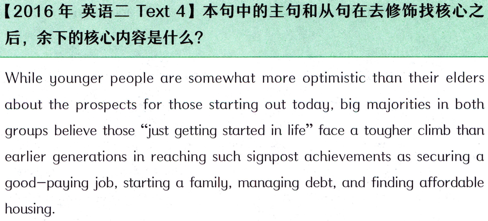

```text
【2016年英语二Text4】本句中的主句和从句在去修饰找核心之
后，余下的核心内容是什么？
While younger people are somewhat more optimistic than their elders
about the prospects for those starting out today, big majorities in both
 qu uno e ae c us ps  isn, asou aq snoa
earlier generations in reaching such signpost achievements as securing a
good-paying job, starting a family, managing debt, and finding affordable
housing.
```

### 【2017年英语一Text1】本句中“去修饰找核心”时，去掉的修饰

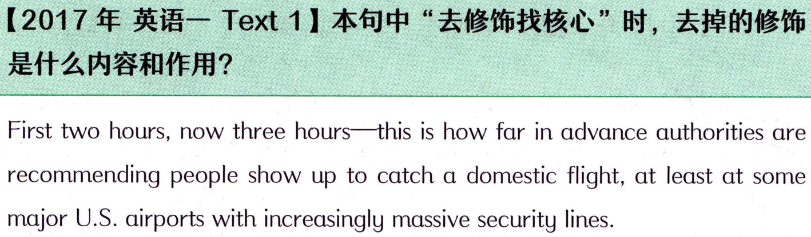

```text
【2017年英语一Text1】本句中“去修饰找核心”时，去掉的修饰
是什么内容和作用？
First two hours, now three hours—this is how far in advance authorities are
recommending people show up to catch a domestic flight, at least at some
major U.S. airports with increasingly massive security lines.
```

### 【2017年英语一Text1】本句中包含了几件事？

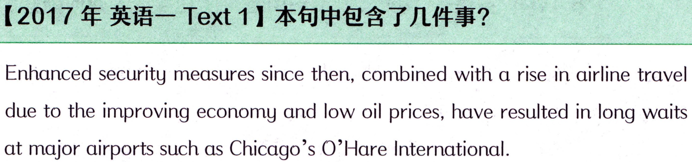

```text
【2017年英语一Text1】本句中包含了几件事？
Enhanced security measures since then, combined with a rise in airline travel
due to the improving economy and low oil prices, have resulted in long waits
at major airports such as Chicago's O'Hare International.
```

### 【2017年英语一Text2】本句有几处平行结构？

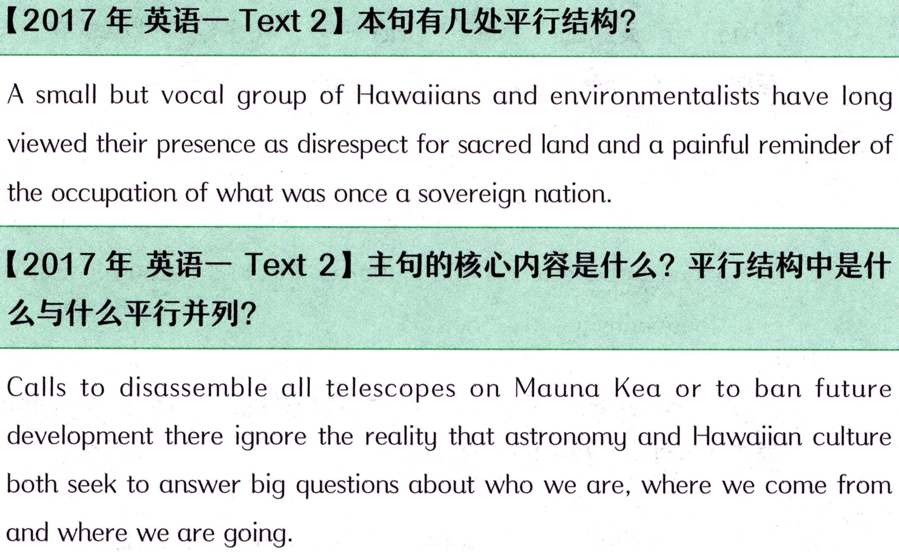

```text
【2017年英语一Text2】本句有几处平行结构？
A small but vocal group of Hawaiians and environmentalists have long
viewed their presence as disrespect for sacred land and a painful reminder of
the occupation of what was once a sovereign nation.
么与什么平行并列？
Calls to disassemble all telescopes on Mauna Kea or to ban future
development there ignore the reality that astronomy and Hawaiian culture
both seek to answer big questions about who we are, where we come from
and where we are going.
```

### 【2017年英语一Text3】本句中有几对主谓？

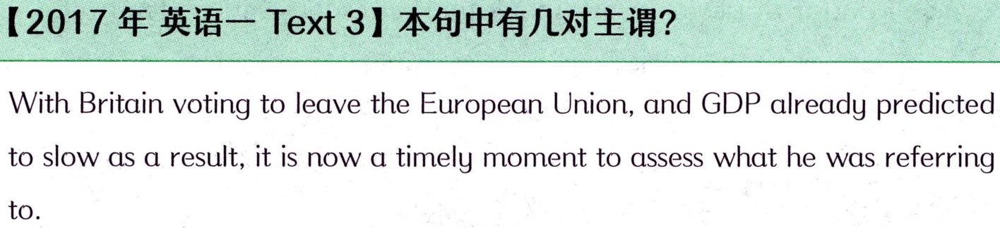

```text
【2017年英语一Text3】本句中有几对主谓？
With Britain voting to leave the European Union,and GDP already predicted
to slow as a result, it is now a timely moment to assess what he was referring
to.
```

### 【2017年英语一Text3】本句如何断开？主句的核心内容是什么？

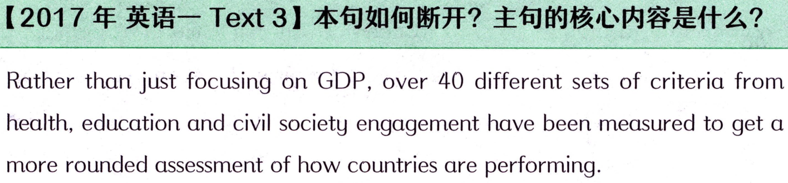

```text
【2017年英语一Text3】本句如何断开？主句的核心内容是什么？
Rather than just focusing on GDP, over 40 different sets of criteria from
health, education and civil society engagement have been measured to get a
more rounded assessment of how countries are performing.
```

### 【2017年英语一Text3】本句如何断开？有几个从句？

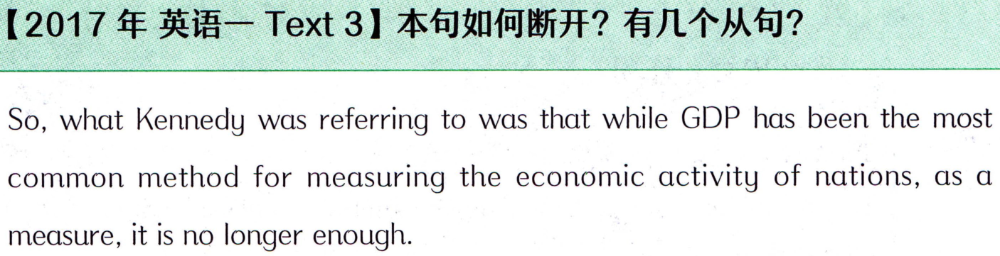

```text
【2017年英语一Text3】本句如何断开？有几个从句？
So, what Kennedy was referring to was that while GDP has been the most
commonmethod for measuringtheeconomic activity of nations,as a
measure, it is no longer enough.
```

### 【2017年英语一Text4】本句中包含了几件事？如何断开？

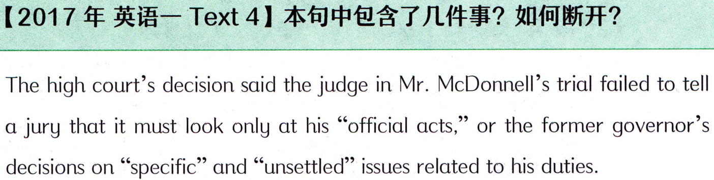

```text
【2017年英语一Text4】本句中包含了几件事？如何断开？
The high court's decision said the judge in Mr. McDonnell's trial failed to tell
a jury that it must look only at his “official acts,” or the former governor's
decisions on "specific” and "unsettled" issues related to his duties.
```

### 【2017年英语二Text1】and一多，句子结构就感觉有点乱了。本

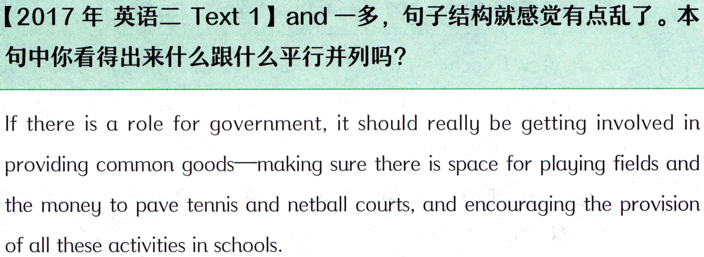

```text
【2017年英语二Text1】and一多，句子结构就感觉有点乱了。本
句中你看得出来什么跟什么平行并列吗？
If there is a role for government, it should really be getting involved in
providing common goods—making sure there is space for playing fields and
the money to pave tennis and netball courts, and encouraging the provision
of all these activities in schools.
```

### 【2017年英语二Text2】本句中包含了几件事？两个并列连词and

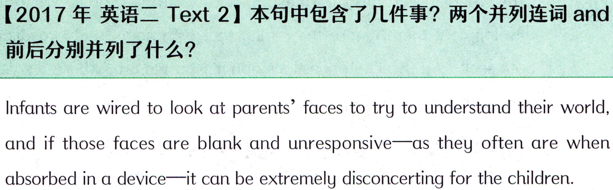

```text
【2017年英语二Text2】本句中包含了几件事？两个并列连词and
前后分别并列了什么？
Infants are wired to look at parents’ faces to try to understand their world,
and if those faces are blank and unresponsive—as they often are when
absorbed in a device——it can be extremely disconcerting for the children.
```

### 【2017年英语二Text2】前半句中“去修饰找核心”，其中有几个

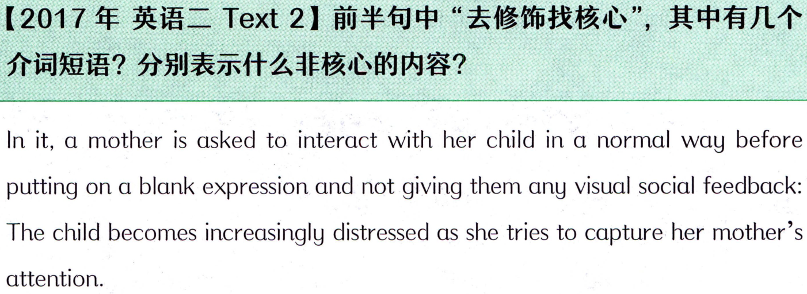

```text
【2017年英语二Text2】前半句中“去修饰找核心”，其中有几个
介词短语？分别表示什么非核心的内容？
In it, a mother is asked to interact with her child in a normal way before
putting on a blank expression and not giving them any visual social feedback:
The child becomes increasingly distressed as she tries to capture her mother's
attention.
```

### 【2017年英语二Text2】本句如何断开长难句？

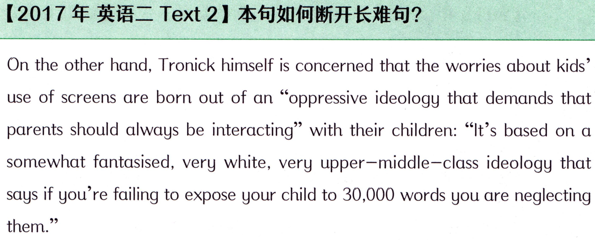

```text
【2017年英语二Text2】本句如何断开长难句？
On the other hand, Tronick himself is concerned that the worries about kids'
parents should always be interacting” with their children: “It's based on a
somewhat fantasised, very white, very upper-middle-class ideology that
says if you're failing to expose your child to 30,000 words you are neglecting
them."
```

### 【2017年英语二Text2】本句中的嵌套结构和平行结构，你找到

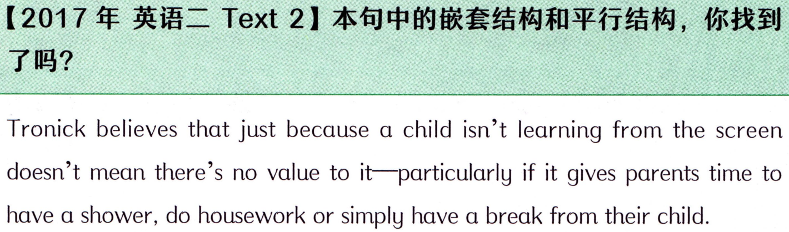

```text
【2017年英语二Text2】本句中的嵌套结构和平行结构，你找到
了吗？
Tronick believes that just because a child isn't learning from the screen
doesn't mean there's no value to it—particularly if it gives parents time to
have a shower, do housework or simply have a break from their child.
```

### 【2017年英语二Text3】本句中包含了几件事？简化后的核心内容是

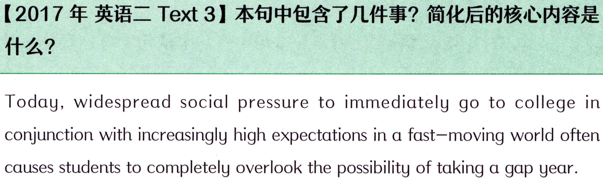

```text
【2017年英语二Text3】本句中包含了几件事？简化后的核心内容是
什么？
Today, widespread social pressure to immediately go to college in
conjunction with increasingly high expectations in a fast-moving world often
causes students to completely overlook the possibility of taking a gap year.
```

### 【2017年英语二Text3】前半句中“去修饰找核心”，其中有几个

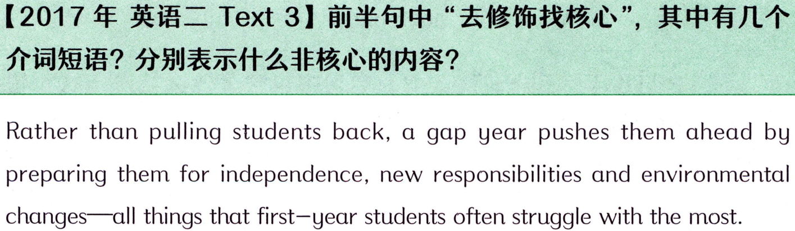

```text
【2017年英语二Text3】前半句中“去修饰找核心”，其中有几个
介词短语？分别表示什么非核心的内容？
Rather than pulling students back, a gap year pushes them ahead by
preparing them for independence, new responsibilities and environmental
changes—all things that first-year students often struggle with the most.
```

### 【2017年英语二Text4】本句（主句和从句）的核心内容是什么？

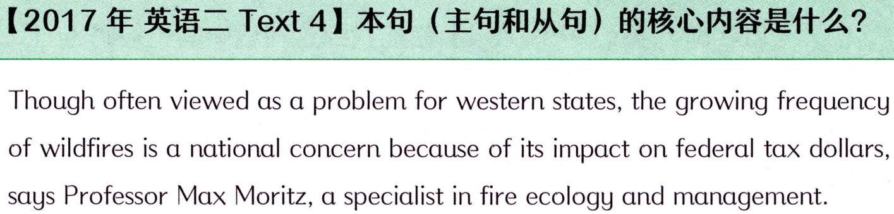

```text
【2017年英语二Text4】本句（主句和从句）的核心内容是什么？
Though often viewed as a problem for western states, the growing frequency
of wildfires is a national concern because of its impact on federal tax dollars,
says Professor Max Moritz, a specialist in fire ecology and management.
```

### 【2018年英语一Text1】冒号前的句子，主语是哪部分？

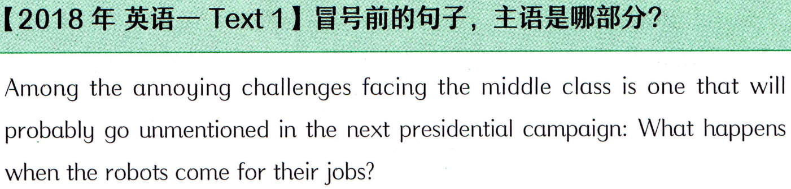

```text
【2018年英语一Text1】冒号前的句子，主语是哪部分？
Among the annoying challenges facing the middle class is one that will
probably go unmentioned in the next presidential campaign: What happens
when the robots come for their jobs?
```

### 【2018年英语一Text1】你能找到本句中的平行结构吗？

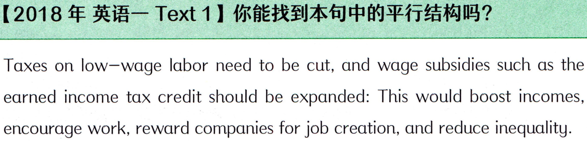

```text
【2018年英语一Text1】你能找到本句中的平行结构吗？
Taxes on low-wage labor need to be cut, and wage subsidies such as the
earned income tax credit should be expanded: This would boost incomes,
encourage work, reward companies for job creation, and reduce inequality.
```

### 【2018年英语一Text2】本句中比较级前后比较的对象是什么？

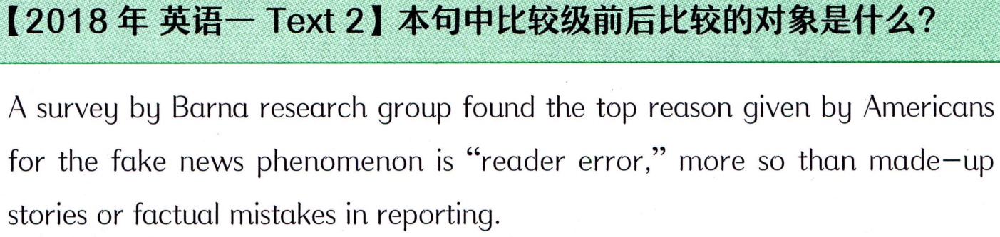

```text
【2018年英语一Text2】本句中比较级前后比较的对象是什么？
  aia  d  o o s g  an s
for the fake news phenomenon is “reader error,” more so than made-up
stories or factual mistakes in reporting.
```

### 【2018年英语一Text3】本句中有几个从句？分别是什么从句？

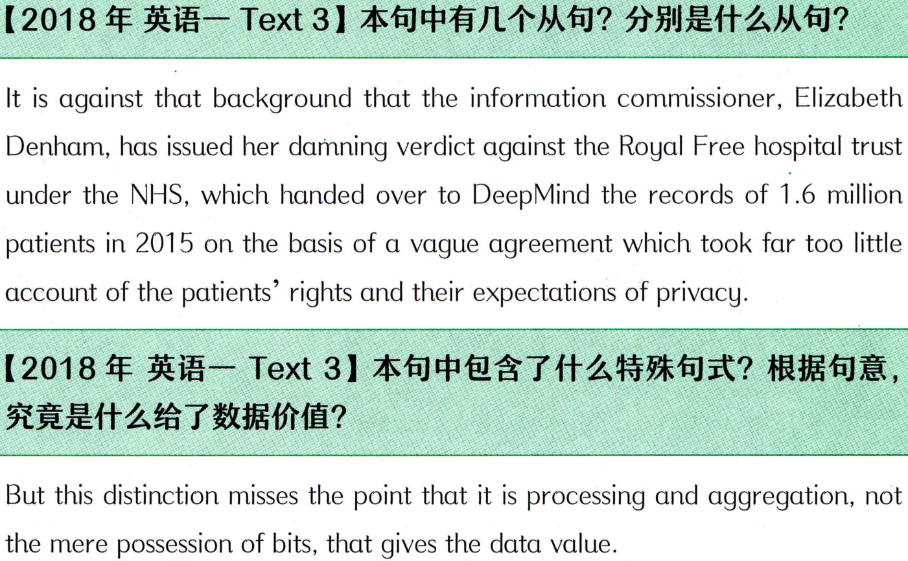

```text
【2018年英语一Text3】本句中有几个从句？分别是什么从句？
It is against that background that the information commissioner, Elizabeth
Denham, has issued her damning verdict against the Royal Free hospital trust
under the NHS, which handed over to DeepMind the records of 1.6 million
patients in 2015 on the basis of a vague agreement which took far too little
account of the patients’ rights and their expectations of privacy.
究竟是什么给了数据价值？
But this distinction misses the point that it is processing and aggregation, not
the mere possession of bits, that gives the data value.
```

### 【2018年英语一Text4】你能找到这句话中的主句吗？

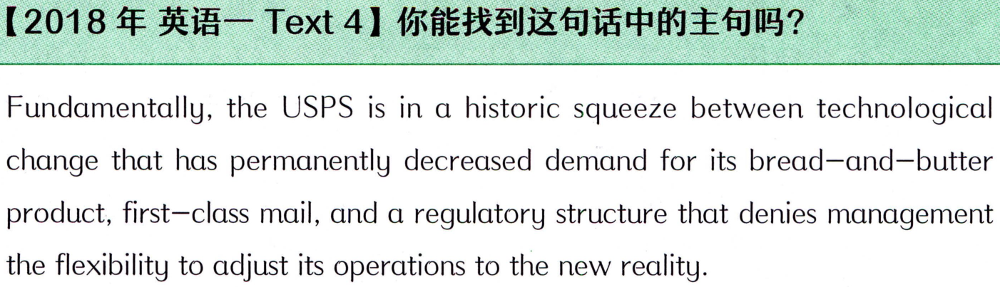

```text
【2018年英语一Text4】你能找到这句话中的主句吗？
Fundamentally, the USPS is in a historic squeeze between technological
change that has permanently decreased demand for its bread-and-butter
product, first-class mail, and a regulatory structure that denies management
the flexibility to adjust its operations to the new reality.
```

### 【2018年英语一Text4】主句的核心内容是什么？本句中有几个

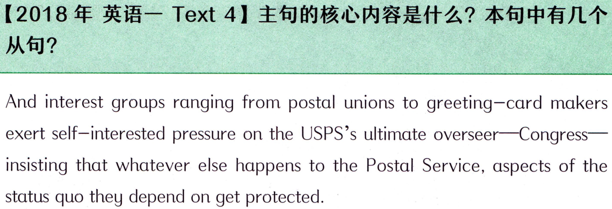

```text
【2018年英语一Text4】主句的核心内容是什么？本句中有几个
从句？
And interest groups ranging from postal unions to greeting-card makers
exert self-interested pressure on the USPS's ultimate overseer—Congress-
status quo they depend on get protected.
```

### 【2018年英语二Text1】本句中有几个从句？分别开始和结束于

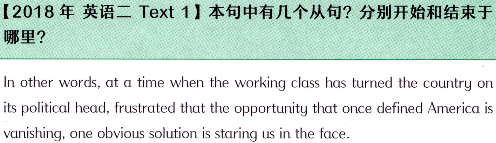

```text
【2018年英语二Text1】本句中有几个从句？分别开始和结束于
哪里？
In other words, at a time when the working class has turned the country on
its political head, frustrated that the opportunity that once defined America is
vanishing, one obvious solution is staring us in the face.
```

### 【2018年英语二Text2】本句中有几个从句？它们之间的关系是

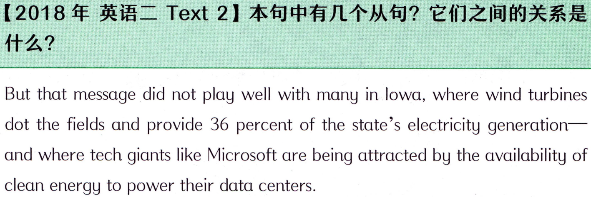

```text
【2018年英语二Text2】本句中有几个从句？它们之间的关系是
什么？
But that message did not play well with many in lowa, where wind turbines
dot the fields and provide 36 percent of the state's electricity generation-
and where tech giants like Microsoft are being attracted by the availability of
clean energy to power their data centers.
```

### 【2018年英语二Text3】本句中一共包含了几件事？几件事之间的

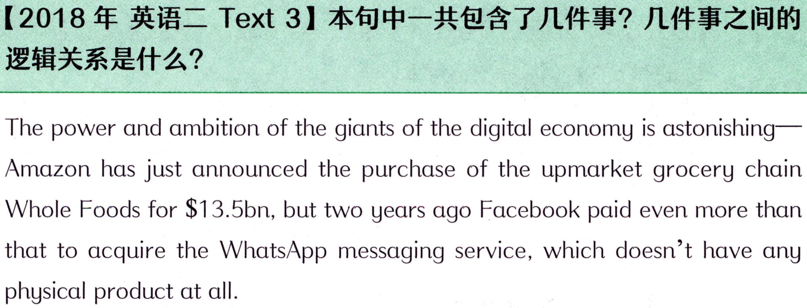

```text
【2018年英语二Text3】本句中一共包含了几件事？几件事之间的
逻辑关系是什么？
The power and ambition of the giants of the digital economy is astonishing
o    fo s   as sy o
Whole Foods for $13.5bn, but two years ago Facebook paid even more than
that to acquire the WhatsApp messaging service, which doesn't have any
physical product at all.
```

### 【2018年英语二Text3】本句如何断开？句子之间的逻辑关系是

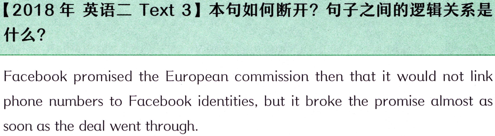

```text
【2018年英语二Text3】本句如何断开？句子之间的逻辑关系是
什么？
Facebook promised the European commission then that it would not link
phone numbers to Facebook identities, but it broke the promise almost as
soon asthedealwentthrough.
```

### 【2018年英语二Text4】本句中有两处倒装，还有平行结构，你找

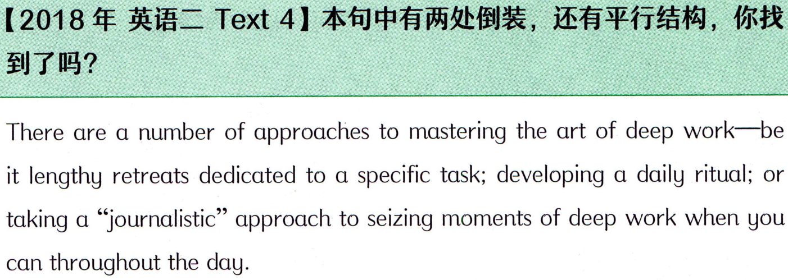

```text
【2018年英语二Text4】本句中有两处倒装，还有平行结构，你找
到了吗？
There are a number of approaches to mastering the art of deep work—be
it lengthy retreats dedicated to a specific task; developing a daily ritual; or
can throughout the day.
```

### 【2018年英语二Text4】冒号之前的主句是哪部分？that从句修饰

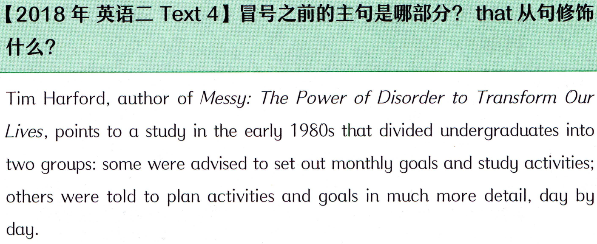

```text
【2018年英语二Text4】冒号之前的主句是哪部分？that从句修饰
什么？
Tim Harford, author of Messy: The Power of Disorder to Transform Our
Lives, points to a study in the early 1980s that divided undergraduates into
two groups: some were advised to set out monthly goals and study activities;
others were told to plan activities and goals in much more detail, day by
day.
```

### 【2018年英语二Text4】本句包含了几件事？

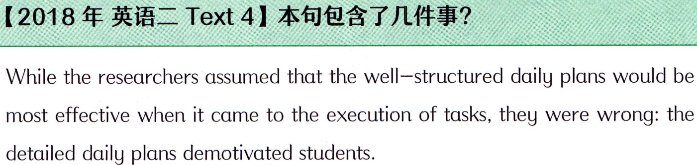

```text
【2018年英语二Text4】本句包含了几件事？
While the researchers assumed that the well--structured daily plans would be
most effective when it came to the execution of tasks, they were wrong: the
detailed daily plans demotivated students.
```

### 【2018年英语二Text4】as...as...表示什么含义？在本句中它表

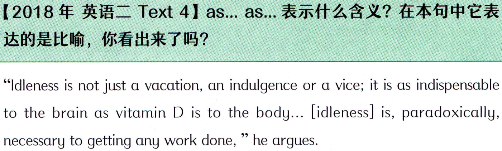

```text
【2018年英语二Text4】as...as...表示什么含义？在本句中它表
达的是比喻，你看出来了吗？
"Idleness is not just a vacation, an indulgence or a vice; it is as indispensable
to the brain as vitamin D is to the body... [idleness] is, paradoxically,
necessary to getting any work done, " he argues.
```

### 【2019年英语一Text1】他引l用了“谁”的话把经济上的急躁比喻

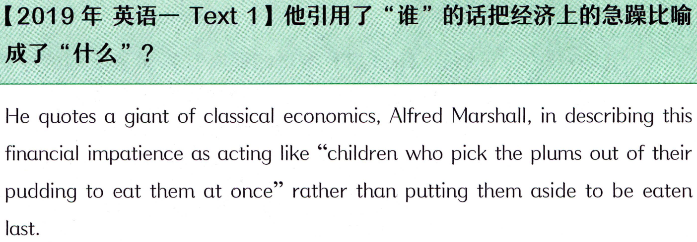

```text
【2019年英语一Text1】他引l用了“谁”的话把经济上的急躁比喻
成了“什么”？
He quotes a giant of classical economics, Alfred Marshall, in describing this
financial impatience as acting like “children who pick the plums out of their
pudding to eat them at once” rather than putting them aside to be eaten
last.
```

### 【2019年英语一Text2】你能找到本句中主句的核心内容吗？其余

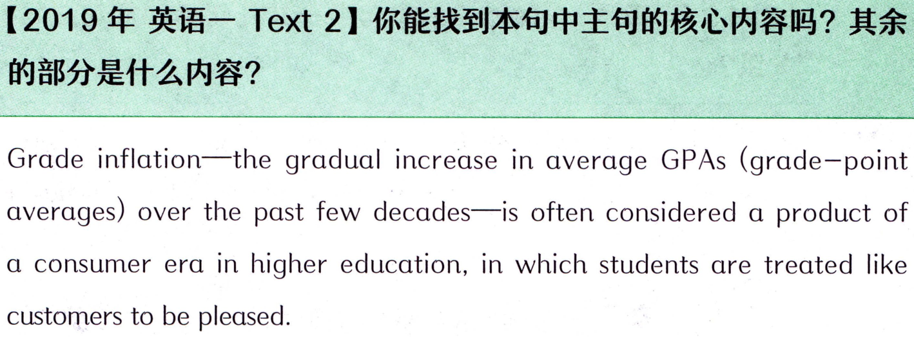

```text
【2019年英语一Text2】你能找到本句中主句的核心内容吗？其余
的部分是什么内容？
Grade inflation—the gradual increase in average GPAs (grade-point
averages) over the past few decades—is often considered a product of
α consumer era in higher education, in which students are treated like
customers to be pleased.
```

### 【2019年英语一Text2】inwhich这种从句如何理解？

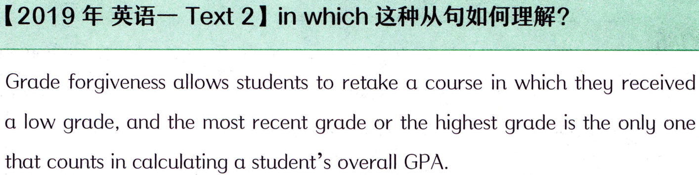

```text
【2019年英语一Text2】inwhich这种从句如何理解？
Grade forgiveness allows students to retake a course in which they received
a low grade, and the most recent grade or the highest grade is the only one
that counts in calculating a student's overall GPA.
```

### 【2019年英语一Text2】你能找到本句中的平行结构吗？

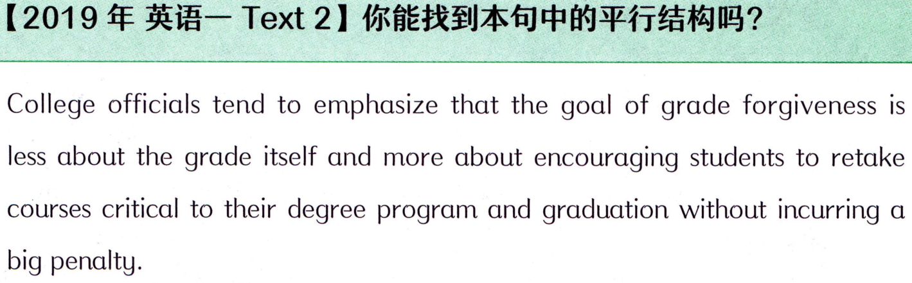

```text
【2019年英语一Text2】你能找到本句中的平行结构吗？
College officials tend to emphasize that the goal of grade forgiveness is
less about the grade itself and more about encouraging students to retake
big penalty.
```

### 【2019年英语一Text2】本句如何断开？平行结构是如何平行并

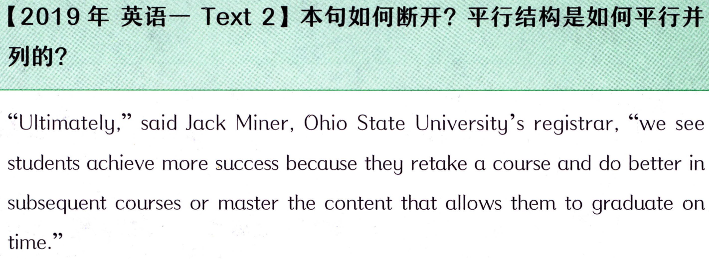

```text
【2019年英语一Text2】本句如何断开？平行结构是如何平行并
列的？
studentsachievemore successbecause theyretake a course and dobetter in
subsequent courses or master the content that allows them to graduate on
time."
```

### 【2019年英语一Text2】你能找到本句中的主句部分吗？

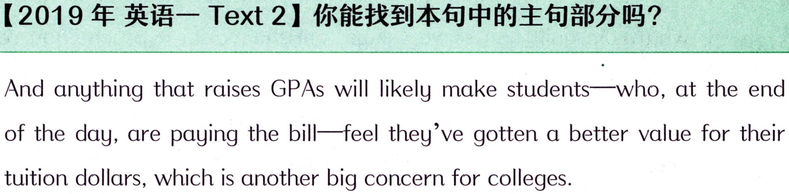

```text
【2019年英语一Text2】你能找到本句中的主句部分吗？
And anything that raises GPAs will likely make students—who, at the end
of the day, are paying the bill—feel they've gotten a better value for their
tuition dollars, which is another big concern for colleges.
```

### 【2019年英语一Text3】本句中一共几句话？几句之间都是什么

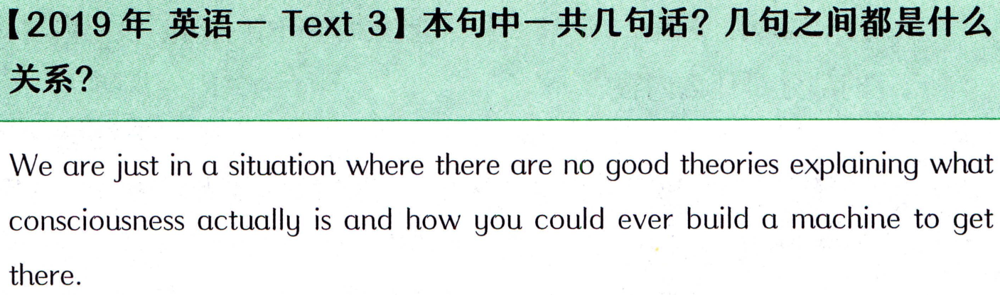

```text
【2019年英语一Text3】本句中一共几句话？几句之间都是什么
关系？
We are just in a situation where there are no good theories explaining what
consciousness actually is and how you could ever build a machine to get
there.
```

### 【2019年 英语一Text 4】本句如何断开？如何理解“will leave

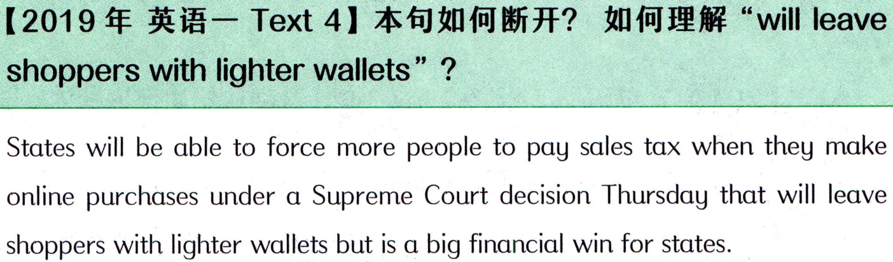

```text
【2019年 英语一Text 4】本句如何断开？如何理解“will leave
shoppers with lighter wallets"?
    ss   o      l s
online purchases under a Supreme Court decision Thursday that will leave
shoppers with lighter wallets but is a big financial win for states.
```

### 【2019年英语一Text4】本句中一共几句话？几句之间都是什么

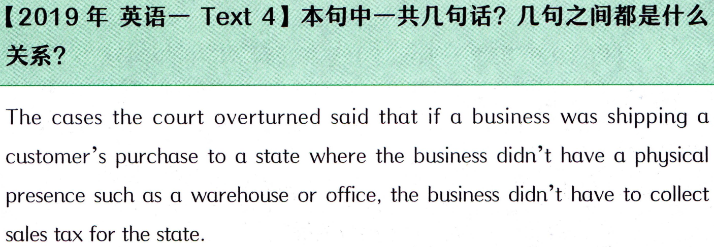

```text
【2019年英语一Text4】本句中一共几句话？几句之间都是什么
关系？
The cases the court overturned said that if a business was shipping a
presence such as a warehouse or office, the business didn't have to collect
sales tax for the state.
```

### 【2019年英语一Text4】and后面的内容与前面的什么内容平行

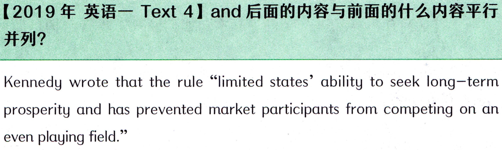

```text
【2019年英语一Text4】and后面的内容与前面的什么内容平行
并列？
Kennedy wrote that the rule “limited states’ ability to seek long-term
even playing field."
```

### 【2019年英语二Text1】破折号之后的这句话如何断开和理解？

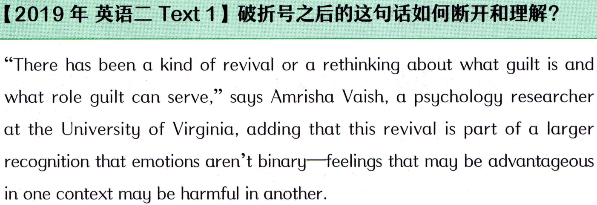

```text
【2019年英语二Text1】破折号之后的这句话如何断开和理解？
"There has been a kind of revival or a rethinking about what guilt is and
what role guilt can serve,” says Amrisha Vaish, a psychology researcher
at the University of Virginia, adding that this revival is part of a larger
recognition that emotions aren't binary—feelings that may be advantageous
in one context may be harmful in another.
```

### 【2019年英语二Text2】本句中有几个谓语动词？包含了几件事？

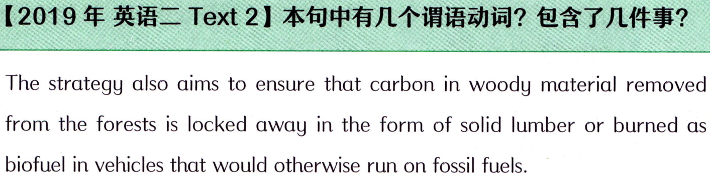

```text
【2019年英语二Text2】本句中有几个谓语动词？包含了几件事？
The strategy also aims to ensure that carbon in woody material removed
from the forests is locked away in the form of solid lumber or burned as
biofuel in vehicles that would otherwise run on fossil fuels.
```

### 【2019年英语二Text3】本句中that从句修饰的是什么？

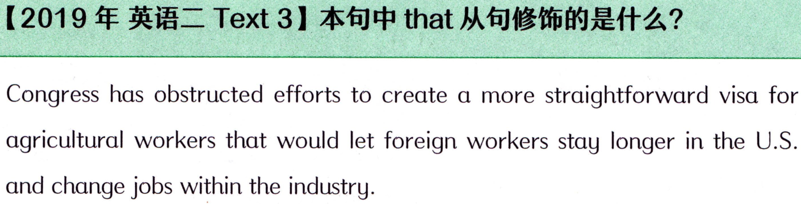

```text
【2019年英语二Text3】本句中that从句修饰的是什么？
Congress has obstructed efforts to create a more straightforward visa for
agricultural workers that would let foreign workers stay longer in the U.S.
and change jobs within the industry.
```

### 【2019年英语二Text4】本句话的核心内容是什么？

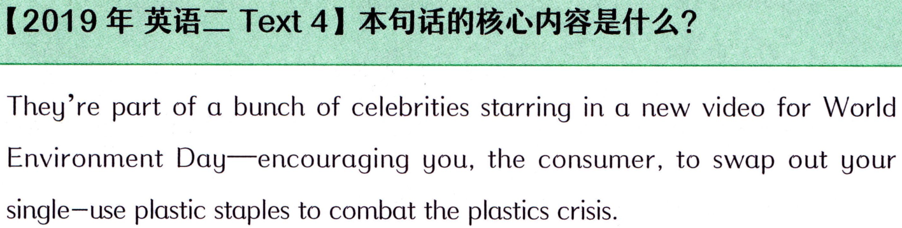

```text
【2019年英语二Text4】本句话的核心内容是什么？
They're part of a bunch of celebrities starring in a new video for World
Environment Day—encouraging you, the consumer, to swap out your
single-use plastic staples to combat the plastics crisis.
```

### 【2019年英语二Text4】请找出句中非谓语动词doing的完整词

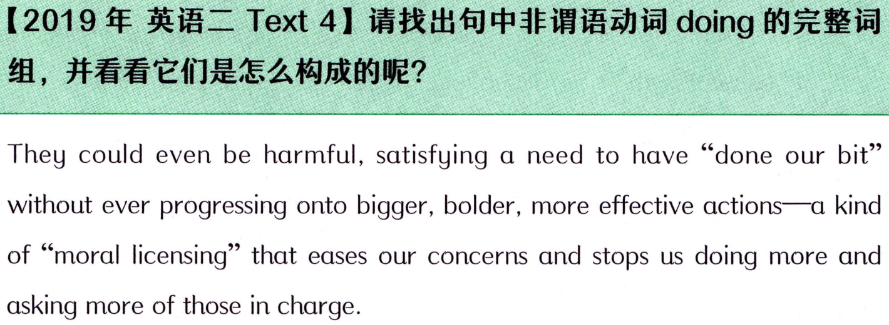

```text
【2019年英语二Text4】请找出句中非谓语动词doing的完整词
组，并看看它们是怎么构成的呢？
tq ino auop, aany ot paau p buihysins ‘jnguuny aq uaaa pinos haul
without ever progressing onto bigger, bolder, more effective actions—a kind
of “moral licensing" that eases our concerns and stops us doing more and
asking more of those in charge.
```

### 【2019年英语二Text4】本句中的嵌套结构和平行结构，你找到

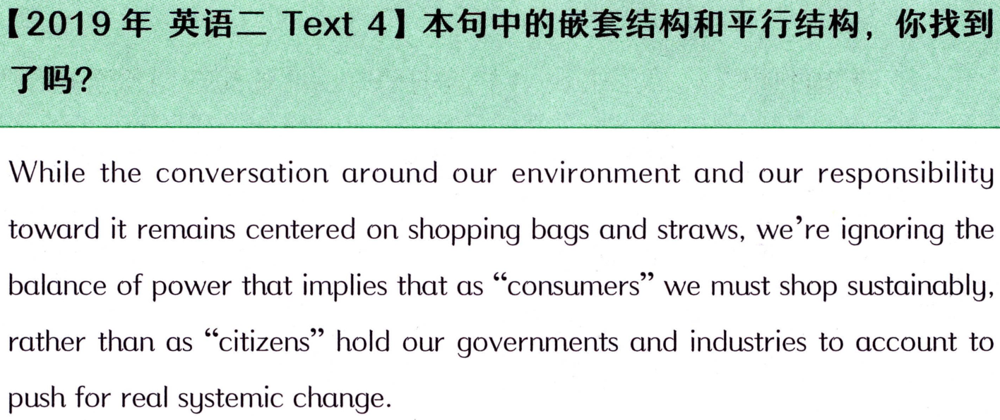

```text
【2019年英语二Text4】本句中的嵌套结构和平行结构，你找到
了吗？
While the conversation around our environment and our responsibility
toward it remains centered on shopping bags and straws, we're ignoring the
balance of power that implies that as “consumers"” we must shop sustainably,
rather than as “citizens" hold our governments and industries to account to
push for real systemic change.
```

### 【2020年英语一Text1】本句如何断开长难句？冒号之前的句子核

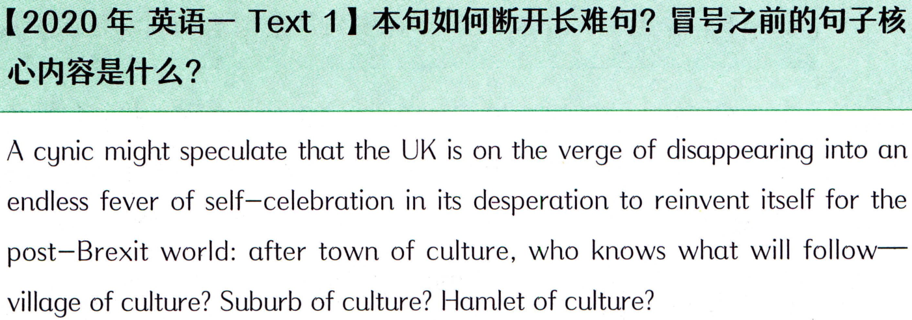

```text
【2020年英语一Text1】本句如何断开长难句？冒号之前的句子核
心内容是什么？
A cynic might speculate that the UK is on the verge of disappearing into an
endless fever of self-celebration in its desperation to reinvent itself for the
post-Brexit world: after town of culture, who knows what will follow-
village of culture? Suburb of culture? Hamlet of culture?
```

### 【2020年英语一Text1】本句中有几处平行结构？分别是怎么构成

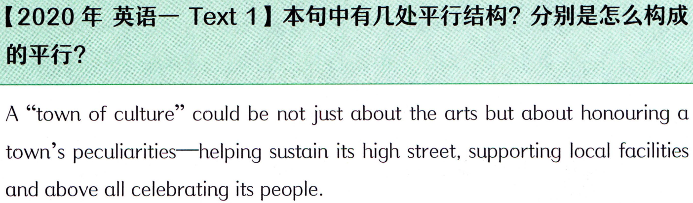

```text
【2020年英语一Text1】本句中有几处平行结构？分别是怎么构成
的平行？
A “town of culture” could be not just about the arts but about honouring a
town's peculiarities--helping sustain its high street, supporting local facilities
and above all celebrating its people.
```

### 【2020年英语一Text2】如何断开长难句？句子之间的联系是什么？

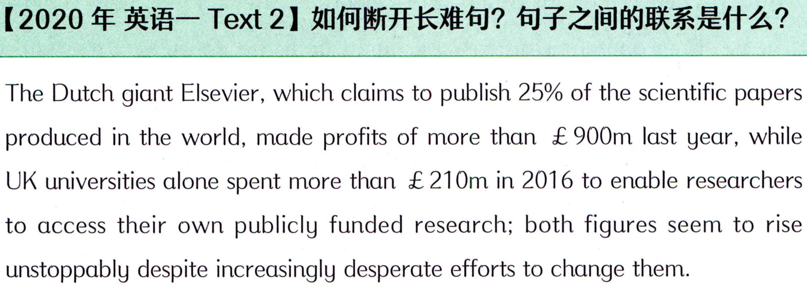

```text
【2020年英语一Text2】如何断开长难句？句子之间的联系是什么？
The Dutch giant Elsevier, which claims to publish 25% of the scientific papers
produced in the world, made profits of more than f 900m last year, while
UK universities alone spent more than f 210m in 2016 to enable researchers
unstoppably despite increasingly desperate efforts to change them.
```

### 【2020年英语一Text2】本句中有多少个动词？其中哪些是谓语

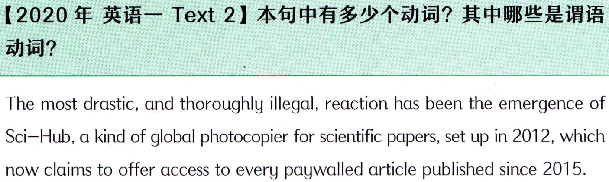

```text
【2020年英语一Text2】本句中有多少个动词？其中哪些是谓语
动词？
The most drastic, and thoroughly illegal, reaction has been the emergence of
Sci-Hub, a kind of global photocopier for scientific papers, set up in 2012, which
now claims to offer access to every paywalled article published since 2015.
```

### 【2020年英语一Text2】本句中包含了几件事？如何断开？

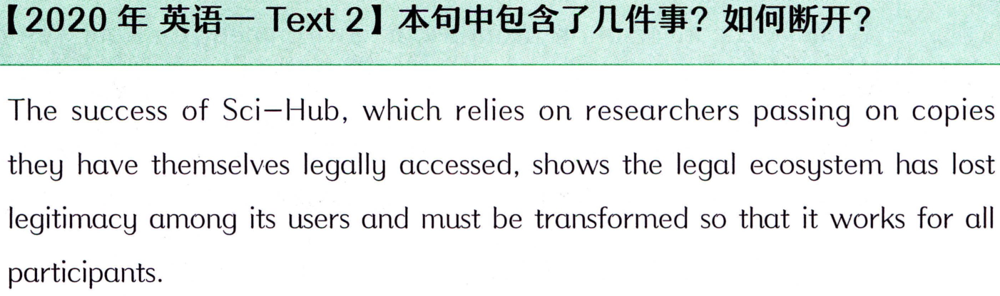

```text
【2020年英语一Text2】本句中包含了几件事？如何断开？
The success of Sci-Hub, which relies on researchers passing on copies
they have themselves legally accessed, shows the legal ecosystem has lost
legitimacy among its users and must be transformed so that it works for all
participants.
```

### 【2020年英语一Text2】本句中的平行结构你找到了吗？

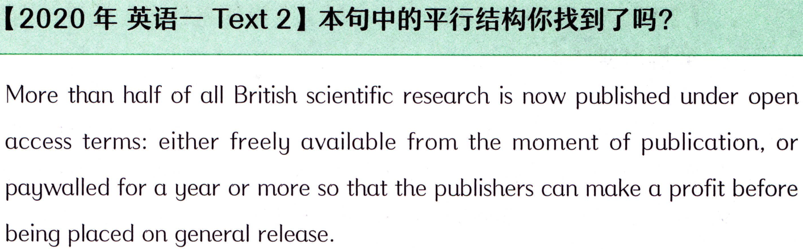

```text
【2020年英语一Text2】本句中的平行结构你找到了吗？
More than half of all British scientific research is now published under open
access terms: either freely available from the moment of publication,or
paywalled for a year or more so that the publishers can make a profit before
being placed on general release.
```

### 【2020年英语一Text2】本句中包含了几件事？通过什么断开？

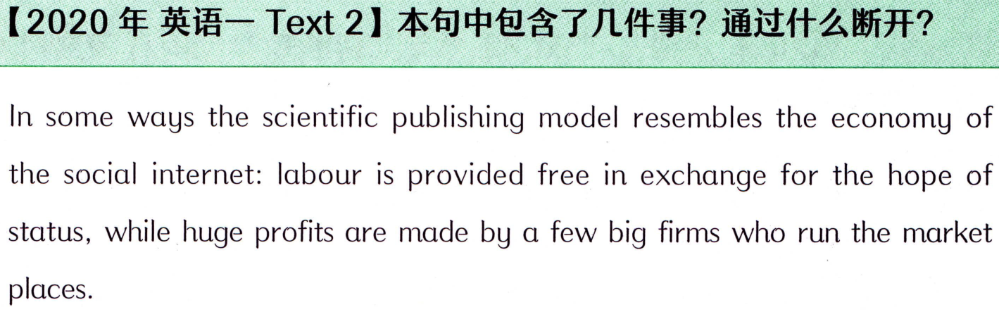

```text
【2020年英语一Text2】本句中包含了几件事？通过什么断开？
In some ways the scientific publishing model resembles the economy of
the social internet: labour is provided free in exchange for the hope of
status, while huge profits are made by a few big firms who run the market
places.
```

### 【2020年英语一Text3】本句中包含了几件事？几件事之间是什么

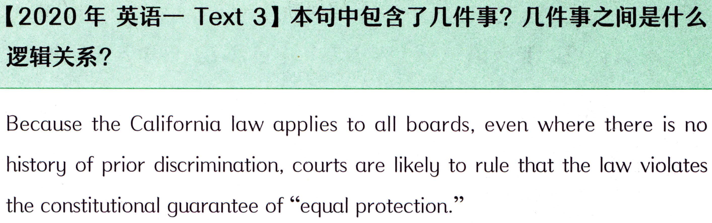

```text
【2020年英语一Text3】本句中包含了几件事？几件事之间是什么
逻辑关系？
Because the California law applies to all boards, even where there is no
history of prior discrimination, courts are likely to rule that the law violates
the constitutional guarantee of “equal protection."
```

### 【2020年英语一Text3】that从句中主语是什么？

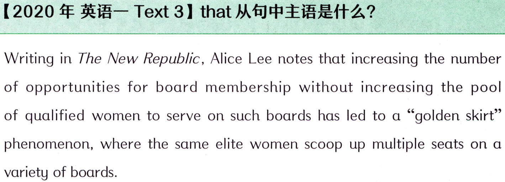

```text
【2020年英语一Text3】that从句中主语是什么？
Writing in The New Republic, Alice Lee notes that increasing the number
of opportunities for board membership without increasing the pool
of qualified women to serve on such boards has led to a “golden skirt"
phenomenon, where the same elite women scoop up multiple seats on a
variety of boards.
```

### 【2020年英语一Text3】本句中包含了几个从句？分别是什么从句？

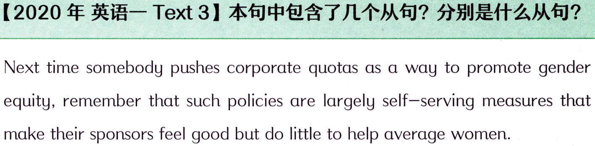

```text
【2020年英语一Text3】本句中包含了几个从句？分别是什么从句？
Next time somebody pushes corporate quotas as a way to promote gender
equity, remember that such policies are largely self-serving measures that
make their sponsors feel good but do little to help average women.
```

### 【2020年英语一Text4】“GAFA”指的是什么？通过什么从句进行

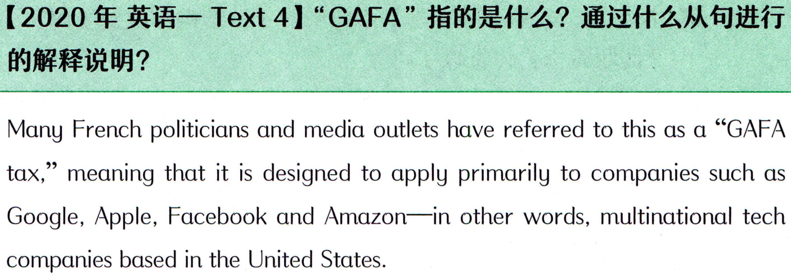

```text
【2020年英语一Text4】“GAFA”指的是什么？通过什么从句进行
的解释说明？
Many French politicians and media outlets have referred to this as a “GAFA
sp yons saluodwoo o hjowud hjddn ot paubisap s! t! 4oy buuau c'xp4
Google, Apple, Facebook and Amazon—in other words, multinational tech
companies based in the United States.
```

### 【2020年英语一Text4】本句如何断开？with伴随结构表达什么

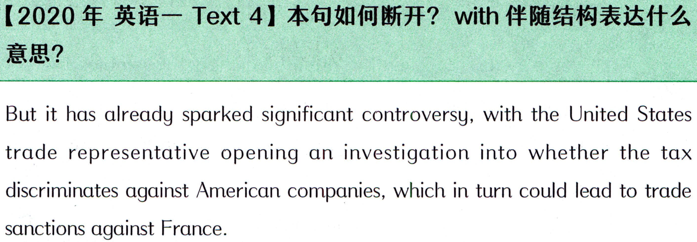

```text
【2020年英语一Text4】本句如何断开？with伴随结构表达什么
意思？
But it has already sparked significant controversy, with the United States
trade representative opening an investigation into whether the tax
discriminates against American companies, which in turn could lead to trade
sanctions against France.
```

### 【2020年英语一Text4】本句中包含了几件事？如何断开？

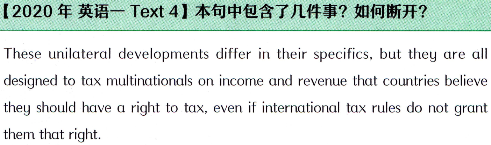

```text
【2020年英语一Text4】本句中包含了几件事？如何断开？
These unilateral developments differ in their specifics, but they are all
designed to tax multinationals on income and revenue that countries believe
they should have a right to tax, even if international tax rules do not grant
them that right.
```

### 【2020年英语一Text4】本句中包含了几件事？

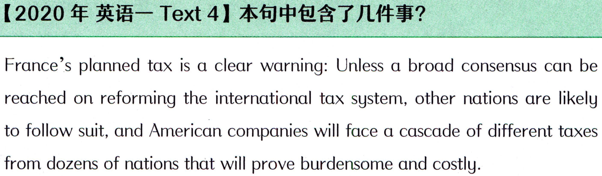

```text
【2020年英语一Text4】本句中包含了几件事？
France's planned tax is a clear warning: Unless a broad consensus can be
reached on reforming the international tax system, other nations are likely
to follow suit, and American companies will face a cascade of different taxes
from dozens of nations that will prove burdensome and costly.
```

### 【2020年英语二Text1】本句中包含了几个从句？分别是补充说明

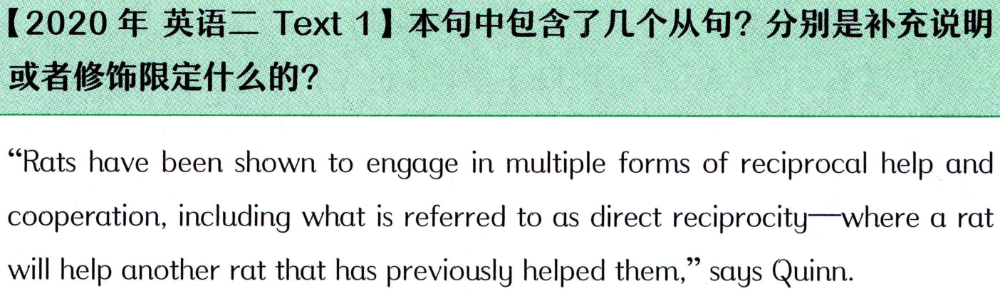

```text
【2020年英语二Text1】本句中包含了几个从句？分别是补充说明
或者修饰限定什么的？
"Rats have been shown to engage in multiple forms of reciprocal help and
cooperation, including what is referred to as direct reciprocity—where a rat
will help another rat that has previously helped them,” says Quinn.
```

### 【2020年英语二Text2】标点可以帮助理解句意，本句中的标点有

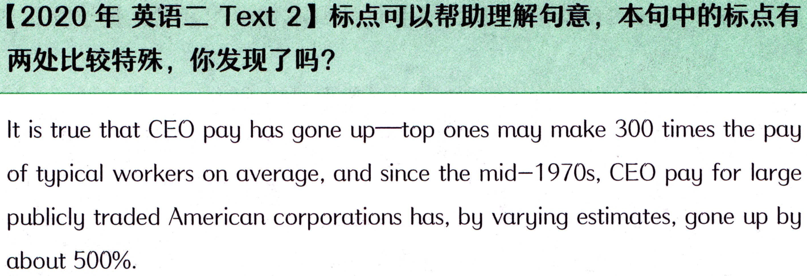

```text
【2020年英语二Text2】标点可以帮助理解句意，本句中的标点有
两处比较特殊，你发现了吗？
It is true that CEO pay has gone up—top ones may make 300 times the pay
of typical workers on average, and since the mid-1970s, CEO pay for large
publicly traded American corporations has, by varying estimates, gone up by
about 500%.
```

### 【2020年英语二Text3】本句中同时出现了考研长难句的3种特殊

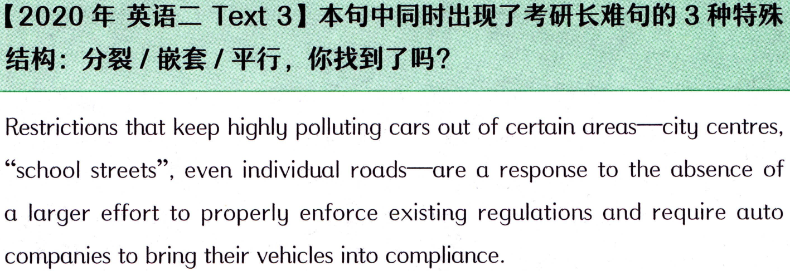

```text
【2020年英语二Text3】本句中同时出现了考研长难句的3种特殊
结构：分裂／嵌套／平行，你找到了吗？
Restrictions that keep highly polluting cars out of certain areas—city centres,
"school streets", even individual roads--are a response to the absence of
a larger effort to properly enforce existing regulations and require auto
companies to bring their vehicles into compliance.
```

### 【2020年英语二Text4】主句的核心内容是什么？

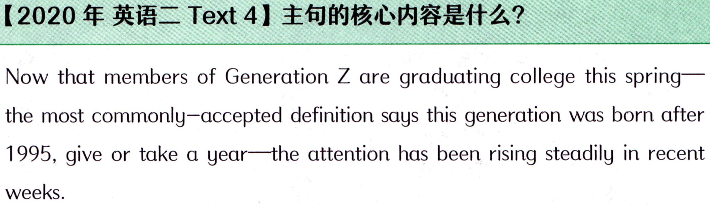

```text
【2020年英语二Text4】主句的核心内容是什么？
Now that members of Generation Z are graduating college this spring
the most commonly-accepted definition says this generation was born after
1995, give or take a year—the attention has been rising steadily in recent
weeks.
```

### 【2020年英语二Text4】本句去修饰之后，核心内容是什么？

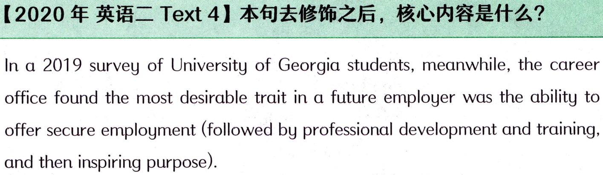

```text
【2020年英语二Text4】本句去修饰之后，核心内容是什么？
In a 2019 survey of University of Georgia students, meanwhile, the career
office found the most desirable trait in a future employer was the ability to
offer secure employment (followed by professional development and training,
and then inspiring purpose).
```

### 【2020年英语二Text4】如何断开长难句？

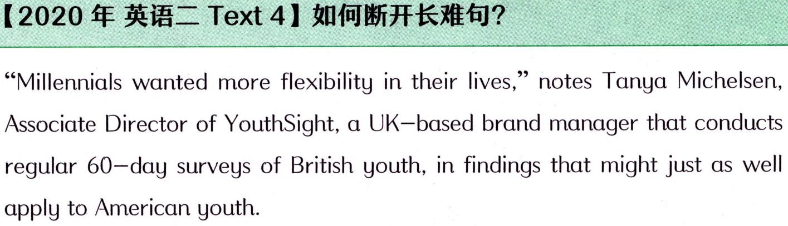

```text
【2020年英语二Text4】如何断开长难句？
Associate Director of YouthSight,a UK-based brand manager that conducts
regular 60-day surveys of British youth, in findings that might just as well
apply to American youth.
```

### 【2021年英语一Text1】你找到本句中的嵌套结构了吗？

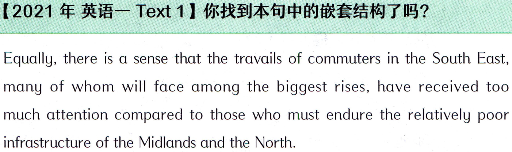

```text
【2021年英语一Text1】你找到本句中的嵌套结构了吗？
Equally, there is a sense that the travails of commuters in the South East,
many of whom will face among the biggest rises, have received too
much attention compared to those who must endure the relatively poor
infrastructure of the Midlands and the North.
```

### 【2021年英语一Text1】本句中包含了几件事？可以断成几段？

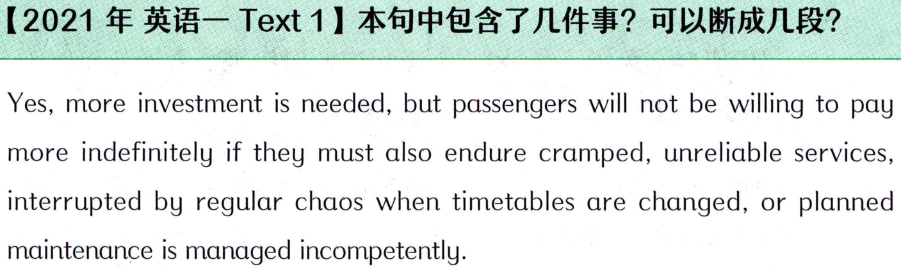

```text
【2021年英语一Text1】本句中包含了几件事？可以断成几段？
Yes, more investment is needed, but passengers will not be willing to pay
more indefinitely if they must also endure cramped, unreliable services,
interrupted by regular chaos when timetables are changed, or planned
maintenance is managed incompetently.
```

### 【2021年英语一Text2】that从句的核心内容是什么？

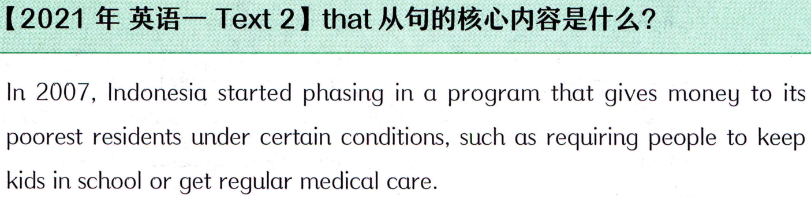

```text
【2021年英语一Text2】that从句的核心内容是什么？
In 2007, Indonesia started phasing in a program that gives money to its
poorest residents under certain conditions, such as requiring people to keep
kids in school or get regular medical care.
```

### 【2021 年 英语一 Text 3】 the majority of which 中的 which 指的

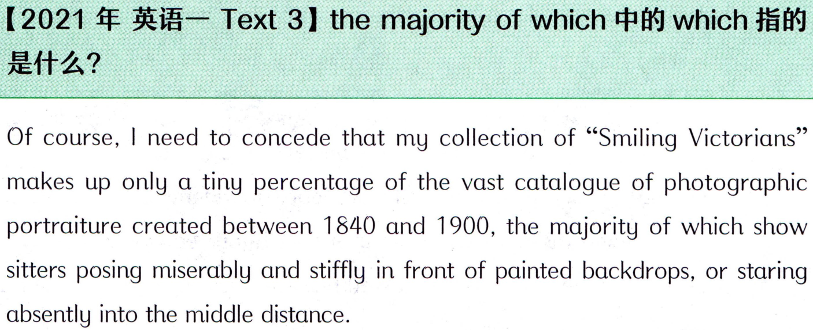

```text
【2021 年 英语一 Text 3】 the majority of which 中的 which 指的
是什么？
Of course, I need to concede that my collection of "Smiling Victorians"
makes up only a tiny percentage of the vast catalogue of photographic
portraiture created between 1840 and 1900, the majority of which show
sitters posing miserably and stiffly in front of painted backdrops, or staring
absently into the middle distance.
```

### 【2021年英语一Text4】你找到本句中的嵌套结构了吗？

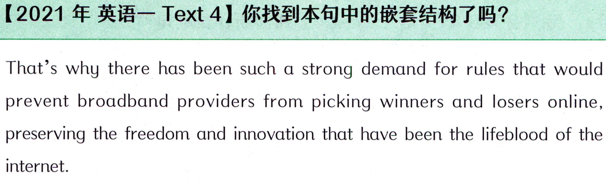

```text
【2021年英语一Text4】你找到本句中的嵌套结构了吗？
That's why there has been such a strong demand for rules that would
prevent broadband providers from picking winners and losers online,
preserving the freedom and innovation that have been the lifeblood of the
internet.
```

### 【2021年英语二Text1】本句断开后的最后一段，是which从句，

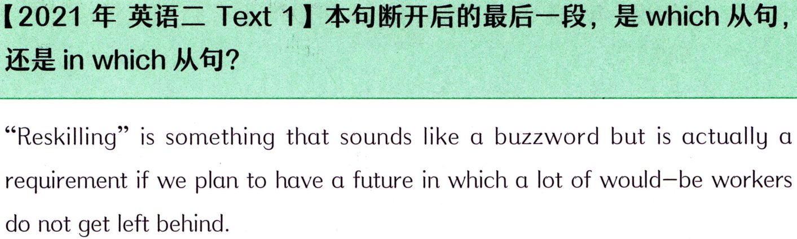

```text
【2021年英语二Text1】本句断开后的最后一段，是which从句，
还是inwhich从句？
"Reskilling" is something that sounds like a buzzword but is actually a
requirement if we plan to have a future in which a lot of would-be workers
do not get left behind.
```

### 【2021年英语二Text2】with后接了几部分内容？分别是什么？

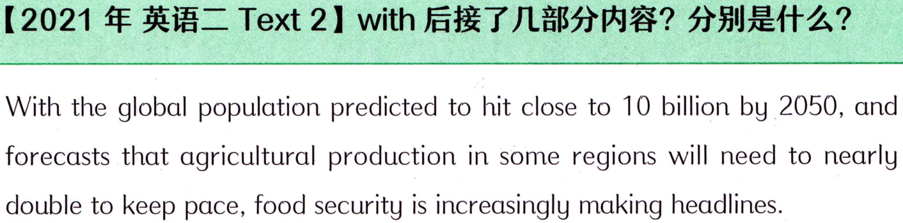

```text
【2021年英语二Text2】with后接了几部分内容？分别是什么？
With the global population predicted to hit close to 10 billion by 2050, and
forecasts that agricultural production in some regions will need to nearly
double to keep pace, food security is increasingly making headlines.
```

### 【2021年英语二Text2】本句如何断开？句子之间是什么逻辑关

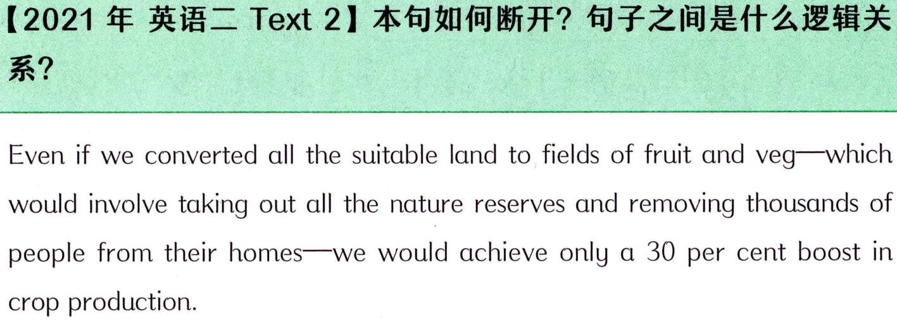

```text
【2021年英语二Text2】本句如何断开？句子之间是什么逻辑关
系？
Even if we converted all the suitable land to fields of fruit and veg—which
would involve taking out all the nature reserves and removing thousands of
people from their homes—we would achieve only a 30 per cent boost in
crop production.
```

### 【2021年英语二Text3】本句如何断开和简化？

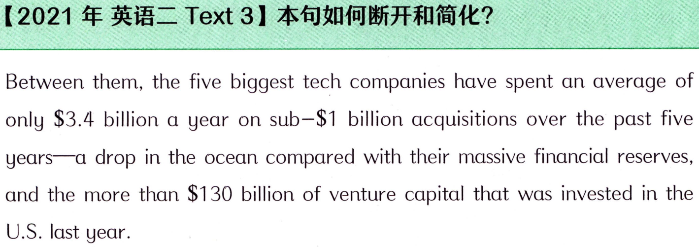

```text
【2021年英语二Text3】本句如何断开和简化？
Between them, the five biggest tech companies have spent an average of
only $3.4 billion α year on sub-$1 billion acquisitions over the past five
years—a drop in the ocean compared with their massive financial reserves,
and the more than $130 billion of venture capital that was invested in the
U.S. last year.
```

### 【2021年英语二Text3】本句如何断开？

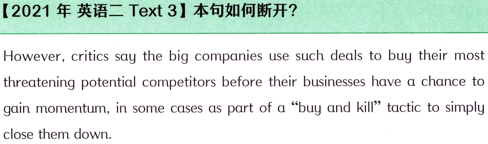

```text
【2021年英语二Text3】本句如何断开？
However, critics say the big companies use such deals to buy their most
threatening potential competitors before their businesses have a chance to
gain momentum, in some cases as part of a “"buy and kill" tactic to simply
close them down.
```

### 【2021年英语二Text4】本句中的平行结构是什么与什么平行并

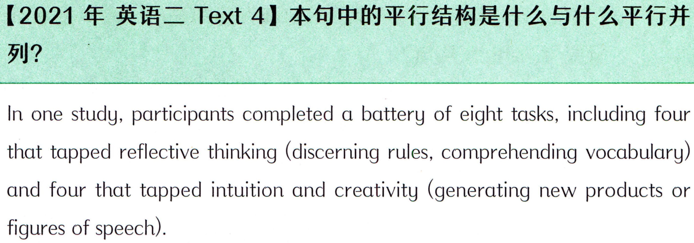

```text
【2021年英语二Text4】本句中的平行结构是什么与什么平行并
列？
In one study, participants completed a battery of eight tasks, including four
that tapped reflective thinking (discerning rules, comprehending vocabulary)
and four that tapped intuition and creativity (generating new products or
figures of speech).
```

### 【2022年英语一Text1】本句中有几个从句？分别是哪部分？

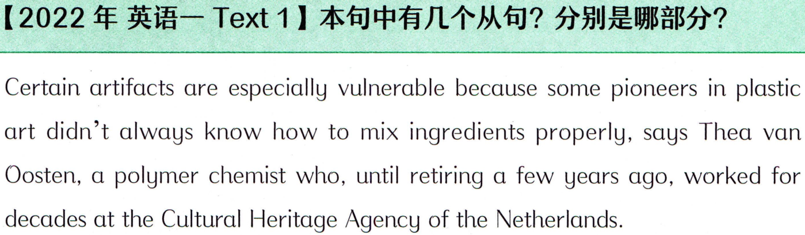

```text
【2022年英语一Text1】本句中有几个从句？分别是哪部分？
Certain artifacts are especially vulnerable because some pioneers in plastic
art didn't always know how to mix ingredients properly, says Thea van
Oosten, a polymer chemist who, until retiring a few years ago, worked for
decades at the Cultural Heritage Agency of the Netherlands.
```

### 【2022年英语一Text2】本句中包含了几件事？如何断开？

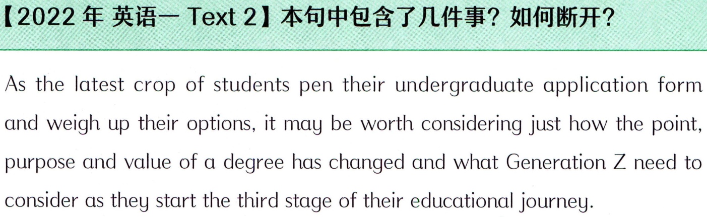

```text
【2022年英语一Text2】本句中包含了几件事？如何断开？
As the latest crop of students pen their undergraduate application form
and weigh up their options, it may be worth considering just how the point,
purpose and value of a degree has changed and what Generation Z need to
consider as they start the third stage of their educational journey.
```

### 【2022年英语一Text2】本句中的平行结构你找到了吗？是什么与

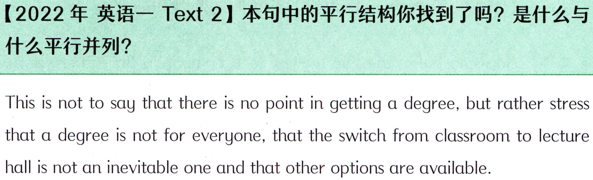

```text
【2022年英语一Text2】本句中的平行结构你找到了吗？是什么与
什么平行并列？
  a '    o  si e      s
that a degree is not for everyone, that the switch from classroom to lecture
hall is not an inevitable one and that other options are available.
```

### 【2022年英语一Text3】本句如何断开？

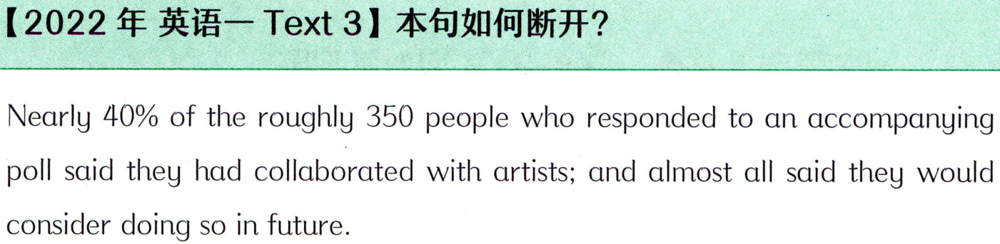

```text
【2022年英语一Text3】本句如何断开？
Nearly 40% of the roughly 350 people who responded to an accompanying
poll said they had collaborated with artists; and almost all said they would
consider doing so in future.
```

### 【2022年英语一Text4】本句中有几个从句？从句开始和结束于哪里？

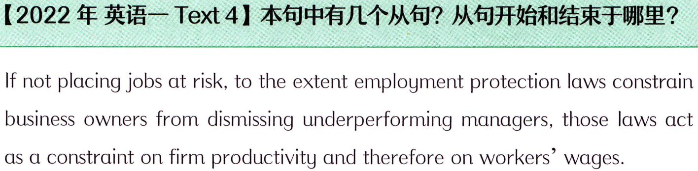

```text
【2022年英语一Text4】本句中有几个从句？从句开始和结束于哪里？
If not placing jobs at risk, to the extent employment protection laws constrain
business owners from dismissing underperforming managers, those laws act
as a constraint on firm productivity and therefore on workers’ wages.
```

### 【2022年英语二Text1】本句包含了几件事？如何断开？

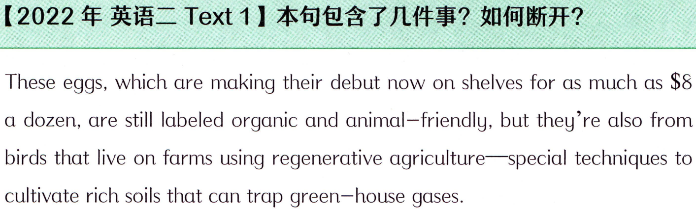

```text
【2022年英语二Text1】本句包含了几件事？如何断开？
These eggs, which are making their debut now on shelves for as much as $8
α dozen, are still labeled organic and animal-friendly, but they're also from
birds that live on farms using regenerative agriculture—special techniques to
cultivate rich soils that can trap green-house gases.
```

### 【2022年英语二Text2】本句中的嵌套结构你找到了吗？

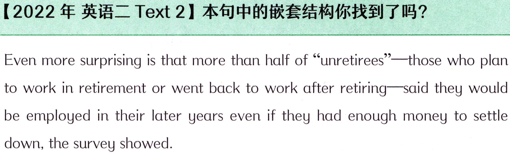

```text
【2022年英语二Text2】本句中的嵌套结构你找到了吗？
Even more surprising is that more than half of "unretirees"—those who plan
to work in retirement or went back to work after retiring—said they would
be employed in their later years even if they had enough money to settle
down, the survey showed.
```

### 【2022年英语二Text3】本句中包含了几处平行结构？分别是什么

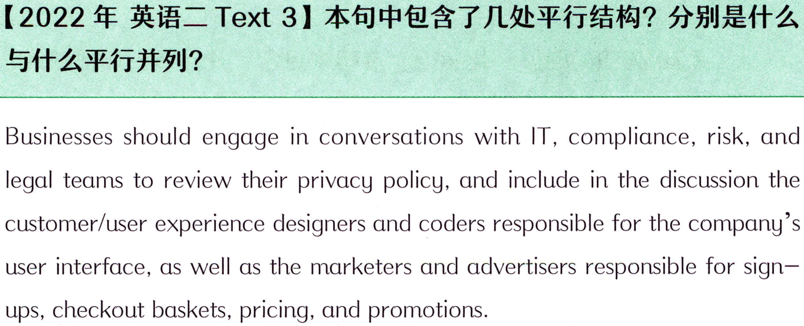

```text
【2022年英语二Text3】本句中包含了几处平行结构？分别是什么
与什么平行并列？
Businesses should engage in conversations with IT, compliance, risk, and
legal teams to review their privacy policy, and include in the discussion the
customer/user experience designers and coders responsible for the company's
user interface, as well as the marketers and advertisers responsible for sign-
ups, checkout baskets, pricing, and promotions.
```

### 【2022年英语二Text4】本句中包含了几件事？如何断开？

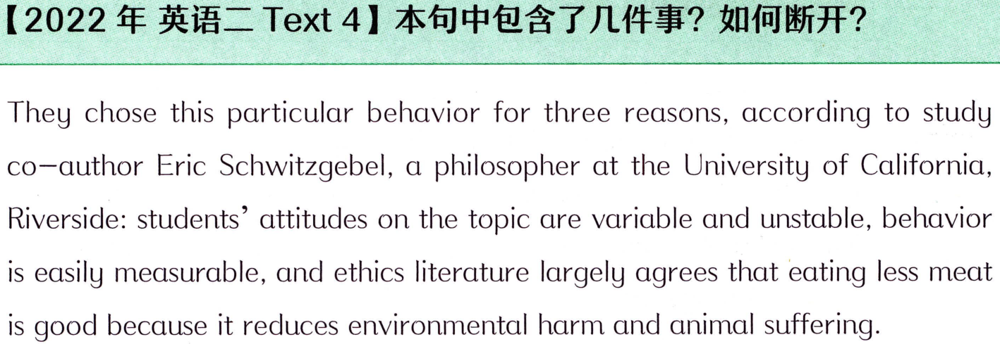

```text
【2022年英语二Text4】本句中包含了几件事？如何断开？
They chose this particular behavior for three reasons, according to study
co-author Eric Schwitzgebel, a philosopher at the University of California,
Riverside: students’ attitudes on the topic are variable and unstable, behavior
is easily measurable, and ethics literature largely agrees that eating less meat
is good because it reduces environmental harm and animal suffering.
```

### 【2023年英语一Text1】主句的核心内容是什么？

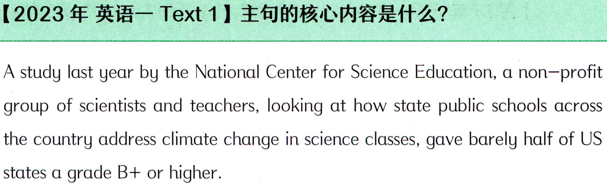

```text
【2023年英语一Text1】主句的核心内容是什么？
group of scientists and teachers, looking at how state public schools across
the country address climate change in science classes, gave barely half of US
states a grade B+ or higher.
```

### 【2023年英语一Text1】本句中的分裂结构和嵌套结构你找到了吗？

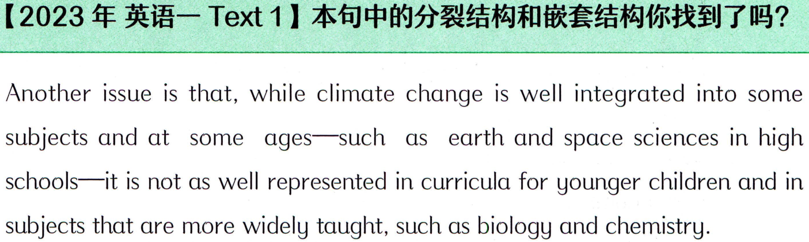

```text
【2023年英语一Text1】本句中的分裂结构和嵌套结构你找到了吗？
Another issue is that, while climate change is well integrated into some
subjects and at some ages—such as earth and space sciences in high
schools—it is not as well represented in curicula for younger children and in
subjects that are more widely taught, such as biology and chemistry.
```

### 【2023年英语一Text1】本句中的嵌套结构是什么嵌套了什么？

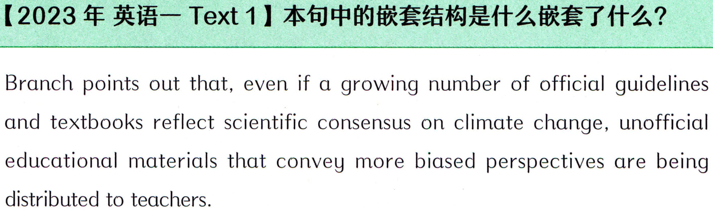

```text
【2023年英语一Text1】本句中的嵌套结构是什么嵌套了什么？
Branch points out that, even if a growing number of official guidelines
and textbooks reflect scientific consensus on climate change, unofficial
distributed to teachers.
```

### 【2023年英语一Text2】本句中包含了几件事？如何断开？

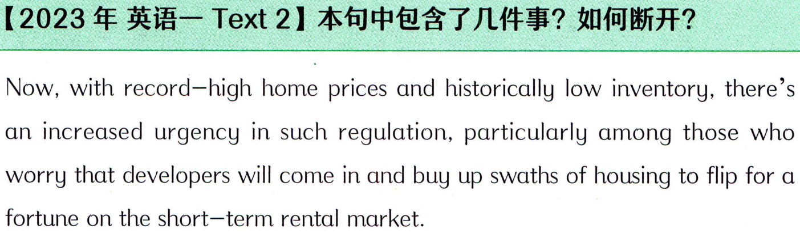

```text
【2023年英语一Text2】本句中包含了几件事？如何断开？
Now, with record-high home prices and historically low inventory, there's
an increased urgency in such regulation, particularly among those who
worry that developers will come in and buy up swaths of housing to flip for a
fortune on the short-term rental market.
```

### 【2023年英语一Text3】本句中包含了几件事？其中的平行结构和

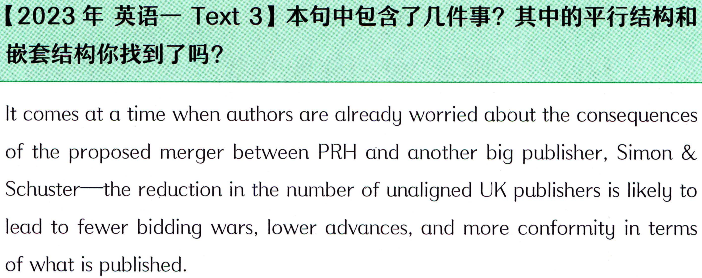

```text
【2023年英语一Text3】本句中包含了几件事？其中的平行结构和
嵌套结构你找到了吗？
It comes at a time when authors are already worried about the consequences
of the proposed merger between PRH and another big publisher, Simon &
Schuster—the reduction in the number of unaligned UK publishers is likely to
lead to fewer bidding wars, lower advances, and more conformity in terms
of what is published.
```

### 【2023年英语一Text4】本句中的平行结构，是什么与什么平行并列？

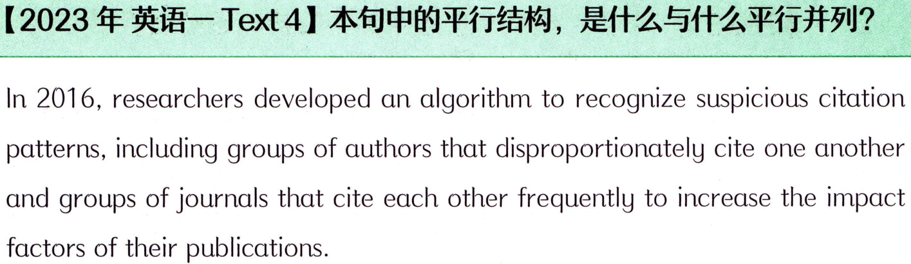

```text
【2023年英语一Text4】本句中的平行结构，是什么与什么平行并列？
In 2016, researchers developed an algorithm to recognize suspicious citation
patterns, including groups of authors that disproportionately cite one another
and groups of journals that cite each other frequently to increase the impact
factors of their publications.
```

### 【2023年英语一Text4】本句中包含了几件事？如何断开？

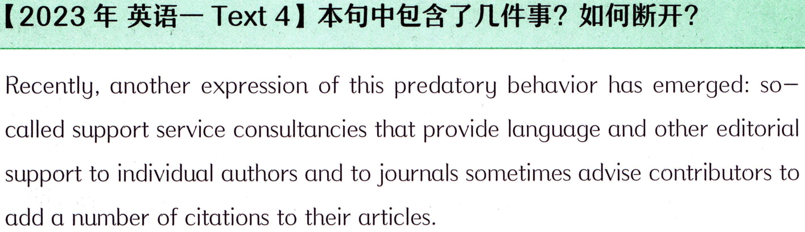

```text
【2023年英语一Text4】本句中包含了几件事？如何断开？
Recently, another expression of this predatory behavior has emerged: so-
support to individual authors and to journals sometimes advise contributors to
add a number of citations to their articles.
```

### 【2023年英语二Text1】本句如何断开和简化？

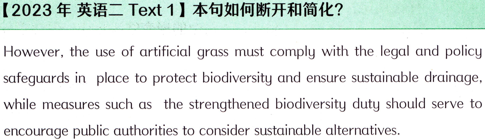

```text
【2023年英语二Text1】本句如何断开和简化？
However, the use of artificial grass must comply with the legal and policy
safeguards in place to protect biodiversity and ensure sustainable drainage,
while measures such as the strengthened biodiversity duty should serve to
encourage public authorities to consider sustainable alternatives.
```

### 【2023年英语二Text2】本句中的平行结构是什么与什么平行并

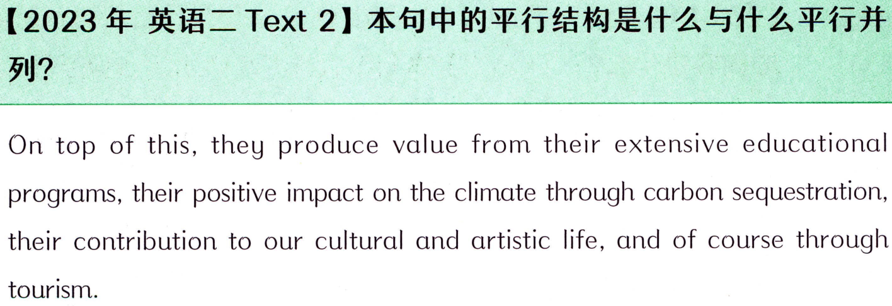

```text
【2023年英语二Text2】本句中的平行结构是什么与什么平行并
列？
On top of this, they produce value from their extensive educational
programs, their positive impact on the climate through carbon sequestration,
their contribution to our cultural and artistic life, and of course through
tourism.
```

### 【2023年英语二Text3】本句如何断开和简化？

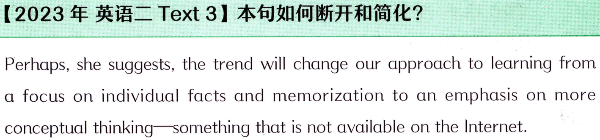

```text
【2023年英语二Text3】本句如何断开和简化？
Perhaps, she suggests, the trend will change our approach to learning from
afocusonindividualfactsandmemorizationtoan emphasisonmore
conceptual thinking—something that is not available on the Internet.
```

### 【2023年英语二Text4】本句中的嵌套结构和平行结构你找到了吗？

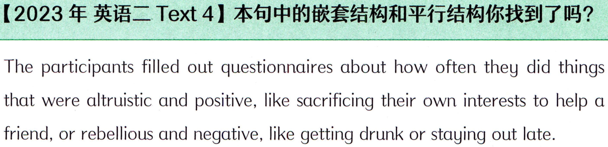

```text
【2023年英语二Text4】本句中的嵌套结构和平行结构你找到了吗？
The participants filled out questionnaires about how often they did things
that were altruistic and positive, like sacrificing their own interests to help a
friend, or rebellious and negative, like getting drunk or staying out late.
```

### 【2024年英语一Text1】本句如何断开？包含了几个从句？其中有

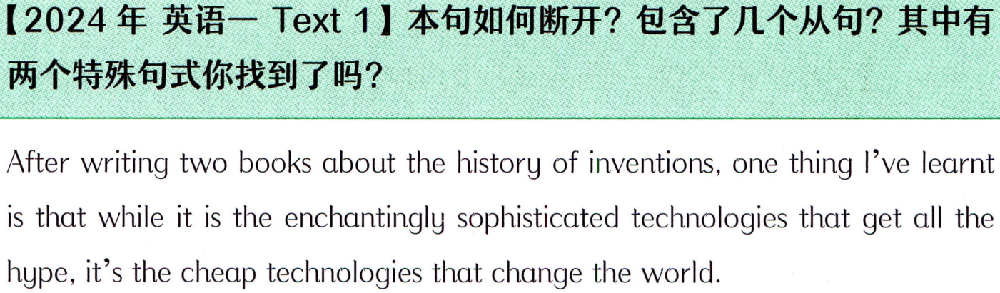

```text
【2024年英语一Text1】本句如何断开？包含了几个从句？其中有
两个特殊句式你找到了吗？
After writing two books about the history of inventions, one thing I've learnt
is that while it is the enchantingly sophisticated technologies that get all the
hype, it's the cheap technologies that change the world.
```

### 【2024年英语一Text2】本句如何断开？包含了几个从句？分别是

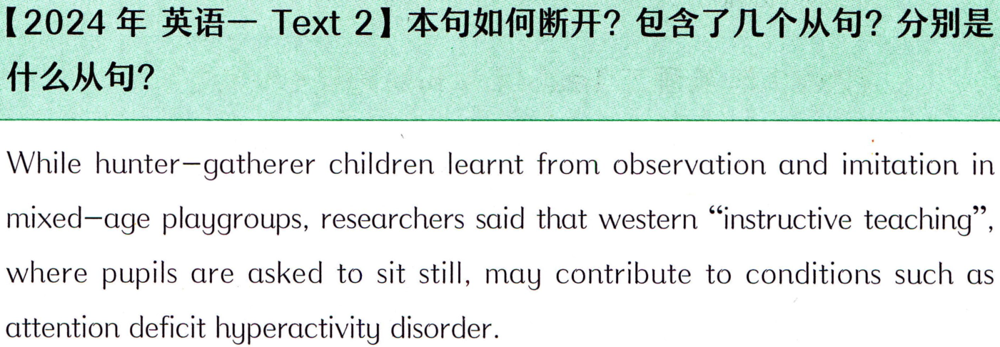

```text
【2024年英语一Text2】本句如何断开？包含了几个从句？分别是
什么从句？
While hunter-gatherer children learnt from observation and imitation in
mixed-age playgroups, researchers said that western “"instructive teaching",
where pupils are asked to sit still, may contribute to conditions such as
attention deficit hyperactivity disorder.
```

### 【2024年英语一Text4】本句中that从句是什么从句？简化后的核

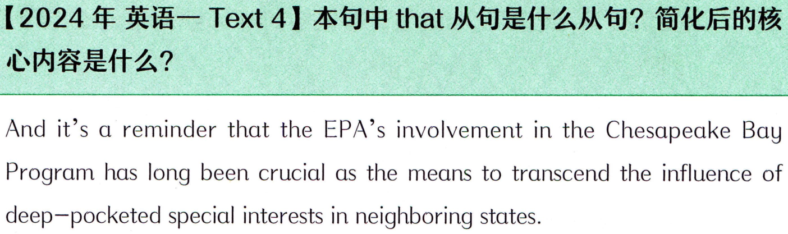

```text
【2024年英语一Text4】本句中that从句是什么从句？简化后的核
心内容是什么？
And it's a reminder that the EPA's involvement in the Chesapeake Bay
 n  pse  s  s n  b sy o
deep-pocketed special interests in neighboring states.
```

### 【2024年 英语二Text 1】saysCoyle之前的句子中包含了几件

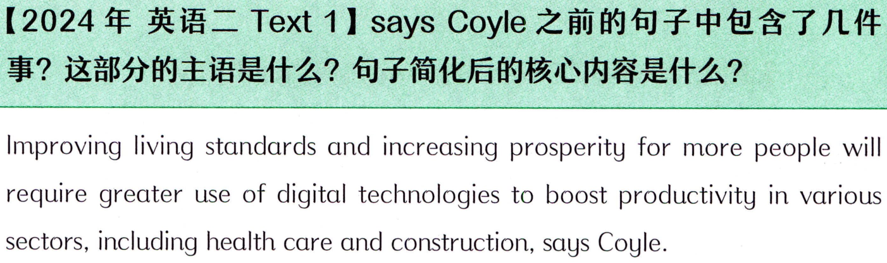

```text
【2024年 英语二Text 1】saysCoyle之前的句子中包含了几件
事？这部分的主语是什么？句子简化后的核心内容是什么？
Improving living standards and increasing prosperity for more people will
require greater use of digital technologies to boost productivity in various
sectors, including health care and construction, says Coyle.
```

### 【2024年英语二Text2】本句中的特殊句式你找到了吗？如何还原

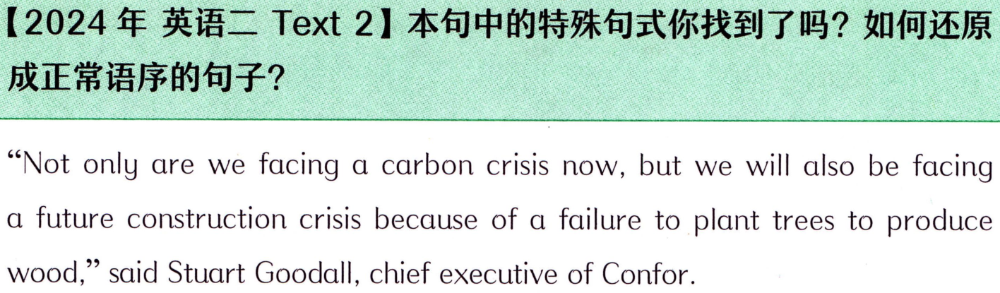

```text
【2024年英语二Text2】本句中的特殊句式你找到了吗？如何还原
成正常语序的句子？
"Not only are we facing a carbon crisis now, but we will also be facing
a future construction crisis because of a failure to plant trees to produce
wood,” said Stuart Goodall, chief executive of Confor.
```

### 【2024年英语二Text3】本句中包含了几个从句？其中的嵌套结构

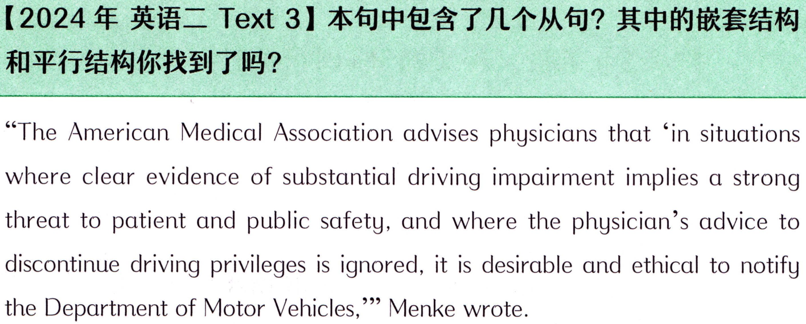

```text
【2024年英语二Text3】本句中包含了几个从句？其中的嵌套结构
和平行结构你找到了吗？
"The American Medical Association advises physicians that ‘in situations
where clear evidence of substantial driving impairment implies a strong
threat to patient and public safety, and where the physician's advice to
discontinue driving privileges is ignored, it is desirable and ethical to notify
the Department of Motor Vehicles,'" Menke wrote.
```

### 【2024年英语二Text4】本句中包含了几个从句？分别是什么从句？

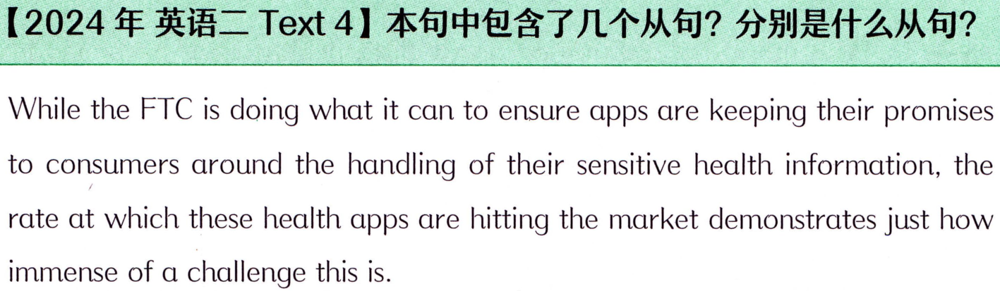

```text
【2024年英语二Text4】本句中包含了几个从句？分别是什么从句？
While the FTC is doing what it can to ensure apps are keeping their promises
to consumers around the handling of their sensitive health information, the
rate at which these health apps are hitting the market demonstrates just how
immense of a challenge this is.
```

### 【2025年英语一Text1】本句中包含了几个从句？其中suggested

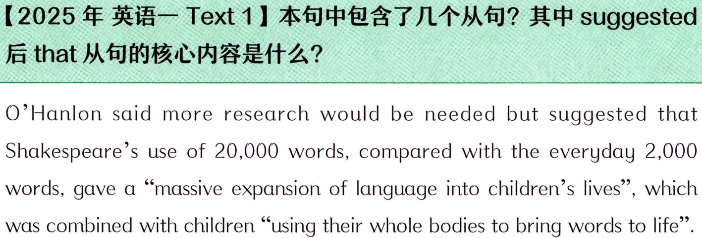

```text
【2025年英语一Text1】本句中包含了几个从句？其中suggested
后that从句的核心内容是什么？
O'Hanlon said more research would be needed but suggested that
Shakespeare's use of 20,000 words, compared with the everyday 2,000
words, gave a “massive expansion of language into children's lives”, which
was combined with children “using their whole bodies to bring words to life".
```

### 【2025年英语一Text2】本句中的that从句是什么从句？其核心内

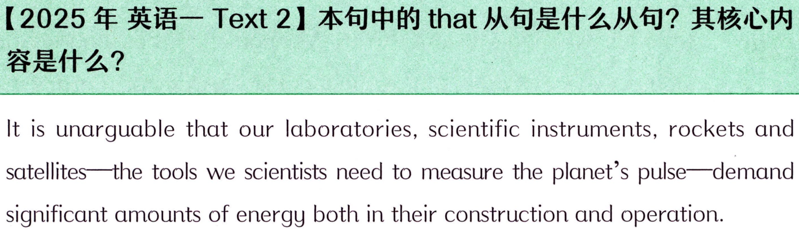

```text
【2025年英语一Text2】本句中的that从句是什么从句？其核心内
容是什么？
It is unarguable that our laboratories, scientific instruments, rockets and
satellites——the tools we scientists need to measure the planet's pulse——demand
significant amounts of energy both in their construction and operation.
```

### 【2025年英语一Text3】冒号后有几个从句？如何断开？分别是什

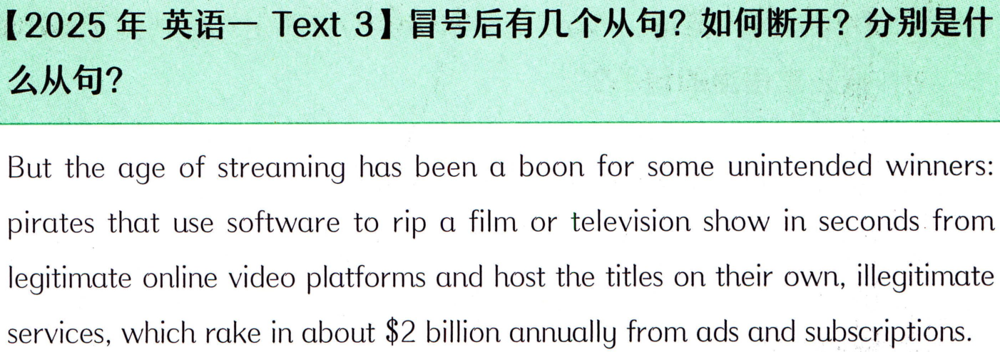

```text
【2025年英语一Text3】冒号后有几个从句？如何断开？分别是什
么从句？
But the age of streaming has been a boon for some unintended winners:
pirates that use software to rip a film or television show in seconds.from
legitimate online video platforms and host the titles on their own, illegitimate
services, which rake in about $2 billion annually from ads and subscriptions.
```

### 【2025年英语一Text4】本句如何断开？

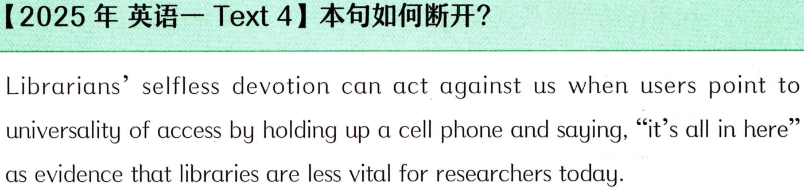

```text
【2025年英语一Text4】本句如何断开？
Librarians’ selfless devotion can act against us when users point to
universality of access by holding up a cell phone and saying, "it's all in here”"
as evidence that libraries are less vital for researchers today.
```

### 【2025年英语二Text2】本句如何断开？with介词短语表示什么

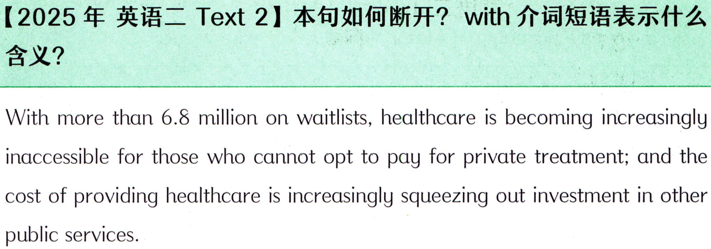

```text
【2025年英语二Text2】本句如何断开？with介词短语表示什么
含义？
With more than 6.8 million on waitlists, healthcare is becoming increasingly
inaccessible for those who cannot opt to pay for private treatment; and the
cost of providing healthcare is increasingly squeezing out investment in other
public services.
```

### 【2025年英语二Text3】本句中的平行结构你找到了吗？简化后的

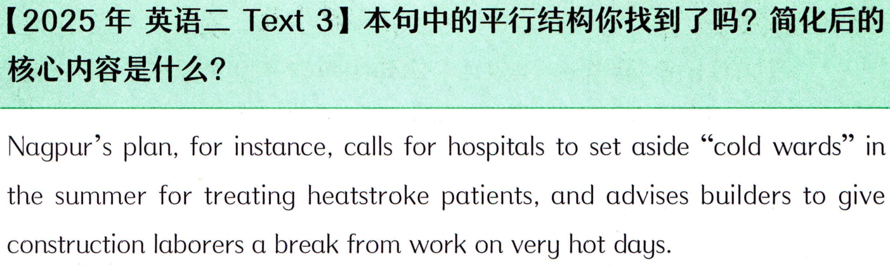

```text
【2025年英语二Text3】本句中的平行结构你找到了吗？简化后的
核心内容是什么？
Nagpur's plan, for instance, calls for hospitals to set aside “cold wards"” in
the summer for treating heatstroke patients, and advises builders to give
construction laborers a break from work on very hot days.
```

### 【2025年英语二Text4】本句中包含了几件事？简化后的核心内容

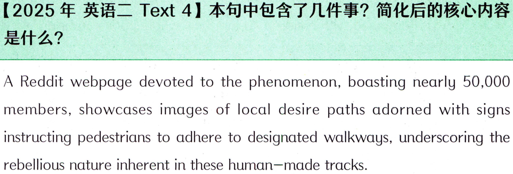

```text
【2025年英语二Text4】本句中包含了几件事？简化后的核心内容
是什么？
A Reddit webpage devoted to the phenomenon, boasting nearly 50,000
members, showcases images of local desire paths adorned with signs
instructing pedestrians to adhere to designated walkways, underscoring the
rebellious nature inherent in these human-made tracks.
```
