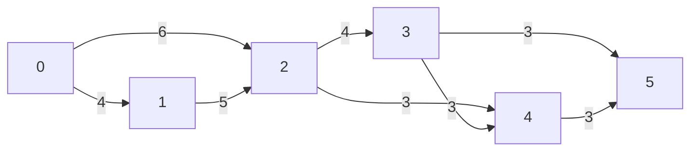

# 综合题 第 9 题

![[_Attachments/题目识别/27_王道408-题目/DS-C06-64-F09_题目.png|题目]]

9.【2011 统考真题】已知有6个顶点(顶点编号为0~5)的有向带权图$G$，其邻接矩阵$A$为上三角矩阵，按行为主序(行优先)保存在如下的一维数组中。
| 4 | 6 | $\infty$ | $\infty$ | $\infty$ | 5 | $\infty$ | $\infty$ | $\infty$ | 4 | 3 | $\infty$ | $\infty$ | 3 | 3 |
|---|---|---|---|---|---|---|---|---|---|---|---|---|---|---|
要求:
1) 写出图$G$的邻接矩阵$A$.
【图：一个6行6列的上三角矩阵，对角线上的元素为0，其他上三角元素根据题目给出的一维数组填充，下三角元素均为$\infty$】
2) 画出有向带权图$G$.
【图：一个包含顶点0, 1, 2, 3, 4, 5的有向图，各边权值由邻接矩阵给出】
3) 求图$G$的关键路径，并计算该关键路径的长度.

---

---

## 答案

![[_Attachments/题目识别/27_王道408-答案/DS-C06-64-F09_答案.png|答案]]

## DeepSeek V4 Flash Max 解析

**答案**：  
还原后的图是一个 AOE 网；其关键路径为 \(0\to1\to2\to3\to4\to5\)，关键路径长度为  
\[
4+5+4+3+3=19.
\]

**解题切入点**：  
先数一维数组元素个数：共 15 个，而 6 个顶点的严格上三角矩阵元素个数为  
\[
\binom{6}{2}=15,
\]
所以该数组保存的是上三角矩阵中“行号小于列号”的部分，不含对角线和下三角。定位考点为：**图的压缩存储 + 有向无环图关键路径（AOE 网）**。关键路径本质上就是带权有向无环图从源点到汇点的最长路；做题时先按拓扑序求“最早发生时间”，再反向求“最晚发生时间”。

**推演**：  

### 1）写出邻接矩阵 \(A\)

按行优先，第 0 行存 \(A[0][1],A[0][2],\dots,A[0][5]\)，第 1 行存 \(A[1][2],\dots,A[1][5]\)，依此类推。对应关系为：

\[
\begin{array}{c|c}
\text{行} & \text{对应元素}\\
\hline
0 & A[0][1]=4,\ A[0][2]=6,\ A[0][3]=\infty,\ A[0][4]=\infty,\ A[0][5]=\infty\\
1 & A[1][2]=5,\ A[1][3]=\infty,\ A[1][4]=\infty,\ A[1][5]=\infty\\
2 & A[2][3]=4,\ A[2][4]=3,\ A[2][5]=\infty\\
3 & A[3][4]=3,\ A[3][5]=3\\
4 & A[4][5]=3
\end{array}
\]

因此邻接矩阵为

\[
A=
\begin{pmatrix}
0 & 4 & 6 & \infty & \infty & \infty\\
0 & 0 & 5 & \infty & \infty & \infty\\
0 & 0 & 0 & 4 & 3 & \infty\\
0 & 0 & 0 & 0 & 3 & 3\\
0 & 0 & 0 & 0 & 0 & 3\\
0 & 0 & 0 & 0 & 0 & 0
\end{pmatrix}.
\]

其中下三角按上三角矩阵记为 0，表示无边。

### 2）画出有向带权图 \(G\)

等价地，边集为

\[
E=\{
(0,1,4),(0,2,6),(1,2,5),(2,3,4),
(2,4,3),(3,4,3),(3,5,3),(4,5,3)
\}.
\]

### 3）求关键路径

由于邻接矩阵为上三角矩阵，任意边 \(i\to j\) 都满足 \(i<j\)，因此图无环，且天然拓扑有序：

\[
0,1,2,3,4,5.
\]

设 \(ve[i]\) 为事件 \(i\) 的最早发生时间，\(vl[i]\) 为事件 \(i\) 的最晚发生时间。

按拓扑序计算最早发生时间：

\[
ve[0]=0,
\]

\[
ve[1]=ve[0]+4=4,
\]

\[
ve[2]=\max\{ve[0]+6,\ ve[1]+5\}
=\max\{6,9\}=9,
\]

\[
ve[3]=ve[2]+4=13,
\]

\[
ve[4]=\max\{ve[2]+3,\ ve[3]+3\}
=\max\{12,16\}=16,
\]

\[
ve[5]=\max\{ve[3]+3,\ ve[4]+3\}
=\max\{16,19\}=19.
\]

反向计算最晚发生时间：

\[
vl[5]=ve[5]=19,
\]

\[
vl[4]=vl[5]-3=16,
\]

\[
vl[3]=\min\{vl[4]-3,\ vl[5]-3\}
=\min\{13,16\}=13,
\]

\[
vl[2]=\min\{vl[3]-4,\ vl[4]-3\}
=\min\{9,13\}=9,
\]

\[
vl[1]=vl[2]-5=4,
\]

\[
vl[0]=\min\{vl[1]-4,\ vl[2]-6\}
=\min\{0,3\}=0.
\]

汇总得：

\[
\begin{array}{c|cccccc}
v_i & 0 & 1 & 2 & 3 & 4 & 5\\
\hline
ve & 0 & 4 & 9 & 13 & 16 & 19\\
vl & 0 & 4 & 9 & 13 & 16 & 19
\end{array}
\]

再计算每条边的活动余量。对边 \(i\to j\)，权值为 \(w\)：

\[
e(i,j)=ve[i],
\qquad
l(i,j)=vl[j]-w,
\]

关键活动满足 \(l(i,j)-e(i,j)=0\)。

\[
\begin{array}{c|cccccccc}
\text{边} & 0\to1 & 0\to2 & 1\to2 & 2\to3 & 2\to4 & 3\to4 & 3\to5 & 4\to5\\
\hline
e & 0 & 0 & 4 & 9 & 9 & 13 & 13 & 16\\
l & 0 & 3 & 4 & 9 & 13 & 13 & 16 & 16\\
l-e & 0 & 3 & 0 & 0 & 4 & 0 & 3 & 0
\end{array}
\]

因此关键活动为

\[
0\to1,\quad 1\to2,\quad 2\to3,\quad 3\to4,\quad 4\to5.
\]

它们首尾相接，构成唯一关键路径：

\[
0\to1\to2\to3\to4\to5.
\]

关键路径长度为

\[
4+5+4+3+3=19.
\]

**易错点**：  

- 一维数组下标容易对错：第 6 个元素不是 \(A[0][6]\)，而是 \(A[1][2]\)。应先按每行元素个数 \(5,4,3,2,1\) 分段。
- 不要把 \(\infty\) 当成 0；\(\infty\) 表示无边，不能参与路径计算。
- 求最早发生时间时用 \(\max\)，求最晚发生时间时用 \(\min\)，顺序不能反。
- 关键活动是余量为 0 的边，不是所有直接相连的边。例如 \(0\to2\) 虽然存在，但余量为 3，不是关键活动。
- 关键路径可能不唯一；本题只有一条，但考试中若出现多条，要全部写出。

**命题规律**：  
本题综合考查“图的压缩存储”和“AOE 网关键路径”。408 中常见变式有：给定下三角矩阵或按列优先存储还原图；给定邻接表求关键路径；增加或删除一条边后判断关键路径是否改变；多个源点或汇点时添加虚拟顶点。复习时应熟练掌握三角矩阵的行优先/列优先下标映射，以及“先拓扑排序求 \(ve\)，再逆拓扑排序求 \(vl\)”的关键路径算法。
