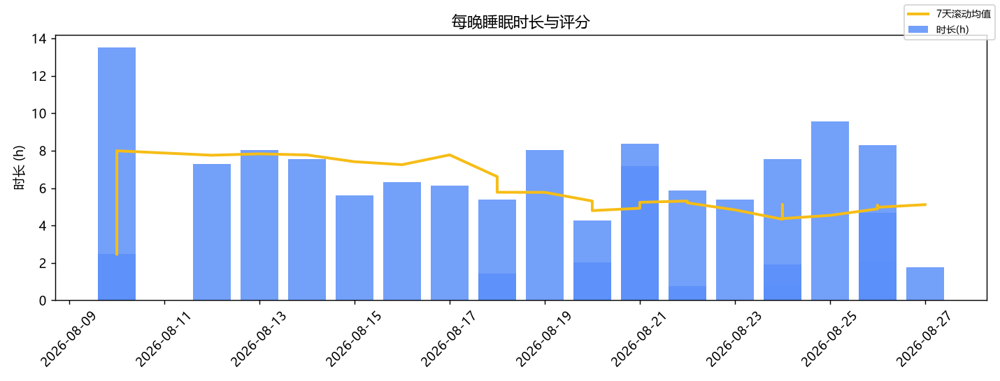
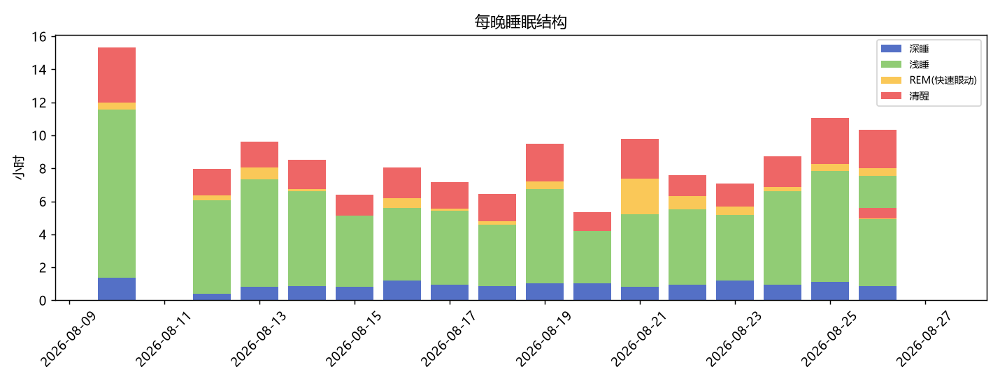
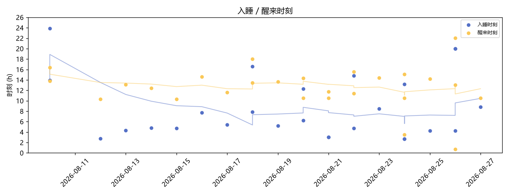

# 睡眠与运动分析报告

> 报告区间：2026-08-26 晚 ~ 2026-08-27 早 ｜ 生成时间：2026-08-27 23:00 ｜ 数据源：小米运动健康（米桥本地库）

## 昨晚作息详情

- **入睡**：08:47（2026-08-27）
- **醒来**：10:32（2026-08-27）
- **床上时长**：1h45m
- **实际睡着**：1h45m
- **夜间清醒**：0min

## 二、睡眠基础指标
- 共 **17 个睡眠日**（2026-08-10 ~ 2026-08-27），每天昼息+午休已合并；短眠日(<6h) **3 天**，低分日(<60) **0 天**

| 指标 | 均值 | 中位数 | 标准差 | 最小 | 最大 | P10 | P90 |
| --- | --- | --- | --- | --- | --- | --- | --- |
| 总时长(分钟) | 473.59 | 437 | 196.73 | 105 | 959 | 331.2 | 705.0 |
| 实际睡着(分钟) | 453.06 | 421 | 191.87 | 105 | 933 | 318.8 | 679.8 |
| 睡眠评分 | — | — | — | — | — | — | — |
| 入睡时刻(小时) | 5.02 | 5.02 | 2.26 | 2.72 | 23.85 | — | — |
| 醒来时刻(小时) | 12.33 | 12.33 | 1.53 | 10.3 | 14.63 | — | — |
| 睡眠效率(%) | 95.66 | 96.35 | 3.55 | 87.91 | 100.0 | 90.62 | 100.0 |

### 睡眠结构（各阶段占睡着时间比例）
| 阶段 | 平均占比 | 波动(标准差) | 参考区间 |
|---|---|---|---|
| 深睡 | 11.3% | ±4.3% | 15–25% |
| 浅睡 | 58.9% | ±15.4% | 45–55% |
| REM(快速眼动) | 3.8% | ±2.9% | 20–25% |
| 清醒 | 20.1% | ±5.7% | <5% |

## 三、作息规律性
- 入睡时间漂移（标准差）：**2.26 h**（<0.5h 很规律，>1h 较混乱）
- 醒来时间漂移：**1.53 h**
- **社交时差**：周末比工作日晚睡 **1.85 h**（工作日 4.57h 入睡 / 周末 6.41h 入睡）
- 时间趋势：平均时长后半段比前半段缩短 **8 分钟**
- 最近 7 晚：时长 **8h01m**，入睡 **5.07h**

## 四、睡眠 × 活动联动
_样本不足，暂无可用的联动分析_
## 五、运动概况
- 共 **1** 次运动（2026-08-27 ~ 2026-08-27），约 **1.0 次/周**
- 类型分布：running×1
- 累计距离 **2.8 km**，累计消耗 **161 kcal**
- 每周运动分钟：2026 第35周 19min

## 六、图表

---
*本报告由 analyze.py 自动生成；完整数值见 analysis JSON 文件。*