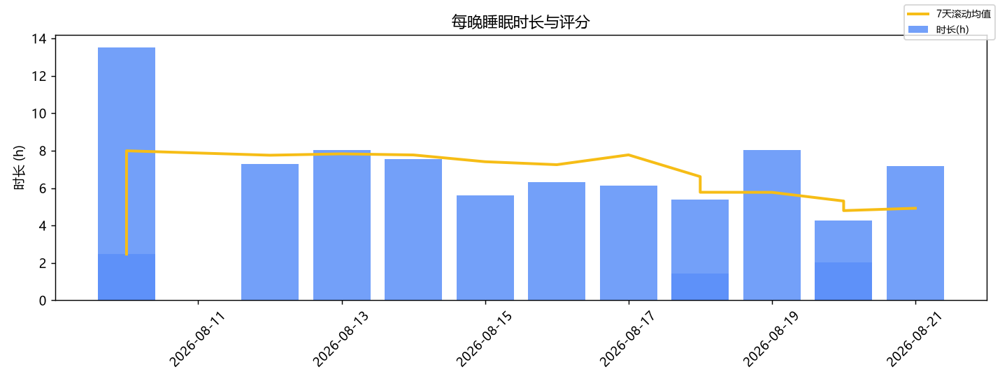
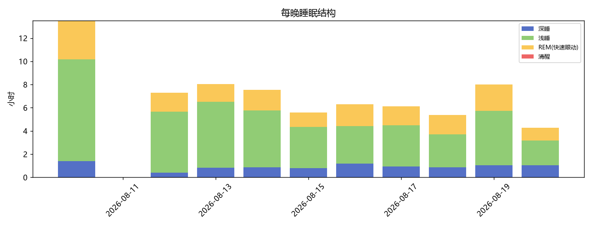
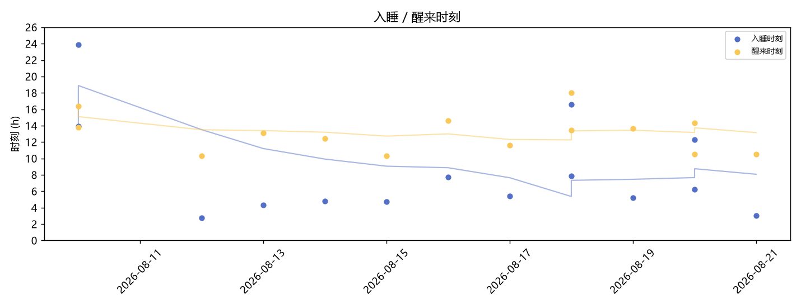
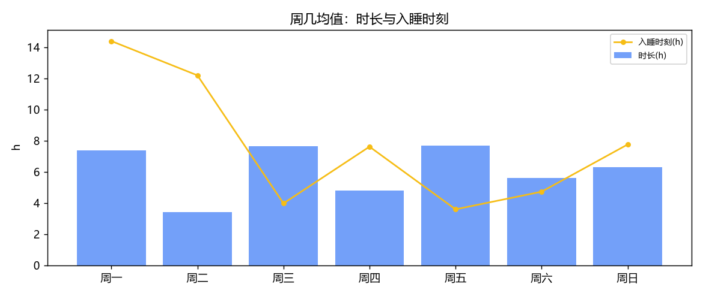

# 睡眠与运动分析报告

> 生成时间：2026-08-20 22:25 ｜ 数据源：小米运动健康（米桥本地库）

## 一、数据覆盖概览
| 类型 | 起始 | 截止 | 有数据天数 |
|---|---|---|---|
| 睡眠 | 2026-08-10 | 2026-08-20 | 11 |
| 每日活动 | 2026-08-10 | 2026-08-20 | 11 |
| 运动 | — | — | 0 |
| 心率 | 2026-08-10 | 2026-08-20 | 11 |
| 血氧 | — | — | 0 |
| 压力 | — | — | 0 |
| 体重 | 2026-08-11 | 2026-08-11 | 1 |

## 二、睡眠基础指标
- 主睡眠共 **13 晚**（2026-08-10 ~ 2026-08-20），午睡 0 次；短睡夜(<6h) **6 晚**，低分夜(<60) **0 晚**
- 夜间平均心率：**57.2 bpm**

| 指标 | 均值 | 中位数 | 标准差 | 最小 | 最大 | P10 | P90 |
| --- | --- | --- | --- | --- | --- | --- | --- |
| 总时长(分钟) | 360.08 | 368 | 183.48 | 86 | 811 | 126.4 | 482.6 |
| 实际睡着(分钟) | 346.62 | 343 | 174.41 | 86 | 785 | 126.4 | 452.2 |
| 睡眠评分 | — | — | — | — | — | — | — |
| 入睡时刻(小时) | 6.01 | 6.01 | 4.41 | 2.75 | 23.85 | — | — |
| 醒来时刻(小时) | 13.21 | 13.21 | 2.23 | 10.3 | 17.98 | — | — |
| 睡眠效率(%) | 97.05 | 98.1 | 3.2 | 90.74 | 100.0 | 91.59 | 100.0 |

### 睡眠结构（各阶段占睡着时间比例）
| 阶段 | 平均占比 | 波动(标准差) | 参考区间 |
|---|---|---|---|
| 深睡 | 10.7% | ±7.3% | 15–25% |
| 浅睡 | 46.7% | ±26.4% | 45–55% |
| REM(快速眼动) | 19.6% | ±11.2% | 20–25% |
| 清醒 | 0.0% | ±0.0% | <5% |

## 三、作息规律性
- 入睡时间漂移（标准差）：**4.41 h**（<0.5h 很规律，>1h 较混乱）
- 醒来时间漂移：**2.23 h**
- **社交时差**：周末比工作日晚睡 **0.31 h**（工作日 5.92h 入睡 / 周末 6.23h 入睡）
- 时间趋势：平均时长后半段比前半段缩短 **157 分钟**
- 最近 7 晚：时长 **4h47m**，入睡 **7.84h**

## 四、睡眠 × 活动联动
_样本不足，暂无可用的联动分析_
## 五、运动概况
_无运动记录_
## 六、图表

---
*本报告由 analyze.py 自动生成；完整数值见 analysis JSON 文件。*